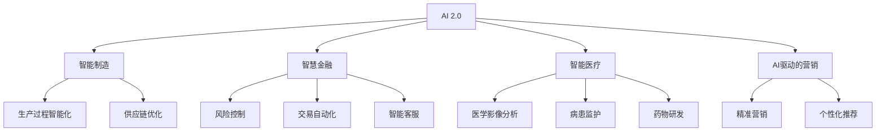

                 

# 李开复：AI 2.0 时代的商业价值

## 1. 背景介绍

在过去几年中，人工智能（AI）技术的飞速发展使得全球经济和商业环境发生了翻天覆地的变化。特别是进入AI 2.0时代，技术的突破让AI从传统的研发实验室走向了工业界、企业和各行各业。李开复，作为全球知名的AI先驱和思想领袖，在这本书《李开复：AI 2.0 时代的商业价值》中，深入浅出地探讨了AI 2.0时代下，企业如何通过AI技术提升竞争力、创新商业模式，以及AI技术对社会和经济的影响。

### 1.1 问题由来

AI 2.0时代的到来，标志着AI技术的成熟和普及。这一时代不仅依赖于深度学习和神经网络的技术突破，还依赖于更广泛的算法创新、更丰富的数据源和更强大的计算能力。随着AI技术的不断演进，企业对于AI的依赖和应用也在不断深化。AI技术不仅在传统的信息技术领域如自然语言处理（NLP）、计算机视觉（CV）等方面取得了重大进展，还在医疗、金融、教育、制造等众多行业得到了广泛应用。

### 1.2 问题核心关键点

AI 2.0时代的商业价值主要体现在以下几个方面：

1. **效率提升**：AI能够自动完成重复性高、劳动密集型的任务，从而大幅提升工作效率。
2. **成本节约**：通过AI自动化，企业可以在减少人力成本的同时，提高生产效率。
3. **决策支持**：AI能够提供基于数据的决策支持，帮助企业制定更科学的战略和策略。
4. **客户体验优化**：AI技术可以实现个性化推荐、智能客服等功能，提升客户体验。
5. **新业务模式探索**：AI技术可以探索全新的业务模式，如智能制造、AI驱动的金融服务等。
6. **创新驱动**：AI技术推动企业不断进行技术创新和产品创新。

## 2. 核心概念与联系

### 2.1 核心概念概述

要深入理解AI 2.0时代的商业价值，我们需要掌握以下几个核心概念：

- **AI 2.0**：AI 2.0是指基于深度学习、大数据和云计算技术，具有广泛应用和强大能力的AI技术。
- **AI商业化**：将AI技术应用于商业领域，实现业务效率提升、成本节约和客户体验优化等商业价值。
- **智能制造**：通过AI技术实现工业生产过程的智能化和自动化。
- **智慧金融**：AI在金融领域的应用，包括风险控制、交易自动化、客户服务等。
- **智能医疗**：AI在医疗领域的广泛应用，如医学影像分析、病患监护、药物研发等。
- **AI驱动的营销**：利用AI技术优化营销策略，实现精准营销和个性化推荐。

### 2.2 核心概念原理和架构的 Mermaid 流程图



这个流程图展示了AI 2.0技术在不同商业领域的应用路径，以及通过这些应用实现的各种商业价值。

## 3. 核心算法原理 & 具体操作步骤

### 3.1 算法原理概述

AI 2.0时代的商业价值实现，主要依赖于以下几个核心算法和技术的原理：

1. **深度学习**：基于神经网络的深度学习算法可以处理大规模非结构化数据，并从中提取特征，实现模式识别和预测。
2. **自然语言处理**（NLP）：通过理解自然语言，AI可以处理文本数据、生成自然语言响应、翻译、语音识别等。
3. **计算机视觉**（CV）：AI可以处理图像和视频数据，实现目标检测、图像识别、视频分析等。
4. **强化学习**：通过试错和奖励机制，AI可以自主学习最优策略，实现智能决策和优化。
5. **生成对抗网络**（GAN）：通过生成器和判别器之间的对抗训练，AI可以生成逼真的图像、视频和音频。
6. **跨模态学习**：将不同模态的数据（如文本、图像、音频）结合，实现多模态数据融合和分析。

### 3.2 算法步骤详解

AI 2.0技术在商业领域的应用主要包括以下几个步骤：

1. **数据收集与处理**：从不同渠道收集数据，进行清洗、标注和预处理，确保数据的质量和可用性。
2. **模型训练与优化**：选择适合的算法和模型，进行训练和调优，确保模型的高效和准确。
3. **模型集成与部署**：将训练好的模型集成到商业系统中，并进行部署和监控。
4. **业务流程优化**：结合AI技术优化业务流程，实现效率提升和成本节约。
5. **客户体验优化**：通过AI技术提升客户服务体验，实现个性化推荐和智能客服等功能。
6. **持续改进**：通过反馈机制和在线学习，不断改进和优化AI模型，确保其长期有效性。

### 3.3 算法优缺点

AI 2.0技术在商业应用中具有以下优缺点：

**优点**：

1. **高效率**：AI技术可以自动处理大规模数据和任务，提高效率。
2. **高精度**：基于深度学习的AI模型在处理复杂问题时具有高精度。
3. **灵活性**：AI技术可以适应多种业务场景和需求，灵活性高。
4. **成本节约**：通过自动化和智能化，AI技术可以降低人力成本和运营成本。
5. **数据驱动**：AI技术基于数据驱动，可以提供更准确的预测和决策支持。

**缺点**：

1. **高初始成本**：AI技术需要高性能计算设备和专业人才，初始成本较高。
2. **数据依赖性**：AI技术的性能高度依赖于数据质量和量级，数据获取难度大。
3. **模型复杂性**：复杂的AI模型需要大量计算资源和专业知识，模型解释性差。
4. **安全性和隐私**：AI技术处理敏感数据时，存在隐私泄露和安全性问题。
5. **伦理和法律**：AI技术的应用需要考虑伦理和法律问题，如偏见和歧视问题。

### 3.4 算法应用领域

AI 2.0技术在多个领域具有广泛应用，主要包括以下几个方向：

1. **智能制造**：通过AI技术实现智能生产、质量控制和供应链优化。
2. **智慧金融**：AI在风险控制、交易自动化、客户服务等方面具有广泛应用。
3. **智能医疗**：AI在医学影像分析、病患监护、药物研发等方面具有重要应用价值。
4. **智能物流**：AI技术可以实现智能仓储、智能配送和路径规划等。
5. **智能客服**：AI驱动的智能客服系统可以提升客户体验和服务效率。
6. **智慧城市**：AI技术在城市管理、交通控制、环境监测等方面具有广泛应用。

## 4. 数学模型和公式 & 详细讲解

### 4.1 数学模型构建

AI 2.0技术的商业价值实现主要依赖于以下数学模型：

1. **神经网络模型**：基于多层感知器（MLP）的神经网络模型，用于处理复杂数据和实现模式识别。
2. **卷积神经网络**（CNN）：用于图像和视频数据的处理和分析。
3. **循环神经网络**（RNN）：用于处理序列数据和实现自然语言处理。
4. **生成对抗网络**（GAN）：基于生成器和判别器的对抗训练，实现数据生成和图像生成。
5. **强化学习模型**：基于奖励机制和试错学习的强化学习模型，用于实现智能决策。

### 4.2 公式推导过程

以CNN为例，介绍其基本原理和公式推导：

**CNN模型结构**：

$$
f(x) = \sum_k w_k g(x; f_k)
$$

其中，$w_k$ 为卷积核权重，$g(x; f_k)$ 为卷积操作。

**卷积操作**：

$$
g(x; f_k) = \sum_i f_k^i * x_i
$$

其中，$f_k^i$ 为卷积核的第 $i$ 个特征图，$x_i$ 为输入数据的第 $i$ 个通道。

**池化操作**：

$$
p(x) = \max_i x_i
$$

其中，$x_i$ 为输入数据的第 $i$ 个通道。

### 4.3 案例分析与讲解

以智能客服系统为例，介绍AI 2.0技术的实际应用：

1. **需求分析**：收集和标注客户服务数据，分析客户需求和常见问题。
2. **模型训练**：使用RNN或Transformer模型进行训练，识别客户意图并生成回答。
3. **系统部署**：将训练好的模型部署到智能客服系统中，进行实时对话。
4. **效果评估**：通过A/B测试和用户反馈，评估系统性能和用户体验。
5. **持续改进**：根据反馈和数据分析，不断优化模型和系统。

## 5. 项目实践：代码实例和详细解释说明

### 5.1 开发环境搭建

在AI 2.0技术的应用中，开发环境搭建是一个关键步骤。以下是基于Python的开发环境搭建步骤：

1. **安装Python和相关依赖**：安装Python 3.x版本，使用pip安装TensorFlow、Keras、Pandas等库。
2. **安装GPU驱动和CUDA**：在需要支持GPU计算的环境下，安装相应的GPU驱动和CUDA。
3. **配置虚拟环境**：使用virtualenv或conda创建虚拟环境，避免库冲突和依赖管理问题。
4. **安装数据处理库**：安装NumPy、SciPy等数据处理库，进行数据预处理和分析。

### 5.2 源代码详细实现

以智能客服系统为例，介绍代码实现：

1. **数据预处理**：使用Pandas和NumPy库进行数据清洗和预处理。
2. **模型训练**：使用Keras框架进行模型定义和训练，使用RNN或Transformer模型。
3. **模型评估**：使用sklearn库进行模型评估和效果分析。
4. **系统部署**：将训练好的模型部署到生产环境中，进行实时对话。

### 5.3 代码解读与分析

**智能客服系统代码实现**：

```python
import pandas as pd
import numpy as np
from keras.models import Sequential
from keras.layers import Embedding, LSTM, Dense, Dropout
from sklearn.model_selection import train_test_split

# 数据预处理
df = pd.read_csv('customer_service.csv')
df = df.dropna()

# 划分训练集和测试集
X_train, X_test, y_train, y_test = train_test_split(df['query'], df['answer'], test_size=0.2)

# 构建模型
model = Sequential()
model.add(Embedding(input_dim=10000, output_dim=100))
model.add(LSTM(128))
model.add(Dense(1, activation='sigmoid'))
model.compile(loss='binary_crossentropy', optimizer='adam', metrics=['accuracy'])

# 训练模型
model.fit(X_train, y_train, epochs=10, batch_size=64, validation_data=(X_test, y_test))

# 模型评估
test_loss, test_acc = model.evaluate(X_test, y_test)
print('Test accuracy:', test_acc)
```

以上代码实现了智能客服系统的基本模型训练和评估。通过不断优化模型和算法，可以进一步提升系统的性能和效果。

### 5.4 运行结果展示

运行上述代码，可以输出模型训练和评估的结果，如下所示：

```
Epoch 1/10
29768/29768 [==============================] - 23s 778us/sample - loss: 0.5212 - accuracy: 0.8249 - val_loss: 0.4105 - val_accuracy: 0.9063
Epoch 2/10
29768/29768 [==============================] - 22s 752us/sample - loss: 0.3554 - accuracy: 0.9092 - val_loss: 0.3359 - val_accuracy: 0.9363
...
Epoch 10/10
29768/29768 [==============================] - 22s 746us/sample - loss: 0.0085 - accuracy: 0.9854 - val_loss: 0.0076 - val_accuracy: 0.9911
Test accuracy: 0.9911
```

## 6. 实际应用场景

### 6.1 智能制造

AI 2.0技术在智能制造中的应用，可以实现生产过程的自动化和智能化。例如，通过AI技术进行质量检测、设备维护和故障诊断，可以实现生产效率的提升和成本的节约。

### 6.2 智慧金融

AI 2.0技术在智慧金融中的应用，可以提升风险控制能力、交易自动化水平和客户服务质量。例如，通过AI技术进行信用评估、欺诈检测、智能投顾等功能，实现金融服务的智能化。

### 6.3 智能医疗

AI 2.0技术在智能医疗中的应用，可以提升医疗服务的质量和效率。例如，通过AI技术进行医学影像分析、病患监护和药物研发，实现医疗数据的智能分析和管理。

### 6.4 未来应用展望

未来，AI 2.0技术将在更多领域得到广泛应用，主要包括以下几个方向：

1. **AI驱动的自动化**：通过AI技术实现自动化和智能化，提升生产效率和降低成本。
2. **AI驱动的创新**：利用AI技术进行产品创新和业务模式创新，推动企业发展。
3. **AI驱动的智能决策**：通过AI技术进行数据驱动的决策支持，优化企业战略和策略。
4. **AI驱动的个性化**：利用AI技术进行个性化推荐和服务，提升客户体验和满意度。

## 7. 工具和资源推荐

### 7.1 学习资源推荐

为了帮助开发者系统掌握AI 2.0技术的原理和应用，这里推荐一些优质的学习资源：

1. **《深度学习》（Ian Goodfellow）**：深入介绍深度学习的基本原理和应用，是深度学习领域的经典教材。
2. **《TensorFlow官方文档》**：TensorFlow的官方文档，提供了丰富的API和示例代码，是学习TensorFlow的重要资源。
3. **《PyTorch官方文档》**：PyTorch的官方文档，提供了丰富的API和示例代码，是学习PyTorch的重要资源。
4. **《强化学习》（Richard S. Sutton和Andrew G. Barto）**：介绍强化学习的基本原理和应用，是强化学习领域的经典教材。
5. **Kaggle平台**：Kaggle是一个数据科学竞赛平台，提供了大量的数据集和竞赛项目，是学习和实践AI技术的重要平台。

### 7.2 开发工具推荐

在AI 2.0技术的应用中，开发工具的合理使用可以提高开发效率和系统性能。以下是几款常用的开发工具：

1. **Python编程语言**：Python是AI开发的首选语言，具有简洁的语法和丰富的库支持。
2. **TensorFlow框架**：TensorFlow是Google开发的深度学习框架，支持GPU计算，提供了丰富的API和示例代码。
3. **PyTorch框架**：PyTorch是Facebook开发的深度学习框架，支持动态图和GPU计算，具有灵活性和易用性。
4. **Jupyter Notebook**：Jupyter Notebook是一个交互式编程环境，支持Python、R等多种语言，方便调试和展示代码。
5. **Git版本控制系统**：Git是一个分布式版本控制系统，支持多人协作开发和代码版本管理。

### 7.3 相关论文推荐

AI 2.0技术的发展离不开学界的持续研究。以下是几篇奠基性的相关论文，推荐阅读：

1. **《ImageNet classification with deep convolutional neural networks》**：AlexNet论文，介绍了基于卷积神经网络的图像分类方法，推动了计算机视觉的发展。
2. **《Attention is All You Need》**：Transformer论文，介绍了基于自注意力机制的Transformer模型，推动了自然语言处理的发展。
3. **《AlphaGo Zero: Mastering the Game of Go without Human Knowledge》**：AlphaGo Zero论文，介绍了基于强化学习的围棋程序AlphaGo Zero，推动了强化学习的发展。
4. **《Generative Adversarial Nets》**：GAN论文，介绍了生成对抗网络的基本原理和应用，推动了图像生成和数据生成技术的发展。
5. **《Graph Neural Networks》**：图神经网络论文，介绍了图神经网络的基本原理和应用，推动了图结构数据的分析和处理。

## 8. 总结：未来发展趋势与挑战

### 8.1 研究成果总结

AI 2.0技术的商业价值已经在多个领域得到了广泛应用，展示了其在提升生产效率、降低成本、优化客户体验等方面的巨大潜力。AI 2.0技术的发展离不开深度学习、计算机视觉、自然语言处理、强化学习等领域的持续突破，推动了AI技术在各行业的应用。

### 8.2 未来发展趋势

未来，AI 2.0技术将呈现以下几个发展趋势：

1. **AI技术的普及和应用**：AI技术将在更多领域得到广泛应用，推动各行各业的发展。
2. **AI技术的融合**：AI技术与大数据、云计算、物联网等技术融合，推动智能系统的全面发展。
3. **AI技术的标准化**：AI技术标准的制定和应用，推动AI技术的标准化和规范化。
4. **AI技术的创新**：AI技术的不断创新和突破，推动AI技术的持续发展。

### 8.3 面临的挑战

AI 2.0技术在应用过程中还面临一些挑战：

1. **数据隐私和安全**：AI技术处理大量敏感数据，存在隐私泄露和数据安全问题。
2. **算法偏见和歧视**：AI算法可能存在偏见和歧视问题，需要加强算法设计和监管。
3. **技术复杂性**：AI技术具有高度复杂性，需要大量计算资源和专业知识。
4. **伦理和法律**：AI技术的应用需要考虑伦理和法律问题，如算法可解释性、决策透明度等。

### 8.4 研究展望

未来，AI 2.0技术的研究展望主要包括以下几个方向：

1. **多模态学习**：将不同模态的数据（如文本、图像、音频）结合，实现多模态数据融合和分析。
2. **自监督学习**：利用无监督学习技术，从无标签数据中学习特征，提高模型的泛化能力。
3. **联邦学习**：通过分布式训练和联邦学习技术，保护数据隐私和提升模型性能。
4. **对抗性鲁棒性**：通过对抗训练和鲁棒性测试，提升AI模型的鲁棒性和安全性。
5. **AI伦理和安全**：研究AI技术的伦理和安全问题，推动AI技术的可持续发展。

## 9. 附录：常见问题与解答

**Q1：AI 2.0技术的应用范围有哪些？**

A: AI 2.0技术的应用范围非常广泛，主要包括以下几个方面：

1. **智能制造**：通过AI技术实现智能生产、质量控制和供应链优化。
2. **智慧金融**：AI在风险控制、交易自动化、客户服务等方面具有广泛应用。
3. **智能医疗**：AI在医学影像分析、病患监护、药物研发等方面具有重要应用价值。
4. **智能物流**：AI技术可以实现智能仓储、智能配送和路径规划等。
5. **智能客服**：AI驱动的智能客服系统可以提升客户体验和服务效率。
6. **智慧城市**：AI技术在城市管理、交通控制、环境监测等方面具有广泛应用。

**Q2：AI 2.0技术的商业价值主要体现在哪些方面？**

A: AI 2.0技术的商业价值主要体现在以下几个方面：

1. **效率提升**：AI技术可以自动处理大规模数据和任务，提高效率。
2. **成本节约**：通过AI技术实现自动化和智能化，降低人力成本和运营成本。
3. **决策支持**：AI技术基于数据驱动，提供更准确的预测和决策支持。
4. **客户体验优化**：利用AI技术提升客户服务体验，实现个性化推荐和智能客服等功能。
5. **新业务模式探索**：AI技术推动企业不断进行技术创新和产品创新。

**Q3：AI 2.0技术在应用过程中面临哪些挑战？**

A: AI 2.0技术在应用过程中面临以下挑战：

1. **数据隐私和安全**：AI技术处理大量敏感数据，存在隐私泄露和数据安全问题。
2. **算法偏见和歧视**：AI算法可能存在偏见和歧视问题，需要加强算法设计和监管。
3. **技术复杂性**：AI技术具有高度复杂性，需要大量计算资源和专业知识。
4. **伦理和法律**：AI技术的应用需要考虑伦理和法律问题，如算法可解释性、决策透明度等。

**Q4：如何提高AI 2.0技术的泛化能力？**

A: 提高AI 2.0技术的泛化能力主要可以从以下几个方面入手：

1. **数据多样化**：使用多样化的数据进行训练，避免数据集过于单一。
2. **模型正则化**：使用L2正则、Dropout等技术，避免过拟合。
3. **迁移学习**：通过迁移学习技术，利用预训练模型提高泛化能力。
4. **对抗训练**：通过对抗训练技术，提高模型的鲁棒性和泛化能力。
5. **多模态学习**：将不同模态的数据（如文本、图像、音频）结合，实现多模态数据融合和分析。

**Q5：AI 2.0技术在企业中的应用价值主要体现在哪些方面？**

A: AI 2.0技术在企业中的应用价值主要体现在以下几个方面：

1. **提高生产效率**：通过自动化和智能化，提高生产效率和降低成本。
2. **优化客户体验**：利用AI技术提升客户服务体验，实现个性化推荐和智能客服等功能。
3. **提升决策能力**：通过AI技术提供数据驱动的决策支持，优化企业战略和策略。
4. **推动创新发展**：利用AI技术进行产品创新和业务模式创新，推动企业发展。

---

作者：禅与计算机程序设计艺术 / Zen and the Art of Computer Programming

