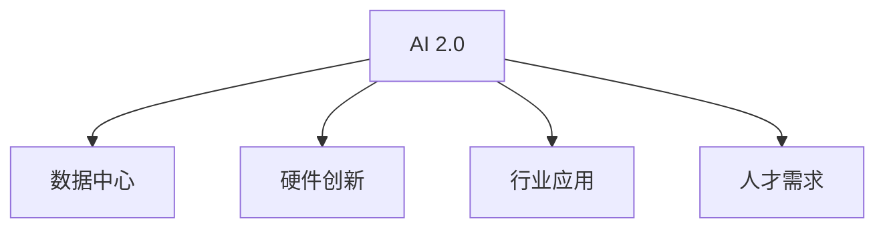

                 

# 李开复：AI 2.0 时代的市场前景

> 关键词：AI 2.0, 市场前景, 技术驱动, 行业应用, 数据中心, 硬件创新, 人才需求

## 1. 背景介绍

### 1.1 问题由来
在过去的十年中，人工智能（AI）技术取得了迅猛的发展，从语音识别、图像处理到自然语言处理，AI 已经在多个领域实现了突破。然而，这些突破主要集中在AI 1.0时代，即基于规则和专家的知识进行编程的阶段。随着数据量的爆炸式增长和算力的显著提升，AI 2.0时代的到来，即以数据和算法为驱动的新阶段，正在彻底改变我们的生活方式和商业模式。

### 1.2 问题核心关键点
AI 2.0时代的核心关键点在于数据、算法和计算力的深度融合。通过大量数据的积累和先进的算法设计，AI 能够从数据中学习到复杂的模式和规律，实现自学习和自适应。这种自适应能力使得AI 在各种领域中展现出前所未有的应用潜力，从医疗、金融到教育、娱乐，几乎所有行业都在逐渐被AI 所改变。

### 1.3 问题研究意义
研究AI 2.0时代市场前景，对于理解AI 技术的发展趋势、把握行业应用方向以及规划人才和技术需求具有重要意义。AI 2.0不仅将为传统行业带来颠覆性的变革，也将创造新的商业机会和经济增长点。

## 2. 核心概念与联系

### 2.1 核心概念概述

为了更好地理解AI 2.0时代，本节将介绍几个关键概念：

- AI 2.0：基于数据和算法进行自学习和自适应的新阶段。与AI 1.0相比，AI 2.0更加依赖于数据和计算资源，具有更强的泛化能力和适应性。

- 数据中心：AI 2.0时代的数据存储和计算中心。数据中心不仅需要处理海量数据，还需要提供强大的计算能力支持深度学习模型的训练和推理。

- 硬件创新：AI 2.0时代对硬件提出了更高的要求，如GPU、TPU等专用芯片，以及分布式计算架构，以加速模型训练和推理。

- 行业应用：AI 2.0技术在各个行业中的应用，包括医疗、金融、教育、制造等。这些应用展示了AI 技术的广泛影响力和巨大商业价值。

- 人才需求：AI 2.0时代需要大量具有跨学科知识背景的人才，包括数据科学家、算法工程师、系统架构师等。同时，还需要对AI 伦理和安全有深刻理解的人才。

这些核心概念之间的逻辑关系可以通过以下Mermaid流程图来展示：



这个流程图展示了大语言模型的核心概念及其之间的关系：

1. AI 2.0通过数据中心的支持，结合硬件创新，实现了在行业中的应用。
2. AI 2.0时代对人才的需求涵盖了从数据科学到系统架构的各个方面。
3. 这些要素共同构成了AI 2.0的发展框架，推动了AI 技术在多个领域的广泛应用。

## 3. 核心算法原理 & 具体操作步骤
### 3.1 算法原理概述

AI 2.0时代的主要算法原理是基于深度学习和强化学习的自适应模型。深度学习通过构建多层神经网络，从大量数据中学习到复杂的特征表示，实现对数据的自适应建模。强化学习通过与环境互动，不断优化决策策略，实现对复杂环境的自适应适应。

具体而言，AI 2.0算法主要包括：

- 深度神经网络：包括卷积神经网络（CNN）、递归神经网络（RNN）、Transformer等，用于图像、文本和语音等数据的处理。
- 强化学习：如Q-learning、策略梯度等，用于自主学习最优决策策略，应用于自动驾驶、游戏AI等领域。
- 自监督学习：利用未标注数据进行预训练，学习数据的潜在表示，应用于图像生成、自然语言理解等领域。

### 3.2 算法步骤详解

AI 2.0算法的核心步骤主要包括数据预处理、模型训练、模型评估和模型应用。具体步骤如下：

**Step 1: 数据预处理**
- 收集和整理数据集，并进行清洗、标注和归一化等预处理操作。
- 对于图像和视频数据，进行裁剪、缩放、归一化等预处理操作。
- 对于文本数据，进行分词、词向量化、标签编码等预处理操作。

**Step 2: 模型训练**
- 选择合适的深度学习模型，如CNN、RNN、Transformer等。
- 定义损失函数和优化器，如交叉熵损失、AdamW优化器等。
- 将预处理后的数据输入模型，进行前向传播和反向传播计算，更新模型参数。

**Step 3: 模型评估**
- 使用验证集对模型进行评估，计算准确率、召回率、F1-score等指标。
- 调整模型参数，如学习率、批量大小、迭代轮数等，以优化模型性能。

**Step 4: 模型应用**
- 将训练好的模型部署到实际应用中，进行推理和预测。
- 对于新数据，输入模型进行前向传播计算，输出预测结果。
- 对于实时数据流，使用在线学习技术，不断更新模型参数，适应新的数据分布。

### 3.3 算法优缺点

AI 2.0算法的优点在于：

1. 强大的自适应能力：通过大量数据和先进算法，能够自适应复杂的现实环境，解决传统方法难以解决的问题。
2. 高效的计算能力：深度学习模型可以通过分布式计算和并行计算，实现高效的数据处理和模型训练。
3. 广泛的应用领域：AI 2.0技术在医疗、金融、教育、制造等多个领域都有广泛应用，展示了巨大的商业价值。

然而，AI 2.0算法也存在一些缺点：

1. 数据依赖性：AI 2.0算法对数据的依赖性较强，数据质量会直接影响模型性能。
2. 计算资源需求高：深度学习模型需要大量的计算资源支持，硬件成本较高。
3. 可解释性不足：AI 2.0模型的决策过程往往是"黑盒"，难以解释和调试。
4. 伦理和安全问题：AI 2.0模型可能会学习到偏见和有害信息，产生误导性输出，需要重视伦理和安全问题。

### 3.4 算法应用领域

AI 2.0算法在多个领域都有广泛应用，具体包括：

- 医疗诊断：通过图像识别和自然语言处理技术，辅助医生进行疾病诊断和治疗。
- 金融风控：利用深度学习和强化学习技术，进行风险评估和欺诈检测。
- 自动驾驶：通过图像和传感器数据处理，实现车辆的自主导航和安全驾驶。
- 智能客服：利用自然语言理解和生成技术，提升客户服务体验。
- 教育推荐：通过个性化推荐技术，提升学习效果和学生满意度。
- 智能家居：通过语音识别和自然语言处理技术，实现家庭设备的智能控制。

除了上述这些应用外，AI 2.0技术还在越来越多的领域中展现出其强大的应用潜力，如智能制造、智能交通、智慧城市等，为各行各业带来了新的变革和机遇。

## 4. 数学模型和公式 & 详细讲解  
### 4.1 数学模型构建

AI 2.0算法通常使用深度神经网络模型进行构建。以卷积神经网络（CNN）为例，其核心数学模型为：

$$
y = \mathcal{H}(Wx + b)
$$

其中，$x$ 为输入数据，$y$ 为输出结果，$W$ 为权重矩阵，$b$ 为偏置项，$\mathcal{H}$ 为激活函数。

### 4.2 公式推导过程

对于卷积神经网络，其前向传播和反向传播过程可以通过以下公式推导：

**前向传播**

$$
z_{i,j}^{(l+1)} = W^{(l+1)}z^{(l)} + b^{(l+1)}
$$

其中，$z^{(l)}$ 为第 $l$ 层的输入，$z_{i,j}^{(l+1)}$ 为第 $l+1$ 层的卷积输出，$W^{(l+1)}$ 为第 $l+1$ 层的权重矩阵，$b^{(l+1)}$ 为第 $l+1$ 层的偏置项。

**反向传播**

$$
\frac{\partial \mathcal{L}}{\partial W^{(l+1)}} = \frac{\partial \mathcal{L}}{\partial z^{(l+1)}} \cdot \frac{\partial z^{(l+1)}}{\partial W^{(l+1)}}
$$

其中，$\frac{\partial \mathcal{L}}{\partial z^{(l+1)}}$ 为损失函数对卷积输出 $z^{(l+1)}$ 的梯度，$\frac{\partial z^{(l+1)}}{\partial W^{(l+1)}}$ 为卷积输出对权重矩阵的梯度。

### 4.3 案例分析与讲解

以图像分类任务为例，分析卷积神经网络在数据处理和模型训练中的应用。

**数据处理**

对于图像数据，首先进行预处理操作，如裁剪、缩放、归一化等。然后，将图像数据输入卷积神经网络进行特征提取，输出卷积特征图。卷积特征图经过池化操作，减少特征图的大小，提高计算效率。

**模型训练**

在卷积神经网络中，定义损失函数和优化器，如交叉熵损失和AdamW优化器。将预处理后的图像数据输入模型，进行前向传播和反向传播计算，更新模型参数。通过多次迭代训练，模型逐渐学习到图像特征和分类规则，输出准确率逐渐提高。

## 5. 项目实践：代码实例和详细解释说明
### 5.1 开发环境搭建

在进行AI 2.0项目实践前，我们需要准备好开发环境。以下是使用Python进行TensorFlow开发的环境配置流程：

1. 安装Anaconda：从官网下载并安装Anaconda，用于创建独立的Python环境。

2. 创建并激活虚拟环境：
```bash
conda create -n tf-env python=3.8 
conda activate tf-env
```

3. 安装TensorFlow：根据CUDA版本，从官网获取对应的安装命令。例如：
```bash
conda install tensorflow -c tf
```

4. 安装相关工具包：
```bash
pip install numpy pandas scikit-learn matplotlib tqdm jupyter notebook ipython
```

完成上述步骤后，即可在`tf-env`环境中开始AI 2.0项目实践。

### 5.2 源代码详细实现

这里我们以图像分类任务为例，给出使用TensorFlow对卷积神经网络进行训练的Python代码实现。

```python
import tensorflow as tf
from tensorflow.keras import layers, models
from tensorflow.keras.datasets import mnist
from tensorflow.keras.utils import to_categorical

# 加载MNIST数据集
(x_train, y_train), (x_test, y_test) = mnist.load_data()

# 预处理数据
x_train = x_train.reshape((-1, 28, 28, 1)).astype('float32') / 255.0
x_test = x_test.reshape((-1, 28, 28, 1)).astype('float32') / 255.0
y_train = to_categorical(y_train, num_classes=10)
y_test = to_categorical(y_test, num_classes=10)

# 定义模型
model = models.Sequential([
    layers.Conv2D(32, kernel_size=(3, 3), activation='relu', input_shape=(28, 28, 1)),
    layers.MaxPooling2D(pool_size=(2, 2)),
    layers.Flatten(),
    layers.Dense(128, activation='relu'),
    layers.Dense(10, activation='softmax')
])

# 编译模型
model.compile(optimizer='adam', loss='categorical_crossentropy', metrics=['accuracy'])

# 训练模型
model.fit(x_train, y_train, epochs=10, batch_size=64, validation_data=(x_test, y_test))
```

这段代码实现了基于TensorFlow的卷积神经网络模型，用于图像分类任务。具体实现步骤如下：

**加载数据集**

使用TensorFlow的`mnist.load_data()`方法，加载MNIST数据集，并对其进行预处理操作，包括数据格式转换和归一化。

**定义模型**

使用`tf.keras.Sequential`构建卷积神经网络模型，包括卷积层、池化层、全连接层等。

**编译模型**

使用`model.compile()`方法，定义损失函数、优化器和评价指标，编译模型。

**训练模型**

使用`model.fit()`方法，对模型进行训练，设置训练轮数、批量大小和验证集等参数。

### 5.3 代码解读与分析

让我们再详细解读一下关键代码的实现细节：

**数据加载**

使用TensorFlow内置的`mnist.load_data()`方法，加载MNIST数据集，并将其转换为适合卷积神经网络处理的数据格式。

**模型定义**

使用`tf.keras.Sequential`构建卷积神经网络模型，包括卷积层、池化层、全连接层等。其中，卷积层使用`tf.keras.layers.Conv2D`，池化层使用`tf.keras.layers.MaxPooling2D`，全连接层使用`tf.keras.layers.Dense`。

**模型编译**

使用`model.compile()`方法，定义损失函数、优化器和评价指标，编译模型。损失函数使用交叉熵损失，优化器使用Adam优化器，评价指标使用准确率。

**模型训练**

使用`model.fit()`方法，对模型进行训练，设置训练轮数、批量大小和验证集等参数。训练过程中，模型逐渐学习到图像特征和分类规则，输出准确率逐渐提高。

## 6. 实际应用场景
### 6.1 医疗诊断

AI 2.0技术在医疗诊断中的应用，主要体现在图像识别和自然语言处理两个方面。

**图像识别**

利用深度学习技术，对医学影像（如X光片、CT扫描等）进行自动分析和诊断。AI 2.0算法能够从医学影像中提取关键特征，辅助医生进行疾病诊断和治疗。

**自然语言处理**

利用自然语言处理技术，对电子病历、临床报告等文本数据进行分析和挖掘，提取病患信息，辅助医生进行诊断和治疗。AI 2.0算法能够从文本数据中学习到复杂的语义关系，提高诊断的准确性和效率。

### 6.2 金融风控

AI 2.0技术在金融风控中的应用，主要体现在风险评估和欺诈检测两个方面。

**风险评估**

利用深度学习技术，对客户行为数据（如交易记录、消费记录等）进行分析和建模，预测客户信用风险。AI 2.0算法能够从历史数据中学习到复杂的风险特征，提高风险评估的准确性和效率。

**欺诈检测**

利用深度学习技术，对交易数据进行实时分析和检测，识别异常交易行为，防范欺诈风险。AI 2.0算法能够从实时数据中学习到欺诈特征，提高欺诈检测的准确性和实时性。

### 6.3 自动驾驶

AI 2.0技术在自动驾驶中的应用，主要体现在图像处理和决策优化两个方面。

**图像处理**

利用深度学习技术，对摄像头和传感器数据进行实时分析和处理，提取道路信息、车辆信息等关键特征。AI 2.0算法能够从实时数据中学习到复杂的道路环境特征，提高自动驾驶的安全性和稳定性。

**决策优化**

利用强化学习技术，对自动驾驶决策进行优化和调整，实现最优路径规划和避障策略。AI 2.0算法能够从实时数据中学习到最优决策策略，提高自动驾驶的智能性和适应性。

### 6.4 未来应用展望

随着AI 2.0技术的不断进步，未来的应用前景将更加广阔。

1. 医疗诊断：AI 2.0技术将进一步提升医疗诊断的准确性和效率，实现个性化医疗和精准治疗。
2. 金融风控：AI 2.0技术将进一步提升金融风险评估和欺诈检测的准确性和实时性，保障金融安全。
3. 自动驾驶：AI 2.0技术将进一步提升自动驾驶的安全性和智能性，实现完全自主驾驶。
4. 智能客服：AI 2.0技术将进一步提升智能客服的响应速度和准确性，实现全天候服务。
5. 教育推荐：AI 2.0技术将进一步提升教育推荐的个性化程度和效果，提高学生学习效率。
6. 智能家居：AI 2.0技术将进一步提升智能家居设备的智能化程度，实现全面智能化生活。

此外，AI 2.0技术还将广泛应用于智能制造、智能交通、智慧城市等众多领域，推动各行各业迈向智能化和自动化。相信随着AI 2.0技术的不断成熟，其在各个行业中的应用将更加广泛和深入。

## 7. 工具和资源推荐
### 7.1 学习资源推荐

为了帮助开发者系统掌握AI 2.0技术的基础理论和应用实践，这里推荐一些优质的学习资源：

1. Coursera《深度学习》课程：由斯坦福大学开设，涵盖深度学习的基本概念和经典模型，是入门AI 2.0技术的不二选择。
2. TensorFlow官方文档：提供详细的API和教程，帮助开发者快速上手TensorFlow，进行模型训练和推理。
3. PyTorch官方文档：提供丰富的深度学习库和样例代码，支持多种深度学习模型的实现。
4. Deep Learning with PyTorch书籍：讲解如何使用PyTorch进行深度学习开发，包含大量代码实现和实例分析。
5. Google Colab：谷歌提供的免费在线Jupyter Notebook环境，方便开发者快速实验和分享学习笔记。

通过对这些资源的学习实践，相信你一定能够快速掌握AI 2.0技术的基本原理和应用实践，并将其应用于实际项目中。

### 7.2 开发工具推荐

高效的开发离不开优秀的工具支持。以下是几款用于AI 2.0开发常用的工具：

1. PyTorch：基于Python的开源深度学习框架，灵活高效的计算图，支持GPU加速，适用于多种深度学习模型的实现。
2. TensorFlow：由Google主导开发的开源深度学习框架，生产部署方便，适用于大规模工程应用。
3. Jupyter Notebook：开源的交互式编程环境，支持多种语言和库的混合编程，便于实验和调试。
4. Weights & Biases：模型训练的实验跟踪工具，可以记录和可视化模型训练过程中的各项指标，方便对比和调优。
5. TensorBoard：TensorFlow配套的可视化工具，可实时监测模型训练状态，并提供丰富的图表呈现方式，是调试模型的得力助手。

合理利用这些工具，可以显著提升AI 2.0模型的开发效率，加快创新迭代的步伐。

### 7.3 相关论文推荐

AI 2.0技术的发展源于学界的持续研究。以下是几篇奠基性的相关论文，推荐阅读：

1. ImageNet Large Scale Visual Recognition Challenge（ILSVRC）：深度学习在图像识别领域的里程碑事件，推动了计算机视觉技术的快速发展。
2. Deep Blue：IBM开发的国际象棋AI，展示了AI 2.0技术在游戏领域的潜力。
3. AlphaGo：DeepMind开发的围棋AI，展示了AI 2.0技术在复杂博弈游戏中的应用。
4. Transformer and Attention is All You Need：Transformer模型的引入，为自然语言处理技术带来了革命性的改变。
5. AI 2.0: A Vision of Artificial Intelligence in the Next 30 Years：李开复教授关于AI 2.0技术未来发展的展望，是理解AI 2.0技术前景的重要参考。

这些论文代表了大语言模型微调技术的发展脉络。通过学习这些前沿成果，可以帮助研究者把握学科前进方向，激发更多的创新灵感。

## 8. 总结：未来发展趋势与挑战
### 8.1 总结

本文对AI 2.0时代的市场前景进行了全面系统的介绍。首先阐述了AI 2.0技术的发展背景和应用潜力，明确了AI 2.0在各个行业中的广泛影响。其次，从原理到实践，详细讲解了AI 2.0技术的基本原理和实现步骤，给出了AI 2.0技术在实际项目中的应用实例。最后，本文还广泛探讨了AI 2.0技术的未来发展趋势和面临的挑战，展示了AI 2.0技术的广阔前景。

通过本文的系统梳理，可以看到，AI 2.0技术正在迅速渗透到各行各业，推动各行业的数字化转型。AI 2.0技术的快速发展，将带来巨大的商业机会和经济增长，同时也带来了数据隐私、伦理安全等诸多挑战。未来，AI 2.0技术需要结合数据、算法和业务的多维协同，才能充分发挥其潜力，实现更广泛的应用和价值。

### 8.2 未来发展趋势

展望未来，AI 2.0技术的发展趋势将更加多样和深入：

1. 算法多样化：AI 2.0技术将融合深度学习、强化学习、自监督学习等多种算法，提升模型的泛化能力和适应性。
2. 数据质量提升：随着数据标注和清洗技术的进步，AI 2.0技术将进一步提升对数据质量的依赖，减少对标注样本的需求。
3. 硬件加速发展：AI 2.0技术将进一步推动GPU、TPU等专用芯片的研发和应用，提升模型训练和推理的效率。
4. 行业应用深化：AI 2.0技术将在医疗、金融、教育、制造等多个领域中深化应用，实现更加智能化和自动化的业务流程。
5. 伦理和安全关注：AI 2.0技术将进一步重视伦理和安全问题，推动数据隐私保护和模型公平性研究。

### 8.3 面临的挑战

尽管AI 2.0技术已经取得了显著进展，但在迈向更加智能化、普适化应用的过程中，仍面临诸多挑战：

1. 数据依赖性：AI 2.0技术对数据依赖性较强，高质量标注数据和复杂数据处理仍是难题。
2. 计算资源需求高：AI 2.0技术需要大量的计算资源支持，硬件成本较高。
3. 可解释性不足：AI 2.0技术往往具有"黑盒"特性，难以解释和调试。
4. 伦理和安全问题：AI 2.0技术可能会学习到偏见和有害信息，产生误导性输出，需要重视伦理和安全问题。

### 8.4 研究展望

未来，AI 2.0技术需要在以下几个方面进行深入研究：

1. 数据增强和预处理：研究如何利用数据增强和预处理技术，提升模型泛化能力和鲁棒性。
2. 参数高效和计算高效：开发更加参数高效和计算高效的AI 2.0算法，提升模型的轻量化和实时性。
3. 融合多种AI技术：将深度学习、强化学习、自监督学习等技术进行融合，提升模型的综合能力和适应性。
4. 重视伦理和安全：重视AI 2.0技术的伦理和安全问题，推动数据隐私保护和模型公平性研究。
5. 跨学科协同：推动AI 2.0技术与医疗、金融、教育等行业的深度融合，实现跨学科的协同创新。

这些研究方向将进一步推动AI 2.0技术的发展，为各行各业带来更深远的影响。只有勇于创新、敢于突破，才能真正实现AI 2.0技术的广泛应用和价值。

## 9. 附录：常见问题与解答

**Q1：AI 2.0技术在各行业中的应用前景如何？**

A: AI 2.0技术在各行业中的应用前景非常广阔。从医疗、金融到教育、制造，AI 2.0技术正在逐步改变各个行业的业务流程和商业模式。在医疗领域，AI 2.0技术可以提升诊断的准确性和效率，实现个性化医疗和精准治疗。在金融领域，AI 2.0技术可以提升风险评估和欺诈检测的准确性和实时性，保障金融安全。在教育领域，AI 2.0技术可以提升教育推荐的个性化程度和效果，提高学生学习效率。在制造领域，AI 2.0技术可以实现生产自动化和智能化的生产管理，提高生产效率和产品质量。

**Q2：AI 2.0技术的优势和劣势有哪些？**

A: AI 2.0技术的优势在于：

1. 强大的自适应能力：通过大量数据和先进算法，能够自适应复杂的现实环境，解决传统方法难以解决的问题。
2. 高效的计算能力：深度学习模型可以通过分布式计算和并行计算，实现高效的数据处理和模型训练。

然而，AI 2.0技术也存在一些劣势：

1. 数据依赖性：AI 2.0技术对数据的依赖性较强，数据质量会直接影响模型性能。
2. 计算资源需求高：深度学习模型需要大量的计算资源支持，硬件成本较高。
3. 可解释性不足：AI 2.0技术的决策过程往往是"黑盒"，难以解释和调试。
4. 伦理和安全问题：AI 2.0技术可能会学习到偏见和有害信息，产生误导性输出，需要重视伦理和安全问题。

**Q3：AI 2.0技术的未来发展方向是什么？**

A: AI 2.0技术的未来发展方向将更加多样和深入：

1. 算法多样化：AI 2.0技术将融合深度学习、强化学习、自监督学习等多种算法，提升模型的泛化能力和适应性。
2. 数据质量提升：随着数据标注和清洗技术的进步，AI 2.0技术将进一步提升对数据质量的依赖，减少对标注样本的需求。
3. 硬件加速发展：AI 2.0技术将进一步推动GPU、TPU等专用芯片的研发和应用，提升模型训练和推理的效率。
4. 行业应用深化：AI 2.0技术将在医疗、金融、教育、制造等多个领域中深化应用，实现更加智能化和自动化的业务流程。
5. 伦理和安全关注：AI 2.0技术将进一步重视伦理和安全问题，推动数据隐私保护和模型公平性研究。

通过不断突破技术瓶颈，AI 2.0技术将在更广泛的领域中发挥其潜力，推动各行各业的数字化转型升级。

---

作者：禅与计算机程序设计艺术 / Zen and the Art of Computer Programming

