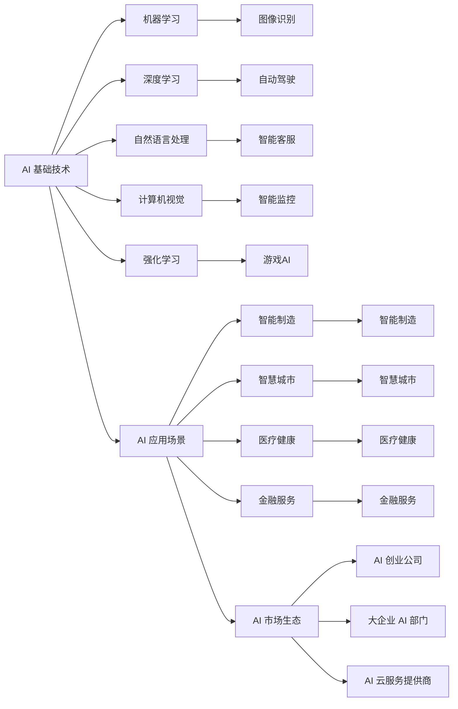

                 

# 李开复：AI 2.0 时代的市场前景

## 1. 背景介绍

随着人工智能技术的飞速发展，AI 2.0 时代已经到来。在这个时代，人工智能技术将变得更加普及和强大，应用场景也从传统的计算机视觉、自然语言处理等技术扩展到智能制造、智慧城市、医疗健康等多个领域。AI 2.0 将为全球经济和社会带来巨大的变革，带来前所未有的市场机遇和挑战。

### 1.1 市场背景

AI 2.0 时代背景下的全球市场面临着一系列新变化。首先，全球经济正经历着结构性调整，科技创新成为推动经济增长的关键力量。其次，各国政府和企业都在大力推进数字化转型，AI 技术被视为数字化转型的核心驱动力。最后，全球面临新的疫情挑战，AI 技术在疫情监测、防控和治疗方面发挥了重要作用，推动了其快速发展。

### 1.2 市场机遇

AI 2.0 时代带来了巨大的市场机遇。根据 Gartner 预测，到 2025 年，全球 AI 市场规模将达到 2500 亿美元，年均复合增长率（CAGR）为 17.1%。其中，中国市场的 AI 收入预计将达到 278 亿美元，年均增长率达 26.1%，位居全球第一。AI 技术在智能制造、智慧城市、医疗健康等领域的应用将大幅提升各行各业的运营效率和服务质量，创造巨大的商业价值。

## 2. 核心概念与联系

### 2.1 核心概念概述

AI 2.0 时代涉及多个核心概念，包括 AI 基础技术、AI 应用场景、AI 市场生态等。这些概念相互关联，共同构成了 AI 2.0 的市场前景。

1. **AI 基础技术**：包括机器学习、深度学习、自然语言处理、计算机视觉等技术，是 AI 2.0 时代的核心支撑。
2. **AI 应用场景**：涵盖智能制造、智慧城市、医疗健康、金融服务等众多领域，AI 技术在这些领域的应用将推动社会进步。
3. **AI 市场生态**：包括 AI 创业公司、大企业 AI 部门、AI 云服务提供商等，共同构成了 AI 市场生态。

### 2.2 核心概念原理和架构的 Mermaid 流程图



### 2.3 核心概念之间的关系

AI 2.0 时代，AI 基础技术是核心，AI 应用场景是应用对象，AI 市场生态是支持系统。三者相互依存，共同推动 AI 技术的快速发展。

1. **AI 基础技术**为 AI 应用场景提供了技术支撑，使 AI 应用场景变得更加广泛和深入。
2. **AI 应用场景**是 AI 基础技术的具体应用，推动了 AI 基础技术的不断创新和发展。
3. **AI 市场生态**提供了资源和平台支持，促进了 AI 基础技术和应用场景的协同发展。

## 3. 核心算法原理 & 具体操作步骤

### 3.1 算法原理概述

AI 2.0 时代涉及多种算法，包括监督学习、无监督学习、强化学习等。其中，监督学习在 AI 2.0 时代得到了广泛应用，主要通过标注数据进行模型训练。

### 3.2 算法步骤详解

AI 2.0 时代的监督学习算法主要包括以下步骤：

1. **数据准备**：收集标注数据，并进行数据预处理，如数据清洗、特征工程等。
2. **模型选择**：选择适当的算法和模型结构，如决策树、神经网络等。
3. **模型训练**：使用标注数据训练模型，优化模型参数。
4. **模型评估**：使用验证集评估模型性能，调整模型参数。
5. **模型应用**：将训练好的模型应用到实际场景中，进行预测或分类等任务。

### 3.3 算法优缺点

AI 2.0 时代的监督学习算法具有以下优点：

1. **准确性高**：通过大量标注数据训练，模型通常具有较高的准确性。
2. **应用广泛**：适用于分类、回归、聚类等多种任务。
3. **可解释性强**：通过特征分析，可以解释模型的决策过程。

但同时也存在一些缺点：

1. **标注成本高**：需要大量标注数据，成本较高。
2. **数据依赖性强**：模型性能依赖于标注数据的质量和数量。
3. **泛化能力有限**：当标注数据与实际应用场景差异较大时，模型泛化能力可能下降。

### 3.4 算法应用领域

AI 2.0 时代的监督学习算法在多个领域得到了广泛应用，包括智能制造、智慧城市、医疗健康等。

1. **智能制造**：通过监督学习算法进行设备故障预测、生产过程优化等。
2. **智慧城市**：通过监督学习算法进行交通流量预测、智能停车管理等。
3. **医疗健康**：通过监督学习算法进行疾病诊断、治疗方案推荐等。

## 4. 数学模型和公式 & 详细讲解 & 举例说明

### 4.1 数学模型构建

AI 2.0 时代的监督学习算法主要使用线性回归、逻辑回归、决策树、神经网络等模型。这里以神经网络为例，构建一个简单的二分类模型。

### 4.2 公式推导过程

对于一个二分类问题，可以使用逻辑回归模型进行建模。假设训练数据为 $(x_i, y_i)$，其中 $x_i$ 为特征向量，$y_i \in \{0, 1\}$ 为标签。模型的目标是最小化损失函数 $L$：

$$
L = -\frac{1}{N} \sum_{i=1}^N [y_i \log \sigma(\theta^T x_i) + (1 - y_i) \log (1 - \sigma(\theta^T x_i))]
$$

其中 $\sigma(\cdot)$ 为 sigmoid 函数，$\theta$ 为模型参数。模型的输出为 $\hat{y} = \sigma(\theta^T x)$。

### 4.3 案例分析与讲解

以智慧城市交通流量预测为例，可以使用神经网络模型进行预测。收集历史交通流量数据，使用监督学习算法训练模型，并进行验证和测试。最终，可以将训练好的模型应用于实时交通流量监测，实现智能交通管理。

## 5. 项目实践：代码实例和详细解释说明

### 5.1 开发环境搭建

AI 2.0 时代的项目实践通常需要强大的计算资源和数据支持。以下是一个简单的项目开发环境搭建流程：

1. **安装 Python**：确保 Python 版本为 3.6 以上，使用 Anaconda 或 Miniconda 进行安装。
2. **安装 TensorFlow**：使用 pip 安装 TensorFlow 和 TensorFlow addons。
3. **安装 scikit-learn**：使用 pip 安装 scikit-learn 库，用于数据处理和模型训练。
4. **安装 Pandas**：使用 pip 安装 Pandas 库，用于数据处理和分析。
5. **安装 Matplotlib**：使用 pip 安装 Matplotlib 库，用于数据可视化。

### 5.2 源代码详细实现

以下是一个简单的智慧城市交通流量预测的 Python 代码实现：

```python
import tensorflow as tf
from sklearn.model_selection import train_test_split
from sklearn.preprocessing import StandardScaler
import pandas as pd
import numpy as np
import matplotlib.pyplot as plt

# 读取数据
data = pd.read_csv('traffic_data.csv')

# 数据预处理
features = data.drop('traffic', axis=1)
labels = data['traffic']
features = StandardScaler().fit_transform(features)

# 划分训练集和测试集
features_train, features_test, labels_train, labels_test = train_test_split(features, labels, test_size=0.2, random_state=42)

# 定义模型
model = tf.keras.Sequential([
    tf.keras.layers.Dense(32, activation='relu', input_shape=(features_train.shape[1],)),
    tf.keras.layers.Dense(1, activation='sigmoid')
])

# 编译模型
model.compile(optimizer=tf.keras.optimizers.Adam(0.01), loss='binary_crossentropy', metrics=['accuracy'])

# 训练模型
model.fit(features_train, labels_train, epochs=10, batch_size=32, validation_data=(features_test, labels_test))

# 评估模型
loss, accuracy = model.evaluate(features_test, labels_test)
print('测试集损失：', loss)
print('测试集准确率：', accuracy)

# 预测交通流量
new_data = np.array([[10000, 9000, 11000, 9500, 11500]])
new_data = StandardScaler().transform(new_data)
predictions = model.predict(new_data)
print('预测交通流量：', predictions)
```

### 5.3 代码解读与分析

上述代码实现了一个简单的神经网络模型，用于智慧城市交通流量预测。具体步骤如下：

1. **数据读取**：读取交通流量数据。
2. **数据预处理**：使用 scikit-learn 库进行数据标准化处理。
3. **模型定义**：定义一个包含两个全连接层的神经网络模型，输出为 sigmoid 函数。
4. **模型编译**：使用 Adam 优化器，二元交叉熵损失函数，准确率作为评价指标。
5. **模型训练**：使用训练集进行模型训练，并在测试集上进行验证。
6. **模型评估**：使用测试集评估模型性能。
7. **模型预测**：使用训练好的模型进行交通流量预测。

## 6. 实际应用场景

### 6.1 智能制造

AI 2.0 时代的智能制造主要通过监督学习算法进行设备故障预测、生产过程优化等。例如，通过收集设备运行数据，使用监督学习算法训练模型，预测设备故障。

### 6.2 智慧城市

AI 2.0 时代的智慧城市主要通过监督学习算法进行交通流量预测、智能停车管理等。例如，通过收集历史交通流量数据，使用监督学习算法训练模型，预测未来交通流量。

### 6.3 医疗健康

AI 2.0 时代的医疗健康主要通过监督学习算法进行疾病诊断、治疗方案推荐等。例如，通过收集患者历史病历数据，使用监督学习算法训练模型，预测患者疾病风险。

## 7. 工具和资源推荐

### 7.1 学习资源推荐

为了更好地学习 AI 2.0 技术，推荐以下学习资源：

1. **《深度学习》课程**：斯坦福大学 CS231n 深度学习课程，涵盖了深度学习的基础和前沿技术。
2. **《机器学习》课程**：Coursera 上的 Andrew Ng 机器学习课程，系统介绍了机器学习的基本概念和算法。
3. **《Python 数据科学手册》**：Jake VanderPlas 的 Python 数据科学手册，介绍了使用 Python 进行数据处理和分析的技术。
4. **TensorFlow 官方文档**：TensorFlow 的官方文档，提供了丰富的教程和样例代码。
5. **Kaggle**：Kaggle 数据科学竞赛平台，提供了大量数据集和竞赛任务，适合实战练习。

### 7.2 开发工具推荐

为了提高 AI 2.0 项目的开发效率，推荐以下开发工具：

1. **Anaconda**：用于管理 Python 环境，安装和管理各种库和工具。
2. **Jupyter Notebook**：用于编写和运行 Python 代码，支持代码块和可视化功能。
3. **PyTorch**：用于深度学习模型训练，提供了灵活的 API 和高效的计算图。
4. **TensorFlow**：用于深度学习模型训练，支持 GPU 和 TPU 加速。
5. **Scikit-learn**：用于数据处理和机器学习模型的实现，提供了丰富的数据处理和模型评估函数。

### 7.3 相关论文推荐

为了深入了解 AI 2.0 技术的最新进展，推荐以下相关论文：

1. **《Google AI 2.0》**：Google AI 团队发表的 AI 2.0 技术白皮书，介绍了 AI 2.0 的技术路线和应用场景。
2. **《NeurIPS 2020 Best Paper》**：NeurIPS 2020 会议上的 AI 技术最佳论文，介绍了最新的 AI 技术进展和研究成果。
3. **《ICML 2021 Best Paper》**：ICML 2021 会议上的 AI 技术最佳论文，介绍了最新的 AI 技术进展和研究成果。

## 8. 总结：未来发展趋势与挑战

### 8.1 研究成果总结

AI 2.0 时代的技术发展迅速，已经在多个领域取得重要成果。未来，随着技术的发展和应用场景的拓展，AI 技术将在智能制造、智慧城市、医疗健康等领域发挥更大作用。

### 8.2 未来发展趋势

AI 2.0 时代的未来发展趋势包括：

1. **模型规模化**：随着算力的提升和数据量的增加，AI 模型将不断增大，应用场景更加广泛。
2. **模型自动化**：自动化的模型训练和部署将成为主流，提升开发效率和系统性能。
3. **多模态融合**：多模态数据融合技术将进一步发展，提升模型的准确性和鲁棒性。
4. **分布式计算**：分布式计算技术将得到广泛应用，提升计算能力和处理速度。

### 8.3 面临的挑战

AI 2.0 时代面临的挑战包括：

1. **数据隐私**：大规模数据收集和处理带来了隐私问题，需要有效的隐私保护机制。
2. **计算资源**：大规模模型的训练和推理需要强大的计算资源，成本较高。
3. **模型可解释性**：AI 模型的决策过程难以解释，需要提升模型的可解释性。
4. **安全性和鲁棒性**：AI 模型容易受到攻击，需要提升模型的安全性和鲁棒性。

### 8.4 研究展望

未来 AI 2.0 技术的研究展望包括：

1. **模型自动化**：自动化模型训练和部署技术将进一步发展，提升开发效率和系统性能。
2. **多模态融合**：多模态数据融合技术将进一步发展，提升模型的准确性和鲁棒性。
3. **分布式计算**：分布式计算技术将得到广泛应用，提升计算能力和处理速度。
4. **隐私保护**：研究有效的隐私保护机制，确保数据安全。

## 9. 附录：常见问题与解答

**Q1: AI 2.0 时代的主要技术包括哪些？**

A: AI 2.0 时代的主要技术包括机器学习、深度学习、自然语言处理、计算机视觉等。这些技术相互交织，共同推动了 AI 技术的快速发展。

**Q2: AI 2.0 时代的应用场景有哪些？**

A: AI 2.0 时代的应用场景包括智能制造、智慧城市、医疗健康、金融服务、智能客服等。AI 技术在这些领域的应用将推动社会进步和经济发展。

**Q3: AI 2.0 时代的市场机遇和挑战是什么？**

A: AI 2.0 时代的市场机遇包括全球经济增长、数字化转型、疫情推动等。市场挑战包括数据隐私、计算资源、模型可解释性、安全性和鲁棒性等问题。

**Q4: AI 2.0 时代的主要开发工具包括哪些？**

A: AI 2.0 时代的主要开发工具包括 Anaconda、Jupyter Notebook、PyTorch、TensorFlow、Scikit-learn 等。这些工具将大大提升 AI 项目的开发效率和性能。

**Q5: AI 2.0 时代的未来发展趋势是什么？**

A: AI 2.0 时代的未来发展趋势包括模型规模化、模型自动化、多模态融合、分布式计算等。这些趋势将推动 AI 技术不断进步，应用场景更加广泛。

---

作者：禅与计算机程序设计艺术 / Zen and the Art of Computer Programming

