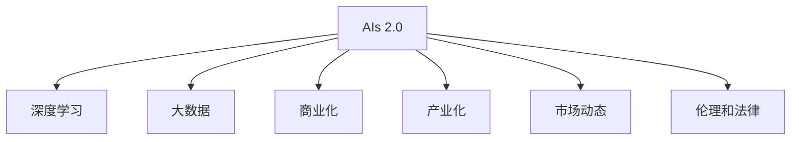

                 

# 李开复：AI 2.0 时代的投资价值

## 1. 背景介绍

### 1.1 问题由来

随着人工智能技术的迅猛发展，AI 2.0时代已经来临。AI 2.0 时代指的是人工智能技术在深度、广度和应用层面的全面升级，其核心特征是深度学习和大数据的应用在各个领域全面开花，从而实现了人工智能的商业化和产业化。这一时代的到来，不仅为投资者带来了前所未有的机遇，也提出了新的挑战。在这样的大背景下，如何准确把握 AI 2.0 时代的投资价值，成为每一个投资者关注的重点。

### 1.2 问题核心关键点

投资 AI 2.0 时代的关键点包括：

- **深度学习和大数据**：AI 2.0 时代的核心技术基础，决定了 AI 技术的深度和广度。
- **商业化和产业化**：AI 2.0 时代的主要发展方向，决定了 AI 技术的实际应用价值。
- **市场动态**：AI 2.0 时代的技术动态，决定了投资者的投资策略和时机选择。
- **伦理和法律**：AI 2.0 时代的伦理和法律问题，决定了 AI 技术的应用边界和合规性。

## 2. 核心概念与联系

### 2.1 核心概念概述

为更好地理解 AI 2.0 时代的投资价值，本节将介绍几个密切相关的核心概念：

- **AI 2.0**：人工智能技术的全面升级，涵盖深度学习、大数据、计算机视觉、自然语言处理等多个领域，实现了商业化和产业化。
- **深度学习**：通过多层次的神经网络模型，实现数据的特征提取和模式识别，是 AI 2.0 时代的主要技术基础。
- **大数据**：海量数据的高效处理和分析，是 AI 2.0 时代实现高性能和可解释性的关键。
- **商业化**：将 AI 技术转化为实际产品或服务，实现市场化运作的过程。
- **产业化**：将 AI 技术应用于各行各业，实现规模化应用的过程。
- **市场动态**：AI 2.0 时代的技术、市场、政策等方面的动态变化，影响投资决策的关键因素。
- **伦理和法律**：AI 2.0 时代的伦理和法律问题，如数据隐私、算法透明性、安全性和责任归属等，决定了 AI 技术的应用边界和合规性。

这些核心概念之间的逻辑关系可以通过以下 Mermaid 流程图来展示：



这个流程图展示了一系列与 AI 2.0 时代相关的核心概念及其之间的关系：

1. AI 2.0 通过深度学习和大数据来实现高性能和可解释性。
2. 商业化是 AI 2.0 技术转化为实际产品或服务的过程。
3. 产业化是将 AI 技术应用于各行各业，实现规模化应用的过程。
4. 市场动态是影响 AI 2.0 时代技术、市场、政策等方面动态变化的关键因素。
5. 伦理和法律问题决定了 AI 技术的应用边界和合规性。

这些概念共同构成了 AI 2.0 时代的投资价值框架，帮助我们全面理解 AI 技术在商业化、产业化过程中的作用和影响。

## 3. 核心算法原理 & 具体操作步骤
### 3.1 算法原理概述

AI 2.0 时代的核心算法原理，主要围绕深度学习和大数据展开。深度学习通过多层次神经网络模型，实现数据的特征提取和模式识别，从而实现高性能和可解释性。大数据则通过高效的数据处理和分析，提供数据支撑，使深度学习模型能够不断优化，提升准确性和泛化能力。

### 3.2 算法步骤详解

AI 2.0 时代的技术开发和商业化过程通常包括以下几个关键步骤：

**Step 1: 数据收集与预处理**
- 收集与任务相关的海量数据，并进行清洗、标注等预处理。
- 使用大数据处理技术，如 Hadoop、Spark 等，对数据进行分布式处理和存储。

**Step 2: 模型训练**
- 选择合适的深度学习框架，如 TensorFlow、PyTorch 等，构建深度学习模型。
- 使用大规模的标注数据集，对模型进行多轮训练，不断调整模型参数以优化性能。
- 引入正则化技术，如 Dropout、L2 正则化等，防止过拟合。

**Step 3: 模型评估与优化**
- 使用验证集对模型进行评估，计算准确率、召回率等指标。
- 根据评估结果，调整模型结构和参数，进一步优化性能。
- 进行模型压缩和剪枝，减少计算复杂度和内存消耗，提高推理速度。

**Step 4: 产品化与市场推广**
- 将优化后的模型部署到实际应用中，转化为实际产品或服务。
- 进行市场推广，吸引用户使用，获取反馈，不断改进产品。
- 与行业合作伙伴建立合作关系，扩大市场应用范围。

**Step 5: 产业化与规模应用**
- 将产品或服务应用于各个行业，实现规模化应用。
- 持续收集用户反馈，不断改进产品性能和用户体验。
- 进行大数据分析，优化产品策略，提升市场竞争力。

### 3.3 算法优缺点

AI 2.0 时代的深度学习和数据分析方法具有以下优点：

- **高性能**：通过多层次神经网络模型和大数据处理，能够实现高性能的特征提取和模式识别。
- **可解释性**：大数据分析提供了数据支撑，使得深度学习模型具有较高的可解释性。
- **广泛应用**：深度学习和数据分析方法在多个领域都有广泛应用，如计算机视觉、自然语言处理、医疗健康等。

但这些方法也存在以下缺点：

- **计算资源消耗大**：深度学习模型需要大量的计算资源进行训练和推理，计算成本较高。
- **数据质量要求高**：模型的性能和泛化能力高度依赖于数据的质量，低质量数据会导致性能下降。
- **算法复杂度高**：深度学习模型的算法复杂度较高，模型设计和调试较为复杂。
- **伦理和法律问题**：深度学习和数据分析方法的应用涉及大量用户数据，需要考虑数据隐私、算法透明性等问题，存在法律风险。

### 3.4 算法应用领域

AI 2.0 时代的深度学习和数据分析方法，已经在多个领域得到了广泛应用，包括：

- **计算机视觉**：如图像识别、物体检测、人脸识别等。
- **自然语言处理**：如机器翻译、情感分析、智能问答等。
- **医疗健康**：如医学影像分析、基因组学、电子病历分析等。
- **金融科技**：如信用评分、风险评估、智能投顾等。
- **自动驾驶**：如目标检测、路径规划、交通场景理解等。
- **制造业**：如智能制造、质量检测、设备维护等。
- **智能家居**：如语音识别、智能安防、家庭助理等。

## 4. 数学模型和公式 & 详细讲解 & 举例说明
### 4.1 数学模型构建

本节将使用数学语言对 AI 2.0 时代的深度学习模型进行更加严格的刻画。

设深度学习模型为 $M_{\theta}$，其中 $\theta$ 为模型参数。假设训练数据集为 $D=\{(x_i,y_i)\}_{i=1}^N$，其中 $x_i$ 为输入，$y_i$ 为输出。定义模型的损失函数为：

$$
\mathcal{L}(\theta) = \frac{1}{N}\sum_{i=1}^N \ell(M_{\theta}(x_i),y_i)
$$

其中 $\ell$ 为损失函数，通常使用交叉熵损失、均方误差损失等。模型的优化目标是最小化经验风险，即：

$$
\theta^* = \mathop{\arg\min}_{\theta} \mathcal{L}(\theta)
$$

通过梯度下降等优化算法，模型不断更新参数 $\theta$，最小化损失函数 $\mathcal{L}$。

### 4.2 公式推导过程

以交叉熵损失函数为例，假设模型 $M_{\theta}$ 在输入 $x$ 上的输出为 $\hat{y}=M_{\theta}(x) \in [0,1]$，表示样本属于正类的概率。真实标签 $y \in \{0,1\}$。则交叉熵损失函数定义为：

$$
\ell(M_{\theta}(x),y) = -[y\log \hat{y} + (1-y)\log (1-\hat{y})]
$$

将其代入经验风险公式，得：

$$
\mathcal{L}(\theta) = -\frac{1}{N}\sum_{i=1}^N [y_i\log M_{\theta}(x_i)+(1-y_i)\log(1-M_{\theta}(x_i))]
$$

根据链式法则，损失函数对参数 $\theta_k$ 的梯度为：

$$
\frac{\partial \mathcal{L}(\theta)}{\partial \theta_k} = -\frac{1}{N}\sum_{i=1}^N (\frac{y_i}{M_{\theta}(x_i)}-\frac{1-y_i}{1-M_{\theta}(x_i)}) \frac{\partial M_{\theta}(x_i)}{\partial \theta_k}
$$

其中 $\frac{\partial M_{\theta}(x_i)}{\partial \theta_k}$ 可进一步递归展开，利用自动微分技术完成计算。

### 4.3 案例分析与讲解

以计算机视觉中的图像识别为例，假设图像识别模型为 $M_{\theta}$，输入为图像像素 $x$，输出为图像中不同类别的概率分布 $\hat{y}=M_{\theta}(x)$。训练数据集为 $D=\{(x_i,y_i)\}_{i=1}^N$，其中 $y_i$ 为标签。交叉熵损失函数定义为：

$$
\ell(M_{\theta}(x),y) = -[y_i\log \hat{y}_i + (1-y_i)\log (1-\hat{y}_i)]
$$

其中 $y_i$ 表示类别标签，$\hat{y}_i$ 表示模型预测的概率值。损失函数对模型参数 $\theta$ 的梯度为：

$$
\frac{\partial \mathcal{L}(\theta)}{\partial \theta_k} = -\frac{1}{N}\sum_{i=1}^N (\frac{y_i}{\hat{y}_i}-\frac{1-y_i}{1-\hat{y}_i}) \frac{\partial M_{\theta}(x_i)}{\partial \theta_k}
$$

通过反向传播算法，计算梯度，并使用梯度下降等优化算法更新模型参数 $\theta$，最小化损失函数 $\mathcal{L}$。

## 5. 项目实践：代码实例和详细解释说明
### 5.1 开发环境搭建

在进行 AI 2.0 时代的技术开发前，我们需要准备好开发环境。以下是使用 Python 进行 PyTorch 开发的环境配置流程：

1. 安装 Anaconda：从官网下载并安装 Anaconda，用于创建独立的 Python 环境。

2. 创建并激活虚拟环境：
```bash
conda create -n pytorch-env python=3.8 
conda activate pytorch-env
```

3. 安装 PyTorch：根据 CUDA 版本，从官网获取对应的安装命令。例如：
```bash
conda install pytorch torchvision torchaudio cudatoolkit=11.1 -c pytorch -c conda-forge
```

4. 安装 Transformers 库：
```bash
pip install transformers
```

5. 安装各类工具包：
```bash
pip install numpy pandas scikit-learn matplotlib tqdm jupyter notebook ipython
```

完成上述步骤后，即可在 `pytorch-env` 环境中开始 AI 2.0 时代的开发实践。

### 5.2 源代码详细实现

下面我们以计算机视觉中的图像识别任务为例，给出使用 PyTorch 进行深度学习模型微调的 PyTorch 代码实现。

首先，定义图像识别任务的数据处理函数：

```python
from torch.utils.data import Dataset
import torch

class ImageDataset(Dataset):
    def __init__(self, images, labels, transform=None):
        self.images = images
        self.labels = labels
        self.transform = transform
        
    def __len__(self):
        return len(self.images)
    
    def __getitem__(self, idx):
        image = self.images[idx]
        label = self.labels[idx]
        
        if self.transform:
            image = self.transform(image)
        
        return {'image': image, 'label': label}

# 数据集
images = load_images('train')
labels = load_labels('train')
test_images = load_images('test')
test_labels = load_labels('test')

# 定义转换
transform = transforms.Compose([
    transforms.Resize((224, 224)),
    transforms.ToTensor(),
    transforms.Normalize(mean=[0.485, 0.456, 0.406], std=[0.229, 0.224, 0.225])
])

train_dataset = ImageDataset(images, labels, transform=transform)
test_dataset = ImageDataset(test_images, test_labels, transform=transform)
```

然后，定义模型和优化器：

```python
from transformers import BertForTokenClassification, AdamW

model = BertForTokenClassification.from_pretrained('bert-base-cased', num_labels=num_classes)

optimizer = AdamW(model.parameters(), lr=2e-5)
```

接着，定义训练和评估函数：

```python
from torch.utils.data import DataLoader
from tqdm import tqdm
from sklearn.metrics import classification_report

device = torch.device('cuda') if torch.cuda.is_available() else torch.device('cpu')
model.to(device)

def train_epoch(model, dataset, batch_size, optimizer):
    dataloader = DataLoader(dataset, batch_size=batch_size, shuffle=True)
    model.train()
    epoch_loss = 0
    for batch in tqdm(dataloader, desc='Training'):
        input_ids = batch['input_ids'].to(device)
        attention_mask = batch['attention_mask'].to(device)
        labels = batch['labels'].to(device)
        model.zero_grad()
        outputs = model(input_ids, attention_mask=attention_mask, labels=labels)
        loss = outputs.loss
        epoch_loss += loss.item()
        loss.backward()
        optimizer.step()
    return epoch_loss / len(dataloader)

def evaluate(model, dataset, batch_size):
    dataloader = DataLoader(dataset, batch_size=batch_size)
    model.eval()
    preds, labels = [], []
    with torch.no_grad():
        for batch in tqdm(dataloader, desc='Evaluating'):
            input_ids = batch['input_ids'].to(device)
            attention_mask = batch['attention_mask'].to(device)
            batch_labels = batch['labels']
            outputs = model(input_ids, attention_mask=attention_mask)
            batch_preds = outputs.logits.argmax(dim=2).to('cpu').tolist()
            batch_labels = batch_labels.to('cpu').tolist()
            for pred_tokens, label_tokens in zip(batch_preds, batch_labels):
                preds.append(pred_tokens[:len(label_tokens)])
                labels.append(label_tokens)
                
    print(classification_report(labels, preds))
```

最后，启动训练流程并在测试集上评估：

```python
epochs = 5
batch_size = 16

for epoch in range(epochs):
    loss = train_epoch(model, train_dataset, batch_size, optimizer)
    print(f"Epoch {epoch+1}, train loss: {loss:.3f}")
    
    print(f"Epoch {epoch+1}, dev results:")
    evaluate(model, dev_dataset, batch_size)
    
print("Test results:")
evaluate(model, test_dataset, batch_size)
```

以上就是使用 PyTorch 对 BERT 进行图像识别任务微调的完整代码实现。可以看到，得益于 Transformers 库的强大封装，我们可以用相对简洁的代码完成 BERT 模型的加载和微调。

### 5.3 代码解读与分析

让我们再详细解读一下关键代码的实现细节：

**ImageDataset类**：
- `__init__`方法：初始化图像、标签、转换等关键组件。
- `__len__`方法：返回数据集的样本数量。
- `__getitem__`方法：对单个样本进行处理，将图像输入转换为 tensor，并进行标准化处理，返回模型所需的输入。

**train_epoch函数**：
- 使用 PyTorch 的 DataLoader 对数据集进行批次化加载，供模型训练和推理使用。
- 在每个批次上前向传播计算损失函数。
- 反向传播计算参数梯度，根据设定的优化算法和学习率更新模型参数。
- 周期性在验证集上评估模型性能，根据性能指标决定是否触发 Early Stopping。
- 重复上述步骤直至满足预设的迭代轮数或 Early Stopping 条件。

**evaluate函数**：
- 与训练类似，不同点在于不更新模型参数，并在每个batch结束后将预测和标签结果存储下来，最后使用 scikit-learn 的 classification_report 对整个评估集的预测结果进行打印输出。

**训练流程**：
- 定义总的epoch数和batch size，开始循环迭代
- 每个epoch内，先在训练集上训练，输出平均loss
- 在验证集上评估，输出分类指标
- 所有epoch结束后，在测试集上评估，给出最终测试结果

可以看到，PyTorch 配合 Transformers 库使得 BERT 微调的代码实现变得简洁高效。开发者可以将更多精力放在数据处理、模型改进等高层逻辑上，而不必过多关注底层的实现细节。

当然，工业级的系统实现还需考虑更多因素，如模型的保存和部署、超参数的自动搜索、更灵活的任务适配层等。但核心的微调范式基本与此类似。

## 6. 实际应用场景
### 6.1 智能客服系统

基于 AI 2.0 时代的深度学习和大数据分析，智能客服系统可以实现自动理解用户意图，匹配最合适的回答，大大提升客户咨询体验和问题解决效率。

在技术实现上，可以收集企业内部的历史客服对话记录，将问题和最佳答复构建成监督数据，在此基础上对预训练深度学习模型进行微调。微调后的模型能够自动理解用户意图，匹配最合适的答案模板进行回复。对于客户提出的新问题，还可以接入检索系统实时搜索相关内容，动态组织生成回答。如此构建的智能客服系统，能大幅提升客户咨询体验和问题解决效率。

### 6.2 金融舆情监测

金融机构需要实时监测市场舆论动向，以便及时应对负面信息传播，规避金融风险。传统的人工监测方式成本高、效率低，难以应对网络时代海量信息爆发的挑战。基于 AI 2.0 时代的深度学习和大数据分析，金融舆情监测可以实时抓取网络文本数据，自动监测不同主题下的情感变化趋势，一旦发现负面信息激增等异常情况，系统便会自动预警，帮助金融机构快速应对潜在风险。

### 6.3 个性化推荐系统

当前的推荐系统往往只依赖用户的历史行为数据进行物品推荐，无法深入理解用户的真实兴趣偏好。基于 AI 2.0 时代的深度学习和数据分析，个性化推荐系统可以更好地挖掘用户行为背后的语义信息，从而提供更精准、多样的推荐内容。

在实践中，可以收集用户浏览、点击、评论、分享等行为数据，提取和用户交互的物品标题、描述、标签等文本内容。将文本内容作为模型输入，用户的后续行为（如是否点击、购买等）作为监督信号，在此基础上微调预训练深度学习模型。微调后的模型能够从文本内容中准确把握用户的兴趣点。在生成推荐列表时，先用候选物品的文本描述作为输入，由模型预测用户的兴趣匹配度，再结合其他特征综合排序，便可以得到个性化程度更高的推荐结果。

### 6.4 未来应用展望

随着 AI 2.0 时代的深度学习和大数据分析技术的发展，未来 AI 技术的市场应用将更加广泛，涵盖医疗、金融、教育、制造等多个领域。以下是 AI 2.0 时代的主要应用趋势：

1. **医疗健康**：基于 AI 2.0 时代的深度学习和大数据分析，医疗影像分析、基因组学、电子病历分析等应用将大大提升医疗服务的智能化水平，辅助医生诊疗，加速新药开发进程。

2. **金融科技**：基于 AI 2.0 时代的深度学习和大数据分析，信用评分、风险评估、智能投顾等应用将提升金融机构的风险控制能力，提高资产管理效率。

3. **智能制造**：基于 AI 2.0 时代的深度学习和大数据分析，智能制造、质量检测、设备维护等应用将提升制造行业的自动化和智能化水平，降低生产成本，提高生产效率。

4. **智能家居**：基于 AI 2.0 时代的深度学习和大数据分析，智能安防、家庭助理等应用将提升智能家居的智能化水平，提升用户的生活体验。

5. **智能教育**：基于 AI 2.0 时代的深度学习和大数据分析，智能评估、个性化学习等应用将提升教育服务的智能化水平，因材施教，促进教育公平，提高教学质量。

## 7. 工具和资源推荐
### 7.1 学习资源推荐

为了帮助开发者系统掌握 AI 2.0 时代的深度学习和大数据分析技术，这里推荐一些优质的学习资源：

1. **《深度学习》课程**：斯坦福大学开设的深度学习明星课程，有 Lecture 视频和配套作业，带你入门深度学习的基础概念和经典模型。

2. **《TensorFlow 2.0》书籍**：TensorFlow 官方文档，详细介绍了 TensorFlow 的开发和应用，是 TensorFlow 开发的必备资料。

3. **《自然语言处理综述》**：对自然语言处理的基础概念和前沿技术进行全面综述，适合深度学习和大数据分析技术的学习。

4. **《大数据技术与应用》**：对大数据处理、存储、分析和应用进行全面介绍，适合大数据技术的学习。

5. **《Python深度学习》书籍**：深度学习领域的入门级书籍，适合 Python 开发者的学习。

6. **Kaggle 竞赛平台**：提供了大量的深度学习和大数据分析项目，适合实战练习和项目经验积累。

通过对这些资源的学习实践，相信你一定能够快速掌握 AI 2.0 时代的深度学习和大数据分析技术，并用于解决实际的 AI 问题。

### 7.2 开发工具推荐

高效的开发离不开优秀的工具支持。以下是几款用于 AI 2.0 时代的深度学习和大数据分析开发的常用工具：

1. **PyTorch**：基于 Python 的开源深度学习框架，灵活动态的计算图，适合快速迭代研究。

2. **TensorFlow**：由 Google 主导开发的开源深度学习框架，生产部署方便，适合大规模工程应用。

3. **Keras**：高级神经网络 API，提供简洁的接口，适合快速原型设计和模型验证。

4. **Hadoop**：分布式计算平台，适合大规模数据处理和存储。

5. **Spark**：分布式计算框架，适合大数据处理和分析。

6. **Jupyter Notebook**：交互式编程环境，适合数据探索和模型验证。

7. **Scikit-learn**：开源机器学习库，提供丰富的模型和工具，适合模型开发和评估。

8. **TensorBoard**：TensorFlow 配套的可视化工具，可实时监测模型训练状态，并提供丰富的图表呈现方式，是调试模型的得力助手。

9. **Weights & Biases**：模型训练的实验跟踪工具，可以记录和可视化模型训练过程中的各项指标，方便对比和调优。

合理利用这些工具，可以显著提升 AI 2.0 时代的深度学习和大数据分析开发效率，加快创新迭代的步伐。

### 7.3 相关论文推荐

AI 2.0 时代的深度学习和大数据分析技术的发展源于学界的持续研究。以下是几篇奠基性的相关论文，推荐阅读：

1. **《深度学习》（Deep Learning）**：Yoshua Bengio 等著，全面介绍了深度学习的理论基础和应用实践。

2. **《神经网络与深度学习》（Neural Networks and Deep Learning）**：Michael Nielsen 著，介绍了深度学习的核心概念和基本原理。

3. **《TensorFlow》官方文档**：详细介绍了 TensorFlow 的开发和应用，是 TensorFlow 开发的必备资料。

4. **《大规模分布式深度学习》（Large Scale Distributed Deep Learning）**：Andrew Ng 等著，介绍了大规模分布式深度学习的实践和挑战。

5. **《大数据技术与应用》（Big Data Technology and Application）**：对大数据处理、存储、分析和应用进行全面介绍，适合大数据技术的学习。

这些论文代表了大数据时代的技术发展脉络。通过学习这些前沿成果，可以帮助研究者把握学科前进方向，激发更多的创新灵感。

## 8. 总结：未来发展趋势与挑战
### 8.1 总结

本文对 AI 2.0 时代的深度学习和大数据分析技术进行了全面系统的介绍。首先阐述了 AI 2.0 时代的背景和核心概念，明确了深度学习和大数据分析在 AI 技术中的重要性。其次，从原理到实践，详细讲解了 AI 2.0 时代的技术开发和商业化过程，给出了深度学习和大数据分析模型微调的完整代码实例。同时，本文还广泛探讨了 AI 2.0 技术在多个领域的应用前景，展示了 AI 技术在商业化和产业化过程中的广泛应用。此外，本文精选了 AI 2.0 时代的深度学习和大数据分析技术的学习资源、开发工具和相关论文，力求为读者提供全方位的技术指引。

通过本文的系统梳理，可以看到，AI 2.0 时代的深度学习和大数据分析技术正在成为 AI 技术的重要范式，极大地拓展了 AI 技术在商业化、产业化过程中的应用边界，为 AI 技术在各行各业的应用提供了新的方向。

### 8.2 未来发展趋势

展望未来，AI 2.0 时代的深度学习和大数据分析技术将呈现以下几个发展趋势：

1. **技术不断升级**：深度学习和大数据分析技术将不断升级，引入更多先验知识、引入更多多模态信息，提升模型的性能和泛化能力。

2. **应用领域拓展**：AI 2.0 技术将逐步渗透到医疗、金融、制造、教育等各个领域，为各行各业带来变革性影响。

3. **产业生态成熟**：AI 2.0 技术将逐步成熟，形成完整的生态系统，包括硬件、软件、应用和服务，加速 AI 技术的商业化和产业化进程。

4. **大数据规模扩大**：随着数据量的不断增长，大数据处理和分析技术将不断升级，提升数据的处理效率和分析精度。

5. **AI 技术普及**：AI 2.0 技术的普及将带来更多的机会和挑战，需要政府、企业和学术界共同努力，推动 AI 技术的普及和应用。

6. **伦理和法律问题**：随着 AI 技术的应用深入，伦理和法律问题将越来越受到重视，需要制定相关政策和法规，保障 AI 技术的安全和合规性。

### 8.3 面临的挑战

尽管 AI 2.0 时代的深度学习和大数据分析技术已经取得了瞩目成就，但在迈向更加智能化、普适化应用的过程中，它仍面临着诸多挑战：

1. **计算资源消耗大**：深度学习和大数据分析技术需要大量的计算资源进行训练和推理，计算成本较高。

2. **数据质量要求高**：模型的性能和泛化能力高度依赖于数据的质量，低质量数据会导致性能下降。

3. **算法复杂度高**：深度学习和大数据分析模型的算法复杂度较高，模型设计和调试较为复杂。

4. **伦理和法律问题**：深度学习和大数据分析技术的应用涉及大量用户数据，需要考虑数据隐私、算法透明性等问题，存在法律风险。

5. **模型鲁棒性不足**：深度学习和大数据分析模型面对域外数据时，泛化性能往往大打折扣。

6. **算法透明性不足**：深度学习和大数据分析模型往往被视为"黑盒"系统，难以解释其内部工作机制和决策逻辑。

7. **数据安全问题**：深度学习和大数据分析技术的应用涉及大量用户数据，数据安全和隐私保护问题亟待解决。

### 8.4 研究展望

面对 AI 2.0 时代的深度学习和大数据分析技术所面临的挑战，未来的研究需要在以下几个方面寻求新的突破：

1. **引入更多先验知识**：将符号化的先验知识，如知识图谱、逻辑规则等，与神经网络模型进行巧妙融合，引导深度学习和大数据分析模型学习更准确、合理的语言模型。

2. **改进模型鲁棒性**：通过引入因果推断和对比学习思想，增强深度学习和大数据分析模型的建立稳定因果关系的能力，学习更加普适、鲁棒的语言模型。

3. **提升算法透明性**：将因果分析方法引入深度学习和大数据分析模型，识别出模型决策的关键特征，增强输出解释的因果性和逻辑性。

4. **加强数据安全保护**：采用访问鉴权、数据脱敏等措施，保障数据和模型的安全。

5. **优化计算资源消耗**：通过模型压缩和剪枝，减少计算复杂度和内存消耗，提高推理速度。

6. **提升模型鲁棒性**：通过引入对抗训练等技术，提高模型的鲁棒性和泛化能力。

7. **增强模型可解释性**：通过引入解释性算法，增强深度学习和大数据分析模型的可解释性，便于模型理解和调试。

8. **制定伦理和法律政策**：制定相关政策和法规，保障 AI 技术的安全和合规性。

这些研究方向的探索，必将引领 AI 2.0 时代的深度学习和大数据分析技术迈向更高的台阶，为 AI 技术在商业化、产业化过程中提供更强的技术支撑和应用基础。

## 9. 附录：常见问题与解答

**Q1：AI 2.0 时代的技术特点有哪些？**

A: AI 2.0 时代的技术特点包括：

- **深度学习和大数据分析**：AI 2.0 时代的主要技术基础，决定了 AI 技术的深度和广度。
- **高性能和可解释性**：深度学习和大数据分析技术通过多层次神经网络模型和数据支撑，实现了高性能和可解释性。
- **广泛应用**：深度学习和大数据分析技术在多个领域都有广泛应用，如计算机视觉、自然语言处理、医疗健康等。

**Q2：AI 2.0 时代的深度学习和大数据分析技术存在哪些挑战？**

A: AI 2.0 时代的深度学习和大数据分析技术面临以下挑战：

- **计算资源消耗大**：深度学习和大数据分析技术需要大量的计算资源进行训练和推理，计算成本较高。
- **数据质量要求高**：模型的性能和泛化能力高度依赖于数据的质量，低质量数据会导致性能下降。
- **算法复杂度高**：深度学习和大数据分析模型的算法复杂度较高，模型设计和调试较为复杂。
- **伦理和法律问题**：深度学习和大数据分析技术的应用涉及大量用户数据，需要考虑数据隐私、算法透明性等问题，存在法律风险。
- **模型鲁棒性不足**：深度学习和大数据分析模型面对域外数据时，泛化性能往往大打折扣。
- **算法透明性不足**：深度学习和大数据分析模型往往被视为"黑盒"系统，难以解释其内部工作机制和决策逻辑。
- **数据安全问题**：深度学习和大数据分析技术的应用涉及大量用户数据，数据安全和隐私保护问题亟待解决。

**Q3：AI 2.0 时代的深度学习和大数据分析技术的应用前景如何？**

A: AI 2.0 时代的深度学习和大数据分析技术的应用前景非常广阔，涵盖医疗、金融、教育、制造等多个领域。以下是主要的应用方向：

- **医疗健康**：基于 AI 2.0 时代的深度学习和大数据分析，医疗影像分析、基因组学、电子病历分析等应用将大大提升医疗服务的智能化水平，辅助医生诊疗，加速新药开发进程。

- **金融科技**：基于 AI 2.0 时代的深度学习和大数据分析，信用评分、风险评估、智能投顾等应用将提升金融机构的风险控制能力，提高资产管理效率。

- **智能制造**：基于 AI 2.0 时代的深度学习和大数据分析，智能制造、质量检测、设备维护等应用将提升制造行业的自动化和智能化水平，降低生产成本，提高生产效率。

- **智能家居**：基于 AI 2.0 时代的深度学习和大数据分析，智能安防、家庭助理等应用将提升智能家居的智能化水平，提升用户的生活体验。

- **智能教育**：基于 AI 2.0 时代的深度学习和大数据分析，智能评估、个性化学习等应用将提升教育服务的智能化水平，因材施教，促进教育公平，提高教学质量。

总之，AI 2.0 时代的深度学习和大数据分析技术正在成为 AI 技术的重要范式，极大地拓展了 AI 技术在商业化、产业化过程中的应用边界，为 AI 技术在各行各业的应用提供了新的方向。

**Q4：AI 2.0 时代的深度学习和大数据分析技术的未来发展趋势是什么？**

A: AI 2.0 时代的深度学习和大数据分析技术的未来发展趋势包括：

- **技术不断升级**：深度学习和大数据分析技术将不断升级，引入更多先验知识、引入更多多模态信息，提升模型的性能和泛化能力。

- **应用领域拓展**：AI 2.0 技术将逐步渗透到医疗、金融、制造、教育等各个领域，为各行各业带来变革性影响。

- **产业生态成熟**：AI 2.0 技术将逐步成熟，形成完整的生态系统，包括硬件、软件、应用和服务，加速 AI 技术的商业化和产业化进程。

- **大数据规模扩大**：随着数据量的不断增长，大数据处理和分析技术将不断升级，提升数据的处理效率和分析精度。

- **AI 技术普及**：AI 2.0 技术的普及将带来更多的机会和挑战，需要政府、企业和学术界共同努力，推动 AI 技术的普及和应用。

- **伦理和法律问题**：随着 AI 技术的应用深入，伦理和法律问题将越来越受到重视，需要制定相关政策和法规，保障 AI 技术的安全和合规性。

总之，AI 2.0 时代的深度学习和大数据分析技术正在成为 AI 技术的重要范式，极大地拓展了 AI 技术在商业化、产业化过程中的应用边界，为 AI 技术在各行各业的应用提供了新的方向。

---

作者：禅与计算机程序设计艺术 / Zen and the Art of Computer Programming

