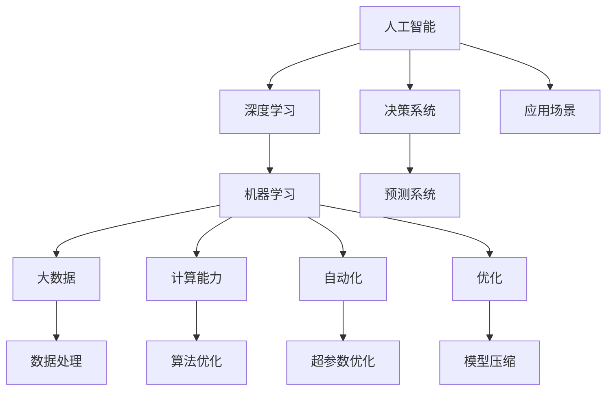

                 

# 李开复：AI 2.0 时代的机遇

> 关键词：人工智能,AI 2.0,深度学习,机器学习,大数据,计算能力,自动化,机器智能,未来趋势,技术突破

## 1. 背景介绍

### 1.1 问题由来

随着科技的迅猛发展，人工智能（AI）技术已经深入到各行各业，从医疗、教育到金融、制造，再到农业、艺术，AI的应用无处不在。然而，尽管人工智能技术已经取得了显著的进步，但目前的人类智能水平仍远远领先于机器智能。据估计，人类智能水平大约相当于一台1千亿参数的AI模型的水平，而这一模型需要数十年甚至数百年才能开发出来，成本高昂且难以实现。因此，如何让机器智能更快地赶上人类智能水平，成为当前AI研究的重要课题。

### 1.2 问题核心关键点

AI 2.0时代的核心关键点包括：

1. **计算能力的提升**：AI 2.0时代的一个重要特征是计算能力的飞速提升。随着高性能计算技术的发展，如GPU、TPU、云计算等，AI模型的训练速度和计算效率大幅提升。

2. **数据量的激增**：大规模、多模态的数据集，如互联网数据、社交媒体数据、传感器数据等，为AI模型的训练提供了丰富的数据来源，使模型能够学习到更加复杂和多样化的知识。

3. **算法和模型的创新**：深度学习、强化学习、生成对抗网络（GAN）、自监督学习等新型算法的提出，使得AI模型在性能上实现了飞跃式提升。

4. **硬件和软件栈的整合**：高性能的AI硬件如专用加速器、智能芯片等，以及深度学习框架如TensorFlow、PyTorch等软件栈的开发，使得AI模型能够在大规模数据集上进行高效的训练和推理。

5. **自动化和优化**：自动化的超参数优化、模型压缩、量化加速等技术的发展，使得AI模型能够在计算资源有限的情况下，实现更高的性能和效率。

### 1.3 问题研究意义

AI 2.0时代的研究对于提升机器智能水平、推动人工智能技术的普及应用、促进产业升级具有重要意义：

1. **提高生产效率**：AI技术可以在制造业、服务业等领域自动化完成大量重复性工作，减少人力成本，提高生产效率。

2. **优化资源配置**：通过智能算法优化资源配置，提高能源利用率，降低环境污染。

3. **推动医疗健康**：AI技术在医疗影像分析、疾病预测、个性化治疗等方面应用广泛，为医疗健康事业带来变革。

4. **促进教育公平**：AI技术可以为偏远地区和弱势群体提供优质的教育资源，缩小教育资源分配的不平等。

5. **提升商业决策**：AI技术可以通过数据分析和预测，帮助企业制定更科学的决策，提升市场竞争力。

6. **增进人类福祉**：AI技术在智能家居、智能交通、智能城市等领域应用广泛，提升人们的生活质量，增进人类福祉。

## 2. 核心概念与联系

### 2.1 核心概念概述

为了更好地理解AI 2.0时代的发展，我们首先需要了解一些核心概念：

1. **人工智能**：利用计算机算法和数据处理技术，模拟人类智能行为和决策过程，解决实际问题的技术。

2. **深度学习**：一种基于多层神经网络的机器学习技术，通过多层数据抽象，学习复杂非线性特征。

3. **机器学习**：一种让计算机自动学习数据的规律和模式，并用于预测和决策的技术。

4. **大数据**：指数据量巨大、复杂性高、速度快、多样性强的数据集，是AI训练的基础。

5. **计算能力**：指计算机处理数据和执行算法的能力，是AI模型训练和推理的基础。

6. **自动化**：通过算法和工具，自动化完成数据处理、模型训练、超参数优化等任务，提升AI研究的效率。

7. **优化**：通过算法和工具，优化模型性能，提升AI模型在各种场景下的表现。

这些核心概念之间具有紧密的联系，共同构成了AI 2.0时代的技术基础。

### 2.2 核心概念原理和架构的 Mermaid 流程图



这个流程图展示了AI 2.0时代的核心概念之间的联系。人工智能通过深度学习、机器学习等算法实现复杂任务，而大数据、计算能力、自动化和优化等技术则提供了基础支撑。

## 3. 核心算法原理 & 具体操作步骤

### 3.1 算法原理概述

AI 2.0时代的算法原理主要基于深度学习。深度学习通过多层神经网络，从数据中学习到复杂的多层次特征表示，进而实现对复杂任务的建模和预测。其核心思想是通过反向传播算法，不断优化模型参数，使得模型输出与真实标签尽可能接近。

### 3.2 算法步骤详解

AI 2.0时代的深度学习模型训练步骤如下：

1. **数据准备**：收集和处理数据集，分为训练集、验证集和测试集。

2. **模型选择**：选择适合任务的深度学习模型，如卷积神经网络（CNN）、循环神经网络（RNN）、变分自编码器（VAE）等。

3. **模型搭建**：搭建深度学习模型，设置网络结构、层数、激活函数等参数。

4. **模型训练**：使用训练集对模型进行训练，通过反向传播算法优化模型参数。

5. **模型验证**：在验证集上评估模型性能，调整超参数以避免过拟合。

6. **模型测试**：在测试集上评估模型性能，最终选择最优模型。

7. **模型部署**：将训练好的模型部署到实际应用中，进行推理和预测。

### 3.3 算法优缺点

深度学习的优点包括：

1. **高性能**：在大规模数据集上训练的深度学习模型可以学习到复杂的多层次特征表示，预测准确率高。

2. **泛化能力强**：深度学习模型可以通过学习数据规律，泛化到新的数据集上，实现较好的迁移学习能力。

3. **可扩展性强**：深度学习模型可以通过增加网络层数和神经元数量，进一步提升模型性能。

4. **自动化**：深度学习框架如TensorFlow、PyTorch等提供了自动化的模型构建和训练工具，降低了研究人员的工作量。

5. **实时性**：随着高性能计算技术的发展，深度学习模型可以在实时场景中进行推理和预测。

深度学习的缺点包括：

1. **计算资源需求高**：深度学习模型需要大量的计算资源进行训练，对硬件要求较高。

2. **数据需求大**：深度学习模型需要大规模数据集进行训练，对数据质量要求高。

3. **模型复杂**：深度学习模型结构复杂，难以理解和解释。

4. **过拟合风险高**：深度学习模型在训练过程中容易过拟合，需要采取正则化等措施缓解。

### 3.4 算法应用领域

AI 2.0时代的深度学习技术已经广泛应用于各个领域，包括：

1. **计算机视觉**：图像识别、物体检测、人脸识别等。

2. **自然语言处理**：机器翻译、情感分析、文本生成等。

3. **语音识别**：语音识别、语音合成等。

4. **推荐系统**：个性化推荐、广告推荐等。

5. **医疗健康**：医学影像分析、疾病预测等。

6. **金融科技**：风险预测、欺诈检测等。

7. **智能制造**：智能检测、质量控制等。

8. **自动驾驶**：图像识别、路径规划等。

9. **智能家居**：语音控制、智能监控等。

## 4. 数学模型和公式 & 详细讲解

### 4.1 数学模型构建

AI 2.0时代的深度学习模型通常由多层神经网络构成，每层神经元之间的连接权重为模型参数。模型的目标是最小化损失函数，使得模型输出与真实标签尽可能接近。常用的损失函数包括交叉熵损失、均方误差损失等。

设深度学习模型为 $f_\theta(x)$，其中 $x$ 为输入，$\theta$ 为模型参数，$y$ 为真实标签。则模型的损失函数为：

$$
L(f_\theta) = \frac{1}{N}\sum_{i=1}^N [f_\theta(x_i) - y_i]^2
$$

其中 $N$ 为样本数，$[x_i,y_i]$ 为训练集中的样本。

### 4.2 公式推导过程

以交叉熵损失函数为例，其推导过程如下：

设 $p_i$ 为模型对样本 $x_i$ 的正确标签 $y_i$ 的概率，$n_i$ 为样本 $x_i$ 属于 $y_i$ 的样本数，则交叉熵损失函数为：

$$
L(f_\theta) = -\frac{1}{N}\sum_{i=1}^N \sum_{j=1}^n y_i\log p_i
$$

其中 $y_i$ 为真实标签，$p_i$ 为模型对 $y_i$ 的预测概率。

将上式化简，得：

$$
L(f_\theta) = -\frac{1}{N}\sum_{i=1}^N \sum_{j=1}^n y_i\log p_i
$$

进一步化简，得：

$$
L(f_\theta) = -\frac{1}{N}\sum_{i=1}^N y_i\log p_i
$$

最终得到的交叉熵损失函数表达式为：

$$
L(f_\theta) = -\frac{1}{N}\sum_{i=1}^N y_i\log p_i
$$

### 4.3 案例分析与讲解

以图像分类任务为例，我们可以使用卷积神经网络（CNN）来构建深度学习模型。CNN的每一层都由多个卷积核和池化层构成，通过多层卷积和池化操作，提取图像的局部特征，最终通过全连接层输出分类结果。在训练过程中，通过反向传播算法不断优化模型参数，使得模型输出的预测结果与真实标签尽可能接近。

## 5. 项目实践：代码实例和详细解释说明

### 5.1 开发环境搭建

在进行AI 2.0时代的项目实践时，需要搭建好开发环境，包括以下步骤：

1. **安装Python**：Python是深度学习开发的主要语言，需要安装最新版本。

2. **安装深度学习框架**：安装TensorFlow或PyTorch等深度学习框架，以及相关的库和工具。

3. **安装GPU和TPU**：高性能计算设备如GPU和TPU可以加速深度学习模型的训练和推理。

4. **安装数据处理工具**：安装Pandas、NumPy等数据处理工具，方便数据预处理。

5. **安装可视化工具**：安装Matplotlib、Seaborn等可视化工具，方便模型训练和结果展示。

### 5.2 源代码详细实现

以图像分类任务为例，使用PyTorch搭建CNN模型，实现深度学习模型的训练和推理。代码如下：

```python
import torch
import torch.nn as nn
import torch.optim as optim
import torchvision.transforms as transforms
import torchvision.datasets as datasets

# 定义CNN模型
class CNN(nn.Module):
    def __init__(self):
        super(CNN, self).__init__()
        self.conv1 = nn.Conv2d(3, 64, 3, padding=1)
        self.conv2 = nn.Conv2d(64, 128, 3, padding=1)
        self.pool = nn.MaxPool2d(2, 2)
        self.fc1 = nn.Linear(128 * 8 * 8, 256)
        self.fc2 = nn.Linear(256, 10)
        
    def forward(self, x):
        x = self.pool(F.relu(self.conv1(x)))
        x = self.pool(F.relu(self.conv2(x)))
        x = x.view(-1, 128 * 8 * 8)
        x = F.relu(self.fc1(x))
        x = self.fc2(x)
        return x

# 定义数据预处理
transform = transforms.Compose([
    transforms.ToTensor(),
    transforms.Normalize((0.5, 0.5, 0.5), (0.5, 0.5, 0.5))
])

# 加载数据集
train_set = datasets.CIFAR10(root='./data', train=True, download=True, transform=transform)
test_set = datasets.CIFAR10(root='./data', train=False, download=True, transform=transform)
train_loader = torch.utils.data.DataLoader(train_set, batch_size=64, shuffle=True)
test_loader = torch.utils.data.DataLoader(test_set, batch_size=64, shuffle=False)

# 定义模型和损失函数
model = CNN()
criterion = nn.CrossEntropyLoss()
optimizer = optim.Adam(model.parameters(), lr=0.001)

# 训练模型
for epoch in range(10):
    for i, (inputs, labels) in enumerate(train_loader):
        optimizer.zero_grad()
        outputs = model(inputs)
        loss = criterion(outputs, labels)
        loss.backward()
        optimizer.step()
        
        if (i+1) % 100 == 0:
            print('Epoch [{}/{}], Step [{}/{}], Loss: {:.4f}'
                  .format(epoch+1, 10, i+1, len(train_loader), loss.item()))

# 测试模型
correct = 0
total = 0
with torch.no_grad():
    for inputs, labels in test_loader:
        outputs = model(inputs)
        _, predicted = torch.max(outputs.data, 1)
        total += labels.size(0)
        correct += (predicted == labels).sum().item()

print('Accuracy of the network on the 10000 test images: {} %'.format(100 * correct / total))
```

### 5.3 代码解读与分析

1. **数据预处理**：使用`transforms`模块对图像数据进行预处理，包括归一化、缩放等操作，方便模型训练。

2. **模型定义**：定义CNN模型，包含多个卷积层、池化层和全连接层。

3. **数据加载**：使用`torch.utils.data.DataLoader`加载数据集，方便模型训练和测试。

4. **模型训练**：使用`torch.optim.Adam`优化器，通过反向传播算法不断优化模型参数，最小化损失函数。

5. **模型测试**：在测试集上评估模型性能，计算准确率。

## 6. 实际应用场景

### 6.1 智能制造

AI 2.0时代的深度学习技术可以应用于智能制造领域，通过图像识别、物体检测等技术，实现对生产设备的自动化检测和维护。例如，使用深度学习模型对生产设备的图像进行分类和定位，可以提前发现设备故障，提高生产效率和设备利用率。

### 6.2 智能交通

AI 2.0时代的深度学习技术可以应用于智能交通领域，通过图像识别、语音识别等技术，实现对交通信号的控制和优化。例如，使用深度学习模型对交通信号进行分类和识别，可以实时调整交通信号灯，优化交通流量，减少拥堵和交通事故。

### 6.3 医疗健康

AI 2.0时代的深度学习技术可以应用于医疗健康领域，通过医学影像分析、疾病预测等技术，实现对疾病的早期诊断和治疗。例如，使用深度学习模型对医学影像进行分类和分析，可以早期发现疾病，提高诊断准确率和治疗效果。

### 6.4 未来应用展望

随着AI 2.0时代的不断发展和技术的进步，深度学习技术将应用于更多领域，带来更加智能化和高效的解决方案。例如：

1. **智能家居**：通过语音识别、图像识别等技术，实现智能家居设备的自动化控制和优化。

2. **智能城市**：通过图像识别、自然语言处理等技术，实现智能城市管理的自动化和优化。

3. **智能农业**：通过图像识别、语音识别等技术，实现智能农业生产的自动化和优化。

4. **智能金融**：通过机器学习、自然语言处理等技术，实现智能金融服务的自动化和优化。

5. **智能教育**：通过自然语言处理、机器学习等技术，实现智能教育的自动化和优化。

## 7. 工具和资源推荐

### 7.1 学习资源推荐

1. **《深度学习》书籍**：由Yoshua Bengio等著名学者合著，介绍了深度学习的基本概念、算法和应用。

2. **《机器学习实战》书籍**：由Peter Harrington撰写，介绍了机器学习的经典算法和应用。

3. **Coursera深度学习课程**：由Andrew Ng主讲，介绍了深度学习的基本概念和算法。

4. **Udacity深度学习课程**：由Sebastian Thrun等主讲，介绍了深度学习的经典算法和应用。

### 7.2 开发工具推荐

1. **PyTorch**：基于Python的深度学习框架，提供高效的计算图和自动微分功能。

2. **TensorFlow**：由Google开发的深度学习框架，提供高效的计算图和分布式训练功能。

3. **Keras**：基于Python的深度学习框架，提供简洁的API和丰富的预训练模型。

4. **MXNet**：由Amazon开发的深度学习框架，提供高效的分布式训练和模型压缩功能。

5. **TensorBoard**：TensorFlow配套的可视化工具，可以实时监测模型训练状态和结果。

### 7.3 相关论文推荐

1. **《ImageNet Classification with Deep Convolutional Neural Networks》论文**：提出了卷积神经网络（CNN），并用于图像分类任务。

2. **《Efficient Estimation of Word Representations in Vector Space》论文**：提出了Word2Vec算法，用于文本向量化和相似度计算。

3. **《Deep Residual Learning for Image Recognition》论文**：提出了残差网络（ResNet），解决了深度神经网络的退化问题。

4. **《Attention is All You Need》论文**：提出了Transformer模型，用于自然语言处理任务。

5. **《Training RNNs with Long-Term Dependencies》论文**：提出了长短时记忆网络（LSTM），用于序列建模和预测。

## 8. 总结：未来发展趋势与挑战

### 8.1 研究成果总结

AI 2.0时代的深度学习技术已经取得了显著的进步，广泛应用于计算机视觉、自然语言处理、语音识别等多个领域。未来，深度学习技术将进一步发展和完善，带来更加智能化和高效的解决方案。

### 8.2 未来发展趋势

1. **更高效的计算框架**：随着硬件技术的发展，未来的深度学习框架将提供更高效的计算能力和分布式训练功能。

2. **更广泛的应用场景**：深度学习技术将应用于更多领域，带来更加智能化和高效的解决方案。

3. **更智能的模型结构**：未来的深度学习模型将具有更复杂的网络结构和更丰富的特征表示，提高模型的泛化能力和性能。

4. **更自动化的训练流程**：未来的深度学习模型将提供更自动化的训练流程和超参数优化方法，提高模型的训练效率和性能。

### 8.3 面临的挑战

1. **计算资源需求高**：深度学习模型的计算资源需求仍然较高，对硬件要求高。

2. **数据需求大**：深度学习模型需要大规模数据集进行训练，对数据质量要求高。

3. **模型复杂**：深度学习模型结构复杂，难以理解和解释。

4. **过拟合风险高**：深度学习模型在训练过程中容易过拟合，需要采取正则化等措施缓解。

### 8.4 研究展望

未来的深度学习研究需要在以下几个方面进行深入探索：

1. **模型的可解释性**：提高深度学习模型的可解释性，使其更容易理解和调试。

2. **模型的鲁棒性**：提高深度学习模型的鲁棒性，使其在各种场景下都能够稳定运行。

3. **模型的迁移学习能力**：提高深度学习模型的迁移学习能力，使其能够适应不同的应用场景和数据集。

4. **模型的自动化**：提高深度学习模型的自动化程度，降低研究人员的工作量。

## 9. 附录：常见问题与解答

### Q1：深度学习技术是否适用于所有领域？

A: 深度学习技术在许多领域都得到了应用，但在某些领域，如艺术、社会学等，可能存在局限性。

### Q2：深度学习技术在实际应用中存在哪些问题？

A: 深度学习技术在实际应用中存在计算资源需求高、数据需求大、模型复杂、过拟合风险高等问题。

### Q3：如何在深度学习中避免过拟合？

A: 可以通过正则化、数据增强、早停等方法避免过拟合。

### Q4：深度学习技术在医疗领域有哪些应用？

A: 深度学习技术在医疗领域可以用于医学影像分析、疾病预测、个性化治疗等。

### Q5：深度学习技术在自动驾驶中有哪些应用？

A: 深度学习技术在自动驾驶中可以用于图像识别、路径规划等。

