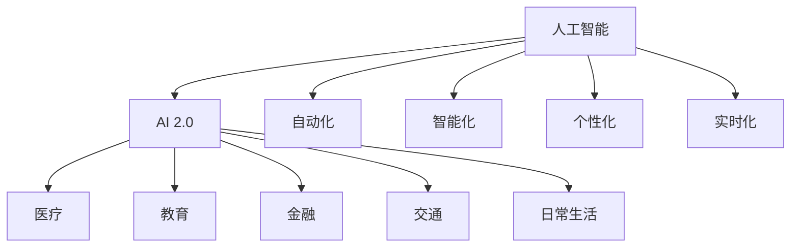

                 

# 李开复：AI 2.0 时代的科技价值

## 1. 背景介绍

### 1.1 问题由来

随着人工智能技术的迅猛发展，我们正处在一个全新的AI时代——AI 2.0时代。这一时代，人工智能从早期的科学研究走向了广泛的应用实践，从过去单纯的技术探索迈向了深度的行业融合和价值创新。AI 2.0 时代，AI技术不仅在技术上取得了突破，而且在社会、经济和伦理层面产生了深远影响。

### 1.2 问题核心关键点

1. **AI 2.0的定义**：AI 2.0是指人工智能在各个领域的应用已经深入到人类社会的各个层面，包括医疗、教育、金融、交通等。AI 2.0时代，人工智能不再是单纯的科技产品，而是成为了推动社会进步、提升人类福祉的重要力量。

2. **AI 2.0的关键特征**：包括自动化、智能化、个性化、实时化等。这些特征使得AI在各个领域的应用更加广泛和深入。

3. **AI 2.0的价值**：AI 2.0时代，人工智能的应用不仅提升了效率和生产力，也带来了全新的商业模式、新的职业机会和社会结构变化。

## 2. 核心概念与联系

### 2.1 核心概念概述

为了更好地理解AI 2.0时代，我们需要明确几个核心概念：

- **人工智能(AI)**：一种模拟人类智能的计算机技术，包括感知、理解、学习、推理和自适应等能力。
- **AI 2.0**：AI技术的应用已经深入到社会的各个层面，从科研、工业、医疗、教育到日常生活。
- **自动化**：通过AI技术实现任务的自动化，减少人工操作，提高效率。
- **智能化**：使机器能够模拟人类智能，处理复杂问题，做出决策。
- **个性化**：根据用户的行为和偏好，提供量身定制的服务。
- **实时化**：能够实时响应和处理任务，满足即时性要求。

这些核心概念共同构成了AI 2.0时代的基石，揭示了人工智能技术的广泛应用和深远影响。

### 2.2 核心概念原理和架构的 Mermaid 流程图



这个流程图展示了AI 2.0时代人工智能技术的应用范围。AI 2.0不仅在科研和技术领域得到应用，也在医疗、教育、金融等各个领域发挥着重要作用。

## 3. 核心算法原理 & 具体操作步骤

### 3.1 算法原理概述

AI 2.0时代的核心算法主要包括以下几种：

- **深度学习**：通过多层神经网络模拟人类大脑的神经元工作方式，处理复杂的数据和问题。
- **自然语言处理(NLP)**：使机器能够理解、处理和生成人类语言。
- **计算机视觉(CV)**：使机器能够理解和分析视觉数据，如图像和视频。
- **机器学习**：使机器能够通过数据学习和改进，提升性能。

这些算法技术在AI 2.0时代得到了广泛应用，推动了人工智能技术的发展。

### 3.2 算法步骤详解

以下是AI 2.0时代核心算法的一般步骤：

1. **数据准备**：收集和处理用于训练和测试的数据，包括数据清洗、标注等。
2. **模型选择**：选择合适的算法和模型架构，如深度神经网络、卷积神经网络、循环神经网络等。
3. **训练**：使用训练数据训练模型，调整模型参数，提高模型性能。
4. **测试**：使用测试数据评估模型性能，进行调优和改进。
5. **应用部署**：将训练好的模型部署到实际应用中，进行实时处理和响应。

### 3.3 算法优缺点

AI 2.0时代的核心算法具有以下优点：

- **高效性**：能够处理大量数据，快速得到结果。
- **精确性**：在特定任务上，可以取得比人工更高的精度。
- **可扩展性**：适用于各种规模的问题和应用场景。

同时，这些算法也存在一些缺点：

- **资源消耗大**：需要大量的计算资源和时间。
- **数据依赖性**：依赖高质量的数据，数据质量问题可能导致模型失效。
- **复杂性**：模型结构和参数较多，难以理解和调试。

### 3.4 算法应用领域

AI 2.0时代的核心算法在多个领域得到了广泛应用：

- **医疗**：用于疾病诊断、药物研发、个性化治疗等。
- **教育**：用于个性化教学、智能辅导、学习分析等。
- **金融**：用于风险评估、投资决策、客户服务等。
- **交通**：用于自动驾驶、智能交通管理、预测分析等。
- **日常**：用于智能家居、智能助理、智能推荐等。

## 4. 数学模型和公式 & 详细讲解 & 举例说明

### 4.1 数学模型构建

AI 2.0时代的核心算法涉及多种数学模型，包括深度神经网络、卷积神经网络、循环神经网络等。这里以深度神经网络为例，介绍其数学模型构建过程。

假设一个深度神经网络由多个隐藏层组成，输入为 $x$，输出为 $y$，损失函数为 $L(y, \hat{y})$，其中 $\hat{y}$ 为模型的预测值。模型训练的目标是最小化损失函数 $L(y, \hat{y})$，得到最优参数 $\theta$。

### 4.2 公式推导过程

以深度神经网络的反向传播算法为例，推导其公式。

假设一个深度神经网络由 $L$ 层组成，每一层的神经元数为 $n_l$，输出为 $y^{(l)}$，输入为 $x^{(l-1)}$。则反向传播算法如下：

1. **前向传播**：
   $$
   y^{(l)} = \sigma(W^{(l)}x^{(l-1)} + b^{(l)})
   $$
   其中，$W^{(l)}$ 和 $b^{(l)}$ 分别为第 $l$ 层的权重和偏置。

2. **计算损失**：
   $$
   L(y, \hat{y}) = \frac{1}{N}\sum_{i=1}^N(y_i - \hat{y}_i)^2
   $$

3. **反向传播**：
   $$
   \frac{\partial L}{\partial W^{(l)}} = \frac{\partial L}{\partial y^{(l)}} \frac{\partial y^{(l)}}{\partial W^{(l)}}
   $$
   其中，$\frac{\partial L}{\partial y^{(l)}}$ 为损失函数对输出层的导数，$\frac{\partial y^{(l)}}{\partial W^{(l)}}$ 为输出层对权重 $W^{(l)}$ 的导数。

### 4.3 案例分析与讲解

以图像分类为例，介绍AI 2.0时代核心算法在图像识别中的应用。

假设有一张图片，通过卷积神经网络进行处理，输出为多个特征图。对于每个特征图，计算损失函数，并反向传播更新权重和偏置，使得模型能够更好地识别图片中的物体。

## 5. 项目实践：代码实例和详细解释说明

### 5.1 开发环境搭建

以下是使用Python进行TensorFlow开发的环境配置流程：

1. 安装Anaconda：从官网下载并安装Anaconda，用于创建独立的Python环境。

2. 创建并激活虚拟环境：
```bash
conda create -n tf-env python=3.8 
conda activate tf-env
```

3. 安装TensorFlow：根据CUDA版本，从官网获取对应的安装命令。例如：
```bash
conda install tensorflow=2.6.0-cp38-cp38
```

4. 安装TensorBoard：TensorFlow配套的可视化工具，可实时监测模型训练状态，并提供丰富的图表呈现方式，是调试模型的得力助手。

5. 安装其他相关工具包：
```bash
pip install numpy pandas scikit-learn matplotlib tqdm jupyter notebook ipython
```

完成上述步骤后，即可在`tf-env`环境中开始AI 2.0时代的项目实践。

### 5.2 源代码详细实现

以下是一个使用TensorFlow进行图像分类的代码实现。

```python
import tensorflow as tf
from tensorflow.keras import layers, models

# 加载数据集
(x_train, y_train), (x_test, y_test) = tf.keras.datasets.mnist.load_data()

# 数据预处理
x_train = x_train / 255.0
x_test = x_test / 255.0
x_train = tf.expand_dims(x_train, axis=-1)
x_test = tf.expand_dims(x_test, axis=-1)

# 定义模型
model = models.Sequential([
    layers.Conv2D(32, (3, 3), activation='relu', input_shape=(28, 28, 1)),
    layers.MaxPooling2D((2, 2)),
    layers.Conv2D(64, (3, 3), activation='relu'),
    layers.MaxPooling2D((2, 2)),
    layers.Conv2D(64, (3, 3), activation='relu'),
    layers.Flatten(),
    layers.Dense(64, activation='relu'),
    layers.Dense(10, activation='softmax')
])

# 编译模型
model.compile(optimizer='adam',
              loss='sparse_categorical_crossentropy',
              metrics=['accuracy'])

# 训练模型
model.fit(x_train, y_train, epochs=5, batch_size=64, validation_data=(x_test, y_test))

# 评估模型
model.evaluate(x_test, y_test)
```

### 5.3 代码解读与分析

让我们再详细解读一下关键代码的实现细节：

**数据预处理**：
- `x_train = x_train / 255.0`：将输入数据归一化到 [0, 1] 范围内。
- `x_train = tf.expand_dims(x_train, axis=-1)`：将数据维度从 (28, 28) 扩展到 (28, 28, 1)，符合模型输入要求。

**模型定义**：
- `model = models.Sequential()`：定义一个Sequential模型，表示线性堆叠的层。
- `layers.Conv2D`：定义卷积层，用于提取特征。
- `layers.MaxPooling2D`：定义池化层，用于降低维度，保留主要特征。
- `layers.Dense`：定义全连接层，用于分类。

**模型编译**：
- `model.compile()`：编译模型，指定优化器、损失函数和评估指标。

**模型训练**：
- `model.fit()`：训练模型，指定训练数据、训练轮数和批次大小。

**模型评估**：
- `model.evaluate()`：评估模型性能，返回损失和准确率。

可以看出，使用TensorFlow进行AI 2.0时代的项目实践相对简单高效，可以大大节省开发时间和精力。

## 6. 实际应用场景

### 6.1 医疗领域

AI 2.0时代的AI技术在医疗领域的应用主要集中在疾病诊断、个性化治疗、药物研发等方面。通过深度学习和大数据技术，AI可以分析大量的医疗数据，辅助医生进行疾病诊断和预测。

**案例**：IBM Watson Health通过自然语言处理和深度学习技术，分析医学文献和电子病历，辅助医生进行疾病诊断和治疗。

### 6.2 教育领域

AI 2.0时代的AI技术在教育领域的应用主要集中在个性化教学、智能辅导、学习分析等方面。通过深度学习和大数据技术，AI可以分析学生的学习行为和成绩，提供个性化的学习建议和辅导。

**案例**：Coursera通过推荐算法和自然语言处理技术，根据学生的学习历史和兴趣，推荐适合的学习资源。

### 6.3 金融领域

AI 2.0时代的AI技术在金融领域的应用主要集中在风险评估、投资决策、客户服务等方面。通过深度学习和大数据技术，AI可以分析金融市场数据，预测市场趋势和风险，提供个性化的金融服务。

**案例**：JPMorgan Chase通过自然语言处理和深度学习技术，分析新闻和社交媒体，预测市场趋势，辅助投资决策。

### 6.4 交通领域

AI 2.0时代的AI技术在交通领域的应用主要集中在自动驾驶、智能交通管理、预测分析等方面。通过计算机视觉和深度学习技术，AI可以分析交通数据，辅助交通管理，提升交通效率。

**案例**：Waymo通过深度学习和计算机视觉技术，训练自动驾驶汽车，实现自动驾驶功能。

## 7. 工具和资源推荐

### 7.1 学习资源推荐

为了帮助开发者系统掌握AI 2.0时代的技术基础和应用实践，这里推荐一些优质的学习资源：

1. 《深度学习》（Ian Goodfellow等著）：全面介绍了深度学习的基本原理和算法，是AI 2.0时代不可或缺的入门读物。

2. 《TensorFlow实战指南》（Manning出版社）：介绍了TensorFlow的基本用法和实际案例，适合初学者和中级开发者。

3. Coursera和edX的AI课程：提供了来自世界顶级大学和公司的AI课程，涵盖从基础到高级的多个主题，是全面学习AI 2.0时代知识的绝佳平台。

4. ArXiv和Google Scholar：全球顶级学术资源平台，可以快速获取最新的AI 2.0时代研究论文和技术进展。

### 7.2 开发工具推荐

高效的开发离不开优秀的工具支持。以下是几款用于AI 2.0时代AI开发的工具：

1. TensorFlow：Google主导的深度学习框架，支持动态图和静态图，广泛应用于AI 2.0时代。

2. PyTorch：Facebook开发的深度学习框架，支持动态图和静态图，易于调试和优化。

3. Keras：高层次的深度学习API，支持TensorFlow和Theano后端，易于上手和使用。

4. Jupyter Notebook：交互式编程环境，支持多种编程语言，适合做原型开发和实验。

5. Colaboratory：Google提供的交互式Jupyter Notebook环境，支持GPU加速，适合AI 2.0时代的深度学习开发。

6. NVIDIA GPU：高性能计算平台，支持深度学习和计算机视觉等任务，是AI 2.0时代的计算基础。

合理利用这些工具，可以显著提升AI 2.0时代的开发效率，加快创新迭代的步伐。

### 7.3 相关论文推荐

AI 2.0时代的核心技术发展源于学界的持续研究。以下是几篇奠基性的相关论文，推荐阅读：

1. AlexNet：ImageNet大规模视觉识别竞赛的冠军，标志着深度学习在计算机视觉领域的应用。

2. AlphaGo：谷歌DeepMind开发的围棋AI，首次在围棋领域击败人类冠军，展示了深度学习的潜力。

3. Transformer：Google开发的自然语言处理模型，通过自注意力机制，在多个NLP任务上取得了SOTA。

4. GAN：生成对抗网络，通过生成器和判别器的对抗训练，实现了高质量的图像生成。

5. AutoML：自动机器学习，通过自动化模型选择和超参数优化，提升了机器学习模型的开发效率。

这些论文代表了大AI 2.0时代的技术发展脉络。通过学习这些前沿成果，可以帮助研究者把握学科前进方向，激发更多的创新灵感。

## 8. 总结：未来发展趋势与挑战

### 8.1 总结

本文对AI 2.0时代的科技价值进行了全面系统的介绍。首先阐述了AI 2.0时代的定义和核心特征，明确了AI 2.0时代的广泛应用和深远影响。其次，从原理到实践，详细讲解了深度学习、自然语言处理、计算机视觉等核心算法，并给出了实际项目开发的代码实例。同时，本文还广泛探讨了AI 2.0时代在医疗、教育、金融等领域的实际应用场景，展示了AI 2.0时代的广阔前景。此外，本文精选了AI 2.0时代的学习资源和开发工具，力求为读者提供全方位的技术指引。

通过本文的系统梳理，可以看到，AI 2.0时代的人工智能技术已经深入到社会的各个层面，成为推动社会进步、提升人类福祉的重要力量。未来，伴随AI技术的不断发展，AI 2.0时代将带来更多创新应用，为人类社会带来更深远的影响。

### 8.2 未来发展趋势

展望未来，AI 2.0时代的人工智能技术将呈现以下几个发展趋势：

1. **自动化程度提升**：随着深度学习和大数据技术的发展，自动化程度将不断提高，更多复杂任务将得以自动化处理。

2. **智能化水平增强**：通过深度学习和大数据技术，AI将具备更加强大的智能化能力，能够处理更多复杂问题。

3. **个性化服务普及**：通过深度学习和大数据技术，AI将能够提供更加个性化的服务，满足不同用户的需求。

4. **实时化能力增强**：随着计算能力的提升，AI将具备更强的实时化能力，能够快速响应用户需求。

5. **跨领域融合深化**：AI技术将与其他领域的技术进行深度融合，实现更广泛的应用。

6. **伦理和安全问题得到重视**：随着AI技术的广泛应用，伦理和安全问题将得到更多关注，AI技术将更加注重合规性和安全性。

以上趋势凸显了AI 2.0时代的广阔前景。这些方向的探索发展，必将进一步提升AI技术的应用范围和效果，为人类社会带来更多福祉。

### 8.3 面临的挑战

尽管AI 2.0时代的人工智能技术已经取得了瞩目成就，但在迈向更加智能化、普适化应用的过程中，它仍面临诸多挑战：

1. **数据质量和数量问题**：AI需要大量的高质量数据进行训练，但获取高质量的数据往往成本高昂，数据分布不均等问题仍然存在。

2. **算力和资源问题**：AI技术需要高性能的计算资源，但随着模型复杂度的增加，算力和资源消耗也在不断增加。

3. **算法透明度和可解释性问题**：AI模型往往是"黑盒"系统，难以解释其内部工作机制和决策逻辑，这在医疗、金融等高风险应用中尤为重要。

4. **伦理和安全问题**：AI技术的应用可能引发伦理和安全问题，如数据隐私、算法偏见、恶意用途等。

5. **模型泛化能力和鲁棒性问题**：AI模型在面对新数据时，可能出现泛化能力不足和鲁棒性问题。

6. **模型可维护性和可扩展性问题**：AI模型结构复杂，维护和扩展难度较大，需要更多的技术支持和工具支持。

这些挑战需要在未来的研究中加以解决，才能充分发挥AI 2.0时代的科技价值。

### 8.4 研究展望

为了应对AI 2.0时代的挑战，未来的研究需要在以下几个方面寻求新的突破：

1. **数据生成和增强技术**：通过生成对抗网络等技术，生成更多的高质量数据，解决数据质量和数量问题。

2. **高效计算和模型压缩**：通过模型压缩、量化等技术，降低算力和资源消耗，提高计算效率。

3. **可解释性和透明度**：通过可解释性和透明度技术，提升AI模型的可解释性和可信度，满足高风险应用的需求。

4. **伦理和安全机制**：建立AI技术的伦理和安全机制，确保技术应用符合人类价值观和伦理道德。

5. **跨领域融合技术**：推动AI技术与更多领域的技术进行深度融合，实现更广泛的应用。

6. **模型可维护性和可扩展性**：通过模块化和自动化技术，提升AI模型的可维护性和可扩展性。

这些研究方向的探索，必将引领AI 2.0时代的AI技术迈向更高的台阶，为构建人机协同的智能系统铺平道路。

## 9. 附录：常见问题与解答

**Q1：AI 2.0时代的人工智能技术有哪些特点？**

A: AI 2.0时代的人工智能技术主要具有以下几个特点：

1. **自动化程度提升**：能够自动化处理更多复杂任务，提升效率。

2. **智能化水平增强**：具备更强大的智能化能力，能够处理更多复杂问题。

3. **个性化服务普及**：提供更加个性化的服务，满足不同用户的需求。

4. **实时化能力增强**：具备更强的实时化能力，能够快速响应用户需求。

5. **跨领域融合深化**：与其他领域的技术进行深度融合，实现更广泛的应用。

6. **伦理和安全问题得到重视**：注重合规性和安全性，满足高风险应用的需求。

**Q2：AI 2.0时代的人工智能技术在哪些领域得到了广泛应用？**

A: AI 2.0时代的人工智能技术在多个领域得到了广泛应用，包括：

1. **医疗**：用于疾病诊断、个性化治疗、药物研发等方面。

2. **教育**：用于个性化教学、智能辅导、学习分析等方面。

3. **金融**：用于风险评估、投资决策、客户服务等方面。

4. **交通**：用于自动驾驶、智能交通管理、预测分析等方面。

5. **日常**：用于智能家居、智能助理、智能推荐等方面。

**Q3：AI 2.0时代的AI技术有哪些优势？**

A: AI 2.0时代的AI技术具有以下几个优势：

1. **高效性**：能够处理大量数据，快速得到结果。

2. **精确性**：在特定任务上，可以取得比人工更高的精度。

3. **可扩展性**：适用于各种规模的问题和应用场景。

4. **自动化**：能够自动化处理更多复杂任务，提升效率。

5. **智能化**：具备更强大的智能化能力，能够处理更多复杂问题。

6. **实时化**：具备更强的实时化能力，能够快速响应用户需求。

**Q4：AI 2.0时代的AI技术有哪些挑战？**

A: AI 2.0时代的AI技术面临以下几个挑战：

1. **数据质量和数量问题**：获取高质量的数据往往成本高昂，数据分布不均等问题仍然存在。

2. **算力和资源问题**：AI技术需要高性能的计算资源，但随着模型复杂度的增加，算力和资源消耗也在不断增加。

3. **算法透明度和可解释性问题**：AI模型往往是"黑盒"系统，难以解释其内部工作机制和决策逻辑。

4. **伦理和安全问题**：AI技术的应用可能引发伦理和安全问题，如数据隐私、算法偏见、恶意用途等。

5. **模型泛化能力和鲁棒性问题**：AI模型在面对新数据时，可能出现泛化能力不足和鲁棒性问题。

6. **模型可维护性和可扩展性问题**：AI模型结构复杂，维护和扩展难度较大，需要更多的技术支持和工具支持。

正视这些挑战，积极应对并寻求突破，将是大AI 2.0时代的AI技术迈向成熟的必由之路。

---

作者：禅与计算机程序设计艺术 / Zen and the Art of Computer Programming

