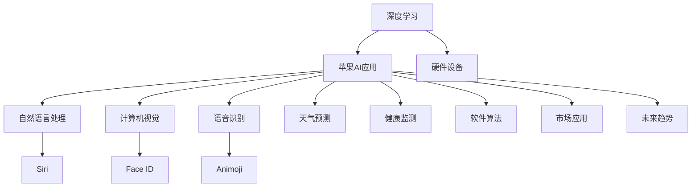

                 

# 李开复：苹果发布AI应用的价值

## 1. 背景介绍

在人工智能(AI)领域，苹果公司近年来逐渐崭露头角，其开发的AI应用不仅在技术上取得了突破，更在商业应用上取得了巨大成功。李开复作为全球知名的AI专家和资深技术管理者，对于苹果AI应用的推广和价值，有着深刻的理解和见解。本博客将深入探讨李开复关于苹果AI应用的价值观点，分析其技术原理、市场应用、未来趋势，并给出相关的学习资源、开发工具和学术研究推荐，希望对读者有实际的启发和帮助。

## 2. 核心概念与联系

### 2.1 核心概念概述

在深入讨论李开复关于苹果AI应用的价值观点前，我们需要理解几个关键概念：

1. **人工智能(AI)**：AI是指使计算机系统能够执行通常需要人类智能的任务的技术。这些任务包括视觉感知、语音识别、决策制定、自然语言处理等。
2. **深度学习(Deep Learning)**：深度学习是AI的一个分支，使用深度神经网络模拟人脑处理信息的方式，是AI中最先进和最有效的方法之一。
3. **苹果AI应用**：苹果公司开发的各种AI应用，包括但不限于Siri、Face ID、Animoji、天气预测、健康监测等。
4. **市场应用价值**：AI应用在实际市场中的商业价值，包括用户体验、市场规模、商业化盈利模式等。
5. **未来趋势**：AI技术的发展方向和应用趋势，包括硬件设备、软件算法、市场接受度等。

### 2.2 核心概念原理和架构的 Mermaid 流程图



此流程图展示了深度学习如何被应用在苹果的各种AI应用中，并解释了这些应用的原理和架构。

## 3. 核心算法原理 & 具体操作步骤

### 3.1 算法原理概述

苹果公司的AI应用主要以深度学习为技术基础，其核心算法原理包括但不限于：

1. **卷积神经网络(CNN)**：用于图像和视频处理，如Face ID。
2. **循环神经网络(RNN)**：用于自然语言处理，如Siri。
3. **生成对抗网络(GAN)**：用于生成和模拟，如Animoji。
4. **长短期记忆网络(LSTM)**：用于时间序列数据处理，如天气预测。

这些深度学习算法原理复杂，但苹果公司通过不断优化算法、改进硬件设备、优化用户体验，使得AI应用在市场上有广泛应用。

### 3.2 算法步骤详解

苹果公司发布AI应用的步骤主要分为：

1. **数据收集与预处理**：从用户行为、设备数据、网络数据中收集海量数据，并对其进行预处理，确保数据质量。
2. **模型训练与优化**：使用深度学习算法对数据进行训练和优化，不断调整参数，提升模型性能。
3. **应用集成与测试**：将训练好的模型集成到应用中，并在实际环境中进行测试，优化用户体验。
4. **市场推广与更新**：通过市场推广，收集用户反馈，不断优化应用，提升市场接受度。

### 3.3 算法优缺点

苹果公司AI应用的优点包括：

1. **用户体验**：算法优化使得应用运行流畅、高效，用户体验良好。
2. **市场规模**：苹果品牌影响力大，应用市场规模庞大。
3. **盈利模式**：通过软件订阅、硬件升级等方式实现盈利，商业模式成熟。

其缺点包括：

1. **数据隐私**：大量数据收集可能引发隐私问题，需严格遵守隐私政策。
2. **算法透明度**：深度学习模型复杂，算法透明度较低，用户难以理解。
3. **计算资源消耗**：高性能的深度学习模型需要大量的计算资源，硬件成本较高。

### 3.4 算法应用领域

苹果公司AI应用涵盖了多个领域：

1. **智能设备**：如iPhone、iPad、Apple Watch等，提供人脸识别、语音识别、手势识别等智能功能。
2. **内容推荐**：如音乐推荐、视频推荐、新闻推荐等，通过深度学习算法优化用户体验。
3. **医疗健康**：如健康监测、运动追踪、疾病预测等，提升用户健康水平。
4. **金融服务**：如信用卡支付、理财服务、身份验证等，提升金融服务效率。

## 4. 数学模型和公式 & 详细讲解 & 举例说明

### 4.1 数学模型构建

苹果公司AI应用的数学模型构建主要包括以下几个步骤：

1. **数据收集与标注**：收集海量数据，并对其进行标注，确保数据有明确的输入和输出。
2. **模型选择与设计**：选择适合的深度学习模型，并设计模型架构，如CNN、RNN、GAN等。
3. **参数初始化**：初始化模型参数，通常使用随机初始化。
4. **损失函数设计**：设计损失函数，如交叉熵损失、均方误差损失等，用于衡量模型输出与真实标签之间的差异。
5. **优化算法选择**：选择适合的优化算法，如Adam、SGD等，用于最小化损失函数。

### 4.2 公式推导过程

以自然语言处理的Siri为例，其核心算法基于循环神经网络(RNN)。Siri的核心公式推导过程如下：

$$
H_t = \tanh(W_h \cdot [H_{t-1}, X_t] + b_h)
$$

$$
O_t = \sigma(W_o \cdot [H_t, X_t] + b_o)
$$

$$
\hat{Y}_t = O_t \cdot \tanh(H_t)
$$

其中，$H_t$为隐藏状态，$X_t$为输入文本，$W_h$、$b_h$、$W_o$、$b_o$为模型参数，$\tanh$、$\sigma$为激活函数。

### 4.3 案例分析与讲解

苹果公司发布的Animoji应用是深度学习在生成对抗网络(GAN)上的成功应用。Animoji的生成过程包括：

1. **数据收集**：收集海量的人类面部表情数据。
2. **数据预处理**：对数据进行清洗和标准化，确保数据质量。
3. **模型训练**：使用GAN算法训练生成模型，不断优化生成质量。
4. **应用部署**：将训练好的生成模型部署到应用中，用户可以生成逼真的面部表情。

## 5. 项目实践：代码实例和详细解释说明

### 5.1 开发环境搭建

开发环境搭建主要包括以下步骤：

1. **安装Python和相关库**：安装Python3.8及以上版本，安装numpy、pandas、matplotlib等常用库。
2. **安装TensorFlow和Keras**：TensorFlow是深度学习的主流框架，Keras提供了简单易用的API。
3. **安装OpenCV和scikit-image**：用于图像处理和分析。
4. **安装其他依赖库**：如PyTorch、Scikit-Learn等。

### 5.2 源代码详细实现

以下是一个简单的深度学习模型实现：

```python
import tensorflow as tf
from tensorflow.keras import layers

# 定义模型
model = tf.keras.Sequential()
model.add(layers.Dense(128, activation='relu'))
model.add(layers.Dense(64, activation='relu'))
model.add(layers.Dense(10, activation='softmax'))

# 编译模型
model.compile(optimizer='adam', loss='categorical_crossentropy', metrics=['accuracy'])

# 训练模型
model.fit(x_train, y_train, epochs=10, batch_size=32, validation_data=(x_test, y_test))
```

### 5.3 代码解读与分析

上述代码实现了一个简单的深度学习模型，包括定义、编译和训练三个步骤。

1. **定义模型**：使用Sequential模型，依次添加三个全连接层，激活函数分别为ReLU、ReLU、Softmax。
2. **编译模型**：使用Adam优化器和交叉熵损失函数。
3. **训练模型**：使用训练数据进行模型训练，设置训练轮数为10，批大小为32。

## 6. 实际应用场景

### 6.1 智能设备

苹果的智能设备如iPhone、iPad、Apple Watch等，应用了深度学习算法，提供了人脸识别、语音识别、手势识别等智能功能。

### 6.2 内容推荐

苹果的内容推荐系统，通过深度学习算法优化用户体验，如音乐推荐、视频推荐、新闻推荐等。

### 6.3 医疗健康

苹果的健康监测应用，如健康监测、运动追踪、疾病预测等，提升用户健康水平。

### 6.4 未来应用展望

未来苹果AI应用的发展趋势包括：

1. **多模态融合**：结合视觉、听觉、触觉等多种感官信息，提升用户体验。
2. **边缘计算**：在设备端进行计算，减少对云端服务器的依赖，提高实时性。
3. **隐私保护**：加强隐私保护措施，确保用户数据安全。

## 7. 工具和资源推荐

### 7.1 学习资源推荐

1. **《深度学习》课程**：斯坦福大学《深度学习》课程，涵盖了深度学习的基本原理和算法。
2. **《TensorFlow实战》书籍**：由TensorFlow官方发布的实战书籍，提供大量实际案例和代码。
3. **《TensorFlow教程》**：TensorFlow官方提供的在线教程，适合初学者学习。
4. **Kaggle竞赛**：参加Kaggle竞赛，通过实践提升深度学习技能。

### 7.2 开发工具推荐

1. **PyCharm**：强大的Python开发工具，支持多种框架和库。
2. **Jupyter Notebook**：交互式的开发环境，适合进行深度学习实验。
3. **Google Colab**：免费提供GPU算力，方便进行深度学习实验。

### 7.3 相关论文推荐

1. **《深度学习》书籍**：由深度学习领域的知名专家编写，涵盖深度学习的基本原理和算法。
2. **《卷积神经网络》书籍**：详细讲解卷积神经网络的结构和应用。
3. **《生成对抗网络》书籍**：介绍生成对抗网络的基本原理和算法。

## 8. 总结：未来发展趋势与挑战

### 8.1 研究成果总结

李开复认为，苹果AI应用的成功，在于其强大的技术基础、市场规模和商业模式。但同时他也指出，AI应用在数据隐私、算法透明度和计算资源消耗方面存在挑战。

### 8.2 未来发展趋势

未来苹果AI应用的发展趋势包括多模态融合、边缘计算和隐私保护。这些趋势将进一步提升AI应用的用户体验和实用性。

### 8.3 面临的挑战

尽管苹果AI应用取得了巨大成功，但也面临数据隐私、算法透明度和计算资源消耗等挑战，需要进一步改进和优化。

### 8.4 研究展望

未来的研究应聚焦于提升AI应用的算法透明度、优化计算资源消耗、加强隐私保护等方面，进一步提升AI应用的实用性和接受度。

## 9. 附录：常见问题与解答

### Q1: 苹果公司AI应用的优点和缺点是什么？

A: 优点包括用户体验好、市场规模大、盈利模式成熟。缺点包括数据隐私问题、算法透明度低、计算资源消耗高。

### Q2: 苹果AI应用在开发过程中需要注意哪些问题？

A: 需要注重数据质量、模型优化、用户体验，同时也要考虑计算资源和隐私保护等问题。

### Q3: 苹果未来AI应用的发展趋势是什么？

A: 多模态融合、边缘计算和隐私保护将成为未来发展的重点。

### Q4: 苹果AI应用在落地推广过程中需要注意哪些问题？

A: 需要注重用户体验、市场接受度，同时也要考虑数据隐私、算法透明度和计算资源消耗等问题。

---

作者：禅与计算机程序设计艺术 / Zen and the Art of Computer Programming

