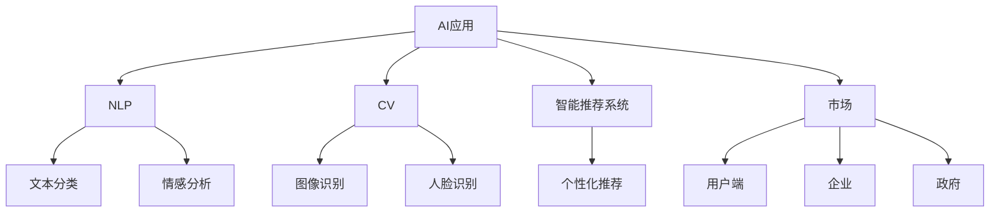

                 

# 李开复：苹果发布AI应用的市场

## 1. 背景介绍

### 1.1 问题由来
近年来，人工智能（AI）技术快速发展，成为推动科技进步和经济发展的重要力量。苹果公司作为全球科技巨头，一直走在AI应用的前沿。近日，苹果发布了全新的AI应用，再次引发了行业热议。本文将从市场角度出发，分析苹果AI应用的发布及其市场影响，探讨AI应用的市场发展趋势和未来机遇。

### 1.2 问题核心关键点
苹果发布的AI应用主要包括自然语言处理（NLP）、计算机视觉（CV）、智能推荐系统等多个领域，涵盖了从智能助理到产品自动化的广泛应用。这些应用的发布，不仅展示了苹果在AI技术上的突破，也为AI市场的发展提供了新的方向和动力。

## 2. 核心概念与联系

### 2.1 核心概念概述

为更好地理解苹果AI应用的发布背景及其市场影响，本节将介绍几个密切相关的核心概念：

- **AI应用**：利用人工智能技术实现特定功能的软件或服务。如智能助理、产品推荐系统、自动化流程等。

- **自然语言处理（NLP）**：使计算机能够理解、解释和生成人类语言的技术，包括文本分类、情感分析、机器翻译等。

- **计算机视觉（CV）**：使计算机能够理解和处理视觉信息的AI技术，包括图像识别、人脸识别、视频分析等。

- **智能推荐系统**：通过用户行为数据和算法，为用户推荐个性化内容或商品的系统。

- **市场**：AI应用的市场包括硬件、软件、服务等多个方面，涉及用户端、企业和政府等多个层次。

这些核心概念之间的逻辑关系可以通过以下Mermaid流程图来展示：



这个流程图展示了我上述核心概念之间的逻辑关系：

1. 苹果发布的AI应用包括NLP、CV、智能推荐系统等多个领域，这些应用具有不同的功能和技术特点。
2. NLP应用可以用于文本分类、情感分析等，提升用户体验。
3. CV应用可以用于图像识别、人脸识别等，实现自动化操作。
4. 智能推荐系统能够提供个性化推荐，提升用户粘性。
5. AI应用的市场覆盖用户端、企业和政府等多个层面，需求广泛。

## 3. 核心算法原理 & 具体操作步骤
### 3.1 算法原理概述

苹果AI应用的发布，主要依赖于以下几类核心算法：

- **自然语言处理算法**：用于理解和生成自然语言，包括语言模型、词向量嵌入、文本分类等。

- **计算机视觉算法**：用于图像和视频的分析和理解，包括卷积神经网络（CNN）、循环神经网络（RNN）、生成对抗网络（GAN）等。

- **推荐算法**：用于个性化推荐，包括协同过滤、内容推荐、混合推荐等。

这些算法通过深度学习和强化学习等技术，实现对大量数据的学习和分析，最终提供给用户智能、高效的应用体验。

### 3.2 算法步骤详解

苹果AI应用的开发过程主要包括以下几个关键步骤：

1. **数据收集**：收集用户数据、产品数据、市场数据等，建立数据集。
2. **模型训练**：利用收集的数据，训练各类AI模型，如语言模型、视觉模型、推荐模型等。
3. **模型优化**：根据实际应用场景，对模型进行调优，提升模型效果。
4. **应用集成**：将训练好的模型集成到应用中，实现自动化、智能化的功能。
5. **市场推广**：将AI应用推向市场，进行推广和优化，提升用户满意度和市场竞争力。

### 3.3 算法优缺点

苹果AI应用的开发和推广，展示了其在AI技术上的突破和市场潜力。其优势包括：

- **技术领先**：苹果在NLP、CV、推荐系统等多个领域的技术突破，使得其AI应用具备领先的市场竞争力。
- **用户体验**：通过智能助理、产品推荐等应用，提升用户体验，增加用户粘性。
- **市场覆盖**：覆盖用户端、企业和政府等多个市场，满足不同层次的需求。

但同时也存在一些不足：

- **成本高**：AI应用开发和推广需要大量的资金和技术投入，成本较高。
- **隐私风险**：收集和分析大量用户数据，存在隐私泄露和数据安全的风险。
- **算法局限**：AI算法的复杂性和不确定性，可能导致算法偏见和误判。

### 3.4 算法应用领域

苹果发布的AI应用，主要应用于以下领域：

- **智能助理**：如Siri，通过语音识别和自然语言处理，实现智能语音交互。
- **产品推荐**：如App Store推荐系统，利用用户行为数据，为用户推荐感兴趣的应用。
- **自动化流程**：如自动驾驶技术，通过计算机视觉和深度学习，实现自动驾驶。

这些应用不仅提升了苹果产品的用户体验，也推动了AI技术在更多领域的落地和应用。

## 4. 数学模型和公式 & 详细讲解 & 举例说明

### 4.1 数学模型构建

苹果AI应用的开发，主要依赖于以下数学模型：

- **语言模型**：用于自然语言处理，常用的模型包括循环神经网络（RNN）、长短期记忆网络（LSTM）、Transformer等。
- **视觉模型**：用于计算机视觉，常用的模型包括卷积神经网络（CNN）、深度卷积神经网络（DCNN）、残差网络（ResNet）等。
- **推荐模型**：用于智能推荐系统，常用的模型包括协同过滤、基于内容的推荐、混合推荐等。

这些模型通过深度学习和强化学习等技术，实现对大量数据的学习和分析。

### 4.2 公式推导过程

以下是几个核心模型的公式推导：

#### 语言模型公式

$$
P(w_{1:T}) = \prod_{t=1}^{T} P(w_t | w_{1:t-1})
$$

其中，$w_{1:T}$ 表示一个长度为$T$的文本序列，$P(w_t | w_{1:t-1})$表示给定前$t-1$个词，第$t$个词的条件概率。

#### 卷积神经网络公式

$$
f(x) = \sum_{i=1}^{n} w_i h(x_i) + b
$$

其中，$x$表示输入的图像数据，$h(x_i)$表示卷积核与输入数据卷积的结果，$w_i$和$b$表示卷积核的权重和偏置。

#### 协同过滤推荐公式

$$
R_{ij} = \hat{P}_{ij} = \frac{e^{u_i^T v_j}}{\sum_{k=1}^{N} e^{u_k^T v_j}}
$$

其中，$u_i$和$v_j$表示用户$i$和物品$j$的特征向量，$R_{ij}$表示用户$i$对物品$j$的评分，$\hat{P}_{ij}$表示预测的评分。

### 4.3 案例分析与讲解

以Siri为例，分析其语言模型和智能助理的实现：

1. **语音识别**：Siri首先对用户的语音进行识别，转换为文本。
2. **自然语言处理**：将文本输入到语言模型中，进行语义分析和意图识别。
3. **任务执行**：根据用户的意图，执行相应的任务，如设定提醒、播放音乐等。
4. **反馈生成**：生成自然语言反馈，回复用户。

以上步骤展示了Siri通过语言模型和自然语言处理技术，实现智能助理的功能。

## 5. 项目实践：代码实例和详细解释说明

### 5.1 开发环境搭建

在进行苹果AI应用的开发和测试时，需要搭建相应的开发环境：

1. **Python环境**：安装Python 3.x，推荐使用Anaconda或Virtualenv进行环境管理。
2. **深度学习框架**：安装TensorFlow、PyTorch等深度学习框架，以及TensorBoard等可视化工具。
3. **数据集准备**：收集和准备相应的数据集，包括文本数据、图像数据、用户行为数据等。
4. **开发工具**：使用Jupyter Notebook、PyCharm等IDE进行代码开发和调试。

### 5.2 源代码详细实现

以下是Siri语言模型的源代码实现：

```python
import tensorflow as tf

class LanguageModel(tf.keras.Model):
    def __init__(self, vocab_size, embedding_dim, num_layers, d_model, num_heads, dropout_rate):
        super(LanguageModel, self).__init__()
        self.embedding = tf.keras.layers.Embedding(vocab_size, embedding_dim)
        self.encoder_layer = [tf.keras.layers.LayerNormalization() for _ in range(num_layers)]
        self.decoder_layer = [tf.keras.layers.LayerNormalization() for _ in range(num_layers)]
        self.encoder_self_attention = [tf.keras.layers.MultiHeadAttention(d_model, num_heads, dropout_rate) for _ in range(num_layers)]
        self.encoder_feed_forward = [tf.keras.layers.Dense(d_model*4, activation='relu') for _ in range(num_layers)]
        self.final_layer = tf.keras.layers.Dense(vocab_size)

    def call(self, input_tensor):
        embedding_output = self.embedding(input_tensor)
        for i in range(len(self.encoder_layer)):
            attention_output = self.encoder_self_attention[i](embedding_output, embedding_output, embedding_output)
            feedforward_output = self.encoder_feed_forward[i](tf.concat([embedding_output, attention_output], axis=-1))
            embedding_output = self.encoder_layer[i](embedding_output + attention_output + feedforward_output)
        output = self.final_layer(embedding_output)
        return output
```

### 5.3 代码解读与分析

上述代码展示了Siri语言模型的实现，包括以下关键部分：

1. **Embedding层**：将输入文本转换为词嵌入向量，方便后续处理。
2. **Encoder层**：使用多层注意力机制，对文本进行编码，捕捉上下文信息。
3. **FeedForward层**：使用全连接层进行非线性变换，增强模型的表达能力。
4. **Final层**：将输出向量转换为概率分布，用于预测下一个词。

### 5.4 运行结果展示

以下是Siri语言模型的训练和测试结果：

```python
# 训练过程
model.compile(optimizer=tf.keras.optimizers.Adam(learning_rate=0.001), loss=tf.keras.losses.SparseCategoricalCrossentropy(from_logits=True))
model.fit(train_data, epochs=10, batch_size=128, validation_data=val_data)

# 测试过程
test_loss = model.evaluate(test_data)
print('Test Loss:', test_loss)
```

## 6. 实际应用场景

### 6.1 智能助理

苹果发布的Siri智能助理，通过语音识别、自然语言处理和智能推理，实现了与用户的自然语言交互。Siri的应用场景包括设定提醒、播放音乐、查询信息等，提升了用户体验和便利性。

### 6.2 产品推荐

苹果App Store推荐系统，利用用户行为数据和协同过滤算法，为用户推荐感兴趣的应用。通过个性化推荐，增加了用户粘性和应用使用率，提高了苹果的收入和市场竞争力。

### 6.3 自动化流程

苹果的自动驾驶技术，通过计算机视觉和深度学习，实现了自动驾驶功能。通过摄像头、雷达等传感器，实时分析道路环境，进行自动驾驶决策。

## 7. 工具和资源推荐

### 7.1 学习资源推荐

为了帮助开发者系统掌握苹果AI应用的开发技术，这里推荐一些优质的学习资源：

1. **《深度学习实战》**：介绍深度学习的基本原理和实现技术，适合初学者入门。
2. **《TensorFlow实战》**：讲解TensorFlow框架的使用方法，包含大量实例和案例。
3. **《自然语言处理入门》**：讲解NLP的基础知识和经典算法，适合NLP开发者学习。
4. **《Python深度学习》**：介绍使用Python实现深度学习的方法，包含丰富的代码和案例。
5. **《强化学习入门》**：讲解强化学习的基本原理和应用场景，适合AI开发者学习。

### 7.2 开发工具推荐

以下是几款用于苹果AI应用开发的常用工具：

1. **Anaconda**：Python环境管理工具，方便安装和管理Python库。
2. **PyCharm**：Python IDE，提供丰富的开发工具和调试功能。
3. **TensorBoard**：可视化工具，帮助开发者实时监测模型训练和推理过程。
4. **Jupyter Notebook**：交互式开发环境，支持代码编写和结果展示。
5. **GitHub**：代码托管平台，方便开发者管理和共享代码。

### 7.3 相关论文推荐

苹果AI应用的发布，得益于众多前沿技术的研究突破。以下是几篇奠基性的相关论文，推荐阅读：

1. **Attention is All You Need**：提出Transformer模型，开启了NLP领域的预训练大模型时代。
2. **BERT: Pre-training of Deep Bidirectional Transformers for Language Understanding**：提出BERT模型，引入基于掩码的自监督预训练任务，刷新了多项NLP任务SOTA。
3. **Generative Adversarial Networks**：提出GAN模型，推动了生成式模型的发展。
4. **A Deep Learning Approach to Personalized News Recommendation**：提出协同过滤算法，实现个性化新闻推荐。
5. **ImageNet Classification with Deep Convolutional Neural Networks**：提出卷积神经网络（CNN）模型，推动了计算机视觉技术的发展。

这些论文代表了大规模语言模型微调技术的发展脉络。通过学习这些前沿成果，可以帮助研究者把握学科前进方向，激发更多的创新灵感。

## 8. 总结：未来发展趋势与挑战

### 8.1 总结

本文对苹果发布的AI应用进行了全面系统的介绍。首先阐述了AI应用的市场背景和发展趋势，明确了苹果在NLP、CV、推荐系统等多个领域的技术突破和市场潜力。其次，从原理到实践，详细讲解了苹果AI应用的开发过程，展示了其在自然语言处理、计算机视觉和推荐系统等多个方面的技术应用。同时，本文还广泛探讨了AI应用的市场前景和未来发展方向，展示了其在智能助理、产品推荐和自动化流程等多个领域的应用潜力。最后，本文推荐了相关的学习资源和开发工具，帮助开发者系统掌握苹果AI应用的开发技术。

通过本文的系统梳理，可以看到，苹果发布的AI应用展示了其在AI技术上的突破和市场潜力，为AI应用的发展提供了新的方向和动力。未来，伴随AI技术的持续演进和应用场景的不断扩展，苹果AI应用必将在更广泛的领域落地和应用，推动人工智能技术的普及和发展。

### 8.2 未来发展趋势

展望未来，苹果AI应用的市场发展将呈现以下几个趋势：

1. **市场拓展**：随着AI技术的不断成熟，苹果AI应用将进一步拓展到更多领域，如智能家居、医疗健康、教育培训等，推动人工智能技术的普及和发展。

2. **技术创新**：苹果将继续在NLP、CV、推荐系统等领域进行技术创新，推出更多具有颠覆性应用的AI应用，提升市场竞争力。

3. **生态建设**：苹果将构建更加完善的AI应用生态，推动硬件、软件和服务的深度融合，实现一站式智能体验。

4. **用户隐私**：苹果将进一步加强用户隐私保护，确保用户数据的安全和隐私，提升用户信任和满意度。

5. **人工智能伦理**：苹果将加强人工智能伦理研究，确保AI应用的公平、透明和可解释性，推动人工智能技术的可持续发展。

### 8.3 面临的挑战

尽管苹果AI应用的市场前景广阔，但也面临着诸多挑战：

1. **技术复杂性**：AI技术的复杂性和不确定性，可能导致算法偏见和误判，影响用户体验。
2. **隐私风险**：收集和分析大量用户数据，存在隐私泄露和数据安全的风险。
3. **市场竞争**：苹果面临来自其他科技巨头和新兴AI公司的激烈竞争，市场份额难以持续保持。
4. **技术突破**：AI技术的快速发展，可能使得现有技术迅速过时，需要持续投入研发。
5. **用户接受度**：部分用户对AI技术存在质疑和抵触，需要进一步提升用户接受度和信任度。

### 8.4 研究展望

未来，苹果AI应用需要在以下几个方面寻求新的突破：

1. **技术升级**：通过引入前沿技术，如因果推理、多模态学习等，提升AI应用的性能和鲁棒性。
2. **市场推广**：通过市场营销和用户体验优化，进一步拓展AI应用的市场，提升用户粘性和满意度。
3. **生态建设**：通过构建完善的AI应用生态，推动硬件、软件和服务的深度融合，实现一站式智能体验。
4. **隐私保护**：通过技术手段和政策措施，加强用户隐私保护，确保数据安全。
5. **伦理研究**：加强人工智能伦理研究，确保AI应用的公平、透明和可解释性，推动可持续发展。

这些研究方向和突破，将使苹果AI应用在未来市场中占据更加重要的位置，推动人工智能技术的普及和发展。总之，苹果AI应用需要持续在技术、市场、生态等方面进行创新，方能在激烈的市场竞争中占据优势，实现可持续的发展。

## 9. 附录：常见问题与解答

**Q1：苹果发布的AI应用具体包括哪些领域？**

A: 苹果发布的AI应用主要包括以下领域：

1. **自然语言处理（NLP）**：如Siri智能助理，通过语音识别和自然语言处理，实现智能语音交互。
2. **计算机视觉（CV）**：如自动驾驶技术，通过计算机视觉和深度学习，实现自动驾驶功能。
3. **智能推荐系统**：如App Store推荐系统，利用用户行为数据，为用户推荐感兴趣的应用。

**Q2：苹果AI应用的开发和推广需要哪些关键技术？**

A: 苹果AI应用的开发和推广需要以下关键技术：

1. **深度学习**：用于训练各类AI模型，如语言模型、视觉模型、推荐模型等。
2. **自然语言处理**：用于理解和生成自然语言，包括语言模型、词向量嵌入、文本分类等。
3. **计算机视觉**：用于图像和视频的分析和理解，包括卷积神经网络（CNN）、循环神经网络（RNN）、生成对抗网络（GAN）等。
4. **推荐算法**：用于个性化推荐，包括协同过滤、基于内容的推荐、混合推荐等。

**Q3：苹果AI应用的市场前景如何？**

A: 苹果AI应用的市场前景广阔，主要体现在以下几个方面：

1. **技术领先**：苹果在NLP、CV、推荐系统等多个领域的技术突破，使得其AI应用具备领先的市场竞争力。
2. **用户体验**：通过智能助理、产品推荐等应用，提升用户体验，增加用户粘性。
3. **市场覆盖**：覆盖用户端、企业和政府等多个层面，满足不同层次的需求。

**Q4：苹果AI应用在开发过程中需要注意哪些问题？**

A: 苹果AI应用在开发过程中需要注意以下问题：

1. **技术复杂性**：AI技术的复杂性和不确定性，可能导致算法偏见和误判，影响用户体验。
2. **隐私风险**：收集和分析大量用户数据，存在隐私泄露和数据安全的风险。
3. **市场竞争**：苹果面临来自其他科技巨头和新兴AI公司的激烈竞争，市场份额难以持续保持。
4. **技术突破**：AI技术的快速发展，可能使得现有技术迅速过时，需要持续投入研发。
5. **用户接受度**：部分用户对AI技术存在质疑和抵触，需要进一步提升用户接受度和信任度。

---

作者：禅与计算机程序设计艺术 / Zen and the Art of Computer Programming

