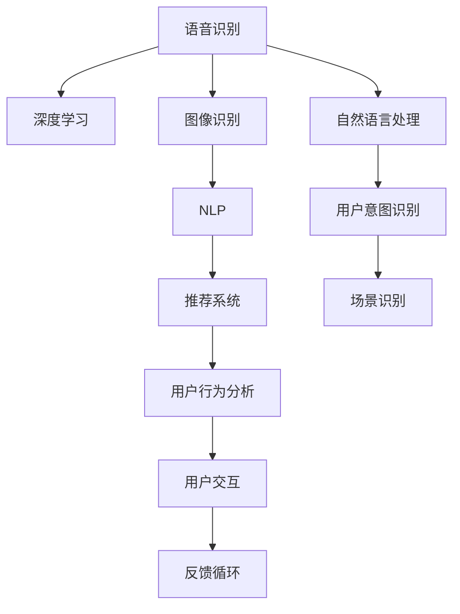

                 

## 1. 背景介绍

### 1.1 问题由来

随着人工智能(AI)技术的快速发展和应用，全球各大科技巨头纷纷加大在AI领域的投入，苹果也不例外。2023年3月，苹果公司在发布会上正式推出了全新的AI应用软件App，这不仅意味着苹果在AI领域的深入布局，也标志着AI应用走向了一个新的阶段。这一举措引发了行业内外广泛关注，很多人好奇：苹果的AI应用将带来哪些改变？AI应用在实际场景中的应用前景如何？本文将深入探讨这些问题，带您了解苹果AI应用的最新进展及其意义。

### 1.2 问题核心关键点

苹果的AI应用主要包括语音识别、图像识别、自然语言处理、推荐系统等几个核心模块。这些模块的应用不仅仅局限于手机端，还包括Apple Watch、Apple TV、iMac等多个设备。要理解苹果AI应用的意义，需要从以下几个方面进行探讨：

- 语音识别：苹果的Siri语音助手如何利用AI技术进行语音识别和语义理解？
- 图像识别：苹果的Face ID、拍照等应用如何通过AI技术实现人脸识别、场景识别等功能？
- 自然语言处理：苹果的Siri、Apple Music等应用如何通过自然语言处理技术与用户进行互动？
- 推荐系统：苹果的推荐引擎如何通过用户行为数据和AI模型为用户推荐个性化的内容和商品？

## 2. 核心概念与联系

### 2.1 核心概念概述

要理解苹果的AI应用，需要先明确几个核心概念：

- **语音识别**：通过计算机对人类语音进行分析、识别和理解的过程，是自然语言处理的重要组成部分。
- **图像识别**：计算机通过算法将图像转换为可读数据的过程，用于人脸识别、物体识别等场景。
- **自然语言处理(NLP)**：使计算机能够理解、处理和生成人类语言的技术，包括语言模型、文本分类、命名实体识别等。
- **推荐系统**：根据用户历史行为数据，推荐其可能感兴趣的内容和商品的智能系统。

这些概念之间通过深度学习和机器学习算法相连接。通过这些算法，苹果能够将用户数据转化为可行的AI应用，提升用户体验和产品功能。

### 2.2 核心概念原理和架构的 Mermaid 流程图



这个流程图展示了苹果AI应用的主要流程：语音识别通过深度学习算法将声音转化为文本，图像识别通过计算机视觉算法识别图像内容，自然语言处理通过NLP算法理解用户意图，推荐系统通过用户行为分析进行个性化推荐，最终通过用户交互和反馈循环不断优化AI模型。

## 3. 核心算法原理 & 具体操作步骤

### 3.1 算法原理概述

苹果的AI应用主要基于深度学习算法进行开发。深度学习通过多层神经网络模拟人脑对数据的处理方式，使得机器能够处理复杂的多维数据。以下是几种主要算法及其原理：

- **卷积神经网络(CNN)**：用于图像识别和场景识别，通过多层卷积和池化操作提取图像特征。
- **循环神经网络(RNN)**：用于语音识别和自然语言处理，通过时间序列数据进行序列建模，捕捉语音和文本的时序特征。
- **Transformer**：用于自然语言处理和机器翻译，通过自注意力机制进行文本序列建模。
- **集成学习**：通过多种模型的组合，提升AI应用的整体性能。

### 3.2 算法步骤详解

苹果AI应用开发的基本步骤如下：

1. **数据准备**：收集用户行为数据、语料库、图像库等，作为AI模型的训练数据。
2. **模型训练**：选择合适的深度学习模型，使用训练数据进行模型训练，调整模型参数以优化性能。
3. **模型评估**：在测试集上对模型进行评估，使用各种指标（如准确率、召回率、F1分数）衡量模型性能。
4. **模型部署**：将训练好的模型部署到实际应用场景中，进行实时推理和预测。
5. **模型优化**：根据用户反馈和实际应用效果，不断调整模型参数和优化算法，提升模型性能。

### 3.3 算法优缺点

苹果AI应用的优点包括：

- **高精度**：通过深度学习算法，AI模型能够处理复杂的非线性数据，提供高精度的预测和识别。
- **实时性**：利用GPU等硬件加速，AI模型可以在毫秒级别完成推理和预测，提升用户体验。
- **个性化**：通过推荐系统，AI应用能够根据用户行为数据进行个性化推荐，提升用户粘性。

缺点包括：

- **高成本**：深度学习模型的训练需要大量的计算资源和数据资源，初期投入较高。
- **可解释性差**：深度学习模型往往是"黑盒"模型，难以解释模型的决策过程，不利于用户理解和信任。
- **数据隐私**：用户行为数据涉及隐私问题，如何保护用户数据隐私是一个重要挑战。

### 3.4 算法应用领域

苹果AI应用主要应用于以下几个领域：

- **医疗健康**：苹果的Health应用通过AI技术分析用户健康数据，提供个性化健康建议。
- **智能家居**：苹果的HomeKit通过AI技术实现智能设备联动和场景控制。
- **增强现实(AR)**：苹果的ARKit通过AI技术实现增强现实应用，如虚拟试衣、虚拟家居设计等。
- **智能客服**：苹果的Siri通过自然语言处理技术与用户进行交互，提供智能客服服务。

## 4. 数学模型和公式 & 详细讲解 & 举例说明

### 4.1 数学模型构建

苹果的AI应用中，自然语言处理是其核心模块之一。自然语言处理包括词嵌入、语言模型、命名实体识别等任务。这里以语言模型为例，介绍其数学模型构建过程。

假设有一个自然语言处理任务，输入为文本序列 $x_1, x_2, \ldots, x_n$，输出为标签序列 $y_1, y_2, \ldots, y_n$。我们可以构建一个基于Transformer的语言模型，其基本结构如下：

$$
M = \text{Encoder-Decoder}
$$

其中，Encoder将输入序列编码成向量表示，Decoder将向量表示转化为标签序列。使用交叉熵损失函数 $\mathcal{L}$ 进行模型训练：

$$
\mathcal{L} = -\frac{1}{N}\sum_{i=1}^N \sum_{j=1}^T \log p(y_j|x_1, \ldots, x_n)
$$

### 4.2 公式推导过程

通过多层Transformer进行编码和解码，语言模型的输出概率分布为：

$$
p(y_j|x_1, \ldots, x_n) = \prod_{j=1}^T p(y_j|y_1, \ldots, y_{j-1})
$$

其中，$p(y_j|y_1, \ldots, y_{j-1})$ 为在给定前 $j-1$ 个标签的情况下，第 $j$ 个标签的条件概率。

### 4.3 案例分析与讲解

以情感分析为例，假设输入为一段文本，输出为正向或负向情感标签。使用BERT模型进行情感分析，其基本步骤如下：

1. **数据准备**：收集标注好的情感数据集，作为训练和测试数据。
2. **模型构建**：使用BERT模型对输入文本进行编码，得到文本向量表示。
3. **模型训练**：在标注数据上训练BERT模型，优化参数以最小化交叉熵损失。
4. **模型评估**：在测试数据上评估模型性能，使用准确率、召回率等指标衡量模型效果。
5. **模型部署**：将训练好的模型部署到实际应用中，进行实时情感分析。

## 5. 项目实践：代码实例和详细解释说明

### 5.1 开发环境搭建

为了快速搭建苹果AI应用的开发环境，建议使用苹果官方提供的Xcode平台。以下是一个简单的开发环境搭建步骤：

1. **安装Xcode**：从苹果官网下载Xcode，并完成安装。
2. **创建新项目**：在Xcode中创建一个新的AI应用项目，选择对应的模板。
3. **配置环境**：配置模拟器和真机，进行本地测试。

### 5.2 源代码详细实现

以下是一个简单的情感分析代码实现，使用BERT模型对输入文本进行情感分析：

```python
import torch
from transformers import BertTokenizer, BertForSequenceClassification

# 加载预训练模型和分词器
model_name = 'bert-base-uncased'
tokenizer = BertTokenizer.from_pretrained(model_name)
model = BertForSequenceClassification.from_pretrained(model_name, num_labels=2)

# 数据准备
text = '这是一个非常有趣的电影'
inputs = tokenizer(text, return_tensors='pt')
labels = torch.tensor([1])

# 模型推理
outputs = model(**inputs)
loss = outputs.loss
logits = outputs.logits
probs = torch.softmax(logits, dim=1)

# 输出结果
print(f"Loss: {loss.item()}")
print(f"Prediction: {probs.argmax().item()}")
```

### 5.3 代码解读与分析

以上代码实现了对输入文本的情感分析，基本步骤如下：

1. **加载预训练模型和分词器**：使用BERT模型和分词器进行模型和分词器的加载。
2. **数据准备**：将输入文本进行分词和编码，得到模型所需的输入张量。
3. **模型推理**：将输入张量和标签输入模型，进行前向传播和推理，得到模型的预测概率。
4. **输出结果**：输出模型的预测结果和损失值。

## 6. 实际应用场景

### 6.1 智能家居

苹果的智能家居应用HomeKit通过AI技术实现智能设备联动和场景控制。例如，用户可以通过语音指令控制智能灯泡的亮度和颜色，或通过手机APP控制智能插座的开关状态。这种场景控制大大提升了家居生活的便捷性和智能化水平。

### 6.2 医疗健康

苹果的Health应用通过AI技术分析用户健康数据，提供个性化的健康建议。例如，Apple Watch可以监测用户的日常活动、心率、睡眠等健康数据，并根据这些数据提供健身建议、饮食建议等。

### 6.3 增强现实(AR)

苹果的ARKit通过AI技术实现增强现实应用，如虚拟试衣、虚拟家居设计等。用户可以通过手机摄像头看到虚拟试穿效果，或者设计虚拟家居场景，提高购物和家居设计的体验。

### 6.4 未来应用展望

未来，苹果AI应用将会在更多领域得到应用，例如：

- **自动驾驶**：苹果正在研发自动驾驶技术，AI应用将在车辆感知、路径规划等方面发挥重要作用。
- **医疗影像**：AI应用可以用于医疗影像分析，提高诊断准确性和效率。
- **教育**：AI应用可以用于智能教育，提供个性化学习建议和推荐。
- **金融**：AI应用可以用于金融风险评估和智能投顾。

## 7. 工具和资源推荐

### 7.1 学习资源推荐

- **《深度学习》**：Ian Goodfellow等著，详细介绍了深度学习的基本原理和应用。
- **《机器学习实战》**：Peter Harrington著，提供了丰富的实际应用案例和代码实现。
- **Coursera**：提供各类机器学习和深度学习课程，适合初学者和进阶者学习。
- **PyTorch官方文档**：详细介绍了PyTorch库的使用和应用场景。

### 7.2 开发工具推荐

- **Xcode**：苹果官方提供的开发环境，支持各类应用开发。
- **PyTorch**：用于深度学习应用的开源库，支持GPU加速和分布式训练。
- **TensorFlow**：Google提供的深度学习库，支持GPU加速和分布式训练。

### 7.3 相关论文推荐

- **"Attention is All You Need"**：J. Devlin等著，介绍了Transformer模型的原理和应用。
- **"BERT: Pre-training of Deep Bidirectional Transformers for Language Understanding"**：J. Devlin等著，介绍了BERT模型的原理和应用。
- **"Deep Residual Learning for Image Recognition"**：K. He等著，介绍了ResNet模型在图像识别中的应用。

## 8. 总结：未来发展趋势与挑战

### 8.1 研究成果总结

苹果的AI应用展示了深度学习和大规模预训练模型在实际应用中的巨大潜力。通过深度学习算法，苹果实现了高精度的语音识别、图像识别、自然语言处理和个性化推荐，提升了用户体验和产品功能。

### 8.2 未来发展趋势

未来，苹果AI应用将会在更多领域得到应用，例如自动驾驶、医疗影像、教育、金融等。AI应用将继续提升用户体验和产品功能，推动苹果在人工智能领域的深入布局。

### 8.3 面临的挑战

苹果AI应用也面临一些挑战，例如高成本、数据隐私、模型可解释性等。苹果需要在保护用户隐私的同时，不断优化AI算法和提升模型性能，以应对这些挑战。

### 8.4 研究展望

未来，苹果需要进一步探索AI应用的优化方法，例如参数高效微调、少样本学习、因果学习等。同时，苹果也需要加强与其他科技巨头和研究机构的合作，推动AI技术的进一步发展。

## 9. 附录：常见问题与解答

**Q1：苹果的AI应用有哪些优势？**

A: 苹果的AI应用主要优势包括：

- **高精度**：通过深度学习算法，AI模型能够处理复杂的非线性数据，提供高精度的预测和识别。
- **实时性**：利用GPU等硬件加速，AI模型可以在毫秒级别完成推理和预测，提升用户体验。
- **个性化**：通过推荐系统，AI应用能够根据用户行为数据进行个性化推荐，提升用户粘性。

**Q2：苹果的AI应用在数据隐私方面做了哪些保护措施？**

A: 苹果的AI应用在数据隐私方面做了以下保护措施：

- **数据匿名化**：对用户数据进行匿名化处理，确保用户隐私不被泄露。
- **差分隐私**：使用差分隐私技术，在数据分析和推理过程中保护用户隐私。
- **用户控制**：用户可以随时关闭AI应用，控制自己的数据使用和隐私保护。

**Q3：苹果的AI应用在实际应用中面临哪些挑战？**

A: 苹果的AI应用在实际应用中面临以下挑战：

- **高成本**：深度学习模型的训练需要大量的计算资源和数据资源，初期投入较高。
- **可解释性差**：深度学习模型往往是"黑盒"模型，难以解释模型的决策过程，不利于用户理解和信任。
- **数据隐私**：用户行为数据涉及隐私问题，如何保护用户数据隐私是一个重要挑战。

**Q4：苹果的AI应用未来有哪些发展方向？**

A: 苹果的AI应用未来发展方向包括：

- **自动驾驶**：苹果正在研发自动驾驶技术，AI应用将在车辆感知、路径规划等方面发挥重要作用。
- **医疗影像**：AI应用可以用于医疗影像分析，提高诊断准确性和效率。
- **教育**：AI应用可以用于智能教育，提供个性化学习建议和推荐。
- **金融**：AI应用可以用于金融风险评估和智能投顾。

**Q5：苹果的AI应用如何优化模型性能？**

A: 苹果的AI应用通过以下方法优化模型性能：

- **参数高效微调**：只调整少量参数(如Adapter、Prefix等)，减小过拟合风险。
- **少样本学习**：利用少数样本来训练模型，提升模型的泛化能力。
- **因果学习**：通过引入因果推断和对比学习思想，增强模型的泛化性和鲁棒性。

作者：禅与计算机程序设计艺术 / Zen and the Art of Computer Programming

