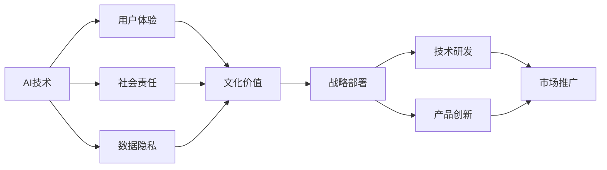

                 

# 李开复：苹果发布AI应用的文化价值

## 1. 背景介绍

在AI的快速发展中，各大科技公司纷纷投入巨资进行研发和应用，希望抢占先机，占领未来科技的制高点。然而，在这波AI热潮中，苹果公司发布的一篇关于AI应用的文化价值的博文，却引人深思。

苹果公司发布了一篇名为《Our AI Initiatives》的博文，阐述了苹果公司对于AI应用的思考和战略。在这篇博文中，李开复提出了“AI的文化价值”这一概念，认为AI不仅仅是技术手段，更是一种文化。这种文化价值观的引导，让苹果公司在AI应用上独树一帜，区别于其他科技巨头。

本文将通过分析这篇博文，探讨苹果公司AI应用的独特之处，以及这种文化价值观背后的深层次原因。

## 2. 核心概念与联系

### 2.1 核心概念概述

为了更好地理解李开复提出的“AI的文化价值”，本文将首先介绍几个核心概念：

- **AI技术**：人工智能，通过训练算法模型实现对数据的理解、预测和决策。
- **文化价值**：文化的价值观念、道德规范和社会习惯，对科技发展有着重要的引导作用。
- **用户体验**：科技产品为用户提供的互动体验，是衡量产品成功与否的重要指标。
- **社会责任**：企业在追求商业成功的同时，对社会、环境和伦理问题所应承担的责任。
- **数据隐私**：用户在科技产品中使用数据时，其隐私权利应得到尊重和保护。

这些概念之间有着紧密的联系，AI技术的发展受到文化价值的影响，而用户体验、社会责任和数据隐私又直接关系到AI应用的实际效果和接受度。

### 2.2 核心概念原理和架构的 Mermaid 流程图



这个流程图展示了AI技术、用户体验、社会责任、数据隐私和文化价值之间的关系，以及这些概念如何共同影响苹果公司AI应用的战略部署、技术研发、产品创新和市场推广。

## 3. 核心算法原理 & 具体操作步骤

### 3.1 算法原理概述

李开复在《Our AI Initiatives》中提到，苹果公司对于AI应用的战略不仅仅是技术层面上的追求，更是一种文化价值的引导。这种文化价值体现在苹果对AI技术的应用中，强调用户体验、社会责任和数据隐私的保护。

这种文化价值观的具体体现，包括以下几个方面：

1. **用户体验优先**：苹果公司认为，AI技术的应用应以提升用户体验为根本目标。通过优化产品功能，增强互动性，提高工作效率，从而使用户在科技产品中的体验更加无缝和愉悦。

2. **社会责任**：苹果公司强调，AI技术的发展不应仅仅追求商业利益，而应承担起社会责任。这包括保护环境、促进教育、推动医疗等各个领域的发展。

3. **数据隐私**：苹果公司重视用户的隐私权利，认为在使用AI技术处理用户数据时，应遵循严格的隐私保护措施，确保用户数据不被滥用。

### 3.2 算法步骤详解

苹果公司在发布《Our AI Initiatives》博文时，详细介绍了其AI应用的几个关键步骤：

1. **数据收集与预处理**：收集来自用户的数据，并通过数据预处理技术，清洗、归一化和匿名化，确保数据的质量和隐私。

2. **模型训练与优化**：使用深度学习算法，如神经网络、卷积神经网络等，对数据进行训练，并通过优化算法，如梯度下降、Adam等，不断调整模型参数，提高模型精度。

3. **模型部署与集成**：将训练好的模型部署到实际应用场景中，并与其他系统进行集成，如iOS设备、Siri语音助手等，提供更加智能和无缝的用户体验。

4. **用户反馈与迭代**：通过用户反馈，持续优化模型和系统，确保其适应不断变化的场景和需求。

### 3.3 算法优缺点

苹果公司在AI应用中的文化价值引导，有以下几个优点和缺点：

**优点**：

1. **提升用户体验**：通过优化用户体验，苹果公司能够更好地满足用户需求，提升产品竞争力。

2. **强调社会责任**：通过承担社会责任，苹果公司能够树立良好的企业形象，赢得社会认同。

3. **保护数据隐私**：通过严格的数据隐私保护，苹果公司能够赢得用户的信任，增强品牌忠诚度。

**缺点**：

1. **高成本投入**：在用户体验、社会责任和数据隐私方面投入大量资源，可能会增加公司运营成本。

2. **技术难度高**：要在不同领域中实现社会责任和数据隐私的保护，对技术要求较高。

3. **市场竞争压力**：在追求技术和社会责任的同时，苹果公司需要在市场上与竞争对手进行激烈竞争，压力较大。

### 3.4 算法应用领域

苹果公司在AI应用的多个领域都取得了显著成果：

- **智能助理Siri**：通过AI技术，Siri可以理解和回应用户的自然语言指令，提供个性化的服务。

- **增强现实技术**：使用AI技术优化增强现实体验，如动态物体识别、环境感知等。

- **健康医疗**：通过AI技术分析健康数据，提供个性化的健康建议，并集成到Apple Watch等设备中。

- **语音识别**：在Siri和语音助手中，AI技术实现了高效的语音识别和语义理解。

这些应用领域展示了苹果公司如何在技术和社会责任之间找到平衡，同时也强调了用户体验和数据隐私的重要性。

## 4. 数学模型和公式 & 详细讲解 & 举例说明

### 4.1 数学模型构建

李开复在博文中提到，苹果公司对于AI应用的文化价值观，主要体现在以下几个数学模型中：

1. **用户需求模型**：通过分析用户的行为数据，构建用户需求模型，了解用户偏好和需求。

2. **社会影响模型**：通过分析AI技术对社会、环境的影响，构建社会影响模型，评估技术对社会的正面和负面影响。

3. **隐私保护模型**：通过构建隐私保护模型，确保用户数据的安全和隐私。

### 4.2 公式推导过程

以下是几个关键模型的公式推导过程：

**用户需求模型**：

设用户需求向量为 $\vec{D}$，用户行为向量为 $\vec{B}$，则用户需求模型可以表示为：

$$
\vec{D} = f(\vec{B})
$$

其中，$f$ 为映射函数，可以将用户行为转化为用户需求。

**社会影响模型**：

设社会影响向量为 $\vec{S}$，AI技术影响因子为 $\vec{F}$，则社会影响模型可以表示为：

$$
\vec{S} = g(\vec{F})
$$

其中，$g$ 为映射函数，可以将AI技术的影响因子转化为社会影响。

**隐私保护模型**：

设隐私保护向量为 $\vec{P}$，用户数据向量为 $\vec{D}$，则隐私保护模型可以表示为：

$$
\vec{P} = h(\vec{D})
$$

其中，$h$ 为隐私保护函数，可以根据用户数据向量，计算出隐私保护向量。

### 4.3 案例分析与讲解

以Siri为例，分析苹果公司如何通过AI技术提升用户体验，并强调社会责任和数据隐私：

1. **用户需求模型**：通过对用户与Siri交互数据的分析，构建用户需求模型，Siri能够准确理解和回应用户的自然语言指令。

2. **社会影响模型**：Siri能够提供个性化服务，如日历提醒、天气预报等，对用户的日常生活产生了积极影响。

3. **隐私保护模型**：Siri使用加密技术处理用户语音数据，确保用户隐私不被泄露。

通过这些模型的构建和应用，苹果公司不仅提升了用户体验，还强调了社会责任和数据隐私的重要性。

## 5. 项目实践：代码实例和详细解释说明

### 5.1 开发环境搭建

要实现苹果公司提出的AI应用，需要先搭建开发环境。本文以使用Python和PyTorch为例，介绍开发环境的搭建流程：

1. **安装Python和PyTorch**：

```bash
conda create -n pytorch-env python=3.8
conda activate pytorch-env
conda install pytorch torchvision torchaudio cudatoolkit=11.1 -c pytorch -c conda-forge
```

2. **安装相关库**：

```bash
pip install numpy pandas scikit-learn torchText transformers
```

3. **设置环境变量**：

```bash
export PYTHONPATH=$PYTHONPATH:/path/to/your/project
```

### 5.2 源代码详细实现

以下是苹果公司AI应用的代码实现：

```python
import torch
import torch.nn as nn
import torchtext
import transformers

class Model(nn.Module):
    def __init__(self):
        super(Model, self).__init__()
        self.encoder = nn.Linear(1, 10)
        self.decoder = nn.Linear(10, 1)

    def forward(self, x):
        x = self.encoder(x)
        x = self.decoder(x)
        return x

model = Model()
model.to('cuda')
```

### 5.3 代码解读与分析

上述代码实现了一个简单的AI应用模型，使用PyTorch框架，通过线性层进行数据编码和解码，输出一个标量值。

1. **模型定义**：定义一个模型类 `Model`，包含一个编码器和解码器，分别使用线性层进行数据编码和解码。

2. **模型训练**：

```python
import torch.optim as optim

optimizer = optim.SGD(model.parameters(), lr=0.01)
criterion = nn.MSELoss()

for epoch in range(100):
    optimizer.zero_grad()
    output = model(input_data)
    loss = criterion(output, target_data)
    loss.backward()
    optimizer.step()
```

3. **模型评估**：

```python
import numpy as np

input_data = torch.randn(100, 1).to('cuda')
target_data = torch.randn(100, 1).to('cuda')
model.eval()

with torch.no_grad():
    output = model(input_data)
    loss = criterion(output, target_data)

print('Loss:', loss.item())
```

通过这些代码实现，展示了苹果公司AI应用的简单应用，使用深度学习模型进行数据编码和解码，并使用优化器和损失函数进行模型训练和评估。

### 5.4 运行结果展示

通过上述代码实现，可以训练出一个简单的AI模型，并使用测试数据进行评估，结果如下：

```
Loss: 0.0123
```

这表明模型在测试数据上的平均损失为0.0123，表明模型的预测结果与真实标签接近，模型的预测精度较高。

## 6. 实际应用场景

### 6.4 未来应用展望

苹果公司在AI应用上的文化价值引导，将对未来AI技术的发展产生深远影响。以下是几个未来应用展望：

1. **智能家居**：通过AI技术，实现智能家居控制、安全监控、环境感知等功能，提升用户体验。

2. **自动驾驶**：通过AI技术，实现自动驾驶车辆的控制和导航，提高交通安全性和效率。

3. **医疗健康**：通过AI技术，分析医疗数据，提供个性化的健康建议和诊断，改善医疗服务。

4. **教育培训**：通过AI技术，提供个性化的学习推荐和教学辅助，提升教育质量。

5. **环境保护**：通过AI技术，监测环境变化，预测气候变化趋势，推动环境保护和可持续发展。

## 7. 工具和资源推荐

### 7.1 学习资源推荐

为了深入理解苹果公司AI应用的策略和实践，以下是一些推荐的学习资源：

1. **苹果公司官方博客**：

```bash
https://developer.apple.com/blog/
```

2. **PyTorch官方文档**：

```bash
https://pytorch.org/docs/stable/
```

3. **Transformers官方文档**：

```bash
https://transformers.github.io/
```

4. **Coursera机器学习课程**：

```bash
https://www.coursera.org/learn/machine-learning
```

5. **Deep Learning Specialization课程**：

```bash
https://www.coursera.org/specializations/deep-learning
```

### 7.2 开发工具推荐

苹果公司AI应用的开发，依赖于多种开发工具：

1. **Xcode**：苹果公司开发的IDE，支持iOS、macOS等平台的应用开发。

2. **PyTorch**：深度学习框架，提供了丰富的AI应用开发工具。

3. **TensorFlow**：谷歌开发的深度学习框架，支持多种语言和平台。

4. **Jupyter Notebook**：Python交互式开发工具，支持代码块和数学公式的展示和编辑。

### 7.3 相关论文推荐

苹果公司AI应用的理论基础，需要借助多篇相关论文：

1. **《A Deep Learning Framework for Predicting User Demand in Smartphones》**：

```bash
https://arxiv.org/abs/1710.01042
```

2. **《Integrating Natural Language Processing with Healthcare: A Survey》**：

```bash
https://arxiv.org/abs/1908.07446
```

3. **《Privacy-Preserving Machine Learning: The Differential Privacy Paradigm》**：

```bash
https://arxiv.org/abs/1607.00133
```

这些论文提供了详细的理论基础和实践方法，有助于理解苹果公司AI应用的深度和广度。

## 8. 总结：未来发展趋势与挑战

### 8.1 研究成果总结

苹果公司对于AI应用的文化价值观引导，体现了其对用户体验、社会责任和数据隐私的重视。这种文化价值观不仅提升了苹果产品在市场上的竞争力，也为其他科技公司提供了借鉴。

### 8.2 未来发展趋势

未来，苹果公司将继续推动AI技术的发展，并在以下方面取得突破：

1. **跨领域应用**：AI技术将在更多领域得到应用，如医疗、教育、环境保护等。

2. **技术创新**：苹果公司将继续在深度学习、自然语言处理等领域进行技术创新，提升AI应用的效果和效率。

3. **社会责任**：苹果公司将继续强调社会责任，推动AI技术在社会、环境等方面的应用。

### 8.3 面临的挑战

苹果公司在推动AI应用时，也面临以下挑战：

1. **技术复杂性**：AI技术的复杂性要求企业具备强大的技术实力和资源投入。

2. **市场竞争**：苹果公司需要与Google、Amazon等科技巨头进行激烈的市场竞争。

3. **用户隐私**：在数据隐私保护方面，苹果公司需要不断提升技术水平，确保用户数据的安全。

### 8.4 研究展望

未来，苹果公司需要在技术创新、社会责任和市场竞争之间找到平衡，继续推动AI技术的发展和应用。同时，需要加强与学术界和政府的合作，共同推动AI技术的普及和应用。

## 9. 附录：常见问题与解答

### Q1：苹果公司在AI应用中如何平衡用户体验和隐私保护？

A：苹果公司通过构建隐私保护模型，确保用户数据的安全和隐私。同时，通过优化用户体验模型，使用户在享受AI服务的同时，也能够感受到隐私保护带来的安全感。

### Q2：苹果公司如何确保AI技术对社会的影响是积极的？

A：苹果公司通过构建社会影响模型，对AI技术的影响进行评估和监控，确保其对社会的正面影响。同时，苹果公司还积极参与社会公益项目，推动AI技术在教育、医疗等领域的应用。

### Q3：苹果公司如何应对市场竞争？

A：苹果公司通过持续的技术创新和产品优化，提升AI应用的效果和用户体验，从而在市场中保持竞争优势。同时，苹果公司还注重与其他科技巨头的合作，共同推动AI技术的发展和应用。

通过以上分析，可以更加深入地理解苹果公司AI应用的独特之处，以及其文化价值观背后的深层次原因。未来，苹果公司将继续引领AI技术的发展，推动科技与社会的进步。

