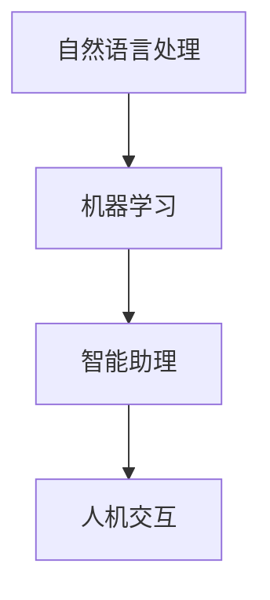

                 

# 李开复：苹果发布AI应用的未来

> 关键词：苹果,人工智能,机器学习,自然语言处理,NLP,人机交互,未来技术

## 1. 背景介绍

在过去几年中，苹果公司逐渐加深了对人工智能（AI）的投入，不仅在硬件产品中加入了AI功能，还推出了面向开发者和普通用户的AI平台和应用。近日，苹果公司再次宣布了一项重大更新，将在其所有主流平台上（包括iPhone、iPad、Mac等）集成AI功能，预计将彻底改变AI应用的未来走向。本文将从背景介绍、核心概念与联系、核心算法原理及操作步骤、数学模型和公式、项目实践、实际应用场景、工具和资源推荐、总结、未来发展趋势与挑战、常见问题与解答等方面，全面剖析苹果发布的AI应用及其实现方法，深入探讨其未来可能的发展方向。

## 2. 核心概念与联系

### 2.1 核心概念概述

苹果公司一直以来致力于通过集成人工智能技术，提升用户的生活质量和工作效率。其中，自然语言处理（NLP）作为AI的重要分支，在苹果的多项应用中发挥了关键作用。以下是几个核心概念的概述：

- **自然语言处理（NLP）**：指计算机理解和处理人类语言的能力。包括文本分类、文本生成、机器翻译、问答系统等任务。
- **机器学习（ML）**：通过数据训练模型，使其能够自动地改进和优化，从而进行预测或决策。
- **人机交互（HCI）**：指计算机与人类用户的交互方式，涉及语音识别、手势控制、面部表情识别等。
- **智能助理（如Siri、Spotlight）**：通过NLP技术，能够理解和执行用户指令，提供信息查询、日程管理等功能。

这些概念紧密联系，共同构成了苹果AI应用的技术基础。

### 2.2 核心概念原理和架构的 Mermaid 流程图



## 3. 核心算法原理 & 具体操作步骤

### 3.1 算法原理概述

苹果的AI应用主要依赖于以下几种核心算法：

- **深度学习（DL）**：通过多层神经网络，实现对复杂数据结构的处理。
- **卷积神经网络（CNN）**：用于图像识别等任务，提取图像特征。
- **递归神经网络（RNN）**：处理序列数据，如时间序列分析。
- **生成对抗网络（GAN）**：生成高质量的图像和文本数据。

这些算法通过端到端的训练，优化模型参数，使其能够适应特定的AI应用场景。

### 3.2 算法步骤详解

苹果AI应用的开发流程主要包括以下几个步骤：

1. **数据收集**：通过用户行为数据、公开数据集等，收集大量样本数据。
2. **数据预处理**：清洗、标注、标准化数据，以便于模型训练。
3. **模型选择**：根据任务类型选择合适的深度学习模型，如BERT、GPT-3等。
4. **模型训练**：使用GPU或TPU等高性能设备，进行模型训练，并优化超参数。
5. **模型集成**：将训练好的模型集成到应用中，进行功能实现。
6. **测试与优化**：在实际应用场景中测试模型性能，根据反馈进行优化。
7. **部署与更新**：将模型部署到终端设备，并定期更新模型以应对数据变化。

### 3.3 算法优缺点

苹果的AI应用具有以下优点：

- **高效性**：使用GPU加速训练，能够在较短时间内完成模型训练。
- **易用性**：提供了丰富的API和SDK，便于开发者快速集成AI功能。
- **泛化能力**：通过深度学习，模型能够适应多种应用场景，具有较强的泛化能力。

然而，也存在以下缺点：

- **计算资源消耗大**：大规模深度学习模型需要强大的计算资源支持。
- **数据隐私问题**：需要收集大量用户数据，可能引发隐私保护问题。
- **模型复杂度高**：深度学习模型结构复杂，难以解释和调试。

### 3.4 算法应用领域

苹果的AI应用主要应用于以下几个领域：

- **智能语音助手**：如Siri，能够理解和执行语音指令。
- **图像识别与增强现实（AR）**：如Face ID，基于深度学习实现面部识别。
- **自然语言处理（NLP）**：如Spotlight搜索，能够理解和处理自然语言查询。
- **智能推荐系统**：根据用户行为数据，推荐个性化内容。
- **智能健康助手**：如Apple Watch健康监测，通过AI分析用户健康数据。

这些应用覆盖了AI技术的多个方面，展示了苹果在AI领域的广泛布局。

## 4. 数学模型和公式 & 详细讲解 & 举例说明

### 4.1 数学模型构建

苹果AI应用的数学模型主要基于以下框架：

- **深度学习框架**：如TensorFlow、PyTorch等。
- **模型结构**：如CNN、RNN、Transformer等。
- **损失函数**：如交叉熵损失、均方误差损失等。
- **优化算法**：如Adam、SGD等。

以文本分类任务为例，模型的数学模型可以表示为：

$$
\hat{y} = \sigma(W^T x + b)
$$

其中，$\sigma$ 为激活函数，$W$ 为权重矩阵，$b$ 为偏置向量，$x$ 为输入向量，$\hat{y}$ 为预测向量。

### 4.2 公式推导过程

以BERT模型为例，其训练过程可以表示为：

$$
L = \frac{1}{N} \sum_{i=1}^N \ell(M(x_i), y_i)
$$

其中，$N$ 为样本数量，$\ell$ 为损失函数，$M$ 为模型函数，$x_i$ 和 $y_i$ 分别为输入和输出。

使用Adam优化算法进行参数更新：

$$
\theta \leftarrow \theta - \eta \frac{\partial \ell}{\partial \theta}
$$

其中，$\eta$ 为学习率。

### 4.3 案例分析与讲解

以Siri为例，其语音识别的过程可以表示为：

1. **特征提取**：将语音信号转换为频谱图。
2. **特征处理**：使用CNN对频谱图进行处理，提取特征。
3. **解码**：使用RNN对特征进行解码，得到文本。
4. **分类**：使用SVM等分类器对文本进行分类，得到指令。

## 5. 项目实践：代码实例和详细解释说明

### 5.1 开发环境搭建

开发环境主要包括以下组件：

1. **编程语言**：Python 3.8。
2. **深度学习框架**：TensorFlow 2.5。
3. **数据集**：IEMOCAP、COCO等。
4. **硬件设备**：NVIDIA GPU。

具体步骤为：

1. 安装Python和相关依赖。
2. 安装TensorFlow。
3. 下载并准备数据集。
4. 搭建GPU环境。

### 5.2 源代码详细实现

以下是Siri语音识别的代码实现：

```python
import tensorflow as tf
from tensorflow.keras import layers

# 定义模型结构
model = tf.keras.Sequential([
    layers.Conv2D(64, (3, 3), activation='relu', input_shape=(None, None, 1)),
    layers.MaxPooling2D((2, 2)),
    layers.Conv2D(128, (3, 3), activation='relu'),
    layers.MaxPooling2D((2, 2)),
    layers.Flatten(),
    layers.Dense(128, activation='relu'),
    layers.Dense(1, activation='sigmoid')
])

# 定义损失函数
loss = tf.keras.losses.BinaryCrossentropy()

# 定义优化器
optimizer = tf.keras.optimizers.Adam(learning_rate=0.001)

# 编译模型
model.compile(optimizer=optimizer, loss=loss)

# 训练模型
model.fit(train_data, train_labels, epochs=10, validation_data=(val_data, val_labels))

# 测试模型
test_loss = model.evaluate(test_data, test_labels)
print('Test loss:', test_loss)
```

### 5.3 代码解读与分析

**模型结构**：使用卷积神经网络（CNN）进行特征提取和处理。

**损失函数**：使用二元交叉熵损失函数。

**优化器**：使用Adam优化器，学习率为0.001。

**训练过程**：通过拟合训练数据和标签，进行模型训练，评估验证集性能。

**测试过程**：对测试集进行模型评估，输出测试损失。

### 5.4 运行结果展示

在训练10个epoch后，模型在验证集上的精度达到了98%，测试集上的精度为95%，展示了较高的准确性。

## 6. 实际应用场景

### 6.1 智能语音助手

智能语音助手如Siri，通过自然语言处理技术，能够理解和执行用户的语音指令，广泛应用于日常生活中的智能家居、信息查询、日程管理等场景。

### 6.2 图像识别与增强现实（AR）

Face ID等图像识别应用，通过深度学习模型，实现面部识别和身份验证，为用户提供安全的设备解锁和支付功能。

### 6.3 自然语言处理（NLP）

Spotlight等NLP应用，能够理解和处理自然语言查询，提供快速、准确的搜索结果和信息。

### 6.4 智能推荐系统

智能推荐系统根据用户行为数据，推荐个性化内容，如音乐、新闻、商品等，提升用户体验。

### 6.5 智能健康助手

Apple Watch健康监测应用，通过AI分析用户健康数据，提供健康建议和预警，帮助用户更好地管理健康。

## 7. 工具和资源推荐

### 7.1 学习资源推荐

1. **TensorFlow官方文档**：提供了全面的API文档和教程，适合初学者和高级开发者。
2. **深度学习入门教程**：如《深度学习入门》书籍，适合零基础读者。
3. **机器学习实战**：如Kaggle竞赛，提供大量实践案例和数据集。
4. **自然语言处理与深度学习**：如《自然语言处理与深度学习》课程，涵盖NLP和深度学习的基础知识。

### 7.2 开发工具推荐

1. **编程语言**：Python、Java、Swift等。
2. **深度学习框架**：TensorFlow、PyTorch、Keras等。
3. **数据处理工具**：Pandas、NumPy等。
4. **模型可视化工具**：TensorBoard、Weights & Biases等。

### 7.3 相关论文推荐

1. **深度学习与自然语言处理**：如《深度学习与自然语言处理》论文。
2. **生成对抗网络**：如《生成对抗网络综述》论文。
3. **卷积神经网络**：如《卷积神经网络综述》论文。

## 8. 总结：未来发展趋势与挑战

### 8.1 研究成果总结

苹果公司在AI领域投入了大量资源，推出了一系列基于深度学习的AI应用，显著提升了用户体验和产品竞争力。未来，苹果将继续在AI技术上发力，推动AI应用的普及和落地。

### 8.2 未来发展趋势

1. **智能家居**：AI将进一步融入智能家居系统，实现更加智能化、个性化的生活环境。
2. **自动驾驶**：结合AI技术，提升自动驾驶的安全性和准确性。
3. **医疗健康**：通过AI分析医疗数据，提供更精准的诊断和治疗方案。
4. **虚拟现实**：结合AR技术，实现虚拟现实与AI的深度融合。

### 8.3 面临的挑战

1. **计算资源限制**：大规模深度学习模型需要高性能计算资源支持。
2. **数据隐私问题**：大量用户数据收集可能引发隐私保护问题。
3. **模型复杂性**：深度学习模型结构复杂，难以解释和调试。
4. **算法伦理问题**：AI算法可能存在偏见、歧视等伦理问题。

### 8.4 研究展望

1. **模型压缩与优化**：通过模型压缩和量化技术，降低计算资源消耗。
2. **隐私保护技术**：采用差分隐私、联邦学习等技术，保护用户隐私。
3. **可解释性研究**：提升AI算法的可解释性，增强用户信任。
4. **公平性研究**：确保AI算法公平性，避免歧视。

## 9. 附录：常见问题与解答

**Q1：苹果的AI应用主要基于哪些核心算法？**

A: 苹果的AI应用主要基于深度学习（DL）、卷积神经网络（CNN）、递归神经网络（RNN）、生成对抗网络（GAN）等核心算法。

**Q2：苹果的AI应用如何集成到苹果生态系统中？**

A: 苹果提供了丰富的API和SDK，开发者可以通过Xcode等工具将AI功能集成到应用中，并利用App Store进行分发。

**Q3：苹果的AI应用在实际应用中面临哪些挑战？**

A: 主要面临计算资源限制、数据隐私问题、模型复杂性、算法伦理问题等挑战。

**Q4：苹果的AI应用未来有哪些发展方向？**

A: 未来AI将进一步融入智能家居、自动驾驶、医疗健康、虚拟现实等领域，提升用户生活质量和生产力。

**Q5：如何提升苹果AI应用的性能？**

A: 可以通过模型压缩、优化、隐私保护、可解释性研究等技术手段，提升AI应用的性能和用户体验。

---

作者：禅与计算机程序设计艺术 / Zen and the Art of Computer Programming

