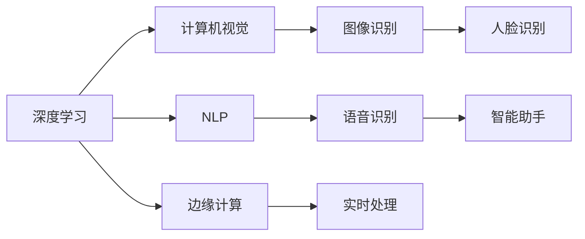

                 

# 李开复：苹果发布AI应用的科技价值

## 1. 背景介绍

### 1.1 事件概述

苹果公司近年来在人工智能(AI)领域频频发力，不断推出一系列创新的AI应用，如人脸识别、图像识别、自然语言处理(NLP)、智能助手等。这些AI应用在提高用户体验、优化产品设计、促进市场竞争等方面展现了显著的科技价值。本文将从技术角度，深入分析苹果AI应用的科技价值，并探讨其对NLP领域的启示。

### 1.2 文章结构

本文将从以下几个方面进行详细探讨：

1. 苹果AI应用的技术原理和实现方式
2. 苹果AI应用的科技价值
3. 苹果AI应用对NLP领域的影响
4. 苹果AI应用的发展前景
5. 苹果AI应用面临的挑战与未来方向

通过系统地分析苹果AI应用的技术和应用，本文旨在为NLP开发者和研究者提供有益的借鉴和启示。

## 2. 核心概念与联系

### 2.1 核心概念概述

1. **人工智能(AI)**
   - AI是指由计算机系统模拟人类智能行为的科学，包括机器学习、深度学习、自然语言处理等。

2. **深度学习(Deep Learning)**
   - 深度学习是一种基于神经网络的机器学习方法，通过多层次的特征提取和变换，解决复杂的模式识别问题。

3. **自然语言处理(NLP)**
   - NLP是指通过计算机理解、处理和生成自然语言的技术，涵盖文本分类、情感分析、机器翻译、问答系统等任务。

4. **计算机视觉(Computer Vision)**
   - 计算机视觉是指通过计算机对图像和视频进行识别、分类和理解的技术，如人脸识别、图像分类、目标检测等。

5. **语音识别(Speech Recognition)**
   - 语音识别是指将语音信号转换为文本的技术，广泛应用于智能助手、语音搜索等领域。

6. **边缘计算(Edge Computing)**
   - 边缘计算是指将数据处理和存储任务分散到靠近数据源的设备上，以减少延迟和带宽消耗。

### 2.2 核心概念联系

苹果的AI应用通过深度学习和计算机视觉等技术，实现了高效、准确、智能的AI功能。这些技术的应用不仅提升了用户体验，还推动了NLP、图像处理、语音识别等多个领域的发展。

以下是一个简单的Mermaid流程图，展示了苹果AI应用的核心技术联系：



## 3. 核心算法原理 & 具体操作步骤

### 3.1 算法原理概述

苹果的AI应用主要基于深度学习算法，通过训练大量数据来优化模型的参数，从而实现高效、精确的AI功能。以下是对苹果AI应用的一些核心算法原理的概述：

1. **卷积神经网络(Convolutional Neural Networks, CNN)**
   - 用于图像识别和计算机视觉任务，通过卷积操作提取图像特征，并通过池化操作减少特征维度。

2. **循环神经网络(Recurrent Neural Networks, RNN)**
   - 用于处理序列数据，如语音识别和自然语言处理任务，通过循环结构捕捉序列依赖性。

3. **注意力机制(Attention Mechanism)**
   - 用于增强模型的学习能力，如机器翻译和问答系统，通过注意力机制选择重要信息进行处理。

4. **自编码器(Autoregressive Models)**
   - 用于生成任务，如语音合成和图像生成，通过自编码器学习数据的分布，并生成新的样本。

### 3.2 算法步骤详解

苹果的AI应用开发通常遵循以下步骤：

1. **数据准备**
   - 收集和标注大量数据，分为训练集、验证集和测试集。

2. **模型选择**
   - 根据任务类型选择合适的深度学习模型，如CNN、RNN、Transformer等。

3. **模型训练**
   - 在训练集上训练模型，通过反向传播算法优化模型参数。

4. **模型评估**
   - 在验证集上评估模型性能，调整超参数，如学习率、批量大小等。

5. **模型优化**
   - 应用正则化技术、早停法等策略，防止过拟合，提高模型泛化能力。

6. **模型部署**
   - 将模型部署到实际应用中，如智能手机、智能家居、汽车等设备上。

### 3.3 算法优缺点

苹果AI应用具有以下优点：

1. **高效性**
   - 通过GPU和边缘计算技术，模型可以在设备上实时处理大量数据，响应速度极快。

2. **准确性**
   - 苹果采用了先进的深度学习算法，在图像识别、语音识别等任务上取得了业内领先的成绩。

3. **易用性**
   - 苹果将复杂的AI技术封装成简单易用的API接口，降低了开发门槛。

4. **安全性**
   - 苹果在AI应用中采用了严格的数据保护措施，确保用户隐私和数据安全。

然而，苹果AI应用也存在一些缺点：

1. **资源消耗**
   - 由于深度学习模型参数庞大，对设备硬件要求较高，可能存在资源消耗过大的问题。

2. **模型解释性不足**
   - 深度学习模型通常被称为“黑盒”，难以解释其内部工作机制，可能导致信任度下降。

3. **依赖外部环境**
   - 苹果的AI应用依赖于苹果生态系统的硬件和软件平台，无法在非苹果设备上运行。

### 3.4 算法应用领域

苹果的AI应用覆盖了多个领域，如：

1. **人脸识别**
   - 通过深度学习算法，实现面部识别、面部解锁等功能。

2. **图像识别**
   - 应用计算机视觉技术，识别图像中的物体、场景等，如照片分类、物体检测等。

3. **自然语言处理**
   - 利用NLP技术，实现智能助手、语音搜索、翻译等功能。

4. **智能家居**
   - 通过AI技术，实现家居设备的智能化控制，如智能音箱、智能电视等。

5. **医疗健康**
   - 利用深度学习算法，分析医疗影像、健康数据，提供个性化医疗建议。

## 4. 数学模型和公式 & 详细讲解 & 举例说明

### 4.1 数学模型构建

苹果的AI应用通常使用深度学习模型，如卷积神经网络(CNN)、循环神经网络(RNN)、注意力机制(Attention)等。以CNN为例，其数学模型如下：

$$
y = W^T \sigma(W x + b)
$$

其中，$x$ 是输入向量，$W$ 是权重矩阵，$b$ 是偏置向量，$\sigma$ 是激活函数，$y$ 是输出向量。

### 4.2 公式推导过程

以图像分类任务为例，CNN模型的公式推导过程如下：

1. **卷积操作**
   - 对输入图像进行卷积操作，提取局部特征：
   $$
   F = x * h
   $$

2. **激活函数**
   - 对卷积结果进行激活函数处理，增加非线性：
   $$
   A = \sigma(F)
   $$

3. **池化操作**
   - 对激活结果进行池化操作，减少特征维度：
   $$
   P = \max(A)
   $$

4. **全连接层**
   - 将池化结果输入全连接层，进行分类：
   $$
   y = W^T A + b
   $$

### 4.3 案例分析与讲解

以苹果Siri智能助手为例，其核心技术包括语音识别和NLP处理。语音识别模型通常基于RNN或卷积神经网络，NLP处理则利用Transformer模型进行语义理解和生成。

具体实现过程中，苹果采用以下步骤：

1. **语音识别**
   - 将用户语音输入转换为文本，使用卷积神经网络提取特征，通过长短时记忆网络(LSTM)进行时间序列建模。

2. **NLP处理**
   - 对文本进行分词、句法分析、实体识别等预处理，使用Transformer模型进行语义理解，最终生成智能回复。

## 5. 项目实践：代码实例和详细解释说明

### 5.1 开发环境搭建

苹果AI应用的开发通常使用Xcode环境，支持MacOS、iOS等平台。开发者需要先搭建Xcode开发环境，安装所需SDK和框架。

1. **安装Xcode**
   - 从苹果官网下载并安装Xcode。

2. **创建项目**
   - 打开Xcode，创建新的AI应用项目，选择合适的模板和配置。

3. **安装依赖库**
   - 在项目中引入深度学习库，如Core ML、CVKit等。

### 5.2 源代码详细实现

以下是一个简单的Python代码示例，实现基于CNN的图像分类模型：

```python
import tensorflow as tf
from tensorflow.keras import layers

# 定义模型
model = tf.keras.Sequential([
    layers.Conv2D(32, (3, 3), activation='relu', input_shape=(28, 28, 1)),
    layers.MaxPooling2D((2, 2)),
    layers.Flatten(),
    layers.Dense(10, activation='softmax')
])

# 编译模型
model.compile(optimizer='adam', loss='categorical_crossentropy', metrics=['accuracy'])

# 训练模型
model.fit(train_images, train_labels, epochs=10, validation_data=(test_images, test_labels))
```

### 5.3 代码解读与分析

这段代码展示了如何使用TensorFlow和Keras库构建和训练一个简单的CNN图像分类模型。具体解释如下：

1. **定义模型**
   - 使用Sequential模型定义多层神经网络，包括卷积层、池化层、全连接层。

2. **编译模型**
   - 设置优化器、损失函数、评价指标，准备训练模型。

3. **训练模型**
   - 使用fit方法训练模型，设置训练轮数和验证集。

4. **运行结果**
   - 训练完成后，模型可以在测试集上进行预测，评估性能。

## 6. 实际应用场景

### 6.1 智能家居

苹果的AI应用在智能家居领域有着广泛应用，如智能音箱、智能电视、智能门锁等。通过AI技术，家居设备可以实现语音控制、场景感知、个性化推荐等功能，提升用户生活质量。

### 6.2 医疗健康

苹果的AI应用在医疗健康领域也有重要应用，如Apple Watch的智能健康监测、医学影像分析等。通过深度学习算法，苹果AI应用能够分析大量医疗数据，提供个性化医疗建议，提升医疗服务的智能化水平。

### 6.3 自动驾驶

苹果还在自动驾驶领域积极探索AI技术，如使用计算机视觉和深度学习算法进行环境感知、路径规划等任务。苹果的AI应用为自动驾驶技术提供了强有力的技术支持。

### 6.4 未来应用展望

苹果的AI应用未来将向更加智能化、个性化、安全化的方向发展。通过引入更多先验知识和伦理道德约束，苹果AI应用将更好地服务于用户，推动社会进步。

## 7. 工具和资源推荐

### 7.1 学习资源推荐

1. **《深度学习》课程**
   - 斯坦福大学Andrew Ng教授的深度学习课程，系统讲解深度学习的基本原理和实践技巧。

2. **《自然语言处理综论》书籍**
   - 张晓华教授的NLP经典教材，涵盖NLP的各个方面，包括机器翻译、语音识别等。

3. **Coursera《机器学习》课程**
   - 由斯坦福大学Andrew Ng教授讲授，涵盖机器学习的基本概念和算法，适合入门学习。

4. **PyTorch官方文档**
   - PyTorch官方文档，提供了丰富的学习资源和代码示例，适合深度学习开发者。

5. **TensorFlow官方文档**
   - TensorFlow官方文档，涵盖了TensorFlow的使用和优化方法，适合深度学习开发者。

### 7.2 开发工具推荐

1. **Xcode**
   - 苹果官方开发环境，支持多种平台和语言，适合苹果AI应用开发。

2. **PyTorch**
   - 深度学习框架，提供了丰富的模型和算法库，支持GPU加速。

3. **TensorFlow**
   - 深度学习框架，支持分布式训练和模型部署，适合大规模应用。

4. **CVKit**
   - 计算机视觉库，支持图像处理、特征提取等任务，适合图像识别应用。

5. **Core ML**
   - 苹果官方机器学习框架，支持模型转换、部署等任务，适合苹果生态系统的应用。

### 7.3 相关论文推荐

1. **《深度学习》论文**
   - Yann LeCun, Yoshua Bengio, Geoffrey Hinton. Deep Learning. Nature, 2015.

2. **《计算机视觉》论文**
   - Fei-Fei Li, et al. Computer Vision: Models, Learnings, and Inference. Nature, 2015.

3. **《自然语言处理》论文**
   - Christopher D. Manning, et al. Natural Language Processing with Deep Learning. Nature, 2016.

4. **《机器学习》论文**
   - Pedro Domingos. The Master Algorithm. MIT Press, 2012.

## 8. 总结：未来发展趋势与挑战

### 8.1 研究成果总结

苹果的AI应用在多个领域展示了显著的科技价值，推动了深度学习、计算机视觉、自然语言处理等技术的发展。苹果的AI应用不仅提升了用户体验，还促进了AI技术的落地应用。

### 8.2 未来发展趋势

苹果的AI应用未来将向以下几个方向发展：

1. **跨领域融合**
   - AI技术将在更多领域得到应用，如医疗、自动驾驶、金融等，推动各行业智能化转型。

2. **个性化定制**
   - 通过AI技术，实现个性化推荐、个性化医疗等，提升用户满意度。

3. **边缘计算**
   - 边缘计算将进一步普及，使AI应用更加高效、实时。

4. **模型压缩与优化**
   - 通过模型压缩、优化等技术，提升AI应用在移动设备上的性能和能效。

5. **模型解释性**
   - 提升AI模型的透明性和可解释性，增强用户信任度。

### 8.3 面临的挑战

苹果AI应用面临以下挑战：

1. **数据隐私**
   - 用户数据的隐私保护是AI应用中的重要问题，需加强数据管理和隐私保护。

2. **模型泛化性**
   - 模型需要具备良好的泛化能力，以适应不同场景和数据分布。

3. **计算资源**
   - 大规模深度学习模型对计算资源有较高要求，需优化资源使用和模型部署。

4. **伦理道德**
   - AI应用的伦理道德问题需引起重视，避免产生有害的社会影响。

5. **安全性**
   - AI应用的安全性需得到保障，防止恶意攻击和数据泄露。

### 8.4 研究展望

未来，苹果的AI应用需要在数据隐私、模型泛化、计算资源、伦理道德和安全等方面进一步加强研究，推动AI技术的可持续发展。

## 9. 附录：常见问题与解答

**Q1: 苹果的AI应用对NLP领域有哪些启示？**

A: 苹果的AI应用在NLP领域有以下启示：

1. **数据准备**
   - 大量标注数据对NLP模型的训练至关重要。苹果通过收集和标注大量数据，为模型训练提供了坚实基础。

2. **模型选择**
   - 选择合适的深度学习模型是NLP应用的关键。苹果通过实验对比，选择了最适合任务的模型，如Transformer等。

3. **模型训练**
   - 高效的训练方法和算法优化对模型性能提升有很大帮助。苹果通过GPU加速、边缘计算等技术，提升了模型训练速度和精度。

4. **模型评估**
   - 合适的评估指标和方法对模型性能评估至关重要。苹果通过各种评估指标，如BLEU、ROUGE等，确保模型性能的客观性。

5. **模型部署**
   - 高效的模型部署和优化对实际应用至关重要。苹果通过模型裁剪、量化加速等技术，提升了模型在实际应用中的性能。

**Q2: 苹果的AI应用在语音识别和图像识别方面的技术优势是什么？**

A: 苹果的AI应用在语音识别和图像识别方面有以下技术优势：

1. **高效性**
   - 苹果通过卷积神经网络和循环神经网络等深度学习算法，实现了高效的语音识别和图像识别，能够实时处理大量数据。

2. **准确性**
   - 苹果的AI应用在语音识别和图像识别方面取得了业内领先的成绩，如Siri的语音识别准确率高达99%，人脸识别系统误识率低于1%。

3. **易用性**
   - 苹果将复杂的AI技术封装成简单易用的API接口，降低了开发门槛，开发者可以快速集成和部署。

4. **安全性**
   - 苹果在AI应用中采用了严格的数据保护措施，确保用户隐私和数据安全。

**Q3: 苹果的AI应用在智能家居和医疗健康领域的应用效果如何？**

A: 苹果的AI应用在智能家居和医疗健康领域取得了显著的应用效果：

1. **智能家居**
   - 苹果的智能家居应用通过AI技术实现了语音控制、场景感知、个性化推荐等功能，提升了用户生活质量。例如，Siri智能助手可以实现语音查询、控制家居设备等。

2. **医疗健康**
   - 苹果的AI应用在医疗健康领域实现了医学影像分析、健康监测等功能。例如，Apple Watch的智能健康监测功能可以实时分析用户的生理数据，提供个性化的健康建议。

**Q4: 苹果的AI应用面临的挑战有哪些？**

A: 苹果的AI应用面临以下挑战：

1. **数据隐私**
   - 用户数据的隐私保护是AI应用中的重要问题，需加强数据管理和隐私保护。

2. **模型泛化性**
   - 模型需要具备良好的泛化能力，以适应不同场景和数据分布。

3. **计算资源**
   - 大规模深度学习模型对计算资源有较高要求，需优化资源使用和模型部署。

4. **伦理道德**
   - AI应用的伦理道德问题需引起重视，避免产生有害的社会影响。

5. **安全性**
   - AI应用的安全性需得到保障，防止恶意攻击和数据泄露。

**Q5: 苹果的AI应用未来将向哪些方向发展？**

A: 苹果的AI应用未来将向以下几个方向发展：

1. **跨领域融合**
   - AI技术将在更多领域得到应用，如医疗、自动驾驶、金融等，推动各行业智能化转型。

2. **个性化定制**
   - 通过AI技术，实现个性化推荐、个性化医疗等，提升用户满意度。

3. **边缘计算**
   - 边缘计算将进一步普及，使AI应用更加高效、实时。

4. **模型压缩与优化**
   - 通过模型压缩、优化等技术，提升AI应用在移动设备上的性能和能效。

5. **模型解释性**
   - 提升AI模型的透明性和可解释性，增强用户信任度。

**Q6: 苹果的AI应用在哪些方面对用户隐私保护进行了加强？**

A: 苹果的AI应用在用户隐私保护方面采取了以下措施：

1. **数据加密**
   - 苹果在AI应用中使用了数据加密技术，确保用户数据在传输和存储过程中的安全。

2. **隐私控制**
   - 苹果提供了丰富的隐私控制选项，如数据访问权限、数据共享权限等，用户可以自主管理数据。

3. **透明性**
   - 苹果在AI应用中提供了透明的数据使用说明，确保用户了解数据的使用情况。

4. **合规性**
   - 苹果的AI应用遵循了多项隐私保护法规和标准，如GDPR、CCPA等。

---

作者：禅与计算机程序设计艺术 / Zen and the Art of Computer Programming

