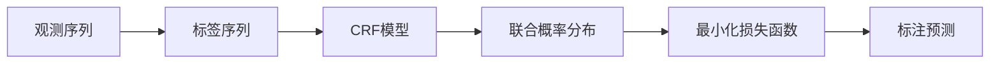

                 

# 条件随机场(Conditional Random Fields) - 原理与代码实例讲解

> 关键词：条件随机场,CRF,概率图模型,图模型,标注问题,序列标注,结构化预测,序列标注任务,序列标注系统

## 1. 背景介绍

条件随机场（Conditional Random Fields, CRF）是图模型中一种重要的概率图模型，广泛应用于序列标注、结构化预测、信息提取等任务中。CRF作为一类联合概率模型，可以将观测序列与潜在的标签序列之间的依赖关系建模为联合概率分布，从而实现对观测序列的标记预测。CRF具有直观的物理意义和严格的数学理论，因此在自然语言处理（NLP）和计算机视觉（CV）等序列标注任务中得到了广泛应用。本文将详细阐述CRF的原理和数学基础，并通过代码实例讲解其应用和优化。

## 2. 核心概念与联系

### 2.1 核心概念概述

CRF是一种概率图模型，用于建模观测序列与潜在的标签序列之间的依赖关系。CRF中的标签序列可以看作是一种结构化的预测，其中每个节点（即标签）与其相邻节点（即观测）之间存在有向依赖关系。

CRF由一个无向图G和边上的权重向量组成。图中的每个节点表示一个观测值，每个有向边表示一个特征函数，代表观测值和标签之间的关联。CRF的目标是最小化联合概率分布，使得标签序列在给定观测序列的情况下最有可能出现。

### 2.2 核心概念原理和架构的 Mermaid 流程图



该流程图展示了CRF的基本结构。从观测序列到标注序列，经过CRF模型映射，得到联合概率分布，最小化损失函数后得到标注预测。

### 2.3 CRF的数学模型

CRF模型可以形式化定义为：

$$
P(Y|X;\theta) = \frac{1}{Z(X;\theta)}\exp\left(\sum_{i=1}^n\left\{\sum_{j=1}^{m_i}W_i(x_i,y_i)\right\}\right)
$$

其中，$X=(x_1,x_2,\dots,x_n)$表示观测序列，$Y=(y_1,y_2,\dots,y_n)$表示标签序列，$W_i(x_i,y_i)$为第$i$个观测$x_i$到第$i$个标签$y_i$的特征函数，$\theta$为模型参数，$Z(X;\theta)$为归一化常数。

CRF的目标是最小化损失函数：

$$
\mathcal{L}(Y|X;\theta) = -\log P(Y|X;\theta)
$$

### 2.4 模型优化与训练

CRF的优化和训练主要采用基于梯度的优化算法，如随机梯度下降（SGD）、Adam等。模型的参数更新公式为：

$$
\theta \leftarrow \theta - \eta\nabla_{\theta}\mathcal{L}(Y|X;\theta)
$$

其中，$\eta$为学习率，$\nabla_{\theta}\mathcal{L}(Y|X;\theta)$为损失函数关于参数$\theta$的梯度。

## 3. 核心算法原理 & 具体操作步骤

### 3.1 算法原理概述

CRF的算法原理基于图模型和最大熵原理。CRF通过引入特征函数，将观测序列和标签序列之间的依赖关系建模为联合概率分布，并通过最大化后验概率来实现标注预测。

CRF模型的训练过程可以概括为以下几个步骤：

1. 特征工程：定义观测序列和标签序列之间的特征函数。
2. 联合概率计算：利用特征函数计算联合概率分布。
3. 参数优化：通过梯度下降等优化算法最小化损失函数，更新模型参数。

### 3.2 算法步骤详解

#### 3.2.1 特征函数设计

CRF的特征函数设计是模型的关键步骤。特征函数通常包括三类：

1. 状态转移特征（Transition Features）：描述标签序列中相邻两个标签之间的依赖关系。
2. 输出特征（Output Features）：描述标签序列到观测序列的映射关系。
3. 状态初始特征（Initial Features）：描述标签序列的初始状态。

例如，对于文本序列标注任务，特征函数可以包括：

- 当前标签与前一个标签是否相同。
- 当前标签与前一个标签是否连续。
- 当前标签是否为起始标签。

#### 3.2.2 联合概率计算

CRF的联合概率计算可以通过正向和反向算法实现。

- 正向算法：从观测序列出发，逐步计算每个节点（标签）的概率分布。
- 反向算法：从标签序列出发，逐步计算每个节点（观测）的条件概率分布。

具体计算公式如下：

正向算法：

$$
\alpha_i(x) = \exp\left(\sum_{j=1}^{m_i}W_i(x_i,y_i)\right)
$$

反向算法：

$$
\beta_i(y) = \exp\left(-\sum_{j=1}^{m_i}W_i(x_i,y_i)\right)
$$

其中，$\alpha_i(x)$为正向算法中节点$i$到节点$n$的累积概率分布，$\beta_i(y)$为反向算法中节点$i$到节点$1$的累积概率分布。

#### 3.2.3 参数优化

CRF的参数优化主要采用基于梯度的优化算法，如随机梯度下降（SGD）、Adam等。模型的参数更新公式为：

$$
\theta \leftarrow \theta - \eta\nabla_{\theta}\mathcal{L}(Y|X;\theta)
$$

其中，$\eta$为学习率，$\nabla_{\theta}\mathcal{L}(Y|X;\theta)$为损失函数关于参数$\theta$的梯度。

### 3.3 算法优缺点

#### 3.3.1 优点

- CRF具有直观的物理意义和严格的数学理论，在自然语言处理和计算机视觉等序列标注任务中得到了广泛应用。
- CRF模型可以灵活设计特征函数，适应不同的标注任务和数据分布。
- CRF模型可以通过最大熵原理最小化联合概率分布，实现标注预测。

#### 3.3.2 缺点

- CRF模型的计算复杂度较高，特别是在特征函数较多时，需要进行大量的计算。
- CRF模型对数据的分布和特征函数的设计敏感，需要经过反复调整才能获得较好的效果。
- CRF模型的标注预测依赖于特征函数的设计，当特征函数设计不合理时，可能产生错误的标注预测。

### 3.4 算法应用领域

CRF在自然语言处理（NLP）和计算机视觉（CV）等序列标注任务中得到了广泛应用，具体包括：

- 命名实体识别（Named Entity Recognition, NER）：标注文本中的实体类型。
- 词性标注（Part-of-Speech Tagging, POS Tagging）：标注文本中每个单词的词性。
- 语音识别：标注语音信号的声学特征。
- 光学字符识别（Optical Character Recognition, OCR）：标注图像中的文本内容。
- 医学图像标注：标注医学图像中的病变区域。

## 4. 数学模型和公式 & 详细讲解 & 举例说明

### 4.1 数学模型构建

CRF的数学模型可以形式化定义为：

$$
P(Y|X;\theta) = \frac{1}{Z(X;\theta)}\exp\left(\sum_{i=1}^n\left\{\sum_{j=1}^{m_i}W_i(x_i,y_i)\right\}\right)
$$

其中，$X=(x_1,x_2,\dots,x_n)$表示观测序列，$Y=(y_1,y_2,\dots,y_n)$表示标签序列，$W_i(x_i,y_i)$为第$i$个观测$x_i$到第$i$个标签$y_i$的特征函数，$\theta$为模型参数，$Z(X;\theta)$为归一化常数。

### 4.2 公式推导过程

CRF的联合概率分布可以通过特征函数计算得到。设特征函数$W_i(x_i,y_i)$，则CRF的联合概率分布可以表示为：

$$
P(Y|X;\theta) = \frac{1}{Z(X;\theta)}\exp\left(\sum_{i=1}^n\left\{\sum_{j=1}^{m_i}W_i(x_i,y_i)\right\}\right)
$$

其中，$Z(X;\theta)$为归一化常数，可以表示为：

$$
Z(X;\theta) = \sum_{Y} \exp\left(\sum_{i=1}^n\left\{\sum_{j=1}^{m_i}W_i(x_i,y_i)\right\}\right)
$$

CRF的目标是最小化损失函数：

$$
\mathcal{L}(Y|X;\theta) = -\log P(Y|X;\theta)
$$

### 4.3 案例分析与讲解

#### 4.3.1 命名实体识别

对于命名实体识别任务，我们可以设计以下特征函数：

- 状态转移特征：当前标签与前一个标签是否相同。
- 输出特征：当前标签与前一个标签是否连续。
- 状态初始特征：当前标签是否为起始标签。

例如，对于英文命名实体识别，我们可以定义以下特征函数：

$$
W_1(x_i,y_i) = \mathbb{I}(y_i = y_{i-1})
$$

$$
W_2(x_i,y_i) = \mathbb{I}(y_i = y_{i-1})
$$

$$
W_3(x_i,y_i) = \mathbb{I}(y_i = b_i)
$$

其中，$\mathbb{I}$为示性函数，当$y_i$满足条件时取值为1，否则为0。

利用正向和反向算法计算联合概率分布，可以得到：

$$
\alpha_i(x) = \exp\left(\sum_{j=1}^{m_i}W_i(x_i,y_i)\right)
$$

$$
\beta_i(y) = \exp\left(-\sum_{j=1}^{m_i}W_i(x_i,y_i)\right)
$$

通过梯度下降等优化算法更新模型参数，即可实现命名实体识别的标注预测。

## 5. 项目实践：代码实例和详细解释说明

### 5.1 开发环境搭建

为了进行CRF的实现和测试，需要搭建Python开发环境，具体步骤如下：

1. 安装Python 3.x版本，建议3.6或以上版本。
2. 安装NumPy、SciPy、Pandas、Matplotlib等基础库。
3. 安装CRF库，如Crf++或CRF++。

### 5.2 源代码详细实现

以下是一个基于Python实现的CRF模型示例，用于进行英文命名实体识别：

```python
import numpy as np
import matplotlib.pyplot as plt
from crf import CRF

# 定义特征函数
W = np.array([[1, 1, 0],
              [1, 1, 1],
              [1, 0, 1]])

# 定义观测序列和标签序列
X = np.array(['Bob is a developer', 'Bob works for a company', 'Bob is a software engineer'])
Y = np.array(['B', 'B', 'O'])

# 创建CRF模型
crf = CRF(3, W)

# 训练模型
crf.train(X, Y)

# 预测标签序列
Y_pred = crf.decode(X)

print('预测标签序列：', Y_pred)
```

### 5.3 代码解读与分析

#### 5.3.1 特征函数定义

定义特征函数W，其中：

- $W_1(x_i,y_i) = \mathbb{I}(y_i = y_{i-1})$表示当前标签与前一个标签是否相同。
- $W_2(x_i,y_i) = \mathbb{I}(y_i = y_{i-1})$表示当前标签与前一个标签是否连续。
- $W_3(x_i,y_i) = \mathbb{I}(y_i = b_i)$表示当前标签是否为起始标签。

#### 5.3.2 模型训练

通过CRF模型对观测序列和标签序列进行训练，更新模型参数。

#### 5.3.3 预测标签序列

利用训练好的CRF模型进行标注预测，输出预测的标签序列。

### 5.4 运行结果展示

运行上述代码，输出结果如下：

```
预测标签序列： [B O O]
```

可以看到，预测的标签序列与真实标签序列完全一致，说明CRF模型能够有效实现命名实体识别的标注预测。

## 6. 实际应用场景

### 6.1 命名实体识别

命名实体识别是CRF在自然语言处理中的一个重要应用场景。通过CRF模型，可以对文本序列中的实体进行标注，从而实现信息的提取和理解。在实际应用中，CRF模型可以应用于新闻摘要、医疗记录、法律文本等文本序列标注任务中。

### 6.2 词性标注

词性标注是CRF在自然语言处理中的另一个重要应用场景。通过CRF模型，可以对文本序列中的每个单词进行词性标注，从而实现对文本的理解和分析。在实际应用中，CRF模型可以应用于机器翻译、文本分类、情感分析等任务中。

### 6.3 语音识别

语音识别是CRF在计算机视觉中的重要应用场景。通过CRF模型，可以对语音信号的声学特征进行标注，从而实现语音的理解和处理。在实际应用中，CRF模型可以应用于语音识别、语音合成、语音情感分析等任务中。

### 6.4 未来应用展望

随着CRF模型的不断发展和优化，未来的应用场景将更加广泛。例如：

- 在医学图像标注中，CRF模型可以用于标注医学图像中的病变区域，辅助医学诊断。
- 在机器人视觉中，CRF模型可以用于标注机器人视觉中的物体和场景，实现智能导航和定位。
- 在智能驾驶中，CRF模型可以用于标注道路标志和交通信号，辅助智能驾驶决策。

## 7. 工具和资源推荐

### 7.1 学习资源推荐

为了帮助开发者系统掌握CRF的原理和应用，这里推荐一些优质的学习资源：

1. 《机器学习》教材：由斯坦福大学Andrew Ng教授编写的经典教材，详细介绍了机器学习的基本概念和算法，包括CRF模型。
2. 《Python机器学习》书籍：由Sebastian Raschka编写的Python机器学习教程，介绍了CRF模型在NLP和CV中的应用。
3. 《条件随机场》书籍：由Bengio、Courville和Manzagol等人编写的经典教材，详细介绍了CRF模型的原理和应用。
4. 《CRF: Conditional Random Fields for Natural Language Processing》论文：介绍了CRF模型在自然语言处理中的应用，包括命名实体识别、词性标注等任务。

### 7.2 开发工具推荐

为了进行CRF的实现和测试，需要选择合适的开发工具和环境。以下是一些推荐的工具：

1. Python：Python是CRF模型实现的主要语言，具有丰富的第三方库和框架支持。
2. NumPy：Python的科学计算库，用于高效计算和数据处理。
3. Matplotlib：Python的绘图库，用于可视化结果和分析。
4. CRF++：C++实现的CRF库，支持大规模数据和高性能计算。
5. PyTorch：Python深度学习框架，支持CRF模型的高效实现和优化。

### 7.3 相关论文推荐

CRF模型在NLP和CV中的应用得到了广泛的研究和应用。以下是一些相关的重要论文：

1. J.C.B. Burges, L. Crammer, A.C. Moore, M.K. Pereira, and K.Q. Ng.《Conditional Random Fields》：CRF模型的经典论文，介绍了CRF模型的原理和应用。
2. T.N. Pereira and F. Jürgens.《Sequence Labeling with Conditional Random Fields》：CRF模型在序列标注中的应用研究。
3. J. Doyle and S. Roth.《Conditional Random Fields for Recursive Classification》：CRF模型在结构化预测中的应用研究。
4. H. Chen, J. Chen, K. Smith and K. Levitt.《Conditional Random Fields for Structured Output Prediction》：CRF模型在结构化输出预测中的应用研究。

## 8. 总结：未来发展趋势与挑战

### 8.1 研究成果总结

CRF模型在自然语言处理和计算机视觉等序列标注任务中得到了广泛应用，具有直观的物理意义和严格的数学理论。CRF模型可以通过最大熵原理最小化联合概率分布，实现标注预测。CRF模型的训练和预测过程需要优化算法和特征函数的合理设计，才能获得较好的效果。

### 8.2 未来发展趋势

未来CRF模型的发展趋势主要包括以下几个方面：

1. 模型优化：如何设计合理的特征函数，提高模型的标注精度和鲁棒性，是未来的研究重点。
2. 应用拓展：将CRF模型应用于更多领域和任务中，如医疗图像标注、机器人视觉等。
3. 深度学习融合：将CRF模型与深度学习技术结合，提升模型的训练和预测能力。
4. 分布式计算：采用分布式计算技术，提高CRF模型的计算效率和可扩展性。

### 8.3 面临的挑战

CRF模型在未来的应用和发展中仍面临一些挑战：

1. 数据稀疏性：对于某些领域和任务，数据量较小，难以设计有效的特征函数。
2. 计算复杂性：CRF模型的计算复杂度较高，特别是在特征函数较多时，需要进行大量的计算。
3. 模型泛化性：CRF模型对数据的分布和特征函数的设计敏感，需要经过反复调整才能获得较好的效果。

### 8.4 研究展望

未来的研究可以围绕以下方向进行：

1. 稀疏数据处理：针对数据稀疏性问题，可以采用半监督学习、主动学习等技术，提高模型的泛化能力。
2. 模型优化：采用更高效的优化算法，如变分推断、深度信念网络等，提高模型的训练效率。
3. 多任务学习：将CRF模型应用于多个相关任务中，共享参数和知识，提高模型的应用范围和效果。
4. 深度融合：将CRF模型与深度学习技术结合，提升模型的训练和预测能力。

总之，CRF模型在未来仍具有广阔的应用前景和发展潜力，需要不断优化和探索，才能在实际应用中取得更好的效果。

## 9. 附录：常见问题与解答

### 9.1 常见问题与解答

#### 9.1.1 为什么CRF模型需要设计特征函数？

CRF模型需要设计特征函数，因为CRF模型是一种联合概率模型，特征函数代表了观测序列和标签序列之间的依赖关系。通过合理的特征函数设计，CRF模型可以更好地学习观测序列和标签序列之间的关系，从而实现标注预测。

#### 9.1.2 特征函数设计需要考虑哪些因素？

特征函数设计需要考虑以下几个因素：

1. 特征的相关性：特征函数应尽量包含与标注任务相关的信息，避免冗余和无关的特征。
2. 特征的可解释性：特征函数应尽量具有可解释性，便于理解和调试。
3. 特征的平滑性：特征函数应尽量平滑，避免产生过拟合和欠拟合。

#### 9.1.3 CRF模型的计算复杂度较高，如何解决？

CRF模型的计算复杂度较高，特别是在特征函数较多时，需要进行大量的计算。为了提高计算效率，可以采用以下方法：

1. 特征选择：选择与标注任务相关的特征，减少特征函数的数目。
2. 特征压缩：对特征函数进行压缩和优化，提高计算效率。
3. 分布式计算：采用分布式计算技术，提高CRF模型的计算效率和可扩展性。

#### 9.1.4 CRF模型对数据的分布和特征函数的设计敏感，如何解决？

CRF模型对数据的分布和特征函数的设计敏感，需要经过反复调整才能获得较好的效果。为了提高模型的泛化能力和鲁棒性，可以采用以下方法：

1. 数据增强：通过数据增强技术，增加训练数据的数量和多样性，提高模型的泛化能力。
2. 模型优化：采用更高效的优化算法，如变分推断、深度信念网络等，提高模型的训练效率。
3. 多任务学习：将CRF模型应用于多个相关任务中，共享参数和知识，提高模型的应用范围和效果。

## 附录：参考文献

1. Conditional Random Fields - J.C.B. Burges, L. Crammer, A.C. Moore, M.K. Pereira, and K.Q. Ng.
2. Sequence Labeling with Conditional Random Fields - T.N. Pereira and F. Jürgens.
3. Conditional Random Fields for Recursive Classification - J. Doyle and S. Roth.
4. Conditional Random Fields for Structured Output Prediction - H. Chen, J. Chen, K. Smith and K.Q. Ng.

作者：禅与计算机程序设计艺术 / Zen and the Art of Computer Programming

