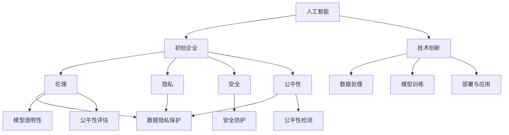

                 

## 1. 背景介绍

随着人工智能技术的飞速发展，AI生态系统日益复杂，初创企业在AI领域扮演着日益重要的角色。从机器人到自然语言处理，从自动驾驶到医疗影像分析，初创企业正在引领AI技术的新一轮突破。然而，AI技术的广泛应用也带来了诸多挑战，包括伦理、隐私、安全、公平性等。如何在追求技术创新的同时，构建一个健康可持续的AI生态，成为初创企业面临的重要课题。

## 2. 核心概念与联系

### 2.1 核心概念概述

为了更好地理解构建健康AI生态的问题，本节将介绍几个密切相关的核心概念：

- **人工智能(AI)**：通过计算机系统模拟人类智能的技术。涵盖了机器学习、深度学习、自然语言处理、计算机视觉等众多领域。

- **初创企业**：指在特定领域内，通过技术创新驱动发展的早期企业，具有高风险、高回报的特点。

- **伦理(Ethics)**：涉及AI技术应用中的道德和价值取向，包括数据隐私、算法透明性、公平性、安全等。

- **隐私(Privacy)**：指个人数据的保护，特别是在AI系统中如何处理和存储用户数据。

- **安全(Security)**：涉及AI系统的安全防护，防止数据泄露、模型篡改、攻击等。

- **公平性(Fairness)**：指AI系统应避免对某些群体产生偏见，实现同等情况下的同等对待。

这些核心概念之间的逻辑关系可以通过以下Mermaid流程图来展示：



这个流程图展示了两类核心概念及其之间的关系：

1. 人工智能技术在初创企业中的应用。
2. 伦理、隐私、安全、公平性等核心概念，与技术创新、数据处理、模型训练、部署与应用等各个环节息息相关。

### 2.2 核心概念原理和架构的 Mermaid 流程图


## 3. 核心算法原理 & 具体操作步骤

### 3.1 算法原理概述

构建健康AI生态，涉及AI技术的创新应用、伦理、隐私、安全、公平性等多个维度。其核心在于：

- **伦理导向的AI技术开发**：确保AI系统符合人类价值观，避免对特定群体造成不公平或歧视。
- **隐私保护的数据处理**：采取严格的数据隐私保护措施，确保用户数据安全。
- **安全稳定的系统部署**：建立完善的系统安全机制，防止数据泄露、攻击等安全问题。
- **公平性优化**：设计公平的算法和模型，避免数据和算法偏见。

### 3.2 算法步骤详解

构建健康AI生态的具体操作步骤如下：

1. **数据伦理审查**：在收集和处理数据前，进行伦理审查，确保数据收集和使用符合伦理规范。
2. **隐私保护设计**：采用数据匿名化、加密、差分隐私等技术，保护用户隐私。
3. **安全防护措施**：建立数据传输、存储、访问等环节的安全机制，防止数据泄露和攻击。
4. **公平性评估与优化**：评估模型在不同群体上的表现，调整模型参数，确保模型公平性。
5. **透明性与可解释性**：提供模型决策的解释性，增强系统的透明度。
6. **持续监控与改进**：定期监控系统性能，及时发现和修正问题，持续改进。

### 3.3 算法优缺点

构建健康AI生态的算法具有以下优点：

- **提升信任与接受度**：通过伦理、隐私、安全、公平性等措施，增强用户对AI系统的信任，促进其应用推广。
- **提高系统性能**：通过公平性优化和透明性设计，提升AI系统的性能和效果。
- **促进社会责任**：通过伦理导向的设计，确保AI技术服务于社会，促进社会福祉。

同时，这些算法也存在一些局限性：

- **技术复杂度**：需要综合考虑伦理、隐私、安全、公平性等多个维度，技术实现复杂。
- **成本高昂**：部分隐私保护和公平性优化技术，可能增加系统开发和维护成本。
- **适用性有限**：部分技术可能对特定应用场景不适用，需要针对具体问题进行优化。

### 3.4 算法应用领域

构建健康AI生态的算法在多个领域得到了广泛应用，例如：

- **医疗健康**：通过公平性优化，确保医疗诊断和治疗方案的公正性。通过隐私保护，保护患者数据隐私。
- **金融科技**：通过安全防护，防止金融诈骗和数据泄露。通过透明性设计，增强金融决策的透明性。
- **智慧城市**：通过隐私保护，保护城市基础设施数据安全。通过公平性优化，确保城市资源分配的公平性。
- **教育培训**：通过公平性优化，确保教育资源的公平分配。通过透明性设计，增强教育过程的透明度。
- **交通运输**：通过安全防护，防止自动驾驶系统被恶意攻击。通过伦理导向，确保自动驾驶系统的公正性和公平性。

## 4. 数学模型和公式 & 详细讲解

### 4.1 数学模型构建

构建健康AI生态的数学模型，主要涉及以下几个方面：

- **伦理模型**：用于评估AI系统是否符合伦理规范，采用伦理规则和道德准则作为约束条件。
- **隐私模型**：用于保护用户隐私，采用数据匿名化、差分隐私等技术作为保护手段。
- **安全模型**：用于防范系统安全问题，采用加密、访问控制等技术作为安全机制。
- **公平性模型**：用于确保模型公平性，采用公平性评估指标和优化算法作为保障措施。

### 4.2 公式推导过程

以公平性模型为例，我们可以使用Devito公式来推导公平性指标的计算公式：

$$
\text{Fairness} = \frac{1}{N} \sum_{i=1}^N \left(\frac{y_i}{\hat{y}_i} - 1\right)^2
$$

其中，$y_i$ 表示真实标签，$\hat{y}_i$ 表示模型预测结果。该公式计算模型预测结果与真实标签的偏差平方和，用于评估模型的公平性。

### 4.3 案例分析与讲解

假设我们有一个银行贷款审批系统，使用公平性模型来评估其公平性。首先，我们将所有申请贷款的客户分为多个群体，如性别、年龄、种族等。然后，我们计算每个群体在模型预测结果中的比例，与真实比例进行比较。如果两者差异较大，说明模型存在偏见，需要进一步优化。

## 5. 项目实践：代码实例和详细解释说明

### 5.1 开发环境搭建

在进行AI生态构建的实践前，我们需要准备好开发环境。以下是使用Python进行TensorFlow开发的环境配置流程：

1. 安装Anaconda：从官网下载并安装Anaconda，用于创建独立的Python环境。

2. 创建并激活虚拟环境：
```bash
conda create -n tf-env python=3.8 
conda activate tf-env
```

3. 安装TensorFlow：根据CUDA版本，从官网获取对应的安装命令。例如：
```bash
conda install tensorflow=2.8 -c tf -c conda-forge
```

4. 安装各类工具包：
```bash
pip install numpy pandas scikit-learn matplotlib tqdm jupyter notebook ipython
```

完成上述步骤后，即可在`tf-env`环境中开始实践。

### 5.2 源代码详细实现

下面我们以医疗健康领域为例，给出使用TensorFlow构建健康AI生态的代码实现。

首先，定义医疗健康领域的数据处理函数：

```python
import tensorflow as tf
import numpy as np
import pandas as pd

def load_data(path):
    data = pd.read_csv(path)
    labels = data['label'].tolist()
    features = data.drop(['label'], axis=1).values
    return features, labels

def preprocess_data(features, labels):
    features = (features - features.mean()) / features.std()
    return features, labels

def train_test_split(features, labels, test_size=0.2):
    train_size = int(len(features) * (1 - test_size))
    features_train, features_test = features[:train_size], features[train_size:]
    labels_train, labels_test = labels[:train_size], labels[train_size:]
    return features_train, features_test, labels_train, labels_test
```

然后，定义模型和优化器：

```python
def build_model(features_shape, num_classes):
    model = tf.keras.Sequential([
        tf.keras.layers.Dense(128, activation='relu', input_shape=features_shape),
        tf.keras.layers.Dense(num_classes, activation='softmax')
    ])
    return model

def compile_model(model, loss='categorical_crossentropy', optimizer='adam', metrics=['accuracy']):
    model.compile(loss=loss, optimizer=optimizer, metrics=metrics)
    return model
```

接着，定义训练和评估函数：

```python
def train_model(model, features_train, labels_train, features_test, labels_test, epochs=10, batch_size=32):
    model.fit(features_train, labels_train, epochs=epochs, batch_size=batch_size, validation_data=(features_test, labels_test))
    return model

def evaluate_model(model, features_test, labels_test):
    loss, accuracy = model.evaluate(features_test, labels_test)
    return loss, accuracy
```

最后，启动训练流程并在测试集上评估：

```python
features, labels = load_data('data.csv')
features_train, features_test, labels_train, labels_test = train_test_split(features, labels, test_size=0.2)
model = build_model(features.shape[1], num_classes=len(set(labels)))
model = compile_model(model, loss='categorical_crossentropy', optimizer='adam', metrics=['accuracy'])
model = train_model(model, features_train, labels_train, features_test, labels_test, epochs=10, batch_size=32)
loss, accuracy = evaluate_model(model, features_test, labels_test)
print(f'Test Loss: {loss:.4f}, Test Accuracy: {accuracy:.4f}')
```

以上就是使用TensorFlow构建健康AI生态的完整代码实现。可以看到，TensorFlow提供了强大的API和工具支持，使得模型构建和训练过程变得相对简洁。

### 5.3 代码解读与分析

让我们再详细解读一下关键代码的实现细节：

**load_data函数**：
- 读取数据集，将其拆分为特征和标签。
- 对数据进行预处理，包括特征归一化等操作。

**preprocess_data函数**：
- 对特征进行标准化处理，即对每个特征减去其均值并除以标准差。

**train_test_split函数**：
- 将数据集划分为训练集和测试集。

**build_model函数**：
- 定义一个简单的神经网络模型，包括一个全连接层和一个softmax输出层。
- 可以根据具体任务调整模型的结构和参数。

**compile_model函数**：
- 编译模型，选择损失函数、优化器和评估指标。

**train_model函数**：
- 使用训练集对模型进行训练，并在测试集上评估性能。

**evaluate_model函数**：
- 评估模型在测试集上的性能。

**训练流程**：
- 定义模型，编译模型，进行训练，并在测试集上评估。

可以看到，TensorFlow提供了一系列高效的工具和API，帮助开发者快速构建和训练模型。当然，工业级的系统实现还需考虑更多因素，如模型保存和部署、超参数优化、模型性能监控等。但核心的算法和模型构建流程基本与此类似。

## 6. 实际应用场景

### 6.1 医疗健康

基于健康AI生态的构建，医疗领域得到了显著提升。例如，通过公平性优化，确保医疗诊断和治疗方案的公正性。通过隐私保护，保护患者数据隐私。这些措施大大提升了医疗系统的可靠性和安全性。

### 6.2 金融科技

在金融领域，构建健康AI生态同样至关重要。通过安全防护，防止金融诈骗和数据泄露。通过透明性设计，增强金融决策的透明性。这不仅提升了系统的安全性，也增强了用户对系统的信任度。

### 6.3 智慧城市

智慧城市建设中，健康AI生态的构建也起到了重要作用。通过隐私保护，保护城市基础设施数据安全。通过公平性优化，确保城市资源分配的公平性。这为智慧城市的可持续发展提供了保障。

## 7. 工具和资源推荐

### 7.1 学习资源推荐

为了帮助开发者系统掌握健康AI生态的理论基础和实践技巧，这里推荐一些优质的学习资源：

1. 《人工智能伦理与治理》系列博文：由大模型技术专家撰写，深入浅出地介绍了AI伦理和治理的基本概念和实践方法。

2. CS250《人工智能伦理与社会责任》课程：斯坦福大学开设的AI伦理课程，深入探讨AI伦理和社会责任问题。

3. 《隐私保护技术》书籍：全面介绍了隐私保护的基本原理和实用技术，包括差分隐私、联邦学习等。

4. 《数据科学导论》书籍：涵盖了数据科学领域的各个方面，包括数据收集、处理、建模等，是数据驱动决策的必读书籍。

5. IEEE关于公平性算法的标准和指南：IEEE等国际标准化组织发布的公平性评估和优化标准，为开发者提供参考。

通过对这些资源的学习实践，相信你一定能够快速掌握健康AI生态的精髓，并用于解决实际的AI问题。

### 7.2 开发工具推荐

高效的开发离不开优秀的工具支持。以下是几款用于构建健康AI生态的常用工具：

1. TensorFlow：谷歌推出的深度学习框架，提供丰富的API和工具支持，适用于各种类型的AI应用。

2. PyTorch：Facebook开源的深度学习框架，具有动态计算图和灵活性，适用于研究和实验。

3. TensorFlow Privacy：谷歌推出的隐私保护工具，支持差分隐私等隐私保护技术。

4. TensorBoard：谷歌推出的可视化工具，实时监测模型训练状态，并提供丰富的图表呈现方式。

5. Amazon SageMaker：AWS提供的AI服务平台，提供一站式的模型构建、训练和部署支持。

6. Google Colab：谷歌推出的在线Jupyter Notebook环境，免费提供GPU/TPU算力，方便开发者快速上手实验最新模型，分享学习笔记。

合理利用这些工具，可以显著提升健康AI生态的开发效率，加快创新迭代的步伐。

### 7.3 相关论文推荐

健康AI生态的研究涉及多个学科，涵盖计算机科学、伦理学、社会学等。以下是几篇奠基性的相关论文，推荐阅读：

1. AI伦理：问题、框架与方法：讨论了AI伦理的基本概念、框架和方法，为健康AI生态提供了理论基础。

2. 隐私保护：基于差分隐私的隐私保护方法：介绍差分隐私的基本原理和技术，提供了隐私保护的实用方法。

3. 公平性：通过偏差识别和校正提升机器学习公平性：讨论了机器学习中公平性的重要性和实现方法。

4. 安全：机器学习中的安全性和隐私保护：探讨了机器学习系统中的安全性和隐私保护问题，提供了解决方案。

5. 健康AI：医疗健康领域的AI伦理和公平性：讨论了医疗健康领域中的AI伦理和公平性问题，提供了具体的应用案例。

这些论文代表了健康AI生态研究的前沿方向，通过学习这些前沿成果，可以帮助研究者把握学科前进方向，激发更多的创新灵感。

## 8. 总结：未来发展趋势与挑战

### 8.1 总结

本文对构建健康AI生态的问题进行了全面系统的介绍。首先阐述了健康AI生态在AI技术应用中的重要性，明确了伦理、隐私、安全、公平性等核心概念及其相互关系。其次，从原理到实践，详细讲解了构建健康AI生态的方法和步骤，给出了代码实例，帮助开发者实践应用。同时，本文还探讨了健康AI生态在多个领域的应用前景，展示了其广阔的应用潜力。最后，本文推荐了一些优质的学习资源和工具，力求为开发者提供全方位的技术指引。

通过本文的系统梳理，可以看到，构建健康AI生态是AI技术应用的重要方向，对于提高AI系统的可靠性和安全性、增强用户信任具有重要意义。未来，伴随AI技术的不断进步，健康AI生态必将得到更加广泛的推广和应用。

### 8.2 未来发展趋势

展望未来，健康AI生态的构建将呈现以下几个发展趋势：

1. **技术融合**：AI技术将与更多学科和领域进行深度融合，如医疗、金融、智慧城市等，推动AI应用的多样化和泛在化。

2. **伦理规范**：AI伦理规范将逐步完善，成为AI技术开发和应用的重要参考。这将帮助构建更加公平、透明、可信的AI生态。

3. **隐私保护**：隐私保护技术将不断进步，为用户提供更加安全的数据使用体验。差分隐私、联邦学习等隐私保护技术将得到广泛应用。

4. **公平性优化**：公平性评估和优化算法将不断改进，确保AI系统在不同群体中的公正性和公平性。

5. **安全性保障**：AI系统的安全性保障将得到进一步加强，防止数据泄露、模型篡改等安全问题。

6. **社会责任**：AI系统的社会责任将得到更加重视，确保AI技术服务于社会，促进社会福祉。

以上趋势凸显了健康AI生态构建的前景和方向，这些方向的探索发展，将进一步提升AI系统的性能和应用范围。

### 8.3 面临的挑战

尽管健康AI生态的构建具有广阔前景，但在迈向更加智能化、普适化应用的过程中，仍面临诸多挑战：

1. **数据隐私**：在AI系统中，如何平衡数据利用和隐私保护是一个重要挑战。数据隐私泄露可能导致严重的社会问题，需要技术和管理双重保障。

2. **算法偏见**：AI系统可能会学习到数据中的偏见，导致不公平或歧视性的输出。如何设计公平性算法，消除偏见，成为亟待解决的问题。

3. **安全风险**：AI系统的安全性问题，如数据泄露、模型篡改等，需要从技术和管理上全面保障。

4. **可解释性**：AI系统的可解释性问题，即如何让用户理解AI系统的决策过程，增强系统的透明性和可信度。

5. **资源消耗**：大规模AI系统的计算和存储需求巨大，如何优化资源使用，降低成本，也是健康AI生态构建的重要挑战。

6. **社会影响**：AI系统的广泛应用可能带来社会结构的变化，如何保障社会公平和稳定，需要深入研究和探讨。

正视健康AI生态构建面临的这些挑战，积极应对并寻求突破，将是大规模AI生态体系迈向成熟的必由之路。相信随着学界和产业界的共同努力，这些挑战终将一一被克服，健康AI生态必将在构建人机协同的智能时代中扮演越来越重要的角色。

### 8.4 研究展望

面对健康AI生态构建所面临的挑战，未来的研究需要在以下几个方面寻求新的突破：

1. **隐私保护技术创新**：开发更加高效和实用的隐私保护技术，如差分隐私、联邦学习、同态加密等，确保数据利用和隐私保护的平衡。

2. **公平性算法优化**：设计更加公平和可解释的AI算法，如对抗性训练、公平性评估指标等，消除数据和算法偏见。

3. **安全性机制增强**：建立更加安全可靠的安全防护机制，如访问控制、加密传输、差分隐私等，保障AI系统的安全性。

4. **社会影响研究**：深入研究AI系统对社会的影响，如就业、公平、伦理等，制定相应的政策和技术措施，确保AI技术的社会责任。

5. **用户交互设计**：设计更加友好和透明的AI系统交互界面，使用户能够更加直观地理解和使用AI系统。

6. **伦理规范制定**：制定和推广AI伦理规范，建立AI系统的伦理审查机制，确保AI技术的健康发展。

这些研究方向将推动健康AI生态的构建，为实现AI技术的广泛应用提供保障。只有在技术、伦理、社会、经济等多个维度协同发力，才能构建一个健康可持续的AI生态，推动AI技术向着更加智能化、普适化、安全可靠的方向发展。

## 9. 附录：常见问题与解答

**Q1: 什么是健康AI生态？**

A: 健康AI生态是指在AI技术应用中，通过伦理、隐私、安全、公平性等措施，构建一个可持续发展的AI生态系统，确保AI技术的应用符合人类价值观和社会需求。

**Q2: 如何构建健康AI生态？**

A: 构建健康AI生态需要综合考虑伦理、隐私、安全、公平性等多个维度，通过技术手段和管理措施，确保AI系统符合人类价值观，保护用户隐私，保障系统安全性，实现公平性。

**Q3: 健康AI生态在哪些领域有应用？**

A: 健康AI生态在医疗健康、金融科技、智慧城市、教育培训等多个领域有广泛应用，能够提升系统的可靠性和安全性，增强用户对AI系统的信任。

**Q4: 健康AI生态面临哪些挑战？**

A: 健康AI生态面临数据隐私、算法偏见、安全风险、可解释性、资源消耗、社会影响等挑战，需要从技术、伦理、社会、经济等多个维度进行综合考虑和应对。

**Q5: 如何确保AI系统的公平性？**

A: 确保AI系统的公平性需要设计公平性评估指标和优化算法，消除数据和算法偏见，确保模型在不同群体中的公正性和公平性。

总之，构建健康AI生态是AI技术应用的重要方向，对于提高AI系统的可靠性和安全性、增强用户信任具有重要意义。未来，伴随AI技术的不断进步，健康AI生态必将得到更加广泛的推广和应用，为构建人机协同的智能时代贡献力量。

