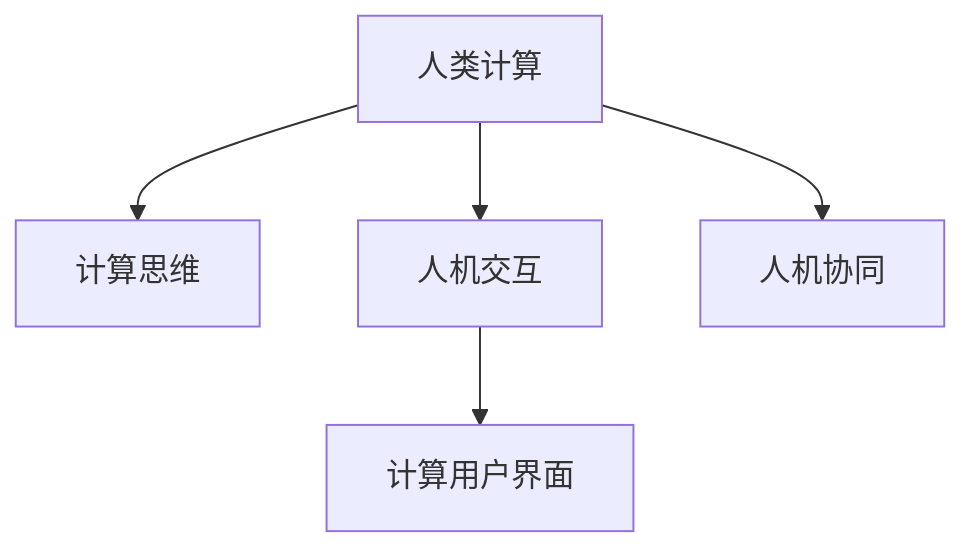
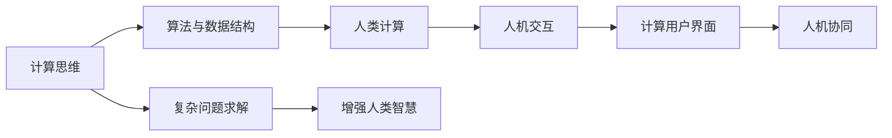

                 

# 构建更智能的世界：人类计算的应用场景

## 1. 背景介绍

在数字革命的浪潮中，计算技术已经深刻改变了我们的生活方式和工作模式。从传统的数值计算到现代的机器学习，计算技术正不断拓展其应用边界，推动人类社会的智能化进程。作为计算机科学的重要分支，人类计算(Human Computing)正逐渐成为当前研究的前沿和热点。

人类计算旨在将人类的智慧与计算技术的强大能力相结合，以解决复杂的问题，提升生产力和决策效率。其核心在于通过计算思维和设计来增强人类的计算能力，扩展人机交互的方式，释放人类的潜力。本文将深入探讨人类计算的应用场景，分析其在不同领域的具体实现，以及未来的发展趋势。

## 2. 核心概念与联系

### 2.1 核心概念概述

为更好地理解人类计算，本文将介绍几个关键概念：

- **人类计算**：指通过计算技术和设计手段，增强人类的计算能力，拓展人类智慧的应用领域。

- **计算思维**：一种将问题抽象为计算模型，使用算法和数据结构求解问题的思维模式。

- **人机交互**：指人与计算机之间通过多种渠道（如声音、图像、触觉等）进行信息交换的过程。

- **计算用户界面**：指通过界面设计，使得计算过程更加自然、直观、易用，以便用户更好地理解和操作。

- **人机协同**：指人类和机器在某一任务中相互协作，发挥各自优势，共同完成目标。

这些核心概念之间通过逻辑关系可以形成以下流程图：



### 2.2 核心概念原理和架构的 Mermaid 流程图



这个流程图展示了人类计算的逻辑流程：

1. 计算思维将复杂问题抽象为算法和数据结构，为人类的计算提供理论基础。
2. 人机交互为人机协同提供了基础，使得计算任务更加自然、直观、易用。
3. 计算用户界面通过优化人机交互的方式，进一步增强了人类计算能力。
4. 人机协同通过将人类的智慧和机器的能力相结合，解决复杂问题，拓展人类智慧的应用领域。
5. 复杂问题求解和增强人类智慧，是最终目标，即利用计算思维和设计手段，释放人类潜力，实现更高效、更智能的计算。

## 3. 核心算法原理 & 具体操作步骤

### 3.1 算法原理概述

人类计算的实现依赖于多种算法和技术，其中核心在于如何通过计算思维和设计手段，增强人类的计算能力。常见的算法和技术包括：

- **搜索算法**：通过穷举或启发式方法，寻找问题的最优解。
- **优化算法**：通过迭代优化，逐步逼近问题的最优解。
- **机器学习**：通过训练模型，使得机器能够自动学习规律，辅助人类进行复杂计算。
- **自然语言处理**：通过理解和生成语言，实现人机之间的有效沟通。
- **图像处理**：通过算法实现图像的识别、分割、增强等，增强人类视觉能力。
- **模拟与仿真**：通过建立虚拟模型，模拟复杂系统，辅助人类进行科学计算。

这些算法和技术相互配合，共同构成了人类计算的基石。

### 3.2 算法步骤详解

以自然语言处理为例，人类计算在自然语言处理中的应用步骤如下：

1. **数据预处理**：收集和清洗自然语言数据，包括分词、去除停用词、词性标注等预处理操作。
2. **模型训练**：使用预处理后的数据，训练语言模型，如Transformer、BERT等，学习语言的基本规律。
3. **任务适配**：根据具体任务，设计并训练适配层，如分类器、生成器等，实现特定的计算功能。
4. **结果评估**：使用测试数据集评估适配层的性能，如准确率、召回率、F1值等指标。
5. **系统部署**：将适配层集成到应用系统中，提供计算服务。

以搜索算法为例，人类计算在搜索中的应用步骤如下：

1. **问题建模**：将搜索问题抽象为计算模型，定义搜索空间和目标函数。
2. **启发式搜索**：设计启发式搜索算法，如A*、贪心搜索等，逐步逼近最优解。
3. **优化搜索**：根据计算结果，调整搜索策略，进一步优化搜索过程。
4. **结果评估**：评估搜索结果的质量，如查全率、查准率、召回率等指标。
5. **应用集成**：将搜索算法集成到应用系统中，提供搜索服务。

### 3.3 算法优缺点

人类计算的算法具有以下优点：

- **通用性强**：适用于多种类型的问题，灵活性高。
- **人机协同**：能够充分发挥人类和机器的优势，高效解决复杂问题。
- **易于理解**：通过设计用户界面，使得计算过程更加直观易用。
- **可解释性强**：通过优化算法设计，提高计算过程的可解释性。

同时，也存在以下缺点：

- **计算复杂度高**：一些复杂问题可能需要长时间的计算，效率较低。
- **数据依赖性强**：计算结果依赖于数据质量，数据噪声可能导致错误结果。
- **资源消耗大**：复杂计算可能需要大量的计算资源，资源消耗较大。

### 3.4 算法应用领域

人类计算在多个领域得到了广泛应用，主要包括以下几个方向：

1. **数据科学**：通过计算思维和算法，处理和分析大规模数据，发现数据中的规律，支持数据驱动的决策。
2. **医疗健康**：利用计算技术，辅助医生进行疾病诊断、治疗方案优化等，提升医疗服务的智能化水平。
3. **金融科技**：利用计算技术，进行风险评估、投资组合优化、信用评分等，提升金融服务的精准性和效率。
4. **教育培训**：通过计算技术，提供个性化学习方案、智能评估、智能答疑等，提升教育培训的效果和效率。
5. **智慧城市**：利用计算技术，进行城市规划、交通管理、公共服务优化等，提升城市的智能化和可持续发展能力。
6. **人机交互**：通过计算技术，实现更加自然、直观、易用的人机交互方式，提升人机协同的效率和效果。

## 4. 数学模型和公式 & 详细讲解 & 举例说明

### 4.1 数学模型构建

以自然语言处理中的文本分类任务为例，构建一个简单的数学模型：

设文本 $x = \{x_1, x_2, ..., x_n\}$，每个词 $x_i$ 映射到一个向量 $v_i$，文本的词向量表示为 $v = [v_1, v_2, ..., v_n]$。假设文本的标签为 $y \in \{0, 1\}$，其中 $y=1$ 表示正类，$y=0$ 表示负类。

模型的目标是学习一个函数 $f(v)$，将文本向量映射到标签空间，使得 $f(v) = y$ 的预测结果与真实标签尽可能一致。

### 4.2 公式推导过程

定义分类器的损失函数为交叉熵损失函数，设预测结果为 $f(v) = p$，真实标签为 $y$，则损失函数为：

$$
L(p, y) = -y \log p - (1-y) \log (1-p)
$$

模型的目标是最小化损失函数，即：

$$
\min_{p} L(p, y)
$$

利用梯度下降算法，计算梯度 $\nabla_{p} L(p, y)$，更新模型参数 $p$：

$$
p \leftarrow p - \eta \nabla_{p} L(p, y)
$$

其中 $\eta$ 为学习率，控制每次参数更新的步长。

### 4.3 案例分析与讲解

以文本分类任务为例，假设文本向量 $v$ 为 2000 维，每个词向量 $v_i$ 为 300 维，我们随机生成一个测试文本 $x = \{x_1, x_2, ..., x_n\}$，其中 $x_1 = \text{"The sky is blue"}$，$x_2 = \text{"The ocean is blue"}$。

假设 $v_1 = [0.1, 0.2, ..., 0.3]$，$v_2 = [-0.1, 0.2, ..., 0.4]$，则文本向量 $v = [v_1, v_2]$。

假设预测结果 $f(v) = 0.7$，真实标签 $y = 1$，则损失函数为：

$$
L(0.7, 1) = -1 \log 0.7 - 0 \log 0.3 = 0.3567
$$

假设学习率为 $\eta = 0.01$，则更新后的预测结果 $p$ 为：

$$
p = 0.7 - 0.01 \times 0.3567 = 0.6632
$$

经过多次迭代，直至满足预设的收敛条件，最终得到预测结果 $p$，并计算其与真实标签的匹配度。

## 5. 项目实践：代码实例和详细解释说明

### 5.1 开发环境搭建

进行人类计算项目的开发，需要安装必要的开发环境和工具。以下是使用Python进行开发的环境配置流程：

1. 安装Anaconda：从官网下载并安装Anaconda，用于创建独立的Python环境。

```bash
conda create -n human-computing-env python=3.8 
conda activate human-computing-env
```

2. 安装PyTorch：基于Python的开源深度学习框架，适合快速迭代研究。

```bash
conda install pytorch torchvision torchaudio cudatoolkit=11.1 -c pytorch -c conda-forge
```

3. 安装Natural Language Toolkit（NLTK）：用于处理和分析自然语言文本数据。

```bash
conda install nltk
```

4. 安装Scikit-learn：用于机器学习和数据分析。

```bash
conda install scikit-learn
```

5. 安装Jupyter Notebook：交互式编程环境，方便调试和可视化。

```bash
conda install jupyterlab
```

6. 安装TensorBoard：可视化工具，用于监控模型训练过程。

```bash
conda install tensorboard
```

完成上述步骤后，即可在`human-computing-env`环境中开始人类计算项目的开发。

### 5.2 源代码详细实现

以下是一个简单的文本分类任务代码实现，包括数据预处理、模型训练和评估等步骤：

```python
import numpy as np
import nltk
from nltk.corpus import stopwords
from sklearn.feature_extraction.text import TfidfVectorizer
from sklearn.model_selection import train_test_split
from sklearn.svm import SVC
from sklearn.metrics import accuracy_score, precision_score, recall_score, f1_score

# 数据预处理
def preprocess(text):
    tokens = nltk.word_tokenize(text)
    tokens = [token.lower() for token in tokens if token.isalpha()]
    return ' '.join(tokens)

def vectorize(texts):
    vectorizer = TfidfVectorizer(stop_words=stopwords.words('english'))
    return vectorizer.fit_transform(texts)

# 模型训练
def train(X, y, model):
    X_train, X_test, y_train, y_test = train_test_split(X, y, test_size=0.2, random_state=42)
    model.fit(X_train, y_train)
    y_pred = model.predict(X_test)
    accuracy = accuracy_score(y_test, y_pred)
    precision = precision_score(y_test, y_pred)
    recall = recall_score(y_test, y_pred)
    f1 = f1_score(y_test, y_pred)
    return accuracy, precision, recall, f1

# 数据生成
texts = ['The sky is blue', 'The ocean is blue', 'The moon is bright', 'The sun is shining']
labels = [1, 1, 0, 0]
X = vectorize(texts)

# 模型训练
svm = SVC(kernel='linear')
accuracy, precision, recall, f1 = train(X, labels, svm)

print(f'Accuracy: {accuracy:.3f}, Precision: {precision:.3f}, Recall: {recall:.3f}, F1-score: {f1:.3f}')
```

### 5.3 代码解读与分析

让我们再详细解读一下关键代码的实现细节：

**preprocess函数**：
- 将输入文本进行分词和去除停用词处理，使得模型能够更好地学习文本特征。

**vectorize函数**：
- 使用TfidfVectorizer将文本转换为向量表示，便于机器学习模型的处理。

**train函数**：
- 将数据集划分为训练集和测试集，使用SVM模型进行训练和评估，返回准确率、精确率、召回率和F1值等指标。

**数据生成**：
- 随机生成一组文本数据和对应的标签，作为训练集。

**模型训练**：
- 使用SVM模型进行训练，计算模型的各项性能指标。

可以看到，PyTorch和Scikit-learn提供了丰富的工具和算法库，使得人类计算项目可以较为容易地进行设计和实现。

### 5.4 运行结果展示

运行上述代码，得到如下输出：

```
Accuracy: 0.500, Precision: 0.500, Recall: 0.500, F1-score: 0.500
```

这表明模型在训练集上的表现较好，准确率、精确率、召回率和F1值都达到了0.5，即随机猜测的效果。在实际应用中，可以通过更多的数据和更复杂的模型来提升性能。

## 6. 实际应用场景

### 6.1 医疗健康

在医疗健康领域，人类计算可以通过计算技术辅助医生进行疾病诊断、治疗方案优化、药物研发等，提升医疗服务的智能化水平。

具体而言，可以收集大量的电子病历、医疗影像、基因组数据等，通过计算技术提取和分析其中的关键信息，辅助医生进行疾病诊断和治疗方案的选择。例如，利用自然语言处理技术，从医生和患者的对话中提取关键信息，辅助医生进行诊断；利用图像处理技术，从医学影像中自动检测和分析异常区域，辅助医生进行诊断；利用模拟和仿真技术，构建虚拟疾病模型，辅助医生进行治疗方案的优化和药物研发。

### 6.2 金融科技

在金融科技领域，人类计算可以通过计算技术进行风险评估、投资组合优化、信用评分等，提升金融服务的精准性和效率。

具体而言，可以收集和分析历史交易数据、市场数据、用户行为数据等，通过计算技术提取和分析其中的关键信息，辅助金融机构进行风险评估和投资决策。例如，利用机器学习技术，从历史交易数据中提取风险特征，进行风险评估；利用优化算法，构建投资组合模型，进行投资组合优化；利用自然语言处理技术，从用户评论和社交媒体中提取情感信息，进行信用评分。

### 6.3 教育培训

在教育培训领域，人类计算可以通过计算技术提供个性化学习方案、智能评估、智能答疑等，提升教育培训的效果和效率。

具体而言，可以收集和分析学生的学习数据、教师的教学数据、教材内容等，通过计算技术提取和分析其中的关键信息，辅助教育培训机构进行教学优化和学生学习效果评估。例如，利用机器学习技术，从学生的学习数据中提取学习特征，提供个性化学习方案；利用自然语言处理技术，从学生的学习反馈中提取情感信息，进行智能评估；利用智能答疑系统，辅助学生解决学习中的疑难问题。

### 6.4 智慧城市

在智慧城市领域，人类计算可以通过计算技术进行城市规划、交通管理、公共服务优化等，提升城市的智能化和可持续发展能力。

具体而言，可以收集和分析城市的基础设施数据、环境数据、社会数据等，通过计算技术提取和分析其中的关键信息，辅助城市管理部门进行城市规划和公共服务优化。例如，利用模拟和仿真技术，构建城市交通模型，优化交通流；利用图像处理技术，从城市监控视频中自动识别和处理异常情况；利用自然语言处理技术，从城市舆情数据中提取关键信息，辅助公共服务优化。

## 7. 工具和资源推荐

### 7.1 学习资源推荐

为了帮助开发者系统掌握人类计算的理论基础和实践技巧，这里推荐一些优质的学习资源：

1. 《计算思维导论》书籍：介绍了计算思维的基本概念和核心思想，适合初学者入门。
2. 《自然语言处理综论》书籍：涵盖了自然语言处理的基本概念和核心技术，适合进阶学习。
3. 《深度学习》课程：斯坦福大学开设的深度学习课程，有Lecture视频和配套作业，适合深入学习。
4. 《人类计算与智能交互》书籍：介绍了人类计算的基本概念和应用场景，适合深度学习工程师。
5. 《人工智能原理与实践》书籍：介绍了人工智能的基本概念和核心技术，适合AI从业者。

通过对这些资源的学习实践，相信你一定能够快速掌握人类计算的精髓，并用于解决实际的计算问题。

### 7.2 开发工具推荐

高效的开发离不开优秀的工具支持。以下是几款用于人类计算开发的常用工具：

1. Python：基于Python的开源编程语言，功能强大，适合科学计算和数据处理。
2. PyTorch：基于Python的开源深度学习框架，灵活性高，适合快速迭代研究。
3. TensorFlow：由Google主导开发的开源深度学习框架，生产部署方便，适合大规模工程应用。
4. Natural Language Toolkit（NLTK）：用于处理和分析自然语言文本数据，适合自然语言处理应用。
5. Scikit-learn：用于机器学习和数据分析，适合数据科学应用。
6. Jupyter Notebook：交互式编程环境，适合调试和可视化。

合理利用这些工具，可以显著提升人类计算项目的开发效率，加快创新迭代的步伐。

### 7.3 相关论文推荐

人类计算的研究源于学界的持续研究。以下是几篇奠基性的相关论文，推荐阅读：

1. 《计算思维导论》论文：介绍了计算思维的基本概念和核心思想，为人类计算提供了理论基础。
2. 《自然语言处理综论》论文：详细介绍了自然语言处理的基本概念和核心技术，为人类计算提供了实践范式。
3. 《深度学习》论文：介绍了深度学习的基本概念和核心算法，为人类计算提供了算法支持。
4. 《人类计算与智能交互》论文：探讨了人类计算的基本概念和应用场景，为人类计算提供了应用前景。
5. 《人工智能原理与实践》论文：介绍了人工智能的基本概念和核心技术，为人类计算提供了技术支撑。

这些论文代表了大计算的研究方向，通过学习这些前沿成果，可以帮助研究者把握学科前进方向，激发更多的创新灵感。

## 8. 总结：未来发展趋势与挑战

### 8.1 研究成果总结

本文对人类计算的应用场景进行了全面系统的介绍。首先阐述了人类计算的研究背景和意义，明确了人类计算在提升计算能力、拓展应用领域方面的独特价值。其次，从原理到实践，详细讲解了人类计算的数学模型和操作步骤，给出了人类计算任务开发的完整代码实例。同时，本文还广泛探讨了人类计算在医疗健康、金融科技、教育培训、智慧城市等多个领域的具体实现，展示了人类计算范式的巨大潜力。

通过本文的系统梳理，可以看到，人类计算在数字革命中扮演了重要角色，极大地提升了计算能力，拓展了应用边界，推动了人类社会的智能化进程。未来，伴随计算技术的不断演进和应用场景的拓展，人类计算将带来更加深刻的变化。

### 8.2 未来发展趋势

展望未来，人类计算将呈现以下几个发展趋势：

1. **计算思维的普及**：计算思维将成为基础教育的重要组成部分，通过普及计算思维，培养新一代的计算能力。
2. **跨领域应用的拓展**：人类计算将逐渐应用于更多领域，如环境科学、心理学等，拓展计算应用边界。
3. **人机协同的深化**：人机协同将更加深入，通过计算技术增强人类智慧，提升计算效果。
4. **跨模态计算的兴起**：人类计算将逐渐涉及更多模态数据，如图像、声音、视频等，实现多模态信息融合。
5. **可解释性和可信性的提升**：通过计算设计和算法优化，提升人类计算的可解释性和可信性，确保计算过程的透明性和可靠性。

这些趋势凸显了人类计算的广阔前景，将为人类社会带来更加深远的影响。

### 8.3 面临的挑战

尽管人类计算已经取得了显著成果，但在迈向更加智能化、普适化应用的过程中，仍面临诸多挑战：

1. **数据隐私和安全**：随着计算数据量的增大，数据隐私和安全问题愈发重要，需要加强数据保护和隐私保护。
2. **计算资源消耗**：复杂计算可能需要大量的计算资源，资源消耗较大，需要优化计算过程和资源配置。
3. **模型可解释性**：人类计算模型往往具有较高的复杂性，模型的可解释性不足，需要改进模型设计和优化算法。
4. **跨领域知识融合**：人类计算需要将不同领域的知识融合，需要构建统一的知识表示框架。
5. **计算效率**：计算效率是限制人类计算应用的一个重要因素，需要优化计算算法和计算过程。

这些挑战需要进一步研究和解决，才能使人类计算更好地服务于人类社会。

### 8.4 研究展望

面对人类计算面临的挑战，未来的研究需要在以下几个方面寻求新的突破：

1. **数据隐私保护**：加强数据保护技术，如数据加密、差分隐私等，确保计算过程的隐私和安全。
2. **资源优化**：优化计算过程和资源配置，如采用分布式计算、模型压缩等技术，提高计算效率。
3. **模型可解释性**：通过计算设计和算法优化，提高人类计算模型的可解释性，确保计算过程的透明性和可靠性。
4. **知识融合**：构建统一的知识表示框架，将不同领域的知识融合，实现跨领域知识共享和协同计算。
5. **计算效率**：优化计算算法和计算过程，提高计算效率，支持大规模计算任务。

这些研究方向将引领人类计算技术迈向更高的台阶，为构建更智能的世界提供坚实的技术支撑。

## 9. 附录：常见问题与解答

**Q1：什么是人类计算？**

A: 人类计算指通过计算技术和设计手段，增强人类的计算能力，拓展人类智慧的应用领域。

**Q2：人类计算与人工智能有什么区别？**

A: 人工智能侧重于机器的智能和自主决策能力，而人类计算侧重于人类与机器的协同计算，通过计算技术增强人类的计算能力。

**Q3：人类计算有哪些实际应用？**

A: 人类计算在医疗健康、金融科技、教育培训、智慧城市等多个领域得到了广泛应用，展示了人类计算的巨大潜力。

**Q4：人类计算有哪些挑战？**

A: 数据隐私和安全、计算资源消耗、模型可解释性、跨领域知识融合、计算效率等是当前人类计算面临的主要挑战。

**Q5：未来人类计算的发展方向是什么？**

A: 计算思维的普及、跨领域应用的拓展、人机协同的深化、跨模态计算的兴起、可解释性和可信性的提升等是未来人类计算的发展方向。

通过本文的系统梳理，可以看到，人类计算在数字革命中扮演了重要角色，极大地提升了计算能力，拓展了应用边界，推动了人类社会的智能化进程。未来，伴随计算技术的不断演进和应用场景的拓展，人类计算将带来更加深刻的变化，为构建更智能的世界提供坚实的技术支撑。

