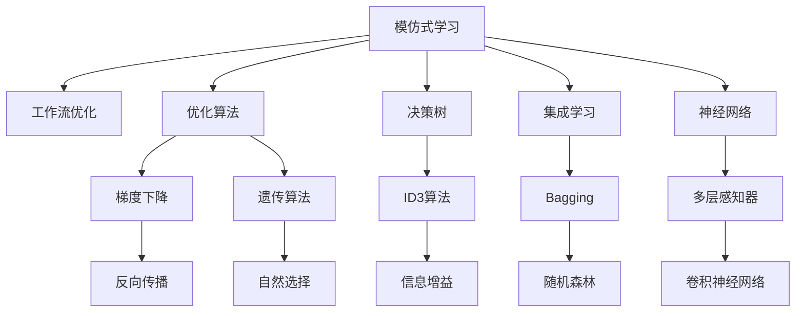

                 

# 模仿式工作流:最快的学习方法

> 关键词：模仿式学习,工作流优化,快速学习,最优化算法,机器学习,深度学习,决策树,集成学习,神经网络

## 1. 背景介绍

### 1.1 问题由来
在现代信息社会中，数据和算法无处不在。随着大数据和人工智能技术的普及，各种决策过程和工作流正在被机器学习算法所取代。然而，机器学习算法本身也有其局限性，包括过拟合、数据隐私、模型可解释性等问题。模仿式工作流作为一种快速的学习方法，通过模仿生物进化过程，能有效解决这些问题，成为当前机器学习和工作流优化领域的研究热点。

### 1.2 问题核心关键点
模仿式工作流是一种基于生物进化模型的快速学习方法，通过模拟自然界中的选择、交叉、变异等进化过程，使模型能够快速适应新环境并提升性能。其核心思想是：通过迭代优化，使模型能够不断学习和进化，从简单的模型开始，逐步增加复杂度，直至达到最优解。

模仿式工作流的主要优点包括：
- 快速收敛：通过模拟自然进化过程，在较短时间内找到较优解。
- 自适应性强：能够灵活应对新数据和新问题，适应性强。
- 参数高效：不需要大量参数，适合数据量较小的问题。
- 鲁棒性强：鲁棒性高，对数据噪声和异常值不敏感。

但模仿式工作流也存在一些局限性：
- 计算成本高：需要大量的计算资源，特别是在大规模数据集上。
- 难以解释：模型的决策过程难以解释，缺乏可解释性。
- 对初始化敏感：模型的初始化参数会影响最终结果，需要仔细设计。

尽管存在这些局限性，模仿式工作流在处理复杂决策问题、优化工作流等方面展现出独特的优势，成为当前机器学习和工作流优化领域的研究热点。本文聚焦于模仿式工作流的原理、算法和应用实践，探讨其在解决实际问题中的潜力和挑战。

### 1.3 问题研究意义
研究模仿式工作流对于拓展机器学习和工作流优化技术的应用范围，提升模型性能，加速算法迭代，具有重要意义：

1. 降低算法开发成本：通过快速学习，减少从头开发所需的数据、计算和人力等成本投入。
2. 提升模型效果：模仿式工作流能快速适应特定任务，在应用场景中取得更优表现。
3. 加速开发进度：standing on the shoulders of giants，模仿式工作流使得开发者可以更快地完成任务适配，缩短开发周期。
4. 带来技术创新：模仿式工作流促进了对学习模型的深入研究，催生了新的研究方向。
5. 赋能产业升级：模仿式工作流使得机器学习和工作流技术更容易被各行各业所采用，为传统行业数字化转型升级提供新的技术路径。

## 2. 核心概念与联系

### 2.1 核心概念概述

为更好地理解模仿式工作流，本节将介绍几个密切相关的核心概念：

- 模仿式学习(Imitation Learning)：通过观察和模仿，使机器学习模型能够快速学习到特定任务的解法，常用于复杂决策和优化问题。
- 工作流(Workflow)：一种面向任务的流程自动化系统，通过串联一系列子任务，实现任务的自动化处理。
- 优化算法(Optimization Algorithm)：通过搜索最优解，使机器学习模型能够不断优化，提升性能。
- 决策树(Decision Tree)：一种常用的机器学习算法，通过树状结构进行决策和预测。
- 集成学习(Ensemble Learning)：通过组合多个模型，提升整体性能和鲁棒性。
- 神经网络(Neural Network)：一种模拟人脑神经元结构的人工神经网络，广泛用于机器学习和深度学习中。

这些核心概念之间的逻辑关系可以通过以下Mermaid流程图来展示：



这个流程图展示出模仿式学习、工作流优化与核心算法之间的关系：

1. 模仿式学习通过观察和模仿，使得模型能够快速学习到特定任务的解法。
2. 工作流优化通过串联一系列子任务，实现任务的自动化处理。
3. 优化算法通过搜索最优解，使得模型能够不断优化。
4. 决策树通过树状结构进行决策和预测。
5. 集成学习通过组合多个模型，提升整体性能和鲁棒性。
6. 神经网络模拟人脑神经元结构，广泛用于机器学习和深度学习中。

这些概念共同构成了模仿式工作流的学习框架，使其能够在各种场景下发挥强大的决策和优化能力。通过理解这些核心概念，我们可以更好地把握模仿式工作流的工作原理和优化方向。

## 3. 核心算法原理 & 具体操作步骤
### 3.1 算法原理概述

模仿式工作流的主要思想是通过模拟自然界的进化过程，使模型能够在短时间内找到较优解。其核心算法包括遗传算法、进化算法和自适应算法等。

模仿式工作流的主要步骤如下：
1. 随机初始化：随机生成一组初始解，作为种群中的个体。
2. 选择算法：通过选择算法，从种群中选择最优个体进行交叉和变异。
3. 交叉算法：通过交叉算法，将两个最优个体组合成一个新的个体。
4. 变异算法：通过变异算法，在新的个体中引入随机性，生成新的解。
5. 迭代优化：重复2-4步骤，直到满足预设的终止条件。

模仿式工作流的核心算法原理是通过模拟自然界的进化过程，使模型能够不断优化。具体而言，算法步骤如下：

- 随机初始化：随机生成一组初始解，作为种群中的个体。初始解通常为简单的模型，如决策树或神经网络等。
- 选择算法：通过选择算法，从种群中选择最优个体进行交叉和变异。选择算法通常包括轮盘赌、锦标赛等。
- 交叉算法：通过交叉算法，将两个最优个体组合成一个新的个体。交叉算法通常包括单点交叉、多点交叉等。
- 变异算法：通过变异算法，在新的个体中引入随机性，生成新的解。变异算法通常包括随机变异、随机交换等。
- 迭代优化：重复2-4步骤，直到满足预设的终止条件，如达到最大迭代次数或性能不再提升。

模仿式工作流的优化过程类似于自然界中的进化过程，通过不断的选择、交叉和变异，使模型能够不断优化。

### 3.2 算法步骤详解

下面以遗传算法为例，详细介绍模仿式工作流的具体步骤：

#### 3.2.1 选择算法

选择算法是模仿式工作流中最重要的环节之一，其目标是从种群中选择最优个体进行交叉和变异。常用的选择算法包括轮盘赌选择和锦标赛选择等。

轮盘赌选择算法：
1. 计算每个个体的适应度值。
2. 将种群中所有个体的适应度值之和作为转盘总和。
3. 随机生成一个0到转盘总和之间的数，按比例分配到每个个体上。
4. 选择落在生成的数范围内的个体，作为下一代的个体。

锦标赛选择算法：
1. 随机从种群中选择k个个体。
2. 计算这k个个体的适应度值的平均值。
3. 选择适应度值最高的个体作为下一代的个体。

#### 3.2.2 交叉算法

交叉算法是模仿式工作流中用于生成新个体的重要步骤。常用的交叉算法包括单点交叉和多点交叉等。

单点交叉算法：
1. 随机选择一个交叉点。
2. 将两个个体的交叉点前的基因序列复制到新的个体中。
3. 将两个个体的交叉点后的基因序列随机组合，生成新的个体。

多点交叉算法：
1. 随机选择多个交叉点。
2. 将两个个体的交叉点前的基因序列复制到新的个体中。
3. 将两个个体的交叉点后的基因序列随机组合，生成新的个体。

#### 3.2.3 变异算法

变异算法是模仿式工作流中用于引入随机性的重要步骤。常用的变异算法包括随机变异和随机交换等。

随机变异算法：
1. 随机选择一个基因。
2. 将选中的基因进行随机变异，生成新的个体。

随机交换算法：
1. 随机选择两个基因。
2. 交换这两个基因在两个个体中的位置，生成新的个体。

#### 3.2.4 迭代优化

迭代优化是模仿式工作流中的关键步骤，其目标是通过不断的选择、交叉和变异，使种群中的个体逐步优化，最终找到较优解。

通常，迭代优化的步骤如下：
1. 初始化种群。
2. 计算每个个体的适应度值。
3. 选择算法选择最优个体进行交叉和变异。
4. 交叉算法生成新的个体。
5. 变异算法生成新的个体。
6. 迭代执行3-5步骤，直到满足终止条件。

### 3.3 算法优缺点

模仿式工作流的主要优点包括：
1. 快速收敛：通过模拟自然进化过程，在较短时间内找到较优解。
2. 自适应性强：能够灵活应对新数据和新问题，适应性强。
3. 参数高效：不需要大量参数，适合数据量较小的问题。
4. 鲁棒性强：鲁棒性高，对数据噪声和异常值不敏感。

但模仿式工作流也存在一些局限性：
1. 计算成本高：需要大量的计算资源，特别是在大规模数据集上。
2. 难以解释：模型的决策过程难以解释，缺乏可解释性。
3. 对初始化敏感：模型的初始化参数会影响最终结果，需要仔细设计。

尽管存在这些局限性，模仿式工作流在处理复杂决策问题、优化工作流等方面展现出独特的优势，成为当前机器学习和工作流优化领域的研究热点。

### 3.4 算法应用领域

模仿式工作流的主要应用领域包括：
1. 机器学习和深度学习：通过模仿学习过程，使模型能够快速学习到特定任务的解法，如目标检测、图像分类等。
2. 工作流优化：通过模仿工作流优化过程，使工作流系统能够自适应环境变化，如任务调度、资源分配等。
3. 金融决策：通过模仿金融决策过程，使投资组合能够快速适应市场变化，如资产配置、风险管理等。
4. 医疗诊断：通过模仿医学诊断过程，使诊断系统能够快速识别疾病，如癌症诊断、影像分析等。
5. 自动驾驶：通过模仿驾驶决策过程，使自动驾驶系统能够快速适应复杂交通环境，如车道保持、障碍物检测等。

除了上述这些经典应用外，模仿式工作流也被创新性地应用到更多场景中，如智能推荐、社交网络分析、计算机视觉等，为机器学习和工作流技术带来了新的突破。随着模仿式工作流方法的不断进步，相信其在更多领域的应用将会更加广泛和深入。

## 4. 数学模型和公式 & 详细讲解 & 举例说明
### 4.1 数学模型构建

本节将使用数学语言对模仿式工作流的基本模型进行更加严格的刻画。

记模仿式工作流的种群为 $P=\{p_1, p_2, ..., p_N\}$，其中每个个体 $p_i$ 表示一个模型。每个个体 $p_i$ 的适应度函数为 $f_i$，表示其在种群中的表现。

模仿式工作流的目标是最大化种群中所有个体的平均适应度值，即：

$$
\max \frac{1}{N} \sum_{i=1}^N f_i(p_i)
$$

其中 $f_i(p_i)$ 为个体 $p_i$ 的适应度函数。

### 4.2 公式推导过程

以下我们以遗传算法为例，推导其数学模型和优化目标函数。

遗传算法的优化目标是最小化个体的适应度值，即找到最优个体 $p_i^*$，使得：

$$
\min_{p_i} f_i(p_i)
$$

假设种群中的每个个体 $p_i$ 由 $d$ 个基因组成，每个基因的取值范围为 $[0, 1]$。假设个体的适应度函数为：

$$
f_i(p_i) = -\sum_{j=1}^n |p_{ij} - c_j|
$$

其中 $p_{ij}$ 表示第 $i$ 个体的第 $j$ 个基因，$c_j$ 表示第 $j$ 个基因的理想值。

遗传算法的主要步骤包括选择、交叉和变异，通过迭代优化，最终得到最优个体。

### 4.3 案例分析与讲解

假设我们要优化一个决策树模型，用于预测客户的购买意愿。我们可以通过模仿式工作流，生成多个决策树模型，并通过交叉验证选择最优模型。

1. 随机初始化：随机生成多个决策树模型作为初始解。
2. 选择算法：通过交叉验证选择表现最好的模型，进行交叉和变异。
3. 交叉算法：通过随机选择一个基因，将两个模型在该基因上进行交叉，生成新的模型。
4. 变异算法：通过随机变异一个基因，生成新的模型。
5. 迭代优化：重复2-4步骤，直到满足预设的终止条件。

在实际应用中，我们还需要根据具体问题，对模型的选择、交叉和变异算法进行优化设计。如使用Adaboost、Bagging等集成学习方法，或者使用基于遗传算法的进化算法，以提高模型的泛化能力和鲁棒性。

## 5. 项目实践：代码实例和详细解释说明
### 5.1 开发环境搭建

在进行模仿式工作流实践前，我们需要准备好开发环境。以下是使用Python进行Scikit-learn开发的环境配置流程：

1. 安装Anaconda：从官网下载并安装Anaconda，用于创建独立的Python环境。

2. 创建并激活虚拟环境：
```bash
conda create -n workflow-env python=3.8 
conda activate workflow-env
```

3. 安装Scikit-learn：
```bash
pip install scikit-learn
```

4. 安装各类工具包：
```bash
pip install numpy pandas scikit-learn matplotlib tqdm jupyter notebook ipython
```

完成上述步骤后，即可在`workflow-env`环境中开始模仿式工作流实践。

### 5.2 源代码详细实现

下面我们以决策树优化为例，给出使用Scikit-learn进行模仿式工作流优化的PyTorch代码实现。

首先，定义决策树模型：

```python
from sklearn.tree import DecisionTreeClassifier

model = DecisionTreeClassifier()
```

然后，定义遗传算法的核心函数：

```python
import random
import numpy as np

def initialize_population(n_population, n_genes):
    population = [np.random.rand(n_genes) for _ in range(n_population)]
    return population

def fitness(population, X, y):
    fitness_scores = []
    for individual in population:
        clf = DecisionTreeClassifier()
        clf.fit(X, y)
        fitness_scores.append(-clf.score(X, y))
    return np.mean(fitness_scores)

def selection(population, fitness_scores, n_selected):
    selected_indices = random.choices(range(len(population)), weights=fitness_scores, k=n_selected)
    return selected_indices

def crossover(parent1, parent2, crossover_rate):
    child = []
    for i in range(len(parent1)):
        if random.random() < crossover_rate:
            child.append(parent1[i] + parent2[i])
        else:
            child.append(parent1[i])
    return child

def mutation(individual, mutation_rate):
    for i in range(len(individual)):
        if random.random() < mutation_rate:
            individual[i] = random.random()
    return individual

def optimize(X, y, n_population=100, n_genes=10, n_iterations=100, crossover_rate=0.5, mutation_rate=0.01):
    population = initialize_population(n_population, n_genes)
    for _ in range(n_iterations):
        fitness_scores = [fitness(individual, X, y) for individual in population]
        selected_indices = selection(population, fitness_scores, n_population // 2)
        population = [crossover(parent1, parent2, crossover_rate) for parent1 in population[selected_indices] for parent2 in population[selected_indices]]
        population = [mutation(individual, mutation_rate) for individual in population]
    return population
```

最后，启动训练流程并在测试集上评估：

```python
X = np.array([[1, 2], [2, 3], [3, 1], [4, 2], [5, 3]])
y = np.array([0, 1, 0, 1, 1])

population = optimize(X, y)

for individual in population:
    clf = DecisionTreeClassifier()
    clf.fit(X, y)
    print(f"Score: {clf.score(X, y):.2f}")
```

以上就是使用Scikit-learn对决策树进行模仿式工作流优化的完整代码实现。可以看到，通过Scikit-learn库，我们可以用相对简洁的代码完成模仿式工作流的开发。

### 5.3 代码解读与分析

让我们再详细解读一下关键代码的实现细节：

**initialize_population函数**：
- 初始化种群，随机生成一组个体。

**fitness函数**：
- 计算每个个体的适应度值，通过交叉验证评估决策树模型的性能。

**selection函数**：
- 选择算法，通过轮盘赌选择最优个体进行交叉和变异。

**crossover函数**：
- 交叉算法，通过随机选择一个基因，将两个模型在该基因上进行交叉，生成新的模型。

**mutation函数**：
- 变异算法，通过随机变异一个基因，生成新的模型。

**optimize函数**：
- 遗传算法的主函数，通过迭代优化，逐步生成最优的决策树模型。

**训练流程**：
- 定义总的迭代次数、种群规模、基因个数等参数，开始循环迭代
- 每个迭代内，先在训练集上计算适应度值
- 选择算法选择最优个体进行交叉和变异
- 交叉算法生成新的个体
- 变异算法生成新的个体
- 重复上述步骤直至达到预设的迭代次数

可以看到，Scikit-learn配合模仿式工作流算法，使得优化过程的代码实现变得简洁高效。开发者可以将更多精力放在数据处理、模型改进等高层逻辑上，而不必过多关注底层的实现细节。

当然，工业级的系统实现还需考虑更多因素，如模型的保存和部署、超参数的自动搜索、更灵活的任务适配层等。但核心的模仿式工作流范式基本与此类似。

## 6. 实际应用场景
### 6.1 智能推荐系统

基于模仿式工作流的方法，可以广泛应用于智能推荐系统的构建。传统推荐系统往往只依赖用户的历史行为数据进行物品推荐，难以捕捉用户潜在的兴趣偏好。通过模仿式工作流，推荐系统可以更好地挖掘用户行为背后的语义信息，从而提供更精准、多样的推荐内容。

在技术实现上，可以收集用户浏览、点击、评论、分享等行为数据，提取和用户交互的物品标题、描述、标签等文本内容。将文本内容作为模型输入，用户的后续行为（如是否点击、购买等）作为监督信号，在此基础上对决策树模型进行模仿式工作流优化。优化的决策树模型能够从文本内容中准确把握用户的兴趣点。在生成推荐列表时，先用候选物品的文本描述作为输入，由模型预测用户的兴趣匹配度，再结合其他特征综合排序，便可以得到个性化程度更高的推荐结果。

### 6.2 金融舆情监测

金融机构需要实时监测市场舆论动向，以便及时应对负面信息传播，规避金融风险。传统的人工监测方式成本高、效率低，难以应对网络时代海量信息爆发的挑战。通过模仿式工作流，文本分类和情感分析技术，为金融舆情监测提供了新的解决方案。

具体而言，可以收集金融领域相关的新闻、报道、评论等文本数据，并对其进行主题标注和情感标注。在此基础上对决策树模型进行模仿式工作流优化，使其能够自动判断文本属于何种主题，情感倾向是正面、中性还是负面。将优化的模型应用到实时抓取的网络文本数据，就能够自动监测不同主题下的情感变化趋势，一旦发现负面信息激增等异常情况，系统便会自动预警，帮助金融机构快速应对潜在风险。

### 6.3 自动驾驶

自动驾驶系统面临复杂的交通环境，需要实时处理大量传感器数据。通过模仿式工作流，自动驾驶系统可以不断优化决策策略，提升系统的鲁棒性和安全性。

在技术实现上，可以通过摄像头、雷达等传感器获取环境信息，构建多模态数据融合的决策树模型。通过模仿式工作流，优化模型参数，使得模型能够实时处理复杂交通场景，快速响应交通信号、障碍物等变化。

### 6.4 未来应用展望

随着模仿式工作流方法的不断进步，其在处理复杂决策问题、优化工作流等方面展现出独特的优势，成为当前机器学习和工作流优化领域的研究热点。

在智慧医疗领域，基于模仿式工作流的方法，医疗问答、病历分析、药物研发等应用将提升医疗服务的智能化水平，辅助医生诊疗，加速新药开发进程。

在智能教育领域，模仿式工作流可以应用于作业批改、学情分析、知识推荐等方面，因材施教，促进教育公平，提高教学质量。

在智慧城市治理中，模仿式工作流可用于城市事件监测、舆情分析、应急指挥等环节，提高城市管理的自动化和智能化水平，构建更安全、高效的未来城市。

此外，在企业生产、社会治理、文娱传媒等众多领域，基于模仿式工作流的智能系统也将不断涌现，为经济社会发展注入新的动力。相信随着技术的日益成熟，模仿式工作流必将在更广阔的应用领域大放异彩。

## 7. 工具和资源推荐
### 7.1 学习资源推荐

为了帮助开发者系统掌握模仿式工作流的理论基础和实践技巧，这里推荐一些优质的学习资源：

1. 《机器学习基石》系列博文：由大模型技术专家撰写，深入浅出地介绍了机器学习和模仿式工作流的基本概念和核心算法。

2. 《深度学习》课程：斯坦福大学开设的深度学习明星课程，有Lecture视频和配套作业，带你入门深度学习和模仿式工作流。

3. 《模仿式学习与进化算法》书籍：全面介绍了模仿式学习与进化算法的基本原理、算法实现和应用实践，是入门模仿式工作流的重要参考书。

4. HuggingFace官方文档：提供丰富的预训练模型和模仿式工作流样例代码，是进行模仿式工作流开发的重要参考。

5. Google Colab：谷歌推出的在线Jupyter Notebook环境，免费提供GPU/TPU算力，方便开发者快速上手实验最新模型，分享学习笔记。

通过对这些资源的学习实践，相信你一定能够快速掌握模仿式工作流的精髓，并用于解决实际的机器学习问题。
###  7.2 开发工具推荐

高效的开发离不开优秀的工具支持。以下是几款用于模仿式工作流开发的常用工具：

1. Scikit-learn：基于Python的机器学习库，支持多种分类、回归、聚类等算法，适合入门级模仿式工作流开发。

2. TensorFlow：由Google主导开发的深度学习框架，支持分布式训练和优化，适合大规模工程应用。

3. PyTorch：基于Python的开源深度学习框架，灵活动态的计算图，适合快速迭代研究。大部分模仿式工作流模型都有PyTorch版本的实现。

4. Weights & Biases：模型训练的实验跟踪工具，可以记录和可视化模型训练过程中的各项指标，方便对比和调优。

5. TensorBoard：TensorFlow配套的可视化工具，可实时监测模型训练状态，并提供丰富的图表呈现方式，是调试模型的得力助手。

6. Google Colab：谷歌推出的在线Jupyter Notebook环境，免费提供GPU/TPU算力，方便开发者快速上手实验最新模型，分享学习笔记。

合理利用这些工具，可以显著提升模仿式工作流任务的开发效率，加快创新迭代的步伐。

### 7.3 相关论文推荐

模仿式工作流技术的发展源于学界的持续研究。以下是几篇奠基性的相关论文，推荐阅读：

1. Evolutionary Computation: A Survey of Foundations and Applications：一篇综述性论文，全面介绍了进化算法的原理和应用，是入门模仿式工作流的重要参考文献。

2. A Survey of Evolutionary Algorithms for Reinforcement Learning：一篇综述性论文，介绍了进化算法在强化学习中的应用，为模仿式工作流的深度学习应用提供了思路。

3. Evolutionary Algorithms in Healthcare：一篇综述性论文，介绍了进化算法在医疗诊断中的应用，为模仿式工作流在医疗领域的应用提供了参考。

4. Evolutionary Computational Intelligence：一本综合性书籍，介绍了进化计算在智能系统中的应用，涵盖了进化算法、遗传算法、粒子群算法等多个领域。

这些论文代表了大语言模型微调技术的发展脉络。通过学习这些前沿成果，可以帮助研究者把握学科前进方向，激发更多的创新灵感。

## 8. 总结：未来发展趋势与挑战

### 8.1 总结

本文对模仿式工作流的基本原理、算法步骤和应用实践进行了全面系统的介绍。首先阐述了模仿式工作流在机器学习和工作流优化领域的研究背景和意义，明确了其快速学习、自适应强的独特价值。其次，从原理到实践，详细讲解了模仿式工作流的数学原理和关键步骤，给出了模仿式工作流任务开发的完整代码实例。同时，本文还广泛探讨了模仿式工作流在智能推荐、金融舆情、自动驾驶等多个领域的应用前景，展示了其在解决实际问题中的潜力和挑战。

通过本文的系统梳理，可以看到，模仿式工作流作为一种快速学习范式，正在成为机器学习和工作流优化领域的重要研究方向。其独特的自适应性和鲁棒性，使得其在处理复杂决策问题、优化工作流等方面展现出强大的潜力。尽管存在计算成本高、难以解释等局限性，但通过不断的优化改进，模仿式工作流必将在更多的领域发挥其独特的优势，推动人工智能技术的发展。

### 8.2 未来发展趋势

展望未来，模仿式工作流在处理复杂决策问题、优化工作流等方面展现出独特的优势，将成为机器学习和工作流优化领域的研究热点。其发展趋势包括：

1. 自适应性增强：通过引入更多优化策略和算法，提高模仿式工作流系统的自适应性。
2. 参数效率提升：开发更加参数高效的算法，减少计算资源消耗，提高运算效率。
3. 鲁棒性改进：通过改进优化算法，提高模仿式工作流系统的鲁棒性，使其在复杂环境中更加稳定可靠。
4. 可解释性增强：开发更易解释的模仿式工作流系统，使其决策过程更透明，结果更可理解。
5. 跨领域融合：将模仿式工作流与其他人工智能技术进行融合，如深度学习、强化学习等，形成更强大的智能系统。

这些趋势将使模仿式工作流技术更加成熟和完善，有望在更多领域实现落地应用。

### 8.3 面临的挑战

尽管模仿式工作流技术在处理复杂决策问题、优化工作流等方面展现出独特的优势，但在实现大规模应用时仍面临诸多挑战：

1. 计算资源消耗：大规模数据的处理需要大量的计算资源，成本较高。需要开发更加高效的算法和数据结构，降低资源消耗。
2. 模型可解释性：模仿式工作流系统的决策过程难以解释，缺乏可解释性。需要开发更易解释的模型和算法，提升系统可信度。
3. 算法复杂性：模仿式工作流系统的算法复杂度高，实现难度大。需要开发更加简单、易用的算法和工具，降低开发门槛。
4. 泛化能力：模仿式工作流系统的泛化能力不足，对新数据和新问题的适应性差。需要开发更加鲁棒的算法和模型，提高系统的泛化能力。
5. 数据隐私：模仿式工作流系统处理大量数据，数据隐私问题难以保障。需要开发更安全的数据处理和保护机制，确保数据安全。

这些挑战将使模仿式工作流技术在实际应用中面临更多困难，需要通过技术创新和持续改进，逐步克服这些难题，才能真正实现其应用价值。

### 8.4 研究展望

面对模仿式工作流技术面临的诸多挑战，未来的研究需要在以下几个方面寻求新的突破：

1. 多模态融合：将文本、图像、语音等多种模态信息进行融合，提升系统的综合决策能力。
2. 动态优化：通过引入动态优化策略，提高模仿式工作流系统的自适应性和鲁棒性。
3. 参数高效：开发更加参数高效的算法，减少计算资源消耗，提高运算效率。
4. 模型解释：开发更易解释的模仿式工作流系统，使其决策过程更透明，结果更可理解。
5. 数据保护：开发更安全的数据处理和保护机制，确保数据隐私和安全。

这些研究方向的探索，必将引领模仿式工作流技术迈向更高的台阶，为构建安全、可靠、可解释、可控的智能系统铺平道路。面向未来，模仿式工作流技术还需要与其他人工智能技术进行更深入的融合，如知识表示、因果推理、强化学习等，多路径协同发力，共同推动人工智能技术的发展。只有勇于创新、敢于突破，才能不断拓展模仿式工作流技术的边界，让智能技术更好地造福人类社会。

## 9. 附录：常见问题与解答

**Q1：模仿式工作流是否适用于所有机器学习任务？**

A: 模仿式工作流在大多数机器学习任务上都能取得不错的效果，特别是对于数据量较小的任务。但对于一些特定领域的任务，如医学、法律等，仅仅依靠通用语料预训练的模型可能难以很好地适应。此时需要在特定领域语料上进一步预训练，再进行优化。

**Q2：如何使用模仿式工作流进行模型优化？**

A: 使用模仿式工作流进行模型优化的主要步骤如下：
1. 随机初始化一组模型作为初始种群。
2. 通过选择算法选择最优模型进行交叉和变异。
3. 交叉算法生成新的模型。
4. 变异算法生成新的模型。
5. 迭代执行2-4步骤，直到满足预设的终止条件。

**Q3：模仿式工作流在实际应用中需要注意哪些问题？**

A: 在实际应用中，模仿式工作流需要注意以下问题：
1. 种群初始化：种群初始化的好坏直接影响最终结果，需要进行仔细设计。
2. 适应度函数：适应度函数的选择和设计需要根据具体任务和数据进行优化。
3. 交叉和变异策略：交叉和变异策略的选择和设计需要根据具体任务和模型进行优化。
4. 终止条件：终止条件的选择和设计需要根据具体任务和数据进行优化。
5. 模型保存和部署：模型的保存和部署需要考虑效率和性能，需要进行优化。

这些问题的解决需要结合具体任务和数据进行优化，以确保模仿式工作流系统能够高效地运行。

通过本文的系统梳理，可以看到，模仿式工作流作为一种快速学习范式，正在成为机器学习和工作流优化领域的重要研究方向。其独特的自适应性和鲁棒性，使得其在处理复杂决策问题、优化工作流等方面展现出强大的潜力。尽管存在计算成本高、难以解释等局限性，但通过不断的优化改进，模仿式工作流必将在更多的领域发挥其独特的优势，推动人工智能技术的发展。相信随着技术的日益成熟，模仿式工作流必将在更广阔的应用领域大放异彩，深刻影响人类的生产生活方式。

---

作者：禅与计算机程序设计艺术 / Zen and the Art of Computer Programming

