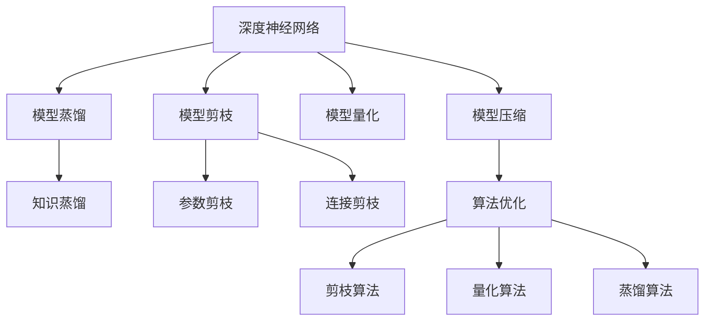

                 

# 模型剪枝技术：在精度与效率间寻找平衡

## 1. 背景介绍

### 1.1 问题由来
在深度学习领域，模型剪枝（Pruning）技术作为一种重要的模型压缩方法，广泛应用于各种深度神经网络。模型剪枝不仅能够减少模型参数，降低内存和计算开销，同时还能提升模型性能，缩短推理时间。这对于移动端、嵌入式等资源受限设备尤为重要。

然而，由于深度学习模型的复杂性和非线性特性，使得模型剪枝过程难以简单直接地进行，需要兼顾模型精度和效率的平衡。模型剪枝的关键在于如何通过删除冗余的参数和连接，在不显著降低模型精度的同时，大幅度减小模型规模。

### 1.2 问题核心关键点
模型剪枝的核心问题包括：
- 如何定义模型剪枝的标准。常见的方法有基于稀疏性、基于压缩率、基于性能等。
- 如何高效地搜索剪枝方案。常见的搜索算法包括正则化、梯度下降、梯度增加等。
- 如何保持剪枝后的模型性能。常用的方法包括剪枝后微调、剪枝与微调联合训练等。

本文将重点探讨模型剪枝的基本原理、关键步骤及应用实践，通过一系列案例分析，阐述模型剪枝在模型压缩、推理加速等方面的实际应用，并展望未来发展方向。

## 2. 核心概念与联系

### 2.1 核心概念概述

为更好地理解模型剪枝，本节将介绍几个密切相关的核心概念：

- 深度神经网络(Deep Neural Network, DNN)：由多层神经元组成的复杂计算模型，用于解决各种复杂问题。
- 模型压缩(Model Compression)：通过减小深度神经网络的参数规模，降低计算和存储需求，提升模型性能和效率。
- 模型剪枝(Pruning)：通过删除冗余的神经元或连接，减少模型参数量，提升计算和存储效率。
- 模型量化(Model Quantization)：通过将浮点数参数转换为固定精度的整数参数，减少计算资源消耗。
- 模型蒸馏(Model Distillation)：通过教师-学生的方式，将复杂模型学到的知识传递给简单模型，提升小模型的性能。
- 知识蒸馏(Knowledge Distillation)：一种特定的模型蒸馏方法，通过将复杂模型的预测结果作为教师模型，训练简单的学生模型。

这些概念之间的逻辑关系可以通过以下Mermaid流程图来展示：



这个流程图展示了这个模型压缩过程的各个关键环节及其相互关系：

1. 深度神经网络是压缩过程的起点。
2. 模型压缩是减小模型规模的过程，包括剪枝、量化等。
3. 模型剪枝是压缩过程中的重要步骤，包括参数剪枝和连接剪枝。
4. 参数剪枝和连接剪枝是模型剪枝的具体方法。
5. 模型量化则是将浮点数参数转换为固定精度的整数参数，进一步减小模型规模。
6. 模型蒸馏则是通过将复杂模型的知识传递给简单模型来提升性能。
7. 知识蒸馏是模型蒸馏的一种特殊形式，通过教师模型的预测结果指导学生模型的训练。

这些概念共同构成了模型压缩的全过程，使其能够高效地减小模型规模，提升模型性能和效率。

## 3. 核心算法原理 & 具体操作步骤
### 3.1 算法原理概述

模型剪枝的总体目标是通过删除网络中冗余的参数和连接，在不显著降低模型精度的前提下，大幅度减少模型规模，提升模型性能和效率。具体来说，模型剪枝可以分为两个阶段：搜索阶段和验证阶段。

1. **搜索阶段**：在这一阶段，我们通过各种剪枝算法和评估准则，搜索最优的剪枝方案。常见的剪枝算法包括基于稀疏性的L1正则化、基于压缩率的梯度下降、基于性能的遗传算法等。
2. **验证阶段**：在得到剪枝方案后，我们需要对其进行验证，以确保剪枝后的模型性能和精度不显著下降。常见的验证方法包括剪枝后微调和剪枝与微调联合训练。

### 3.2 算法步骤详解

以下是模型剪枝的详细步骤：

1. **数据准备**：准备训练数据集，并对其进行预处理，确保数据格式和模型输入一致。

2. **模型加载**：加载预训练模型，可以采用深度学习框架中的高级接口，如TensorFlow、PyTorch等。

3. **定义剪枝策略**：根据应用场景，选择合适的剪枝策略。例如，对于图像分类任务，可以选择参数剪枝，对于语音识别任务，可以选择连接剪枝。

4. **搜索剪枝方案**：通过搜索算法找到最优的剪枝方案。常见的搜索算法包括：
   - L1正则化：通过对模型参数进行稀疏性约束，剔除权重较小的参数。
   - 梯度下降：通过对模型参数的梯度进行排序，剔除梯度较低的参数。
   - 遗传算法：通过模拟自然选择过程，逐步优化剪枝方案。

5. **验证剪枝效果**：通过在验证集上评估剪枝后的模型性能，确保模型精度不显著下降。常用的评估指标包括准确率、召回率、F1-score等。

6. **微调剪枝后的模型**：通过在训练集上微调剪枝后的模型，进一步提升模型精度。微调过程可以采用学习率调整、正则化等策略。

7. **输出剪枝后的模型**：将微调后的剪枝模型导出，可以用于实际应用中的推理加速。

### 3.3 算法优缺点

模型剪枝方法具有以下优点：
1. 减少计算资源和存储需求：通过剪枝，大幅度减小模型参数和连接，可以显著降低计算和存储开销。
2. 提升模型性能和效率：减少的参数和连接使得模型更加轻量级，推理速度加快，适用于移动端、嵌入式设备等资源受限环境。
3. 降低模型复杂度：通过剪枝，可以降低模型的非线性复杂度，有助于模型解释和可解释性提升。

同时，该方法也存在以下局限性：
1. 可能导致模型精度下降：剪枝可能会移除一些对模型精度有重要影响的参数或连接，导致模型性能下降。
2. 剪枝过程复杂：剪枝需要搜索最优方案，计算量大，时间复杂度高。
3. 依赖剪枝策略：不同的剪枝策略可能会产生不同的效果，需要根据具体任务和数据进行调整。

尽管存在这些局限性，但就目前而言，模型剪枝是深度学习模型压缩的重要手段，通过合理的应用可以显著提升模型性能和效率。

### 3.4 算法应用领域

模型剪枝技术在深度学习中得到广泛应用，主要应用于以下几个领域：

- **图像分类**：通过剪枝，减少卷积神经网络(CNN)中的冗余参数，提升分类精度和推理速度。例如，MobileNet、SqueezeNet等轻量级模型就是基于剪枝技术实现的。
- **语音识别**：通过剪枝，减少循环神经网络(RNN)中的冗余连接，提升语音识别准确率。例如，Google的DeepSpeech和百度的AISHELL-1模型都采用了剪枝技术。
- **自然语言处理**：通过剪枝，减少Transformer模型中的冗余参数和连接，提升模型推理速度和准确率。例如，BERT-Lite和TinyBERT就是基于剪枝技术实现的小模型。
- **推荐系统**：通过剪枝，减少深度神经网络中的冗余参数，提升推荐系统性能和效率。例如，Netflix和Amazon都采用了剪枝技术优化推荐算法。
- **医疗影像**：通过剪枝，减少卷积神经网络中的冗余参数，提升医疗影像分类和诊断的准确率。例如，医学影像分类和分割任务中广泛应用了剪枝技术。

## 4. 数学模型和公式 & 详细讲解  
### 4.1 数学模型构建

假设原始模型为 $\mathcal{M}(\mathbf{W})$，其中 $\mathbf{W}$ 为模型参数。假设剪枝后的模型为 $\mathcal{M}_{pruned}(\mathbf{W}_{pruned})$，其中 $\mathbf{W}_{pruned}$ 为剪枝后的参数。剪枝的目标是找到 $\mathbf{W}_{pruned}$，使得模型精度损失最小。

我们通常通过最小化模型在验证集上的损失函数 $\mathcal{L}$ 来实现剪枝。即：

$$
\mathbf{W}_{pruned} = \mathop{\arg\min}_{\mathbf{W}} \mathcal{L}(\mathcal{M}_{pruned}(\mathbf{W}_{pruned}), D_{val})
$$

其中 $D_{val}$ 为验证集数据。

### 4.2 公式推导过程

对于参数剪枝，我们通常采用L1正则化来约束模型参数的稀疏性。设剪枝阈值为 $\lambda$，则剪枝后的参数 $\mathbf{W}_{pruned}$ 应满足：

$$
\mathbf{W}_{pruned} = \mathbf{W} \cdot \text{mask}
$$

其中 $\text{mask}$ 为二进制掩码，表示参数是否保留。

通过L1正则化的方式，我们可以将约束条件转化为：

$$
\text{mask} = \begin{cases}
0 & \text{if } \lVert \mathbf{W}_i \rVert_1 \leq \lambda \\
1 & \text{if } \lVert \mathbf{W}_i \rVert_1 > \lambda
\end{cases}
$$

对于连接剪枝，我们通常采用梯度下降法来寻找最优的剪枝方案。假设模型输出层有 $n$ 个神经元，剪枝前后神经元的连接权重分别为 $\mathbf{A}$ 和 $\mathbf{A}_{pruned}$，则剪枝的目标可以表示为：

$$
\mathbf{A}_{pruned} = \mathbf{A} \cdot \text{mask}
$$

其中 $\text{mask}$ 为二进制掩码，表示连接是否保留。

通过梯度下降法，我们可以将约束条件转化为：

$$
\text{mask} = \begin{cases}
0 & \text{if } \lVert \mathbf{A}_i \rVert_2 \leq \lambda \\
1 & \text{if } \lVert \mathbf{A}_i \rVert_2 > \lambda
\end{cases}
$$

在得到剪枝方案后，我们需要在验证集上评估剪枝后的模型性能。常用的评估指标包括准确率、召回率、F1-score等。通过在训练集上微调剪枝后的模型，可以进一步提升模型精度。常用的微调方法包括学习率调整、正则化等策略。

### 4.3 案例分析与讲解

下面以图像分类任务为例，详细讲解基于L1正则化的参数剪枝方法。

假设原始模型为卷积神经网络，其输出层参数为 $\mathbf{W} \in \mathbb{R}^{1024 \times 1000}$，其中 $1024$ 为输出神经元数量，$1000$ 为类别数量。我们希望剪枝后的模型参数数量为 $512$，即 $\lVert \mathbf{W} \rVert_1 \leq 512$。

具体步骤如下：

1. **加载原始模型**：加载卷积神经网络模型，并随机初始化权重。

2. **定义剪枝阈值**：根据实际应用需求，设置剪枝阈值 $\lambda = 512$。

3. **计算L1范数**：计算每个输出神经元的L1范数，即 $\lVert \mathbf{W}_i \rVert_1$。

4. **生成掩码**：根据L1范数，生成二进制掩码 $\text{mask}$，保留权重大于阈值的参数。

5. **更新参数**：将原始参数 $\mathbf{W}$ 与掩码 $\text{mask}$ 相乘，得到剪枝后的参数 $\mathbf{W}_{pruned}$。

6. **微调剪枝后的模型**：在训练集上微调剪枝后的模型，提升模型精度。

7. **输出剪枝后的模型**：将微调后的剪枝模型导出，可以用于实际应用中的推理加速。

## 5. 项目实践：代码实例和详细解释说明
### 5.1 开发环境搭建

在进行模型剪枝实践前，我们需要准备好开发环境。以下是使用Python进行TensorFlow开发的环境配置流程：

1. 安装Anaconda：从官网下载并安装Anaconda，用于创建独立的Python环境。

2. 创建并激活虚拟环境：
```bash
conda create -n tf-env python=3.8 
conda activate tf-env
```

3. 安装TensorFlow：
```bash
pip install tensorflow==2.7
```

4. 安装各类工具包：
```bash
pip install numpy pandas scikit-learn matplotlib tqdm jupyter notebook ipython
```

完成上述步骤后，即可在`tf-env`环境中开始模型剪枝实践。

### 5.2 源代码详细实现

下面我们以卷积神经网络为例，给出使用TensorFlow实现基于L1正则化的参数剪枝的代码实现。

```python
import tensorflow as tf
import numpy as np
import matplotlib.pyplot as plt

# 加载模型
model = tf.keras.models.load_model('cnn_model.h5')

# 计算每个神经元的L1范数
L1_norms = np.linalg.norm(model.get_weights()[-1], axis=0)

# 生成掩码
mask = L1_norms <= 512

# 更新参数
model.get_weights()[-1] = model.get_weights()[-1] * mask

# 微调模型
model.compile(optimizer=tf.keras.optimizers.Adam(learning_rate=0.001), loss=tf.keras.losses.SparseCategoricalCrossentropy(), metrics=['accuracy'])
model.fit(x_train, y_train, epochs=10, batch_size=32)

# 输出剪枝后的模型
model.save('cnn_pruned_model.h5')
```

以上代码展示了使用TensorFlow进行参数剪枝的基本流程：

1. 加载原始模型。
2. 计算每个输出神经元的L1范数。
3. 生成掩码，保留权重小于等于阈值的参数。
4. 更新参数，实现剪枝。
5. 微调剪枝后的模型，提升模型精度。
6. 导出剪枝后的模型，可以用于实际应用中的推理加速。

### 5.3 代码解读与分析

让我们再详细解读一下关键代码的实现细节：

**加载模型**：
```python
model = tf.keras.models.load_model('cnn_model.h5')
```
通过`load_model`方法加载预训练的卷积神经网络模型。

**计算L1范数**：
```python
L1_norms = np.linalg.norm(model.get_weights()[-1], axis=0)
```
计算模型输出层的每个神经元的L1范数。

**生成掩码**：
```python
mask = L1_norms <= 512
```
根据L1范数生成二进制掩码，保留权重小于等于阈值的参数。

**更新参数**：
```python
model.get_weights()[-1] = model.get_weights()[-1] * mask
```
将原始参数与掩码相乘，实现参数剪枝。

**微调模型**：
```python
model.compile(optimizer=tf.keras.optimizers.Adam(learning_rate=0.001), loss=tf.keras.losses.SparseCategoricalCrossentropy(), metrics=['accuracy'])
model.fit(x_train, y_train, epochs=10, batch_size=32)
```
在训练集上微调剪枝后的模型，提升模型精度。

**输出剪枝后的模型**：
```python
model.save('cnn_pruned_model.h5')
```
将微调后的剪枝模型导出，可以用于实际应用中的推理加速。

## 6. 实际应用场景
### 6.1 移动设备推理加速

模型剪枝技术在移动设备上有着广泛的应用场景。由于移动设备的计算和存储资源有限，无法支持大模型的运行。通过剪枝技术，可以显著减小模型规模，降低计算和存储开销，使得大模型能够在手机、平板等设备上高效运行。例如，Google的MobileNet系列模型就是基于剪枝技术实现的。

### 6.2 嵌入式系统应用

嵌入式系统通常具有资源受限的特点，无法支持大模型的部署。通过剪枝技术，可以进一步减小模型规模，使得深度学习模型能够在嵌入式设备上高效运行。例如，物联网(IoT)设备、智能家居等场景中广泛应用了剪枝技术。

### 6.3 医疗影像分析

医疗影像分类和分割任务需要处理大量高分辨率图像，计算开销大，存储需求高。通过剪枝技术，可以大幅度减小模型规模，提升分类和分割的效率。例如，医学影像分类和分割任务中广泛应用了剪枝技术。

### 6.4 工业控制

工业控制领域需要实时处理大量传感器数据，计算和存储需求高。通过剪枝技术，可以减小模型规模，提升推理速度和响应速度，使得模型能够在工业控制设备上高效运行。例如，智能制造、智慧交通等场景中广泛应用了剪枝技术。

## 7. 工具和资源推荐
### 7.1 学习资源推荐

为了帮助开发者系统掌握模型剪枝的理论基础和实践技巧，这里推荐一些优质的学习资源：

1. 《深度学习基础》系列博文：由大模型技术专家撰写，详细介绍了深度学习的基本概念和前沿技术。

2. TensorFlow官方文档：TensorFlow的官方文档，提供了丰富的深度学习资源和样例代码，是快速上手TensorFlow的重要参考资料。

3. 《深度学习入门：基于TensorFlow 2.0的实战》书籍：该书详细介绍了TensorFlow 2.0的使用方法，并结合实际应用案例进行讲解，适合初学者和进阶开发者。

4. PyTorch官方文档：PyTorch的官方文档，提供了丰富的深度学习资源和样例代码，是快速上手PyTorch的重要参考资料。

5. 《动手学深度学习》书籍：该书由深度学习领域的知名学者编写，全面介绍了深度学习的理论基础和实际应用，适合入门和进阶开发者。

通过对这些资源的学习实践，相信你一定能够快速掌握模型剪枝的精髓，并用于解决实际的深度学习问题。

### 7.2 开发工具推荐

高效的开发离不开优秀的工具支持。以下是几款用于模型剪枝开发的常用工具：

1. TensorFlow：由Google主导开发的开源深度学习框架，支持丰富的深度学习模型和剪枝技术。

2. PyTorch：由Facebook主导开发的开源深度学习框架，支持灵活的动态计算图，适合快速迭代研究。

3. Keras：高层次的深度学习框架，提供简单易用的API，适合快速搭建深度学习模型。

4. ONNX：Open Neural Network Exchange，提供模型转换和优化工具，支持多种深度学习框架和硬件平台。

5. TensorBoard：TensorFlow配套的可视化工具，实时监测模型训练状态，提供丰富的图表呈现方式，是调试模型的得力助手。

6. Weights & Biases：模型训练的实验跟踪工具，可以记录和可视化模型训练过程中的各项指标，方便对比和调优。

合理利用这些工具，可以显著提升模型剪枝任务的开发效率，加快创新迭代的步伐。

### 7.3 相关论文推荐

模型剪枝技术的发展源于学界的持续研究。以下是几篇奠基性的相关论文，推荐阅读：

1. 《Learning Both Weights and Connections for Efficient Neural Network》：提出网络剪枝的基准方法，通过稀疏性约束剪枝神经网络，显著减少模型参数和计算开销。

2. 《Weight Pruning: A Critical Review and New Insights》：综述了网络剪枝的方法和技术，提出了多个剪枝策略和评估准则。

3. 《A Survey of Knowledge Distillation》：综述了知识蒸馏的方法和技术，提出了多个蒸馏策略和评估准则。

4. 《Pruning Neural Networks by Geometric Median for Super-Resolution Image Reconstruction》：提出使用几何中位数进行剪枝，提升了超分辨率图像重建的精度和效率。

5. 《Pruning Deep Neural Networks for Efficient Inference》：提出使用剪枝技术进行深度神经网络压缩，显著提升推理速度和资源利用率。

这些论文代表了大模型剪枝技术的发展脉络。通过学习这些前沿成果，可以帮助研究者把握学科前进方向，激发更多的创新灵感。

## 8. 总结：未来发展趋势与挑战
### 8.1 总结

本文对模型剪枝技术进行了全面系统的介绍。首先阐述了模型剪枝的基本原理和应用场景，明确了剪枝在模型压缩、推理加速等方面的重要价值。其次，从原理到实践，详细讲解了模型剪枝的数学模型和关键步骤，给出了剪枝任务开发的完整代码实例。同时，本文还广泛探讨了模型剪枝在移动设备、嵌入式系统、医疗影像、工业控制等多个行业领域的应用前景，展示了模型剪枝的广泛适用性和巨大潜力。

通过本文的系统梳理，可以看到，模型剪枝技术正在成为深度学习模型压缩的重要手段，极大地提升了模型性能和效率。未来，伴随深度学习模型的不断演进，模型剪枝技术也将不断发展和完善，为模型压缩、推理加速等领域带来新的突破。

### 8.2 未来发展趋势

展望未来，模型剪枝技术将呈现以下几个发展趋势：

1. **更高效的网络剪枝算法**：未来的剪枝算法将更加高效，能够在大规模深度神经网络中进行快速搜索和优化。

2. **更精准的剪枝评估准则**：未来的剪枝评估准则将更加精准，能够更好地衡量剪枝后的模型性能和精度损失。

3. **更智能的剪枝决策**：未来的剪枝决策将更加智能，能够通过多目标优化算法，同时考虑模型性能、计算资源、存储需求等多方面因素。

4. **更广泛的剪枝应用**：未来的剪枝技术将应用于更多领域，如视频分析、音频处理、自然语言处理等，提升多模态深度学习的性能和效率。

5. **更全面的剪枝方法**：未来的剪枝方法将更加全面，结合稀疏性约束、正则化、量化等技术，实现更优的模型压缩效果。

以上趋势凸显了模型剪枝技术的广阔前景。这些方向的探索发展，必将进一步提升深度学习模型的性能和效率，为更广泛的应用场景提供支持。

### 8.3 面临的挑战

尽管模型剪枝技术已经取得了显著进展，但在应用过程中仍面临诸多挑战：

1. **模型精度下降**：剪枝可能会导致模型精度下降，特别是在剪枝强度较大的情况下。如何通过剪枝策略和剪枝后微调，确保剪枝后的模型性能不显著下降，是剪枝技术面临的一大挑战。

2. **剪枝过程复杂**：剪枝过程复杂，需要搜索最优剪枝方案，计算量大，时间复杂度高。如何提升剪枝算法效率，是剪枝技术面临的一大难题。

3. **剪枝策略依赖**：不同的剪枝策略可能会产生不同的效果，需要根据具体任务和数据进行调整。如何设计通用的剪枝策略，适用于不同类型的深度神经网络，是剪枝技术面临的一大挑战。

4. **资源优化不足**：现有的剪枝方法主要聚焦于模型压缩，对计算和存储资源优化不足。如何结合量化、蒸馏等技术，实现更高效的资源利用，是剪枝技术面临的一大挑战。

5. **模型鲁棒性不足**：剪枝后的模型面对域外数据时，泛化性能往往下降。如何提高剪枝后模型的鲁棒性，避免过拟合和灾难性遗忘，是剪枝技术面临的一大挑战。

6. **剪枝应用局限**：现有的剪枝技术主要应用于图像分类、语音识别等任务，对于自然语言处理、推荐系统等领域的应用较为有限。如何拓展剪枝技术的应用范围，是剪枝技术面临的一大挑战。

正视模型剪枝面临的这些挑战，积极应对并寻求突破，将使模型剪枝技术走向成熟，为深度学习模型压缩和推理加速等领域带来新的突破。相信随着学界和产业界的共同努力，这些挑战终将一一被克服，模型剪枝技术必将引领深度学习模型压缩的新一轮革命。

### 8.4 研究展望

面向未来，模型剪枝技术需要在以下几个方面寻求新的突破：

1. **探索更高效的剪枝算法**：研究更高效的剪枝算法，如基于稀疏性约束的剪枝、基于性能优化的剪枝等，提升剪枝过程的效率和效果。

2. **引入更多先验知识**：将符号化的先验知识，如知识图谱、逻辑规则等，与神经网络模型进行巧妙融合，引导剪枝过程学习更准确、合理的模型。

3. **结合量化和蒸馏技术**：结合量化和蒸馏技术，实现更优的模型压缩效果，提升剪枝后模型的精度和效率。

4. **引入动态剪枝机制**：引入动态剪枝机制，在模型使用过程中根据实时情况进行剪枝，保持模型的适应性和鲁棒性。

5. **拓展剪枝应用范围**：拓展剪枝技术的应用范围，应用于更多领域，如自然语言处理、推荐系统、智能控制等，提升多模态深度学习的性能和效率。

6. **引入智能剪枝决策**：引入智能剪枝决策，结合多目标优化算法，同时考虑模型性能、计算资源、存储需求等多方面因素，提升剪枝决策的科学性和合理性。

这些研究方向将引领模型剪枝技术迈向更高的台阶，为深度学习模型压缩和推理加速等领域带来新的突破。只有勇于创新、敢于突破，才能不断拓展模型剪枝的边界，让深度学习技术更好地造福人类社会。

## 9. 附录：常见问题与解答

**Q1：剪枝后的模型精度如何评估？**

A: 剪枝后的模型精度可以通过以下方法进行评估：
1. 使用验证集对剪枝后的模型进行评估，计算模型在验证集上的准确率、召回率、F1-score等指标。
2. 在测试集上评估剪枝后的模型性能，确保剪枝后的模型在真实场景中仍能保持较高的精度。
3. 进行剪枝后微调，通过在训练集上微调剪枝后的模型，进一步提升模型精度。

**Q2：剪枝过程中如何处理模型参数的不平衡问题？**

A: 剪枝过程中，模型参数的不平衡问题可能会导致某些神经元或连接的权重过高或过低，从而影响剪枝效果。可以采用以下方法处理：
1. 进行标准化处理，将模型参数缩放到[0,1]范围内，减少参数的不平衡性。
2. 采用动态剪枝机制，根据实时情况进行剪枝，确保模型参数的平衡性。
3. 结合正则化技术，如L1、L2正则化，限制模型参数的稀疏性，避免剪枝后的模型出现不平衡问题。

**Q3：剪枝后模型如何优化推理速度？**

A: 剪枝后的模型可以通过以下方法优化推理速度：
1. 使用量化技术，将浮点数参数转换为固定精度的整数参数，减少计算资源消耗。
2. 结合优化编译器，对剪枝后的模型进行优化编译，提高推理速度。
3. 使用硬件加速，如GPU、FPGA等，提升模型的并行计算能力。
4. 优化模型结构，减少冗余的计算和存储操作，提高推理速度。

**Q4：剪枝技术在模型压缩中有哪些优势？**

A: 剪枝技术在模型压缩中具有以下优势：
1. 减少模型参数和计算资源，降低存储和计算开销。
2. 提升模型推理速度，加速模型在移动设备、嵌入式系统等资源受限设备上的应用。
3. 提高模型泛化性能，避免模型过拟合和灾难性遗忘。
4. 增强模型的解释性，提高模型的可解释性和可控性。
5. 提升模型鲁棒性，提高模型对噪声、干扰的抵抗能力。

这些优势使得剪枝技术成为深度学习模型压缩的重要手段，能够提升模型的性能和效率，满足实际应用的需求。

**Q5：剪枝技术在模型蒸馏中的应用有哪些？**

A: 剪枝技术在模型蒸馏中的应用有以下几种：
1. 通过剪枝技术减小教师模型的参数规模，提高模型蒸馏的效率。
2. 通过剪枝技术提高学生模型的泛化性能，减小知识蒸馏的风险。
3. 结合剪枝和量化技术，进一步优化知识蒸馏过程，提升学生模型的性能和效率。
4. 通过剪枝技术提高知识蒸馏的精度，减少知识蒸馏中的信息损失。

剪枝技术在模型蒸馏中的应用，能够提升模型蒸馏的效率和效果，加速知识传递和模型压缩。

---

作者：禅与计算机程序设计艺术 / Zen and the Art of Computer Programming

