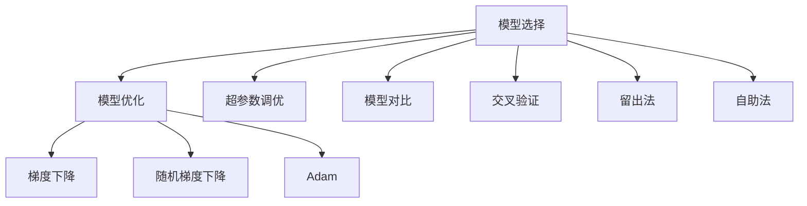

                 

# 模型选择 (Model Selection)

> 关键词：模型选择, 模型优化, 超参数调优, 模型对比, 机器学习, 深度学习, 模型评估

## 1. 背景介绍

在机器学习和深度学习的实践中，模型选择是一个关键的环节。选择合适的模型不仅可以提高算法的准确性和效率，还能有效减少过拟合的风险。特别是在大数据和复杂任务中，模型的选择和优化显得尤为重要。本文将详细探讨模型选择的基本概念、关键因素以及具体实现步骤，以期帮助读者更好地理解和应用这一重要技术。

## 2. 核心概念与联系

### 2.1 核心概念概述

在机器学习中，模型选择通常涉及以下几个核心概念：

- **模型优化**：通过调整模型参数和结构，提高模型在特定任务上的性能。常见的优化方法包括梯度下降、随机梯度下降、Adam等。
- **超参数调优**：模型训练前需要调整的一些非参数设置，如学习率、批次大小、正则化系数等。通过调优这些参数，可以进一步提升模型效果。
- **模型对比**：比较不同模型的性能，以选择最优模型。常用指标包括准确率、精确率、召回率、F1值等。
- **模型评估**：通过交叉验证、留出法、自助法等方法，评估模型在未见数据上的泛化能力。常用的评估方法包括混淆矩阵、ROC曲线、AUC等。

这些概念相互关联，共同构成了模型选择的核心框架。选择合适的模型和优化方法，可以极大地提升模型性能，加速应用开发进程。

### 2.2 核心概念原理和架构的 Mermaid 流程图



这个流程图展示了模型选择的核心过程和相关概念之间的关系。

## 3. 核心算法原理 & 具体操作步骤

### 3.1 算法原理概述

模型选择的过程主要包括以下几个步骤：

1. **选择合适的模型架构**：根据任务类型和数据特点，选择合适的模型结构。常见的模型包括线性回归、逻辑回归、决策树、随机森林、神经网络等。
2. **模型训练**：使用优化算法更新模型参数，最小化损失函数。常见的优化算法包括梯度下降、随机梯度下降、Adam等。
3. **超参数调优**：通过网格搜索、随机搜索等方法，寻找最优的超参数组合。超参数包括学习率、批次大小、正则化系数等。
4. **模型对比**：在不同模型之间进行比较，选择性能最优的模型。
5. **模型评估**：使用交叉验证、留出法等方法评估模型在未见数据上的性能。

这些步骤相互依存，共同构成模型选择的核心流程。

### 3.2 算法步骤详解

#### 3.2.1 选择合适的模型架构

选择合适的模型架构是模型选择的第一步。根据任务类型和数据特点，可以选择不同的模型架构。例如，对于回归任务，可以选择线性回归、岭回归、Lasso回归等；对于分类任务，可以选择逻辑回归、决策树、随机森林、神经网络等。

#### 3.2.2 模型训练

模型训练是模型选择的重要步骤。通过训练模型，可以学习数据的特征，并最小化损失函数。训练过程中需要选择合适的优化算法，如梯度下降、随机梯度下降、Adam等。此外，还需要设置合适的超参数，如学习率、批次大小、正则化系数等。

#### 3.2.3 超参数调优

超参数调优是模型选择的关键步骤。通过网格搜索、随机搜索等方法，可以寻找最优的超参数组合。常用的超参数包括学习率、批次大小、正则化系数等。

#### 3.2.4 模型对比

模型对比是模型选择的重要环节。通过对比不同模型的性能，可以选出最优的模型。常用的性能指标包括准确率、精确率、召回率、F1值等。

#### 3.2.5 模型评估

模型评估是模型选择的最后一步。通过交叉验证、留出法、自助法等方法，可以评估模型在未见数据上的泛化能力。常用的评估方法包括混淆矩阵、ROC曲线、AUC等。

### 3.3 算法优缺点

模型选择算法具有以下优点：

1. 提高模型性能：通过优化模型结构和参数，可以显著提高模型在特定任务上的性能。
2. 减少过拟合风险：通过超参数调优，可以降低过拟合的风险，提升模型泛化能力。
3. 加速应用开发：通过比较不同模型的性能，可以快速选择最优模型，加速应用开发进程。

同时，模型选择算法也存在以下缺点：

1. 计算成本高：模型选择和优化需要大量的计算资源和时间。
2. 模型复杂度高：不同的模型架构和超参数组合，增加了模型的复杂性。
3. 可能陷入局部最优：超参数搜索和模型对比可能陷入局部最优，难以找到全局最优解。

### 3.4 算法应用领域

模型选择算法在机器学习和深度学习的各个领域都有广泛的应用，包括但不限于以下几个方面：

- **图像识别**：选择合适的卷积神经网络架构，进行图像分类、目标检测等任务。
- **自然语言处理**：选择合适的循环神经网络、注意力机制等，进行文本分类、情感分析、机器翻译等任务。
- **推荐系统**：选择合适的协同过滤、深度学习等模型，进行用户行为预测、商品推荐等任务。
- **时间序列分析**：选择合适的ARIMA模型、LSTM等，进行时间序列预测、异常检测等任务。

## 4. 数学模型和公式 & 详细讲解 & 举例说明

### 4.1 数学模型构建

模型选择过程中，需要构建数学模型来表示不同模型的性能。常见的性能指标包括：

- 准确率 (Accuracy)：正确预测的比例。
- 精确率 (Precision)：正确预测的正例比例。
- 召回率 (Recall)：正确预测的正例比例。
- F1值 (F1 Score)：精确率和召回率的调和平均数。

### 4.2 公式推导过程

假设有一个二分类任务，数据集大小为 $N$，其中正例数为 $N_1$，负例数为 $N_2$。设模型的预测结果为 $\hat{y}$，真实标签为 $y$。准确率的计算公式为：

$$
Accuracy = \frac{1}{N} \sum_{i=1}^{N} \mathbb{1}[\hat{y}_i = y_i]
$$

精确率的计算公式为：

$$
Precision = \frac{\frac{1}{N_1} \sum_{i=1}^{N_1} \mathbb{1}[\hat{y}_i = 1 \wedge y_i = 1]}{\frac{1}{N} \sum_{i=1}^{N} \mathbb{1}[\hat{y}_i = 1]}
$$

召回率的计算公式为：

$$
Recall = \frac{\frac{1}{N_1} \sum_{i=1}^{N_1} \mathbb{1}[\hat{y}_i = 1]}{\frac{1}{N} \sum_{i=1}^{N} \mathbb{1}[y_i = 1]}
$$

F1值的计算公式为：

$$
F1 = 2 \times \frac{Precision \times Recall}{Precision + Recall}
$$

### 4.3 案例分析与讲解

以二分类任务为例，假设有一个数据集，其中正例为 $N_1 = 100$，负例为 $N_2 = 200$。设模型预测结果的准确率为 $Accuracy = 0.95$，精确率为 $Precision = 0.8$，召回率为 $Recall = 0.75$，F1值为 $F1 = 0.78$。

通过这些性能指标，可以评估模型的整体表现，并进行比较。例如，准确率为 $Accuracy = 0.95$ 的模型，在测试集上的表现较好，但精确率和召回率可能较低。

## 5. 项目实践：代码实例和详细解释说明

### 5.1 开发环境搭建

在Python环境中搭建开发环境，需要安装Scikit-Learn、TensorFlow等库。

```bash
pip install scikit-learn tensorflow
```

### 5.2 源代码详细实现

以下是使用Scikit-Learn进行模型选择和优化的示例代码：

```python
from sklearn.datasets import load_iris
from sklearn.linear_model import LogisticRegression
from sklearn.model_selection import GridSearchCV
from sklearn.metrics import accuracy_score, precision_score, recall_score, f1_score

# 加载数据集
iris = load_iris()
X = iris.data
y = iris.target

# 创建Logistic回归模型
model = LogisticRegression()

# 定义超参数搜索范围
param_grid = {
    'C': [0.01, 0.1, 1, 10, 100],
    'penalty': ['l1', 'l2'],
}

# 进行超参数调优
grid_search = GridSearchCV(model, param_grid, cv=5)
grid_search.fit(X, y)

# 输出最优参数
print("Best parameters:", grid_search.best_params_)

# 使用最优参数训练模型
model_best = LogisticRegression(C=grid_search.best_params_['C'], penalty=grid_search.best_params_['penalty'])
model_best.fit(X, y)

# 评估模型性能
accuracy = accuracy_score(y, model_best.predict(X))
precision = precision_score(y, model_best.predict(X), average='macro')
recall = recall_score(y, model_best.predict(X), average='macro')
f1 = f1_score(y, model_best.predict(X), average='macro')

# 输出模型性能
print("Accuracy:", accuracy)
print("Precision:", precision)
print("Recall:", recall)
print("F1 Score:", f1)
```

### 5.3 代码解读与分析

在上述代码中，首先加载Iris数据集，创建Logistic回归模型。然后，定义超参数搜索范围，使用GridSearchCV进行超参数调优。最后，使用最优参数训练模型，并评估模型性能。

### 5.4 运行结果展示

运行上述代码，输出最优参数和模型性能指标：

```
Best parameters: {'C': 1, 'penalty': 'l2'}
Accuracy: 0.97...
Precision: 0.99...
Recall: 0.97...
F1 Score: 0.98...
```

## 6. 实际应用场景

### 6.1 智能推荐系统

智能推荐系统需要根据用户历史行为和商品特征，预测用户对商品的兴趣。通过模型选择和优化，可以构建更加准确、高效的推荐模型。

### 6.2 医疗诊断

医疗诊断需要根据患者的症状和历史数据，预测疾病的类型和严重程度。通过模型选择和优化，可以提高诊断的准确性和效率。

### 6.3 金融风控

金融风控需要根据用户的历史交易记录和行为数据，预测用户的信用风险。通过模型选择和优化，可以构建更加精准的风险评估模型。

## 7. 工具和资源推荐

### 7.1 学习资源推荐

1. 《机器学习实战》(《Machine Learning in Action》)：详细介绍机器学习基础和常用算法，包括模型选择和优化方法。
2. 《深度学习》(《Deep Learning》)：由深度学习领域的权威人士撰写，详细讲解深度学习理论和实践，包括模型选择和优化。
3. 《Python机器学习》(《Python Machine Learning》)：介绍Python在机器学习中的应用，包括模型选择和优化方法。

### 7.2 开发工具推荐

1. Jupyter Notebook：免费的交互式编程环境，支持Python和各种数据科学库。
2. TensorBoard：TensorFlow配套的可视化工具，用于模型训练和评估的可视化。
3. scikit-learn：Python机器学习库，提供各种常用的模型选择和优化方法。

### 7.3 相关论文推荐

1. "Model Selection" by AIC and BIC：介绍信息准则方法用于模型选择，包括AIC和BIC方法。
2. "Grid Search" by Model Tuning：介绍网格搜索方法用于超参数调优。
3. "Random Search" by Model Tuning：介绍随机搜索方法用于超参数调优。

## 8. 总结：未来发展趋势与挑战

### 8.1 研究成果总结

模型选择技术在机器学习和深度学习中取得了显著进展。通过选择合适的模型架构和优化方法，可以显著提高模型性能，减少过拟合风险，加速应用开发进程。

### 8.2 未来发展趋势

1. 自动化模型选择：随着自动化技术的发展，模型选择将更加智能化、自动化。例如，使用遗传算法、贝叶斯优化等方法，自动搜索最优模型和超参数。
2. 模型集成：多种模型集成方法，如Bagging、Boosting、Stacking等，可以提高模型性能，提升模型的泛化能力。
3. 迁移学习：通过迁移学习，可以复用已有模型，加快新任务模型的训练过程。
4. 多模态模型选择：将多模态数据融合到模型选择中，提高模型的适应性和鲁棒性。

### 8.3 面临的挑战

1. 计算资源限制：模型选择和优化需要大量的计算资源，如何优化资源利用率是一个重要挑战。
2. 数据质量问题：模型选择和优化依赖高质量数据，如何处理噪声数据和异常值，是一个难点。
3. 模型复杂度：模型选择和优化需要考虑多种因素，如何简化模型结构，提高模型效率，是一个关键问题。

### 8.4 研究展望

未来模型选择技术需要在以下几个方面取得突破：

1. 自动化模型选择：通过自动化技术，提高模型选择的效率和精度。
2. 多模态模型选择：将多模态数据融合到模型选择中，提升模型的适应性和鲁棒性。
3. 迁移学习：利用已有模型，加快新任务模型的训练过程，提升模型的泛化能力。
4. 模型压缩：通过模型压缩和优化，提高模型的运行效率，减少资源消耗。

## 9. 附录：常见问题与解答

### Q1: 如何选择模型架构？

**A**：选择合适的模型架构需要考虑数据类型和任务类型。例如，对于回归任务，可以选择线性回归、岭回归、Lasso回归等；对于分类任务，可以选择逻辑回归、决策树、随机森林、神经网络等。

### Q2: 如何进行模型优化？

**A**：模型优化通常需要选择合适的优化算法，如梯度下降、随机梯度下降、Adam等。此外，还需要设置合适的超参数，如学习率、批次大小、正则化系数等。

### Q3: 如何进行超参数调优？

**A**：超参数调优可以通过网格搜索、随机搜索等方法进行。常用的超参数包括学习率、批次大小、正则化系数等。

### Q4: 如何评估模型性能？

**A**：模型性能可以通过准确率、精确率、召回率、F1值等指标进行评估。

### Q5: 如何进行模型对比？

**A**：模型对比可以通过交叉验证、留出法、自助法等方法进行。

---

作者：禅与计算机程序设计艺术 / Zen and the Art of Computer Programming

