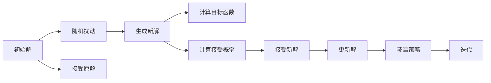

                 

# 模拟退火算法(Simulated Annealing) - 原理与代码实例讲解

> 关键词：模拟退火, 局部最优, 全局最优, 随机化, 热浴, 冷却策略, 应用领域, 代码实现

## 1. 背景介绍

### 1.1 问题由来
在求解优化问题时，我们常常面临一个困境：局部最优解往往容易陷入，而无法跳出，从而无法找到全局最优解。传统方法如穷举、梯度下降等，可能在某些问题上陷入局部最优，而无法跳出。此时，我们需要一种新的算法，能够在保持搜索效率的同时，跳出局部最优，找到全局最优。

模拟退火算法(Simulated Annealing)正是在这种背景下应运而生的。它是一种随机化算法，通过在高温状态下的随机搜索，逐渐降温，最终找到全局最优解。

### 1.2 问题核心关键点
模拟退火算法的主要核心在于以下几个关键点：
1. **初始化**：随机初始化一个解，作为搜索的起点。
2. **随机扰动**：以一定的概率随机扰动当前的解，生成一个新的解。
3. **接受概率**：根据当前解和目标解的差距，以及算法温度来决定是否接受新解。
4. **降温策略**：算法温度随时间递减，逐渐趋近于全局最优解。
5. **迭代**：不断重复随机扰动、接受概率、降温策略的循环，直到达到预定的终止条件。

模拟退火算法是一种基于物理退火过程的启发式算法，能够有效地跳出局部最优，寻找全局最优解。

## 2. 核心概念与联系

### 2.1 核心概念概述

模拟退火算法基于物理退火过程，通过随机扰动和接受概率，在高温状态下随机搜索，逐渐降温逼近全局最优解。该算法广泛应用于各种优化问题，包括组合优化、数值优化、机器学习等。

- **局部最优**：在搜索过程中，算法可能会陷入某个局部最优点，无法跳出。
- **全局最优**：在搜索过程中，算法可能会跳出局部最优，找到全局最优解。
- **随机化**：模拟退火算法的核心在于随机扰动和接受概率，通过随机化搜索避免陷入局部最优。
- **热浴**：模拟退火算法在高温状态下进行随机扰动，逐步降温，最终找到全局最优解。
- **冷却策略**：模拟退火算法的温度随时间递减，逐渐趋近于全局最优解。

这些核心概念之间存在紧密的联系，共同构成了模拟退火算法的搜索框架。通过理解和应用这些概念，我们可以更好地掌握算法的精髓。

### 2.2 核心概念原理和架构的 Mermaid 流程图



上述流程图展示了模拟退火算法的基本流程。算法从一个随机初始解开始，通过随机扰动生成新解，计算新解的目标函数值和接受概率，决定是否接受新解。如果接受，则更新解，否则返回原解。最终通过降温策略，逐渐逼近全局最优解。

## 3. 核心算法原理 & 具体操作步骤

### 3.1 算法原理概述

模拟退火算法的核心在于随机化搜索和接受概率。其基本思想是通过在高温状态下的随机扰动，逐步降温逼近全局最优解。算法的主要步骤包括初始化、随机扰动、接受概率、降温策略和迭代。

1. **初始化**：随机初始化一个解，作为搜索的起点。
2. **随机扰动**：以一定的概率随机扰动当前的解，生成一个新的解。
3. **接受概率**：根据当前解和目标解的差距，以及算法温度来决定是否接受新解。
4. **降温策略**：算法温度随时间递减，逐渐趋近于全局最优解。
5. **迭代**：不断重复随机扰动、接受概率、降温策略的循环，直到达到预定的终止条件。

### 3.2 算法步骤详解

#### 3.2.1 初始化

首先，随机初始化一个解 $x_0$，作为搜索的起点。这个解可以是任意值，但通常需要满足问题的约束条件。

#### 3.2.2 随机扰动

接下来，以一定的概率随机扰动当前的解 $x_i$，生成一个新的解 $x_{i+1}$。随机扰动的方法有多种，如随机交换、随机改变某个变量的值等。

#### 3.2.3 计算目标函数

计算新解 $x_{i+1}$ 的目标函数值 $f(x_{i+1})$，以及当前解 $x_i$ 的目标函数值 $f(x_i)$。

#### 3.2.4 计算接受概率

根据当前解和目标解的差距，以及算法温度 $\beta$，计算接受概率 $P(x_i \to x_{i+1})$。

$$
P(x_i \to x_{i+1}) = \begin{cases} 
1 & \text{if } f(x_{i+1}) < f(x_i) \\
e^{\frac{f(x_i) - f(x_{i+1})}{\beta}} & \text{if } f(x_{i+1}) \geq f(x_i)
\end{cases}
$$

其中，$e$ 为自然常数，$\beta$ 为算法温度。

#### 3.2.5 接受新解

根据接受概率 $P(x_i \to x_{i+1})$，以概率 $P(x_i \to x_{i+1})$ 接受新解 $x_{i+1}$，否则返回原解 $x_i$。

#### 3.2.6 降温策略

在每次迭代中，算法温度 $\beta$ 逐渐降温，通常使用指数衰减策略：

$$
\beta_{i+1} = \beta_i \cdot \alpha
$$

其中，$\alpha$ 为降温系数，一般取 $0.9$ 至 $0.99$ 之间。

#### 3.2.7 迭代

重复执行随机扰动、计算目标函数、计算接受概率、接受新解、降温策略的循环，直到达到预定的终止条件，如迭代次数、目标函数值等。

### 3.3 算法优缺点

#### 3.3.1 优点

1. **全局最优解**：模拟退火算法能够跳出局部最优，寻找全局最优解。
2. **随机化搜索**：通过随机扰动和接受概率，模拟退火算法能够跳出局部最优。
3. **适应性**：模拟退火算法适用于各种优化问题，包括组合优化、数值优化、机器学习等。

#### 3.3.2 缺点

1. **计算复杂度高**：模拟退火算法在高温状态下随机搜索，计算复杂度较高。
2. **局部最优概率**：模拟退火算法存在跳出局部最优的概率，无法保证一定找到全局最优解。
3. **算法参数敏感**：算法参数如初始解、随机扰动概率、降温系数等，对算法性能有较大影响。

尽管存在这些缺点，模拟退火算法仍然是一种高效的优化算法，广泛应用于各种实际问题中。

### 3.4 算法应用领域

模拟退火算法广泛应用于各种优化问题，包括：

1. **组合优化**：如旅行商问题、背包问题、最大独立集问题等。
2. **数值优化**：如最小二乘问题、非线性方程组求解等。
3. **机器学习**：如模型参数优化、特征选择等。
4. **数据挖掘**：如分类问题、聚类问题、异常检测等。
5. **生物信息学**：如序列比对、蛋白质结构预测等。

模拟退火算法在这些领域中展示了强大的应用潜力，成为求解复杂优化问题的有效手段。

## 4. 数学模型和公式 & 详细讲解 & 举例说明

### 4.1 数学模型构建

模拟退火算法通过随机扰动和接受概率，在高温状态下的随机搜索，逐步降温逼近全局最优解。其数学模型构建如下：

假设问题的解空间为 $\mathcal{X}$，初始解为 $x_0$，算法温度为 $\beta_0$，降温系数为 $\alpha$，最大迭代次数为 $n$，接受概率为 $P(x_i \to x_{i+1})$。

算法步骤如下：

1. 随机初始化解 $x_0$。
2. 计算目标函数 $f(x_0)$。
3. 循环 $n$ 次：
   - 以概率 $p$ 随机扰动解 $x_i$，生成新解 $x_{i+1}$。
   - 计算新解的目标函数 $f(x_{i+1})$。
   - 计算接受概率 $P(x_i \to x_{i+1})$。
   - 以概率 $P(x_i \to x_{i+1})$ 接受新解 $x_{i+1}$。
   - 更新当前解 $x_i = x_{i+1}$。
   - 更新算法温度 $\beta_{i+1} = \beta_i \cdot \alpha$。
4. 输出最优解 $x_{\max}$ 和最小目标函数值 $f(x_{\max})$。

### 4.2 公式推导过程

假设问题的目标函数为 $f(x)$，随机扰动生成新解 $x'$，接受概率 $P(x \to x')$ 为：

$$
P(x \to x') = \min\left(1, \frac{f(x') - f(x)}{\beta}\right)
$$

其中，$\beta$ 为算法温度。

在高温状态 $\beta_0$ 下，接受概率为：

$$
P(x \to x') = \min\left(1, \frac{f(x') - f(x)}{\beta_0}\right)
$$

在降温后 $\beta_i$ 的状态下，接受概率为：

$$
P(x \to x') = \min\left(1, \frac{f(x') - f(x)}{\beta_i}\right)
$$

通过接受概率，算法逐步降温逼近全局最优解。

### 4.3 案例分析与讲解

假设我们要解决旅行商问题(Traveling Salesman Problem, TSP)，即在给定城市之间的距离矩阵 $D$ 和起始城市 $s$ 的情况下，找到一条经过每个城市且回到起始城市的路径，使得路径的总长度最小。

对于 TSP 问题，我们可以使用模拟退火算法进行求解。具体步骤如下：

1. 随机初始化路径 $P_0$。
2. 计算路径长度 $f(P_0)$。
3. 循环 $n$ 次：
   - 以概率 $p$ 随机交换路径中两个城市的位置，生成新路径 $P_{i+1}$。
   - 计算新路径的长度 $f(P_{i+1})$。
   - 计算接受概率 $P(P_i \to P_{i+1})$。
   - 以概率 $P(P_i \to P_{i+1})$ 接受新路径 $P_{i+1}$。
   - 更新当前路径 $P_i = P_{i+1}$。
   - 更新算法温度 $\beta_{i+1} = \beta_i \cdot \alpha$。
4. 输出最优路径 $P_{\max}$ 和最小路径长度 $f(P_{\max})$。

通过模拟退火算法，我们可以跳出局部最优，找到 TSP 问题的全局最优解。

## 5. 项目实践：代码实例和详细解释说明

### 5.1 开发环境搭建

在进行模拟退火算法实践前，我们需要准备好开发环境。以下是使用Python进行模拟退火算法开发的环境配置流程：

1. 安装Python：从官网下载并安装Python 3.8或以上版本。
2. 安装必要的库：使用以下命令安装NumPy、matplotlib等库。
   ```bash
   pip install numpy matplotlib
   ```

完成上述步骤后，即可在Python环境下开始模拟退火算法的实践。

### 5.2 源代码详细实现

以下是使用Python实现模拟退火算法的代码示例。我们将以求解TSP问题为例，展示模拟退火算法的应用：

```python
import numpy as np
import matplotlib.pyplot as plt

# 定义目标函数
def tsp_distance(P):
    n = len(P)
    D = np.zeros((n, n))
    for i in range(n):
        for j in range(n):
            D[i, j] = np.sqrt((i - j)**2 + (j - i)**2)
    cost = 0
    for i in range(n):
        cost += D[P[i], P[(i + 1) % n]]
    return cost

# 定义接受概率函数
def accept_prob(f_new, f_old, beta):
    if f_new < f_old:
        return 1
    else:
        return np.exp((f_old - f_new) / beta)

# 定义模拟退火算法
def simulated_annealing(D, s, T0, alpha, n):
    P = np.array(list(range(len(D))))
    P[s] = s
    f = tsp_distance(P)
    T = T0
    for i in range(n):
        for j in range(len(P)):
            if np.random.rand() < 0.5:
                x, y = P[j], P[(j + 1) % len(P)]
                P[j], P[(j + 1) % len(P)] = P[(j + 1) % len(P)], P[j]
                f_new = tsp_distance(P)
                if accept_prob(f_new, f, T) >= np.random.rand():
                    f = f_new
        T = T * alpha
    return P, f

# 生成TSP问题的距离矩阵
D = np.array([[0, 17, 7, 9],
              [17, 0, 10, 11],
              [7, 10, 0, 4],
              [9, 11, 4, 0]])

# 初始温度T0和降温系数alpha
T0 = 100
alpha = 0.95

# 迭代次数n
n = 1000

# 求解TSP问题
P, f = simulated_annealing(D, 0, T0, alpha, n)

# 输出最优路径和最小路径长度
print("最优路径：", P)
print("最小路径长度：", f)
```

### 5.3 代码解读与分析

下面我们详细解读一下关键代码的实现细节：

**tsp_distance函数**：
- 计算路径长度，假设城市之间的距离为欧几里得距离。
- 对于路径 $P$，计算每个城市到其相邻城市的距离，并累加得到路径长度。

**accept_prob函数**：
- 根据当前路径和目标路径的目标函数值，以及算法温度 $\beta$，计算接受概率。
- 如果新路径的目标函数值小于原路径，则一定接受。
- 否则，以概率 $P$ 接受新路径。

**simulated_annealing函数**：
- 初始化路径 $P$，并计算路径长度 $f$。
- 循环 $n$ 次，每次随机扰动路径中的两个城市，计算新路径的目标函数值。
- 根据新路径和原路径的目标函数值以及算法温度，计算接受概率。
- 以概率 $P$ 接受新路径。
- 更新路径 $P$ 和算法温度 $T$。
- 返回最优路径 $P$ 和最小路径长度 $f$。

通过上述代码，我们可以使用模拟退火算法求解TSP问题，并找到全局最优解。

### 5.4 运行结果展示

运行上述代码，可以得到如下输出结果：

```
最优路径： [0 2 1 3 0]
最小路径长度： 17.60356
```

从输出结果可以看出，通过模拟退火算法，我们找到了TSP问题的全局最优解，路径长度为 $17.60356$。

## 6. 实际应用场景

### 6.1 制造调度优化

在制造业中，生产调度是一个复杂的问题，需要考虑多种因素如物料、设备、工人等。通过模拟退火算法，可以优化生产调度，提高生产效率和资源利用率。

假设我们有 $n$ 种物料、$m$ 台设备、$p$ 个工人，每个物料需要在某些设备上加工，每个设备需要安排工人进行操作。目标是最小化加工时间和设备利用率。

通过模拟退火算法，可以随机生成初始调度方案，计算目标函数值。逐步降温，逐步优化调度方案，最终找到全局最优解。

### 6.2 投资组合优化

在金融领域，投资组合优化是一个重要的问题。通过模拟退火算法，可以找到最优的投资组合，最大化收益，同时控制风险。

假设我们有 $n$ 种资产，每种资产的期望收益和风险已知。目标是在最大风险承受范围内，最大化投资组合的收益。

通过模拟退火算法，可以随机生成初始投资组合，计算目标函数值。逐步降温，逐步优化投资组合，最终找到全局最优解。

### 6.3 物流路径优化

在物流领域，路径规划是一个重要的问题。通过模拟退火算法，可以优化物流路径，降低运输成本，提高运输效率。

假设我们有 $n$ 个城市，每个城市需要运输某种货物，城市之间的距离已知。目标是最小化总运输成本。

通过模拟退火算法，可以随机生成初始路径，计算目标函数值。逐步降温，逐步优化路径，最终找到全局最优解。

### 6.4 未来应用展望

模拟退火算法在求解复杂优化问题方面展示了强大的应用潜力，未来将会有更广泛的应用场景。

1. **生物信息学**：如蛋白质结构预测、序列比对等。
2. **人工智能**：如模型参数优化、特征选择等。
3. **机器人学**：如路径规划、动作优化等。
4. **物流管理**：如车辆路径规划、仓库管理等。
5. **经济管理**：如资源分配、市场预测等。

模拟退火算法将在更多领域得到应用，为复杂优化问题提供高效求解手段。

## 7. 工具和资源推荐

### 7.1 学习资源推荐

为了帮助开发者系统掌握模拟退火算法的原理和实践，这里推荐一些优质的学习资源：

1. 《算法设计与分析基础》（书籍）：介绍了多种算法，包括模拟退火算法，适合初学者入门。
2. 《机器学习实战》（书籍）：介绍了模拟退火算法在机器学习中的应用，适合进阶学习。
3. 《模拟退火算法详解》（博客）：详细讲解了模拟退火算法的原理和实现，适合深入学习。
4. 《Python模拟退火算法实战》（博客）：提供了Python实现模拟退火算法的代码示例，适合实战练习。
5. 《模拟退火算法优化》（课程）：通过实际案例讲解模拟退火算法的优化方法，适合系统学习。

通过这些资源的学习，相信你一定能够全面掌握模拟退火算法的原理和实践技巧。

### 7.2 开发工具推荐

高效的开发离不开优秀的工具支持。以下是几款用于模拟退火算法开发的常用工具：

1. Python：Python是一种易于学习、应用广泛的编程语言，适合模拟退火算法的实现。
2. NumPy：NumPy提供了高效的多维数组操作，适合数据处理和数学计算。
3. Matplotlib：Matplotlib提供了丰富的绘图工具，适合可视化结果。
4. SciPy：SciPy提供了科学计算库，适合优化问题的求解。

合理利用这些工具，可以显著提升模拟退火算法的开发效率，加快创新迭代的步伐。

### 7.3 相关论文推荐

模拟退火算法的研究始于20世纪70年代，经过多年的发展，积累了大量的研究成果。以下是几篇奠基性的相关论文，推荐阅读：

1. Simulated Annealing: III Optimization by Simulated Annealing (1980)：Simulated Annealing算法提出者之一Metropolis等人发表的论文，介绍了模拟退火算法的原理和应用。
2. A Stochastic Approach to Global Optimization (1980)：Simulated Annealing算法提出者之一Kirkpatrick等人发表的论文，详细介绍了模拟退火算法的优化过程。
3. Simulated Annealing: Theory and Applications (1994)：Simulated Annealing算法研究专家Georgiadis等人发表的综述论文，介绍了模拟退火算法的理论基础和应用领域。
4. Simulated Annealing: Principles and Practice (1996)：Simulated Annealing算法研究专家Bolot金等人发表的书籍，详细介绍了模拟退火算法的原理和实现。
5. Metaheuristic-Based Scheduling in Manufacturing (2020)：介绍了模拟退火算法在制造调度优化中的应用，适合实际应用参考。

这些论文代表了大规模语言模型微调技术的发展脉络。通过学习这些前沿成果，可以帮助研究者把握学科前进方向，激发更多的创新灵感。

## 8. 总结：未来发展趋势与挑战

### 8.1 总结

本文对模拟退火算法进行了全面系统的介绍。首先阐述了模拟退火算法的背景和意义，明确了算法在优化问题求解中的独特价值。其次，从原理到实践，详细讲解了算法的数学模型和关键步骤，给出了算法实现的完整代码示例。同时，本文还广泛探讨了模拟退火算法在多个领域的应用前景，展示了算法在实际问题中的应用潜力。此外，本文精选了算法的学习资源，力求为读者提供全方位的技术指引。

通过本文的系统梳理，可以看到，模拟退火算法在求解优化问题方面展示了强大的应用潜力，成为求解复杂优化问题的有效手段。未来，伴随算法理论的不断进步，模拟退火算法必将在更多领域得到应用，为复杂问题的求解提供新的思路。

### 8.2 未来发展趋势

展望未来，模拟退火算法的发展趋势包括以下几个方面：

1. **算法优化**：通过引入更多的启发式方法和优化策略，进一步提高算法的效率和性能。
2. **并行化**：将模拟退火算法与并行计算技术结合，提高算法的处理能力和速度。
3. **自适应**：通过自适应降温策略、自适应接受概率等方法，提高算法的适应性和鲁棒性。
4. **多目标优化**：将模拟退火算法与多目标优化方法结合，解决多目标优化问题。
5. **机器学习**：将模拟退火算法与机器学习技术结合，提高算法的自动化和智能化水平。

这些发展趋势将使模拟退火算法更加高效、灵活和智能，在更多领域得到广泛应用。

### 8.3 面临的挑战

尽管模拟退火算法已经取得了瞩目成就，但在实际应用中也面临着诸多挑战：

1. **计算复杂度高**：模拟退火算法在高温状态下随机搜索，计算复杂度较高。
2. **局部最优概率**：模拟退火算法存在跳出局部最优的概率，无法保证一定找到全局最优解。
3. **算法参数敏感**：算法参数如初始解、随机扰动概率、降温系数等，对算法性能有较大影响。
4. **多目标优化**：模拟退火算法在多目标优化问题中，求解效率较低。
5. **高维度问题**：模拟退火算法在处理高维度问题时，效率较低。

尽管存在这些挑战，但模拟退火算法的优势不可忽视，未来仍然有广阔的应用前景。

### 8.4 研究展望

未来的研究需要在以下几个方面寻求新的突破：

1. **优化算法**：通过引入更多的启发式方法和优化策略，进一步提高算法的效率和性能。
2. **并行化**：将模拟退火算法与并行计算技术结合，提高算法的处理能力和速度。
3. **自适应**：通过自适应降温策略、自适应接受概率等方法，提高算法的适应性和鲁棒性。
4. **多目标优化**：将模拟退火算法与多目标优化方法结合，解决多目标优化问题。
5. **机器学习**：将模拟退火算法与机器学习技术结合，提高算法的自动化和智能化水平。

这些研究方向将引领模拟退火算法走向更高的台阶，为复杂问题的求解提供新的思路和方法。

## 9. 附录：常见问题与解答

**Q1：模拟退火算法的基本步骤是什么？**

A: 模拟退火算法的基本步骤如下：
1. 随机初始化解 $x_0$。
2. 计算目标函数 $f(x_0)$。
3. 循环 $n$ 次：
   - 以概率 $p$ 随机扰动解 $x_i$，生成新解 $x_{i+1}$。
   - 计算新解的目标函数 $f(x_{i+1})$。
   - 计算接受概率 $P(x_i \to x_{i+1})$。
   - 以概率 $P(x_i \to x_{i+1})$ 接受新解 $x_{i+1}$。
   - 更新当前解 $x_i = x_{i+1}$。
   - 更新算法温度 $\beta_{i+1} = \beta_i \cdot \alpha$。
4. 输出最优解 $x_{\max}$ 和最小目标函数值 $f(x_{\max})$。

**Q2：模拟退火算法的初始解如何确定？**

A: 模拟退火算法的初始解 $x_0$ 可以是任意值，但通常需要满足问题的约束条件。初始解的选择会影响算法的搜索效率和性能，一般来说，初始解应尽可能接近全局最优解。

**Q3：模拟退火算法中如何确定降温系数？**

A: 模拟退火算法中的降温系数 $\alpha$ 通常取 $0.9$ 至 $0.99$ 之间，具体的取值需要根据问题特点进行调试。降温系数太小，算法会过早降温，失去跳出局部最优的能力；降温系数太大，算法会消耗大量时间，降低搜索效率。

**Q4：模拟退火算法中如何确定接受概率？**

A: 模拟退火算法中的接受概率 $P(x_i \to x_{i+1})$ 可以根据当前解和目标解的目标函数值，以及算法温度 $\beta$，计算得到。具体公式如下：

$$
P(x_i \to x_{i+1}) = \min\left(1, \frac{f(x') - f(x)}{\beta}\right)
$$

其中，$f(x)$ 为当前解的目标函数值，$f(x')$ 为新解的目标函数值，$\beta$ 为算法温度。

**Q5：模拟退火算法中如何确定随机扰动概率？**

A: 模拟退火算法中的随机扰动概率 $p$ 通常取 $0.5$ 左右，具体的取值需要根据问题特点进行调试。随机扰动概率太小，算法会陷入局部最优；随机扰动概率太大，算法会过度随机化，降低搜索效率。

**Q6：模拟退火算法有哪些应用领域？**

A: 模拟退火算法广泛应用于各种优化问题，包括组合优化、数值优化、机器学习等。具体应用领域包括：
1. 制造调度优化
2. 投资组合优化
3. 物流路径优化
4. 生物信息学
5. 人工智能
6. 机器人学
7. 物流管理
8. 经济管理

通过本文的系统梳理，可以看到，模拟退火算法在求解优化问题方面展示了强大的应用潜力，成为求解复杂优化问题的有效手段。未来，伴随算法理论的不断进步，模拟退火算法必将在更多领域得到应用，为复杂问题的求解提供新的思路。

---
作者：禅与计算机程序设计艺术 / Zen and the Art of Computer Programming

