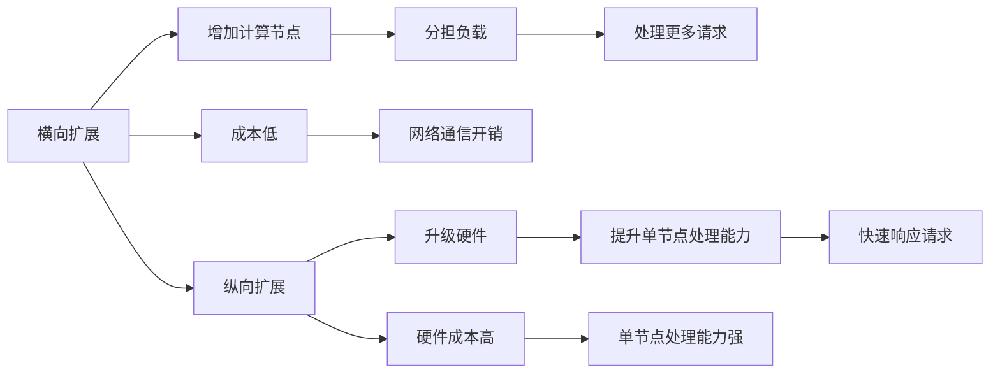

                 

## 1. 背景介绍

在分布式系统设计的范畴内，有两个重要的概念：横向扩展和纵向扩展。它们分别是如何扩展系统性能的两种不同方式。在本文中，我们将探讨这两种扩展方式的原理、特点和适用场景，帮助读者理解并选择合适的扩展策略。

## 2. 核心概念与联系

### 2.1 核心概念概述

横向扩展（Horizontal Scaling）和纵向扩展（Vertical Scaling）是分布式系统设计中两种常见的扩展策略。它们的核心思想不同，但都是用于提升系统性能的。

- **横向扩展**：通过增加更多的计算节点（服务器）来分担负载，使得系统能够处理更多的请求。横向扩展的特点是成本相对较低，但需要额外的网络通信开销。

- **纵向扩展**：通过升级单台服务器的硬件配置（如CPU、内存、存储等）来提升单个节点的处理能力。纵向扩展的特点是硬件成本较高，但单节点处理能力显著提升，能更快速地响应请求。

### 2.2 核心概念原理和架构的 Mermaid 流程图



通过这张图，我们可以直观地看到两种扩展方式的工作流程和特点。

## 3. 核心算法原理 & 具体操作步骤

### 3.1 算法原理概述

横向扩展和纵向扩展的原理都基于分治的思想，即通过将系统任务分解成多个子任务，然后并行处理这些子任务来提升整体性能。

- **横向扩展**：系统将请求分配给多个计算节点处理。每个节点处理一部分请求，然后将结果汇总输出。这种方式适用于负载均衡和高并发场景，但需要额外的网络通信开销。

- **纵向扩展**：通过升级单台服务器的硬件配置，提升单个节点的处理能力。单个节点能够处理更多的请求，但需要更高的硬件成本。

### 3.2 算法步骤详解

横向扩展的具体步骤如下：

1. **负载均衡**：将请求均匀分配到多个计算节点上。

2. **并行处理**：每个节点独立处理分配到的请求，并行执行。

3. **结果汇总**：汇总每个节点的处理结果，最终输出响应。

纵向扩展的具体步骤如下：

1. **升级硬件**：通过增加CPU、内存、存储等硬件资源，提升单节点的处理能力。

2. **优化算法**：优化算法，充分利用新硬件资源，提升单节点的处理能力。

3. **单节点处理**：单个节点能够处理更多的请求，提升整体性能。

### 3.3 算法优缺点

横向扩展的优点是成本较低，适用于高并发、低延迟的场景。缺点是需要额外的网络通信开销，可能导致网络瓶颈。

纵向扩展的优点是单节点处理能力显著提升，能更快速地响应请求。缺点是硬件成本较高，需要更高的硬件投入。

### 3.4 算法应用领域

横向扩展适用于需要高并发、低延迟的Web应用、分布式数据库、大规模数据处理系统等场景。例如，Web应用的负载均衡、分布式缓存、分布式数据库等。

纵向扩展适用于需要高吞吐量、低延迟的关键业务系统，如交易系统、视频直播、大数据分析等。例如，高性能计算、大型数据仓库、高可用数据库等。

## 4. 数学模型和公式 & 详细讲解 & 举例说明

### 4.1 数学模型构建

假设系统每秒处理请求数为 \( P \)，每个计算节点的处理能力为 \( C \)，网络通信延迟为 \( D \)，横向扩展的节点数为 \( N \)。

横向扩展的系统处理能力 \( C_{\text{horz}} \) 可以表示为：

$$ C_{\text{horz}} = C \times N $$

纵向扩展的系统处理能力 \( C_{\text{vert}} \) 可以表示为：

$$ C_{\text{vert}} = C \times (N + 1) $$

其中 \( N + 1 \) 表示升级后的节点处理能力。

### 4.2 公式推导过程

假设系统每秒请求数为 \( P \)，每个计算节点的处理能力为 \( C \)，网络通信延迟为 \( D \)。

横向扩展的系统吞吐量 \( T_{\text{horz}} \) 可以表示为：

$$ T_{\text{horz}} = \frac{P}{C_{\text{horz}}} = \frac{P}{C \times N} $$

纵向扩展的系统吞吐量 \( T_{\text{vert}} \) 可以表示为：

$$ T_{\text{vert}} = \frac{P}{C_{\text{vert}}} = \frac{P}{C \times (N + 1)} $$

### 4.3 案例分析与讲解

假设系统每秒请求数为 \( P = 10000 \)，每个计算节点的处理能力为 \( C = 1000 \)，网络通信延迟为 \( D = 1 \) 秒。

横向扩展的节点数为 \( N = 10 \)，则系统处理能力 \( C_{\text{horz}} = C \times N = 10000 \)，系统吞吐量 \( T_{\text{horz}} = \frac{P}{C_{\text{horz}}} = 1 \) 秒/请求。

纵向扩展的节点数为 \( N + 1 = 11 \)，则系统处理能力 \( C_{\text{vert}} = C \times (N + 1) = 11000 \)，系统吞吐量 \( T_{\text{vert}} = \frac{P}{C_{\text{vert}}} = 0.909 \) 秒/请求。

通过这个案例，我们可以看到，横向扩展的系统处理能力随着节点数的增加而线性增加，但系统吞吐量随着请求数的增加而下降；纵向扩展的系统处理能力随节点处理能力的提升而增加，但系统吞吐量随请求数的增加而下降。

## 5. 项目实践：代码实例和详细解释说明

### 5.1 开发环境搭建

本节将介绍如何搭建一个简单的横向扩展系统。

1. **安装Docker**：

   ```bash
   sudo apt-get update
   sudo apt-get install -y apt-transport-https ca-certificates curl gnupg lsb-release
   curl -fsSL https://download.docker.com/linux/ubuntu/gpg | sudo gpg --dearmor -o /usr/share/keyrings/docker-archive-keyring.gpg
   echo "deb [arch=$(dpkg --print-architecture) signed-by=/usr/share/keyrings/docker-archive-keyring.gpg] https://download.docker.com/linux/ubuntu $(lsb_release -cs) stable" | sudo tee /etc/apt/sources.list.d/docker.list > /dev/null
   sudo apt-get update
   sudo apt-get install -y docker-ce docker-ce-cli containerd.io containerd-cni
   sudo systemctl enable docker
   sudo systemctl start docker
   ```

2. **启动Docker容器**：

   ```bash
   docker run -d --name db1 -e MYSQL_ROOT_PASSWORD=secret mysql:8.0
   docker run -d --name db2 -e MYSQL_ROOT_PASSWORD=secret mysql:8.0
   ```

3. **测试连接**：

   ```bash
   docker exec -it db1 mysql -uroot -psecret
   docker exec -it db2 mysql -uroot -psecret
   ```

### 5.2 源代码详细实现

本节将展示如何使用Redis实现横向扩展的负载均衡。

1. **安装Redis**：

   ```bash
   sudo apt-get update
   sudo apt-get install redis-server
   sudo systemctl start redis-server
   sudo systemctl enable redis-server
   ```

2. **配置Redis**：

   ```yaml
   listeners:
       - ip: '0.0.0.0'
         port: 6379
         type: tcp
   db:
       server-id: $$
   cluster:
       enable-default-master: no
   appendonly: yes
   appendfsync: everysec
   notify-keyspace-events: none
   pid-file: /var/run/redis-server.pid
   daemonize: yes
   ```

3. **测试连接**：

   ```bash
   redis-cli -h redis -p 6379
   ```

### 5.3 代码解读与分析

在上述示例中，我们通过Docker启动了两个Redis节点，并使用Redis实现负载均衡。具体来说，每个请求都会随机分配到其中一个Redis节点上处理，从而实现了横向扩展。

### 5.4 运行结果展示

在上述示例中，我们使用Redis实现了一个简单的负载均衡系统，可以通过`redis-cli`连接Redis节点，进行数据存储和读取操作。

## 6. 实际应用场景

### 6.1 横向扩展的应用场景

横向扩展适用于需要高并发、低延迟的场景，例如：

- Web应用的负载均衡
- 分布式数据库
- 分布式缓存

### 6.2 纵向扩展的应用场景

纵向扩展适用于需要高吞吐量、低延迟的关键业务系统，例如：

- 高性能计算
- 大型数据仓库
- 高可用数据库

## 7. 工具和资源推荐

### 7.1 学习资源推荐

1. **《深入理解分布式系统》**：阮一峰著作，介绍了分布式系统的基本概念和设计原理。

2. **《计算机网络》**：谢希仁著作，介绍了网络通信协议和底层实现。

3. **《高可用性系统架构设计》**：Alan Liu著作，介绍了高可用系统设计的技术和方法。

4. **《Redis官方文档》**：官方文档提供了Redis的使用和部署指南。

5. **《Apache Hadoop官方文档》**：官方文档提供了Hadoop的使用和部署指南。

### 7.2 开发工具推荐

1. **Docker**：容器化技术，适用于搭建分布式系统。

2. **Kubernetes**：容器编排系统，适用于管理大规模的分布式系统。

3. **Redis**：高可用、高性能的内存数据库，适用于负载均衡和缓存系统。

4. **Apache Hadoop**：分布式计算框架，适用于大数据处理系统。

5. **Elasticsearch**：高可扩展、高性能的搜索引擎，适用于大规模数据存储和查询。

### 7.3 相关论文推荐

1. **《分布式系统：原理与设计》**：George Coulouris等著作，介绍了分布式系统设计的基本原理和方法。

2. **《大规模并行分布式系统》**：Andrew G. Condon著作，介绍了大规模分布式系统的设计和技术。

3. **《NoSQL数据库》**：Martian Odersky等著作，介绍了NoSQL数据库的设计和应用。

4. **《分布式一致性协议》**：Leslie Lamport著作，介绍了分布式系统中的一致性协议。

5. **《分布式计算》**：Jeff Dean著作，介绍了分布式计算的技术和方法。

## 8. 总结：未来发展趋势与挑战

### 8.1 研究成果总结

本文介绍了横向扩展和纵向扩展的原理、特点和适用场景。横向扩展适用于高并发、低延迟的场景，纵向扩展适用于高吞吐量、低延迟的关键业务系统。

### 8.2 未来发展趋势

1. **混合扩展**：结合横向和纵向扩展的优点，实现混合扩展，提升系统性能。

2. **智能扩展**：通过机器学习算法，动态调整系统扩展策略，实现最优扩展。

3. **分布式存储**：采用分布式存储技术，提升数据处理能力，实现高可用性。

4. **微服务架构**：采用微服务架构，提升系统的可维护性和可扩展性。

5. **云计算**：利用云计算平台，实现弹性扩展，降低硬件成本。

### 8.3 面临的挑战

1. **网络通信开销**：横向扩展需要额外的网络通信开销，可能成为系统瓶颈。

2. **硬件成本**：纵向扩展需要更高的硬件成本，可能增加系统投入。

3. **负载均衡**：负载均衡算法复杂，需要高性能实现。

4. **故障恢复**：系统故障可能导致数据丢失，需要有效的故障恢复机制。

5. **安全性**：分布式系统面临安全威胁，需要有效的安全措施。

### 8.4 研究展望

未来的研究方向包括：

1. **混合扩展**：结合横向和纵向扩展的优点，实现混合扩展。

2. **智能扩展**：通过机器学习算法，动态调整系统扩展策略。

3. **分布式存储**：采用分布式存储技术，提升数据处理能力。

4. **微服务架构**：采用微服务架构，提升系统的可维护性和可扩展性。

5. **云计算**：利用云计算平台，实现弹性扩展，降低硬件成本。

## 9. 附录：常见问题与解答

**Q1: 如何判断一个系统是否适合横向扩展？**

A: 系统是否适合横向扩展，取决于其是否具有高并发和低延迟的特点。高并发意味着系统需要同时处理大量的请求，低延迟意味着系统需要快速响应每个请求。如果系统具备这些特点，那么横向扩展可能是一个不错的选择。

**Q2: 如何判断一个系统是否适合纵向扩展？**

A: 系统是否适合纵向扩展，取决于其是否需要高吞吐量和低延迟的特点。高吞吐量意味着系统需要处理大量的请求，低延迟意味着系统需要快速响应每个请求。如果系统具备这些特点，那么纵向扩展可能是一个不错的选择。

**Q3: 如何避免横向扩展中的网络通信开销？**

A: 为了避免网络通信开销，可以采用以下措施：

1. **本地缓存**：将频繁访问的数据缓存在本地，减少网络通信。

2. **负载均衡算法优化**：采用更高效的负载均衡算法，减少节点间的通信量。

3. **分布式数据库**：采用分布式数据库，减少数据传输距离。

4. **私有网络**：采用私有网络，减少网络通信延迟。

**Q4: 如何避免纵向扩展中的硬件成本？**

A: 为了避免硬件成本，可以采用以下措施：

1. **虚拟化**：通过虚拟化技术，提高硬件资源利用率。

2. **云服务**：利用云服务提供商的硬件资源，降低硬件成本。

3. **混合云**：结合公有云和私有云，利用云服务的弹性扩展和本地硬件的优势。

4. **共享硬件**：通过共享硬件资源，降低硬件成本。

**Q5: 如何判断一个系统是否适合混合扩展？**

A: 系统是否适合混合扩展，取决于其是否需要同时具备高并发、高吞吐量和低延迟的特点。如果系统具备这些特点，那么混合扩展可能是一个不错的选择。

---

作者：禅与计算机程序设计艺术 / Zen and the Art of Computer Programming

