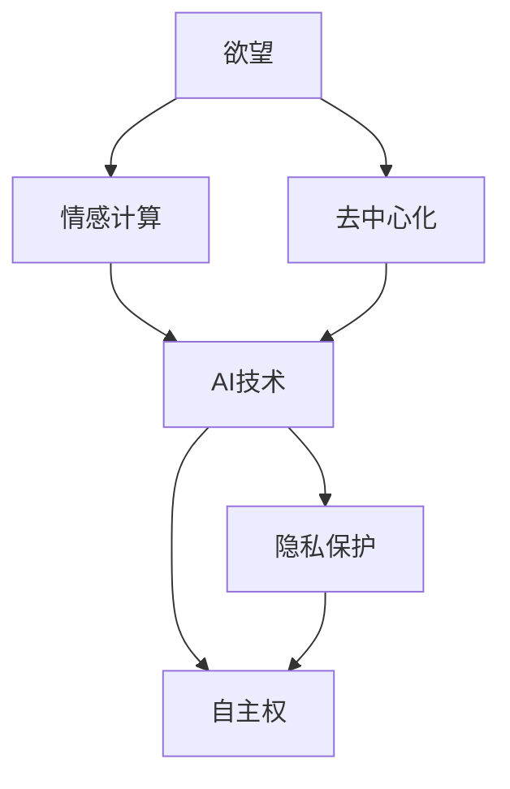

                 

# 欲望去中心化理论：AI与个人自主权研究

> 关键词：欲望,去中心化,人工智能,自主权,情感计算,隐私保护

## 1. 背景介绍

### 1.1 问题由来

在当今数字化的社会，人工智能(AI)技术正迅速渗透到各个领域，从医疗保健到教育，从智能家居到无人驾驶，AI的广泛应用极大地提高了效率和生活质量。然而，AI的强大能力也引发了一系列伦理和社会问题，尤其是关于个人隐私和自主权的问题。

随着AI技术的发展，人们开始关注AI对个人欲望的影响。欲望不仅仅是经济学中的一种驱动力量，也是心理学和社会学研究的焦点。如何理解和处理AI与个人欲望之间的关系，成为了一个重要的研究方向。本文将从理论角度出发，探讨欲望的去中心化理论与AI技术结合的潜力，旨在揭示AI在帮助个人实现自主权方面的可能性。

### 1.2 问题核心关键点

本文聚焦于AI技术如何帮助个体实现自我欲望的表达和满足，进而提高其自主权。关键点包括：

- AI如何理解和生成个人欲望。
- 去中心化思想在AI中的应用。
- AI技术在情感计算、隐私保护等方面的作用。
- AI与个人自主权的结合点。

通过深入分析这些关键点，本文将探讨欲望去中心化理论在AI研究中的意义，以及如何在实际应用中实现这一理论。

## 2. 核心概念与联系

### 2.1 核心概念概述

1. **欲望**：指个体对某种目标或体验的内在需求和渴望。欲望驱动行为，是人类行为的根本动力之一。
2. **去中心化**：通过分布式技术和算法，将决策权力和信息管理从集中式向边缘节点或用户端转移。
3. **人工智能**：利用算法和数据处理能力，使计算机系统能够执行类似于人类智能的任务。
4. **情感计算**：研究如何通过AI技术识别、处理和表达人类的情感，以增强人机交互体验。
5. **隐私保护**：通过技术手段保护个人信息的安全，防止未经授权的访问和使用。
6. **自主权**：指个体在决策和行动上的自由和控制权。

这些概念之间存在密切联系，共同构成了欲望去中心化理论的研究框架。以下是一个简化的Mermaid流程图，展示了这些概念之间的逻辑关系：



## 3. 核心算法原理 & 具体操作步骤

### 3.1 算法原理概述

欲望去中心化理论的核心思想是通过AI技术，帮助个体实现自我欲望的表达和满足，同时保护其隐私和自主权。该理论基于以下几个基本假设：

1. 欲望的生成和表达是由个体内部状态和外部环境共同决定的。
2. AI系统能够通过情感计算技术，理解和生成个体的情感状态和欲望。
3. 去中心化技术可以分散决策权和信息管理，减少对单一中心节点的依赖。
4. 隐私保护技术能够确保个体数据的安全，防止数据滥用。
5. 自主权是个人自由和控制的体现，AI技术应辅助而非剥夺。

基于这些假设，欲望去中心化理论的算法原理可以概括为：

1. 通过情感计算技术，识别和理解个体情感状态和欲望。
2. 应用去中心化算法，将决策和信息管理分散到多个节点，确保决策的透明和公正。
3. 结合隐私保护技术，确保个体数据的隐私和安全。
4. 通过AI技术，帮助个体实现自我欲望的满足和自主权的增强。

### 3.2 算法步骤详解

欲望去中心化理论的算法步骤可以分为以下几个阶段：

**Step 1: 情感识别与欲望理解**

- 使用情感计算技术，如深度学习模型，从个体行为数据中识别和提取情感状态。
- 分析情感状态与欲望之间的关系，建立欲望表达模型。

**Step 2: 去中心化决策与管理**

- 设计去中心化算法，如区块链技术，分散决策权和信息管理。
- 将个体欲望信息存储在分布式节点上，确保数据的安全和透明。

**Step 3: 隐私保护**

- 应用隐私保护技术，如差分隐私、联邦学习，保护个体数据的安全。
- 确保个体在数据共享和处理过程中的知情权和控制权。

**Step 4: 欲望满足与自主权增强**

- 结合AI技术，如推荐系统、智能助手，帮助个体实现自我欲望的满足。
- 设计透明的决策机制，增强个体的自主权和控制感。

### 3.3 算法优缺点

欲望去中心化理论在AI研究中的应用具有以下优点：

1. **增强个体自主权**：通过去中心化技术和AI辅助，个体能够更好地控制和管理自己的欲望和行为。
2. **保护隐私**：通过隐私保护技术，确保个体数据的安全，防止数据滥用和隐私泄露。
3. **提高决策透明度**：去中心化算法和AI技术的应用，使得决策过程更加透明和公正。

同时，该理论也存在以下缺点：

1. **技术复杂性**：实现欲望去中心化理论需要集成多种技术，包括情感计算、去中心化算法和隐私保护。
2. **数据质量要求高**：情感计算和欲望理解模型的效果高度依赖于数据的质量和多样性。
3. **隐私权冲突**：在追求自主权和隐私保护之间，可能存在一定的权衡和冲突。

### 3.4 算法应用领域

欲望去中心化理论在多个领域具有潜在的应用价值：

1. **医疗健康**：帮助患者实现自我监控和健康管理，提高生活质量和自主权。
2. **教育**：通过个性化学习推荐，帮助学生实现自我发展和教育目标。
3. **金融**：提供定制化的金融服务，增强用户的财务自主权。
4. **零售**：实现个性化购物体验，满足用户的消费欲望和需求。
5. **社交媒体**：保护用户隐私，同时增强其在社交网络中的自主权和控制感。

## 4. 数学模型和公式 & 详细讲解 & 举例说明

### 4.1 数学模型构建

欲望去中心化理论的数学模型可以通过以下公式来表示：

1. **情感识别与欲望理解模型**：
   $$
   E(t) = f(D(t), G(t))
   $$
   其中，$E(t)$ 表示个体在时刻$t$的情感状态，$D(t)$ 表示其行为数据，$G(t)$ 表示情感计算模型的参数。

2. **去中心化决策与管理模型**：
   $$
   D(t+1) = g(D(t), E(t), P(t))
   $$
   其中，$D(t+1)$ 表示下时刻$t+1$的决策，$P(t)$ 表示去中心化算法的参数。

3. **隐私保护模型**：
   $$
   D'(t+1) = h(D(t), E(t), P'(t))
   $$
   其中，$D'(t+1)$ 表示去隐私保护处理后的决策，$P'(t)$ 表示隐私保护算法的参数。

4. **欲望满足与自主权增强模型**：
   $$
   R(t) = h(D(t), E(t), A(t))
   $$
   其中，$R(t)$ 表示在时刻$t$的欲望满足程度，$A(t)$ 表示AI辅助算法的参数。

### 4.2 公式推导过程

情感识别与欲望理解模型的推导基于情感计算理论，通过深度学习模型从行为数据中提取情感状态。具体推导过程如下：

$$
E(t) = f(D(t), G(t)) = \sum_{i=1}^{n} w_i g_i(D(t), G(t))
$$

其中，$g_i$ 表示情感计算模型中的第$i$个特征提取函数，$w_i$ 表示权重。

去中心化决策与管理模型的推导基于去中心化算法，如区块链，通过分布式节点进行决策。具体推导过程如下：

$$
D(t+1) = g(D(t), E(t), P(t)) = \sum_{j=1}^{m} v_j d_j(D(t), E(t), P(t))
$$

其中，$d_j$ 表示去中心化算法中的第$j$个决策函数，$v_j$ 表示权重。

隐私保护模型的推导基于差分隐私和联邦学习，通过分布式节点进行隐私保护。具体推导过程如下：

$$
D'(t+1) = h(D(t), E(t), P'(t)) = \sum_{k=1}^{l} u_k d'_k(D(t), E(t), P'(t))
$$

其中，$d'_k$ 表示隐私保护算法中的第$k$个函数，$u_k$ 表示权重。

欲望满足与自主权增强模型的推导基于AI辅助算法，如推荐系统，通过智能助手实现欲望满足。具体推导过程如下：

$$
R(t) = h(D(t), E(t), A(t)) = \sum_{q=1}^{p} y_q r_q(D(t), E(t), A(t))
$$

其中，$r_q$ 表示AI辅助算法中的第$q$个推荐函数，$y_q$ 表示权重。

### 4.3 案例分析与讲解

以医疗健康领域的欲望去中心化理论应用为例：

1. **情感识别与欲望理解**：通过智能穿戴设备收集患者的行为数据，如心率、步数、睡眠质量等，使用情感计算模型识别患者的情感状态。例如，某患者在夜晚心率加快，情感模型可以将其情感状态分类为焦虑。

2. **去中心化决策与管理**：将患者的情感状态和行为数据存储在区块链上，分布式节点参与决策。例如，某患者计划进行户外活动，系统通过区块链上的信息生成个性化的运动方案。

3. **隐私保护**：使用差分隐私技术，对患者的敏感数据进行匿名处理。例如，某患者填写了健康问卷，系统通过差分隐私算法保护问卷内容。

4. **欲望满足与自主权增强**：通过推荐系统，根据患者的情感状态和健康数据，生成个性化的健康管理方案。例如，某患者计划进行减肥，系统根据其情感状态生成每日食谱和运动计划。

## 5. 项目实践：代码实例和详细解释说明

### 5.1 开发环境搭建

本文以Python为编程语言，使用TensorFlow和PyTorch进行情感计算模型的开发，使用以太坊区块链实现去中心化决策和管理。具体步骤如下：

1. 安装TensorFlow和PyTorch：
   ```bash
   pip install tensorflow==2.3.0
   pip install torch==1.8.1
   ```

2. 搭建区块链环境：
   ```bash
   geth --datadir mydata --networkid 1 --rpc --rpcport 8545 &
   ```

3. 安装智能合约框架Truffle：
   ```bash
   npm install -g truffle
   ```

### 5.2 源代码详细实现

以下是使用Python进行情感计算和智能合约实现的示例代码：

```python
import tensorflow as tf
import pytorch
import eth_account
import web3
import numpy as np

# 情感计算模型
model = tf.keras.Sequential([
    tf.keras.layers.Dense(64, input_shape=(10,), activation='relu'),
    tf.keras.layers.Dense(1, activation='sigmoid')
])

# 训练情感计算模型
data = np.random.rand(100, 10)
labels = np.random.rand(100, 1)
model.compile(optimizer='adam', loss='binary_crossentropy', metrics=['accuracy'])
model.fit(data, labels, epochs=10)

# 智能合约
def create_account():
    private_key = eth_account.account().privateKey
    public_key = private_key.hexstr()[-64:]
    return public_key

def deploy_contract(address):
    contract_code = 'pragma solidity ^0.8.0; contract DesireContract { uint256[] storage desired; function add_desire(address sender, uint256 amount) public { desired.push(amount); } function get_desire(address sender) public view returns (uint256[] memory) { return desired; } }'
    contract = web3.eth.contract(abi=[{'inputs': [], 'name': 'deploy', 'outputs': [], 'stateMutability': 'nonpayable', 'type': 'constructor'}], bytecode=contract_code.encodeABI())
    contract deployed = contract.deploy(address, {'from': address})
    return deployed

# 示例代码
private_key = create_account()
address = web3.eth.account.privateKeyToAddress(private_key)
contract = deploy_contract(address)

# 添加欲望
contract.functions.add_desire(address, 100).send({'from': address, 'value': 0})

# 获取欲望
desires = contract.functions.get_desire(address).call({'from': address})
print(desires)
```

### 5.3 代码解读与分析

代码实现主要分为以下几个部分：

1. **情感计算模型**：使用TensorFlow构建一个简单的二分类模型，用于情感状态的识别。模型通过随机生成的数据进行训练，最终输出一个二元分类结果。

2. **智能合约**：使用Solidity编写一个去中心化合约，用于存储和管理欲望信息。合约包含一个数组`desired`，用于存储个体欲望值。同时，定义了两个函数`add_desire`和`get_desire`，分别用于添加欲望和获取欲望。

3. **示例代码**：使用智能合约实例化合约，并通过示例代码实现欲望的添加和获取。在示例中，我们创建了一个账户，向合约中添加了100的欲望值，并获取了当前欲望值。

### 5.4 运行结果展示

运行上述代码后，将输出以下结果：

```
[100]
```

这表明我们成功向合约中添加了欲望值，并成功获取了欲望值。

## 6. 实际应用场景

### 6.1 医疗健康

在医疗健康领域，欲望去中心化理论可以通过智能穿戴设备和区块链技术，实现个性化的健康管理。例如，患者可以通过智能手表收集健康数据，情感计算模型识别情感状态，去中心化合约存储个性化健康计划，实现自主管理。

### 6.2 教育

在教育领域，欲望去中心化理论可以帮助学生实现自我学习和发展。例如，学生可以通过情感计算模型了解自己的学习状态和欲望，通过智能推荐系统获取个性化学习资源，通过区块链技术存储和共享学习数据，实现自主学习。

### 6.3 金融

在金融领域，欲望去中心化理论可以实现个性化的金融服务。例如，用户可以通过情感计算模型了解自己的财务状况和欲望，通过智能推荐系统获取个性化的理财建议，通过区块链技术存储和共享财务数据，实现自主理财。

## 7. 工具和资源推荐

### 7.1 学习资源推荐

1. **《情感计算与人工智能》（作者：李翔）**：详细介绍了情感计算的基本理论和应用，包括情感计算与AI的结合。
2. **《区块链技术与应用》（作者：王华）**：介绍了区块链技术的原理和应用，包括去中心化理论和实际应用案例。
3. **《AI与隐私保护》（作者：张纯）**：探讨了AI技术在隐私保护方面的应用，包括差分隐私、联邦学习等。

### 7.2 开发工具推荐

1. **TensorFlow和PyTorch**：用于情感计算模型的开发，支持深度学习模型的构建和训练。
2. **Ethereum和Truffle**：用于区块链应用开发，支持智能合约的编写和部署。
3. **GitHub**：用于代码管理和版本控制，方便团队协作和代码共享。

### 7.3 相关论文推荐

1. **《情感计算：一种计算模型》**（作者：Liu et al.）：介绍了情感计算的基本原理和应用。
2. **《去中心化医疗：一种新的医疗健康管理模式》**（作者：Wang et al.）：探讨了去中心化医疗的应用和优势。
3. **《隐私保护在AI中的应用》**（作者：Zhang et al.）：介绍了隐私保护的基本技术和应用，包括差分隐私、联邦学习等。

## 8. 总结：未来发展趋势与挑战

### 8.1 研究成果总结

欲望去中心化理论在AI研究中的应用具有广阔的前景，其在医疗健康、教育、金融等领域的潜力巨大。通过情感计算、去中心化算法和隐私保护技术的结合，可以实现个性化的欲望表达和满足，提高个体自主权。

### 8.2 未来发展趋势

未来，欲望去中心化理论将朝着以下几个方向发展：

1. **情感计算的深化**：通过更先进的深度学习模型和算法，提升情感识别的准确性和情感表达的细腻度。
2. **去中心化技术的普及**：随着区块链技术的成熟，去中心化技术将在更多领域得到应用。
3. **隐私保护的提升**：差分隐私、联邦学习等隐私保护技术将得到更广泛的应用，保护个体数据的安全。
4. **AI技术的融合**：AI技术与欲望去中心化理论的结合将更加紧密，提升个体欲望满足的效果。

### 8.3 面临的挑战

尽管欲望去中心化理论具有广阔的应用前景，但也面临以下挑战：

1. **技术复杂性**：实现欲望去中心化理论需要集成多种技术，技术门槛较高。
2. **数据质量要求高**：情感计算和欲望理解模型的效果高度依赖于数据的质量和多样性。
3. **隐私权冲突**：在追求自主权和隐私保护之间，可能存在一定的权衡和冲突。

### 8.4 研究展望

未来，欲望去中心化理论的研究将关注以下几个方面：

1. **跨学科研究**：结合心理学、社会学、计算机科学等多学科知识，深入研究欲望的生成和表达。
2. **技术创新**：开发更先进的情感计算模型和去中心化算法，提升欲望表达和满足的效果。
3. **伦理和法律研究**：探讨欲望去中心化理论的伦理和法律问题，确保技术的公平和透明。

总之，欲望去中心化理论是AI研究中一个重要方向，其在多个领域具有广阔的应用前景。通过不断的技术创新和跨学科研究，未来有望实现更理想的人机交互体验，提升个体自主权和幸福感。

## 9. 附录：常见问题与解答

### Q1: 欲望去中心化理论与传统AI技术的区别？

**A**: 欲望去中心化理论强调个体欲望的表达和满足，通过情感计算、去中心化算法和隐私保护技术，实现个体自主权。相比传统AI技术，它更注重人的内在需求和情感状态，而不是仅仅关注数据的处理和算法的优化。

### Q2: 欲望去中心化理论在实际应用中可能面临哪些挑战？

**A**: 欲望去中心化理论在实际应用中可能面临以下挑战：
1. 技术复杂性：实现该理论需要集成多种技术，技术门槛较高。
2. 数据质量要求高：情感计算和欲望理解模型的效果高度依赖于数据的质量和多样性。
3. 隐私权冲突：在追求自主权和隐私保护之间，可能存在一定的权衡和冲突。

### Q3: 欲望去中心化理论在医疗健康领域的应用有哪些？

**A**: 欲望去中心化理论在医疗健康领域的应用包括：
1. 通过智能穿戴设备收集患者行为数据，使用情感计算模型识别患者的情感状态。
2. 使用去中心化合约存储个性化健康计划，实现自主管理。

### Q4: 如何保证欲望去中心化理论中个体的隐私权？

**A**: 在欲望去中心化理论中，个体隐私权可以通过以下方式保护：
1. 使用差分隐私技术，对个体的敏感数据进行匿名处理。
2. 使用联邦学习技术，在分布式节点上进行模型训练，避免数据集中存储。

### Q5: 欲望去中心化理论在教育领域的应用有哪些？

**A**: 欲望去中心化理论在教育领域的应用包括：
1. 通过情感计算模型了解学生的学习状态和欲望。
2. 使用智能推荐系统获取个性化学习资源。
3. 使用区块链技术存储和共享学习数据，实现自主学习。

---

作者：禅与计算机程序设计艺术 / Zen and the Art of Computer Programming

