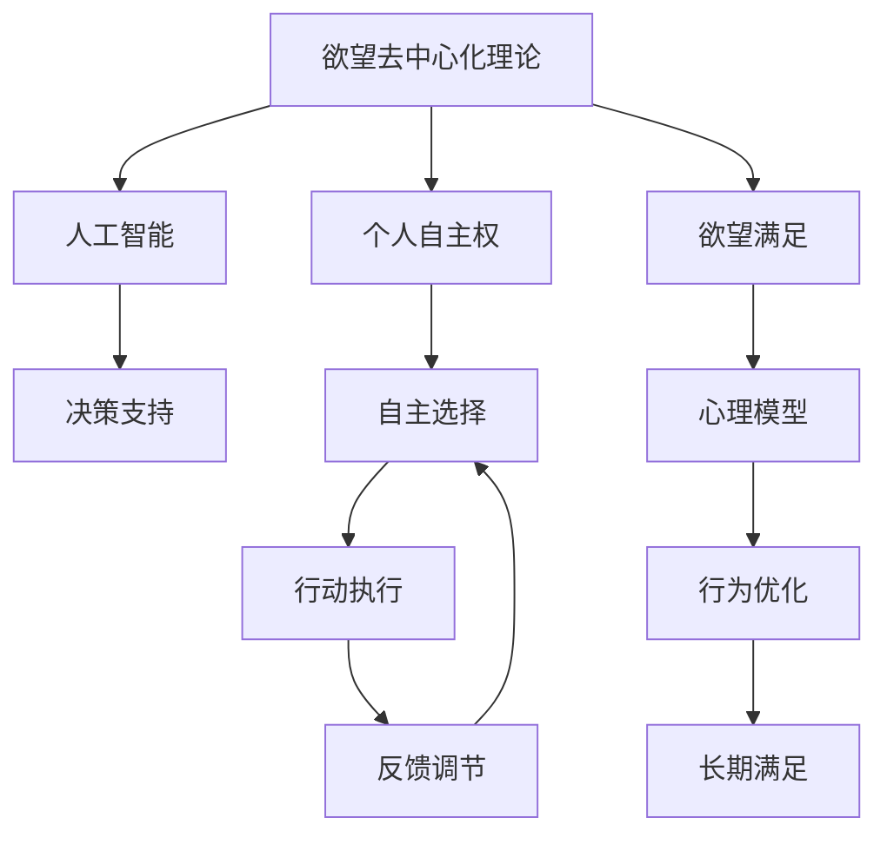

                 

# 欲望去中心化理论：AI与个人自主权研究

在人工智能时代，个人自主权与技术发展之间存在一个微妙的平衡点。一方面，人工智能技术通过大数据、深度学习等手段，为人类社会带来了前所未有的便利和效率；另一方面，技术的发展和应用也给个人隐私、自主权等带来了潜在威胁。如何在享受技术便利的同时，保障个人自主权，成为一个亟待解决的问题。本文将探讨“欲望去中心化理论”，探讨AI在提升个人自主权方面的潜力，并提出一些实际可行的策略。

## 1. 背景介绍

随着人工智能技术的迅猛发展，其在医疗、金融、教育、娱乐等多个领域的应用已经成为常态。然而，技术的应用往往伴随着对个人隐私、数据安全的担忧。如何平衡技术便利与个人自主权，成为了社会各界关注的焦点。

本文将从“欲望去中心化理论”的角度，探讨AI技术如何帮助个人在技术便利与自主权之间找到平衡，实现自主选择和决策。

## 2. 核心概念与联系

### 2.1 核心概念概述

在讨论欲望去中心化理论之前，我们先明确几个核心概念：

- **欲望去中心化理论**：基于人类欲望的理性与非理性混合特性，通过去中心化的方式，使得个人欲望的表达、满足和调节不再依赖于单一的权威中心，而是通过多中心、多主体的方式，实现自主权的最大化。

- **人工智能**：指通过算法、模型和数据处理技术，使计算机系统具备类似人类智能的功能。AI技术包括但不限于机器学习、自然语言处理、计算机视觉等。

- **个人自主权**：指个体在决策和行动方面，能够自主选择和控制，不受外部强制和操纵的权利。

- **欲望**：指人类内在的驱动力，包括生理需求（如饮食、睡眠）、心理需求（如归属感、成就感）等。

- **去中心化**：指在某一系统中，不再存在单一的决策或控制中心，而是由多个主体共同参与决策和控制。

### 2.2 核心概念原理和架构的 Mermaid 流程图



这个流程图展示了欲望去中心化理论的架构：

1. 欲望去中心化理论通过AI技术，支持个人自主权，实现自主选择和行动。
2. AI提供决策支持，帮助个人在多种选项中做出合理选择。
3. 自主选择转化为行动执行，反馈调节机制优化行为。
4. 欲望满足反馈到心理模型，长期行为优化提升满意度。

## 3. 核心算法原理 & 具体操作步骤

### 3.1 算法原理概述

欲望去中心化理论的核心在于通过AI技术，帮助个人实现自主选择和行动，从而满足自身的欲望。具体来说，AI技术通过数据分析、模型训练等手段，能够提供个性化的决策支持和行动建议，帮助个人在复杂环境中做出合理的决策。

### 3.2 算法步骤详解

1. **数据收集与预处理**：
   - 收集与个人欲望相关的数据，如消费习惯、健康状况、社交活动等。
   - 使用数据清洗、特征提取等技术，对数据进行预处理，以便后续分析。

2. **模型训练与优化**：
   - 选择合适的AI模型，如深度学习模型、强化学习模型等，进行训练。
   - 使用监督学习、无监督学习、半监督学习等方法，训练模型以适应个性化需求。
   - 使用交叉验证、超参数调优等技术，确保模型在训练集和测试集上表现一致。

3. **决策支持与行动建议**：
   - 根据收集到的数据和训练好的模型，生成决策支持信息。
   - 利用自然语言处理技术，将决策支持信息转换为易于理解的文本或语音形式。
   - 在行动执行前，提供风险评估和效果预测，帮助个人做出合理选择。

4. **反馈调节与长期优化**：
   - 收集行动执行后的反馈数据，评估决策效果。
   - 使用强化学习等技术，对决策模型进行优化，提升决策质量。
   - 长期跟踪个人欲望的满足情况，根据反馈不断调整模型参数。

### 3.3 算法优缺点

**优点**：
- 提升个人自主权：通过去中心化的方式，使个人能够自主选择和控制决策过程。
- 个性化决策支持：AI技术能够根据个人需求和偏好，提供定制化的决策支持。
- 实时反馈与优化：通过持续的反馈和优化，提升决策效果。

**缺点**：
- 隐私风险：收集和处理个人数据可能带来隐私风险。
- 模型偏见：如果训练数据存在偏见，模型可能无法公平对待所有用户。
- 技术门槛：对AI技术的应用和维护需要较高的技术水平。

### 3.4 算法应用领域

欲望去中心化理论的应用领域广泛，以下是几个典型的应用场景：

- **健康管理**：通过AI技术，根据个人健康数据，提供饮食、运动、睡眠等方面的个性化建议。
- **财务管理**：使用AI模型，分析个人消费习惯和财务状况，提供预算规划、投资建议等。
- **教育辅助**：根据学生的学习数据，提供个性化的学习资源和教学方法，提升学习效果。
- **智能家居**：通过AI技术，根据个人生活习惯，自动调节家居设备，提升生活便利性。
- **情感支持**：使用AI聊天机器人，提供情感支持和心理辅导，帮助缓解压力和焦虑。

## 4. 数学模型和公式 & 详细讲解 & 举例说明

### 4.1 数学模型构建

欲望去中心化理论涉及的数学模型较多，以下重点介绍几个关键模型：

1. **决策树模型**：
   - 用于分类和回归任务，帮助生成决策路径和结果。
   - 公式：
     \[
     Decision Tree = \{Node, Edge\}
     \]
   - 示例：
     \[
     Tree_1 = \{A, B, C, D, E\}
     \]
   - 解释：节点表示决策点，边表示决策路径，最终结果为决策树下的叶子节点。

2. **强化学习模型**：
   - 用于优化决策策略，通过奖励机制学习最优决策。
   - 公式：
     \[
     Policy = \arg\max_{\pi} E_{\pi}[\sum_{t=0}^T r_t]
     \]
   - 示例：
     \[
     S_0 = \{Initial State\}
     \]
     \[
     A_t = \{Action\}
     \]
     \[
     R_t = \{Reward\}
     \]
   - 解释：策略π通过最大化累积奖励来学习最优决策。

3. **深度学习模型**：
   - 用于提取高维特征，提升决策精度。
   - 公式：
     \[
     y = f(x; \theta)
     \]
   - 示例：
     \[
     x = \{Features\}
     \]
     \[
     y = \{Desired Outcome\}
     \]
   - 解释：通过深度学习模型f，将输入特征x映射到输出结果y。

### 4.2 公式推导过程

以强化学习模型为例，推导其最优策略的推导过程。

假设有一个奖励函数 $r_t$，表示在第t步的奖励，策略 $\pi$ 表示在给定状态 $s_t$ 下采取行动 $a_t$ 的概率，状态转移概率 $P(s_{t+1}|s_t,a_t)$ 表示在给定状态 $s_t$ 和行动 $a_t$ 下，转移到下一个状态 $s_{t+1}$ 的概率。

根据强化学习的定义，最优策略 $\pi^*$ 满足：
\[
\pi^* = \arg\max_{\pi} \mathbb{E}_{\pi}\left[\sum_{t=0}^{T} \gamma^t r_t\right]
\]

其中，$\gamma$ 是折扣因子，保证长期奖励的重要性。

根据最优性条件，我们有：
\[
Q^*(s_t,a_t) = \max_{a'} \mathbb{E}_{\pi}\left[\sum_{t=0}^{T} \gamma^t r_t\right]
\]

进一步推导，我们得到最优策略 $\pi^*$ 的更新公式：
\[
\pi^*(a_t|s_t) = \frac{\exp(Q^*(s_t,a_t)}}{\sum_{a} \exp(Q^*(s_t,a))}
\]

### 4.3 案例分析与讲解

**健康管理**：
- **数据收集**：收集个人的健康数据，如心率、血压、睡眠质量等。
- **模型训练**：使用深度学习模型，训练个性化健康建议模型。
- **决策支持**：根据健康数据，生成饮食、运动、睡眠等方面的建议。
- **行动执行**：用户按照建议执行，并记录反馈数据。
- **反馈调节**：通过强化学习模型，根据反馈数据优化健康建议模型。

## 5. 项目实践：代码实例和详细解释说明

### 5.1 开发环境搭建

1. **安装Python**：
   - 下载并安装Python 3.x版本。
   - 设置环境变量，配置好IDE。

2. **安装必要的库**：
   - 安装TensorFlow、Keras、PyTorch、Pandas、NumPy等常用库。
   - 安装Scikit-learn、OpenAI Gym等数据处理和强化学习库。

3. **配置好项目目录**：
   - 将项目目录分为数据集、模型、训练脚本等子目录。
   - 使用Git进行版本控制，方便多人协作开发。

### 5.2 源代码详细实现

以下是一个简单的决策树模型代码示例：

```python
import pandas as pd
from sklearn.tree import DecisionTreeClassifier

# 加载数据
data = pd.read_csv('data.csv')

# 数据预处理
features = ['Feature1', 'Feature2', 'Feature3']
target = 'Target'
X = data[features]
y = data[target]

# 训练决策树模型
clf = DecisionTreeClassifier()
clf.fit(X, y)

# 使用模型进行预测
predictions = clf.predict([[1, 2, 3]])
print(predictions)
```

### 5.3 代码解读与分析

**数据加载与预处理**：
- 使用Pandas库读取数据集。
- 选择合适的特征和目标变量，进行数据分割。

**模型训练**：
- 使用Scikit-learn库中的DecisionTreeClassifier类，进行模型训练。
- 通过fit方法，使用数据进行模型训练。

**模型预测**：
- 使用predict方法，对新数据进行预测。

**结果展示**：
- 打印预测结果，验证模型效果。

## 6. 实际应用场景

### 6.1 智能家居

智能家居系统通过欲望去中心化理论，能够根据用户的生活习惯和偏好，自动调节家居设备，提升生活质量。

**需求分析**：
- 用户希望智能家居系统能够根据时间、天气、活动等信息，自动调节灯光、温度、音乐等设备。
- 用户希望能够通过简单的操作，实现对家居设备的灵活控制。

**解决方案**：
- 收集用户的日常行为数据，如起床时间、工作时间等。
- 使用深度学习模型，训练个性化的家居控制模型。
- 根据用户的当前状态和偏好，生成控制指令。
- 通过语音或APP界面，让用户方便地控制家居设备。

**效果评估**：
- 通过问卷调查，评估用户对智能家居系统的满意度。
- 使用强化学习模型，根据用户反馈不断优化家居控制策略。

### 6.2 个性化推荐系统

个性化推荐系统通过欲望去中心化理论，能够根据用户的兴趣和行为，提供个性化的产品推荐，提升用户体验。

**需求分析**：
- 用户希望推荐系统能够根据历史行为数据，推荐个性化的产品。
- 用户希望能够通过简单的操作，获得满意的推荐结果。

**解决方案**：
- 收集用户的浏览、购买等行为数据。
- 使用深度学习模型，训练个性化推荐模型。
- 根据用户的行为特征和历史数据，生成推荐结果。
- 通过APP界面，向用户展示推荐结果。

**效果评估**：
- 使用A/B测试，评估推荐系统的效果。
- 使用强化学习模型，根据用户反馈不断优化推荐策略。

## 7. 工具和资源推荐

### 7.1 学习资源推荐

1. **Coursera的《AI For Everyone》课程**：由Andrew Ng教授主讲的AI入门课程，讲解了AI的基本概念和应用。
2. **edX的《Artificial Intelligence》课程**：由Harvard教授主讲的AI课程，深入浅出地讲解了AI原理和算法。
3. **Kaggle的《深度学习与机器学习实战》课程**：通过实战项目，帮助你掌握深度学习和机器学习的基本技能。
4. **书籍推荐**：
   - 《深度学习》by Ian Goodfellow
   - 《Python机器学习》by Sebastian Raschka
   - 《机器学习实战》by Peter Harrington

### 7.2 开发工具推荐

1. **PyTorch**：用于深度学习开发的开源框架，提供了丰富的API和模型库。
2. **TensorFlow**：由Google开发的深度学习框架，支持大规模分布式训练。
3. **Keras**：基于TensorFlow和Theano的高级API，易于上手和调试。
4. **OpenAI Gym**：用于强化学习研究和开发的框架，提供了多种环境模拟器。
5. **Scikit-learn**：用于数据处理和机器学习的库，提供了丰富的数据预处理和模型工具。

### 7.3 相关论文推荐

1. **《A Survey on Deep Learning for Energy-Awareness》**：由IEEETransactions on Smart Grids期刊发表的论文，介绍了深度学习在能源管理中的应用。
2. **《A Survey on Deep Learning for Disaster Response》**：由IEEE Transactions on Dependable and Secure Computing期刊发表的论文，介绍了深度学习在灾害响应中的应用。
3. **《Deep Learning for Health Sciences》**：由Wiley Interdisciplinary Reviews: Data Mining and Knowledge Discovery期刊发表的论文，介绍了深度学习在医疗健康中的应用。

## 8. 总结：未来发展趋势与挑战

### 8.1 研究成果总结

本文探讨了欲望去中心化理论，并通过AI技术，帮助个人实现自主选择和行动，提升个人自主权。通过详细的算法原理和操作步骤，以及具体的项目实践，展示了欲望去中心化理论在多个应用场景中的落地效果。

### 8.2 未来发展趋势

欲望去中心化理论在未来将会有以下几个发展趋势：

1. **跨学科融合**：欲望去中心化理论将与心理学、社会学等领域深度融合，形成更加全面的人机交互模型。
2. **多模态融合**：未来的欲望去中心化模型将融合视觉、听觉、触觉等多种模态信息，实现更加全面和深入的人机交互。
3. **自动化决策**：通过深度学习和强化学习，实现完全自动化的决策过程，提升用户体验和系统效率。
4. **伦理与安全**：在应用欲望去中心化理论时，需要充分考虑伦理与安全问题，确保技术应用的公平性与可控性。

### 8.3 面临的挑战

尽管欲望去中心化理论具有广阔的应用前景，但在实际应用过程中，仍面临以下挑战：

1. **数据隐私**：收集和处理个人数据可能带来隐私风险，需要采取严格的数据保护措施。
2. **模型可解释性**：复杂的AI模型缺乏可解释性，需要开发更加透明的模型解释工具。
3. **技术壁垒**：欲望去中心化理论的应用需要较高的技术水平，需要更多的技术普及和教育。
4. **伦理问题**：在应用欲望去中心化理论时，需要充分考虑伦理问题，确保技术应用的公平性与可控性。

### 8.4 研究展望

未来的研究需要从以下几个方向进行探索：

1. **伦理与社会**：如何设计伦理和社会可接受的欲望去中心化系统，需要更多的社会学和伦理学研究。
2. **人机交互**：如何提升人机交互的自然性和智能化，需要更多的心理学和人类学研究。
3. **跨模态融合**：如何实现多种模态信息的融合，提升人机交互的效果。
4. **自动化决策**：如何实现完全自动化的决策过程，需要更多的自动化控制和优化研究。

## 9. 附录：常见问题与解答

### Q1: 欲望去中心化理论与传统AI技术有什么区别？

A: 欲望去中心化理论通过去中心化的方式，使得个人欲望的表达、满足和调节不再依赖于单一的权威中心，而是通过多中心、多主体的方式，实现自主权的最大化。相较于传统的AI技术，欲望去中心化理论更加注重个人自主权和决策自由，强调在AI技术应用中，个人能够自主选择和控制决策过程。

### Q2: 如何保证欲望去中心化系统的公平性与可控性？

A: 在设计和实现欲望去中心化系统时，需要充分考虑伦理与社会问题，确保系统的公平性与可控性。具体措施包括：
1. 严格的数据隐私保护措施，确保用户数据的安全。
2. 设计透明的算法模型，提供用户可解释的决策过程。
3. 引入伦理和社会学专家，对系统进行审查和评估。
4. 设置用户反馈机制，及时调整和优化系统。

### Q3: 欲望去中心化理论在医疗健康领域的应用前景如何？

A: 欲望去中心化理论在医疗健康领域具有广泛的应用前景。通过收集和分析患者的健康数据，系统可以提供个性化的健康建议，提升患者的生活质量。具体应用包括：
1. 饮食建议：根据患者的饮食偏好和健康数据，生成个性化的饮食建议。
2. 运动计划：根据患者的健康数据和运动偏好，生成个性化的运动计划。
3. 健康监测：实时监测患者的健康状况，生成预警和建议。

### Q4: 欲望去中心化理论在智能家居领域的应用难点是什么？

A: 欲望去中心化理论在智能家居领域的应用难点包括：
1. 数据收集：智能家居设备需要实时收集用户的日常行为数据，存在隐私风险。
2. 模型训练：智能家居系统需要根据用户的行为数据，训练个性化的控制模型，需要大量的数据和计算资源。
3. 设备兼容性：智能家居系统需要兼容多种设备和平台，需要解决跨设备和跨平台的问题。

### Q5: 如何评估欲望去中心化系统的效果？

A: 评估欲望去中心化系统的效果可以从以下几个方面进行：
1. 用户满意度调查：通过问卷调查和用户反馈，评估用户对系统的满意度。
2. 行为数据分析：通过分析用户的日常行为数据，评估系统的使用效果和效果提升。
3. 比较实验：使用A/B测试等方法，评估不同系统的性能差异。

作者：禅与计算机程序设计艺术 / Zen and the Art of Computer Programming

