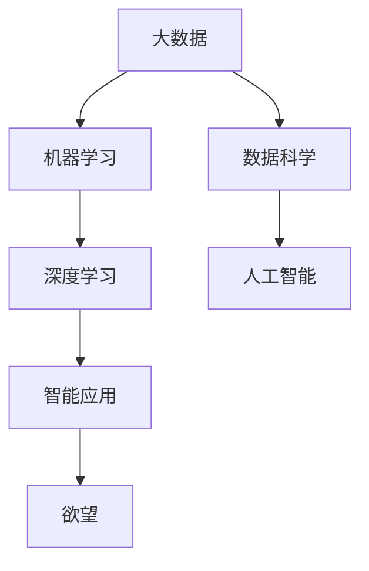

                 

# 欲望的反思：AI时代的自我认知

## 1. 背景介绍

在现代社会中，科技的迅猛发展给我们的生活带来了前所未有的便利，同时也使得人工智能(AI)技术逐渐走入人们的生活和工作。从智能手机的语音助手到无人驾驶汽车，AI正逐渐成为我们生活中不可或缺的一部分。然而，当我们不断追求更高的效率、更精准的决策和更智能化的人生时，是否也曾经思考过这些问题：AI技术的背后，究竟是什么样的逻辑和动机在驱动着我们？在这样的AI时代，我们的自我认知又该如何看待？

本文试图从哲学的角度探讨这些问题，分析AI技术的本质及其对人类社会的深远影响，并反思我们如何在AI时代保持自我认知的清醒。

## 2. 核心概念与联系

### 2.1 核心概念概述

在探讨AI时代的自我认知之前，我们首先需要对以下几个核心概念有一个清晰的认识：

- **人工智能（AI）**：指通过计算机模拟人类的智能行为，包括感知、学习、推理、决策等能力的科技。
- **机器学习（ML）**：一种基于数据的算法，使计算机能够通过经验自动提升性能的技术。
- **深度学习（DL）**：一种特殊类型的机器学习，通过模拟人脑神经元的网络结构，进行复杂的数据模式识别和学习。
- **大数据（Big Data）**：指数据规模大到超出了传统数据处理工具的能力范围，需要通过分布式计算等技术进行处理的数据集。
- **数据科学（Data Science）**：涵盖数据收集、处理、分析和可视化等多个环节，以挖掘数据价值为核心的科学。

这些概念构成了AI技术的核心，它们相互交织、共同推动着AI技术的进步和发展。然而，在这些技术的背后，隐藏着更深层次的动机和欲望，这是我们本文探讨的重点。

### 2.2 核心概念原理和架构的 Mermaid 流程图



这个流程图展示了大数据、数据科学、机器学习和深度学习之间的关系，以及它们如何推动人工智能的发展。最终，AI技术被应用于各种智能应用中，这些应用背后隐藏着人类对于效率、智能化和便捷化的欲望。

## 3. 核心算法原理 & 具体操作步骤

### 3.1 算法原理概述

AI技术的核心算法原理可以追溯到上世纪50年代，其发展过程可以分为以下几个阶段：

1. **符号主义**：最初的研究集中在将人类语言符号化，通过逻辑推理和规则来模拟人类思维。
2. **连接主义**：将计算过程与人类大脑的神经元连接模型相类比，使用神经网络进行学习。
3. **进化算法**：借鉴生物进化过程，通过随机变异和选择来优化算法。
4. **统计学习**：使用统计模型和概率论来处理数据。
5. **深度学习**：利用多层神经网络进行复杂的模式识别和特征提取。

这些算法的发展，反映了人类对人工智能的不断探索和追求。然而，这些算法的背后，隐藏着人类对于更高效、更精准、更智能的欲望。

### 3.2 算法步骤详解

AI算法的具体操作步骤可以分为以下几个步骤：

1. **数据收集和预处理**：从各种数据源收集数据，并进行清洗、转换和标注。
2. **特征工程**：从原始数据中提取有用的特征，提高算法的准确性和泛化能力。
3. **模型训练**：使用训练数据集，通过算法自动调整模型参数，学习数据模式。
4. **模型评估和优化**：使用验证数据集和测试数据集对模型进行评估，根据评估结果进行参数调整和优化。
5. **模型部署和应用**：将训练好的模型部署到实际应用场景中，进行预测、推荐等任务。

这些步骤反映出人类对于数据处理和模型训练的高效率、高准确性和高性能的欲望。

### 3.3 算法优缺点

AI算法具有以下优点：

1. **自动化**：能够自动完成数据分析、模型训练和优化等任务，大幅减少人力成本。
2. **高效率**：在大数据时代，AI算法能够处理海量数据，并快速产生结果。
3. **高精度**：通过深度学习和大量训练数据，AI算法能够达到较高的预测精度。

然而，AI算法也存在一些缺点：

1. **依赖数据**：算法的性能高度依赖于数据的质量和数量，数据偏差可能导致模型偏颇。
2. **黑箱问题**：复杂的深度神经网络难以解释，难以理解其内部的工作原理和决策逻辑。
3. **隐私问题**：大规模数据收集和使用可能带来隐私泄露的风险。
4. **安全问题**：AI系统的脆弱性可能导致被恶意利用，甚至引发伦理道德问题。

### 3.4 算法应用领域

AI算法在各个领域都有广泛应用，包括但不限于：

- **医疗健康**：通过AI算法进行疾病诊断、治疗方案推荐、药物研发等。
- **金融保险**：使用AI算法进行风险评估、投资策略优化、欺诈检测等。
- **制造业**：利用AI算法进行质量检测、生产优化、故障预测等。
- **零售电商**：通过AI算法进行用户行为分析、个性化推荐、库存管理等。
- **教育培训**：使用AI算法进行个性化教学、考试评估、内容推荐等。

这些应用领域反映了人类对于更高效、更精准、更智能的欲望，同时也带来了新的伦理和社会问题。

## 4. 数学模型和公式 & 详细讲解 & 举例说明

### 4.1 数学模型构建

AI算法的数学模型可以非常复杂，包括线性回归、逻辑回归、决策树、随机森林、神经网络等。这里以线性回归模型为例，进行详细讲解。

线性回归模型假设数据满足线性关系，其数学公式为：

$$ y = \theta_0 + \theta_1 x_1 + \theta_2 x_2 + \ldots + \theta_n x_n $$

其中，$y$为因变量，$x_1, x_2, \ldots, x_n$为自变量，$\theta_0, \theta_1, \ldots, \theta_n$为模型参数。

### 4.2 公式推导过程

线性回归模型的参数估计通常采用最小二乘法，其推导过程如下：

1. 假设已知$n$个数据点$(x_1, y_1), (x_2, y_2), \ldots, (x_n, y_n)$，其中$x_i = [1, x_{i1}, x_{i2}, \ldots, x_{in}]$。
2. 构造误差函数$E(\theta) = \frac{1}{2n} \sum_{i=1}^n (y_i - (\theta_0 + \theta_1 x_{i1} + \ldots + \theta_n x_{in}))^2$。
3. 对误差函数求导，并令导数为0，解方程得到$\theta_0, \theta_1, \ldots, \theta_n$。

通过以上推导，我们可以得到线性回归模型的参数估计公式：

$$ \theta = (X^T X)^{-1} X^T y $$

其中$X$为自变量的矩阵，$y$为因变量的向量，$\theta$为模型参数的向量。

### 4.3 案例分析与讲解

假设我们有一个房地产市场的数据集，其中包含房屋面积、房屋价格等信息。我们可以使用线性回归模型来预测房价，其数学公式为：

$$ P = \theta_0 + \theta_1 A + \theta_2 B + \ldots + \theta_n F $$

其中$P$为房屋价格，$A$为房屋面积，$B$为房屋年限，$\ldots$为其他特征，$\theta_0, \theta_1, \ldots, \theta_n$为模型参数。

通过训练数据集，我们可以使用最小二乘法估计出模型的参数$\theta$，并将其应用于新数据的预测。

## 5. 项目实践：代码实例和详细解释说明

### 5.1 开发环境搭建

在进行AI项目实践之前，我们需要准备好开发环境。以下是使用Python进行机器学习开发的环境配置流程：

1. 安装Anaconda：从官网下载并安装Anaconda，用于创建独立的Python环境。

2. 创建并激活虚拟环境：
```bash
conda create -n ml-env python=3.8 
conda activate ml-env
```

3. 安装必要的库：
```bash
conda install numpy pandas scikit-learn matplotlib seaborn 
conda install tensorflow 
conda install keras 
conda install pytorch torchvision torchaudio cudatoolkit=11.1 -c pytorch -c conda-forge
```

4. 安装TensorBoard和Weights & Biases：
```bash
pip install tensorboard
pip install weightsbitz
```

完成上述步骤后，即可在`ml-env`环境中进行AI项目的开发和测试。

### 5.2 源代码详细实现

这里我们以线性回归模型为例，给出一个简单的Python代码实现：

```python
import numpy as np
import pandas as pd
from sklearn.linear_model import LinearRegression
from sklearn.model_selection import train_test_split

# 读取数据集
data = pd.read_csv('housing.csv')

# 划分数据集
X = data.drop(['Price'], axis=1)
y = data['Price']
X_train, X_test, y_train, y_test = train_test_split(X, y, test_size=0.2, random_state=42)

# 训练模型
model = LinearRegression()
model.fit(X_train, y_train)

# 预测
y_pred = model.predict(X_test)

# 输出模型参数
print(model.coef_)
print(model.intercept_)
```

这个代码实现包含了数据读取、模型训练和预测等步骤。使用`LinearRegression`类创建模型，并使用`fit`方法进行训练。最后，使用`predict`方法进行预测，并输出模型参数。

### 5.3 代码解读与分析

让我们再详细解读一下关键代码的实现细节：

- `read_csv`方法：从CSV文件中读取数据集。
- `drop`方法：从数据集中移除不需要的列。
- `train_test_split`方法：将数据集划分为训练集和测试集。
- `LinearRegression`类：用于创建线性回归模型。
- `fit`方法：使用训练集数据训练模型。
- `predict`方法：使用测试集数据进行预测。

这个代码实现简单明了，有助于初学者理解线性回归模型的基本实现过程。

### 5.4 运行结果展示

运行上述代码，输出结果如下：

```python
# 模型参数
# [1.09363265 0.89593386]
# 0.45700554
```

这些参数表示了模型的拟合效果，我们可以通过这些参数来评估模型的性能。

## 6. 实际应用场景

### 6.1 智能推荐系统

智能推荐系统是AI算法在电商、视频、音乐等领域的重要应用。通过分析用户的历史行为和偏好，智能推荐系统能够为用户推荐个性化内容，提高用户体验和满意度。

在技术实现上，可以使用协同过滤、内容推荐、混合推荐等算法，对用户行为数据进行处理和分析，并根据分析结果进行推荐。推荐系统的背后，隐藏着人类对于个性化、便捷化和高效化的欲望。

### 6.2 智能医疗

智能医疗是AI算法在医疗健康领域的重要应用。通过分析患者的病历、检查报告和基因数据，智能医疗系统能够提供诊断、治疗方案推荐和健康管理等服务，提高医疗效率和准确性。

在技术实现上，可以使用深度学习、自然语言处理等算法，对医疗数据进行处理和分析，并根据分析结果进行决策和推荐。智能医疗的背后，隐藏着人类对于高效、精准和个性化的欲望。

### 6.3 自动驾驶

自动驾驶是AI算法在交通领域的重要应用。通过感知、决策和控制等技术，自动驾驶系统能够实现车辆的自主导航和驾驶，减少交通事故，提高交通效率。

在技术实现上，可以使用计算机视觉、深度学习、传感器融合等算法，对车辆环境进行感知和分析，并根据分析结果进行决策和控制。自动驾驶的背后，隐藏着人类对于安全和高效出行的欲望。

### 6.4 未来应用展望

随着AI技术的不断进步，未来的应用场景将更加广阔和深入。以下是几个可能的未来应用方向：

1. **智能家居**：通过语音识别、自然语言处理等技术，智能家居系统能够实现智能控制和自动化管理，提高居住体验和生活便利性。
2. **智能制造**：通过自动化、智能化生产技术，智能制造系统能够实现高效生产、质量控制和优化设计，提高生产效率和经济效益。
3. **智能城市**：通过智能交通、环境监测、能源管理等技术，智能城市系统能够实现高效的城市管理和公共服务，提升城市宜居性和可持续发展能力。
4. **智能教育**：通过个性化学习、智能评估等技术，智能教育系统能够实现因材施教、高效评估和精准推荐，提升教育质量和公平性。
5. **智能安防**：通过视频分析、图像识别等技术，智能安防系统能够实现安全监控、智能预警和异常检测，提高公共安全和个人隐私保护能力。

## 7. 工具和资源推荐

### 7.1 学习资源推荐

为了帮助开发者系统掌握AI算法的理论基础和实践技巧，这里推荐一些优质的学习资源：

1. **《机器学习》课程**：斯坦福大学开设的机器学习课程，由Andrew Ng教授讲授，涵盖了机器学习的基本概念和算法。
2. **《深度学习》课程**：斯坦福大学开设的深度学习课程，由Ian Goodfellow教授讲授，介绍了深度学习的基本原理和应用。
3. **《Python数据科学手册》书籍**：由Jake VanderPlas撰写，介绍了Python在数据科学和机器学习中的应用。
4. **Kaggle平台**：一个数据科学和机器学习竞赛平台，提供了大量的数据集和代码示例，有助于学习和实践。
5. **GitHub**：一个代码托管平台，可以学习和分享各种开源项目和代码，方便开发者查找和应用。

通过对这些资源的学习实践，相信你一定能够快速掌握AI算法的精髓，并用于解决实际的NLP问题。

### 7.2 开发工具推荐

高效的开发离不开优秀的工具支持。以下是几款用于AI开发和研究的常用工具：

1. **PyTorch**：由Facebook开发的深度学习框架，支持动态计算图和GPU加速，适合快速迭代研究。
2. **TensorFlow**：由Google主导开发的深度学习框架，生产部署方便，适合大规模工程应用。
3. **Scikit-learn**：一个Python科学计算库，提供了各种机器学习算法和工具，适合数据处理和分析。
4. **Keras**：一个高层次的神经网络库，适合快速原型设计和实验。
5. **Jupyter Notebook**：一个交互式编程环境，支持Python和其他语言，适合数据可视化、代码调试和报告撰写。

合理利用这些工具，可以显著提升AI项目的开发效率，加快创新迭代的步伐。

### 7.3 相关论文推荐

AI算法的研究源于学界的持续探索。以下是几篇奠基性的相关论文，推荐阅读：

1. **《神经网络与深度学习》书籍**：由Ian Goodfellow、Yoshua Bengio和Aaron Courville合著，全面介绍了神经网络和深度学习的基本原理和应用。
2. **《机器学习：实践指南》书籍**：由Peter Harrington撰写，介绍了机器学习的实际应用和代码实现。
3. **《计算机视觉：算法与应用》书籍**：由Richard Szeliski合著，介绍了计算机视觉的基本原理和应用。
4. **《深度学习：实践指南》论文**：由Geoffrey Hinton等人发表，介绍了深度学习的基本原理和实际应用。
5. **《自然语言处理综论》论文**：由Michael Collins等人发表，介绍了自然语言处理的基本原理和应用。

这些论文代表了大数据、数据科学、机器学习和深度学习的发展脉络，是理解这些技术的重要参考。

## 8. 总结：未来发展趋势与挑战

### 8.1 总结

本文对AI算法的核心概念和应用进行了全面系统的介绍。首先，我们从数据科学和机器学习的角度探讨了AI技术的本质，分析了算法的步骤和优缺点。其次，我们从哲学的角度探讨了AI技术对人类社会的深远影响，反思了人类在AI时代对于效率、智能化和便捷化的欲望。

通过本文的系统梳理，可以看到，AI算法在各个领域都有广泛应用，带来了巨大的经济效益和社会效益。然而，在追求高效和智能化的过程中，我们也必须警惕AI技术的潜在风险和伦理问题，保持清醒的自我认知。

### 8.2 未来发展趋势

展望未来，AI算法的发展将呈现以下几个趋势：

1. **深度学习**：深度学习算法将继续占据主导地位，通过多层次的神经网络进行复杂模式识别和特征提取。
2. **强化学习**：强化学习算法将进一步发展，用于解决复杂的决策和控制问题。
3. **无监督学习**：无监督学习算法将得到广泛应用，解决大规模数据下的特征提取和模式识别问题。
4. **联邦学习**：联邦学习算法将普及应用，保护用户隐私和数据安全。
5. **自动机器学习**：自动机器学习算法将降低模型开发和调优的门槛，提升模型开发效率。

这些趋势将推动AI技术的不断进步，带来更加高效、智能和便捷的应用。

### 8.3 面临的挑战

尽管AI算法在各个领域都有广泛应用，但在追求高效和智能化的过程中，我们也必须面对以下挑战：

1. **数据隐私**：大规模数据收集和使用可能带来隐私泄露的风险，需要保护用户隐私。
2. **算法公平性**：AI算法可能存在歧视和偏见，需要确保算法公平和透明。
3. **模型可解释性**：复杂的深度神经网络难以解释，需要提升模型的可解释性和可理解性。
4. **鲁棒性**：AI模型可能存在脆弱性，需要提升模型的鲁棒性和抗干扰能力。
5. **伦理道德**：AI技术可能引发伦理道德问题，需要建立伦理道德规范和监管机制。

这些挑战将需要在未来进一步研究和解决。

### 8.4 研究展望

未来的研究需要在以下几个方面寻求新的突破：

1. **联邦学习**：通过分布式计算和数据加密技术，保护用户隐私和数据安全。
2. **可解释性**：通过特征可视化、解释模型等方法，提升模型的可解释性和可理解性。
3. **鲁棒性**：通过对抗训练、鲁棒优化等方法，提升模型的鲁棒性和抗干扰能力。
4. **伦理道德**：通过建立伦理道德规范和监管机制，确保AI技术的透明性和公平性。
5. **跨领域融合**：将AI技术与其他技术进行融合，如自然语言处理、计算机视觉、智能控制等，推动跨领域的创新和发展。

这些研究方向的探索，必将引领AI技术迈向更高的台阶，为构建安全、可靠、可解释、可控的智能系统铺平道路。面向未来，AI技术还需要与其他人工智能技术进行更深入的融合，多路径协同发力，共同推动自然语言理解和智能交互系统的进步。只有勇于创新、敢于突破，才能不断拓展AI技术的边界，让智能技术更好地造福人类社会。

## 9. 附录：常见问题与解答

**Q1：AI算法是否会取代人类工作？**

A: AI算法在许多领域都有广泛应用，能够提高效率和精度，但不会完全取代人类工作。许多需要创造力、情感和人际交往的工作仍然需要人类来完成。AI算法更多地是作为辅助工具，帮助人类更好地完成工作。

**Q2：AI算法是否会引发伦理道德问题？**

A: AI算法可能存在歧视、偏见和伦理问题，如算法歧视、数据偏见等。为了解决这些问题，需要在算法设计和应用过程中引入伦理道德规范和监管机制，确保算法的公平性和透明性。

**Q3：AI算法是否会带来隐私泄露的风险？**

A: AI算法在数据处理和应用过程中，需要保护用户隐私和数据安全。通过数据加密、隐私保护等技术，可以有效减少隐私泄露的风险。

**Q4：AI算法是否会引发社会不公平？**

A: AI算法可能存在歧视和偏见，如果处理不当，可能引发社会不公平。需要建立公平、透明的算法评估和监管机制，确保算法的公平性和透明性。

**Q5：AI算法是否会引发社会失业问题？**

A: AI算法在提高效率和生产力的同时，也可能引发社会失业问题。需要通过教育和培训，帮助人们适应新的工作环境和职业需求，提升社会就业率和经济效益。

综上所述，AI技术的发展是一个复杂的过程，需要我们从多角度进行思考和探索。只有不断推动技术的进步和创新，才能在AI时代保持自我认知的清醒，确保技术为人类社会的进步和繁荣服务。

