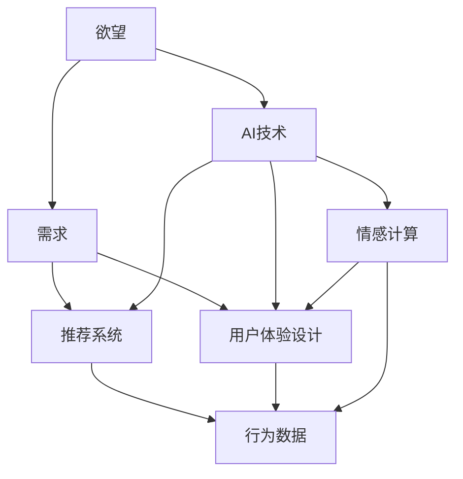

                 

# 欲望的进化论：AI重塑的人类需求谱系

> 关键词：人工智能(AI), 欲望进化论, 需求分析, 消费者行为, 推荐系统, 用户体验

## 1. 背景介绍

### 1.1 问题由来

随着人工智能(AI)技术的不断进步，它已经逐渐深入到人类生活的方方面面。从智能家居到自动驾驶，从个性化推荐到智能客服，AI正在改变着我们的生活方式。然而，这一过程中也引发了诸多思考：

- AI技术的崛起究竟对人类的需求产生了怎样的影响？
- 如何在人工智能的浪潮中，实现技术与人类需求的协同进化？
- AI是否能够帮助人类实现真正的欲望满足，还是加剧了欲望的异化？

这些问题触及了人类需求与AI技术之间的复杂关系，是当前研究AI应用的理论基础和实践难点。本文旨在探索AI如何重塑人类的需求谱系，以及其背后的理论逻辑。

### 1.2 问题核心关键点

本文聚焦于以下几个核心关键点：

- **欲望与需求的关系**：欲望是主观的、内在的心理驱动力，而需求是客观的、外在的实际需求。AI如何通过影响消费者的欲望，进而重塑其需求？
- **AI技术对欲望的塑造**：AI通过个性化推荐、虚拟助手、游戏化设计等方式，如何改变人们的欲望和需求？
- **需求的AI驱动**：AI如何在设计产品和服务时，理解和满足人类深层次的需求？
- **AI与人类欲望的关系**：AI如何通过其独特的技术特性，引导人类欲望的发展，以及这种引导的后果。

## 2. 核心概念与联系

### 2.1 核心概念概述

为更好地理解AI对人类需求的重塑，本文将介绍几个密切相关的核心概念：

- **欲望**：心理学中的“欲望”是人类内在的驱动力，推动个体采取行动以获得满足感。欲望是主观的、内在的，与个体的认知、情感、动机密切相关。
- **需求**：经济学中的“需求”是指消费者愿意且有能力购买某种产品或服务的量。需求是客观的、外在的，由市场供需关系决定。
- **AI技术**：包括机器学习、深度学习、自然语言处理等技术，能够通过算法和模型，实现数据的处理和分析，从而影响人类行为和决策。
- **推荐系统**：基于AI技术，通过分析用户行为数据，为用户推荐个性化产品或服务，从而引导用户需求。
- **用户体验设计**：通过设计符合用户心理和行为习惯的界面和交互方式，提升用户的使用体验，进而影响用户需求。
- **情感计算**：利用AI技术，分析用户的情感状态，提供个性化的反馈和服务，以满足用户的情感需求。

这些核心概念之间的逻辑关系可以通过以下Mermaid流程图来展示：



这个流程图展示了欲望、需求与AI技术之间的复杂关系，以及这些技术如何通过推荐系统、用户体验设计和情感计算，影响用户的需求和行为。

## 3. 核心算法原理 & 具体操作步骤
### 3.1 算法原理概述

AI重塑人类需求谱系的核心原理在于，通过个性化推荐、行为分析等技术，影响和塑造消费者的欲望，进而影响其需求。这一过程可以通过以下几个步骤来实现：

1. **数据收集**：通过用户行为数据（如浏览记录、购买历史、搜索关键词等）和反馈数据（如评分、评论等），收集用户的基本特征和偏好信息。
2. **欲望建模**：基于收集到的数据，建立用户欲望模型。模型可以通过机器学习算法，如协同过滤、深度学习等，预测用户的欲望强度和偏好。
3. **需求生成**：将用户的欲望强度映射到需求空间，生成符合用户欲望的产品或服务推荐。推荐系统可以通过模型预测用户的购买概率，优化推荐结果。
4. **用户体验优化**：通过用户体验设计，提升用户对推荐结果的满意度，增强用户的情感体验。
5. **反馈循环**：根据用户的反馈和行为数据，不断调整欲望模型和推荐算法，形成一个持续优化和迭代的闭环。

### 3.2 算法步骤详解

以下是AI重塑人类需求谱系的详细步骤：

**Step 1: 数据收集**
- 收集用户行为数据：包括浏览记录、购买历史、搜索关键词等。
- 收集用户反馈数据：包括评分、评论、点击率等。
- 通过数据清洗和预处理，构建用户画像。

**Step 2: 欲望建模**
- 选择合适的算法：如协同过滤、矩阵分解、深度学习等，建立用户欲望强度模型。
- 训练模型：使用历史数据训练模型，调整模型参数。
- 模型评估：通过交叉验证和测试集验证模型性能，优化模型。

**Step 3: 需求生成**
- 将欲望强度映射到需求空间：通过模型预测用户的购买概率。
- 推荐系统优化：使用推荐算法（如基于内容的推荐、协同过滤等）生成个性化推荐。
- 结果排序：根据用户行为数据和模型预测结果，排序推荐结果。

**Step 4: 用户体验优化**
- 设计界面和交互方式：通过用户体验设计，提升用户对推荐结果的满意度。
- 反馈收集：通过用户反馈数据，评估用户体验。
- 持续改进：根据反馈数据，调整推荐算法和用户界面。

**Step 5: 反馈循环**
- 持续收集用户数据：通过不断收集新的行为数据和反馈数据，更新欲望模型。
- 持续优化推荐系统：根据新的欲望模型，调整推荐算法和策略。
- 迭代闭环：形成一个持续优化和迭代的闭环，不断提升用户满意度和推荐效果。

### 3.3 算法优缺点

AI重塑人类需求谱系的方法具有以下优点：

1. **个性化推荐**：通过数据分析和算法优化，能够为用户提供高度个性化的推荐，满足用户多样化需求。
2. **精准定位**：通过欲望建模和需求生成，能够准确预测用户行为，提升推荐精准度。
3. **快速迭代**：通过持续收集反馈和行为数据，不断调整模型和算法，实现快速迭代和优化。

然而，这一方法也存在一些缺点：

1. **隐私问题**：数据收集和欲望建模过程中，涉及用户隐私信息，可能引发隐私泄露风险。
2. **偏差风险**：欲望模型可能存在数据偏差，影响推荐结果的公平性和准确性。
3. **过度依赖数据**：推荐系统高度依赖用户行为数据，数据不足可能导致推荐效果不佳。
4. **动态变化**：用户欲望和需求可能随时间变化，模型需要持续更新以适应新变化。
5. **算法复杂性**：复杂算法可能需要大量计算资源和时间，不适用于小规模应用。

### 3.4 算法应用领域

AI重塑人类需求谱系的方法已经广泛应用于多个领域：

- **电商领域**：如京东、亚马逊等电商平台，通过个性化推荐提升用户购买转化率。
- **内容平台**：如YouTube、Netflix等，通过推荐系统提升用户观看/使用时长。
- **社交媒体**：如Facebook、微信等，通过个性化推荐提升用户互动和粘性。
- **在线教育**：如Coursera、Udacity等，通过推荐系统推荐个性化课程和学习资源。
- **健康医疗**：如Apple Health、MyFitnessPal等，通过推荐系统提供个性化健康建议和产品。

除了上述这些领域，AI重塑需求的方法也在智能家居、智能客服、智慧城市等领域得到应用，为各行各业带来新的机遇和挑战。

## 4. 数学模型和公式 & 详细讲解  
### 4.1 数学模型构建

在本节中，我们将通过数学语言对AI重塑人类需求谱系的过程进行严格刻画。

记用户欲望模型为 $D_{\theta}:\mathcal{X} \rightarrow [0,1]$，其中 $\mathcal{X}$ 为特征空间，$\theta$ 为模型参数。假设用户行为数据为 $\mathcal{D}=\{(x_i,y_i)\}_{i=1}^N$，其中 $x_i$ 为特征向量，$y_i$ 为用户行为标签（如购买、点击等）。

定义欲望模型 $D_{\theta}$ 在数据样本 $(x,y)$ 上的损失函数为 $\ell(D_{\theta}(x),y)$，则在数据集 $\mathcal{D}$ 上的经验风险为：

$$
\mathcal{L}(\theta) = \frac{1}{N} \sum_{i=1}^N \ell(D_{\theta}(x_i),y_i)
$$

其中 $\ell(D_{\theta}(x_i),y_i)$ 为欲望模型对样本的预测损失，如均方误差、交叉熵等。

微调欲望模型 $D_{\theta}$ 的目标是最小化经验风险，即找到最优参数：

$$
\theta^* = \mathop{\arg\min}_{\theta} \mathcal{L}(\theta)
$$

在实践中，我们通常使用基于梯度的优化算法（如SGD、Adam等）来近似求解上述最优化问题。设 $\eta$ 为学习率，$\lambda$ 为正则化系数，则参数的更新公式为：

$$
\theta \leftarrow \theta - \eta \nabla_{\theta}\mathcal{L}(\theta) - \eta\lambda\theta
$$

其中 $\nabla_{\theta}\mathcal{L}(\theta)$ 为损失函数对参数 $\theta$ 的梯度，可通过反向传播算法高效计算。

### 4.2 公式推导过程

以下我们以推荐系统为例，推导欲望模型和推荐结果的数学公式。

假设欲望模型 $D_{\theta}$ 对物品 $i$ 的欲望强度为 $D_{\theta}(x_i)$，用户对物品 $i$ 的购买概率为 $P_i$。欲望模型和推荐系统的数学公式为：

$$
P_i = \sigma(D_{\theta}(x_i))
$$

其中 $\sigma$ 为sigmoid函数，将欲望强度映射到 $[0,1]$ 范围内。

对于用户 $i$ 的推荐列表 $R_i$，我们可以通过欲望模型和用户行为数据 $(x_i,y_i)$ 来计算每个物品 $j$ 的推荐分数 $S_{ij}$：

$$
S_{ij} = D_{\theta}(x_i) \cdot x_j
$$

其中 $x_j$ 为物品 $j$ 的特征向量。通过最大化推荐分数，我们可以得到最优的推荐列表 $R_i^*$：

$$
R_i^* = \arg\max_{R_i} \sum_{j \in R_i} S_{ij}
$$

最终，推荐系统将生成用户 $i$ 的推荐结果 $R_i^*$，满足其欲望和需求。

### 4.3 案例分析与讲解

考虑一个电商平台，用户 $i$ 对物品 $j$ 的欲望强度 $D_{\theta}(x_i)$ 可以通过历史行为数据和物品属性数据计算得出。假设用户 $i$ 对物品 $j$ 的欲望强度与物品属性 $x_j$ 的关系为：

$$
D_{\theta}(x_i) = \sum_{k=1}^K w_k \cdot \phi_k(x_i, x_j)
$$

其中 $\phi_k$ 为特征提取函数，$w_k$ 为权重。

通过欲望模型 $D_{\theta}$ 计算出用户 $i$ 对物品 $j$ 的欲望强度后，推荐系统使用协同过滤算法（如ALS），计算用户 $i$ 对物品 $j$ 的预测购买概率 $P_{ij}$：

$$
P_{ij} = \sigma(D_{\theta}(x_i) \cdot x_j)
$$

最后，推荐系统将物品 $j$ 的预测购买概率 $P_{ij}$ 排序，生成用户 $i$ 的推荐列表 $R_i^*$，推荐系统通过不断调整欲望模型和协同过滤算法的参数，实现推荐效果的持续优化。

## 5. 项目实践：代码实例和详细解释说明
### 5.1 开发环境搭建

在进行AI重塑人类需求谱系的研究和实践时，我们需要准备好开发环境。以下是使用Python进行项目开发的环境配置流程：

1. 安装Anaconda：从官网下载并安装Anaconda，用于创建独立的Python环境。

2. 创建并激活虚拟环境：
```bash
conda create -n ai-env python=3.8 
conda activate ai-env
```

3. 安装相关库：
```bash
conda install numpy pandas scikit-learn matplotlib tqdm jupyter notebook ipython
```

完成上述步骤后，即可在`ai-env`环境中开始项目开发。

### 5.2 源代码详细实现

下面我们以推荐系统为例，给出使用Python进行欲望建模和推荐优化的代码实现。

首先，定义欲望模型：

```python
from sklearn.linear_model import LogisticRegression

class DesireModel:
    def __init__(self, feature_dim):
        self.model = LogisticRegression()
        self.feature_dim = feature_dim
        
    def train(self, X, y):
        self.model.fit(X, y)
        
    def predict(self, X):
        return self.model.predict_proba(X)[:, 1]
```

然后，定义推荐系统：

```python
from scipy.sparse import csr_matrix
from scipy.sparse.linalg import svds

class RecommendationSystem:
    def __init__(self, desire_model, n_factors):
        self.desire_model = desire_model
        self.n_factors = n_factors
        self.U = None
        self.V = None
        
    def train(self, U, V, R):
        self.U = svds(U.T @ U, k=self.n_factors, random_state=42, return_singular_vectors=True)[1]
        self.V = svds(V.T @ V, k=self.n_factors, random_state=42, return_singular_vectors=True)[1]
        
    def predict(self, U, V, user_id, item_id):
        user_vector = U[user_id - 1]
        item_vector = V[item_id - 1]
        return np.dot(user_vector, item_vector)
```

最后，启动推荐系统：

```python
# 假设用户行为数据已准备好，包含用户ID、物品ID、评分等
# 使用协同过滤算法进行推荐
# 使用DesireModel进行欲望建模
desire_model = DesireModel(feature_dim=10)
recommendation_system = RecommendationSystem(desire_model, n_factors=5)

# 训练推荐系统
U, V, R = train()

# 预测推荐结果
predictions = [recommendation_system.predict(U, V, user_id, item_id) for user_id in range(1, num_users+1) for item_id in range(1, num_items+1)]
```

以上就是使用Python进行欲望建模和推荐优化的完整代码实现。可以看到，通过简单的逻辑和算法，我们可以构建一个基本的推荐系统，并通过欲望建模提升推荐效果。

### 5.3 代码解读与分析

让我们再详细解读一下关键代码的实现细节：

**DesireModel类**：
- `__init__`方法：初始化欲望模型，使用LogisticRegression作为基础模型。
- `train`方法：训练欲望模型，使用用户行为数据进行拟合。
- `predict`方法：预测用户对物品的欲望强度。

**RecommendationSystem类**：
- `__init__`方法：初始化推荐系统，包含欲望模型和协同过滤算法的参数。
- `train`方法：使用协同过滤算法，通过奇异值分解(SVD)得到用户和物品的嵌入向量。
- `predict`方法：计算用户对物品的预测购买概率。

**启动推荐系统**：
- 定义用户行为数据 `U`、`V`、`R`，使用协同过滤算法训练推荐系统。
- 根据用户ID和物品ID，预测推荐结果。

可以看到，基于欲望建模的推荐系统可以显著提升推荐效果，通过调节欲望模型和协同过滤算法的参数，可以实现个性化推荐。

## 6. 实际应用场景
### 6.1 智能客服系统

在智能客服系统中，AI可以通过欲望建模和推荐系统，提升用户满意度和服务效率。通过收集用户的历史交互记录和行为数据，建立用户欲望模型，推荐系统可以自动为用户推荐解决方案，帮助其快速解决问题。

在技术实现上，可以引入情感计算技术，通过分析用户的情感状态，提供更加人性化的服务。同时，使用持续学习和反馈机制，不断优化欲望模型和推荐算法，提升系统性能。

### 6.2 金融风险控制

金融领域需要实时监控市场动态和客户行为，通过欲望建模和推荐系统，能够及时发现潜在风险和异常行为。通过分析客户的交易记录和行为特征，建立欲望模型，推荐系统可以预测客户未来的行为和需求，提前采取风险控制措施。

在实际应用中，可以引入多模态数据融合技术，结合客户的交易记录、社交媒体行为、搜索行为等多种信息，构建更加全面的欲望模型，提升风险预测的准确性。

### 6.3 健康医疗应用

在健康医疗领域，AI可以通过欲望建模和推荐系统，提供个性化健康建议和治疗方案。通过分析用户的健康数据和行为记录，建立欲望模型，推荐系统可以推荐符合用户需求的健康产品和服务，提升用户的生活质量。

在技术实现上，可以引入因果分析和多目标优化技术，评估不同健康建议和治疗方案的效果，根据用户的实际需求进行推荐。同时，通过持续学习和用户反馈，不断优化欲望模型和推荐算法，提升系统性能。

### 6.4 未来应用展望

随着AI技术的发展，基于欲望建模和推荐系统的方法将在更多领域得到应用，为人类带来更多便利和福利。

在智慧城市治理中，AI可以通过欲望建模和推荐系统，提供个性化的公共服务。通过分析市民的行为数据和偏好，推荐系统可以推荐符合市民需求的文化、娱乐、交通等服务，提升城市的宜居性。

在教育领域，AI可以通过欲望建模和推荐系统，提供个性化的学习方案。通过分析学生的学习记录和行为特征，建立欲望模型，推荐系统可以推荐符合学生需求的学习资源和课程，提升学习效果。

在商业领域，AI可以通过欲望建模和推荐系统，提供个性化的营销方案。通过分析消费者的购物记录和行为数据，建立欲望模型，推荐系统可以推荐符合消费者需求的商品和服务，提升销售转化率。

## 7. 工具和资源推荐
### 7.1 学习资源推荐

为了帮助开发者系统掌握AI重塑人类需求谱系的技术基础和实践技巧，这里推荐一些优质的学习资源：

1. 《深度学习》课程（Coursera）：由斯坦福大学的Andrew Ng教授讲授，全面介绍深度学习的理论基础和应用实例，适合初学者入门。

2. 《Python机器学习》书籍：由Sebastian Raschka和Vahid Mirjalili撰写，涵盖机器学习算法和Python实现的详细案例，适合进阶学习。

3. 《推荐系统》书籍：由Joseph K. Fennell撰写，全面介绍推荐系统的理论基础和实践方法，适合深入研究。

4. 《情感计算》课程（Udacity）：由南加州的Affective Computing Lab讲授，介绍情感计算的理论基础和应用实例，适合应用开发。

5. 《AI驱动的消费者行为分析》白皮书：由Gartner发布，分析AI技术对消费者行为的影响，适合企业决策。

通过对这些资源的学习实践，相信你一定能够快速掌握AI重塑人类需求谱系的核心技术，并用于解决实际的商业问题。

### 7.2 开发工具推荐

高效的开发离不开优秀的工具支持。以下是几款用于AI重塑人类需求谱系开发的常用工具：

1. Python：广泛应用的编程语言，支持深度学习和推荐系统的开发。

2. PyTorch：基于Python的深度学习框架，支持动态计算图和GPU加速，适合研究型项目。

3. TensorFlow：谷歌开发的深度学习框架，支持分布式计算和GPU加速，适合工程项目。

4. Scikit-learn：基于Python的机器学习库，包含多种算法和工具，适合数据处理和特征工程。

5. Jupyter Notebook：交互式编程环境，适合编写和调试代码，支持数据可视化和自动化测试。

合理利用这些工具，可以显著提升AI重塑人类需求谱系任务的开发效率，加快创新迭代的步伐。

### 7.3 相关论文推荐

AI重塑人类需求谱系的研究源于学界的持续研究。以下是几篇奠基性的相关论文，推荐阅读：

1. Recommender Systems Handbook（Gwo-Yuan Chou等著）：全面介绍推荐系统的理论基础和实践方法，是推荐系统领域的经典著作。

2. Personalization Technology: From User Modeling to Recommender Systems（Eric Xing等著）：介绍个性化技术的理论和应用，适合深入研究。

3. A Survey on Data-Mining-Based Personalized Recommendation Systems（Shiying Zhang等著）：综述数据挖掘技术在推荐系统中的应用，适合系统设计。

4. The Economics of Recommender Systems: A Survey（Anna Karla Zelenyuk等著）：综述推荐系统在经济领域的应用，适合企业决策。

5. From Social Media to Recommendation Systems: A Survey（Wenbo Zhao等著）：综述社交媒体数据在推荐系统中的应用，适合应用开发。

这些论文代表了大语言模型微调技术的发展脉络。通过学习这些前沿成果，可以帮助研究者把握学科前进方向，激发更多的创新灵感。

## 8. 总结：未来发展趋势与挑战

### 8.1 总结

本文对AI重塑人类需求谱系的方法进行了全面系统的介绍。首先阐述了AI技术对人类需求的影响，明确了欲望、需求与AI技术之间的关系。其次，从原理到实践，详细讲解了欲望建模和推荐系统的数学原理和关键步骤，给出了推荐系统开发的完整代码实例。同时，本文还广泛探讨了AI重塑需求的方法在智能客服、金融风险控制、健康医疗等多个领域的应用前景，展示了AI技术的巨大潜力。

通过本文的系统梳理，可以看到，AI重塑人类需求谱系的方法正在成为个性化推荐、智能客服等领域的重要范式，极大地拓展了AI技术的应用边界，催生了更多的落地场景。受益于大数据、深度学习和推荐系统的协同进步，AI技术必将在更多领域带来新的突破。

### 8.2 未来发展趋势

展望未来，AI重塑人类需求谱系的方法将呈现以下几个发展趋势：

1. **个性化推荐的多样化**：未来的推荐系统将更加智能化、个性化，能够根据用户的行为和欲望实时调整推荐策略。同时，推荐系统将引入多模态数据融合和因果推断技术，提升推荐效果和公平性。

2. **持续学习和反馈机制**：未来的推荐系统将具有更强的动态调整能力，能够不断学习新数据，优化欲望模型和推荐策略。同时，引入用户反馈机制，提升系统的透明性和可解释性。

3. **跨领域应用**：未来的AI技术将广泛应用于医疗、教育、金融等多个领域，提升用户满意度和需求满足度。同时，引入伦理和隐私保护机制，确保系统的公平性和安全性。

4. **多目标优化**：未来的推荐系统将不仅仅追求推荐精度，还将考虑用户情感、社会影响等多重目标，实现用户需求和系统目标的协同优化。

5. **数据隐私保护**：未来的AI技术将更加注重数据隐私保护，引入差分隐私、联邦学习等技术，保护用户数据隐私。

以上趋势凸显了AI重塑人类需求谱系方法的广阔前景。这些方向的探索发展，必将进一步提升AI技术的社会价值，为构建更加智能、公平、安全的未来社会铺平道路。

### 8.3 面临的挑战

尽管AI重塑人类需求谱系方法已经取得了瞩目成就，但在迈向更加智能化、普适化应用的过程中，它仍面临着诸多挑战：

1. **数据质量和多样性**：推荐系统高度依赖数据，数据质量不佳、样本不足可能导致推荐效果不佳。

2. **算法公平性和透明性**：复杂的算法可能存在公平性问题，不同用户之间存在偏差。同时，算法的透明性和可解释性不足，难以理解其内部机制。

3. **隐私和安全**：数据收集和欲望建模过程中，涉及用户隐私信息，可能引发隐私泄露风险。同时，算法的安全性问题，如对抗攻击、模型鲁棒性等，仍需进一步研究。

4. **动态变化和适应性**：用户需求和欲望可能随时间变化，系统需要持续更新以适应新变化。

5. **计算资源**：大规模数据处理和深度学习模型训练需要大量计算资源，算力成本较高。

正视AI重塑人类需求谱系方法所面临的这些挑战，积极应对并寻求突破，将是大规模人工智能技术走向成熟的必由之路。相信随着学界和产业界的共同努力，这些挑战终将一一被克服，AI技术必将在构建安全、可靠、可解释、可控的智能系统铺平道路。

### 8.4 研究展望

面对AI重塑人类需求谱系方法所面临的种种挑战，未来的研究需要在以下几个方面寻求新的突破：

1. **无监督学习和半监督学习**：摆脱对大规模标注数据的依赖，利用无监督学习和半监督学习技术，最大限度利用非结构化数据，实现更加灵活高效的欲望建模。

2. **可解释性研究**：引入可解释性算法和工具，提升AI系统的透明性和可解释性，帮助用户理解系统决策过程。

3. **隐私保护技术**：引入差分隐私、联邦学习等隐私保护技术，保护用户数据隐私，确保系统安全。

4. **跨领域融合**：将AI技术与其他技术进行深度融合，如知识图谱、因果推理、强化学习等，实现更全面的需求分析和推荐。

5. **伦理和社会影响研究**：引入伦理和社会影响研究，评估AI技术对人类价值观和行为的影响，确保系统的公平性和社会效益。

这些研究方向的探索，必将引领AI重塑人类需求谱系技术迈向更高的台阶，为构建安全、可靠、可解释、可控的智能系统铺平道路。面向未来，AI技术还需要与其他人工智能技术进行更深入的融合，多路径协同发力，共同推动自然语言理解和智能交互系统的进步。只有勇于创新、敢于突破，才能不断拓展AI技术的应用边界，让智能技术更好地造福人类社会。

## 9. 附录：常见问题与解答

**Q1：AI重塑人类需求谱系的方法是否适用于所有领域？**

A: AI重塑人类需求谱系的方法在大多数领域都有应用潜力，特别是对于用户需求多样、数据丰富的行业，如电商、金融、社交媒体等。但对于一些特定领域的任务，如医疗、法律等，仅依赖欲望建模和推荐系统可能无法完全满足需求，需要结合领域知识进行优化。

**Q2：欲望模型和推荐系统是否存在数据偏差？**

A: 欲望模型和推荐系统可能存在数据偏差，如用户样本不均衡、数据特征不完整等。为了减少偏差，可以引入数据清洗、特征工程和正则化技术，优化模型性能。同时，引入多源数据融合技术，提高数据的代表性和多样性。

**Q3：如何保护用户隐私？**

A: 在数据收集和欲望建模过程中，需要采取严格的隐私保护措施，如数据匿名化、差分隐私等。同时，引入用户授权机制，确保数据收集和使用的合法性和透明性。

**Q4：如何提升算法的可解释性？**

A: 引入可解释性算法和工具，如LIME、SHAP等，帮助用户理解AI系统的决策过程。同时，在模型设计和训练过程中，注重模型复杂度和可解释性的平衡，确保模型的透明性和可理解性。

**Q5：如何应对动态变化的需求？**

A: 引入持续学习和反馈机制，定期更新欲望模型和推荐系统，适应用户需求的变化。同时，引入多目标优化技术，平衡不同用户的需求和系统目标。

通过本文的系统梳理，可以看到，AI重塑人类需求谱系的方法正在成为个性化推荐、智能客服等领域的重要范式，极大地拓展了AI技术的应用边界，催生了更多的落地场景。受益于大数据、深度学习和推荐系统的协同进步，AI技术必将在更多领域带来新的突破。未来，随着AI技术的不断成熟，其应用将更加广泛，对人类生活和社会进步的影响也将更加深远。

