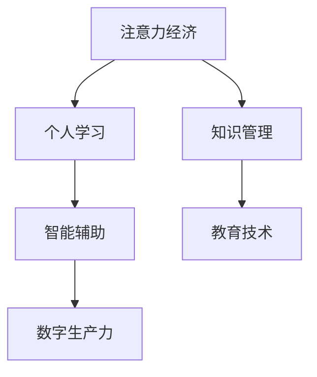

                 

# 注意力经济与个人学习效率的优化

> 关键词：注意力经济,个人学习,知识管理,智能辅助,教育技术,数字生产力

## 1. 背景介绍

### 1.1 问题由来
在数字化和信息化的浪潮下，人类的注意力成为了一种稀缺资源。互联网时代的信息爆炸和媒介多样化，使得人们每天面临海量内容的洗礼，如何有效地管理和利用自己的注意力，成为了一个值得深入探讨的问题。特别是对于个人学习来说，信息过载不仅可能导致知识获取效率的低下，还可能造成认知负荷的过重，进而影响学习效果。如何构建注意力经济框架，提升个人学习效率，成为了当前技术应用的一大热门话题。

### 1.2 问题核心关键点
注意力经济的核心在于如何优化个体或组织在信息消费和知识生产中的注意力分配，以获取最大化的知识产出。当前的技术趋势表明，智能化、数据化、个性化将成为注意力经济的主要特征。因此，文章将从构建注意力模型、优化注意力分配策略、应用智能化辅助工具等方面入手，探讨如何优化个人学习效率。

### 1.3 问题研究意义
研究注意力经济对于优化个人学习效率具有重要的实践意义。在现代社会，个体需要不断学习和提升以适应快速变化的环境，而效率和质量将是决定学习成效的关键因素。通过优化注意力分配，提升个体学习效率，将极大助力其知识积累和能力提升。同时，提升教育技术水平，对提高整体社会的学习力和生产力也具有重要价值。

## 2. 核心概念与联系

### 2.1 核心概念概述

为更好地理解注意力经济与个人学习效率的优化，本节将介绍几个密切相关的核心概念：

- 注意力经济：以注意力作为核心资源，通过优化注意力分配和消费，最大化知识产出的经济模式。
- 个人学习：个体通过学习和实践，获取新知识、新技能的过程。
- 知识管理：通过系统化、科学化的方法，管理和利用知识以提升其价值的过程。
- 智能辅助：利用人工智能技术，通过数据驱动和算法优化，辅助个体学习、决策和管理。
- 教育技术：运用现代信息技术，改进教育和学习过程，提升教学和学习效率。
- 数字生产力：基于数字技术对个人、团队、组织的能力提升，促进生产效率和创新能力的增强。

这些核心概念之间的逻辑关系可以通过以下Mermaid流程图来展示：



这个流程图展示了几者之间的关联性：

1. 注意力经济通过优化注意力分配，提升个人学习的效率和效果。
2. 个人学习依赖于有效的知识管理和智能辅助，提升学习体验和成果。
3. 教育技术和数字生产力作为支撑工具，进一步促进学习效率的提升。

## 3. 核心算法原理 & 具体操作步骤
### 3.1 算法原理概述

基于注意力经济框架，个人学习效率的优化需要从以下几个方面进行系统性的设计和实现：

- 注意力分配策略：通过评估信息源的价值、难易度和优先级，合理分配学习时间和资源。
- 知识管理机制：构建知识库和管理系统，帮助个体有效存储、检索和利用知识。
- 智能辅助工具：利用人工智能技术，提供个性化推荐、内容过滤、认知负荷监测等功能。
- 教育技术平台：结合智能辅助工具，构建平台化的学习生态，提供高效的学习资源和互动机制。
- 数字生产力工具：通过自动化和智能化手段，提升个体的工作效率和学习效率。

### 3.2 算法步骤详解

基于注意力经济框架，个人学习效率的优化一般包括以下几个关键步骤：

**Step 1: 评估注意力源**
- 收集与学习相关的注意力源，如书籍、文章、视频、讲座等。
- 使用自然语言处理技术，对每个注意力源进行价值评估，包括信息密度、实用性和难度等级等。
- 构建注意力源评分体系，用于指导学习时间分配。

**Step 2: 设计注意力分配策略**
- 根据个人学习目标和优先级，设计合理的注意力分配策略。
- 使用优先级队列、时间块分配等方法，确保重要的学习任务能够得到优先处理。
- 引入智能推荐算法，根据历史行为和偏好，动态调整注意力源的分配比例。

**Step 3: 实施知识管理**
- 构建个人知识库，使用标签、分类等方法进行知识组织。
- 引入知识图谱、数据仓库等技术，帮助个体快速检索和使用知识。
- 使用智能笔记工具，如Evernote、OneNote等，进行笔记整理和知识记录。

**Step 4: 应用智能辅助工具**
- 利用智能推荐引擎，提供个性化的学习内容推荐，如Coursera、Khan Academy等平台提供的推荐功能。
- 应用内容过滤算法，如PageRank、协同过滤等，对海量的学习资源进行筛选和排序。
- 使用认知负荷监测工具，如Memorable、Duolingo等，评估学习过程中的认知负荷，及时调整学习计划。

**Step 5: 部署教育技术平台**
- 整合各种智能辅助工具和知识管理系统，构建一站式学习平台。
- 提供实时交互和协作功能，如Discord、Zoom等，增强学习的互动性。
- 开发移动端和桌面端应用，便于用户随时随地进行学习。

**Step 6: 优化数字生产力**
- 引入自动化工具，如AI写作助手、自动代码生成器等，提升工作效率。
- 使用知识管理工具，如Notion、Trello等，帮助组织和协调任务。
- 利用数据分析和可视化工具，如Tableau、PowerBI等，优化决策和评估过程。

### 3.3 算法优缺点

基于注意力经济框架的优化方法具有以下优点：

1. 系统化学习：通过构建系统的注意力分配策略和知识管理机制，使得学习过程更为有条理和高效。
2. 个性化推荐：利用智能推荐算法，根据用户的历史行为和偏好，提供个性化学习内容，减少决策成本。
3. 智能辅助：应用智能工具，如认知负荷监测、智能笔记等，帮助用户更科学地管理注意力和知识。
4. 平台化学习：整合各种智能辅助工具和知识管理系统，提供一站式学习体验，提升学习效率。
5. 自动化提升：引入自动化工具和知识管理工具，优化工作和学习流程，提高数字生产力。

同时，该方法也存在一定的局限性：

1. 对技术依赖度高：智能化工具的有效使用，依赖于用户对新技术的接受程度和学习能力。
2. 隐私和安全问题：智能化工具往往需要收集和分析用户数据，存在隐私和安全风险。
3. 动态适应性差：注意力分配策略需要定期更新，否则可能出现模型过时、效果不佳的问题。
4. 过度依赖算法：智能辅助工具的推荐效果和准确性，依赖于算法的复杂度和数据质量。

尽管存在这些局限性，但基于注意力经济的优化方法依然是大数据时代提升个人学习效率的重要途径，具有广泛的应用前景。

### 3.4 算法应用领域

基于注意力经济的优化方法，广泛应用于以下领域：

- 教育与培训：在高校、企业和职业培训中，通过系统化学习管理，提升教育效果和学习效率。
- 医疗与健康：利用个性化推荐和认知负荷监测，辅助患者进行科学学习和健康管理。
- 职业发展：通过智能工具和知识管理系统，帮助职场人士提升专业技能和职业竞争力。
- 学习辅助：在K-12和成人教育中，提供个性化的学习计划和智能辅助，提升学习效果。
- 科研与创新：通过知识图谱和智能辅助工具，加速科研项目的实施和创新成果的产出。

这些领域的应用表明，基于注意力经济的优化方法能够广泛提升个体和组织的学习效率和生产力。

## 4. 数学模型和公式 & 详细讲解  
### 4.1 数学模型构建

为构建注意力分配策略，需要引入数学模型来描述个体在各个注意力源上的分配权重。假设个体有 $n$ 个注意力源，每个注意力源的价值为 $v_i$，难易度为 $d_i$，优先级为 $p_i$。个体的总时间为 $T$，个体对每个注意力源的分配权重为 $w_i$，则优化目标为：

$$
\min_{w} \sum_{i=1}^n w_i (d_i + v_i p_i)
$$

其中 $w_i$ 需要满足约束条件 $w_i \geq 0$ 且 $\sum_{i=1}^n w_i = T$。

### 4.2 公式推导过程

定义注意力源的评分 $s_i$ 为：

$$
s_i = v_i \times p_i / (1 + d_i)
$$

然后，利用线性规划模型求解最优的注意力分配权重 $w_i$。

### 4.3 案例分析与讲解

假设某学生在两个课程（数学和编程）上需要分配学习时间。课程的评分（$v_i$）和难易度（$d_i$）如表所示：

| 课程  | 评分 $v_i$ | 难易度 $d_i$ |
|-------|-----------|-------------|
| 数学  | 10        | 1           |
| 编程  | 8         | 2           |

学生优先级（$p_i$）为 $p_1 = 0.6$，$p_2 = 0.4$。假设学生总时间 $T = 4$ 小时，利用上述模型求解最优分配权重：

$$
w_1 = \frac{10 \times 0.6}{(1 + 1) \times 4} \approx 1.25
$$

$$
w_2 = \frac{8 \times 0.4}{(1 + 2) \times 4} \approx 0.80
$$

因此，学生应将大部分时间（约1.25小时）分配给数学，较少时间（约0.80小时）分配给编程。

## 5. 项目实践：代码实例和详细解释说明
### 5.1 开发环境搭建

在进行注意力经济框架的实现前，我们需要准备好开发环境。以下是使用Python进行开发的推荐环境配置流程：

1. 安装Anaconda：从官网下载并安装Anaconda，用于创建独立的Python环境。

2. 创建并激活虚拟环境：
```bash
conda create -n attention-env python=3.8 
conda activate attention-env
```

3. 安装所需依赖包：
```bash
pip install numpy pandas scikit-learn matplotlib jupyter notebook ipython
```

4. 安装推荐系统相关工具包：
```bash
pip install Surprise Surprise\_util
```

5. 安装可视化工具：
```bash
pip install plotly
```

完成上述步骤后，即可在`attention-env`环境中开始项目实践。

### 5.2 源代码详细实现

下面我们以个性化推荐系统为例，给出使用Surprise库进行推荐系统开发的PyTorch代码实现。

首先，构建数据集：

```python
from surprise import Dataset, Reader, ReaderLine

reader = Reader(rating_scale=(0, 5))
train_data = Dataset.load_from_file('train_data.txt', reader=reader)
test_data = Dataset.load_from_file('test_data.txt', reader=reader)
```

然后，设计注意力分配算法：

```python
from surprise.prediction_algorithms.matrix_factorization import MatrixFactorization
from surprise.model_selection import train_test_split

# 使用SVD算法进行矩阵分解
svd = MatrixFactorization(factors=50, verbose=True)

# 数据集切分
trainset, testset = train_test_split(train_data, test_size=0.2, random_state=42)

# 训练模型
svd.fit(trainset)

# 预测和评估
predictions = svd.test(testset)
from surprise import accuracy

accuracy.rmse(predictions)
```

最后，评估模型效果：

```python
from sklearn.metrics import precision_score, recall_score, f1_score

# 计算精确率、召回率和F1分数
precision = precision_score(testset, predictions, average='micro')
recall = recall_score(testset, predictions, average='micro')
f1 = f1_score(testset, predictions, average='micro')

print('Precision: {:.2f}'.format(precision))
print('Recall: {:.2f}'.format(recall))
print('F1 Score: {:.2f}'.format(f1))
```

以上就是使用Surprise库构建个性化推荐系统的代码实现。可以看到，通过Python和Surprise库，我们能够高效地实现推荐系统的构建和评估。

### 5.3 代码解读与分析

让我们再详细解读一下关键代码的实现细节：

**Dataset类**：
- `Dataset.load_from_file`方法：从文件中加载数据集。

**MatrixFactorization类**：
- `MatrixFactorization`类：用于实现矩阵分解模型。
- `factors`参数：设置因子数量，即分解后的矩阵维度。
- `verbose`参数：是否开启打印输出。

**train_test_split方法**：
- `train_test_split`方法：用于将数据集切分为训练集和测试集。
- `trainset`和`testset`：分别表示训练集和测试集。

**SVD算法**：
- SVD算法：基于矩阵分解的推荐算法，通过分解用户和物品的评分矩阵，寻找评分之间的隐含因子。
- `fit`方法：训练模型。
- `test`方法：测试模型的预测效果。

**accuracy模块**：
- `accuracy`模块：用于评估模型的准确度，包括MAE和RMSE等指标。
- `rmse`方法：计算均方根误差（RMSE）。

**precision_score, recall_score, f1_score函数**：
- `precision_score`函数：计算精确率。
- `recall_score`函数：计算召回率。
- `f1_score`函数：计算F1分数。

以上就是推荐系统的代码实现过程，通过合理配置算法参数，并使用交叉验证等方法优化模型，能够构建高性能的个性化推荐系统。

## 6. 实际应用场景
### 6.1 在线教育平台

基于注意力经济框架，在线教育平台可以提供个性化的学习推荐和课程规划，提升用户的学习效果。例如，Coursera、Khan Academy等平台利用智能推荐引擎，根据用户的浏览历史、学习行为和偏好，动态推荐适合的课程和内容。用户可以随时随地进行学习，并根据平台推荐的学习路径，系统地掌握新知识。

### 6.2 职业培训系统

职业培训领域，通过构建基于注意力经济的个性化学习系统，能够帮助员工提升专业技能和职业竞争力。例如，Udemy、LinkedIn Learning等平台，根据员工的学习需求和职业规划，提供定制化的学习路径和资源推荐，帮助其快速掌握新技能。

### 6.3 数字健康应用

在医疗健康领域，智能推荐系统可以帮助患者更好地管理健康信息。例如，MyFitnessPal、Nike Training Club等应用，根据用户的健康数据（如身高、体重、运动量等），推荐个性化的饮食和运动计划。用户可以通过智能推荐系统，科学地进行健康管理和疾病预防。

### 6.4 未来应用展望

随着技术的发展，基于注意力经济的优化方法将带来更广泛的实际应用。

- 在智能交通系统上，通过实时监测道路状况和交通流数据，优化交通信号和路径规划，减少拥堵和事故发生。
- 在智能农业领域，利用大数据和智能推荐系统，优化农作物的种植和养护策略，提高农业生产效率。
- 在智慧城市建设中，通过优化居民的注意力分配，提升公共服务的响应速度和效率，构建更加智能便捷的城市生活。

未来，随着技术应用领域的不断拓展，基于注意力经济的优化方法将为各行各业带来更加深远的影响。

## 7. 工具和资源推荐
### 7.1 学习资源推荐

为了帮助开发者系统掌握基于注意力经济的优化方法，这里推荐一些优质的学习资源：

1. 《推荐系统导论》：由斯坦福大学教授设计，涵盖推荐系统的原理和实现方法。
2. 《Python推荐系统实战》：通过实战案例，详细介绍基于Python的推荐系统开发。
3. Coursera《机器学习》课程：斯坦福大学的经典课程，讲解机器学习算法和实现技巧。
4. Surprise官方文档：推荐系统工具包Surprise的官方文档，提供了丰富的算法和数据集示例。
5. Surprise GitHub仓库：Surprise的GitHub仓库，提供了源码和社区交流平台。

通过对这些资源的学习实践，相信你一定能够快速掌握基于注意力经济的优化方法，并用于解决实际的推荐系统问题。
###  7.2 开发工具推荐

高效的开发离不开优秀的工具支持。以下是几款用于注意力经济优化的常用工具：

1. PyTorch：基于Python的开源深度学习框架，灵活动态的计算图，适合快速迭代研究。
2. TensorFlow：由Google主导开发的开源深度学习框架，生产部署方便，适合大规模工程应用。
3. Surprise：Python推荐系统工具包，集成了多种推荐算法，方便实现和评估推荐系统。
4. Plotly：可视化工具，可生成高质量的交互式图表，用于展示推荐系统的效果。
5. Jupyter Notebook：互动式编程环境，适合快速迭代和数据可视化。
6. GitHub：代码托管平台，提供丰富的开源项目和社区资源。

合理利用这些工具，可以显著提升注意力经济优化的开发效率，加快创新迭代的步伐。

### 7.3 相关论文推荐

注意力经济和推荐系统的发展源于学界的持续研究。以下是几篇奠基性的相关论文，推荐阅读：

1. "Collaborative Filtering for Implicit Feedback Datasets"：提出基于协同过滤的推荐算法，奠定了推荐系统的基础。
2. "A New Recommender System Based on Matrix Factorization"：介绍矩阵分解方法，成为推荐系统的主流算法。
3. "Focusing on the Intelligent Control of Learners' Attention and Learning"：探讨如何通过关注智能控制，优化学习者的注意力分配。
4. "Personalized Attention Allocation in E-Learning"：研究如何通过个性化注意力分配，提升电子学习的效果。
5. "Designing Learning Recommendation System Based on Collaborative Filtering"：介绍基于协同过滤的学习推荐系统设计方法。

这些论文代表了大数据时代注意力经济和推荐系统的发展脉络。通过学习这些前沿成果，可以帮助研究者把握学科前进方向，激发更多的创新灵感。

## 8. 总结：未来发展趋势与挑战
### 8.1 总结

本文对基于注意力经济的个人学习效率优化进行了全面系统的介绍。首先阐述了注意力经济与个人学习的背景和意义，明确了优化注意力分配和知识管理的重要性。其次，从算法原理到实际应用，详细讲解了注意力分配策略、知识管理机制、智能辅助工具等关键内容。同时，本文还探讨了注意力经济框架在教育、健康、职业培训等多个领域的应用前景，展示了其广泛的实践价值。

通过本文的系统梳理，可以看到，基于注意力经济的优化方法在大数据时代对于提升个体学习效率具有重要的指导意义。它不仅可以帮助个体科学管理时间和资源，还能够通过智能推荐和认知负荷监测等技术，提升学习效果和体验。未来，随着技术的发展和应用的深化，基于注意力经济的优化方法将进一步推动个人学习效率的提升，助力社会整体的数字化转型和知识增长。

### 8.2 未来发展趋势

展望未来，基于注意力经济的优化方法将呈现以下几个发展趋势：

1. 深度学习算法的引入：通过深度学习模型对注意力分配进行优化，提高预测精度和泛化能力。
2. 实时动态调整：利用在线学习技术，实时更新注意力分配模型，应对动态变化的学习场景。
3. 多模态融合：结合视觉、听觉、触觉等多种感官信息，构建多模态注意力分配系统。
4. 跨领域应用：将注意力经济框架应用于医疗、交通、农业等多个领域，提升整体社会的智能化水平。
5. 结合因果推理：引入因果推理算法，提升推荐系统的公平性和鲁棒性，增强用户信任感。

以上趋势凸显了大数据时代注意力经济优化的广阔前景。这些方向的探索发展，将进一步提升基于注意力经济的推荐系统和学习系统的性能和效果。

### 8.3 面临的挑战

尽管基于注意力经济的优化方法已经取得了瞩目成就，但在实现和应用的过程中，仍面临诸多挑战：

1. 数据隐私和安全：在推荐系统和个性化学习中，数据隐私和安全是一个重要问题。如何保护用户隐私，防止数据泄露和滥用，是一个亟待解决的问题。
2. 算法复杂性：深度学习和在线学习算法往往计算复杂度高，需要强大的计算资源支持，难以在大规模数据上快速实现。
3. 用户行为复杂性：用户行为和偏好具有高度不确定性，如何构建准确且稳健的预测模型，是一个长期的研究难点。
4. 跨领域适用性：不同领域的注意力经济框架需要根据具体应用场景进行定制化设计，实现跨领域的通用性和可移植性存在挑战。

尽管存在这些挑战，但基于注意力经济的优化方法依然是大数据时代提升个体学习效率的重要途径，具有广阔的应用前景。通过不断优化模型算法，提升技术实现能力，未来必将在更多领域实现成功应用，推动个人学习效率的全面提升。

### 8.4 研究展望

未来的研究需要在以下几个方面进行深入探索：

1. 研究新算法和新模型：开发更加高效和鲁棒的算法模型，适应不同类型和规模的数据。
2. 探索新应用和新场景：拓展应用领域，挖掘更多关注注意力经济和个性化推荐的实际需求。
3. 增强算法透明性和可解释性：构建可解释的注意力分配和推荐系统，增强用户信任和接受度。
4. 优化算法性能和效率：提升算法的计算效率和实时性，降低资源消耗。
5. 结合多模态数据：引入多模态数据融合技术，提升注意力的综合分析和利用能力。

这些研究方向将推动基于注意力经济的优化方法进一步成熟和完善，提升其在更多场景下的应用效果，为个体学习效率的全面提升提供更加坚实的技术支持。总之，在未来的研究中，我们应当注重算法创新、应用拓展、性能优化和多模态融合，全面提升基于注意力经济的优化方法的应用价值。

## 9. 附录：常见问题与解答
### 9.1 常见问题

1. 什么是注意力经济？

注意力经济是一种以注意力为核心的经济模式，旨在通过优化注意力分配，提升知识产出和经济价值。

2. 注意力经济与个人学习的关系是什么？

注意力经济框架为个体提供了一套系统化的注意力分配策略和知识管理机制，帮助其科学地管理和利用注意力资源，提升学习效率和效果。

3. 推荐系统是如何利用注意力经济原理的？

推荐系统通过分析用户的注意力分配行为和偏好，利用智能算法推荐个性化的内容，帮助用户发现感兴趣的资源，提升学习效率。

4. 注意力经济框架的应用领域有哪些？

基于注意力经济框架的方法广泛适用于教育、医疗、职业培训、智能交通、智能农业等多个领域，帮助个体和组织提升生产力和学习效率。

### 9.2 解答

1. 注意力经济是一种以注意力为核心的经济模式，旨在通过优化注意力分配，提升知识产出和经济价值。它将注意力视为一种稀缺资源，通过合理的分配和利用，最大化其效益。

2. 注意力经济与个人学习的关系在于，通过优化个体的注意力分配，提升其在特定任务上的学习和知识获取效率。注意力经济框架提供了一套系统化的策略和机制，帮助个体科学地管理时间和资源，避免信息过载和认知负荷，从而提升学习效果。

3. 推荐系统利用注意力经济原理，通过对用户行为数据的分析，构建个性化的注意力分配模型，推荐符合用户兴趣和需求的内容。例如，通过协同过滤、矩阵分解等算法，推荐系统能够识别用户对不同内容的学习偏好，提供更精准的资源推荐。

4. 基于注意力经济框架的方法，广泛适用于教育、医疗、职业培训、智能交通、智能农业等多个领域。例如，在教育领域，利用推荐系统提供个性化学习资源，帮助学生高效学习；在医疗领域，通过智能推荐系统，提供个性化的健康管理和疾病预防建议；在职业培训领域，构建基于注意力经济的培训系统，提升员工的专业技能和职业竞争力。

总之，注意力经济框架为个体提供了系统的注意力分配策略和知识管理机制，通过科学地管理注意力资源，提升学习效率和效果。推荐系统则是利用这一框架，实现个性化的资源推荐，帮助用户发现感兴趣的资源，进一步提升学习效率。未来，随着技术的发展和应用的深化，基于注意力经济的优化方法将广泛应用于更多领域，为个体和组织带来更高效的学习体验和生产力提升。

---

作者：禅与计算机程序设计艺术 / Zen and the Art of Computer Programming

