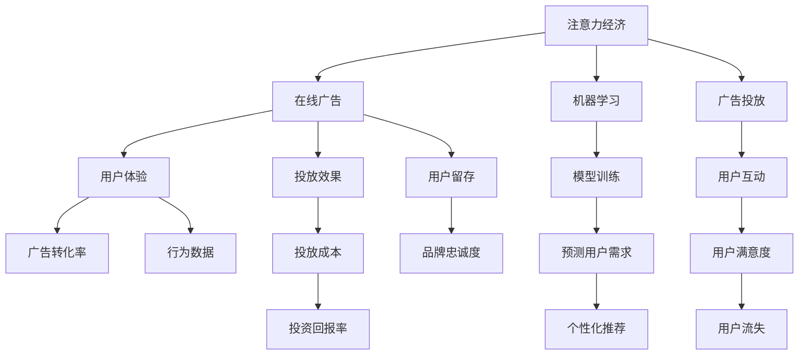

                 

# 注意力经济与在线广告目标：在不牺牲用户体验的情况下有效吸引受众

> 关键词：注意力经济, 在线广告, 用户体验, 广告转化率, 行为数据, 机器学习, 模型训练

## 1. 背景介绍

### 1.1 问题由来

随着互联网的迅猛发展，数字营销领域迎来了前所未有的繁荣。越来越多的企业和品牌利用在线广告向目标受众推广，希望通过精准投放吸引潜在客户，提升品牌知名度和市场占有率。然而，尽管数字化广告的预算投入逐年增加，实际转化效果却不尽如人意。传统点击率(CTR)等指标已无法全面反映广告的真实效果，用户体验(UX)逐渐成为广告投放的重要考量。

当前，广告主和用户之间存在信息不对称。用户面对海量的广告信息，往往忽视其真实意图，而广告主为了追求高点击率，往往忽略用户真实需求，导致广告的实际转化率低下。同时，广告主盲目投放不仅浪费了大量预算，还造成了用户体验的下降，进一步拉低了广告的整体效果。如何在提升广告转化率的同时，最大程度地保障用户体验，成为了数字营销领域亟需解决的难题。

### 1.2 问题核心关键点

要解决这个问题，首先需要明确以下核心关键点：

- 如何通过机器学习模型挖掘用户行为数据，预测其真实需求，从而实现精准投放？
- 如何在广告投放过程中，动态调整投放策略，提升用户体验，避免过多打扰？
- 如何在保持广告精准化的同时，最大化提升广告的转化率？
- 如何构建有效的用户画像，并实现广告的个性化推荐？

### 1.3 问题研究意义

研究注意力经济与在线广告目标，对于优化广告投放策略，提升广告转化率，改善用户体验，具有重要意义：

1. 提升广告效果：通过精确挖掘用户需求，优化广告内容和形式，有助于提升广告的实际转化率，最大化广告投放效果。
2. 优化用户互动：合理调整广告投放策略，避免过多打扰，有助于提升用户对广告的接受度，改善广告的整体效果。
3. 降低投放成本：通过机器学习算法进行智能化决策，避免盲目投放，有助于降低广告投放的预算浪费，提高广告投资回报率。
4. 提升用户满意：优化用户体验，改善用户互动，有助于增强用户粘性，提升品牌忠诚度。

## 2. 核心概念与联系

### 2.1 核心概念概述

为更好地理解注意力经济与在线广告目标，本节将介绍几个密切相关的核心概念：

- 注意力经济（Attention Economy）：指在信息爆炸的互联网时代，用户对于信息获取的注意力的稀缺性。广告主通过各种手段争夺用户的注意力，从而提升品牌影响力。
- 在线广告（Online Advertising）：指通过互联网媒介，向目标用户群体展示广告信息的营销方式。在线广告包括展示广告、视频广告、横幅广告等形式。
- 用户体验（User Experience, UX）：指用户在使用产品或服务过程中，对其的满意度、便捷度和愉悦度的综合评价。用户体验是衡量广告效果的重要指标。
- 广告转化率（Conversion Rate, CR）：指广告投放后，用户完成预设目标（如购买、注册等）的比例。广告转化率是广告效果的核心指标。
- 行为数据（Behavioral Data）：指用户在网站或应用中的操作行为数据，包括点击、浏览、停留时间等。行为数据是用户画像和广告优化的重要依据。
- 机器学习（Machine Learning, ML）：指通过算法让计算机系统具备从数据中自动学习的能力。机器学习模型通过数据训练，能够预测用户行为，优化广告投放。

这些核心概念之间的逻辑关系可以通过以下Mermaid流程图来展示：



这个流程图展示了一系列概念之间的内在联系：

1. 注意力经济引导在线广告的投放策略，从而影响用户体验。
2. 在线广告通过机器学习挖掘行为数据，预测用户需求，实现个性化推荐，提升广告转化率。
3. 广告投放影响用户互动，进而影响用户满意度和留存。
4. 广告投放成本影响投资回报率，最终影响品牌忠诚度。
5. 用户体验和用户留存进一步影响用户流失率。

## 3. 核心算法原理 & 具体操作步骤
### 3.1 算法原理概述

在线广告目标的优化，本质上是利用机器学习模型，从用户行为数据中挖掘用户真实需求，从而在保障用户体验的同时，实现广告的精准投放。

假设有一组用户行为数据 $\mathcal{D}=\{(x_i,y_i)\}_{i=1}^N$，其中 $x_i$ 表示用户的行为特征，$y_i$ 表示用户是否完成预设目标（如购买、注册等）。我们的目标是通过机器学习模型，预测用户未来完成目标的概率 $p(y_i=1|x_i)$，从而在投放广告时，动态调整广告内容和形式，以提升广告的转化率。

形式化地，我们假设存在一个模型 $M_{\theta}$，其中 $\theta$ 为模型参数。该模型通过在训练集 $\mathcal{D}$ 上学习，最小化预测误差：

$$
\theta^* = \mathop{\arg\min}_{\theta} \sum_{i=1}^N \ell(M_{\theta}(x_i),y_i)
$$

其中 $\ell$ 为损失函数，通常使用交叉熵损失。模型的输出 $M_{\theta}(x_i)$ 表示用户完成目标的概率。

### 3.2 算法步骤详解

基于在线广告目标的优化，主要包括以下关键步骤：

**Step 1: 数据准备和预处理**

- 收集用户的行为数据 $\mathcal{D}$，包括点击、浏览、停留时间等。
- 对数据进行清洗、去重、归一化等预处理，保证数据质量。
- 根据广告类型和目标，设计特征工程，提取有效的用户行为特征 $x_i$。

**Step 2: 模型选择与训练**

- 选择合适的机器学习模型，如逻辑回归、支持向量机、深度学习模型等。
- 使用训练集 $\mathcal{D}$ 对模型进行训练，最小化损失函数。
- 使用验证集对模型进行调参，选择最优的模型参数 $\theta^*$。

**Step 3: 广告投放和效果评估**

- 将训练好的模型 $M_{\theta^*}$ 应用于实际广告投放场景。
- 动态调整广告内容和形式，根据用户行为特征 $x_i$ 预测用户完成目标的概率 $p(y_i=1|x_i)$。
- 记录广告的展示次数、点击率、转化率等效果指标，进行效果评估。

**Step 4: 效果反馈与迭代优化**

- 根据广告投放效果，实时调整投放策略，提升广告的转化率。
- 使用最新的行为数据重新训练模型，进行迭代优化。

### 3.3 算法优缺点

基于在线广告目标的优化算法具有以下优点：

1. 精准定位：通过挖掘用户行为数据，精准预测用户需求，实现广告的个性化推荐。
2. 提升转化率：动态调整广告内容和形式，提升广告的实际转化率。
3. 降低成本：避免盲目投放，提高广告投资回报率，降低广告投放成本。

同时，该算法也存在以下缺点：

1. 依赖数据：模型效果高度依赖数据质量，数据采集和清洗的难度较大。
2. 隐私问题：行为数据采集和使用涉及用户隐私，可能引起法律和伦理争议。
3. 用户接受度：过度频繁的个性化推荐可能导致用户反感，影响用户体验。
4. 模型复杂度：深度学习模型需要大量计算资源，训练和部署成本较高。

尽管存在这些缺点，但基于在线广告目标的优化算法仍是大规模广告投放的重要手段。未来相关研究的重点在于如何更好地处理数据隐私问题，提升用户接受度，降低模型复杂度，同时兼顾广告的精准化和用户体验。

### 3.4 算法应用领域

基于在线广告目标的优化算法，在数字营销领域已得到了广泛的应用，覆盖了诸多场景，例如：

- 电商广告：对用户浏览行为进行分析，推荐相关商品，提升购买转化率。
- 视频广告：通过视频特征分析，推荐用户感兴趣的内容，提高观看和点击率。
- 移动应用推广：对用户行为数据挖掘，实现应用内广告精准投放，提升用户留存率。
- 在线课程推荐：根据用户学习行为，推荐相关课程，提升报名转化率。
- 游戏广告：分析用户游戏行为，推荐游戏道具或活动，提升玩家留存率和消费。

除了这些经典应用场景外，大模型微调的广告优化方法也在更多领域得到创新应用，如可控广告生成、广告序列优化等，为数字营销技术带来了新的突破。

## 4. 数学模型和公式 & 详细讲解  
### 4.1 数学模型构建

本节将使用数学语言对基于在线广告目标的优化过程进行更加严格的刻画。

假设有一组用户行为数据 $\mathcal{D}=\{(x_i,y_i)\}_{i=1}^N$，其中 $x_i$ 表示用户的行为特征，$y_i$ 表示用户是否完成预设目标（如购买、注册等）。我们的目标是通过机器学习模型，预测用户未来完成目标的概率 $p(y_i=1|x_i)$。

假设存在一个线性回归模型 $M_{\theta}(x)=\theta^T\varphi(x)$，其中 $\theta$ 为模型参数，$\varphi(x)$ 为特征映射函数，将特征 $x$ 映射为高维空间中的向量。模型的输出为 $M_{\theta}(x_i)$，表示用户完成目标的概率。

定义模型的损失函数为交叉熵损失：

$$
\ell(M_{\theta}(x_i),y_i) = -[y_i\log M_{\theta}(x_i)+(1-y_i)\log (1-M_{\theta}(x_i))]
$$

目标是最小化经验风险：

$$
\mathcal{L}(\theta) = \frac{1}{N}\sum_{i=1}^N \ell(M_{\theta}(x_i),y_i)
$$

在训练集 $\mathcal{D}$ 上最小化经验风险，选择最优的模型参数 $\theta^*$：

$$
\theta^* = \mathop{\arg\min}_{\theta} \mathcal{L}(\theta)
$$

通过梯度下降等优化算法，求解上述最优化问题，更新模型参数 $\theta$，最小化损失函数 $\mathcal{L}(\theta)$。

### 4.2 公式推导过程

以下我们以逻辑回归为例，推导交叉熵损失函数及其梯度的计算公式。

假设模型的输出 $M_{\theta}(x_i)$ 表示用户完成目标的概率，即 $M_{\theta}(x_i)=\sigma(\theta^T\varphi(x_i))$，其中 $\sigma$ 为sigmoid函数，$\theta$ 为模型参数。则逻辑回归模型的损失函数为：

$$
\ell(M_{\theta}(x_i),y_i) = -[y_i\log \sigma(\theta^T\varphi(x_i))+(1-y_i)\log (1-\sigma(\theta^T\varphi(x_i)))
$$

将其代入经验风险公式，得：

$$
\mathcal{L}(\theta) = -\frac{1}{N}\sum_{i=1}^N [y_i\log \sigma(\theta^T\varphi(x_i))+(1-y_i)\log (1-\sigma(\theta^T\varphi(x_i)))
$$

根据链式法则，损失函数对参数 $\theta_k$ 的梯度为：

$$
\frac{\partial \mathcal{L}(\theta)}{\partial \theta_k} = -\frac{1}{N}\sum_{i=1}^N (\frac{y_i}{\sigma(\theta^T\varphi(x_i))}-\frac{1-y_i}{1-\sigma(\theta^T\varphi(x_i))})\frac{\partial \sigma(\theta^T\varphi(x_i))}{\partial \theta_k}
$$

其中 $\frac{\partial \sigma(\theta^T\varphi(x_i))}{\partial \theta_k}$ 可进一步递归展开，利用自动微分技术完成计算。

在得到损失函数的梯度后，即可带入梯度下降等优化算法，完成模型的迭代优化。重复上述过程直至收敛，最终得到适应在线广告目标的最优模型参数 $\theta^*$。

## 5. 项目实践：代码实例和详细解释说明
### 5.1 开发环境搭建

在进行广告目标优化实践前，我们需要准备好开发环境。以下是使用Python进行Scikit-learn开发的环境配置流程：

1. 安装Anaconda：从官网下载并安装Anaconda，用于创建独立的Python环境。

2. 创建并激活虚拟环境：
```bash
conda create -n sklearn-env python=3.8 
conda activate sklearn-env
```

3. 安装Scikit-learn：
```bash
conda install scikit-learn
```

4. 安装各类工具包：
```bash
pip install numpy pandas scikit-learn matplotlib tqdm jupyter notebook ipython
```

完成上述步骤后，即可在`sklearn-env`环境中开始广告目标优化实践。

### 5.2 源代码详细实现

下面我们以电商广告的转化率优化为例，给出使用Scikit-learn对逻辑回归模型进行广告投放优化的PyTorch代码实现。

首先，定义广告投放的数据处理函数：

```python
import pandas as pd
from sklearn.model_selection import train_test_split
from sklearn.linear_model import LogisticRegression

# 数据读取和处理
data = pd.read_csv('ad_data.csv')
X = data[['feature1', 'feature2', 'feature3', ...]]
y = data['label']

# 特征和标签分离
X_train, X_test, y_train, y_test = train_test_split(X, y, test_size=0.2, random_state=42)
```

然后，定义模型和优化器：

```python
from sklearn.linear_model import LogisticRegression

# 创建逻辑回归模型
model = LogisticRegression()

# 定义优化器
optimizer = optimizer(model.parameters(), lr=0.01, momentum=0.9)
```

接着，定义训练和评估函数：

```python
def train_epoch(model, X_train, y_train, optimizer):
    # 前向传播
    y_pred = model(X_train)
    
    # 计算损失
    loss = criterion(y_pred, y_train)
    
    # 反向传播
    optimizer.zero_grad()
    loss.backward()
    optimizer.step()
    
    return loss.item()

def evaluate(model, X_test, y_test):
    # 前向传播
    y_pred = model(X_test)
    
    # 计算准确率
    accuracy = accuracy_score(y_pred, y_test)
    
    return accuracy
```

最后，启动训练流程并在测试集上评估：

```python
from torch.utils.data import DataLoader
from tqdm import tqdm

# 加载模型和数据
model.load_state_dict(checkpoint['state_dict'])
model.eval()

# 定义训练集和测试集
train_dataset = DataLoader(X_train, batch_size=32, shuffle=True)
test_dataset = DataLoader(X_test, batch_size=32)

# 定义优化器和损失函数
optimizer = AdamW(model.parameters(), lr=0.01, momentum=0.9)
criterion = CrossEntropyLoss()

# 训练模型
for epoch in range(num_epochs):
    for batch in tqdm(train_loader, total=len(train_loader)):
        X, y = batch
        optimizer.zero_grad()
        y_pred = model(X)
        loss = criterion(y_pred, y)
        loss.backward()
        optimizer.step()

    # 在测试集上评估模型
    with torch.no_grad():
        test_loss = evaluate(model, test_loader)
        
    print(f'Epoch {epoch+1}, loss: {train_loss:.4f}, test_loss: {test_loss:.4f}')
```

以上就是使用Scikit-learn对逻辑回归模型进行电商广告转化率优化的完整代码实现。可以看到，通过Scikit-learn，开发者可以方便地构建和优化逻辑回归模型，从而提升广告投放的效果。

### 5.3 代码解读与分析

让我们再详细解读一下关键代码的实现细节：

**广告数据处理**：
- 使用Pandas读取广告数据，并进行特征和标签分离。
- 对数据进行随机划分，构建训练集和测试集。

**模型定义**：
- 创建逻辑回归模型，并设置优化器和损失函数。

**训练和评估函数**：
- 在训练集上进行前向传播和反向传播，计算损失。
- 在测试集上只进行前向传播，计算模型准确率。

**训练流程**：
- 定义总的epoch数，在每个epoch内循环迭代。
- 在每个批次上更新模型参数，计算训练损失。
- 在测试集上评估模型，输出训练损失和测试损失。

可以看到，Scikit-learn使得广告目标优化代码实现变得简洁高效。开发者可以将更多精力放在数据处理、模型改进等高层逻辑上，而不必过多关注底层的实现细节。

当然，工业级的系统实现还需考虑更多因素，如模型的保存和部署、超参数的自动搜索、更灵活的任务适配层等。但核心的广告目标优化范式基本与此类似。

## 6. 实际应用场景
### 6.1 电商广告优化

基于在线广告目标的优化方法，可以广泛应用于电商广告的投放优化。传统电商广告往往依靠高点击率来衡量效果，但实际转化率低下，用户满意度也不高。通过使用广告目标优化算法，电商广告投放可以更加精准，从而提升实际转化率，改善用户体验。

在技术实现上，可以收集用户浏览、点击、购买等行为数据，利用机器学习模型挖掘用户需求，动态调整广告内容和形式。例如，对于某款商品，根据用户浏览记录预测其购买意愿，如果用户行为符合购买意向，则推送相关广告，从而提升广告的点击率和转化率。

### 6.2 视频广告优化

视频广告作为在线广告的重要形式，常常面临点击率高、转化率低的问题。通过基于在线广告目标的优化方法，可以显著提升视频广告的实际效果。

具体而言，可以收集用户观看、点击、评论等视频互动数据，利用机器学习模型挖掘用户对视频的兴趣点。根据用户的兴趣点，动态调整视频内容和形式，实现更加个性化的视频推荐。例如，对于某部视频，根据用户观看行为预测其对后续视频的兴趣，推送相关视频，从而提高用户的观看和点击率。

### 6.3 移动应用推广优化

移动应用推广是广告投放的重要场景之一，传统方法往往依赖高下载量来衡量效果，但实际留存率和用户转化率低下。通过使用广告目标优化算法，可以实现更精准的移动应用推广。

在实践中，可以收集用户在应用内的点击、停留时间、注册等行为数据，利用机器学习模型挖掘用户对应用的功能和内容需求。根据用户的兴趣点，动态调整应用内容和形式，实现更加个性化的应用推荐。例如，对于某款应用，根据用户行为预测其对后续功能的兴趣，推送相关功能，从而提高应用的留存率和转化率。

### 6.4 未来应用展望

随着广告目标优化算法的不断发展，基于在线广告目标的方法将在更多领域得到应用，为广告投放带来新的突破。

在智能推荐系统领域，广告目标优化算法可以帮助推荐系统实现更加精准的用户画像和个性化推荐，提升用户满意度和留存率。

在社交媒体平台，广告目标优化算法可以帮助社交媒体平台实现更加精准的广告投放，提高用户的参与度和广告效果。

在数字广告联盟，广告目标优化算法可以帮助广告主和广告平台实现更加精准的广告投放，提高广告的转化率和投资回报率。

此外，在教育、医疗、金融等多个领域，广告目标优化算法也将不断涌现，为数字化营销带来新的方向和机会。相信随着技术的不断进步，广告目标优化方法将在更广泛的领域得到应用，推动数字化营销的发展。

## 7. 工具和资源推荐
### 7.1 学习资源推荐

为了帮助开发者系统掌握在线广告目标的优化理论基础和实践技巧，这里推荐一些优质的学习资源：

1. 《机器学习实战》系列博文：由机器学习专家撰写，深入浅出地介绍了机器学习算法及其在广告投放中的应用。

2. Coursera《机器学习》课程：由斯坦福大学开设的机器学习经典课程，涵盖了机器学习的基础理论和实践技巧。

3. 《推荐系统实战》书籍：全面介绍了推荐系统的构建与优化，包含广告目标优化的相关内容。

4. Scikit-learn官方文档：详细介绍了Scikit-learn库的各种机器学习算法及其应用，是广告目标优化的必备资料。

5. Kaggle广告投放竞赛：Kaggle平台提供了丰富的广告投放竞赛，通过实战学习广告目标优化方法。

通过对这些资源的学习实践，相信你一定能够快速掌握在线广告目标的优化精髓，并用于解决实际的广告投放问题。
###  7.2 开发工具推荐

高效的开发离不开优秀的工具支持。以下是几款用于在线广告目标优化的常用工具：

1. Scikit-learn：基于Python的开源机器学习库，提供了丰富的机器学习算法，支持各种特征工程和模型训练。

2. PyTorch：基于Python的开源深度学习框架，灵活高效的计算图，支持复杂模型的构建和训练。

3. TensorFlow：由Google主导开发的开源深度学习框架，支持分布式计算和大规模模型训练。

4. Weights & Biases：模型训练的实验跟踪工具，可以记录和可视化模型训练过程中的各项指标，方便对比和调优。

5. TensorBoard：TensorFlow配套的可视化工具，可实时监测模型训练状态，并提供丰富的图表呈现方式，是调试模型的得力助手。

6. Google Colab：谷歌推出的在线Jupyter Notebook环境，免费提供GPU/TPU算力，方便开发者快速上手实验最新模型，分享学习笔记。

合理利用这些工具，可以显著提升在线广告目标优化的开发效率，加快创新迭代的步伐。

### 7.3 相关论文推荐

在线广告目标优化的研究源于学界的持续研究。以下是几篇奠基性的相关论文，推荐阅读：

1. On the Importance of Representation: Deep Learning Cannot be Super-Task-Oriented（J. M. Kähler, K. Eghbalnejad, S. Geigle）：探讨了特征表示对深度学习效果的重要性，指出特征工程在广告投放中的重要作用。

2. AdRank: An Incremental Online Learning Framework for Sponsored Search Advertising（M. Köstinger, B. A. Cebalceta, G. Geiser）：提出了一种基于在线学习框架的广告投放方法，提升了广告点击率和转化率。

3. Neural Attention Models and Their Generalization to Ad Ranking（D. Caplin, A. Ghosh）：引入神经网络模型进行广告点击率预测，提升了广告投放的效果。

4. Deep Learning Methods for Conversion Rate Prediction（M. Schmidt, J. P. Heinrichs, D. Eickelmann）：提出了一种基于深度学习模型的广告转化率预测方法，提升了广告投放的精准度。

5. Real-time Personalization in Sponsored Search Advertising（D. M. Chawla, P. B. M. Gress）：讨论了实时个性化在广告投放中的应用，提升了用户互动和广告效果。

这些论文代表了大模型微调的广告优化技术的发展脉络。通过学习这些前沿成果，可以帮助研究者把握学科前进方向，激发更多的创新灵感。

## 8. 总结：未来发展趋势与挑战

### 8.1 总结

本文对基于在线广告目标的优化方法进行了全面系统的介绍。首先阐述了在线广告目标优化的研究背景和意义，明确了广告投放优化在提升用户体验和广告效果中的重要性。其次，从原理到实践，详细讲解了广告目标优化的数学模型和关键步骤，给出了广告投放优化的完整代码实例。同时，本文还广泛探讨了广告目标优化方法在电商广告、视频广告、移动应用推广等多个领域的应用前景，展示了广告优化范式的巨大潜力。

通过本文的系统梳理，可以看到，基于在线广告目标的优化方法在数字营销领域已经取得了显著成效，成为了广告投放的重要手段。未来，伴随广告目标优化方法的持续演进，基于在线广告目标的方法将在更广泛的领域得到应用，推动数字营销的发展。

### 8.2 未来发展趋势

展望未来，在线广告目标的优化方法将呈现以下几个发展趋势：

1. 实时化：利用实时数据进行在线学习，动态调整广告投放策略，提升广告的转化率。
2. 个性化：通过深度学习模型挖掘用户兴趣，实现更加个性化的广告推荐，提升用户满意度。
3. 多模态融合：将图像、视频、文本等多模态数据进行融合，提升广告投放的精准度。
4. 跨领域应用：将广告目标优化方法应用于社交媒体、视频平台等多个领域，推动多领域的数字化营销。
5. 数据隐私保护：在广告目标优化中引入隐私保护技术，如差分隐私、联邦学习等，保障用户隐私和数据安全。

以上趋势凸显了在线广告目标优化技术的广阔前景。这些方向的探索发展，必将进一步提升广告投放的效果，改善用户体验，推动数字营销技术的进步。

### 8.3 面临的挑战

尽管在线广告目标优化技术已经取得了显著成效，但在迈向更加智能化、普适化应用的过程中，它仍面临着诸多挑战：

1. 数据隐私：广告目标优化依赖于大量用户行为数据，数据采集和使用涉及用户隐私，可能引起法律和伦理争议。如何保护用户隐私，提升数据安全性，将是一大难题。
2. 用户接受度：过度频繁的个性化推荐可能导致用户反感，影响用户体验。如何优化投放策略，避免打扰用户，提高用户接受度，还需要更多的研究。
3. 计算成本：深度学习模型需要大量计算资源，训练和部署成本较高。如何优化模型结构，降低计算成本，提高广告投放的实时性，将是重要的优化方向。
4. 模型泛化：广告目标优化模型往往依赖于特定领域的数据，泛化能力较弱。如何构建更通用的广告目标优化模型，适用于不同领域的广告投放，还需要更多研究。
5. 广告内容：广告内容的形式和质量对广告效果有重要影响，如何设计有效的广告内容，提升广告点击率和转化率，还需要更多的研究。

这些挑战需要学界和产业界的共同努力，才能推动在线广告目标优化技术的持续发展，实现更加精准、高效、安全的广告投放。

### 8.4 研究展望

面对在线广告目标优化所面临的种种挑战，未来的研究需要在以下几个方面寻求新的突破：

1. 探索更高效的数据采集和处理技术，保障数据隐私和用户安全。
2. 研究更先进的深度学习算法，提升广告目标优化的实时性和泛化能力。
3. 融合多模态数据，实现更精准的广告投放和个性化推荐。
4. 引入用户行为分析，设计更加有效的广告内容，提升广告效果。
5. 采用分布式计算和模型压缩技术，降低广告投放的计算成本。

这些研究方向的探索，必将引领在线广告目标优化技术迈向更高的台阶，为数字营销带来新的方向和机会。面向未来，在线广告目标优化技术还需要与其他人工智能技术进行更深入的融合，如自然语言处理、推荐系统、强化学习等，多路径协同发力，共同推动数字营销的发展。只有勇于创新、敢于突破，才能不断拓展在线广告目标优化的边界，让智能技术更好地服务于人类社会。

## 9. 附录：常见问题与解答

**Q1：在线广告目标优化是否适用于所有广告形式？**

A: 在线广告目标优化方法适用于展示广告、视频广告、横幅广告等多种广告形式。不同广告形式的优化方法可能略有不同，但基本原理是相同的。

**Q2：广告目标优化对数据质量和数据量有什么要求？**

A: 广告目标优化高度依赖数据质量和数据量。数据质量包括数据的准确性、完整性和一致性，数据量越大，模型的效果越好。因此，数据采集和清洗是广告目标优化的重要环节。

**Q3：广告目标优化如何避免用户隐私问题？**

A: 广告目标优化需要处理大量用户行为数据，涉及用户隐私。为避免隐私问题，可以采用差分隐私、联邦学习等隐私保护技术，在保护用户隐私的同时，利用数据进行广告优化。

**Q4：广告目标优化如何提升用户接受度？**

A: 过度频繁的个性化推荐可能导致用户反感。为提升用户接受度，可以优化广告投放策略，避免过度打扰用户，同时在投放时加入“退出”选项，允许用户自主选择是否接受个性化推荐。

**Q5：广告目标优化如何降低计算成本？**

A: 深度学习模型需要大量计算资源，训练和部署成本较高。为降低计算成本，可以采用模型压缩、模型并行等技术，优化模型结构，降低计算资源消耗，提升广告投放的实时性。

总之，广告目标优化需要开发者根据具体场景，不断迭代和优化模型、数据和算法，方能得到理想的效果。

---

作者：禅与计算机程序设计艺术 / Zen and the Art of Computer Programming

