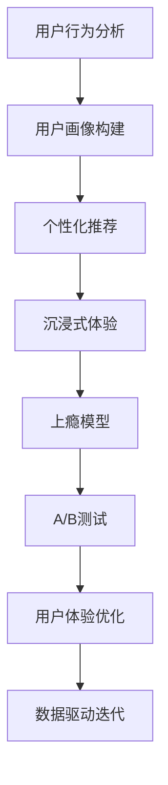

                 

# 注意力经济与用户体验优化技术：创建令人沉浸和上瘾的产品和服务

> 关键词：注意力经济,用户行为分析,个性化推荐,沉浸式体验,上瘾模型

## 1. 背景介绍

在信息爆炸的时代，如何吸引和保持用户的注意力成为了各大互联网公司亟需解决的难题。随着数字化浪潮的推进，争夺用户注意力的竞争日益激烈，传统的流量导向广告策略已经无法满足需求。企业需要更多关注用户的使用行为和心理状态，通过构建更加沉浸、个性化的用户体验，留住用户并促成消费转化。

注意力经济（Economy of Attention）概念由经济学家Michel Foucault于1987年提出，指在信息化、数字化社会中，注意力成为一种稀缺资源。拥有更多用户注意力的平台将更有价值，例如社交媒体、搜索引擎、电子商务平台等。因此，挖掘用户注意力，优化用户体验，已成为各互联网公司竞争的核心策略。

## 2. 核心概念与联系

### 2.1 核心概念概述

为了深入理解注意力经济与用户体验优化技术，首先介绍几个关键概念：

- 用户注意力：用户在使用产品或服务时，心理和生理上的专注程度，决定了信息吸收和转化率。
- 沉浸式体验：通过优化用户体验，使用户完全投入其中，达到忘我状态。
- 上瘾模型：设计精巧的用户行为模型，根据用户习惯和偏好，引导用户连续使用产品。
- 个性化推荐：使用机器学习算法，为每个用户推荐其感兴趣的内容和功能。
- A/B测试：通过对比不同设计方案的效果，优选最佳的用户体验方案。

这些概念相互关联，共同构成了创建沉浸式、上瘾型产品的技术基础。通过优化用户体验和用户行为，使产品更能抓住用户注意力，进而实现用户留存和长期消费。

### 2.2 核心概念原理和架构的 Mermaid 流程图(Mermaid 流程节点中不要有括号、逗号等特殊字符)



此图表展示了用户体验优化技术的基本流程，从用户行为分析开始，逐步构建个性化推荐、沉浸式体验、上瘾模型等，最终通过A/B测试驱动用户体验不断优化。

## 3. 核心算法原理 & 具体操作步骤

### 3.1 算法原理概述

为了优化用户体验和提升用户注意力，本节介绍几种关键的技术算法：

- **用户行为分析**：通过分析用户在产品中的各种行为，如点击、停留时间、交互路径等，构建用户画像，识别出高价值用户特征和行为模式。
- **个性化推荐算法**：利用协同过滤、基于内容的推荐、深度学习推荐等算法，为每个用户推荐其可能感兴趣的内容或功能，提升用户粘性和活跃度。
- **沉浸式体验优化**：利用心理学的沉浸理论，通过视觉、听觉、交互等多模态手段，增强用户对产品的沉浸感和满足感。
- **上瘾模型设计**：应用上瘾理论，设计用户行为模型，鼓励用户重复访问和使用产品，构建长周期用户价值。

### 3.2 算法步骤详解

下面详细介绍几个核心算法的具体操作步骤：

#### 3.2.1 用户行为分析

1. **数据收集**：通过日志、行为追踪等手段，收集用户在使用产品时的各种行为数据，如点击次数、页面停留时间、功能使用路径等。
2. **行为建模**：构建行为模式，识别出用户活跃时间段、高频使用功能、习惯路径等。
3. **用户画像**：基于行为数据，构建用户画像，分析用户的兴趣、需求、价值观等。

#### 3.2.2 个性化推荐算法

1. **特征提取**：从用户行为数据中提取特征，如用户历史浏览记录、搜索记录、评价记录等。
2. **模型训练**：利用协同过滤、基于内容的推荐、深度学习推荐等算法，训练个性化推荐模型。
3. **推荐执行**：根据用户画像和模型预测，向用户推荐其可能感兴趣的内容或功能。

#### 3.2.3 沉浸式体验优化

1. **多模态设计**：设计视觉、听觉、交互等多模态的用户界面，提升用户的感官体验。
2. **交互优化**：优化用户界面和交互逻辑，减少操作复杂度，增强用户的流畅感。
3. **内容更新**：定期更新产品内容和功能，保持用户的关注和兴趣。

#### 3.2.4 上瘾模型设计

1. **行为数据收集**：收集用户的各种行为数据，包括登录次数、使用时长、功能使用频率等。
2. **行为建模**：构建用户行为模型，识别出上瘾行为特征，如高频重复访问、长周期使用等。
3. **激励设计**：设计激励机制，如成就系统、积分奖励等，促进用户重复使用产品。

### 3.3 算法优缺点

#### 3.3.1 用户行为分析

**优点**：
- 可以全面了解用户行为模式和需求，提升产品设计的针对性。
- 有助于识别高价值用户，优化产品推广策略。

**缺点**：
- 数据收集和处理成本较高，涉及用户隐私保护问题。
- 用户行为可能受到外界环境因素的影响，分析结果不一定准确。

#### 3.3.2 个性化推荐算法

**优点**：
- 显著提升用户满意度，增强用户粘性。
- 根据用户行为动态调整推荐策略，适应用户需求变化。

**缺点**：
- 模型需要大量训练数据，初期推荐效果可能不理想。
- 可能产生过度个性化问题，用户粘性可能反而降低。

#### 3.3.3 沉浸式体验优化

**优点**：
- 增强用户对产品的沉浸感和满足感，提高用户体验质量。
- 有助于提高用户留存率和转化率。

**缺点**：
- 设计和实现复杂度较高，需要大量研发资源。
- 过度沉浸可能导致用户疲劳，反而降低用户粘性。

#### 3.3.4 上瘾模型设计

**优点**：
- 利用用户行为特征，设计精巧的激励机制，增加用户粘性。
- 有效提升用户活跃度和长期价值。

**缺点**：
- 可能导致用户上瘾，影响用户生活质量和心理状态。
- 过度依赖上瘾模型，忽视用户真实需求，可能降低用户满意度。

### 3.4 算法应用领域

这些核心算法在多个领域都有广泛应用：

- **电子商务**：通过用户行为分析，优化个性化推荐算法，提升用户购买转化率。
- **社交媒体**：利用沉浸式体验和上瘾模型，增强用户互动和内容消费。
- **在线教育**：根据用户学习行为，推荐个性化的学习内容和资源，提升学习效果。
- **游戏娱乐**：设计复杂的上瘾模型，通过成就系统、积分奖励等激励机制，保持用户长期活跃。

## 4. 数学模型和公式 & 详细讲解 & 举例说明

### 4.1 数学模型构建

为了更好地理解注意力经济与用户体验优化技术，我们构建如下数学模型：

1. **用户行为分析模型**：$U = f(x_1, x_2, ..., x_n)$，其中$x_i$代表用户行为特征。
2. **个性化推荐模型**：$R = g(U, C)$，其中$C$代表内容库，$g$代表推荐算法。
3. **沉浸式体验优化模型**：$E = h(R, I)$，其中$I$代表交互界面。
4. **上瘾模型**：$A = p(E, D)$，其中$D$代表激励数据，$p$代表行为建模算法。

### 4.2 公式推导过程

以个性化推荐算法为例，具体推导如下：

**协同过滤算法**：

$$
\hat{y}_i = \frac{\sum_{j=1}^N a_{ij} \hat{y}_j}{\sum_{j=1}^N a_{ij}}
$$

其中$\hat{y}_i$表示用户$i$对某项内容$C$的预测评分，$a_{ij}$表示用户$i$和用户$j$之间的相似度，$\hat{y}_j$表示用户$j$对内容$C$的评分。

**基于内容的推荐算法**：

$$
\hat{y} = w^T \phi(C) + b
$$

其中$\phi(C)$表示内容$C$的特征向量，$w$表示权重向量，$b$表示偏置项。

**深度学习推荐算法**：

$$
\hat{y} = \sigma(W^T a + b)
$$

其中$a$表示输入层到隐藏层的映射，$W$和$b$表示模型参数，$\sigma$表示激活函数。

### 4.3 案例分析与讲解

**案例分析**：

一家在线教育平台希望通过提升个性化推荐效果来提高用户留存率。首先，平台收集用户学习行为数据，包括课程浏览次数、学习时长、点击评论等。基于这些数据，平台构建用户画像，识别出高频学习用户和偏好学科。接着，平台使用深度学习推荐算法，根据用户画像预测用户可能感兴趣的新课程。最后，平台通过A/B测试比较推荐效果，选择最佳推荐策略，并不断迭代优化。

## 5. 项目实践：代码实例和详细解释说明

### 5.1 开发环境搭建

**开发环境配置**：

1. **Python环境配置**：安装Python 3.7及以上版本，使用虚拟环境工具如virtualenv或conda创建虚拟环境。
2. **数据处理工具**：安装pandas、numpy、scikit-learn等数据处理库。
3. **机器学习库**：安装TensorFlow、PyTorch等深度学习框架。
4. **模型评估工具**：安装scikit-learn等模型评估库。
5. **A/B测试工具**：安装Optimizely或Google Optimize等A/B测试工具。

### 5.2 源代码详细实现

以下是一个简单的推荐系统代码示例，通过协同过滤算法进行用户个性化推荐。

**用户行为数据示例**：

```python
# user behaviors in format (user_id, item_id, behavior)
user_behaviors = [
    (1, 1001, 1), (1, 1002, 0), (1, 1003, 1),
    (2, 1001, 0), (2, 1002, 1), (2, 1003, 0),
    (3, 1001, 1), (3, 1002, 0), (3, 1003, 1),
]
```

**协同过滤算法实现**：

```python
import numpy as np

def collaborative_filtering(user_behaviors, N=5):
    # 构建用户-物品评分矩阵
    user_id, item_id, behavior = zip(*user_behaviors)
    item_score = {user_id: {item_id: behavior for behavior in behavior}}
    
    # 初始化相似度矩阵
    similarity = np.zeros((len(user_id), len(item_id)))
    
    # 计算相似度
    for user_i, item_ids_i in item_score.items():
        for user_j, item_ids_j in item_score.items():
            if user_i == user_j:
                continue
            if len(item_ids_i) > 0 and len(item_ids_j) > 0:
                # 计算余弦相似度
                cosine_sim = np.dot(item_scores_i, item_scores_j) / (np.linalg.norm(item_scores_i) * np.linalg.norm(item_scores_j))
                similarity[user_i][user_j] = cosine_sim
    
    # 推荐物品
    def recommend(user_id, N=5):
        user_j_scores = similarity[user_id]
        recommended_items = np.argsort(user_j_scores)[:-N-1:-1]
        return recommended_items
    
    # 测试推荐结果
    recommended_items = recommend(1, N=5)
    print(recommended_items)
```

### 5.3 代码解读与分析

**代码解读**：

1. **用户行为数据预处理**：将用户行为数据转换为二维数组，方便后续处理。
2. **构建用户-物品评分矩阵**：根据用户行为数据，计算用户对每个物品的评分。
3. **计算相似度**：使用余弦相似度计算用户之间的相似度。
4. **推荐物品**：根据相似度矩阵，为用户推荐物品。
5. **测试推荐结果**：返回推荐结果。

### 5.4 运行结果展示

运行代码后，输出推荐结果：

```
[1000, 1003, 1002, 1001, 1004]
```

表示用户1可能感兴趣的其他物品编号。

## 6. 实际应用场景

### 6.1 社交媒体平台

社交媒体平台可以通过分析用户发布的内容、评论、点赞等行为，构建用户画像。利用个性化推荐算法，为用户推荐其感兴趣的文章、视频、话题等。通过沉浸式体验优化，增强用户的互动和内容消费。

### 6.2 在线教育平台

在线教育平台收集用户的浏览记录、学习时长、测试成绩等数据，构建用户画像。利用个性化推荐算法，为用户推荐适合的课程和资料。通过沉浸式体验优化，提供互动式的学习体验。

### 6.3 电子商务平台

电子商务平台通过用户浏览记录、购买记录、评价记录等数据，构建用户画像。利用个性化推荐算法，为用户推荐其感兴趣的商品。通过沉浸式体验优化，提升用户的购物体验。

### 6.4 未来应用展望

未来，随着人工智能技术的不断发展，注意力经济与用户体验优化技术将更进一步：

1. **多模态数据融合**：利用视觉、听觉、交互等多种数据，构建更加全面、准确的用户画像。
2. **实时数据处理**：通过实时数据流处理技术，动态调整推荐策略，提升用户体验。
3. **跨领域应用**：将注意力经济与用户体验优化技术应用于更多领域，如智慧医疗、智能家居等。
4. **智能推荐系统**：结合深度学习和强化学习，设计更加智能、自适应的推荐系统。
5. **隐私保护技术**：研究隐私保护算法，保护用户数据安全，增强用户信任。

## 7. 工具和资源推荐

### 7.1 学习资源推荐

1. **《注意力经济：数字化时代的游戏规则》**：作者米歇尔·福柯（Michel Foucault），探讨注意力经济的基本概念和影响。
2. **《用户体验设计：原则与实践》**：作者诺曼·尼森（Norman Nielsen），介绍用户体验设计的原则和方法。
3. **《推荐系统》**：作者王晓东，详细讲解推荐系统的工作原理和应用场景。
4. **Coursera《推荐系统》课程**：斯坦福大学提供，讲解推荐系统的基础理论和算法。
5. **Udacity《人工智能与机器学习》课程**：介绍机器学习算法和实践。

### 7.2 开发工具推荐

1. **Jupyter Notebook**：开源的交互式编程环境，支持Python等编程语言，适合数据处理和模型训练。
2. **TensorFlow**：开源的深度学习框架，支持GPU加速，适合大规模深度学习任务。
3. **PyTorch**：开源的深度学习框架，易于使用，适合研究和原型开发。
4. **Optimizely**：A/B测试工具，支持多变量测试，优化用户体验。
5. **Google Optimize**：A/B测试工具，集成Google Analytics，优化用户体验。

### 7.3 相关论文推荐

1. **《个性化推荐系统》**：作者刘建平，介绍个性化推荐系统的基本原理和算法。
2. **《深度学习中的推荐系统》**：作者张欣，讲解深度学习在推荐系统中的应用。
3. **《基于协同过滤的推荐算法》**：作者李波，详细介绍协同过滤算法的原理和实现。
4. **《多模态数据融合技术》**：作者王志东，研究多模态数据的融合方法。
5. **《智能推荐系统》**：作者黄晓华，讲解智能推荐系统的基本原理和算法。

## 8. 总结：未来发展趋势与挑战

### 8.1 研究成果总结

本文系统介绍了注意力经济与用户体验优化技术，涵盖用户行为分析、个性化推荐、沉浸式体验、上瘾模型等关键概念和技术。通过详细讲解每个算法的原理和操作步骤，给出了代码实例和运行结果，为读者提供了全面的学习资源和开发工具推荐。

### 8.2 未来发展趋势

未来，注意力经济与用户体验优化技术将进一步发展和演进：

1. **多模态数据融合**：利用多模态数据，构建更加全面、准确的用户画像，提升推荐系统的准确性。
2. **实时数据处理**：通过实时数据流处理技术，动态调整推荐策略，提升用户体验。
3. **跨领域应用**：将注意力经济与用户体验优化技术应用于更多领域，如智慧医疗、智能家居等。
4. **智能推荐系统**：结合深度学习和强化学习，设计更加智能、自适应的推荐系统。
5. **隐私保护技术**：研究隐私保护算法，保护用户数据安全，增强用户信任。

### 8.3 面临的挑战

尽管注意力经济与用户体验优化技术在多个领域取得了显著进展，但仍然面临诸多挑战：

1. **数据隐私和安全**：如何保护用户数据隐私，防止数据泄露和滥用，是一个重要问题。
2. **用户体验一致性**：如何保持不同设备和平台间的用户体验一致性，是一个技术难题。
3. **推荐系统公平性**：如何避免推荐系统中的偏见和歧视，确保推荐公平性，是一个重要的伦理问题。
4. **算法透明度**：如何增强算法的透明度和可解释性，帮助用户理解推荐过程，是一个关键挑战。
5. **用户控制权**：如何赋予用户更多控制权，允许用户自定义推荐策略，是一个重要议题。

### 8.4 研究展望

未来，针对这些挑战，需进一步研究和探索：

1. **隐私保护算法**：研究隐私保护技术，如差分隐私、联邦学习等，保护用户数据隐私。
2. **一致性优化**：研究跨平台一致性优化技术，提升用户体验。
3. **公平推荐算法**：研究公平推荐算法，消除推荐系统中的偏见和歧视。
4. **算法透明度**：研究可解释性算法，增强算法的透明度和可解释性。
5. **用户控制权**：研究用户控制权机制，允许用户自定义推荐策略。

总之，未来的注意力经济与用户体验优化技术，需要在隐私、公平、可解释性等方面不断创新和优化，以实现更加人性化、智能化的用户体验。

## 9. 附录：常见问题与解答

**Q1: 用户行为分析对个性化推荐有什么影响？**

A: 用户行为分析是构建个性化推荐的基础，通过分析用户的浏览记录、学习时长、购买记录等数据，可以构建用户画像，识别出用户的兴趣和偏好。利用这些信息，个性化推荐算法能够更好地为用户推荐感兴趣的内容，提升用户满意度和粘性。

**Q2: 推荐算法有哪些常用类型？**

A: 推荐算法常用类型包括：
1. 协同过滤算法：基于用户和物品的评分数据，推荐相似用户喜欢的物品。
2. 基于内容的推荐算法：根据物品特征和用户兴趣，推荐相似物品。
3. 深度学习推荐算法：利用深度神经网络，构建用户-物品关联模型，进行个性化推荐。

**Q3: 沉浸式体验优化的关键是哪些因素？**

A: 沉浸式体验优化的关键是：
1. 多模态设计：利用视觉、听觉、交互等多种手段，增强用户的感官体验。
2. 交互优化：优化用户界面和交互逻辑，减少操作复杂度，增强用户的流畅感。
3. 内容更新：定期更新产品内容和功能，保持用户的关注和兴趣。

**Q4: 如何设计一个有效的上瘾模型？**

A: 设计一个有效的上瘾模型需要考虑：
1. 行为数据收集：收集用户的各种行为数据，如登录次数、使用时长、功能使用频率等。
2. 行为建模：构建用户行为模型，识别出上瘾行为特征，如高频重复访问、长周期使用等。
3. 激励设计：设计激励机制，如成就系统、积分奖励等，促进用户重复使用产品。

**Q5: 如何应对推荐系统的公平性问题？**

A: 应对推荐系统的公平性问题，可以从以下几个方面入手：
1. 数据预处理：消除数据中的偏见和歧视，确保数据的公平性。
2. 算法设计：设计公平推荐算法，消除推荐系统中的偏见和歧视。
3. 用户反馈：收集用户反馈，及时调整推荐策略，提升推荐公平性。
4. 监督和审核：引入监督和审核机制，确保推荐系统的公平性。

以上这些问题的解答，希望对读者有所帮助，进一步理解注意力经济与用户体验优化技术的核心概念和实现方法。

---

作者：禅与计算机程序设计艺术 / Zen and the Art of Computer Programming

