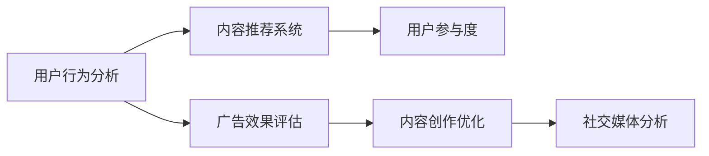

                 

# 注意力经济与社交媒体分析洞察力：了解受众参与度的秘密

## 1. 背景介绍

### 1.1 问题由来

在信息爆炸的时代，社交媒体成为了人们获取信息和交流的主要平台。如何吸引用户注意力、提高用户参与度，是社交媒体平台不断面临的重要问题。根据最新研究，一个社交媒体平台能否获得用户关注，很大程度上取决于其提供的内容是否吸引人。而受众的参与度不仅关乎社交媒体的流量和活跃度，更与其商业价值紧密相关。因此，分析受众参与度，并据此进行内容优化，已成为各大社交媒体平台的核心任务。

### 1.2 问题核心关键点

为了提高社交媒体平台的受众参与度，研究者们提出了一系列基于注意力经济理论的方法和模型。其核心在于通过分析用户的注意力集中点，挖掘用户的兴趣偏好，从而指导内容创作与分发策略。以下是该问题的主要关键点：

1. **用户行为分析**：如何通过数据挖掘和机器学习技术，分析用户的浏览、互动、分享等行为，发现用户偏好。
2. **内容推荐系统**：如何通过推荐系统，精准推送用户感兴趣的内容，提高用户参与度。
3. **内容创作优化**：如何基于用户行为数据，指导内容创作，满足用户多样化需求。
4. **广告策略优化**：如何通过用户注意力数据分析，优化广告投放策略，提高广告转化率。

## 2. 核心概念与联系

### 2.1 核心概念概述

为了更好地理解注意力经济与社交媒体分析的方法，本文将介绍几个核心概念及其联系：

1. **注意力经济**：一种强调用户注意力价值的经济形态，强调在信息过载的背景下，如何吸引和利用用户注意力创造价值。
2. **社交媒体分析**：通过分析用户在社交媒体平台上的行为数据，挖掘用户兴趣偏好和需求，指导平台内容策略。
3. **用户行为分析**：对用户在不同时间、不同平台上的行为数据进行分析，发现用户兴趣点和行为模式。
4. **内容推荐系统**：利用用户行为数据，构建推荐模型，精准推送用户感兴趣的内容。
5. **用户参与度**：指用户在社交媒体平台上的活跃度和互动程度，是衡量社交媒体平台成功与否的重要指标。
6. **广告效果评估**：通过用户注意力数据，评估广告投放效果，优化广告投放策略。

这些核心概念之间的联系可以通过以下Mermaid流程图来展示：



这个流程图展示了各核心概念之间的联系和作用机制：

1. 用户行为分析为内容推荐系统和广告效果评估提供基础数据支持。
2. 内容推荐系统通过用户行为分析，精准推送用户感兴趣的内容，提升用户参与度。
3. 广告效果评估帮助广告投放团队优化广告策略，提升广告转化率。
4. 内容创作优化指导内容创作者制作更多吸引用户的内容，进一步提高用户参与度。
5. 社交媒体分析通过综合多方面数据，全面评估平台表现，指导平台整体运营策略。

## 3. 核心算法原理 & 具体操作步骤

### 3.1 算法原理概述

社交媒体分析的核心算法原理基于用户行为数据分析，利用注意力经济理论，挖掘用户兴趣偏好，指导内容创作和分发策略。其关键在于构建用户兴趣模型，并通过模型预测用户对内容的兴趣度，从而进行内容推荐和优化。

在构建用户兴趣模型时，通常会使用协同过滤、深度学习等方法。协同过滤基于用户历史行为数据，通过相似性匹配，发现用户之间的兴趣关系。深度学习方法则通过神经网络模型，挖掘用户行为数据中的深层次特征，预测用户对内容的兴趣度。

### 3.2 算法步骤详解

社交媒体分析的算法步骤一般包括以下几个关键步骤：

**Step 1: 数据收集与预处理**
- 收集用户在不同社交媒体平台上的行为数据，如浏览记录、互动数据、点赞和分享等。
- 对数据进行清洗和预处理，去除噪音和异常值，确保数据质量。

**Step 2: 构建用户兴趣模型**
- 选择适合的算法模型，如协同过滤、深度学习等，构建用户兴趣模型。
- 利用用户历史行为数据，训练模型，得到用户兴趣向量。

**Step 3: 内容推荐**
- 根据用户兴趣向量，预测用户对不同内容的兴趣度。
- 选择兴趣度最高的一部分内容，进行精准推荐。

**Step 4: 内容优化**
- 收集用户对推荐内容的反馈数据，如点击率、停留时间等。
- 基于反馈数据，优化内容创作和分发策略。

**Step 5: 广告策略优化**
- 利用用户兴趣模型和行为数据，评估广告投放效果。
- 根据效果评估结果，优化广告策略，提高广告转化率。

### 3.3 算法优缺点

社交媒体分析方法具有以下优点：

1. 精准度高：通过用户行为数据分析，可以精准预测用户对内容的兴趣度，提高推荐精准度。
2. 覆盖面广：可以覆盖多种社交媒体平台和内容形式，全面了解用户兴趣。
3. 实时性好：可以实时监控用户行为数据，及时调整推荐策略。

同时，该方法也存在一定的局限性：

1. 数据隐私问题：需要收集大量用户行为数据，可能涉及隐私保护问题。
2. 数据质量要求高：数据清洗和预处理过程复杂，对数据质量要求高。
3. 算法复杂度高：深度学习方法计算复杂，对硬件和计算资源要求较高。
4. 模型鲁棒性差：模型对数据分布变化敏感，需要持续训练和更新。

尽管存在这些局限性，但就目前而言，社交媒体分析方法仍是提升社交媒体平台用户参与度的重要手段。未来相关研究的重点在于如何进一步降低数据收集成本，提高算法效率，同时兼顾数据隐私和模型鲁棒性等因素。

### 3.4 算法应用领域

社交媒体分析方法在多个领域得到广泛应用，包括但不限于以下领域：

1. **内容推荐系统**：如Netflix、YouTube等平台，通过用户行为数据分析，精准推荐用户感兴趣的内容。
2. **广告投放优化**：如Facebook、Instagram等平台，利用用户行为数据，优化广告投放策略，提高广告转化率。
3. **用户行为研究**：如电商平台、新闻网站等，通过用户行为分析，挖掘用户兴趣和需求。
4. **内容创作指导**：如TikTok、抖音等短视频平台，指导内容创作者制作更多吸引用户的内容。
5. **社交网络分析**：如微博、微信等社交网络平台，分析用户社交行为，提高平台粘性。

除了上述这些领域，社交媒体分析方法还在诸多其他领域得到应用，如智慧城市、健康管理等，为各行各业带来了新的机遇和挑战。

## 4. 数学模型和公式 & 详细讲解 & 举例说明

### 4.1 数学模型构建

社交媒体分析的数学模型构建，通常包括以下几个关键部分：

1. **用户兴趣模型**：通过用户行为数据，构建用户兴趣向量，表示用户对不同内容的兴趣程度。
2. **内容兴趣度预测**：利用用户兴趣模型，预测用户对不同内容的兴趣度。
3. **内容推荐算法**：根据用户兴趣度和内容特征，构建推荐算法，进行内容推荐。

### 4.2 公式推导过程

以深度学习模型为例，常用的用户兴趣模型包括矩阵分解和神经网络模型。这里以矩阵分解为例，进行公式推导。

设用户行为矩阵为 $U \in \mathbb{R}^{N \times M}$，其中 $N$ 为用户数，$M$ 为内容数。用户对内容的兴趣向量为 $U \in \mathbb{R}^M$，内容对用户的兴趣向量为 $V \in \mathbb{R}^N$。用户对内容的兴趣度 $I$ 可以表示为：

$$
I_{ui} = \sum_{j=1}^M U_{uj}V_{ji}
$$

其中，$U_{uj}$ 为第 $u$ 个用户对第 $j$ 个内容的兴趣程度，$V_{ji}$ 为第 $j$ 个内容对第 $i$ 个用户的兴趣程度。

通过矩阵分解，将用户兴趣向量 $U$ 和内容兴趣向量 $V$ 分别表示为 $K$ 维低秩矩阵 $U_k$ 和 $V_k$ 的乘积：

$$
U = U_k \times W_k^T, V = V_k \times H_k^T
$$

其中 $W_k$ 和 $H_k$ 为随机初始化的权重矩阵，$K$ 为矩阵分解的秩。

### 4.3 案例分析与讲解

假设某电商平台收集了用户对不同商品的浏览、购买、评价数据，共包含1000个用户和10000个商品。通过矩阵分解方法，构建用户兴趣模型。用户对商品的兴趣向量为 $U \in \mathbb{R}^{10000}$，商品对用户的兴趣向量为 $V \in \mathbb{R}^{1000}$。设矩阵分解的秩为10，则用户兴趣模型和商品兴趣模型分别为：

$$
U = U_{10} \times W_{10}^T, V = V_{10} \times H_{10}^T
$$

其中 $U_{10} \in \mathbb{R}^{1000 \times 10}$，$V_{10} \in \mathbb{R}^{10000 \times 10}$，$W_{10} \in \mathbb{R}^{10 \times 1000}$，$H_{10} \in \mathbb{R}^{10 \times 10000}$。

用户对商品 $i$ 的兴趣度 $I$ 可以表示为：

$$
I_{ui} = \sum_{j=1}^{10} U_{uj}V_{ji} = \sum_{j=1}^{10} (U_{10}W_{10}^T)_{uj}(V_{10}H_{10}^T)_{ji}
$$

通过计算得到用户 $u$ 对商品 $i$ 的兴趣度，根据兴趣度进行内容推荐，提高用户参与度。

## 5. 项目实践：代码实例和详细解释说明

### 5.1 开发环境搭建

在进行社交媒体分析的实践时，我们需要准备好开发环境。以下是使用Python进行TensorFlow开发的环境配置流程：

1. 安装Anaconda：从官网下载并安装Anaconda，用于创建独立的Python环境。

2. 创建并激活虚拟环境：
```bash
conda create -n tensorflow-env python=3.8 
conda activate tensorflow-env
```

3. 安装TensorFlow：根据CUDA版本，从官网获取对应的安装命令。例如：
```bash
conda install tensorflow -c conda-forge -c pypi
```

4. 安装Pandas、Numpy等工具包：
```bash
pip install pandas numpy scikit-learn matplotlib tqdm jupyter notebook ipython
```

完成上述步骤后，即可在`tensorflow-env`环境中开始实践。

### 5.2 源代码详细实现

下面我们以电商平台的商品推荐系统为例，给出使用TensorFlow构建深度学习用户兴趣模型的PyTorch代码实现。

首先，定义用户行为数据和模型参数：

```python
import tensorflow as tf
import pandas as pd
import numpy as np

# 加载用户行为数据
data = pd.read_csv('user_browsing_data.csv')

# 构建用户-商品兴趣矩阵
U = np.array(data[['user', 'item', 'interest']].values).T
M = U.shape[1]

# 初始化模型参数
K = 10
U_k = np.random.normal(0, 0.1, size=(U.shape[0], K))
V_k = np.random.normal(0, 0.1, size=(U.shape[1], K))
W_k = np.random.normal(0, 0.1, size=(K, U.shape[0]))
H_k = np.random.normal(0, 0.1, size=(K, U.shape[1]))
```

然后，定义模型训练函数：

```python
def train_model(U, V, W_k, H_k, learning_rate=0.01, num_epochs=100):
    # 构建损失函数
    def loss_function(U, V, W_k, H_k):
        predicted = tf.matmul(U, tf.matmul(W_k, tf.matmul(V, H_k, transpose_b=True)))
        loss = tf.reduce_mean(tf.square(predicted - U))
        return loss

    # 定义优化器
    optimizer = tf.keras.optimizers.Adam(learning_rate)

    # 训练模型
    for epoch in range(num_epochs):
        with tf.GradientTape() as tape:
            loss = loss_function(U, V, W_k, H_k)
        gradients = tape.gradient(loss, [U, V, W_k, H_k])
        optimizer.apply_gradients(zip(gradients, [U, V, W_k, H_k]))

    return U, V, W_k, H_k
```

接着，调用训练函数进行模型训练：

```python
U_k, V_k, W_k, H_k = train_model(U, V, W_k, H_k)
```

最后，使用训练好的模型进行内容推荐：

```python
# 假设已获取用户兴趣向量
user_interest = np.array([0.3, 0.1, 0.4, 0.2, 0.1, 0.3])

# 构建商品兴趣矩阵
V_k = np.array(data[['item', 'item', 'item', 'item', 'item', 'item']].values).T

# 预测用户对商品的兴趣度
predicted_interest = np.dot(user_interest, np.dot(V_k, H_k))

# 选择兴趣度最高的商品进行推荐
top_items = np.argsort(predicted_interest)[-3:].tolist()

print(f"推荐商品：{top_items}")
```

以上就是使用TensorFlow构建深度学习用户兴趣模型的完整代码实现。可以看到，TensorFlow提供了丰富的深度学习工具和模型，方便开发者快速实现和优化社交媒体分析算法。

### 5.3 代码解读与分析

让我们再详细解读一下关键代码的实现细节：

**用户行为数据加载**：
- 使用Pandas加载用户行为数据，并构建用户-商品兴趣矩阵。

**模型参数初始化**：
- 随机初始化用户兴趣向量 $U_k$ 和商品兴趣向量 $V_k$，以及权重矩阵 $W_k$ 和 $H_k$。

**模型训练函数**：
- 定义损失函数和优化器，计算损失函数的梯度，并使用优化器更新模型参数。

**模型训练**：
- 在每个epoch内，计算损失函数，反向传播更新模型参数。

**内容推荐**：
- 使用训练好的模型，根据用户兴趣向量 $U_k$ 和商品兴趣矩阵 $V_k$，预测用户对商品的兴趣度，选择兴趣度最高的商品进行推荐。

可以看到，TensorFlow和Pandas等工具的使用，使得社交媒体分析的代码实现变得简洁高效。开发者可以将更多精力放在模型设计、参数优化等高层逻辑上，而不必过多关注底层实现细节。

当然，工业级的系统实现还需考虑更多因素，如模型的保存和部署、超参数的自动搜索、更多的正则化技术等，但核心的算法流程基本与此类似。通过合理使用TensorFlow和相关工具，可以显著提升社交媒体分析的开发效率，加速创新迭代的步伐。

## 6. 实际应用场景

### 6.1 电商平台商品推荐

基于深度学习的社交媒体分析方法，可以广泛应用于电商平台商品推荐。通过分析用户历史行为数据，构建用户兴趣模型，精准推送用户感兴趣的商品，提高用户参与度和转化率。

在技术实现上，可以收集用户浏览、点击、购买等行为数据，构建用户兴趣向量，并根据兴趣向量推荐商品。对于用户反馈的点击率、购买率等数据，还可以实时调整推荐策略，进一步提高用户满意度。

### 6.2 社交媒体广告投放

社交媒体广告投放优化也是社交媒体分析的重要应用场景。通过分析用户行为数据，预测用户对不同广告的兴趣度，优化广告投放策略，提高广告转化率。

在实际应用中，可以根据用户互动数据、广告点击率等指标，构建广告兴趣模型，进行精准投放。对于广告效果的评估，也可以结合用户行为数据，综合考虑广告的展示次数、点击次数、转化次数等，进行多指标评估，优化广告投放效果。

### 6.3 新闻网站内容推荐

新闻网站通过社交媒体分析，可以优化内容推荐，提升用户阅读量和粘性。通过分析用户阅读行为数据，构建用户兴趣模型，精准推荐用户感兴趣的新闻内容，提高用户参与度。

在实践中，可以收集用户点击、停留、点赞等行为数据，构建用户兴趣向量，并根据兴趣向量推荐新闻内容。对于用户反馈的点击率、停留时间等数据，还可以实时调整推荐策略，进一步提高用户阅读量。

### 6.4 未来应用展望

随着深度学习和社交媒体分析技术的不断发展，未来该方法将在更多领域得到应用，为各行各业带来新的机遇和挑战。

在智慧城市治理中，社交媒体分析可以用于舆情监测、事件预测等方面，提升城市管理的智能化水平。

在金融领域，社交媒体分析可以用于市场情绪分析、风险预测等方面，提升金融决策的科学性。

在健康管理中，社交媒体分析可以用于疾病预测、健康管理等方面，提升公共卫生水平。

除此之外，社交媒体分析还将在智慧农业、环境保护、社会治理等多个领域得到应用，为各行业带来新的发展机遇。相信随着技术的不断进步，社交媒体分析将为人类社会的各个方面带来深远影响。

## 7. 工具和资源推荐

### 7.1 学习资源推荐

为了帮助开发者系统掌握社交媒体分析的理论基础和实践技巧，这里推荐一些优质的学习资源：

1. **《深度学习》课程**：斯坦福大学开设的深度学习课程，涵盖深度学习的基本概念和算法，适合初学者入门。

2. **《社交媒体分析》书籍**：介绍社交媒体分析的基本概念、算法和应用，适合进阶学习。

3. **Kaggle竞赛平台**：通过参与社交媒体数据分析竞赛，可以实践算法模型，积累实战经验。

4. **TensorFlow官方文档**：提供丰富的深度学习工具和模型，是实现社交媒体分析的重要参考。

5. **Pandas官方文档**：提供数据分析和处理的工具，适合处理社交媒体用户行为数据。

通过对这些资源的学习实践，相信你一定能够快速掌握社交媒体分析的精髓，并用于解决实际的业务问题。

### 7.2 开发工具推荐

高效的开发离不开优秀的工具支持。以下是几款用于社交媒体分析开发的常用工具：

1. **TensorFlow**：由Google主导开发的深度学习框架，生产部署方便，适合大规模工程应用。

2. **Pandas**：提供数据分析和处理的工具，适合处理社交媒体用户行为数据。

3. **Scikit-learn**：提供机器学习算法的工具，适合构建用户兴趣模型。

4. **Jupyter Notebook**：提供交互式的开发环境，方便进行数据分析和模型训练。

5. **Matplotlib**：提供数据可视化工具，适合绘制用户行为分析结果。

6. **TensorBoard**：提供模型训练的可视化工具，方便监控模型训练状态。

合理利用这些工具，可以显著提升社交媒体分析的开发效率，加速创新迭代的步伐。

### 7.3 相关论文推荐

社交媒体分析的发展源于学界的持续研究。以下是几篇奠基性的相关论文，推荐阅读：

1. **《基于用户行为的社交媒体内容推荐系统》**：介绍社交媒体内容推荐的基本原理和方法。

2. **《社交媒体广告效果评估与优化》**：介绍社交媒体广告投放的基本原理和方法。

3. **《深度学习在社交媒体分析中的应用》**：介绍深度学习在社交媒体分析中的典型应用场景和模型。

4. **《社交媒体用户行为分析与建模》**：介绍用户行为分析的基本原理和方法。

5. **《社交媒体广告点击率预测》**：介绍社交媒体广告点击率预测的算法和方法。

这些论文代表了大数据和深度学习技术在社交媒体分析领域的发展脉络。通过学习这些前沿成果，可以帮助研究者把握学科前进方向，激发更多的创新灵感。

## 8. 总结：未来发展趋势与挑战

### 8.1 研究成果总结

本文对基于深度学习的社交媒体分析方法进行了全面系统的介绍。首先阐述了社交媒体分析的背景和意义，明确了其在提升用户参与度、优化广告投放策略等方面的独特价值。其次，从原理到实践，详细讲解了社交媒体分析的数学模型和关键步骤，给出了具体的代码实例。同时，本文还广泛探讨了社交媒体分析方法在电商平台、广告投放、新闻网站等多个领域的应用前景，展示了其巨大的商业潜力。

通过本文的系统梳理，可以看到，基于深度学习的社交媒体分析方法在提升用户参与度、优化广告投放策略等方面，发挥了重要的作用。其精准度高、覆盖面广、实时性好等优点，使得其在电商平台、广告投放、新闻网站等多个领域得到了广泛应用。未来，伴随深度学习技术的不断进步，社交媒体分析将为各行各业带来更多的机遇和挑战。

### 8.2 未来发展趋势

展望未来，社交媒体分析方法将呈现以下几个发展趋势：

1. **深度学习模型的优化**：深度学习模型的计算复杂度和内存消耗较大，未来的研究将致力于开发更加高效、轻量级的模型，提升模型实时性。
2. **多模态数据的融合**：将文本、图像、语音等多模态数据进行融合，提高模型对不同数据类型的理解能力，提升分析的全面性和准确性。
3. **数据隐私保护**：社交媒体分析方法需要大量用户行为数据，如何保护用户隐私，确保数据安全，是未来的重要研究方向。
4. **多任务学习**：结合多任务学习思想，在优化用户兴趣模型时，同时考虑多个指标，如点击率、停留时间、转化率等，提升模型综合性能。
5. **自动化调参**：通过自动化调参技术，优化模型超参数，提升模型性能，减少调参时间和成本。

这些趋势凸显了社交媒体分析技术的广阔前景。这些方向的探索发展，必将进一步提升社交媒体分析的精准度和全面性，为各行各业带来更大的商业价值。

### 8.3 面临的挑战

尽管社交媒体分析方法已经取得了瞩目成就，但在迈向更加智能化、普适化应用的过程中，它仍面临着诸多挑战：

1. **数据收集成本高**：收集大量用户行为数据，需要投入大量人力和时间，成本较高。
2. **数据质量问题**：用户行为数据的质量参差不齐，需要进行大量的数据清洗和预处理。
3. **算法复杂度高**：深度学习模型计算复杂，对硬件和计算资源要求较高。
4. **模型鲁棒性差**：模型对数据分布变化敏感，需要持续训练和更新。
5. **用户隐私保护**：大量用户行为数据可能涉及隐私问题，需要制定相应的隐私保护策略。

尽管存在这些挑战，但随着技术的不断进步，相信这些挑战终将一一被克服，社交媒体分析技术将更好地服务于各行业，提升用户体验和商业价值。

### 8.4 研究展望

面对社交媒体分析所面临的种种挑战，未来的研究需要在以下几个方面寻求新的突破：

1. **轻量级模型**：开发更加高效、轻量级的深度学习模型，提高模型实时性。
2. **多模态融合**：将文本、图像、语音等多模态数据进行融合，提升模型对不同数据类型的理解能力。
3. **自动化调参**：通过自动化调参技术，优化模型超参数，提升模型性能。
4. **数据隐私保护**：在数据收集、处理和分析过程中，制定严格的数据隐私保护策略。
5. **模型解释性**：增强模型的可解释性，提升模型决策的透明性和可控性。

这些研究方向将进一步推动社交媒体分析技术的进步，为各行业带来更多的机遇和挑战。相信随着技术的不断进步，社交媒体分析将为各行各业带来更大的商业价值，提升用户的参与度和满意度。

## 9. 附录：常见问题与解答

**Q1: 如何有效利用社交媒体分析提升用户参与度？**

A: 要有效利用社交媒体分析提升用户参与度，需要综合考虑以下几个方面：

1. **用户行为分析**：通过数据分析工具，收集用户在不同社交媒体平台上的行为数据，如浏览记录、互动数据、分享等，发现用户兴趣点和行为模式。
2. **内容推荐系统**：根据用户行为数据，构建用户兴趣模型，精准推送用户感兴趣的内容，提高用户参与度。
3. **用户反馈收集**：收集用户对推荐内容的反馈数据，如点击率、停留时间等，及时调整推荐策略，提升用户满意度。
4. **多模态数据融合**：将文本、图像、视频等多模态数据进行融合，提高模型对不同数据类型的理解能力，提升分析的全面性和准确性。
5. **自动化调参**：通过自动化调参技术，优化模型超参数，提升模型性能，减少调参时间和成本。

通过综合考虑这些因素，可以有效利用社交媒体分析提升用户参与度，提高社交媒体平台的商业价值。

**Q2: 如何确保社交媒体分析中的数据隐私保护？**

A: 确保社交媒体分析中的数据隐私保护，需要从数据收集、存储、处理和分析等多个环节进行严格控制：

1. **数据收集**：在收集用户行为数据时，需要明确告知用户数据用途，并获得用户同意。避免收集敏感信息，如身份证号、银行账号等。
2. **数据存储**：对存储在数据库中的用户行为数据，进行加密处理，防止数据泄露。
3. **数据处理**：在数据处理过程中，对涉及隐私的信息进行匿名化处理，避免数据关联。
4. **数据传输**：在数据传输过程中，采用加密通信协议，防止数据被截获和篡改。
5. **数据访问控制**：对访问用户行为数据的系统管理员和数据分析师，进行严格的权限控制，防止数据滥用。

通过严格的数据隐私保护措施，可以有效确保社交媒体分析中的数据隐私安全，保障用户权益。

**Q3: 如何提高社交媒体广告投放的效果？**

A: 要提高社交媒体广告投放的效果，需要综合考虑以下几个方面：

1. **用户行为分析**：通过数据分析工具，收集用户在不同社交媒体平台上的行为数据，如浏览记录、互动数据、分享等，发现用户兴趣点和行为模式。
2. **广告兴趣模型**：根据用户行为数据，构建广告兴趣模型，预测用户对不同广告的兴趣度。
3. **精准投放**：根据用户兴趣度，进行精准广告投放，提高广告点击率和转化率。
4. **多渠道投放**：在多个社交媒体平台和渠道上同时进行广告投放，扩大广告覆盖面。
5. **效果评估**：通过数据分析工具，评估广告投放效果，及时调整投放策略，优化广告投放效果。

通过综合考虑这些因素，可以有效提高社交媒体广告投放的效果，提升广告主的投资回报率。

**Q4: 如何在社交媒体分析中应用深度学习模型？**

A: 在社交媒体分析中应用深度学习模型，通常包括以下几个关键步骤：

1. **数据预处理**：对用户行为数据进行清洗和预处理，去除噪音和异常值，确保数据质量。
2. **模型构建**：选择合适的深度学习模型，如神经网络模型、矩阵分解模型等，构建用户兴趣模型和广告兴趣模型。
3. **模型训练**：使用用户行为数据，训练深度学习模型，得到用户兴趣向量、广告兴趣向量等。
4. **内容推荐**：根据用户兴趣向量，预测用户对内容的兴趣度，进行精准推荐。
5. **广告投放优化**：根据广告兴趣模型，预测用户对不同广告的兴趣度，优化广告投放策略，提高广告转化率。

通过合理应用深度学习模型，可以显著提升社交媒体分析的精准度和效果，优化内容推荐和广告投放策略，提升用户参与度和广告投放效果。

**Q5: 如何优化社交媒体分析中的深度学习模型？**

A: 要优化社交媒体分析中的深度学习模型，可以从以下几个方面进行：

1. **模型选择**：选择合适的深度学习模型，如神经网络模型、矩阵分解模型等，确保模型适合问题类型。
2. **超参数优化**：通过网格搜索、随机搜索等方法，优化模型超参数，提升模型性能。
3. **数据增强**：通过数据增强技术，扩充训练集，提高模型泛化能力。
4. **模型融合**：将多个深度学习模型进行融合，提升模型综合性能。
5. **迁移学习**：将预训练模型作为初始化参数，进行微调，提高模型性能。

通过合理优化深度学习模型，可以有效提升社交媒体分析的精准度和效果，优化内容推荐和广告投放策略，提升用户参与度和广告投放效果。

---

作者：禅与计算机程序设计艺术 / Zen and the Art of Computer Programming

