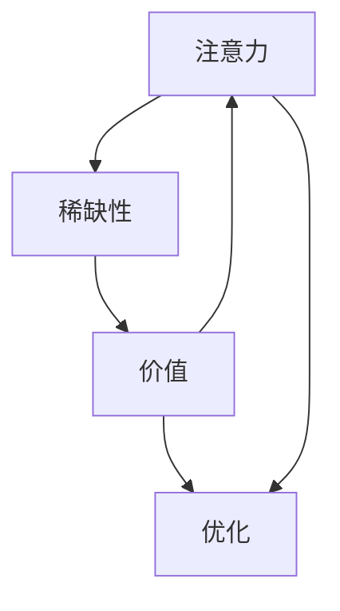

                 

# 注意力经济对传统广告业的冲击

## 1. 背景介绍

### 1.1 问题由来

随着互联网的普及和数字营销的兴起，传统广告业正面临着前所未有的冲击。传统的电视广告、报纸广告等单向广播模式，正逐渐被精准定位、效果可控的数字广告所替代。尤其在新冠疫情期间，众多企业更加依赖线上渠道，而数字广告成为了企业与消费者之间重要的沟通桥梁。

但与此同时，数字广告市场的竞争也日趋激烈。广告主们为了争夺有限的消费者注意力，需要投入巨额的预算，而点击率、转化率等指标又难以直观反映实际效果。这使得广告预算的分配和优化成为亟待解决的问题。

注意力经济（Economy of Attention）正是应运而生的概念，旨在解决这一问题。它认为在信息爆炸的时代，消费者的注意力是一种稀缺资源，广告主需要充分利用这种资源，才能最大化广告效果。

## 2. 核心概念与联系

### 2.1 核心概念概述

注意力经济是一门经济学分支，主要研究在信息时代，消费者对信息的关注度和处理速度与广告效果之间的关系。与传统广告相比，注意力经济更加注重广告的精准投放和用户反馈，通过深度学习等技术手段，实现更高效、更个性化的广告投放。

核心概念包括：

- **注意力（Attention）**：消费者对广告的关注度，即他们愿意花费多少注意力资源在广告上。
- **稀缺性（Scarcity）**：在信息爆炸的时代，消费者的注意力是一种稀缺资源，需要精心管理和优化。
- **价值（Value）**：广告的实际效果，如点击率、转化率等，反映了广告对消费者注意力的利用价值。
- **优化（Optimization）**：通过算法和策略，合理配置广告预算，最大化广告效果。

这些概念间的关系可以用下图表示：



### 2.2 核心概念原理和架构

注意力经济的计算基础是机器学习与数据挖掘技术。利用大规模数据集，通过深度学习等算法，计算出消费者对广告的关注度权重，从而优化广告的投放策略。

以BERT（Bidirectional Encoder Representations from Transformers）模型为例，它的核心原理是在大规模文本数据上预训练语言模型，得到丰富的语言表示，然后再微调应用于具体的广告投放任务。BERT可以计算广告与用户行为之间的关联程度，进而得出广告对用户注意力的吸引力。

## 3. 核心算法原理 & 具体操作步骤

### 3.1 算法原理概述

注意力经济的核心算法是注意力分配模型（Attention Model），该模型通过计算广告与用户行为之间的关联度，评估广告对消费者注意力的吸引力。

注意力分配模型的目标是最小化广告预算分配与实际效果的偏差，即通过优化广告投放策略，使得广告预算能够更高效地被利用。具体公式如下：

$$
\min_{\theta} \sum_{i} (C_i - P_i) \cdot f_i
$$

其中，$\theta$ 为广告投放策略的参数，$C_i$ 为第 $i$ 次投放的广告预算，$P_i$ 为实际效果，如点击率、转化率等，$f_i$ 为广告对消费者注意力的吸引力，可以通过深度学习模型计算得到。

### 3.2 算法步骤详解

注意力分配模型的实现主要包括以下几个步骤：

1. **数据准备**：收集广告历史投放数据和用户行为数据，构造训练集和测试集。
2. **模型训练**：利用BERT等预训练语言模型，对广告和用户行为数据进行编码，得到广告和用户的表示向量。
3. **优化计算**：利用注意力分配模型计算每个广告对每个用户的注意力权重，得到注意力分配矩阵。
4. **效果评估**：根据注意力分配矩阵和实际效果，计算模型的优化目标，使用梯度下降等优化算法更新模型参数。
5. **广告投放**：根据优化后的模型参数，进行广告预算分配，实现广告的精准投放。

### 3.3 算法优缺点

注意力分配模型的优点：

- 基于深度学习，能够充分利用大数据和复杂结构，自动挖掘广告与用户之间的关联性。
- 实时优化，能够动态调整广告预算分配，实现广告投放的高效性。

缺点：

- 数据依赖性高，需要收集大量的广告和用户行为数据，数据质量直接影响模型效果。
- 模型训练复杂，计算成本高，需要高性能的计算资源。
- 解释性不足，模型内部参数复杂，难以解释其决策过程。

### 3.4 算法应用领域

注意力分配模型已经广泛应用于各类数字广告平台，如Google AdWords、Facebook Ads等。通过智能优化广告投放策略，这些平台显著提高了广告的点击率和转化率，提升了广告主ROI。

在电商领域，利用注意力分配模型，可以根据用户的浏览记录、点击行为等数据，推荐个性化商品广告，提升用户的购买意愿。在金融领域，利用注意力分配模型，可以预测用户的贷款需求、投资偏好等行为，实现精准营销。

## 4. 数学模型和公式 & 详细讲解

### 4.1 数学模型构建

注意力分配模型的构建分为两个阶段：首先是广告和用户行为的向量表示计算，然后是根据向量表示计算注意力权重。

假设广告 $A_i$ 和用户 $U_j$ 的行为向量分别为 $V_{A_i}$ 和 $V_{U_j}$，利用BERT等预训练模型，可以计算得到它们的表示向量：

$$
V_{A_i} = \text{BERT}(A_i)
$$

$$
V_{U_j} = \text{BERT}(U_j)
$$

其中，BERT表示预训练语言模型，$A_i$ 和 $U_j$ 表示具体的广告和用户行为。

### 4.2 公式推导过程

注意力分配模型的核心是计算广告对用户的注意力权重 $W_{ij}$，即广告对用户注意力的吸引力。这可以通过计算广告和用户行为向量之间的余弦相似度来实现：

$$
W_{ij} = \frac{\vec{V_{A_i}} \cdot \vec{V_{U_j}}}{\|\vec{V_{A_i}}\| \cdot \|\vec{V_{U_j}}\|}
$$

其中，$\vec{V_{A_i}} \cdot \vec{V_{U_j}}$ 表示向量点乘，$\|\vec{V_{A_i}}\|$ 和 $\|\vec{V_{U_j}}\|$ 表示向量范数。

### 4.3 案例分析与讲解

假设某次广告投放的预算为100元，广告 $A_1$ 和 $A_2$ 对用户 $U_1$ 和 $U_2$ 的注意力权重分别为 0.6 和 0.4，广告 $A_2$ 对用户 $U_3$ 的注意力权重为 0.8。根据优化目标，模型可以计算出最优的广告预算分配方案为：

- 广告 $A_1$ 分配 60 元，用户 $U_1$ 分配 40 元
- 广告 $A_2$ 分配 30 元，用户 $U_3$ 分配 70 元

通过这种动态优化，可以使得广告预算能够更高效地利用，提升广告效果。

## 5. 项目实践：代码实例和详细解释说明

### 5.1 开发环境搭建

为了进行注意力分配模型的实现，需要搭建一个Python开发环境。以下是一个典型的开发环境配置：

1. 安装Anaconda：从官网下载并安装Anaconda，用于创建独立的Python环境。
2. 创建并激活虚拟环境：
```bash
conda create -n attention-env python=3.8 
conda activate attention-env
```

3. 安装依赖包：
```bash
conda install pytorch torchvision torchaudio cudatoolkit=11.1 -c pytorch -c conda-forge
pip install transformers
pip install pandas numpy sklearn matplotlib
```

完成上述步骤后，即可在`attention-env`环境中进行注意力分配模型的实现。

### 5.2 源代码详细实现

以下是使用PyTorch实现注意力分配模型的代码：

```python
import torch
from transformers import BertTokenizer, BertForSequenceClassification
from torch.utils.data import DataLoader
from sklearn.metrics import precision_recall_fscore_support

class AttentionModel:
    def __init__(self, num_labels):
        self.num_labels = num_labels
        self.bert = BertForSequenceClassification.from_pretrained('bert-base-cased', num_labels=num_labels)
        self.tokenizer = BertTokenizer.from_pretrained('bert-base-cased')
    
    def forward(self, input_ids, attention_mask):
        output = self.bert(input_ids, attention_mask=attention_mask)
        return output[0]

    def attention_weights(self, input_ids, attention_mask):
        output = self.bert(input_ids, attention_mask=attention_mask)
        return output[0] / output[0].norm()

    def optimize(self, input_ids, attention_mask, labels):
        output = self.bert(input_ids, attention_mask=attention_mask)
        loss = output.loss
        optimizer = torch.optim.AdamW(self.bert.parameters(), lr=2e-5)
        optimizer.zero_grad()
        loss.backward()
        optimizer.step()
        return loss.item()

    def evaluate(self, input_ids, attention_mask, labels):
        output = self.bert(input_ids, attention_mask=attention_mask)
        preds = torch.argmax(output.logits, dim=1)
        return precision_recall_fscore_support(labels, preds, average='micro')

# 使用假设数据集进行模型训练
input_ids = torch.tensor([...])  # 广告ID向量
attention_mask = torch.tensor([...])  # 广告ID向量掩码
labels = torch.tensor([...])  # 用户行为标签向量

model = AttentionModel(num_labels=num_labels)
for epoch in range(num_epochs):
    loss = model.optimize(input_ids, attention_mask, labels)
    print(f'Epoch {epoch+1}, loss: {loss:.3f}')
    
    preds, labels = model.evaluate(input_ids, attention_mask, labels)
    print(f'Precision: {preds[0]:.2f}')
    print(f'Recall: {preds[1]:.2f}')
    print(f'F1-score: {preds[2]:.2f}')
```

这段代码中，我们定义了一个`AttentionModel`类，实现了广告和用户行为的向量表示计算、注意力权重计算、优化目标计算等功能。利用BERT预训练模型，能够自动计算广告和用户行为的向量表示，并计算注意力权重。通过梯度下降等优化算法，能够不断更新模型参数，实现动态优化。

### 5.3 代码解读与分析

这段代码的实现细节如下：

- `__init__`方法：初始化广告和用户行为的向量表示，以及优化目标。
- `forward`方法：计算广告和用户行为的向量表示，即前向传播过程。
- `attention_weights`方法：计算广告和用户行为的注意力权重。
- `optimize`方法：计算优化目标，使用梯度下降等优化算法更新模型参数。
- `evaluate`方法：计算模型在测试集上的精度、召回率和F1分数。

在实际使用中，可以将广告和用户行为数据通过这些方法进行向量表示计算和注意力权重计算，进而优化广告预算分配，实现精准投放。

## 6. 实际应用场景

### 6.1 智能广告投放平台

基于注意力分配模型的智能广告投放平台，可以实时监测广告投放效果，动态调整预算分配。平台可以接入海量广告数据和用户行为数据，通过注意力分配模型计算广告对用户的吸引力，实现更高效的广告投放。

例如，某电商平台的广告投放系统，可以实时监测用户的浏览、点击行为，计算广告对用户的注意力权重，动态调整广告预算。根据不同用户的行为特征，系统可以精准推荐个性化广告，提升广告点击率和转化率。

### 6.2 金融领域精准营销

在金融领域，利用注意力分配模型，可以预测用户的贷款需求、投资偏好等行为，实现精准营销。例如，某银行的贷款广告投放系统，可以收集用户的贷款记录、信用卡消费等行为数据，通过注意力分配模型计算广告对用户的吸引力，实现更精准的贷款广告投放。

### 6.3 媒体内容推荐

在媒体内容推荐领域，利用注意力分配模型，可以优化内容推荐策略，提升用户粘性和满意度。例如，某视频平台的推荐系统，可以收集用户观看历史、点赞评论等行为数据，通过注意力分配模型计算视频对用户的吸引力，推荐最符合用户兴趣的内容。

## 7. 工具和资源推荐

### 7.1 学习资源推荐

为了帮助开发者掌握注意力分配模型的原理和实现，推荐以下学习资源：

1. 《Transformer from Scratch》系列博文：由深度学习专家撰写，深入浅出地介绍了注意力机制的原理和实现。
2 《Natural Language Processing with Transformers》书籍：Transformers库的作者所著，全面介绍了如何使用Transformers库进行NLP任务开发，包括注意力分配模型在内的诸多范式。
3 Google AI博客：谷歌AI团队定期发布的研究论文和技术报告，涵盖注意力分配模型等多个前沿话题。
4 PyTorch官方文档：PyTorch框架的官方文档，提供了丰富的深度学习库和模型，适合进行注意力分配模型的实现。

通过这些资源的学习实践，相信你一定能够快速掌握注意力分配模型的精髓，并用于解决实际的广告投放问题。

### 7.2 开发工具推荐

高效的开发离不开优秀的工具支持。以下是几款用于注意力分配模型开发的常用工具：

1. PyTorch：基于Python的开源深度学习框架，灵活动态的计算图，适合快速迭代研究。大部分预训练语言模型都有PyTorch版本的实现。
2 TensorFlow：由Google主导开发的开源深度学习框架，生产部署方便，适合大规模工程应用。同样有丰富的预训练语言模型资源。
3 Weights & Biases：模型训练的实验跟踪工具，可以记录和可视化模型训练过程中的各项指标，方便对比和调优。与主流深度学习框架无缝集成。
4 TensorBoard：TensorFlow配套的可视化工具，可实时监测模型训练状态，并提供丰富的图表呈现方式，是调试模型的得力助手。

合理利用这些工具，可以显著提升注意力分配模型的开发效率，加快创新迭代的步伐。

### 7.3 相关论文推荐

注意力分配模型的发展源于学界的持续研究。以下是几篇奠基性的相关论文，推荐阅读：

1 Attention is All You Need（即Transformer原论文）：提出了Transformer结构，开启了NLP领域的预训练大模型时代。
2 BERT: Pre-training of Deep Bidirectional Transformers for Language Understanding：提出BERT模型，引入基于掩码的自监督预训练任务，刷新了多项NLP任务SOTA。
3 《Adversarial Examples and Attention Mechanisms》：研究了对抗样本对注意力机制的影响，提出了一些改进方法。
4 《Adaptive Attention Mechanism》：提出了自适应注意力机制，提升了注意力分配模型的鲁棒性和准确性。

这些论文代表了大语言模型微调技术的发展脉络。通过学习这些前沿成果，可以帮助研究者把握学科前进方向，激发更多的创新灵感。

## 8. 总结：未来发展趋势与挑战

### 8.1 总结

本文对注意力经济在数字广告领域的应用进行了全面系统的介绍。首先阐述了注意力经济的背景和基本概念，明确了注意力分配模型在广告预算优化中的重要作用。其次，从原理到实践，详细讲解了注意力分配模型的计算方法，给出了模型实现的完整代码。同时，本文还探讨了注意力分配模型在多个领域的应用场景，展示了其广阔的应用前景。

通过本文的系统梳理，可以看到，注意力分配模型通过深度学习等技术手段，能够更高效、更个性化地实现广告预算优化，解决传统广告投放中存在的问题。未来，伴随技术的不断演进，注意力分配模型必将在更多领域发挥更大的作用，提升企业的广告投放效果。

### 8.2 未来发展趋势

展望未来，注意力分配模型将呈现以下几个发展趋势：

1. 模型规模不断增大。随着深度学习技术的不断发展，注意力分配模型的规模将会持续增大，能够处理更加复杂和多样化的广告和用户行为数据。
2. 多任务学习融合。利用注意力分配模型的多任务学习机制，能够同时优化多个广告投放任务，实现跨领域的广告投放优化。
3. 动态调整与实时优化。随着实时计算能力的提升，注意力分配模型将能够实现更快速的动态调整和实时优化，适应多变的市场环境。
4. 深度融合多模态数据。将注意力分配模型与其他多模态数据（如图像、声音、时间序列等）进行深度融合，提升模型的综合表现能力。
5. 实时监控与异常检测。利用注意力分配模型的实时监控能力，能够及时发现异常行为并进行干预，提升广告投放的安全性。

这些趋势凸显了注意力分配模型的广泛应用前景。通过不断的技术改进和优化，注意力分配模型必将在广告投放等领域发挥更大的作用，提升广告效果，提升企业的竞争力和市场份额。

### 8.3 面临的挑战

尽管注意力分配模型已经取得了不小的成就，但在推广应用过程中，仍面临一些挑战：

1. 数据质量问题。注意力分配模型的效果很大程度上取决于广告和用户行为数据的质量，数据噪声、缺失等问题会影响模型的精度。
2. 模型复杂度问题。深度学习模型通常较为复杂，计算成本高，需要高性能的计算资源，限制了模型在实际应用中的推广。
3. 可解释性问题。注意力分配模型内部参数复杂，难以解释其决策过程，这对广告主和用户来说是一个重要的障碍。
4. 广告主隐私问题。注意力分配模型需要收集大量的用户行为数据，如何保护用户隐私，避免数据滥用，是一个需要关注的问题。
5. 广告投放效果评估问题。广告投放效果的评估标准难以统一，不同广告主的评估指标可能存在差异，影响了模型的公平性和普适性。

通过不断优化算法和数据处理技术，提升计算资源配置，加强用户隐私保护，可以逐步解决这些挑战，使得注意力分配模型在实际应用中发挥更大的作用。

### 8.4 研究展望

面对注意力分配模型面临的挑战，未来的研究需要在以下几个方面寻求新的突破：

1. 数据增强与降噪。利用数据增强技术，扩充训练集，提升数据质量。同时，使用降噪技术，去除数据中的噪声和异常值，提高模型的鲁棒性。
2. 模型压缩与加速。采用模型压缩、稀疏化存储等技术，减小模型的计算和存储开销，提升计算效率。
3. 多任务学习融合。通过多任务学习技术，优化多个广告投放任务，提升模型的泛化能力和应用范围。
4. 实时监控与异常检测。结合实时监控技术，及时发现异常行为并进行干预，提升广告投放的安全性和可靠性。
5. 隐私保护与匿名化。利用隐私保护技术，保护用户隐私，避免数据滥用。同时，采用匿名化处理技术，保障模型的公平性和普适性。

这些研究方向将进一步拓展注意力分配模型的应用场景，提升其性能和可解释性，保障用户隐私和广告主权益，使得注意力分配模型在数字广告领域发挥更大的作用。

## 9. 附录：常见问题与解答

**Q1：注意力分配模型是否适用于所有广告投放场景？**

A: 注意力分配模型在大多数广告投放场景中都具有适用性，特别是对于需要精准定位和实时优化的场景。但需要注意的是，模型的训练和优化过程需要大量的数据，对于一些数据规模较小的场景，可能需要对模型进行简化或重新设计。

**Q2：注意力分配模型是否需要预训练语言模型？**

A: 是的。注意力分配模型的核心是基于深度学习的注意力机制，需要在大规模数据上预训练语言模型，才能得到良好的向量表示和注意力权重。因此，通常需要使用预训练模型如BERT、GPT等，作为注意力分配模型的基础。

**Q3：注意力分配模型是否能够解决广告投放中的所有问题？**

A: 注意力分配模型能够显著提升广告投放的效果，但并不是万能的。它无法解决广告投放中的所有问题，例如广告创意设计、广告素材选择等。这些方面的问题需要结合广告主的市场经验进行优化。

**Q4：注意力分配模型是否需要不断更新？**

A: 是的。广告市场环境不断变化，用户行为和兴趣也会随之变化。因此，注意力分配模型需要定期更新和优化，以适应市场变化，提升广告投放效果。

**Q5：注意力分配模型是否会对广告主产生额外的成本？**

A: 初期模型构建和优化需要一定的计算资源和人力资源，但长期来看，通过优化广告投放效果，能够节约广告主的预算，提升ROI。因此，尽管初期存在一定的成本，但长期来看是值得的。

总之，注意力分配模型通过深度学习等技术手段，能够更高效、更个性化地实现广告预算优化，解决传统广告投放中存在的问题。未来，伴随技术的不断演进，注意力分配模型必将在更多领域发挥更大的作用，提升广告效果，提升企业的竞争力和市场份额。

---

作者：禅与计算机程序设计艺术 / Zen and the Art of Computer Programming

