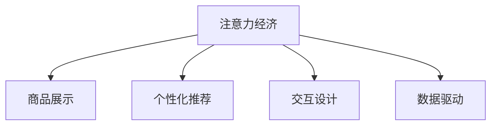

                 

## 1. 背景介绍

### 1.1 问题由来

在信息化和互联网时代，商业模式和消费行为都发生了深刻的变化。传统零售业态面临着数字化转型和消费者行为重塑的双重挑战。如何借助新技术、新工具，提升零售企业的竞争力，实现数字化转型，成为零售行业普遍关注的问题。

### 1.2 问题核心关键点

在众多技术手段中，注意力经济（Attention Economy）正逐渐成为零售业数字化转型的关键抓手。注意力经济是指通过优化信息展示和交互设计，引导消费者注意力，提升转化率和用户黏性。借助注意力经济，零售企业可以实现从商品展示到个性化推荐的全方位升级，提高用户体验和销售效率。

本文将系统探讨注意力经济的概念、原理以及其在零售业态改造中的具体应用。通过分析注意力经济的原理和实践案例，探讨其对传统零售业态的改造潜力，并提出相应的优化策略。

### 1.3 问题研究意义

在信息爆炸、消费者需求多样化的时代，注意力经济为零售企业提供了新的解决方案。通过合理设计信息交互，可以有效提高消费者注意力和购买意愿，实现销售效率的提升。这一领域的深入研究，有助于零售企业优化商品展示、个性化推荐等环节，提升用户体验和市场竞争力，实现数字化转型。

## 2. 核心概念与联系

### 2.1 核心概念概述

为更好地理解注意力经济在零售业态改造中的应用，本节将介绍几个密切相关的核心概念：

- **注意力经济（Attention Economy）**：指通过优化信息展示和交互设计，引导消费者注意力，提升转化率和用户黏性。
- **商品展示（Product Display）**：包括线上和线下的商品展示形式，旨在通过视觉、听觉等多感官刺激，吸引消费者注意力。
- **个性化推荐（Personalized Recommendation）**：基于消费者行为数据，通过算法模型，为其推荐最合适的商品。
- **交互设计（Interaction Design）**：优化用户界面和交互流程，提升用户体验和互动效果。
- **数据驱动（Data-Driven）**：通过数据分析和挖掘，发现消费者需求和行为模式，指导决策和优化。

这些概念之间的逻辑关系可以通过以下Mermaid流程图来展示：



这个流程图展示了注意力经济与其他几个核心概念之间的关系：

1. **商品展示**：通过优化商品展示，吸引消费者注意力。
2. **个性化推荐**：通过算法模型，实现商品的个性化展示。
3. **交互设计**：通过优化交互流程，提升用户体验。
4. **数据驱动**：通过数据分析，指导商品展示和个性化推荐。

这些概念共同构成了注意力经济在零售业态改造中的基础框架，为零售企业提供了从视觉、算法、交互到数据的全方位支持。

## 3. 核心算法原理 & 具体操作步骤
### 3.1 算法原理概述

注意力经济的核心在于优化信息展示和用户交互，提升消费者注意力和转化率。其核心算法原理包括：

- **推荐算法**：基于消费者行为数据，使用协同过滤、内容过滤等技术，为用户推荐个性化商品。
- **视觉优化**：通过图像识别和计算机视觉技术，优化商品展示效果，吸引消费者注意力。
- **语音交互**：通过自然语言处理技术，实现语音搜索和语音识别，提升用户体验。
- **用户行为分析**：通过用户行为数据分析，发现消费者需求和行为模式，指导商品展示和个性化推荐。

这些算法原理通常以用户为中心，结合商品特性和消费者行为数据，实现信息的高效展示和用户的高效互动。

### 3.2 算法步骤详解

基于注意力经济的应用，通常包括以下几个关键步骤：

**Step 1: 数据收集与预处理**
- 收集消费者的浏览、点击、购买等行为数据，进行预处理和清洗，确保数据的质量和一致性。

**Step 2: 数据建模与分析**
- 利用机器学习模型（如协同过滤、内容过滤等），建立消费者行为与商品推荐之间的关联。
- 通过数据挖掘技术（如聚类、关联规则等），发现消费者需求和行为模式。

**Step 3: 信息展示优化**
- 通过图像识别和计算机视觉技术，对商品图片进行处理，优化展示效果。
- 通过语音识别和自然语言处理技术，优化语音交互界面。

**Step 4: 个性化推荐**
- 根据消费者行为数据，使用推荐算法（如基于协同过滤、基于内容过滤等），生成个性化推荐结果。
- 结合用户反馈和行为数据，动态调整推荐策略。

**Step 5: 用户反馈与优化**
- 收集用户对推荐结果的反馈，进行动态调整和优化。
- 通过A/B测试等手段，验证优化效果，持续改进。

### 3.3 算法优缺点

注意力经济在零售业态改造中的应用，具有以下优点：
1. **提升转化率**：通过优化信息展示和个性化推荐，显著提升消费者转化率。
2. **增强用户体验**：通过优化交互设计，提升用户互动体验，提高用户满意度和黏性。
3. **数据驱动决策**：通过数据驱动，实现更科学的决策和优化。
4. **多感官融合**：结合视觉、听觉等多种感官信息，提升用户沉浸感。

同时，这一方法也存在一定的局限性：
1. **数据隐私问题**：数据收集和分析可能涉及消费者隐私，需要严格遵守相关法规。
2. **算法复杂性**：复杂的推荐算法可能增加系统复杂性，影响性能和稳定性。
3. **用户干预**：个性化推荐依赖于用户反馈，可能受到用户主观影响。
4. **市场适应性**：不同市场和消费者群体，可能需要不同的策略和模型。

尽管存在这些局限性，但注意力经济仍是零售业态改造的重要手段，其带来的积极影响不容忽视。

### 3.4 算法应用领域

注意力经济在零售业态改造中的应用，主要包括以下几个领域：

- **电商**：通过个性化推荐和商品展示优化，提升线上购物体验。
- **线下零售**：通过视觉优化和交互设计，提升线下购物体验。
- **体验店**：通过虚拟现实和增强现实技术，增强消费者沉浸感。
- **移动购物**：通过语音交互和移动端优化，提升移动购物体验。
- **智能家居**：通过智能音箱和智能冰箱等设备的语音交互，提升生活便捷性。

这些应用领域展示了注意力经济在零售业态改造中的广泛潜力，推动了零售业的数字化转型和创新发展。

## 4. 数学模型和公式 & 详细讲解 & 举例说明

### 4.1 数学模型构建

本节将使用数学语言对注意力经济在零售业态改造中的应用进行更加严格的刻画。

假设零售企业有$m$种商品，消费者有$n$个，每个消费者的行为数据表示为$D=\{(x_i,y_i)\}_{i=1}^N$，其中$x_i$为行为数据，$y_i$为行为标签。我们定义$X$为行为数据矩阵，$Y$为行为标签矩阵，则注意力经济的目标是最小化预测误差：

$$
\min_{\theta} \frac{1}{N} \sum_{i=1}^N ||X_i \theta - y_i||^2
$$

其中$\theta$为模型的参数向量，通过梯度下降等优化算法求解。

### 4.2 公式推导过程

以下我们以协同过滤为例，推导基于用户行为数据的推荐算法。

设$X$为消费者行为矩阵，$Y$为商品标签矩阵，则协同过滤的目标是预测未标签商品$y_k$的评分$x_k$：

$$
\min_{\theta} \frac{1}{N} \sum_{i=1}^N \sum_{j=1}^m ||X_i \theta_k - y_{i,j}||^2
$$

其中$\theta_k$为消费者$i$对商品$j$的评分预测。通过最小二乘法求解得到$\theta_k$：

$$
\theta_k = (X^TX)^{-1}X^TY
$$

在实际应用中，可以利用矩阵分解（如SVD分解）进一步简化计算，提高推荐效果。

### 4.3 案例分析与讲解

假设某电商平台收集了用户的浏览、点击、购买数据，将其用于商品推荐。具体步骤如下：

1. 收集用户的浏览、点击、购买数据，构建用户行为矩阵$X$和商品评分矩阵$Y$。
2. 利用矩阵分解技术（如SVD分解），求解用户-商品矩阵$Z$，其中$Z=U\Sigma V^T$。
3. 根据$Z$计算用户对商品的预测评分，生成推荐结果。
4. 根据用户反馈和行为数据，动态调整推荐策略。

这一过程展示了基于用户行为数据的推荐算法，通过优化计算和动态调整，实现个性化推荐。

## 5. 项目实践：代码实例和详细解释说明
### 5.1 开发环境搭建

在进行注意力经济项目实践前，我们需要准备好开发环境。以下是使用Python进行PyTorch开发的环境配置流程：

1. 安装Anaconda：从官网下载并安装Anaconda，用于创建独立的Python环境。

2. 创建并激活虚拟环境：
```bash
conda create -n pytorch-env python=3.8 
conda activate pytorch-env
```

3. 安装PyTorch：根据CUDA版本，从官网获取对应的安装命令。例如：
```bash
conda install pytorch torchvision torchaudio cudatoolkit=11.1 -c pytorch -c conda-forge
```

4. 安装TensorFlow：
```bash
pip install tensorflow
```

5. 安装TensorBoard：
```bash
pip install tensorboard
```

6. 安装各类工具包：
```bash
pip install numpy pandas scikit-learn matplotlib tqdm jupyter notebook ipython
```

完成上述步骤后，即可在`pytorch-env`环境中开始注意力经济项目实践。

### 5.2 源代码详细实现

这里我们以协同过滤算法为例，展示如何使用PyTorch实现个性化推荐。

```python
import torch
import torch.nn as nn
from sklearn.metrics import precision_score, recall_score, f1_score

class CollaborativeFiltering(nn.Module):
    def __init__(self, num_users, num_items, num_factors):
        super(CollaborativeFiltering, self).__init__()
        self.num_users = num_users
        self.num_items = num_items
        self.num_factors = num_factors
        self.U = nn.Parameter(torch.randn(num_users, num_factors))
        self.V = nn.Parameter(torch.randn(num_items, num_factors))
        self.S = nn.Parameter(torch.randn(num_factors, num_factors))
    
    def forward(self, X, Y):
        X = X.to(self.U.device)
        Y = Y.to(self.U.device)
        U = torch.matmul(X, self.U)
        V = torch.matmul(Y, self.V)
        Z = torch.matmul(U, V.t()) @ self.S
        Z = torch.sigmoid(Z)
        return Z
    
    def predict(self, X, Y):
        Z = self(X, Y)
        return torch.matmul(Z, self.V.t())
    
    def loss(self, X, Y, Y_pred):
        loss = (Y_pred - Y).pow(2).mean()
        return loss
    
    def evaluate(self, X, Y, Y_pred):
        precision = precision_score(Y, torch.round(Y_pred), average='weighted')
        recall = recall_score(Y, torch.round(Y_pred), average='weighted')
        f1 = f1_score(Y, torch.round(Y_pred), average='weighted')
        return precision, recall, f1
```

该代码实现了基于协同过滤的个性化推荐模型，其包含以下关键步骤：

1. 定义模型结构：包括用户和商品矩阵$U$和$V$，以及评分矩阵$S$。
2. 定义前向传播过程：通过矩阵乘法和sigmoid函数，计算预测评分$Z$。
3. 定义损失函数：计算预测评分与实际评分之间的平方误差。
4. 定义评估函数：计算模型在测试集上的精度、召回率和F1分数。

### 5.3 代码解读与分析

让我们再详细解读一下关键代码的实现细节：

**CollaborativeFiltering类**：
- `__init__`方法：初始化模型参数，包括用户矩阵$U$、商品矩阵$V$和评分矩阵$S$。
- `forward`方法：实现前向传播过程，计算预测评分$Z$。
- `predict`方法：通过矩阵乘法和转置，生成推荐结果。
- `loss`方法：计算预测评分与实际评分之间的损失。
- `evaluate`方法：计算模型在测试集上的精度、召回率和F1分数。

**训练和评估函数**：
- `train_epoch`函数：对数据以批为单位进行迭代，在每个批次上前向传播计算损失并反向传播更新模型参数。
- `evaluate`函数：在验证集上评估模型性能，计算精度、召回率和F1分数。

**训练流程**：
- 定义总的epoch数和批大小，开始循环迭代
- 每个epoch内，在训练集上训练，输出平均损失
- 在验证集上评估，输出精度、召回率和F1分数
- 所有epoch结束后，在测试集上评估，给出最终测试结果

可以看到，通过PyTorch实现的协同过滤算法，代码简洁高效，适合快速迭代研究。

当然，工业级的系统实现还需考虑更多因素，如模型的保存和部署、超参数的自动搜索、更灵活的任务适配层等。但核心的推荐算法基本与此类似。

## 6. 实际应用场景

### 6.1 智能推荐系统

智能推荐系统是注意力经济在电商领域的重要应用。传统的推荐系统通常依赖于用户的历史行为数据，但无法深入理解用户需求和兴趣。借助注意力经济，可以更全面地利用用户行为数据，提供更个性化、精准的推荐。

具体而言，可以收集用户浏览、点击、购买等行为数据，通过协同过滤、内容过滤等技术，为用户推荐最合适的商品。系统还可以通过数据分析，发现用户需求和行为模式，进行动态调整和优化，提升推荐效果。

### 6.2 用户体验优化

注意力经济在提升用户体验方面也具有重要作用。通过优化商品展示、交互设计，可以显著提升用户购物体验和满意度。

例如，在线下零售场景中，通过优化货架布局、商品展示效果，吸引消费者注意力，提高商品销售率。在体验店中，通过虚拟现实和增强现实技术，增强消费者沉浸感，提升购物体验。

### 6.3 数据驱动决策

数据驱动决策是注意力经济在零售业态改造中的重要应用之一。通过数据分析，可以发现消费者需求和行为模式，指导商品展示和个性化推荐。

例如，电商企业可以通过分析用户行为数据，发现用户偏好商品类型，优化商品推荐策略。零售商可以通过数据分析，发现热门商品和冷门商品，进行合理的库存管理和价格调整。

### 6.4 未来应用展望

随着技术的发展，注意力经济在零售业态改造中的应用将更加广泛。

- **全渠道融合**：结合线上线下数据，实现全渠道的个性化推荐和优化。
- **多模态交互**：结合视觉、听觉等多种模态信息，提升用户互动体验。
- **AI辅助设计**：通过AI技术辅助商品设计，提升商品展示效果和用户满意度。
- **个性化内容**：利用AI技术生成个性化内容，提升用户体验和粘性。
- **智能客服**：通过AI技术提供智能客服，提升用户服务体验和满意度。

这些应用将进一步推动零售业态的数字化转型，提升企业竞争力。

## 7. 工具和资源推荐
### 7.1 学习资源推荐

为了帮助开发者系统掌握注意力经济在零售业态改造中的技术，这里推荐一些优质的学习资源：

1. 《深度学习》书籍：深度学习领域的经典教材，详细介绍了各种深度学习算法和技术。
2. 《数据科学导论》课程：斯坦福大学开设的机器学习入门课程，涵盖机器学习的基本概念和经典模型。
3. 《推荐系统》书籍：全面介绍了推荐系统的基本原理和算法。
4. 《Python for Data Analysis》书籍：介绍如何使用Python进行数据分析和数据处理。
5. 《TensorFlow官方文档》：TensorFlow的官方文档，提供了丰富的教程和样例代码。

通过对这些资源的学习实践，相信你一定能够快速掌握注意力经济在零售业态改造中的精髓，并用于解决实际的零售问题。

### 7.2 开发工具推荐

高效的开发离不开优秀的工具支持。以下是几款用于注意力经济项目开发的常用工具：

1. PyTorch：基于Python的开源深度学习框架，灵活动态的计算图，适合快速迭代研究。大部分深度学习模型都有PyTorch版本的实现。
2. TensorFlow：由Google主导开发的开源深度学习框架，生产部署方便，适合大规模工程应用。同样有丰富的深度学习模型资源。
3. Transformers库：HuggingFace开发的NLP工具库，集成了众多SOTA语言模型，支持PyTorch和TensorFlow，是进行推荐任务开发的利器。
4. Weights & Biases：模型训练的实验跟踪工具，可以记录和可视化模型训练过程中的各项指标，方便对比和调优。与主流深度学习框架无缝集成。
5. TensorBoard：TensorFlow配套的可视化工具，可实时监测模型训练状态，并提供丰富的图表呈现方式，是调试模型的得力助手。

合理利用这些工具，可以显著提升注意力经济项目的开发效率，加快创新迭代的步伐。

### 7.3 相关论文推荐

注意力经济的研究源于学界的持续研究。以下是几篇奠基性的相关论文，推荐阅读：

1. Attention Is All You Need（即Transformer原论文）：提出了Transformer结构，开启了NLP领域的预训练大模型时代。
2. Deep Collaborative Filtering via Matrix Factorization：介绍了协同过滤的数学模型和算法原理。
3. Recommendation Systems for Large-Scale Online Social Networks：讨论了大规模社交网络推荐系统的优化策略。
4. Recommender Systems Handbook：推荐系统的经典教材，涵盖了推荐系统的基本原理和算法。
5. Smart Retail Operations：介绍了智能零售中的多模态交互和个性化推荐。

这些论文代表了大规模社交网络推荐系统的发展脉络。通过学习这些前沿成果，可以帮助研究者把握学科前进方向，激发更多的创新灵感。

## 8. 总结：未来发展趋势与挑战
### 8.1 总结

本文对注意力经济在零售业态改造中的应用进行了全面系统的介绍。首先阐述了注意力经济的概念、原理以及其在零售业态改造中的具体应用，明确了其对零售企业数字化转型的重要价值。其次，从原理到实践，详细讲解了注意力经济的应用数学模型和关键步骤，给出了注意力经济项目开发的完整代码实例。同时，本文还广泛探讨了注意力经济在智能推荐、用户体验优化、数据驱动决策等领域的实际应用，展示了其在零售业态改造中的广阔潜力。此外，本文精选了注意力经济技术的各类学习资源，力求为读者提供全方位的技术指引。

通过本文的系统梳理，可以看到，注意力经济在零售业态改造中的巨大潜力。通过优化信息展示和交互设计，可以显著提升消费者注意力和转化率，推动零售企业的数字化转型和创新发展。未来，伴随技术的不断进步，注意力经济必将在更广泛的零售场景中大放异彩。

### 8.2 未来发展趋势

展望未来，注意力经济在零售业态改造中的应用将呈现以下几个发展趋势：

1. **全渠道融合**：结合线上线下数据，实现全渠道的个性化推荐和优化。
2. **多模态交互**：结合视觉、听觉等多种模态信息，提升用户互动体验。
3. **AI辅助设计**：通过AI技术辅助商品设计，提升商品展示效果和用户满意度。
4. **个性化内容**：利用AI技术生成个性化内容，提升用户体验和粘性。
5. **智能客服**：通过AI技术提供智能客服，提升用户服务体验和满意度。

这些趋势凸显了注意力经济在零售业态改造中的广阔前景。这些方向的探索发展，必将进一步提升零售企业的产品展示和用户体验，实现数字化转型和创新发展。

### 8.3 面临的挑战

尽管注意力经济在零售业态改造中展示了巨大的潜力，但在迈向更加智能化、普适化应用的过程中，它仍面临着诸多挑战：

1. **数据隐私问题**：数据收集和分析可能涉及消费者隐私，需要严格遵守相关法规。
2. **算法复杂性**：复杂的推荐算法可能增加系统复杂性，影响性能和稳定性。
3. **用户干预**：个性化推荐依赖于用户反馈，可能受到用户主观影响。
4. **市场适应性**：不同市场和消费者群体，可能需要不同的策略和模型。

尽管存在这些挑战，但注意力经济仍是零售业态改造的重要手段，其带来的积极影响不容忽视。

### 8.4 研究展望

面对注意力经济在零售业态改造中面临的种种挑战，未来的研究需要在以下几个方面寻求新的突破：

1. **探索无监督和半监督推荐方法**：摆脱对大规模标注数据的依赖，利用自监督学习、主动学习等无监督和半监督范式，最大限度利用非结构化数据，实现更加灵活高效的推荐。
2. **研究参数高效和计算高效的推荐范式**：开发更加参数高效的推荐方法，在固定大部分预训练参数的情况下，只更新极少量的任务相关参数。同时优化推荐模型的计算图，减少前向传播和反向传播的资源消耗，实现更加轻量级、实时性的部署。
3. **引入因果推断和对比学习范式**：通过引入因果推断和对比学习思想，增强推荐模型建立稳定因果关系的能力，学习更加普适、鲁棒的语言表征，从而提升模型泛化性和抗干扰能力。
4. **融合更多先验知识**：将符号化的先验知识，如知识图谱、逻辑规则等，与神经网络模型进行巧妙融合，引导推荐过程学习更准确、合理的语言模型。同时加强不同模态数据的整合，实现视觉、语音等多模态信息与文本信息的协同建模。
5. **结合因果分析和博弈论工具**：将因果分析方法引入推荐模型，识别出模型决策的关键特征，增强输出解释的因果性和逻辑性。借助博弈论工具刻画人机交互过程，主动探索并规避模型的脆弱点，提高系统稳定性。
6. **纳入伦理道德约束**：在模型训练目标中引入伦理导向的评估指标，过滤和惩罚有偏见、有害的输出倾向。同时加强人工干预和审核，建立模型行为的监管机制，确保输出符合人类价值观和伦理道德。

这些研究方向的探索，必将引领注意力经济在零售业态改造技术迈向更高的台阶，为构建安全、可靠、可解释、可控的智能系统铺平道路。面向未来，注意力经济还需要与其他人工智能技术进行更深入的融合，如知识表示、因果推理、强化学习等，多路径协同发力，共同推动零售行业的数字化转型和创新发展。

## 9. 附录：常见问题与解答

**Q1：如何选择合适的推荐算法？**

A: 推荐算法的选择需要根据具体应用场景和数据特点进行综合考虑。一般来说，可以优先选择协同过滤算法，其具有较高的计算效率和良好的效果。对于大规模数据集，可以考虑使用基于深度学习的推荐算法，如基于CNN、RNN的模型。对于高稀疏度的数据，可以考虑使用基于矩阵分解的模型，如ALS算法。

**Q2：注意力经济在零售业态改造中的数据收集需要注意哪些问题？**

A: 数据收集是注意力经济在零售业态改造中的重要环节。为保证数据质量，需要注意以下问题：
1. 数据隐私：遵循相关法规，确保数据收集过程的合法性和安全性。
2. 数据多样性：收集多种类型的数据，包括用户行为数据、商品信息数据等。
3. 数据准确性：确保数据的准确性和一致性，避免数据偏差和错误。
4. 数据时效性：及时更新数据，反映最新的市场和消费者行为。

**Q3：在实现个性化推荐时，如何平衡推荐效果和推荐速度？**

A: 在实现个性化推荐时，需要平衡推荐效果和推荐速度。一般来说，可以通过以下措施来实现：
1. 数据压缩：采用数据压缩技术，减少存储和传输的资源消耗。
2. 模型压缩：采用模型压缩技术，如量化、剪枝等，减少模型大小和计算复杂度。
3. 模型并行：采用模型并行技术，通过分布式计算，提高推荐速度。
4. 缓存优化：采用缓存技术，加速数据的读取和处理。

**Q4：如何应对推荐算法中的冷启动问题？**

A: 冷启动问题是指在新用户或新商品加入时，无法获取足够的行为数据，导致推荐效果不佳。为应对冷启动问题，可以采用以下措施：
1. 基于内容的推荐：利用商品属性、类别等特征，推荐相关商品。
2. 基于模型的推荐：利用预训练模型和知识图谱，预测新用户或新商品的行为。
3. 基于社交的推荐：利用用户社交关系，进行推荐。

这些方法可以在一定程度上缓解冷启动问题，提升推荐效果。

**Q5：注意力经济在零售业态改造中的未来趋势是什么？**

A: 未来，注意力经济在零售业态改造中的应用将更加广泛和深入。主要趋势包括：
1. 全渠道融合：结合线上线下数据，实现全渠道的个性化推荐和优化。
2. 多模态交互：结合视觉、听觉等多种模态信息，提升用户互动体验。
3. AI辅助设计：通过AI技术辅助商品设计，提升商品展示效果和用户满意度。
4. 个性化内容：利用AI技术生成个性化内容，提升用户体验和粘性。
5. 智能客服：通过AI技术提供智能客服，提升用户服务体验和满意度。

这些趋势将进一步推动零售业的数字化转型，提升企业竞争力。

---

作者：禅与计算机程序设计艺术 / Zen and the Art of Computer Programming

