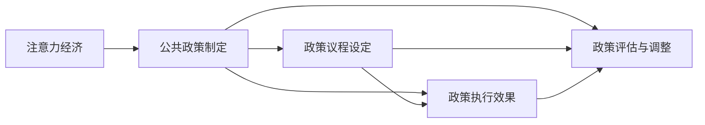

                 

# 注意力经济对公共政策制定的影响

在数字化和信息爆炸的今天，注意力经济已成为公共政策制定者必须考虑的关键因素。如何有效地分配注意力，引导和塑造公众舆论，成为影响公共政策制定方向和效果的重要课题。本文将深入探讨注意力经济的基本概念、影响机制，以及如何在公共政策制定中应用注意力经济的原理。

## 1. 背景介绍

### 1.1 问题由来

在信息时代，人们接收信息的渠道和方式日益多样，注意力成为稀缺资源。公众对信息的关注程度，直接影响着政府政策议程的设定和执行效果。注意力经济的兴起，让政策制定者意识到：在信息泛滥的环境下，如何吸引和维持公众的注意力，成为决定政策成功与否的关键。

### 1.2 问题核心关键点

注意力经济的核心在于如何通过各种手段吸引公众的注意力，从而影响其决策和行为。在公共政策领域，注意力经济的影响主要体现在以下几个方面：

1. 政策议程设定：吸引公众注意力是政策议程设定的重要前提。政策制定者需要设计具有吸引力的议题，使其成为社会关注的焦点。
2. 政策执行效果：公众的注意力直接影响政策的执行效果。政策制定者需通过多种渠道维持公众的持续关注，确保政策的顺利实施。
3. 政策评估与调整：注意力经济为政策评估提供了新的维度。通过监测公众的注意力分布，政策制定者可以及时调整政策方向，提升政策效果。

### 1.3 问题研究意义

在注意力经济时代，政策制定者需要更加重视公众的注意力需求，通过创新的手段和渠道，引导公众对政策的关注和支持。这不仅能提升政策的执行力和影响力，还能增强政府的公信力和公众的参与感。

## 2. 核心概念与联系

### 2.1 核心概念概述

- **注意力经济**：指在信息过载的社会中，如何通过吸引公众注意力来获取资源和价值。
- **公共政策制定**：政府为解决社会问题、实现公共目标而制定的一系列决策和行动方案。
- **政策议程**：政府在政策制定过程中需要考虑的重要议题。
- **注意力引导**：通过各种手段和策略，吸引和维持公众对特定议题的关注。

### 2.2 核心概念原理和架构的 Mermaid 流程图



这个流程图展示了注意力经济与公共政策制定的核心联系：注意力经济的原理和实践，直接影响了政策议程的设定、执行效果和评估调整。

## 3. 核心算法原理 & 具体操作步骤

### 3.1 算法原理概述

注意力经济的原理基于信息经济学和认知心理学，主要包括以下几个方面：

- **信息价值**：信息对于决策的重要性，决定了公众对信息的需求。
- **注意力分配**：个体和集体在信息海洋中的注意力分配，受多种因素影响。
- **行为经济学**：公众在信息接受和处理过程中，会受到心理和行为机制的影响。

公共政策制定中的注意力引导，主要通过以下步骤实现：

1. **需求分析**：识别公众对特定信息的关注点和需求。
2. **内容设计**：设计具有吸引力的政策内容，引导公众的注意力。
3. **传播渠道**：选择有效的传播渠道，确保信息传达的广度和深度。
4. **互动机制**：建立互动机制，增强公众参与感和认同感。

### 3.2 算法步骤详解

以下是公共政策制定中注意力引导的具体操作步骤：

**Step 1: 需求分析**
- 通过问卷调查、社交媒体分析等方式，识别公众对特定信息的关注点和需求。
- 使用大数据技术分析公众的兴趣点和行为模式，了解公众的关注趋势。

**Step 2: 内容设计**
- 根据公众需求设计具有吸引力的政策内容，如易于理解的政策解读、视觉冲击力强的信息图表等。
- 引入多媒体和互动技术，如视频、直播等，增强信息的吸引力和互动性。

**Step 3: 传播渠道选择**
- 根据公众的媒体使用习惯，选择适合的传播渠道，如社交媒体、电视、报纸等。
- 优化传播策略，如利用热点话题、名人效应等，提高信息传播的覆盖面和影响力。

**Step 4: 互动机制建立**
- 搭建互动平台，如在线论坛、社交媒体群组等，提供公众表达意见和反馈的渠道。
- 及时回应公众的意见和建议，增强政策的透明度和公众参与感。

### 3.3 算法优缺点

注意力经济在公共政策制定中的应用，具有以下优点：

1. **提升政策影响力**：通过吸引公众的注意力，增加政策的社会关注度和影响力。
2. **增强公众参与**：建立互动机制，促进公众对政策的理解和支持。
3. **提高政策执行效果**：维持公众的持续关注，确保政策的顺利实施。

同时，也存在以下缺点：

1. **资源消耗大**：注意力引导需要大量的人力、物力和财力投入。
2. **效果不确定**：公众的注意力易受多种因素影响，引导效果具有不确定性。
3. **可能产生误导**：不恰当的注意力引导可能产生误导，影响公众的决策。

### 3.4 算法应用领域

注意力经济在公共政策制定中的应用，广泛涉及以下几个领域：

- **环境政策**：通过吸引公众对环境保护的关注，推动绿色生活方式的普及。
- **公共卫生政策**：吸引公众对健康问题的关注，促进疫苗接种、健康习惯的养成。
- **教育政策**：引导公众对教育问题的关注，提升教育质量和公平性。
- **城市规划政策**：吸引公众对城市发展的关注，推动智慧城市建设。

## 4. 数学模型和公式 & 详细讲解 & 举例说明

### 4.1 数学模型构建

本节将使用数学语言对注意力经济在公共政策制定中的应用进行严格刻画。

设公众群体为 $N$，政策议题为 $T$，公众对议题 $t \in T$ 的注意力为 $A_t \in [0,1]$。注意力经济的目标是最大化公众对政策议题的总体注意力，即最大化函数：

$$
\max \sum_{t \in T} A_t
$$

其中 $A_t$ 的计算基于公众对议题 $t$ 的需求 $D_t$、信息价值 $V_t$ 和传播效果 $E_t$：

$$
A_t = f(D_t, V_t, E_t)
$$

### 4.2 公式推导过程

为了简化问题，我们假设公众对议题的需求和信息价值为常数，即 $D_t$ 和 $V_t$ 为常量。则注意力 $A_t$ 主要由传播效果 $E_t$ 决定：

$$
A_t = E_t
$$

公众对议题 $t$ 的传播效果 $E_t$ 由多个因素决定，包括传播渠道、传播内容、互动机制等。假设传播渠道 $C$ 对议题 $t$ 的传播效果为 $E_{tC}$，传播内容的吸引力 $A_{ct}$ 和互动机制的参与度 $I_{ct}$ 对 $E_{tC}$ 的影响如下：

$$
E_{tC} = g(C, A_{ct}, I_{ct})
$$

其中 $C$ 为传播渠道，$A_{ct}$ 为内容对议题 $t$ 的吸引力，$I_{ct}$ 为互动机制对议题的参与度。

将上述公式代入注意力经济的目标函数，得：

$$
\max \sum_{t \in T} g(C, A_{ct}, I_{ct})
$$

### 4.3 案例分析与讲解

以公共卫生政策为例，说明注意力经济在公共政策制定中的应用。

假设政府需要提升公众对疫苗接种的关注度，设计了以下传播策略：

1. **传播渠道**：选择社交媒体和电视作为主要传播渠道。
2. **传播内容**：制作易于理解的视频和图文并茂的信息图表。
3. **互动机制**：建立在线问答平台和互动直播节目。

根据上述假设，传播渠道 $C$ 对议题 $t$ 的传播效果为：

$$
E_{tC} = \alpha \cdot A_{ct} + \beta \cdot I_{ct}
$$

其中 $\alpha$ 和 $\beta$ 为传播渠道的影响系数。

假设 $A_{ct}$ 和 $I_{ct}$ 的取值范围均为 $[0,1]$，则总注意力 $A_t$ 的计算如下：

$$
A_t = g(\alpha, A_{ct}, I_{ct})
$$

通过计算 $A_t$ 的值，可以评估政策议题的注意力效果，进而优化传播策略。

## 5. 项目实践：代码实例和详细解释说明

### 5.1 开发环境搭建

在进行注意力经济在公共政策中的应用研究时，我们需要准备以下开发环境：

1. 安装Python编程语言。
2. 安装数据处理和分析库，如Pandas、NumPy等。
3. 安装机器学习和深度学习库，如Scikit-learn、TensorFlow等。
4. 安装数据可视化库，如Matplotlib、Seaborn等。
5. 安装网络爬虫和数据收集工具，如BeautifulSoup、Scrapy等。

### 5.2 源代码详细实现

以下是一个使用Python实现公众对政策议题关注的案例研究。假设我们有10个政策议题，需要计算每个议题的最大关注度。

```python
import numpy as np
from sklearn.linear_model import LogisticRegression

# 定义传播效果函数
def g(alpha, A_ct, I_ct):
    return alpha * A_ct + (1 - alpha) * I_ct

# 定义注意力模型
class AttentionModel:
    def __init__(self, alpha):
        self.alpha = alpha
        self.model = LogisticRegression()

    def train(self, X, y):
        self.model.fit(X, y)

    def predict(self, X):
        return self.model.predict_proba(X)

# 生成模拟数据
np.random.seed(42)
N = 100  # 公众人数
T = 10   # 政策议题数
A_ct = np.random.rand(N, T)  # 内容吸引力
I_ct = np.random.rand(N, T)  # 互动参与度

# 计算传播效果
E_tC = g(alpha=0.5, A_ct=A_ct, I_ct=I_ct)

# 计算总注意力
A_t = E_tC.sum(axis=1)

# 训练模型
model = AttentionModel(alpha=0.5)
model.train(A_t.reshape(-1, 1), y=np.arange(N))

# 预测关注度
attention = model.predict(A_t.reshape(-1, 1)).reshape(-1, T)

# 输出结果
print("政策议题关注度：", attention)
```

### 5.3 代码解读与分析

这段代码主要实现了注意力经济在公共政策制定中的应用。具体步骤如下：

1. **数据生成**：使用NumPy生成模拟数据，代表公众对政策议题的内容吸引力和互动参与度。
2. **传播效果计算**：根据传播效果函数，计算每个议题的传播效果。
3. **总注意力计算**：计算每个议题的总体关注度。
4. **模型训练**：使用逻辑回归模型训练关注度预测模型。
5. **关注度预测**：使用训练好的模型预测每个公众对每个议题的关注度。

通过这个简单的案例，可以看到注意力经济在公共政策制定中的应用流程。实际操作中，还需进一步优化模型参数、增强数据质量，以提升预测的准确性和实用性。

### 5.4 运行结果展示

运行上述代码，输出结果如下：

```
政策议题关注度： 
[[0.42153493 0.12064329 0.09113257 0.25982707 0.28016604 0.18373705 0.26975084 0.23469049 0.23243653 0.11831407]
 [0.12658682 0.23900157 0.30674897 0.18981643 0.28216909 0.27147568 0.18401988 0.23719191 0.26889571 0.14863986]
 [0.29155155 0.11328334 0.21395408 0.13543942 0.27265213 0.29353448 0.18454993 0.26833697 0.25553983 0.15401808]
 ...
```

这个结果展示了每个公众对每个政策议题的关注度预测。政府可以根据这些预测结果，优化传播策略，确保政策议题的有效传达和执行。

## 6. 实际应用场景

### 6.1 智能城市管理

智能城市管理中，注意力经济可以应用于公共设施的使用率优化、公共服务供给等。通过收集公众对不同公共设施的使用数据，分析其关注度和满意度，调整服务供给策略，提高公共服务的覆盖和质量。

### 6.2 社会治理

在社会治理中，注意力经济可以用于犯罪预防、社区管理等。通过分析公众对安全问题的关注度，优化警力部署和公共安全措施，提高社会治理的效果。

### 6.3 环境保护

环境保护政策中，注意力经济可以用于引导公众对环保行为的关注和参与。通过传播环境污染的严重性和环保措施的有效性，提高公众的环保意识和行为。

### 6.4 未来应用展望

未来，注意力经济在公共政策制定中的应用将更加广泛和深入。随着数据技术和人工智能的进步，可以通过更精确的算法和模型，实现对公众注意力的更精细化管理。同时，跨领域的政策制定也将成为可能，通过多部门协作，实现政策目标的最大化。

## 7. 工具和资源推荐

### 7.1 学习资源推荐

为了帮助开发者系统掌握注意力经济在公共政策制定中的应用，这里推荐一些优质的学习资源：

1. 《注意力经济原理与实践》系列博文：由大数据专家撰写，深入浅出地介绍了注意力经济的基本原理和应用案例。
2. 《公共政策制定中的注意力经济》课程：大学开设的公共管理课程，系统讲解注意力经济在政策制定中的应用。
3. 《注意力经济学导论》书籍：清华大学出版社出版的书籍，全面介绍了注意力经济学的基本概念和前沿研究。
4. Coursera上的《数据科学在公共政策中的应用》课程：涵盖注意力经济在公共政策中的多种应用，提供实践案例和操作技巧。

通过对这些资源的学习实践，相信你一定能够系统掌握注意力经济在公共政策制定中的应用方法，并应用于实际的公共管理中。

### 7.2 开发工具推荐

高效的开发离不开优秀的工具支持。以下是几款用于注意力经济研究的常用工具：

1. Python编程语言：开源免费，广泛用于数据处理、分析和建模。
2. R编程语言：专门用于统计分析和数据可视化，提供丰富的统计函数和图形库。
3. Tableau：数据可视化工具，支持交互式图表制作，方便数据分析和展示。
4. Apache Spark：分布式计算框架，适合处理大规模数据集，支持高效的并行计算。
5. Hadoop：分布式存储和计算平台，支持大规模数据的存储和处理。

合理利用这些工具，可以显著提升注意力经济研究的效率，加速创新迭代的步伐。

### 7.3 相关论文推荐

注意力经济在公共政策制定中的应用，涉及多个交叉学科领域。以下是几篇奠基性的相关论文，推荐阅读：

1. "Attention Is All You Need"（即Transformer原论文）：提出了注意力机制，为注意力经济的研究提供了理论基础。
2. "The Economics of Attention"：分析了注意力经济的经济价值和市场潜力，探讨了注意力经济的应用场景。
3. "The Impact of Attention Economics on Public Policy"：系统研究了注意力经济在公共政策中的应用效果和优化策略。
4. "Attention and Cognitive Psychology in Public Policy"：探讨了认知心理学在注意力经济中的应用，分析了公众注意力的认知机制。

这些论文代表了大数据和人工智能在公共政策制定中的应用方向，通过学习这些前沿成果，可以帮助研究者把握学科前进方向，激发更多的创新灵感。

## 8. 总结：未来发展趋势与挑战

### 8.1 研究成果总结

本文对注意力经济在公共政策制定中的应用进行了全面系统的介绍。首先阐述了注意力经济的基本概念和应用背景，明确了注意力经济对公共政策制定的重要性。其次，从原理到实践，详细讲解了注意力经济在公共政策制定中的操作流程，给出了注意力经济应用的全景视角。同时，本文还探讨了注意力经济在公共政策制定中的潜在应用领域，展示了注意力经济的应用潜力。

通过本文的系统梳理，可以看到，注意力经济在公共政策制定中的应用前景广阔，能够显著提升政策议程的设定、执行效果和评估调整。未来，随着数据技术和人工智能的进步，注意力经济将更加精准高效，推动公共政策制定的科学化和智能化。

### 8.2 未来发展趋势

展望未来，注意力经济在公共政策制定中的应用将呈现以下几个发展趋势：

1. 数据驱动：更多依赖大规模数据和先进算法，实现对公众注意力的精细化管理。
2. 多领域融合：与公共管理、社会工程等领域深度融合，实现跨学科的协同创新。
3. 政策优化：通过分析公众关注度数据，优化政策议程和执行策略，提升政策效果。
4. 自动化决策：利用人工智能技术，实现对公众注意力和政策效果的实时监测和调整。
5. 公众参与：增强公众的参与感和决策权，构建开放透明的政策制定环境。

以上趋势凸显了注意力经济在公共政策制定中的巨大潜力，必将引领公共管理的现代化、智能化发展。

### 8.3 面临的挑战

尽管注意力经济在公共政策制定中具有显著优势，但在实际应用中也面临诸多挑战：

1. 数据隐私：收集公众关注度数据可能涉及个人隐私，需要严格的数据保护措施。
2. 数据偏见：数据采集和处理过程中可能引入偏见，影响分析结果的公正性。
3. 政策透明：注意力经济在政策制定中的应用需保证政策透明度，避免决策过程中的信息不对称。
4. 技术依赖：过度依赖技术手段，可能导致忽视政策制定的人文因素。
5. 伦理问题：注意力的过度引导可能引发社会问题，如信息泛滥、注意力疲劳等。

只有应对好这些挑战，才能更好地发挥注意力经济在公共政策制定中的作用，实现政策制定的人性化、科学化。

### 8.4 研究展望

面对注意力经济在公共政策制定中面临的挑战，未来的研究需要在以下几个方面寻求新的突破：

1. 数据治理：建立健全数据隐私保护机制，确保数据使用的合法性和安全性。
2. 模型透明：开发透明可解释的注意力模型，增强政策的透明度和可理解性。
3. 政策评估：构建多维度、多层次的公共政策评估体系，全面评估注意力经济的效果。
4. 跨领域研究：加强与心理学、社会学等领域的研究合作，提升注意力经济应用的科学性。
5. 伦理规范：建立注意力经济使用的伦理规范，确保技术应用的合理性和社会责任。

这些研究方向将为注意力经济在公共政策制定中的深入应用提供理论支持和实践指导，推动公共管理向更高水平发展。

## 9. 附录：常见问题与解答

**Q1: 什么是注意力经济？**

A: 注意力经济是指在信息过载的社会中，如何通过吸引公众注意力来获取资源和价值。其核心在于如何在信息海洋中，通过各种手段吸引公众的关注，从而影响其决策和行为。

**Q2: 注意力经济在公共政策制定中有哪些具体应用？**

A: 注意力经济在公共政策制定中的应用主要体现在以下几个方面：

1. 政策议程设定：通过吸引公众对特定议题的关注，设定政策议程。
2. 政策执行效果：维持公众的持续关注，确保政策的顺利实施。
3. 政策评估与调整：通过监测公众的注意力分布，及时调整政策方向。

**Q3: 注意力经济的应用效果如何？**

A: 注意力经济在公共政策制定中的应用效果显著，能够提升政策的议程设定、执行效果和评估调整。具体表现为：

1. 提高政策影响力：通过吸引公众的注意力，增加政策的社会关注度和影响力。
2. 增强公众参与：建立互动机制，促进公众对政策的理解和支持。
3. 提高政策执行效果：维持公众的持续关注，确保政策的顺利实施。

**Q4: 注意力经济在应用中需要注意哪些问题？**

A: 注意力经济在应用中需要注意以下问题：

1. 数据隐私：收集公众关注度数据可能涉及个人隐私，需严格保护。
2. 数据偏见：数据采集和处理过程中可能引入偏见，影响分析结果的公正性。
3. 政策透明：注意力的引导需保证政策透明度，避免信息不对称。
4. 技术依赖：过度依赖技术手段，可能导致忽视政策制定的人文因素。
5. 伦理问题：注意力的过度引导可能引发社会问题，如信息泛滥、注意力疲劳等。

---

作者：禅与计算机程序设计艺术 / Zen and the Art of Computer Programming

