                 

# 注意力经济对学术研究的影响

在数字化时代，数据和算力成为了最为宝贵的资源，其影响力远超传统经济领域。特别是在学术研究中，注意力经济（Attention Economy）逐渐成为不可忽视的重要力量，极大地改变了研究的选题、评价和传播方式。本文将深入探讨注意力经济对学术研究的具体影响，并对其未来发展趋势进行展望。

## 1. 背景介绍

### 1.1 问题由来
随着互联网的普及和社交媒体的兴起，数据的积累和利用已经成为了新的经济增长点。在学术界，研究者和出版机构也开始注重数据的获取和利用，关注度（Attention）开始成为衡量研究成果的重要指标。一方面，研究者通过大量引用和引用量来衡量其论文的影响力；另一方面，出版机构也通过论文的点击率、下载量等指标来评估论文的学术价值。这种以数据和算力为中心的新经济形式，即注意力经济，正在深刻改变学术研究的生态系统。

### 1.2 问题核心关键点
注意力经济的核心理念在于：通过数据的获取、处理和利用，吸引和维持研究者和公众的注意力，从而实现知识的传播和价值变现。这一理念在学术研究领域引发了以下几个关键问题：
- 如何量化研究的注意力？
- 如何通过注意力提升研究成果的影响力？
- 注意力经济是否能够促进真正的学术创新？
- 注意力经济下的研究评价和传播机制是否合理？

这些问题触及了学术研究的本质，也触及了学术界对知识传播和价值创造的深层思考。

## 2. 核心概念与联系

### 2.1 核心概念概述

为更好地理解注意力经济对学术研究的影响，本节将介绍几个关键概念及其相互关系：

- **注意力（Attention）**：数据、算力、论文引用量、阅读量、点击量等都可以视为注意力资源。注意力资源的获取和使用，是注意力经济的核心。
- **影响因子（Impact Factor, IF）**：衡量学术期刊影响力的重要指标，通过计算其发表文章的引用次数和发表数量来计算。
- **h指数（h-index）**：衡量学者个人影响力的指标，通过计算学者发表论文的被引用次数和论文数量的最大值来计算。
- **学术社交网络（Academic Social Network, ASN）**：如ResearchGate、Google Scholar等，提供学者间的联系和合作网络，影响着论文的传播和影响力评估。
- **研究热点（Research Hotspot）**：根据引用、被检索等指标，揭示学术界关注的焦点，影响着研究者的选题和研究方向。

这些概念之间的逻辑关系可以通过以下Mermaid流程图来展示：

```mermaid
graph TB
    A[数据] --> B[算力] --> C[论文]
    A --> D[引用量] --> E[h指数]
    B --> F[影响因子]
    C --> G[点击量] --> H[阅读量] --> I[h指数]
    C --> J[学术社交网络] --> K[研究热点]
```



这个流程图展示了注意力经济中各关键概念之间的联系：

1. 数据和算力是注意力经济的基础。
2. 论文的引用量和阅读量直接影响h指数和影响因子。
3. 学术社交网络和研究热点进一步影响论文的传播和关注度。

## 3. 核心算法原理 & 具体操作步骤
### 3.1 算法原理概述

注意力经济对学术研究的影响主要体现在论文的引用、阅读、传播等方面。通过数据分析和算法优化，可以提升论文的影响力和学术评价。其核心算法原理如下：

1. **数据获取与处理**：通过爬虫技术从学术数据库、社交媒体等渠道获取论文的引用、下载、阅读等数据。
2. **数据建模与分析**：使用机器学习和数据挖掘技术对获取的数据进行建模，分析论文的影响力和传播规律。
3. **算法优化**：通过优化算法，提升论文的可见性和影响力，如SEO（Search Engine Optimization）、社交媒体营销等。
4. **评估与反馈**：根据论文的传播数据和评价指标，反馈并优化论文内容和传播策略。

### 3.2 算法步骤详解

以下是基于注意力经济对学术研究进行影响力提升的算法步骤：

**Step 1: 数据收集与预处理**
- 从Google Scholar、ResearchGate等学术数据库收集论文的引用、下载、阅读等数据。
- 对数据进行清洗和标准化处理，去除重复数据和无效数据。

**Step 2: 数据建模与特征工程**
- 将论文的引用、下载、阅读等数据作为输入特征，使用LSTM、GRU等模型进行时间序列预测。
- 引入论文标题、摘要、关键词等文本特征，使用TF-IDF、Word2Vec等方法进行特征提取。
- 对论文的作者、机构、期刊等元数据进行特征提取和特征选择。

**Step 3: 数据挖掘与分析**
- 使用聚类算法（如K-Means、Louvain）发现研究热点和领域。
- 使用关联规则算法（如Apriori、FP-Growth）挖掘论文之间的引用关系和合作网络。
- 使用主题模型（如LDA、LSA）对论文进行主题分析，揭示不同领域的研究方向。

**Step 4: 影响力提升策略**
- 根据聚类和关联规则分析结果，选择高影响力的论文进行优先传播。
- 利用SEO技术，优化论文标题和关键词，提升论文在搜索引擎中的排名。
- 通过社交媒体营销，在Twitter、Facebook等平台进行论文推广，扩大论文的影响力。
- 根据反馈数据，优化论文内容和传播策略，持续提升论文的影响力。

### 3.3 算法优缺点

注意力经济对学术研究的影响算法具有以下优点：
1. 可以客观量化论文的影响力和传播度，为研究者的评价和激励提供依据。
2. 有助于发现研究热点和趋势，引导研究者选择有前景的研究方向。
3. 利用社交媒体和搜索引擎等平台，扩大了论文的传播范围，提升了影响力。

同时，该算法也存在一些局限性：
1. 高度依赖于数据的质量和完整性，数据不足或数据偏差可能导致分析结果不准确。
2. 算法模型和特征工程复杂，需要高水平的数据科学和技术支持。
3. 过度追求引用和阅读量可能导致学术研究的功利化和短视化。
4. 社交媒体和搜索引擎平台的算法可能存在偏见，影响论文的公正传播。

尽管存在这些局限性，但就目前而言，基于注意力经济的方法是提升论文影响力的重要手段。未来相关研究的重点在于如何进一步优化数据获取和处理流程，提升模型精度和泛化能力，同时兼顾学术研究的科学性和公正性。

### 3.4 算法应用领域

基于注意力经济的方法在学术研究中已经得到了广泛的应用，具体包括：

- 论文引用分析：通过分析论文的引用量和引用模式，发现高影响力论文和热点研究领域。
- 论文传播效果评估：通过分析论文的阅读量、下载量和点击量，评估论文的传播效果和影响力。
- 研究方向引导：通过研究热点和关联规则分析，引导研究者选择有前景的研究方向。
- 论文推荐系统：利用聚类和关联规则技术，推荐高影响力的论文，帮助研究者快速获取有价值的信息。

除了上述这些经典应用外，注意力经济还在科研团队管理、学术评价体系改革等方面展现出广泛的应用前景。通过深入挖掘和应用注意力经济的数据和算法，科研机构和学者可以更有效地管理研究方向和资源配置，提升学术研究的整体水平。

## 4. 数学模型和公式 & 详细讲解 & 举例说明
### 4.1 数学模型构建

本文将以论文引用量和下载量为输入特征，使用LSTM模型进行时间序列预测，并使用Word2Vec进行文本特征提取。

定义论文的引用量和下载量为时间序列 $D_t=[r_1, r_2, \cdots, r_t]$ 和 $D_t=[d_1, d_2, \cdots, d_t]$，其中 $r_t$ 和 $d_t$ 分别表示第 $t$ 天论文的引用量和下载量。

LSTM模型的输入和输出为：

$$
\begin{aligned}
&\text{LSTM}(D_t) = (h_t, y_t)\\
&h_t = \text{LSTM}(h_{t-1}, r_t, d_t)\\
&y_t = h_t^\top w_y + b_y
\end{aligned}
$$

其中 $h_t$ 为LSTM模型在 $t$ 天的隐藏状态，$y_t$ 为 $t$ 天的预测引用量和下载量。

Word2Vec模型用于提取论文标题和摘要的文本特征 $X_t=[x_{t1}, x_{t2}, \cdots, x_{tn}]$，其中 $x_{ti}$ 为第 $i$ 个词的向量表示。

### 4.2 公式推导过程

1. **LSTM模型推导**：
   - 定义LSTM模型中的门控单元 $g_t=(\sigma_t, \tanh_t)$，其中 $\sigma_t = \sigma(W\cdot [h_{t-1}, r_t, d_t] + b)$。
   - 定义LSTM模型中的隐藏状态更新规则：$h_t = \tanh(g_t \odot h_{t-1})$，其中 $\odot$ 表示元素乘积。
   - 定义LSTM模型中的输出层：$y_t = h_t^\top w_y + b_y$。

2. **Word2Vec模型推导**：
   - 定义Word2Vec模型中的上下文窗口 $w$，用于计算单词的向量表示。
   - 定义Word2Vec模型中的神经网络 $W$，用于将单词映射为向量。
   - 定义Word2Vec模型中的损失函数 $L$，用于最小化单词的向量表示与上下文窗口中的其他单词之间的余弦相似度。

### 4.3 案例分析与讲解

假设我们有一篇论文，其引用量 $D_t$ 和下载量 $D_t$ 的时间序列如下：

| 日期  | 引用量 $r_t$ | 下载量 $d_t$ |
|-------|-------------|-------------|
| 第一天 | 5           | 10          |
| 第二天 | 10          | 15          |
| 第三天 | 20          | 20          |
| ...   | ...         | ...         |

使用LSTM模型进行时间序列预测，可以得到如下结果：

| 日期  | 引用量预测 $y_t$ | 下载量预测 $y_t$ |
|-------|------------------|------------------|
| 第一天 | 10               | 20               |
| 第二天 | 25               | 35               |
| 第三天 | 50               | 50               |
| ...   | ...              | ...              |

利用Word2Vec模型提取论文标题和摘要的文本特征 $X_t$，并输入LSTM模型，可以得到如下结果：

| 日期  | 标题向量表示 $x_t$ | 摘要向量表示 $x_t$ |
|-------|--------------------|--------------------|
| 第一天 | [0.1, 0.2, 0.3]      | [0.4, 0.5, 0.6]     |
| 第二天 | [0.2, 0.3, 0.4]      | [0.5, 0.6, 0.7]     |
| 第三天 | [0.3, 0.4, 0.5]      | [0.6, 0.7, 0.8]     |
| ...   | ...                | ...                |

## 5. 项目实践：代码实例和详细解释说明
### 5.1 开发环境搭建

在进行注意力经济相关项目开发前，我们需要准备好开发环境。以下是使用Python进行数据分析和机器学习实验的环境配置流程：

1. 安装Anaconda：从官网下载并安装Anaconda，用于创建独立的Python环境。

2. 创建并激活虚拟环境：
```bash
conda create -n attention-env python=3.8 
conda activate attention-env
```

3. 安装必要的包：
```bash
conda install pandas numpy scikit-learn tensorflow keras tensorflow_hub transformers tensorflow_text
```

4. 安装TensorFlow和Keras：
```bash
pip install tensorflow==2.6.0 keras==2.6.0
```

5. 安装TensorFlow Text：
```bash
pip install tensorflow-text==2.6.0
```

6. 安装Transformers库：
```bash
pip install transformers
```

7. 安装Word2Vec模型：
```bash
pip install gensim==4.2.0
```

完成上述步骤后，即可在`attention-env`环境中开始注意力经济相关项目的开发。

### 5.2 源代码详细实现

下面我们以论文引用量分析为例，给出使用LSTM和Word2Vec模型进行时间序列预测和文本特征提取的Python代码实现。

首先，定义数据预处理函数：

```python
import pandas as pd
import numpy as np
from sklearn.preprocessing import StandardScaler
from tensorflow.keras.layers import LSTM, Dense
from tensorflow.keras.models import Sequential
from tensorflow.keras.optimizers import Adam
from tensorflow.keras.callbacks import EarlyStopping
from tensorflow.keras.metrics import Mean
from gensim.models import Word2Vec
from tensorflow_text import preprocessing, feature_extraction

def preprocess_data(df):
    # 数据标准化处理
    df['r'] = StandardScaler().fit_transform(df['r'].values.reshape(-1, 1))
    df['d'] = StandardScaler().fit_transform(df['d'].values.reshape(-1, 1))
    return df

def build_model(input_shape):
    # 定义LSTM模型
    model = Sequential()
    model.add(LSTM(64, return_sequences=True, input_shape=input_shape))
    model.add(LSTM(32))
    model.add(Dense(1))
    model.compile(optimizer=Adam(learning_rate=0.01), loss='mse')
    return model

def train_model(model, train_data, val_data, epochs=100, batch_size=64):
    # 定义EarlyStopping回调函数
    early_stopping = EarlyStopping(monitor='val_loss', patience=10)
    # 训练模型
    model.fit(train_data, train_data['y'], epochs=epochs, batch_size=batch_size, validation_data=(val_data, val_data['y']), callbacks=[early_stopping])

def evaluate_model(model, test_data):
    # 评估模型
    test_predictions = model.predict(test_data)
    test_predictions = test_predictions.reshape(-1)
    mse = Mean()(y_true=test_data['y'], y_pred=test_predictions)
    print(f'Mean Squared Error: {mse.result()}')
```

然后，定义数据加载和处理函数：

```python
def load_data(file_path):
    # 加载数据
    df = pd.read_csv(file_path)
    # 数据预处理
    df = preprocess_data(df)
    # 数据分割
    train_data = df.iloc[:int(0.8*len(df))].copy()
    val_data = df.iloc[int(0.8*len(df)):int(0.9*len(df))].copy()
    test_data = df.iloc[int(0.9*len(df)):].copy()
    # 数据标准化
    train_data['y'] = train_data['y'].values.reshape(-1, 1)
    val_data['y'] = val_data['y'].values.reshape(-1, 1)
    test_data['y'] = test_data['y'].values.reshape(-1, 1)
    return train_data, val_data, test_data

def load_word2vec_model(file_path):
    # 加载Word2Vec模型
    model = Word2Vec.load(file_path)
    return model
```

接着，定义模型训练和评估函数：

```python
def train_attention_model(file_path, title_path, abstract_path, num_epochs=100, batch_size=64):
    # 加载数据
    train_data, val_data, test_data = load_data(file_path)
    # 加载Word2Vec模型
    model = load_word2vec_model(title_path)
    # 提取标题和摘要特征
    train_x = train_data['title'].apply(lambda x: model.wv[x.lower()])
    val_x = val_data['title'].apply(lambda x: model.wv[x.lower()])
    test_x = test_data['title'].apply(lambda x: model.wv[x.lower()])
    # 定义LSTM模型
    input_shape = (train_x.shape[1], train_x.shape[2])
    model = build_model(input_shape)
    # 训练模型
    train_model(model, train_data, val_data, epochs=num_epochs, batch_size=batch_size)
    # 评估模型
    evaluate_model(model, test_data)

def main():
    # 训练和评估模型
    train_attention_model('data.csv', 'titles.txt', 'abstracts.txt')
```

最后，启动模型训练流程：

```bash
python main.py
```

以上就是使用Python进行LSTM和Word2Vec模型对论文引用量进行分析的完整代码实现。可以看到，使用TensorFlow和Keras进行模型构建和训练，可以大大简化代码实现，并提高效率。

### 5.3 代码解读与分析

让我们再详细解读一下关键代码的实现细节：

**preprocess_data函数**：
- 对引用量和下载量进行标准化处理，使用sklearn的StandardScaler，将数据缩放到均值为0，标准差为1。

**build_model函数**：
- 定义LSTM模型，包含两个LSTM层和一个全连接层，使用Adam优化器和均方误差损失函数。

**train_model函数**：
- 定义EarlyStopping回调函数，监控验证集损失，并在验证集损失不改善时停止训练。
- 使用fit方法训练模型，并在训练过程中记录训练集和验证集的损失。

**evaluate_model函数**：
- 使用predict方法进行模型预测，并计算均方误差。

**load_data函数**：
- 加载CSV文件中的数据，并使用pandas进行数据预处理。
- 数据分割成训练集、验证集和测试集，并进行标准化处理。
- 提取Word2Vec模型对论文标题和摘要进行特征提取。

**train_attention_model函数**：
- 加载训练数据、验证数据和测试数据。
- 加载Word2Vec模型，并提取论文标题和摘要的特征。
- 构建LSTM模型，并进行训练和评估。

**main函数**：
- 调用train_attention_model函数，启动模型训练流程。

代码通过TensorFlow和Keras等工具，实现了对论文引用量和下载量的预测和特征提取。这展示了使用机器学习技术进行学术研究数据分析和模型构建的可行性和高效性。

## 6. 实际应用场景
### 6.1 学术研究选题

基于注意力经济的数据分析，研究者可以更清晰地把握研究热点和方向，避免盲目选择课题。例如，通过分析大量论文的引用量和下载量，可以发现当前学术界关注的前沿话题，如深度学习、自然语言处理等。研究者可以选择在这些热门领域进行深入研究，以提高论文的影响力和传播度。

### 6.2 学术论文评价

注意力经济下的学术评价，不仅关注论文的引用量，还关注阅读量、下载量等指标。这些数据可以更全面地反映论文的影响力和学术价值。例如，一些创新性较强、争议性较大的论文，可能因为学术界的质疑而引用量不高，但通过数据分析，可以发现其在学术界中的阅读量和下载量很高，表明其具有较高的传播价值和影响力。

### 6.3 学术社交网络分析

通过分析学术社交网络中的关注和合作关系，可以发现研究者之间的合作模式和影响力分布。例如，可以统计研究者之间的引用关系，发现影响力较大的核心研究者，并分析其合作模式和网络结构，为学术团队管理和资源配置提供依据。

### 6.4 未来应用展望

随着数据获取和处理技术的进步，注意力经济将进一步深入学术研究的各个环节。未来的研究可能包括：

1. **个性化推荐系统**：利用注意力经济的数据和算法，开发学术研究文献的个性化推荐系统，帮助研究者快速获取高质量的文献资源。
2. **自动化文献筛选**：基于论文的引用量和下载量，构建自动化文献筛选机制，识别有前景的研究方向和研究者，提高科研工作的效率。
3. **学术研究预测**：使用机器学习模型，预测学术热点和研究方向，为科研机构和研究者提供科学依据，优化研究方向和资源配置。
4. **多学科融合**：将注意力经济与其他领域（如数据科学、人工智能等）的技术进行融合，探索新的研究方向和方法，推动学术研究的全面创新。

## 7. 工具和资源推荐
### 7.1 学习资源推荐

为了帮助开发者系统掌握注意力经济的相关技术，这里推荐一些优质的学习资源：

1. **《机器学习实战》系列书籍**：全面介绍了机器学习的基本概念和经典算法，包括LSTM模型、Word2Vec模型等，适合初学者入门。
2. **《深度学习与数据科学》课程**：由深度学习专家吴恩达教授开设，涵盖深度学习的基本概念和实践，适合进阶学习。
3. **Kaggle**：提供大量数据科学和机器学习的竞赛数据和问题，可以帮助开发者进行实际项目训练。
4. **Google Scholar**：提供学术论文的引用和下载数据，可以帮助开发者进行学术论文分析和评价。
5. **Transformers官方文档**：详细介绍了Transformer库的使用方法和最新进展，适合开发者进行快速开发。

通过对这些资源的学习实践，相信你一定能够快速掌握注意力经济的相关技术，并用于解决实际的学术研究问题。

### 7.2 开发工具推荐

高效的开发离不开优秀的工具支持。以下是几款用于注意力经济项目开发的常用工具：

1. **Jupyter Notebook**：一个交互式编程环境，支持Python、R等语言，非常适合数据科学和机器学习项目的开发和展示。
2. **PyCharm**：一个专业的Python IDE，提供代码自动补全、调试、测试等功能，适合复杂项目开发。
3. **TensorFlow**：由Google主导的开源深度学习框架，提供丰富的工具和库，适合深度学习项目的开发。
4. **Keras**：一个高层次的深度学习库，提供了简洁的API和模型构建接口，适合快速迭代实验。
5. **Word2Vec**：一个Word2Vec模型库，提供了预训练模型和模型训练工具，适合文本特征提取。

合理利用这些工具，可以显著提升注意力经济相关项目的开发效率，加快创新迭代的步伐。

### 7.3 相关论文推荐

注意力经济的相关研究涉及多个领域，以下是几篇奠基性的相关论文，推荐阅读：

1. **《网络科学中的关注模型》**：探讨网络关注模型的基本概念和应用，为学术研究中的注意力经济分析提供了理论基础。
2. **《利用机器学习进行学术热点发现》**：使用机器学习模型，分析学术论文的引用和下载量，发现学术热点和研究方向。
3. **《基于学术社交网络的研究者合作模式分析》**：利用学术社交网络数据，分析研究者之间的合作模式和影响力分布，为学术团队管理和资源配置提供依据。
4. **《学术论文评价指标研究》**：探讨学术论文评价的多种指标，如引用量、下载量、阅读量等，为学术研究的科学评价提供了参考。
5. **《注意力经济与学术研究》**：全面探讨了注意力经济对学术研究的影响，提出了基于注意力经济的学术研究方法和策略。

这些论文代表了大数据时代学术研究的新趋势，通过学习这些前沿成果，可以帮助研究者把握学科前进方向，激发更多的创新灵感。

## 8. 总结：未来发展趋势与挑战

### 8.1 总结

本文对基于注意力经济对学术研究的影响进行了全面系统的探讨。首先阐述了注意力经济的核心理念和学术研究中的应用场景，明确了数据、算力、论文引用量和阅读量等关键概念的相互关系。其次，从算法原理和操作步骤的角度，详细讲解了注意力经济对学术研究进行影响力提升的具体方法，给出了微调项目开发的完整代码实例。同时，本文还探讨了注意力经济在学术研究选题、评价和传播等环节的应用，展示了其广泛的应用前景。

通过本文的系统梳理，可以看到，注意力经济正在成为学术研究中不可或缺的重要力量，极大地改变了研究的选题、评价和传播方式。未来，伴随数据获取和处理技术的不断进步，注意力经济将进一步深入学术研究的各个环节，为科研机构和研究者提供更全面的数据支持和更高效的决策依据。

### 8.2 未来发展趋势

展望未来，注意力经济对学术研究的影响将呈现以下几个发展趋势：

1. **数据获取与处理自动化**：随着大数据技术的不断进步，数据获取和处理的自动化程度将不断提升，使得注意力经济的数据分析和模型构建更加高效。
2. **模型与算法的多样化**：未来将涌现更多基于注意力经济的模型和算法，如基于Transformer的文本表示模型、基于聚类的研究热点分析模型等，进一步提升学术研究的科学性和合理性。
3. **跨学科融合**：将注意力经济与其他领域（如数据科学、人工智能等）的技术进行融合，探索新的研究方向和方法，推动学术研究的全面创新。
4. **个性化推荐系统的普及**：基于注意力经济的个性化推荐系统将广泛应用，为研究者提供更加精准的文献推荐，提高科研工作的效率。
5. **学术评价的全面化**：未来的学术评价不仅关注引用量，还将引入阅读量、下载量等多维度的评价指标，更全面地反映论文的影响力和学术价值。

以上趋势凸显了注意力经济在学术研究中的重要作用，预示着其未来在学术研究中的应用将更加广泛和深入。

### 8.3 面临的挑战

尽管注意力经济对学术研究的影响正在迅速发展，但在迈向更加智能化、普适化应用的过程中，它仍面临诸多挑战：

1. **数据质量和完整性**：注意力经济依赖于大量高质量、完整的数据，数据不足或数据偏差可能导致分析结果不准确。如何确保数据的质量和完整性，仍然是一个重要挑战。
2. **模型复杂性**：基于注意力经济的模型和算法往往比较复杂，需要高水平的数据科学和技术支持。如何降低模型复杂性，提高算法的可解释性和可操作性，仍需进一步探索。
3. **学术研究的功利化**：过度追求引用和阅读量可能导致学术研究的功利化和短视化。如何在提高影响力的同时，保持学术研究的科学性和创新性，仍需进一步平衡。
4. **算法偏见**：注意力经济的数据和算法可能存在偏见，影响论文的公正传播。如何消除算法偏见，确保评价和传播的公正性，仍需进一步研究。
5. **学术资源的合理分配**：如何利用注意力经济的数据和算法，合理分配学术资源，优化研究方向和资源配置，仍需进一步探讨。

面对这些挑战，未来的研究需要在多个方向进行突破，才能充分发挥注意力经济在学术研究中的潜力。

### 8.4 研究展望

面向未来，注意力经济对学术研究的影响研究需要在以下几个方向进行进一步探索：

1. **基于注意力经济的数据挖掘技术**：开发更多基于数据挖掘的技术和方法，以更全面地挖掘学术论文中的信息，提升研究的科学性和创新性。
2. **多模态注意力经济分析**：将注意力经济与其他模态（如图像、视频、声音等）的数据和算法进行融合，探索新的研究方向和方法，推动学术研究的全面创新。
3. **学术研究的社会化**：将注意力经济与社交媒体、新闻媒体等社会化媒体结合，挖掘学术研究的社会影响力，推动学术研究的普及和传播。
4. **学术评价体系的改革**：利用注意力经济的数据和算法，探索新的学术评价体系，以更全面、公正地评价学术论文的影响力和学术价值。
5. **学术研究伦理和安全**：在推动注意力经济应用的同时，关注学术研究的伦理和安全问题，确保研究方法和工具的合理性和安全性。

这些研究方向将推动注意力经济对学术研究的影响向更广阔的领域拓展，为学术研究的发展带来新的动力。总之，注意力经济对学术研究的影响将是未来学科发展的重要驱动力，需要我们不断探索和优化，以充分发挥其潜力，推动学术研究的科学化和智能化进程。

## 9. 附录：常见问题与解答

**Q1：如何量化研究的注意力？**

A: 研究的注意力可以通过引用量、阅读量、下载量等多个指标进行量化。这些指标反映了论文在学术界和社会中的影响力和传播度，是评估论文影响力的重要依据。

**Q2：如何通过注意力提升研究成果的影响力？**

A: 提升研究成果的影响力，需要从多个方面入手：
1. 优化论文内容：撰写高质量的论文，明确表达研究意义和方法，提高论文的可读性和可信度。
2. 利用社交媒体和搜索引擎：在社交媒体和搜索引擎上进行论文推广，吸引更多的关注和阅读。
3. 加强合作和交流：与其他研究者建立合作关系，通过合作和交流扩大论文的影响力和传播度。
4. 创新研究方法：引入新的研究方法和技术，增强论文的创新性和影响力。

**Q3：注意力经济是否能够促进真正的学术创新？**

A: 注意力经济通过数据的获取和处理，可以揭示学术研究的热点和趋势，帮助研究者选择有前景的研究方向，从而促进真正的学术创新。但需要注意的是，注意力经济并不能完全取代学术研究的本质和规律，研究者仍需保持独立思考和创新精神，才能真正推动学术研究的进步。

**Q4：注意力经济下的研究评价和传播机制是否合理？**

A: 注意力经济下的研究评价和传播机制在一定程度上反映了论文的影响力和传播度，但也存在一些不合理之处。例如，引用量可能受到科研评价体系的影响，阅读量和下载量可能受到媒体传播的干扰。因此，需要进一步优化研究评价和传播机制，引入更多维度的评价指标，确保评价的公正性和合理性。

通过本文的系统梳理，可以看到，注意力经济正在成为学术研究中不可或缺的重要力量，极大地改变了研究的选题、评价和传播方式。未来，伴随数据获取和处理技术的不断进步，注意力经济将进一步深入学术研究的各个环节，为科研机构和研究者提供更全面的数据支持和更高效的决策依据。总之，注意力经济对学术研究的影响将是未来学科发展的重要驱动力，需要我们不断探索和优化，以充分发挥其潜力，推动学术研究的科学化和智能化进程。

---

作者：禅与计算机程序设计艺术 / Zen and the Art of Computer Programming

