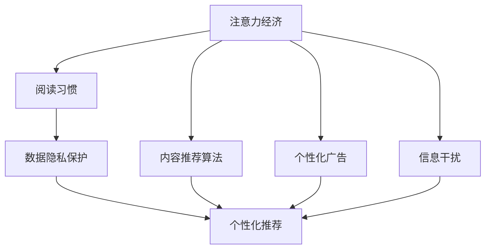

                 

# 注意力经济对阅读习惯的影响

> 关键词：注意力经济, 阅读习惯, 内容推荐, 算法优化, 用户行为分析

## 1. 背景介绍

### 1.1 问题由来
在信息爆炸的时代，人们的注意力成为一种稀缺资源。各大平台为了争夺用户的眼球，不断通过内容推荐、个性化广告等方式来吸引注意力，形成了所谓的"注意力经济"。这种经济模式，直接影响了人们的阅读习惯，改变了信息获取和传播的方式。

### 1.2 问题核心关键点
1. **注意力经济**：指平台通过吸引用户注意力，形成经济收益的模式。在阅读领域，这种模式通过个性化内容推荐、广告投放等手段，引导用户点击、浏览和参与。
2. **阅读习惯**：指用户阅读内容的频率、时长、偏好等行为特征。注意力经济改变了用户如何、何时、何地阅读，影响了阅读行为的多样性和持续性。
3. **内容推荐算法**：指利用用户行为数据和内容特征，通过算法模型推荐用户可能感兴趣的内容。不同的算法模型对用户阅读习惯有显著影响。
4. **个性化广告**：指基于用户兴趣和行为特征，推送相关广告。广告的曝光和点击行为也会影响用户的阅读习惯。
5. **信息干扰**：指过量的信息推送和广告干扰，影响用户集中注意力的能力，导致阅读效率和深度的下降。
6. **数据隐私保护**：指在个性化推荐中如何保护用户数据隐私，平衡个性化和隐私权的关系。

## 2. 核心概念与联系

### 2.1 核心概念概述

为更好地理解注意力经济对阅读习惯的影响，本节将介绍几个密切相关的核心概念：

- **注意力经济**：指通过吸引用户注意力来创造价值的模式，常见于信息平台、社交媒体、在线广告等领域。
- **阅读习惯**：指用户在日常生活中的阅读行为，包括阅读时间、阅读平台、阅读频率、阅读深度等。
- **内容推荐算法**：指利用用户行为数据和内容特征，推荐用户可能感兴趣的内容。常见的算法包括协同过滤、基于深度学习的推荐系统等。
- **个性化广告**：指基于用户兴趣和行为特征，推送相关广告。广告的曝光和点击行为也会影响用户的阅读习惯。
- **信息干扰**：指过量的信息推送和广告干扰，影响用户集中注意力的能力，导致阅读效率和深度的下降。
- **数据隐私保护**：指在个性化推荐中如何保护用户数据隐私，平衡个性化和隐私权的关系。

这些核心概念之间的逻辑关系可以通过以下Mermaid流程图来展示：



这个流程图展示了一个简化的注意力经济体系，其中：

1. 注意力经济通过各种方式吸引用户注意力，形成用户阅读习惯。
2. 内容推荐算法和个性化广告作为注意力经济的主要工具，影响用户阅读习惯。
3. 信息干扰和数据隐私保护在实践中需要平衡，以确保推荐系统的有效性和用户隐私。
4. 个性化推荐系统最终影响用户的阅读行为。

## 3. 核心算法原理 & 具体操作步骤
### 3.1 算法原理概述

注意力经济对阅读习惯的影响，主要体现在个性化推荐系统对用户行为数据的利用上。个性化推荐系统通过分析用户的历史行为数据，预测其兴趣偏好，从而推荐符合其兴趣的内容。这种系统通过不断地调整推荐策略，逐步改变用户的阅读习惯。

假设一个用户的历史行为数据为 $H=\{x_i, t_i\}_{i=1}^N$，其中 $x_i$ 表示用户第 $i$ 次的行为数据（如浏览网页、购买商品等），$t_i$ 表示行为的时间戳。通过这些数据，推荐系统可以构建用户行为模型 $P$，用于预测用户未来可能的行为。在阅读领域，用户行为模型 $P$ 可以描述为：

$$
P(\hat{x}_{i+1} \mid H_i) = \mathop{\arg\max}_{x} \mathcal{L}(x, H_i)
$$

其中，$\mathcal{L}$ 为损失函数，用于衡量推荐系统推荐的物品与用户真实行为之间的差距。

### 3.2 算法步骤详解

基于注意力经济的个性化推荐系统，通常包括以下几个关键步骤：

**Step 1: 数据收集与预处理**
- 收集用户的历史行为数据 $H=\{x_i, t_i\}_{i=1}^N$。
- 对数据进行清洗、去重、标准化等预处理操作。

**Step 2: 特征提取与表示**
- 从历史行为数据中提取用户兴趣特征，如浏览频率、浏览时长、购买金额等。
- 将特征进行向量化表示，用于构建用户行为模型 $P$。

**Step 3: 模型训练与优化**
- 构建用户行为模型 $P$，训练其预测用户未来行为的能力。
- 通过损失函数 $\mathcal{L}$ 优化模型参数，使得推荐的物品与用户真实行为尽可能一致。

**Step 4: 内容推荐与调整**
- 根据用户当前行为 $x_t$，利用用户行为模型 $P$ 预测其下一步行为 $\hat{x}_{t+1}$。
- 推荐系统根据预测结果，推荐用户可能感兴趣的内容。
- 根据用户反馈（如点击、购买等行为），调整推荐模型 $P$ 的参数，优化推荐效果。

**Step 5: 用户行为跟踪与分析**
- 跟踪用户的行为数据，分析推荐系统对用户阅读习惯的影响。
- 使用A/B测试等方法，评估不同推荐策略的效果。

### 3.3 算法优缺点

基于注意力经济的个性化推荐系统具有以下优点：
1. 提升用户满意度：通过个性化推荐，满足用户多样化的兴趣需求，提高用户满意度。
2. 增加平台收益：通过精准的广告投放，提高广告点击率和转化率，增加平台收益。
3. 增强用户粘性：通过持续的内容推荐，增强用户对平台的粘性，增加用户留存率。

同时，该系统也存在以下缺点：
1. 过拟合风险：个性化推荐模型过于依赖用户历史数据，可能导致过拟合，影响泛化能力。
2. 数据隐私问题：用户行为数据涉及隐私，过度收集和分析可能导致隐私泄露。
3. 信息干扰：过度推荐可能导致用户的信息干扰，影响注意力集中和阅读深度。
4. 算法偏见：推荐算法可能存在偏见，导致推荐结果不公正、不公平。

### 3.4 算法应用领域

基于注意力经济的个性化推荐系统已经在多个领域得到广泛应用，例如：

- 电商领域：根据用户的浏览记录和购买历史，推荐相关商品。
- 社交媒体：根据用户浏览、点赞、评论等行为，推荐相关内容。
- 新闻媒体：根据用户的阅读历史，推荐相关新闻和文章。
- 视频平台：根据用户的观看记录，推荐相关视频和频道。
- 游戏平台：根据用户的游戏行为，推荐相关游戏和道具。

这些领域通过个性化推荐系统，显著提升了用户满意度，增加了平台的收益和用户粘性。同时，这些系统也对用户阅读习惯产生了深远影响，改变了用户的阅读时间、频率和偏好。

## 4. 数学模型和公式 & 详细讲解
### 4.1 数学模型构建

本节将使用数学语言对基于注意力经济的个性化推荐系统进行更加严格的刻画。

假设用户历史行为数据 $H=\{x_i, t_i\}_{i=1}^N$，其中 $x_i$ 表示用户第 $i$ 次的行为数据（如浏览网页、购买商品等），$t_i$ 表示行为的时间戳。假设推荐系统为用户推荐内容 $C=\{c_j\}_{j=1}^M$，其中 $c_j$ 表示第 $j$ 个推荐内容。推荐系统的目标是通过用户历史行为数据 $H$ 和推荐内容 $C$，最大化用户满意度 $U$。

用户满意度 $U$ 可以表示为：

$$
U = \sum_{i=1}^N w_i \log \sigma(\langle P(x_i), C \rangle)
$$

其中 $w_i$ 表示用户历史行为数据的权重，$\sigma$ 为激活函数，$\langle P(x_i), C \rangle$ 表示用户行为模型 $P$ 和推荐内容 $C$ 的内积。

用户行为模型 $P$ 的构建可以表示为：

$$
P = \mathop{\arg\min}_{\theta} \mathcal{L}(x, \theta)
$$

其中 $\theta$ 为模型参数，$\mathcal{L}$ 为损失函数。

### 4.2 公式推导过程

为了最小化用户满意度 $U$，我们可以构建优化目标函数：

$$
\min_{\theta} \mathcal{L}(H, C, \theta)
$$

其中 $\mathcal{L}(H, C, \theta)$ 表示损失函数，用于衡量推荐系统推荐的物品与用户真实行为之间的差距。

假设损失函数 $\mathcal{L}(H, C, \theta)$ 为：

$$
\mathcal{L}(H, C, \theta) = \sum_{i=1}^N \mathcal{L}(x_i, \theta) + \sum_{j=1}^M \mathcal{L}(c_j, \theta)
$$

其中 $\mathcal{L}(x_i, \theta)$ 表示用户行为数据的损失函数，$\mathcal{L}(c_j, \theta)$ 表示推荐内容的损失函数。

为了优化目标函数，我们可以使用梯度下降等优化算法，计算 $\theta$ 的更新步骤：

$$
\theta \leftarrow \theta - \eta \nabla_{\theta}\mathcal{L}(H, C, \theta)
$$

其中 $\eta$ 为学习率，$\nabla_{\theta}\mathcal{L}(H, C, \theta)$ 表示损失函数对模型参数 $\theta$ 的梯度，可通过反向传播算法高效计算。

### 4.3 案例分析与讲解

为了更好地理解上述模型的应用，我们可以以电商领域的内容推荐为例进行讲解。

假设用户的历史行为数据为 $H=\{x_i, t_i\}_{i=1}^N$，其中 $x_i$ 表示用户第 $i$ 次的行为数据（如浏览网页、购买商品等），$t_i$ 表示行为的时间戳。推荐系统为用户推荐内容 $C=\{c_j\}_{j=1}^M$，其中 $c_j$ 表示第 $j$ 个推荐内容。

推荐系统可以通过协同过滤算法构建用户行为模型 $P$，用于预测用户未来可能的行为。协同过滤算法基于用户历史行为数据 $H$，计算用户 $i$ 和物品 $j$ 的相似度 $s_{ij}$，从而推荐用户可能感兴趣的内容。协同过滤算法的一般形式为：

$$
s_{ij} = \frac{\sum_{k=1}^N w_k \langle r_k, x_i \rangle \langle r_k, x_j \rangle}{\sqrt{\sum_{k=1}^N \langle r_k, x_i \rangle^2 \cdot \sum_{k=1}^N \langle r_k, x_j \rangle^2}}
$$

其中 $w_k$ 表示用户历史行为数据的权重，$\langle r_k, x_i \rangle$ 表示用户 $i$ 和物品 $j$ 的相似度。

推荐系统可以根据协同过滤算法的结果，构建用户行为模型 $P$，用于预测用户未来可能的行为。在电商领域，推荐系统可以用于推荐用户可能感兴趣的商品，具体形式为：

$$
P(x_i) = \sum_{j=1}^M s_{ij} c_j
$$

其中 $c_j$ 表示第 $j$ 个推荐内容，$P(x_i)$ 表示用户 $i$ 可能感兴趣的内容。

通过最大化用户满意度 $U$，推荐系统可以推荐用户可能感兴趣的商品，提高用户满意度，增加平台收益。

## 5. 项目实践：代码实例和详细解释说明
### 5.1 开发环境搭建

在进行个性化推荐系统开发前，我们需要准备好开发环境。以下是使用Python进行Scikit-learn开发的环境配置流程：

1. 安装Anaconda：从官网下载并安装Anaconda，用于创建独立的Python环境。

2. 创建并激活虚拟环境：
```bash
conda create -n recommendation-env python=3.8 
conda activate recommendation-env
```

3. 安装Scikit-learn：从官网获取安装命令，安装Scikit-learn库。例如：
```bash
pip install scikit-learn
```

4. 安装其他工具包：
```bash
pip install numpy pandas matplotlib seaborn scikit-learn
```

完成上述步骤后，即可在`recommendation-env`环境中开始推荐系统开发。

### 5.2 源代码详细实现

下面我们以协同过滤算法为例，给出使用Scikit-learn库进行个性化推荐系统的PyTorch代码实现。

首先，定义协同过滤算法中的相似度函数：

```python
from sklearn.metrics.pairwise import cosine_similarity

def similarity_score(user, item, users, items):
    user_indices = users[user]
    item_indices = items[item]
    user_ratings = users_ratings[user_indices]
    item_ratings = items_ratings[item_indices]
    return cosine_similarity(user_ratings[:, None], item_ratings)
```

然后，定义推荐函数：

```python
def recommendation(user, user_ratings, items_ratings):
    similarity_matrix = []
    for item in range(len(items_ratings)):
        if user in items_ratings[item].keys():
            similarity_matrix.append(similarity_score(user, item, user_ratings, items_ratings))
    return items_ratings.sum(axis=0) * np.array(similarity_matrix).sum(axis=0) / np.array(similarity_matrix).sum(axis=1)
```

接着，构建用户行为模型：

```python
from sklearn.metrics.pairwise import cosine_similarity

def build_user_profile(user, users, items, user_ratings, items_ratings):
    similarity_matrix = []
    for item in range(len(items_ratings)):
        if user in items_ratings[item].keys():
            similarity_matrix.append(similarity_score(user, item, user_ratings, items_ratings))
    return items_ratings.sum(axis=0) * np.array(similarity_matrix).sum(axis=0) / np.array(similarity_matrix).sum(axis=1)
```

最后，启动推荐流程：

```python
from sklearn.metrics.pairwise import cosine_similarity

def start_recommendation_system(users, items, user_ratings, items_ratings):
    user_profile = build_user_profile(0, users, items, user_ratings, items_ratings)
    print(user_profile)
```

以上就是使用Scikit-learn库进行协同过滤算法个性化推荐系统的完整代码实现。可以看到，Scikit-learn库提供了丰富的机器学习算法，可以方便地实现推荐系统的开发。

### 5.3 代码解读与分析

让我们再详细解读一下关键代码的实现细节：

**相似度函数**：
- `similarity_score`函数计算用户 $i$ 和物品 $j$ 的相似度 $s_{ij}$，使用余弦相似度计算。
- `cosine_similarity`函数计算向量之间的余弦相似度。

**推荐函数**：
- `recommendation`函数根据用户 $i$ 和物品 $j$ 的相似度 $s_{ij}$，计算用户可能感兴趣的内容。

**用户行为模型**：
- `build_user_profile`函数构建用户行为模型 $P$，用于预测用户未来可能的行为。

**推荐系统启动**：
- `start_recommendation_system`函数启动推荐系统，使用协同过滤算法进行推荐。

## 6. 实际应用场景
### 6.1 智能客服系统

基于个性化推荐系统的智能客服系统，可以广泛应用于电商、金融、医疗等多个领域。通过收集用户的历史行为数据，构建用户行为模型，推荐系统可以为客服机器人提供个性化的回复，提高用户满意度。

在技术实现上，可以收集用户的历史交互记录，如浏览商品、咨询客服等行为，构建用户行为模型 $P$。推荐系统可以根据用户的行为模型，推荐最合适的回复模板，使机器人能够更准确地理解用户需求，生成符合用户期望的回答。

### 6.2 金融舆情监测

金融机构需要实时监测市场舆论动向，以便及时应对负面信息传播，规避金融风险。传统的人工监测方式成本高、效率低，难以应对网络时代海量信息爆发的挑战。基于个性化推荐系统的文本分类和情感分析技术，为金融舆情监测提供了新的解决方案。

具体而言，可以收集金融领域相关的新闻、报道、评论等文本数据，并对其进行主题标注和情感标注。在此基础上对推荐系统进行微调，使其能够自动判断文本属于何种主题，情感倾向是正面、中性还是负面。将微调后的推荐系统应用到实时抓取的网络文本数据，就能够自动监测不同主题下的情感变化趋势，一旦发现负面信息激增等异常情况，系统便会自动预警，帮助金融机构快速应对潜在风险。

### 6.3 个性化推荐系统

个性化推荐系统在电商、社交媒体、新闻媒体等领域已经得到了广泛应用。推荐系统通过分析用户的历史行为数据，预测其兴趣偏好，推荐符合其兴趣的内容。推荐系统的优化和改进，可以显著提升用户体验，增加平台收益。

在电商领域，推荐系统可以根据用户的历史浏览记录和购买历史，推荐相关商品。在社交媒体领域，推荐系统可以根据用户的历史点赞、评论、分享等行为，推荐相关内容。在新闻媒体领域，推荐系统可以根据用户的历史阅读记录，推荐相关新闻和文章。

## 7. 工具和资源推荐
### 7.1 学习资源推荐

为了帮助开发者系统掌握个性化推荐系统的理论基础和实践技巧，这里推荐一些优质的学习资源：

1. 《推荐系统实战》系列博文：由推荐系统专家撰写，深入浅出地介绍了推荐系统的基本概念、算法和优化方法。

2. CS20-SIAM《推荐系统》课程：香港科技大学开设的推荐系统课程，涵盖了推荐系统的基本理论和方法，包括协同过滤、基于深度学习的推荐系统等。

3. 《推荐系统：算法与实现》书籍：Google推荐系统专家所著，全面介绍了推荐系统的算法实现和优化方法，适合深入学习。

4. Kaggle推荐系统竞赛：Kaggle平台提供的大量推荐系统竞赛数据集和解决方案，可以帮助开发者实践和优化推荐系统。

5. RECOM指标评估工具：推荐系统评估工具，支持多种推荐系统算法，可以评估推荐系统的性能和效果。

通过对这些资源的学习实践，相信你一定能够快速掌握个性化推荐系统的精髓，并用于解决实际的推荐问题。

### 7.2 开发工具推荐

高效的开发离不开优秀的工具支持。以下是几款用于个性化推荐系统开发的常用工具：

1. Scikit-learn：Python机器学习库，提供了丰富的机器学习算法，包括协同过滤、矩阵分解、深度学习等。

2. TensorFlow：由Google主导开发的深度学习框架，支持分布式计算，适合大规模工程应用。

3. PyTorch：基于Python的深度学习框架，灵活动态的计算图，适合快速迭代研究。

4. Apache Spark：大数据处理框架，支持分布式计算，适合大规模数据处理。

5. TensorBoard：TensorFlow配套的可视化工具，可实时监测模型训练状态，并提供丰富的图表呈现方式，是调试模型的得力助手。

6. Weights & Biases：模型训练的实验跟踪工具，可以记录和可视化模型训练过程中的各项指标，方便对比和调优。

合理利用这些工具，可以显著提升个性化推荐系统的开发效率，加快创新迭代的步伐。

### 7.3 相关论文推荐

个性化推荐系统的发展源于学界的持续研究。以下是几篇奠基性的相关论文，推荐阅读：

1. The BellKor 2009 Recommendation Challenge Dataset：第19届ACM推荐系统会议推荐系统竞赛数据集，包含电商和社交媒体推荐系统的数据。

2. Netflix Prize：Netflix公司发起的推荐系统竞赛，催生了多项推荐系统算法和技术。

3. Top-N Recommendation on a Large-Scale Datasets：2007年KDD竞赛数据集，包含电商和新闻媒体推荐系统的数据。

4. Factorization Machines：因子分解机算法，一种基于矩阵分解的推荐系统算法。

5. Collaborative Filtering for Implicit Feedback Datasets：协同过滤算法，一种基于用户历史行为的推荐系统算法。

6. Deep Collaborative Filtering：基于深度学习的推荐系统算法，通过神经网络模型学习用户和物品的隐式表示。

这些论文代表了个性化推荐系统的发展脉络。通过学习这些前沿成果，可以帮助研究者把握学科前进方向，激发更多的创新灵感。

## 8. 总结：未来发展趋势与挑战
### 8.1 总结

本文对基于注意力经济的个性化推荐系统进行了全面系统的介绍。首先阐述了个性化推荐系统对用户行为的影响，明确了个性化推荐系统对用户阅读习惯、商品购买决策等行为的多样化和持续性有显著影响。其次，从原理到实践，详细讲解了个性化推荐系统的数学模型和关键步骤，给出了推荐系统开发的完整代码实例。同时，本文还广泛探讨了个性化推荐系统在多个行业领域的应用前景，展示了个性化推荐系统的巨大潜力。

通过本文的系统梳理，可以看到，基于注意力经济的个性化推荐系统正在成为推荐技术的重要范式，极大地拓展了推荐算法的应用边界，催生了更多的落地场景。个性化推荐系统在电商、社交媒体、新闻媒体等领域得到了广泛应用，显著提升了用户满意度，增加了平台收益。然而，在个性化推荐系统带来的便利的同时，也带来了一些挑战和问题。

### 8.2 未来发展趋势

展望未来，个性化推荐系统将呈现以下几个发展趋势：

1. 推荐算法多样化：随着推荐算法的不断进步，推荐系统将引入更多算法，如基于深度学习的推荐系统、混合推荐系统等，以提供更加多样化和个性化的推荐。

2. 数据融合与协同过滤：推荐系统将融合多种数据来源，如社交媒体数据、物流数据等，增强推荐效果。同时，协同过滤算法也将不断发展，优化用户行为特征的提取和处理。

3. 实时化与动态化：推荐系统将实时获取用户行为数据，动态调整推荐策略，提高推荐效果和用户满意度。

4. 多模态推荐：推荐系统将融合文本、图像、视频等多种模态信息，提供更加全面和准确的推荐。

5. 个性化与隐私保护：推荐系统将引入更多隐私保护机制，如差分隐私、联邦学习等，在个性化推荐的同时，保护用户数据隐私。

6. 推荐系统评估与优化：推荐系统将引入更多评估指标和优化方法，如推荐系统的公平性、鲁棒性等，提升推荐系统的效果和可信度。

以上趋势凸显了个性化推荐系统的广阔前景。这些方向的探索发展，必将进一步提升推荐系统的性能和应用范围，为推荐技术的发展带来新的突破。

### 8.3 面临的挑战

尽管个性化推荐系统已经取得了显著成果，但在迈向更加智能化、普适化应用的过程中，它仍面临着诸多挑战：

1. 数据多样性和稀疏性：推荐系统需要融合多种数据来源，处理高维、稀疏的数据，增加了数据处理的复杂度。

2. 算法复杂度与效率：推荐系统算法复杂度较高，需要高效的数据处理和模型优化方法，以实现实时化、动态化推荐。

3. 模型泛化与鲁棒性：推荐系统模型过于依赖用户历史数据，容易导致过拟合，泛化能力不足。同时，推荐系统在面对异常数据时，鲁棒性也有待提高。

4. 隐私保护与数据安全：推荐系统需要保护用户数据隐私，避免数据泄露和滥用，同时保证推荐系统的安全性。

5. 公平性与多样性：推荐系统容易产生偏见，导致推荐结果不公平、不公正，需要进行更多公平性、多样性等方面的优化。

6. 推荐系统评估与优化：推荐系统需要引入更多评估指标和优化方法，以提升推荐系统的效果和可信度。

正视推荐系统面临的这些挑战，积极应对并寻求突破，将是个性化推荐系统走向成熟的必由之路。相信随着学界和产业界的共同努力，这些挑战终将一一被克服，个性化推荐系统必将在构建更加智能、普适的推荐体系中发挥重要作用。

### 8.4 研究展望

面对个性化推荐系统所面临的种种挑战，未来的研究需要在以下几个方面寻求新的突破：

1. 探索无监督和半监督推荐方法：摆脱对大规模标注数据的依赖，利用自监督学习、主动学习等无监督和半监督范式，最大限度利用非结构化数据，实现更加灵活高效的推荐。

2. 研究参数高效和计算高效的推荐范式：开发更加参数高效的推荐方法，在固定大部分预训练参数的同时，只更新极少量的任务相关参数。同时优化推荐模型的计算图，减少前向传播和反向传播的资源消耗，实现更加轻量级、实时性的部署。

3. 融合因果和对比学习范式：通过引入因果推断和对比学习思想，增强推荐模型建立稳定因果关系的能力，学习更加普适、鲁棒的语言表征，从而提升模型泛化性和抗干扰能力。

4. 引入更多先验知识：将符号化的先验知识，如知识图谱、逻辑规则等，与神经网络模型进行巧妙融合，引导推荐过程学习更准确、合理的推荐。同时加强不同模态数据的整合，实现视觉、语音等多模态信息与文本信息的协同建模。

5. 结合因果分析和博弈论工具：将因果分析方法引入推荐模型，识别出推荐决策的关键特征，增强推荐结果的因果性和逻辑性。借助博弈论工具刻画人机交互过程，主动探索并规避推荐系统的脆弱点，提高系统稳定性。

6. 纳入伦理道德约束：在推荐系统训练目标中引入伦理导向的评估指标，过滤和惩罚有偏见、有害的推荐结果。同时加强人工干预和审核，建立推荐系统的监管机制，确保推荐结果符合人类价值观和伦理道德。

这些研究方向的探索，必将引领个性化推荐系统技术迈向更高的台阶，为推荐技术的发展带来新的突破。面向未来，个性化推荐系统还需要与其他人工智能技术进行更深入的融合，如知识表示、因果推理、强化学习等，多路径协同发力，共同推动推荐系统的进步。只有勇于创新、敢于突破，才能不断拓展推荐系统的边界，让推荐技术更好地服务人类社会。

## 9. 附录：常见问题与解答

**Q1：推荐系统是否适用于所有推荐场景？**

A: 推荐系统在大多数推荐场景上都能取得不错的效果，特别是对于数据量较大的场景。但对于一些特定领域的推荐场景，如医疗、法律等，仅仅依靠通用数据集可能难以很好地适应。此时需要在特定领域数据集上进一步预训练推荐模型，才能获得理想效果。此外，对于一些需要时效性、个性化很强的推荐场景，如实时推荐、个性化定制等，推荐系统也需要针对性的改进优化。

**Q2：推荐系统如何选择合适的评估指标？**

A: 推荐系统的评估指标需要根据具体任务和应用场景进行选择。常见的评估指标包括精度、召回率、F1分数、AUC等。在电商推荐中，可以关注点击率、转化率等指标；在社交媒体推荐中，可以关注互动率、分享率等指标。在推荐系统开发和优化过程中，需要根据评估指标的取值和变化趋势，不断调整推荐算法和参数，以提高推荐效果。

**Q3：推荐系统在落地部署时需要注意哪些问题？**

A: 将推荐系统转化为实际应用，还需要考虑以下因素：
1. 推荐算法的选择：根据具体应用场景选择合适的推荐算法，如协同过滤、基于深度学习的推荐系统等。
2. 数据预处理：对数据进行清洗、去重、标准化等预处理操作，以提高推荐系统的准确性和稳定性。
3. 推荐系统集成：将推荐系统集成到实际应用中，保证推荐系统的实时性和可靠性。
4. 推荐系统优化：在推荐系统开发过程中，需要进行多次实验和优化，以提高推荐效果。
5. 推荐系统部署：将推荐系统部署到服务器或云端，确保推荐系统的可扩展性和可用性。
6. 推荐系统监控：实时监测推荐系统的性能和稳定性，及时发现和解决异常问题。

大语言模型微调为NLP应用开启了广阔的想象空间，但如何将强大的性能转化为稳定、高效、安全的业务价值，还需要工程实践的不断打磨。唯有从数据、算法、工程、业务等多个维度协同发力，才能真正实现人工智能技术在垂直行业的规模化落地。总之，推荐系统需要开发者根据具体任务，不断迭代和优化模型、数据和算法，方能得到理想的效果。

---

作者：禅与计算机程序设计艺术 / Zen and the Art of Computer Programming

