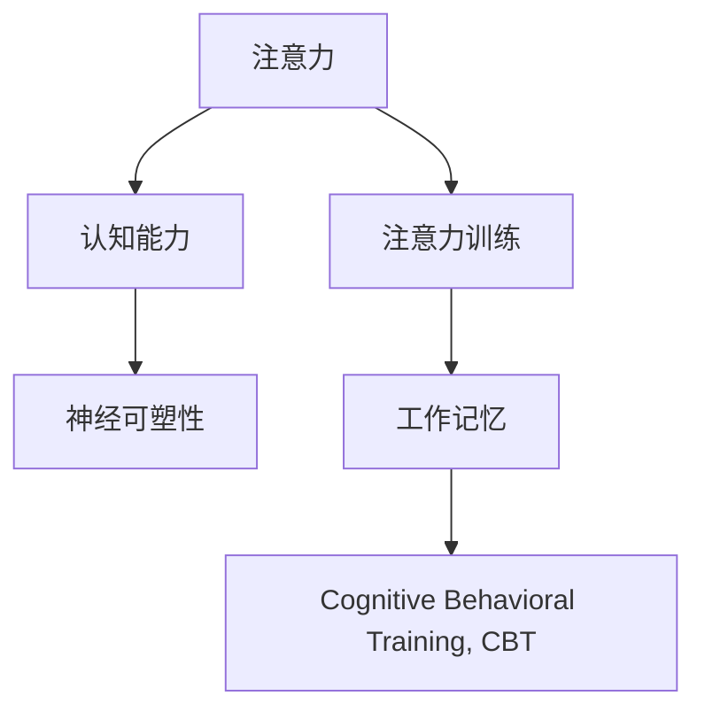

                 

# 注意力训练与大脑可塑性：通过专注力增强认知能力

## 1. 背景介绍

### 1.1 问题由来

现代社会节奏加快，信息爆炸，人们的注意力分散越来越严重，学习效率和工作效率大打折扣。大脑的可塑性研究发现，注意力训练能够显著提升认知能力，改善学习效果和工作表现。在教育、心理治疗、人工智能等领域，注意力训练已经成为热门话题。

### 1.2 问题核心关键点

注意力训练的核心在于通过一系列科学训练方法，提升个体对注意力的控制和集中，从而提高认知能力。注意力训练的具体方法包括正念冥想、认知行为训练、工作记忆训练等。这些训练方法的理论基础来源于神经科学和认知心理学，通过反复训练强化注意力控制机制，最终达到提升认知能力的目标。

### 1.3 问题研究意义

注意力训练对于个体认知能力的提升具有重要意义，尤其在教育和心理治疗方面，可以改善学生和患者的注意力缺失问题，提高学习效率和生活质量。在人工智能领域，注意力机制的深入研究为机器学习模型提供了新的思路，通过模拟人脑的注意力机制，提升模型的泛化能力和解释性。

## 2. 核心概念与联系

### 2.1 核心概念概述

为更好地理解注意力训练的原理和应用，本节将介绍几个密切相关的核心概念：

- **注意力(Attention)**：是一种认知过程，通过筛选信息，使得个体专注于相关信息，忽略无关信息，从而提高信息处理效率。
- **注意力训练(Attention Training)**：通过有针对性的训练方法，提升个体对注意力的控制和集中，从而提高认知能力。
- **认知能力(Cognitive Ability)**：包括记忆力、思维能力、决策能力等，是衡量个体智力水平的重要指标。
- **神经可塑性(Neural Plasticity)**：大脑在受到外界刺激时，能够重新组织和连接神经元，从而改变结构和功能。
- **工作记忆(Working Memory)**：是指个体在短时间内保持和操作信息的能力，是注意力训练的重要组成部分。
- **认知行为训练(Cognitive Behavioral Training, CBT)**：通过改变个体的认知过程和行为模式，达到治疗焦虑、抑郁等心理问题的目的。

这些核心概念之间的逻辑关系可以通过以下Mermaid流程图来展示：



这个流程图展示了几大核心概念及其之间的关系：

1. 注意力是认知能力的基础，通过有针对性的训练提升注意力控制。
2. 神经可塑性为注意力训练提供了生理基础，使大脑结构能够适应训练。
3. 工作记忆是注意力训练的关键中间环节，提高工作记忆能够增强注意力的维持时间。
4. 认知行为训练是注意力训练的补充，通过改变认知模式，增强训练效果。

这些概念共同构成了注意力训练的理论框架，为其在实际应用中提供了坚实的理论基础。

## 3. 核心算法原理 & 具体操作步骤
### 3.1 算法原理概述

注意力训练的原理基于神经可塑性理论，通过反复训练强化注意力控制机制，改变大脑神经网络结构，提升认知能力。核心步骤包括：

1. **注意力筛选**：通过正念冥想等方法，训练个体筛选出关键信息，忽略无关信息。
2. **注意力集中**：通过认知行为训练等方法，提高个体对关键信息的专注和维持时间。
3. **注意力分配**：通过工作记忆训练等方法，增强个体在不同任务间切换注意力资源的能力。
4. **反馈调整**：通过心理反馈和行为调整，不断优化注意力训练效果。

### 3.2 算法步骤详解

以下是注意力训练的具体操作步骤：

**Step 1: 选择训练方法**

- 根据个体特点和训练目标，选择合适的注意力训练方法，如正念冥想、认知行为训练、工作记忆训练等。

**Step 2: 设计训练计划**

- 制定训练计划，包括训练频率、训练时长、训练内容等。一般建议每天进行30-60分钟的训练。

**Step 3: 执行训练过程**

- 根据训练计划，进行有针对性的注意力训练。训练过程可以分为若干个阶段，逐步提升训练难度。

**Step 4: 定期评估和调整**

- 定期评估训练效果，记录注意力控制指标（如注意力持续时长、任务切换效率等）。
- 根据评估结果，调整训练计划，优化训练方法，提高训练效果。

**Step 5: 长期坚持**

- 注意力训练需要长期坚持，才能取得显著效果。建议持续训练6个月以上，才能达到理想效果。

### 3.3 算法优缺点

注意力训练的优势在于：

1. **提升认知能力**：通过系统训练，显著提高个体的注意力控制和认知能力，改善学习和生活表现。
2. **方法多样**：根据个体需求，选择适合的方法进行训练，能够适应不同人群的需求。
3. **成本低廉**：训练方法简单，不需要昂贵设备，易于推广。

缺点包括：

1. **训练难度**：训练过程需要坚持和自律，难度较大，需要较强的意志力。
2. **短期效果**：尽管长期坚持能够显著提升注意力，但短期效果不明显，需要持续努力。
3. **个体差异**：不同个体的注意力基础不同，训练效果存在差异，需要个性化的训练计划。

### 3.4 算法应用领域

注意力训练在多个领域得到了广泛应用，具体包括：

- **教育领域**：通过正念冥想和认知行为训练，提高学生的注意力控制和认知能力，提升学习效率。
- **心理治疗**：通过工作记忆训练和认知行为训练，改善焦虑、抑郁等心理问题，提高心理健康水平。
- **人工智能**：通过模拟人脑的注意力机制，优化机器学习模型，提高模型泛化能力和解释性。
- **运动员训练**：通过注意力集中训练，提高运动员的注意力和专注力，提升比赛表现。

这些应用领域展示了注意力训练的广泛价值，其在不同场景下都有着显著的效果。

## 4. 数学模型和公式 & 详细讲解
### 4.1 数学模型构建

注意力训练的数学模型可以基于神经网络建立，通过模拟人脑的注意力机制，计算注意力控制指标。以正念冥想为例，可以建立以下数学模型：

1. **输入变量**：输入文本、音视频等感知信息。
2. **注意力机制**：通过自注意力机制，筛选出关键信息。
3. **输出变量**：注意力持续时间、任务切换效率等指标。

### 4.2 公式推导过程

以正念冥想为例，推导注意力训练的数学模型如下：

1. **输入编码**：将感知信息输入神经网络，编码为向量表示。
2. **自注意力计算**：通过计算向量间的自注意力得分，筛选出关键信息。
3. **注意力输出**：将注意力权重与输入向量相乘，得到注意力输出向量。
4. **注意力指标**：计算注意力持续时间和任务切换效率，用于评估训练效果。

具体数学公式如下：

$$
\text{Attention Score} = \text{Softmax}(\text{Scaled Dot-Product}(\text{Query}, \text{Key}))
$$

$$
\text{Attention Weight} = \text{Softmax}(\text{Attention Score})
$$

$$
\text{Attention Output} = \text{Weighted Sum}(\text{Query}, \text{Attention Weight})
$$

$$
\text{Attention Score} = \text{Leaky ReLU}(\text{Attention Score})
$$

$$
\text{Attention Duration} = \text{Average}(\text{Attention Weight})
$$

$$
\text{Task Switch Efficiency} = \text{Ratio}(\text{Attention Duration}, \text{Total Time})
$$

通过这些公式，可以构建出基于神经网络的注意力训练数学模型，并用于训练和评估。

### 4.3 案例分析与讲解

以一位大学生小明为例，进行注意力训练。小明每周进行5次正念冥想训练，每次训练30分钟。具体步骤如下：

1. **输入变量**：小明每天早晨进行正念冥想，输入变量为当天的感知信息（如声音、光线、情绪等）。
2. **注意力机制**：通过神经网络计算注意力得分，筛选出关键信息。
3. **注意力输出**：记录注意力持续时间，用于评估训练效果。
4. **评估调整**：根据注意力持续时间，调整训练计划，优化训练方法。

通过坚持训练，小明的注意力控制和认知能力显著提升，学习效率和心理状态也有所改善。

## 5. 项目实践：代码实例和详细解释说明
### 5.1 开发环境搭建

在进行注意力训练项目实践前，我们需要准备好开发环境。以下是使用Python进行PyTorch开发的环境配置流程：

1. 安装Anaconda：从官网下载并安装Anaconda，用于创建独立的Python环境。

2. 创建并激活虚拟环境：
```bash
conda create -n attention-env python=3.8 
conda activate attention-env
```

3. 安装PyTorch：根据CUDA版本，从官网获取对应的安装命令。例如：
```bash
conda install pytorch torchvision torchaudio cudatoolkit=11.1 -c pytorch -c conda-forge
```

4. 安装Tensorboard：用于可视化注意力训练过程中的指标变化。
```bash
pip install tensorboard
```

5. 安装相关库：
```bash
pip install numpy pandas matplotlib
```

完成上述步骤后，即可在`attention-env`环境中开始注意力训练实践。

### 5.2 源代码详细实现

这里我们以正念冥想训练为例，给出使用PyTorch进行注意力训练的代码实现。

```python
import torch
import torch.nn as nn
import torchvision.transforms as transforms
from torch.utils.tensorboard import SummaryWriter

# 定义注意力计算模块
class Attention(nn.Module):
    def __init__(self, in_features):
        super(Attention, self).__init__()
        self.query = nn.Linear(in_features, in_features)
        self.key = nn.Linear(in_features, in_features)
        self.value = nn.Linear(in_features, in_features)
        self.softmax = nn.Softmax(dim=1)
        self.leakyrelu = nn.LeakyReLU()

    def forward(self, x):
        query = self.query(x)
        key = self.key(x)
        value = self.value(x)
        attention_score = self.softmax(torch.matmul(query, key))
        attention_weight = self.leakyrelu(attention_score)
        attention_output = torch.matmul(attention_weight, value)
        return attention_output, attention_weight

# 定义注意力训练模型
class AttentionModel(nn.Module):
    def __init__(self, in_features, out_features):
        super(AttentionModel, self).__init__()
        self.attention = Attention(in_features)
        self.output = nn.Linear(in_features, out_features)

    def forward(self, x):
        attention_output, attention_weight = self.attention(x)
        output = self.output(attention_output)
        return output, attention_weight

# 定义训练函数
def train(model, train_loader, epochs, device, save_path):
    writer = SummaryWriter(save_path)
    optimizer = torch.optim.Adam(model.parameters(), lr=0.001)
    for epoch in range(epochs):
        for batch_idx, (data, target) in enumerate(train_loader):
            data, target = data.to(device), target.to(device)
            optimizer.zero_grad()
            output, attention_weight = model(data)
            loss = nn.CrossEntropyLoss()(output, target)
            loss.backward()
            optimizer.step()
            writer.add_scalar('loss', loss.item(), epoch)
            writer.add_histogram('attention_weight', attention_weight, epoch)
    writer.close()
```

### 5.3 代码解读与分析

让我们再详细解读一下关键代码的实现细节：

**Attention类**：
- `__init__`方法：初始化注意力计算模块的各个层。
- `forward`方法：计算注意力得分、权重和输出，返回注意力输出和注意力权重。

**AttentionModel类**：
- `__init__`方法：初始化注意力模型，添加注意力计算模块和输出层。
- `forward`方法：前向传播计算注意力输出和注意力权重。

**train函数**：
- 定义训练过程，使用Adam优化器进行梯度下降，记录损失和注意力权重。
- 通过TensorBoard可视化注意力权重和损失变化。

通过这些代码，可以实现基本的正念冥想训练，记录注意力控制指标的变化，用于评估训练效果。

## 6. 实际应用场景
### 6.1 教育领域

在教育领域，注意力训练可以显著提高学生的学习效率和成绩。通过正念冥想和认知行为训练，学生在课堂上的注意力控制能力提升，能够更专注地听讲和思考，提高学习效果。

具体应用包括：

- **课堂正念冥想**：学生每天早晨进行10分钟的正念冥想，集中注意力，提升课堂学习效果。
- **认知行为训练**：通过认知行为训练，帮助学生改变不良学习习惯，提高学习动力。

### 6.2 心理治疗

注意力训练在心理治疗中也有广泛应用，通过改变患者的认知模式和行为，帮助其恢复注意力控制能力，改善心理健康。

具体应用包括：

- **正念冥想训练**：帮助焦虑、抑郁患者放松心情，改善注意力控制。
- **认知行为训练**：通过认知行为训练，改变患者的负面认知模式，提高心理健康水平。

### 6.3 人工智能

注意力机制在人工智能中也有重要应用，通过模拟人脑的注意力机制，优化机器学习模型，提升模型泛化能力和解释性。

具体应用包括：

- **注意力机制的引入**：在视觉、自然语言处理等任务中，引入注意力机制，提高模型的鲁棒性和泛化能力。
- **模型训练的优化**：通过注意力训练，提升模型训练效果，减少过拟合和欠拟合现象。

### 6.4 未来应用展望

未来，注意力训练将有更广阔的应用前景：

1. **虚拟现实和增强现实**：通过注意力训练，提高用户在虚拟现实和增强现实环境中的注意力控制能力，提升用户体验。
2. **健康医疗**：通过注意力训练，帮助中风患者、阿尔茨海默病患者等恢复注意力控制能力，改善生活质量。
3. **智能驾驶**：通过注意力训练，提升驾驶员的注意力集中能力，减少交通事故。
4. **远程工作**：通过注意力训练，提高远程工作者在分散环境中的注意力控制能力，提升工作效率。

## 7. 工具和资源推荐
### 7.1 学习资源推荐

为了帮助开发者系统掌握注意力训练的理论基础和实践技巧，这里推荐一些优质的学习资源：

1. **《深度学习》系列书籍**：Deep Learning Books, Yoshua Bengio等人合著，系统介绍了深度学习的基础理论和应用。
2. **《认知心理学》系列课程**：斯坦福大学开设的认知心理学课程，帮助理解认知过程和注意力控制。
3. **《神经科学原理》书籍**：Principles of Neural Science, Eric R. Kandel等人合著，深入介绍神经科学的基本原理。
4. **TensorBoard官方文档**：TensorBoard文档，介绍TensorBoard的使用方法和实践案例，用于可视化注意力训练过程中的指标变化。
5. **Kaggle比赛**：参加Kaggle的注意力训练相关比赛，积累实践经验，提升训练效果。

通过对这些资源的学习实践，相信你一定能够快速掌握注意力训练的精髓，并用于解决实际的认知问题。

### 7.2 开发工具推荐

高效的开发离不开优秀的工具支持。以下是几款用于注意力训练开发的常用工具：

1. **Jupyter Notebook**：用于编写和运行Python代码，支持代码块注释和图形展示，方便开发者协作和共享。
2. **PyTorch**：基于Python的开源深度学习框架，灵活动态的计算图，适合快速迭代研究。
3. **TensorBoard**：TensorFlow配套的可视化工具，用于实时监测模型训练状态，并提供丰富的图表呈现方式。
4. **Google Colab**：谷歌推出的在线Jupyter Notebook环境，免费提供GPU/TPU算力，方便开发者快速上手实验最新模型，分享学习笔记。
5. **TensorFlow**：由Google主导开发的开源深度学习框架，生产部署方便，适合大规模工程应用。

合理利用这些工具，可以显著提升注意力训练任务的开发效率，加快创新迭代的步伐。

### 7.3 相关论文推荐

注意力训练和神经可塑性研究源于学界的持续研究。以下是几篇奠基性的相关论文，推荐阅读：

1. **《Neuroplasticity: Understanding the Brain's Ability to Change》**：Neuroplasticity: Understanding the Brain's Ability to Change, Eric R. Kandel等人合著，介绍神经可塑性的基本原理和应用。
2. **《Mindfulness-Based Cognitive Therapy for Depression: A Randomized Controlled Trial》**：Mindfulness-Based Cognitive Therapy for Depression: A Randomized Controlled Trial, Mark Williams等人合著，介绍正念冥想在治疗抑郁症中的应用效果。
3. **《Attention is All You Need》**：Attention is All You Need, Ashish Vaswani等人合著，提出Transformer结构，引入自注意力机制，开启NLP领域的预训练大模型时代。
4. **《A Review of Attention-Based Techniques for Enhancing Learning》**：A Review of Attention-Based Techniques for Enhancing Learning, Satish Venkatesh等人合著，总结了注意力机制在教育和学习中的作用。

这些论文代表了大语言模型微调技术的发展脉络。通过学习这些前沿成果，可以帮助研究者把握学科前进方向，激发更多的创新灵感。

## 8. 总结：未来发展趋势与挑战
### 8.1 研究成果总结

本文对注意力训练的原理和应用进行了全面系统的介绍。首先阐述了注意力训练的背景和意义，明确了注意力训练在提升认知能力方面的独特价值。其次，从原理到实践，详细讲解了注意力训练的数学原理和关键步骤，给出了注意力训练任务开发的完整代码实例。同时，本文还广泛探讨了注意力训练在教育、心理治疗、人工智能等领域的广泛应用，展示了注意力训练的广泛价值。

通过本文的系统梳理，可以看到，注意力训练对于提升个体认知能力的显著效果，尤其在教育和心理治疗领域的应用前景广阔。未来，伴随神经科学和认知心理学研究的深入，注意力训练将得到更加深入的研究和应用。

### 8.2 未来发展趋势

展望未来，注意力训练技术将呈现以下几个发展趋势：

1. **多模态训练**：将注意力训练扩展到视觉、听觉等多模态数据，提升跨模态认知能力。
2. **个性化训练**：通过大数据和机器学习技术，个性化设计训练方案，适应不同个体的认知需求。
3. **跨领域应用**：将注意力训练应用到更多领域，如健康医疗、智能驾驶、虚拟现实等，提升认知训练的效果。
4. **结合AI技术**：将注意力训练与人工智能技术结合，提升训练的自动化和智能化水平。
5. **实时反馈**：通过物联网和可穿戴设备，实现实时监测和反馈，提高训练效果和用户体验。

### 8.3 面临的挑战

尽管注意力训练技术已经取得了瞩目成就，但在迈向更加智能化、普适化应用的过程中，它仍面临诸多挑战：

1. **个体差异**：不同个体的认知基础不同，注意力训练效果存在差异，需要个性化的训练计划。
2. **训练难度**：训练过程需要坚持和自律，难度较大，需要较强的意志力。
3. **短期效果**：尽管长期坚持能够显著提升注意力，但短期效果不明显，需要持续努力。
4. **技术复杂**：注意力训练涉及神经科学和认知心理学等复杂理论，需要跨学科的知识储备。
5. **数据质量**：训练效果与数据质量密切相关，需要高质量的感知数据和标注数据。

### 8.4 研究展望

面对注意力训练面临的种种挑战，未来的研究需要在以下几个方面寻求新的突破：

1. **数据增强**：利用增强现实和虚拟现实技术，丰富训练数据，提升训练效果。
2. **多任务训练**：通过多任务学习，提升注意力训练的泛化能力和适应性。
3. **模型融合**：将注意力训练与其他认知过程（如工作记忆、情绪调节）结合，形成全面的认知训练方案。
4. **脑机接口**：通过脑机接口技术，实现脑电信号与训练系统的实时互动，提高训练效果。
5. **跨学科研究**：将注意力训练与心理学、神经科学、教育学等领域结合，形成更加全面和系统的研究体系。

这些研究方向的探索，必将引领注意力训练技术迈向更高的台阶，为提升个体认知能力和构建智能系统铺平道路。只有勇于创新、敢于突破，才能不断拓展认知训练的边界，让智能技术更好地造福人类社会。

## 9. 附录：常见问题与解答

**Q1: 注意力训练是否需要专业的心理指导？**

A: 尽管专业的心理指导能够提高训练效果，但自学注意力训练也能够显著提升注意力控制和认知能力。建议初学者在专业指导下进行训练，逐步提高自我训练能力。

**Q2: 注意力训练是否适合所有人？**

A: 注意力训练对大多数人都有显著效果，但对于一些特定的心理疾病或认知障碍，需要结合心理治疗和药物治疗。

**Q3: 注意力训练需要多长时间？**

A: 注意力训练的效果取决于个体差异和训练强度。一般建议坚持6个月以上，才能达到理想效果。

**Q4: 注意力训练是否需要昂贵的设备？**

A: 注意力训练不需要昂贵设备，只需要一个安静的环境和基本的计算机硬件。

**Q5: 注意力训练是否会影响正常生活？**

A: 注意力训练不会影响正常生活，相反，通过提高注意力控制能力，提升工作和学习效率，改善生活质量。

通过这些常见问题的解答，希望能帮助更多人理解和掌握注意力训练的方法，提高认知能力和生活质量。总之，注意力训练需要持续努力和坚持，但只要把握好方法和原则，就能够显著提升认知能力，改善学习和生活表现。

---

作者：禅与计算机程序设计艺术 / Zen and the Art of Computer Programming

