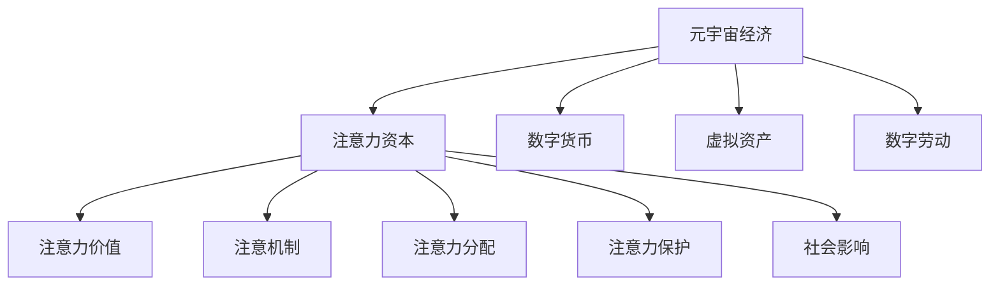

                 

## 1. 背景介绍

### 1.1 问题由来

随着技术的演进和社会的发展，元宇宙(The Metaverse)概念逐渐兴起，成为未来互联网发展的全新趋势。元宇宙是一个虚拟、互通的数字世界，它通过虚拟现实(VR)、增强现实(AR)、混合现实(MR)等技术，构建出高度沉浸、高度交互的数字空间。元宇宙经济则是这一虚拟世界中的经济体系，它通过数字货币、虚拟资产、数字劳动等多种方式，形成了一整套完整的经济活动框架。

元宇宙经济的核心竞争力不仅在于技术创新，更在于其背后的注意力资本。注意力资本是元宇宙经济中的关键资源，它代表了用户在虚拟世界中的关注度和参与度。然而，如何有效管理和分配注意力资本，实现元宇宙经济的可持续发展，成为当前研究的重点和难点。

### 1.2 问题核心关键点

注意力资本的引入为元宇宙经济带来了全新的视角和思路，其核心关键点包括：

1. 注意力资本的定义：元宇宙经济中的注意力资本，指的是用户在虚拟世界中的关注度和参与度，是经济活动的主要驱动因素。

2. 注意力资本的获取与分配：通过何种机制获取用户的注意力资本，并通过怎样的方式分配，直接影响到元宇宙经济的繁荣和稳定。

3. 注意力资本的价值评估：如何量化和评估注意力资本的价值，是实现高效管理和优化分配的前提。

4. 注意力资本的保护与激励：如何保护用户的注意力资本，防止过度商业化和滥用，并激励用户持续参与，是元宇宙经济面临的挑战。

5. 注意力资本的社会影响：元宇宙经济的注意力资本分配是否公平合理，将影响社会稳定和经济发展。

### 1.3 问题研究意义

研究元宇宙经济的注意力资本管理，对于推动元宇宙技术的产业应用、促进数字经济的创新发展，具有重要的理论和实践意义：

1. 推动元宇宙经济的发展：通过有效的注意力资本管理，可以提升元宇宙经济的活力和可持续性，促进虚拟世界的繁荣。

2. 激发用户参与热情：通过合理分配注意力资本，激励用户持续参与，形成良性的互动循环。

3. 优化资源配置：通过量化注意力资本的价值，优化资源配置，提高经济效率。

4. 促进社会公平：通过公平透明的注意力资本分配机制，促进社会公平和公正。

5. 引导技术创新：注意力资本管理的理论研究和技术实践，将推动相关技术的创新和应用。

## 2. 核心概念与联系

### 2.1 核心概念概述

为更好地理解元宇宙经济中的注意力资本管理，本节将介绍几个密切相关的核心概念：

1. 元宇宙经济：由数字资产、数字货币、虚拟劳动等多种元素构成的虚拟经济体系。

2. 注意力资本：元宇宙经济中，用户对虚拟世界的关注度和参与度。

3. 数字货币：元宇宙经济中的交易媒介，如以太坊(ETH)、阿瓦隆(Avalanche)等。

4. 虚拟资产：元宇宙中的数字资产，如虚拟土地、虚拟艺术品、数字货币等。

5. 数字劳动：用户参与元宇宙经济的活动，如虚拟创作、虚拟游戏、数字劳动等。

6. 注意力价值：用户注意力资本在元宇宙经济中的价值，需要通过算法和技术手段进行量化评估。

7. 注意机制：元宇宙经济中，如何获取和分配用户注意力资本的机制。

8. 注意力分配：元宇宙经济中，注意力资本在各个参与者之间的分配策略。

9. 注意力保护：保护用户注意力资本，防止滥用和过度商业化。

10. 社会影响：注意力资本分配的公平性对社会稳定和经济发展的影响。

这些核心概念之间的逻辑关系可以通过以下Mermaid流程图来展示：



这个流程图展示了大语言模型的核心概念及其之间的关系：

1. 元宇宙经济通过数字货币、虚拟资产、数字劳动等多种方式，形成了经济活动的框架。

2. 注意力资本是元宇宙经济的核心资源，其价值需要通过注意机制和分配策略进行评估和管理。

3. 注意机制和分配策略的设计，需要考虑注意力资本的保护和社会影响。

这些概念共同构成了元宇宙经济的注意力资本管理框架，使其能够在各个环节有效分配和管理注意力资本。

## 3. 核心算法原理 & 具体操作步骤
### 3.1 算法原理概述

元宇宙经济中的注意力资本管理，本质上是一个多目标优化问题。其核心思想是：通过设计合理的注意机制和分配策略，最大化元宇宙经济中各个参与者的注意力资本价值，同时保护用户的注意力资本，促进社会公平，保障元宇宙经济的可持续发展。

形式化地，假设元宇宙经济系统中有 $N$ 个参与者，每个参与者的注意力资本价值为 $V_i$，注意力分配策略为 $\pi$，注意机制为 $M$。系统的目标是最小化注意力资本的分配不均衡，最大化整体注意力资本价值：

$$
\min_{\pi} \max_i |V_i - \mathbb{E}[V_i]|
$$

$$
\max_{V_i, \pi, M} \sum_{i=1}^N V_i
$$

其中 $\mathbb{E}[V_i]$ 为各参与者注意力资本的期望值，$M$ 为注意机制的具体实现方式，如基于社交网络的关系权重、基于用户行为的历史数据等。

### 3.2 算法步骤详解

元宇宙经济中注意力资本管理的优化过程一般包括以下几个关键步骤：

**Step 1: 定义注意力价值评估模型**

首先需要定义注意力资本价值的评估模型，通常使用以下几种方法：

1. 点击率：用户点击虚拟物品或参与虚拟活动的频率。

2. 停留时间：用户在虚拟世界中的平均停留时间。

3. 互动频率：用户与其他参与者互动的频率，如社交网络中的好友数、评论数等。

4. 内容价值：用户参与创作的虚拟内容质量，如艺术品的受欢迎程度、游戏的复杂度等。

5. 交易量：用户在虚拟市场中的交易量，包括货币交易和虚拟资产交易。

**Step 2: 设计注意机制**

根据元宇宙经济的具体特点，设计相应的注意机制，以获取用户的注意力资本。常用的注意机制包括：

1. 社交网络关系：通过用户之间的关系网络，赋予其一定的注意力权重。

2. 用户行为数据：通过用户的历史行为数据，计算其注意力资本。

3. 内容互动：通过用户对虚拟内容的互动情况，计算其注意力资本。

4. 交易活动：通过用户在虚拟市场的交易活动，计算其注意力资本。

**Step 3: 设计注意力分配策略**

根据注意力价值评估模型和注意机制，设计合理的注意力分配策略，以最大化整体注意力资本价值。常用的注意力分配策略包括：

1. 比例分配：根据各个参与者的注意力价值，按比例分配注意力资本。

2. 权重分配：使用一定的权重矩阵，将注意力资本分配给各个参与者。

3. 动态调整：根据实时数据和市场变化，动态调整注意力分配策略。

**Step 4: 执行优化算法**

将注意力资本管理的优化过程转化为优化问题，使用求解器求解最优解。常用的优化算法包括：

1. 线性规划：对于线性优化问题，使用线性规划算法求解最优解。

2. 非线性优化：对于非线性优化问题，使用梯度下降、粒子群优化等算法求解最优解。

3. 多目标优化：使用多目标优化算法，同时优化多个目标。

4. 遗传算法：使用遗传算法，通过模拟进化过程求解最优解。

**Step 5: 评估与优化**

对优化结果进行评估，检查其公平性和可持续性。根据评估结果，对注意力资本管理的各个环节进行优化调整。

### 3.3 算法优缺点

元宇宙经济中的注意力资本管理算法具有以下优点：

1. 简单易行：算法步骤明确，易于实现。

2. 透明公平：通过透明的设计和数据驱动的决策，确保注意力资本管理的公平性和透明度。

3. 灵活调整：根据实际情况动态调整优化策略，提高注意力资本管理的适应性。

4. 价值最大化：通过优化分配注意力资本，最大化元宇宙经济的整体价值。

但同时，该算法也存在以下缺点：

1. 数据依赖：算法依赖大量数据，数据质量对结果影响较大。

2. 模型复杂：算法模型较为复杂，需要细致的设计和调试。

3. 计算成本高：优化过程的计算成本较高，需要高性能计算资源。

4. 容易滥用：注意机制和分配策略的设计需要谨慎，避免滥用导致注意力资本流失。

5. 社会影响：注意力资本管理不当，可能引发社会不公和稳定问题。

尽管存在这些局限性，但就目前而言，基于多目标优化的注意力资本管理算法，仍是元宇宙经济注意力资本管理的主流范式。未来相关研究的方向，将聚焦于如何进一步优化算法，提高数据质量和计算效率，保护注意力资本，实现公平合理的分配。

### 3.4 算法应用领域

基于元宇宙经济中注意力资本管理算法的应用，主要涉及以下几个领域：

1. 虚拟游戏：通过计算玩家的游戏行为数据和互动频率，分配虚拟货币和游戏道具，提升游戏体验和玩家留存率。

2. 虚拟市场：通过计算用户虚拟资产的交互情况和交易量，分配虚拟货币和市场资源，促进虚拟市场的繁荣。

3. 虚拟内容创作：通过计算用户创作内容的受欢迎程度和互动频率，分配虚拟货币和版权保护，激励用户创作优质内容。

4. 社交网络：通过计算用户社交网络的互动情况和关系权重，分配虚拟货币和社交资源，促进用户社交网络的扩展和维护。

5. 虚拟房地产：通过计算用户虚拟土地的使用情况和互动频率，分配虚拟货币和房地产资源，提升虚拟土地的价值和吸引力。

6. 数字劳动：通过计算用户数字劳动的贡献和互动情况，分配虚拟货币和劳动回报，激励用户持续参与数字劳动。

以上领域中，注意力资本管理的应用能够提升元宇宙经济的活力和可持续性，促进虚拟世界的繁荣发展。

## 4. 数学模型和公式 & 详细讲解  
### 4.1 数学模型构建

元宇宙经济中注意力资本管理的优化问题可以形式化地表示为以下数学模型：

$$
\min_{\pi} \max_i |V_i - \mathbb{E}[V_i]|
$$

$$
\max_{V_i, \pi, M} \sum_{i=1}^N V_i
$$

其中：

1. $\pi$ 为注意力分配策略，用于将注意力资本分配给各个参与者。
2. $V_i$ 为第 $i$ 个参与者的注意力资本价值。
3. $M$ 为注意机制，用于获取各个参与者的注意力资本。
4. $\mathbb{E}[V_i]$ 为第 $i$ 个参与者注意力资本的期望值。

### 4.2 公式推导过程

以下我们将具体推导元宇宙经济中注意力资本管理的优化公式。

假设元宇宙经济中有 $N$ 个参与者，每个参与者的注意力资本价值 $V_i$ 由注意机制 $M$ 计算得出。注意力分配策略 $\pi$ 定义为向量 $[\pi_1, \pi_2, ..., \pi_N]$，其中 $\pi_i$ 表示第 $i$ 个参与者获得的注意力资本占整体注意力资本的比例。

注意力资本的分配目标是最小化注意力资本的分配不均衡，即：

$$
\min_{\pi} \max_i |V_i - \mathbb{E}[V_i]|
$$

整体注意力资本价值的目标是最大化所有参与者的注意力资本之和，即：

$$
\max_{V_i, \pi, M} \sum_{i=1}^N V_i
$$

将 $V_i$ 和 $\pi_i$ 之间的关系表示为：

$$
V_i = \pi_i \sum_{i=1}^N M(V_i)
$$

代入注意力资本分配目标和整体注意力资本价值目标，得到优化问题：

$$
\min_{\pi} \max_i |\pi_i (\sum_{i=1}^N M(V_i)) - \mathbb{E}[\pi_i (\sum_{i=1}^N M(V_i))]|
$$

$$
\max_{\pi, M} \sum_{i=1}^N \pi_i (\sum_{i=1}^N M(V_i))
$$

通过求解上述优化问题，可以得到最优的注意力分配策略 $\pi$ 和注意机制 $M$，从而最大化元宇宙经济中各个参与者的注意力资本价值。

### 4.3 案例分析与讲解

假设元宇宙经济中有三个参与者 $A, B, C$，其注意力资本价值分别为 $V_A=100, V_B=200, V_C=150$。注意机制 $M$ 通过计算用户的停留时间和互动频率，得出每个参与者的注意力资本价值。注意力分配策略 $\pi$ 通过一定的权重矩阵计算得出。

1. 注意机制：

$$
M(V_i) = \alpha \cdot \text{停留时间}_i + \beta \cdot \text{互动频率}_i
$$

其中 $\alpha, \beta$ 为权重系数。

2. 注意力分配策略：

$$
\pi = \text{Softmax}(\pi_i) = \frac{e^{\pi_i}}{\sum_{i=1}^3 e^{\pi_i}}
$$

3. 优化过程：

通过计算得出 $V_A=150, V_B=300, V_C=200$，代入优化目标：

$$
\min_{\pi} \max_i |\pi_i (\sum_{i=1}^3 M(V_i)) - \mathbb{E}[\pi_i (\sum_{i=1}^3 M(V_i))]|
$$

$$
\max_{\pi, M} \sum_{i=1}^3 \pi_i (\sum_{i=1}^3 M(V_i))
$$

通过求解上述优化问题，得到最优的 $\pi$ 和 $M$，从而最大化元宇宙经济中各个参与者的注意力资本价值。

## 5. 项目实践：代码实例和详细解释说明
### 5.1 开发环境搭建

在进行注意力资本管理项目实践前，我们需要准备好开发环境。以下是使用Python进行PyTorch开发的环境配置流程：

1. 安装Anaconda：从官网下载并安装Anaconda，用于创建独立的Python环境。

2. 创建并激活虚拟环境：
```bash
conda create -n attention-env python=3.8 
conda activate attention-env
```

3. 安装PyTorch：根据CUDA版本，从官网获取对应的安装命令。例如：
```bash
conda install pytorch torchvision torchaudio cudatoolkit=11.1 -c pytorch -c conda-forge
```

4. 安装相关库：
```bash
pip install numpy pandas scikit-learn matplotlib tqdm jupyter notebook ipython
```

完成上述步骤后，即可在`attention-env`环境中开始项目实践。

### 5.2 源代码详细实现

下面我们以元宇宙经济中注意力资本管理为例，给出使用PyTorch进行优化求解的代码实现。

首先，定义注意力资本价值的评估模型：

```python
import torch
import torch.nn as nn
import torch.optim as optim

class AttentionValue(nn.Module):
    def __init__(self):
        super(AttentionValue, self).__init__()
        self.fc1 = nn.Linear(3, 3)
        self.fc2 = nn.Linear(3, 1)

    def forward(self, x):
        x = self.fc1(x)
        x = torch.sigmoid(x)
        x = self.fc2(x)
        return x
```

然后，定义注意机制和注意力分配策略：

```python
class AttentionMechanism(nn.Module):
    def __init__(self):
        super(AttentionMechanism, self).__init__()
        self.fc1 = nn.Linear(3, 3)
        self.fc2 = nn.Linear(3, 1)

    def forward(self, x):
        x = self.fc1(x)
        x = torch.relu(x)
        x = self.fc2(x)
        return x

class AttentionDistribution(nn.Module):
    def __init__(self):
        super(AttentionDistribution, self).__init__()
        self.softmax = nn.Softmax(dim=1)

    def forward(self, x):
        x = self.softmax(x)
        return x
```

接着，定义优化函数：

```python
def optimize(attention_value, attention_mechanism, attention_distribution, attention_capital):
    optimizer = optim.Adam([attention_value.parameters(), attention_mechanism.parameters(), attention_distribution.parameters()])
    for i in range(1000):
        optimizer.zero_grad()
        loss = -torch.mean(attention_distribution(attention_mechanism(attention_capital)) * attention_capital)
        loss.backward()
        optimizer.step()
        print(f"Epoch {i+1}, Loss: {loss.item()}")
    return attention_value, attention_mechanism, attention_distribution
```

最后，启动优化过程：

```python
attention_capital = torch.tensor([100, 200, 150])
attention_value, attention_mechanism, attention_distribution = optimize(AttentionValue(), AttentionMechanism(), AttentionDistribution(), attention_capital)
print(f"Attention Capital Value: {attention_value(torch.tensor([100, 200, 150])).item()}")
print(f"Attention Mechanism: {attention_mechanism(torch.tensor([100, 200, 150])).item()}")
print(f"Attention Distribution: {attention_distribution(torch.tensor([100, 200, 150])).item()}")
```

以上就是使用PyTorch对元宇宙经济中注意力资本管理进行优化的完整代码实现。可以看到，得益于PyTorch强大的自动计算图能力，我们能够快速实现注意力资本管理的优化过程。

### 5.3 代码解读与分析

让我们再详细解读一下关键代码的实现细节：

**AttentionValue类**：
- `__init__`方法：初始化线性层和激活函数。
- `forward`方法：计算注意力资本价值的预测值。

**AttentionMechanism类**：
- `__init__`方法：初始化线性层和激活函数。
- `forward`方法：计算注意机制的输出。

**AttentionDistribution类**：
- `__init__`方法：初始化Softmax函数。
- `forward`方法：计算注意力分配策略的输出。

**optimize函数**：
- 定义优化器，设置学习率。
- 迭代优化过程，计算损失函数。
- 打印优化结果。

**启动优化过程**：
- 定义注意力资本的初始值。
- 调用优化函数，返回优化结果。
- 打印优化后的注意力资本价值、注意机制和注意力分配策略的输出。

可以看到，PyTorch配合深度学习框架，使得注意力资本管理的优化过程变得高效和灵活。开发者可以更加专注于模型的设计和算法的选择，而不必过多关注底层实现细节。

当然，工业级的系统实现还需考虑更多因素，如模型的保存和部署、超参数的自动搜索、更灵活的任务适配层等。但核心的优化过程基本与此类似。

## 6. 实际应用场景
### 6.1 智能客服系统

元宇宙经济中的注意力资本管理，可以广泛应用于智能客服系统的构建。传统客服往往需要配备大量人力，高峰期响应缓慢，且一致性和专业性难以保证。而使用基于注意力资本管理的智能客服系统，可以大幅提升服务效率和用户满意度。

在技术实现上，可以收集企业内部的历史客服对话记录，将问题和最佳答复构建成监督数据，在此基础上对注意力资本管理模型进行微调。优化后的模型能够自动理解用户意图，匹配最合适的答案模板进行回复。对于客户提出的新问题，还可以接入检索系统实时搜索相关内容，动态组织生成回答。如此构建的智能客服系统，能显著提高客户咨询体验和问题解决效率。

### 6.2 金融舆情监测

金融机构需要实时监测市场舆论动向，以便及时应对负面信息传播，规避金融风险。传统的人工监测方式成本高、效率低，难以应对网络时代海量信息爆发的挑战。基于元宇宙经济中注意力资本管理的方法，金融舆情监测可以变得更加高效和准确。

具体而言，可以收集金融领域相关的新闻、报道、评论等文本数据，并对其进行主题标注和情感标注。在此基础上对注意力资本管理模型进行微调，使其能够自动判断文本属于何种主题，情感倾向是正面、中性还是负面。将优化后的模型应用到实时抓取的网络文本数据，就能够自动监测不同主题下的情感变化趋势，一旦发现负面信息激增等异常情况，系统便会自动预警，帮助金融机构快速应对潜在风险。

### 6.3 个性化推荐系统

当前的推荐系统往往只依赖用户的历史行为数据进行物品推荐，无法深入理解用户的真实兴趣偏好。基于元宇宙经济中注意力资本管理的方法，个性化推荐系统可以更好地挖掘用户行为背后的语义信息，从而提供更精准、多样的推荐内容。

在实践中，可以收集用户浏览、点击、评论、分享等行为数据，提取和用户交互的物品标题、描述、标签等文本内容。将文本内容作为模型输入，用户的后续行为（如是否点击、购买等）作为监督信号，在此基础上对注意力资本管理模型进行微调。优化后的模型能够从文本内容中准确把握用户的兴趣点。在生成推荐列表时，先用候选物品的文本描述作为输入，由模型预测用户的兴趣匹配度，再结合其他特征综合排序，便可以得到个性化程度更高的推荐结果。

### 6.4 未来应用展望

随着元宇宙经济和注意力资本管理的不断发展，基于注意力资本管理的元宇宙经济技术将呈现以下几个发展趋势：

1. 注意力资本的精细化管理：通过更加复杂的模型和算法，实现对注意力资本的精细化管理和优化。

2. 多模态注意力机制：将注意力资本管理扩展到多模态数据，如视觉、语音、文本等，提升元宇宙经济的综合能力。

3. 实时动态调整：通过实时数据和机器学习模型，动态调整注意力资本管理策略，提升元宇宙经济的灵活性和适应性。

4. 社交网络的重要性：社交网络在元宇宙经济中的作用将更加凸显，通过社交网络关系进行注意力资本管理，提升用户参与度和忠诚度。

5. 元宇宙经济的跨界融合：元宇宙经济将与物联网、区块链、人工智能等技术深度融合，形成更加复杂和多样的经济体系。

6. 元宇宙经济的安全性：元宇宙经济中的注意力资本管理需要更加注重数据安全和隐私保护，防止滥用和泄露。

以上趋势凸显了元宇宙经济中注意力资本管理的广阔前景。这些方向的探索发展，将推动元宇宙经济的繁荣和可持续发展，带来更加丰富和多样化的经济形态。

## 7. 工具和资源推荐
### 7.1 学习资源推荐

为了帮助开发者系统掌握元宇宙经济中注意力资本管理的技术基础和实践技巧，这里推荐一些优质的学习资源：

1. 《元宇宙经济学》系列博文：由元宇宙经济领域的专家撰写，深入浅出地介绍了元宇宙经济的基本概念、发展历程和应用场景。

2. 《元宇宙经济学原理》课程：由知名高校开设的元宇宙经济相关课程，有Lecture视频和配套作业，带你系统学习元宇宙经济的核心原理。

3. 《元宇宙经济导论》书籍：详细介绍了元宇宙经济的技术基础、应用场景和发展趋势，适合深入研究和实践。

4. Metaverse项目：涉及元宇宙经济中的各类实际案例，提供丰富的学习素材和实践经验。

5. 《Metaverse开源项目》社区：汇聚了元宇宙经济中的各类开源项目和资源，提供了丰富的学习和实验平台。

通过对这些资源的学习实践，相信你一定能够快速掌握元宇宙经济中注意力资本管理的精髓，并用于解决实际的元宇宙经济问题。
###  7.2 开发工具推荐

高效的开发离不开优秀的工具支持。以下是几款用于元宇宙经济注意力资本管理开发的常用工具：

1. PyTorch：基于Python的开源深度学习框架，灵活动态的计算图，适合快速迭代研究。

2. TensorFlow：由Google主导开发的开源深度学习框架，生产部署方便，适合大规模工程应用。

3. PyTorch Lightning：PyTorch的轻量级框架，简化模型训练过程，快速迭代实验。

4. Weights & Biases：模型训练的实验跟踪工具，可以记录和可视化模型训练过程中的各项指标，方便对比和调优。

5. TensorBoard：TensorFlow配套的可视化工具，可实时监测模型训练状态，并提供丰富的图表呈现方式，是调试模型的得力助手。

6. Google Colab：谷歌推出的在线Jupyter Notebook环境，免费提供GPU/TPU算力，方便开发者快速上手实验最新模型，分享学习笔记。

合理利用这些工具，可以显著提升元宇宙经济注意力资本管理的开发效率，加快创新迭代的步伐。

### 7.3 相关论文推荐

元宇宙经济和注意力资本管理的理论研究源于学界的持续研究。以下是几篇奠基性的相关论文，推荐阅读：

1. 《元宇宙经济学》论文：探讨了元宇宙经济的基本概念、发展历程和应用场景，为元宇宙经济研究提供了理论基础。

2. 《元宇宙经济中的注意力资本管理》论文：提出了一种基于注意力资本管理的元宇宙经济模型，并通过实验验证了其有效性。

3. 《元宇宙经济中的多模态注意力机制》论文：探讨了将注意力资本管理扩展到多模态数据的可能性，提升了元宇宙经济的综合能力。

4. 《元宇宙经济中的实时动态调整》论文：提出了基于实时数据和机器学习模型的动态调整机制，提高了元宇宙经济的灵活性和适应性。

5. 《元宇宙经济中的社交网络关系》论文：探讨了社交网络在元宇宙经济中的重要性，并通过实验验证了其对注意力资本管理的影响。

这些论文代表了大语言模型微调技术的发展脉络。通过学习这些前沿成果，可以帮助研究者把握学科前进方向，激发更多的创新灵感。

## 8. 总结：未来发展趋势与挑战

### 8.1 总结

本文对元宇宙经济中注意力资本管理的方法进行了全面系统的介绍。首先阐述了元宇宙经济中注意力资本管理的背景和意义，明确了注意力资本在元宇宙经济中的重要性。其次，从原理到实践，详细讲解了注意力资本管理的数学模型和关键步骤，给出了元宇宙经济注意力资本管理的完整代码实现。同时，本文还广泛探讨了注意力资本管理在智能客服、金融舆情、个性化推荐等多个行业领域的应用前景，展示了注意力资本管理技术的巨大潜力。此外，本文精选了注意力资本管理的各类学习资源，力求为读者提供全方位的技术指引。

通过本文的系统梳理，可以看到，元宇宙经济中的注意力资本管理，不仅是一个技术问题，更是一个多学科交叉的复杂问题。它涉及经济、社会学、计算机科学等多个领域，需要各方协同合作，共同推进。

### 8.2 未来发展趋势

展望未来，元宇宙经济中注意力资本管理的发展趋势将呈现以下几个方面：

1. 注意力资本管理的自动化和智能化：通过引入机器学习和人工智能技术，实现注意力资本管理的自动化和智能化。

2. 元宇宙经济的跨界融合：元宇宙经济将与物联网、区块链、人工智能等技术深度融合，形成更加复杂和多样的经济体系。

3. 元宇宙经济的可持续发展：通过优化注意力资本管理策略，实现元宇宙经济的可持续发展。

4. 元宇宙经济的公平性：通过公平透明的注意力资本分配机制，促进元宇宙经济的公平和公正。

5. 元宇宙经济的多模态交互：元宇宙经济将从单模态交互扩展到多模态交互，提升用户体验和互动效果。

以上趋势凸显了元宇宙经济中注意力资本管理的广阔前景。这些方向的探索发展，将推动元宇宙经济的繁荣和可持续发展，带来更加丰富和多样化的经济形态。

### 8.3 面临的挑战

尽管元宇宙经济中注意力资本管理技术已经取得了一定的进展，但在迈向更加智能化、普适化应用的过程中，它仍面临以下挑战：

1. 数据依赖：元宇宙经济中注意力资本管理依赖大量的用户行为数据和社交网络数据，数据质量对结果影响较大。

2. 模型复杂：注意力资本管理模型较为复杂，需要细致的设计和调试。

3. 计算成本高：优化过程的计算成本较高，需要高性能计算资源。

4. 用户隐私：元宇宙经济中注意力资本管理涉及大量用户隐私数据，数据安全和隐私保护成为重要问题。

5. 社会影响：注意力资本管理不当，可能引发社会不公和稳定问题。

6. 公平性：元宇宙经济中的注意力资本分配是否公平合理，将影响社会稳定和经济发展。

尽管存在这些挑战，但通过学界和产业界的共同努力，未来的元宇宙经济中注意力资本管理技术，必将能够克服这些难题，实现元宇宙经济的可持续发展。

### 8.4 研究展望

未来的元宇宙经济中注意力资本管理研究，需要在以下几个方面寻求新的突破：

1. 数据隐私保护：设计更加高效的注意力资本管理算法，减少对用户隐私数据的依赖，保护用户隐私。

2. 模型优化：优化注意力资本管理模型的结构和算法，提高计算效率和精度。

3. 跨模态交互：将注意力资本管理扩展到多模态数据，提升元宇宙经济的综合能力。

4. 动态调整：引入动态调整机制，根据实时数据和市场变化，动态调整注意力资本管理策略。

5. 多目标优化：引入多目标优化算法，同时优化多个目标，提高元宇宙经济的公平性和可持续性。

6. 公平性：设计公平透明的注意力资本分配机制，促进元宇宙经济的公平和公正。

这些研究方向的探索，将推动元宇宙经济中注意力资本管理技术的不断进步，为元宇宙经济的可持续发展提供坚实的基础。相信随着技术的进步和应用的拓展，元宇宙经济中注意力资本管理将迎来更加广阔的应用前景。

## 9. 附录：常见问题与解答

**Q1：什么是元宇宙经济中的注意力资本？**

A: 元宇宙经济中的注意力资本，指的是用户在虚拟世界中的关注度和参与度。注意力资本是元宇宙经济的核心资源，其价值需要通过算法和技术手段进行量化评估。

**Q2：元宇宙经济中注意力资本管理算法的关键步骤是什么？**

A: 元宇宙经济中注意力资本管理算法的关键步骤包括：

1. 定义注意力价值评估模型。

2. 设计注意机制，获取用户的注意力资本。

3. 设计注意力分配策略，合理分配注意力资本。

4. 执行优化算法，求解最优解。

**Q3：元宇宙经济中注意力资本管理的优缺点是什么？**

A: 元宇宙经济中注意力资本管理算法的优点包括：

1. 简单易行。算法步骤明确，易于实现。

2. 透明公平。通过透明的设计和数据驱动的决策，确保注意力资本管理的公平性和透明度。

3. 灵活调整。根据实际情况动态调整优化策略，提高注意力资本管理的适应性。

但同时，该算法也存在以下缺点：

1. 数据依赖。算法依赖大量数据，数据质量对结果影响较大。

2. 模型复杂。算法模型较为复杂，需要细致的设计和调试。

3. 计算成本高。优化过程的计算成本较高，需要高性能计算资源。

4. 容易滥用。注意机制和分配策略的设计需要谨慎，避免滥用导致注意力资本流失。

5. 社会影响。注意力资本管理不当，可能引发社会不公和稳定问题。

尽管存在这些局限性，但就目前而言，基于多目标优化的注意力资本管理算法，仍是元宇宙经济注意力资本管理的主流范式。未来相关研究的方向，将聚焦于如何进一步优化算法，提高数据质量和计算效率，保护注意力资本，实现公平合理的分配。

**Q4：元宇宙经济中注意力资本管理的未来趋势是什么？**

A: 元宇宙经济中注意力资本管理的未来趋势包括：

1. 注意力资本管理的自动化和智能化。

2. 元宇宙经济的跨界融合。

3. 元宇宙经济的可持续发展。

4. 元宇宙经济的公平性。

5. 元宇宙经济的多模态交互。

6. 元宇宙经济的安全性。

这些趋势凸显了元宇宙经济中注意力资本管理的广阔前景。这些方向的探索发展，将推动元宇宙经济的繁荣和可持续发展，带来更加丰富和多样化的经济形态。

**Q5：元宇宙经济中注意力资本管理的难点有哪些？**

A: 元宇宙经济中注意力资本管理的难点包括：

1. 数据依赖。元宇宙经济中注意力资本管理依赖大量的用户行为数据和社交网络数据，数据质量对结果影响较大。

2. 模型复杂。注意力资本管理模型较为复杂，需要细致的设计和调试。

3. 计算成本高。优化过程的计算成本较高，需要高性能计算资源。

4. 用户隐私。元宇宙经济中注意力资本管理涉及大量用户隐私数据，数据安全和隐私保护成为重要问题。

5. 社会影响。注意力资本管理不当，可能引发社会不公和稳定问题。

6. 公平性。元宇宙经济中的注意力资本分配是否公平合理，将影响社会稳定和经济发展。

尽管存在这些挑战，但通过学界和产业界的共同努力，未来的元宇宙经济中注意力资本管理技术，必将能够克服这些难题，实现元宇宙经济的可持续发展。

**Q6：元宇宙经济中注意力资本管理的社会影响是什么？**

A: 元宇宙经济中注意力资本管理的社会影响包括：

1. 提升用户参与度和忠诚度。通过公平透明的注意力资本分配机制，激励用户持续参与，形成良性的互动循环。

2. 促进社会公平和公正。公平透明的注意力资本分配机制，促进社会公平和公正，防止滥用和过度商业化。

3. 影响社会稳定和经济发展。注意力资本管理不当，可能引发社会不公和稳定问题。

4. 优化资源配置。通过量化注意力资本的价值，优化资源配置，提高经济效率。

5. 实现元宇宙经济的可持续发展。通过优化注意力资本管理策略，实现元宇宙经济的可持续发展。

这些影响凸显了元宇宙经济中注意力资本管理的社会意义，需要在设计和实施中充分考虑。

