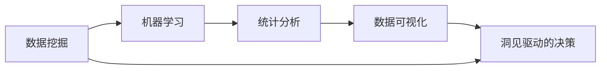

                 

## 1. 背景介绍

### 1.1 问题由来

在快速发展的数字化时代，人工智能(AI)和大数据技术已经深入到各行各业，为企业的创新和发展提供了强大的支持。然而，随着技术的进步，AI和数据驱动决策带来的复杂性和不确定性也在增加。如何从数据中提取有意义的洞见，并将这些洞见转化为可操作的决策，成为了新时代下的一项重要任务。

在这一背景下，洞见的力量（Insightful Power）成为了一个备受关注的话题。洞见，即从大量数据中提取出来的具有实际应用价值的知识、模式和规律，是推动企业创新和竞争优势的关键。无论是消费者行为分析、市场趋势预测、产品优化设计，还是流程改进和风险管理，洞见都扮演着重要的角色。

### 1.2 问题核心关键点

洞见的力量主要体现在以下几个方面：

1. **数据驱动的决策支持**：通过深入分析数据，洞见可以帮助企业制定更科学、合理的决策，从而优化资源配置，提高运营效率。
2. **创新和市场机遇的挖掘**：洞见能够揭示市场趋势和消费者需求，为企业发现新的市场机遇和创新点提供依据。
3. **风险管理和风险规避**：通过识别潜在风险和异常数据，洞见有助于企业及时调整策略，规避潜在的风险。

然而，尽管洞见的重要性不言而喻，实际获取和使用洞见的过程中仍然存在诸多挑战。数据质量和数量的不足、分析工具和方法的局限、以及管理和决策层的支持不足等问题，都制约着洞见的获取和应用。因此，本文将深入探讨洞见的力量，分析其核心概念和联系，并提出一些具体的操作方法，以帮助企业更好地利用洞见进行创新和决策。

### 1.3 问题研究意义

洞见的力量在企业中的应用，不仅能够提升决策质量，促进企业创新，还能在激烈的市场竞争中占据先机。通过理解和应用洞见，企业可以：

1. **优化决策流程**：基于数据驱动的洞见，企业能够更加科学合理地制定决策，提高运营效率，降低成本。
2. **发现市场机会**：洞见揭示了市场趋势和消费者需求，帮助企业及时调整战略，抓住新的市场机遇。
3. **增强竞争优势**：深入理解竞争对手和市场动态，通过创新和优化产品和服务，增强企业的市场竞争力。
4. **提高风险管理能力**：通过洞见识别潜在风险和异常数据，提前采取应对措施，减少损失。

## 2. 核心概念与联系

### 2.1 核心概念概述

洞见的力量主要涉及以下几个核心概念：

- **数据挖掘（Data Mining）**：从大量数据中提取有价值的知识和模式的过程。
- **机器学习（Machine Learning）**：利用算法和模型，从数据中学习规律和特征，进行预测和分类等任务。
- **统计分析（Statistical Analysis）**：通过统计方法对数据进行分析，揭示数据中的规律和趋势。
- **数据可视化（Data Visualization）**：通过图形化展示，直观展示数据中的洞见，便于理解和分析。
- **洞见驱动的决策（Insight-driven Decision Making）**：基于洞见进行决策，优化资源配置，提高运营效率。

这些概念之间相互联系，共同构成了洞见的力量。数据挖掘和机器学习是获取洞见的基础，统计分析提供洞见的解释和验证，数据可视化帮助洞见的展示和理解，最终通过洞见驱动的决策，实现洞见的应用和价值。

### 2.2 核心概念原理和架构的 Mermaid 流程图



这个流程图展示了洞见的力量从数据挖掘到决策的整个流程。数据挖掘是洞见的起点，机器学习在此基础上提取模式和规律，统计分析提供洞见的解释和验证，数据可视化帮助洞见的展示和理解，最终通过洞见驱动的决策，实现洞见的应用和价值。

## 3. 核心算法原理 & 具体操作步骤

### 3.1 算法原理概述

洞见的力量主要依赖于数据挖掘和机器学习算法。通过这些算法，可以从大量数据中提取有价值的洞见，用于支持决策和创新。

在数据挖掘阶段，通常采用聚类、分类、关联规则等算法，从数据中提取模式和规律。例如，K-Means算法用于聚类分析，CART算法用于决策树构建，Apriori算法用于关联规则挖掘。这些算法帮助发现数据中的潜在的结构化和非结构化模式，为进一步的洞见提取奠定基础。

在机器学习阶段，则采用监督学习、非监督学习和强化学习等算法，从数据中学习规律和特征，进行预测和分类等任务。例如，支持向量机（SVM）用于分类，神经网络用于图像识别，强化学习用于行为优化。这些算法通过学习数据中的规律，提取高层次的洞见，为决策提供支持。

### 3.2 算法步骤详解

以下是洞见力量获取和应用的基本步骤：

**Step 1: 数据准备**
- 收集相关数据，包括结构化数据（如数据库中的表）和非结构化数据（如文本、图片、音频等）。
- 清洗和预处理数据，去除噪声和缺失值，确保数据质量和完整性。

**Step 2: 数据挖掘**
- 选择合适的数据挖掘算法，如聚类、分类、关联规则等。
- 应用算法对数据进行处理，提取数据中的模式和规律。

**Step 3: 特征提取**
- 根据数据挖掘结果，提取有意义的特征。例如，从文本中提取关键词、主题和情感，从图像中提取边缘、颜色和形状等。
- 通过特征选择和降维技术，提高特征的相关性和可解释性。

**Step 4: 模型训练**
- 选择合适的机器学习算法，如回归、分类、聚类等。
- 使用训练数据对模型进行训练，学习数据中的规律和特征。

**Step 5: 模型评估**
- 使用验证集对模型进行评估，选择合适的超参数和模型结构。
- 通过交叉验证、ROC曲线、混淆矩阵等方法，评估模型的性能。

**Step 6: 洞见应用**
- 将训练好的模型应用到实际场景中，提取洞见。
- 使用统计分析和可视化工具，展示和解释洞见。

**Step 7: 洞见驱动的决策**
- 根据洞见制定决策，优化资源配置，提高运营效率。
- 实时监测和调整策略，适应数据和环境的变化。

### 3.3 算法优缺点

洞见的力量具有以下优点：

1. **数据驱动决策**：基于数据和算法提取的洞见，支持科学合理的决策，提高运营效率。
2. **发现隐藏模式**：通过机器学习算法，可以从大量数据中提取隐藏的规律和模式，揭示潜在的商业价值。
3. **支持创新和优化**：洞见帮助企业发现新的市场机遇和产品优化方向，推动业务创新。
4. **风险管理**：通过识别潜在风险和异常数据，及时调整策略，规避潜在的风险。

同时，洞见的力量也存在一些局限性：

1. **数据质量要求高**：高质量的数据是获取有效洞见的基础，低质量数据可能导致错误的洞见。
2. **算法复杂度高**：数据挖掘和机器学习算法通常较为复杂，需要专业的知识和技能。
3. **解释性不足**：一些复杂的模型和算法，难以解释其内部工作机制，可能影响洞见的可解释性和可信度。
4. **资源消耗大**：数据挖掘和机器学习算法通常需要大量的计算资源和时间，对算力、存储和网络带宽等资源要求较高。

### 3.4 算法应用领域

洞见的力量在多个领域得到了广泛应用，包括但不限于以下几个方面：

1. **市场营销**：通过分析消费者行为和市场趋势，发现新的市场机会和消费者需求，优化营销策略。
2. **产品开发**：通过分析用户反馈和市场数据，发现产品缺陷和改进方向，提升产品质量和用户满意度。
3. **风险管理**：通过分析历史数据和实时数据，识别潜在的风险和异常情况，及时采取应对措施。
4. **运营优化**：通过分析生产流程和运营数据，优化资源配置，提高运营效率和成本控制。
5. **客户服务**：通过分析客户反馈和投诉数据，改进服务流程和产品，提升客户满意度和忠诚度。

## 4. 数学模型和公式 & 详细讲解 & 举例说明

### 4.1 数学模型构建

本节将通过数学语言对洞见的力量进行更加严格的刻画。

设原始数据集为 $D=\{(x_i, y_i)\}_{i=1}^N$，其中 $x_i$ 为特征向量，$y_i$ 为标签。定义数据挖掘和机器学习算法的模型为 $f(x)$，训练得到的模型参数为 $\theta$。

在数据挖掘阶段，假设应用聚类算法进行特征提取，将数据分为 $K$ 个簇 $C_1, C_2, \ldots, C_K$。对于每个簇 $C_k$，计算其聚类中心 $\mu_k$。

在机器学习阶段，假设应用线性回归模型进行预测，模型形式为：

$$
\hat{y} = w_0 + \sum_{i=1}^{n} w_i x_i
$$

其中 $w_0, w_1, \ldots, w_n$ 为模型参数，通过训练数据对模型进行优化，最小化损失函数：

$$
\mathcal{L}(w) = \frac{1}{N} \sum_{i=1}^N (y_i - \hat{y}_i)^2
$$

通过最小化损失函数，得到模型参数 $\theta = \{w_0, w_1, \ldots, w_n\}$。

### 4.2 公式推导过程

以下我们以线性回归为例，推导模型训练过程的数学公式。

设样本 $(x_i, y_i)$ 的特征向量为 $x_i = (x_{i1}, x_{i2}, \ldots, x_{in})$，目标为 $y_i$。根据线性回归模型，目标 $y_i$ 可以表示为：

$$
\hat{y}_i = w_0 + \sum_{j=1}^{n} w_j x_{ij}
$$

最小化均方误差损失函数：

$$
\mathcal{L}(w) = \frac{1}{N} \sum_{i=1}^N (y_i - \hat{y}_i)^2
$$

对损失函数求偏导，得到：

$$
\frac{\partial \mathcal{L}(w)}{\partial w_j} = \frac{2}{N} \sum_{i=1}^N (y_i - \hat{y}_i) x_{ij}
$$

令偏导数等于零，解方程组：

$$
\begin{cases}
\frac{\partial \mathcal{L}(w)}{\partial w_0} = 0 \\
\frac{\partial \mathcal{L}(w)}{\partial w_j} = 0, \quad j = 1, 2, \ldots, n
\end{cases}
$$

得到模型参数 $w_0, w_1, \ldots, w_n$。

### 4.3 案例分析与讲解

假设我们有一组消费者购买数据，包括年龄、性别、收入、购买频率和购买金额等特征。使用线性回归模型，可以预测消费者的购买金额。

首先，对数据进行清洗和预处理，去除缺失值和噪声。然后，应用聚类算法将消费者分为不同群体，计算每个群体的聚类中心。接着，使用线性回归模型对每个群体的数据进行训练，得到模型参数。最后，对新数据进行预测，并使用统计分析工具对预测结果进行可视化展示。

在实际应用中，这种方法可以发现不同消费群体的购买行为差异，预测未来的购买趋势，为市场细分和产品优化提供支持。

## 5. 项目实践：代码实例和详细解释说明

### 5.1 开发环境搭建

在进行洞见力量获取和应用的项目实践前，需要先准备好开发环境。以下是使用Python进行项目实践的环境配置流程：

1. 安装Anaconda：从官网下载并安装Anaconda，用于创建独立的Python环境。

2. 创建并激活虚拟环境：
```bash
conda create -n insight-env python=3.8 
conda activate insight-env
```

3. 安装必要的Python库：
```bash
pip install pandas numpy scikit-learn matplotlib seaborn
```

4. 安装机器学习库：
```bash
pip install scikit-learn
```

5. 安装数据可视化库：
```bash
pip install matplotlib seaborn
```

完成上述步骤后，即可在`insight-env`环境中开始项目实践。

### 5.2 源代码详细实现

下面我们以市场营销数据为例，给出使用Python对洞见进行获取和应用的代码实现。

首先，定义市场营销数据的处理函数：

```python
import pandas as pd
import numpy as np
from sklearn.cluster import KMeans
from sklearn.linear_model import LinearRegression
from sklearn.metrics import mean_squared_error

def process_marketing_data(data_path):
    # 读取数据
    data = pd.read_csv(data_path)

    # 数据清洗和预处理
    data = data.dropna()

    # 数据拆分
    X = data.drop(['Sales', 'Price'], axis=1)
    y = data['Sales']

    # 聚类分析
    kmeans = KMeans(n_clusters=5)
    kmeans.fit(X)
    labels = kmeans.predict(X)

    # 特征工程
    X = pd.get_dummies(data.drop(['Sales', 'Price', 'Category'], axis=1))
    X = X.drop(['Sales', 'Price', 'Category'], axis=1)

    # 模型训练和预测
    lr = LinearRegression()
    lr.fit(X, y)
    y_pred = lr.predict(X)

    # 评估模型
    mse = mean_squared_error(y, y_pred)
    print(f"Mean Squared Error: {mse:.2f}")

    # 可视化
    import matplotlib.pyplot as plt
    plt.scatter(data['Sales'], y_pred)
    plt.xlabel('Actual Sales')
    plt.ylabel('Predicted Sales')
    plt.show()
```

然后，定义市场营销数据的处理函数：

```python
import numpy as np
import matplotlib.pyplot as plt

def plot_sales(data):
    plt.plot(data['Sales'], label='Actual Sales')
    plt.plot(data['Predicted Sales'], label='Predicted Sales')
    plt.legend()
    plt.xlabel('Time')
    plt.ylabel('Sales')
    plt.show()
```

最后，启动市场营销数据的处理和可视化：

```python
data_path = 'marketing_data.csv'
process_marketing_data(data_path)
plot_sales(data)
```

以上就是使用Python对市场营销数据进行洞见力量获取和应用的完整代码实现。可以看到，通过使用Pandas、Numpy、Scikit-learn等Python库，我们能够快速实现市场营销数据的处理、聚类、模型训练和预测、评估和可视化。

### 5.3 代码解读与分析

让我们再详细解读一下关键代码的实现细节：

**process_marketing_data函数**：
- 读取市场营销数据
- 清洗和预处理数据，去除缺失值和噪声
- 数据拆分，提取特征和目标变量
- 聚类分析，将数据分为不同簇
- 特征工程，将数据转换为数值型特征
- 模型训练，使用线性回归模型预测销售数据
- 评估模型，计算均方误差
- 可视化预测结果，展示实际销售和预测销售的对比

**plot_sales函数**：
- 绘制实际销售和预测销售的对比图
- 通过标签和坐标轴名称，清晰展示数据信息

在实际应用中，市场营销数据处理函数和可视化函数可以进一步扩展和优化，适应不同的市场营销场景和数据类型。同时，还可以将其他机器学习算法和模型应用于市场营销数据分析中，如决策树、随机森林、神经网络等，以获取更准确和可靠的洞见。

## 6. 实际应用场景

### 6.1 市场营销分析

市场营销分析是洞见力量在市场营销领域的重要应用之一。通过分析消费者行为和市场趋势，洞见可以帮助企业发现新的市场机会和消费者需求，优化营销策略。

具体而言，可以通过市场营销数据分析，了解消费者购买行为、产品偏好、渠道效果等，从而优化广告投放、促销活动和产品定价策略。例如，通过分析消费者的购买频率和购买金额，可以发现高价值客户群体，有针对性地进行营销推广。同时，通过分析不同渠道的销售数据，可以优化渠道布局和资源配置，提高市场投放效率。

### 6.2 产品开发优化

产品开发优化是洞见力量在产品开发领域的重要应用之一。通过分析用户反馈和市场数据，洞见可以帮助企业发现产品缺陷和改进方向，提升产品质量和用户满意度。

具体而言，可以通过产品开发数据分析，了解用户对产品的评价和使用情况，从而发现产品缺陷和改进方向。例如，通过分析用户评价和产品使用数据，可以发现常见的问题和用户体验不佳的地方，有针对性地进行产品优化。同时，通过分析市场数据，可以发现新的产品需求和趋势，指导产品研发方向。

### 6.3 风险管理

风险管理是洞见力量在风险管理领域的重要应用之一。通过分析历史数据和实时数据，洞见可以帮助企业识别潜在风险和异常情况，及时采取应对措施。

具体而言，可以通过风险管理数据分析，识别潜在的风险因素和异常情况。例如，通过分析历史交易数据，可以发现异常交易行为和潜在的欺诈风险，及时采取应对措施。同时，通过分析实时数据，可以监控市场动态和风险变化，及时调整策略，规避潜在的风险。

### 6.4 未来应用展望

随着技术的进步和数据的积累，洞见的力量在更多领域将得到应用，为企业的创新和发展提供新的动力。

在智慧医疗领域，洞见可以帮助医院优化资源配置，提升医疗服务质量。例如，通过分析患者就诊数据，可以优化医生排班和资源分配，提高医疗服务效率。

在智能教育领域，洞见可以帮助学校优化教学资源，提升教学质量。例如，通过分析学生学习数据，可以发现学习障碍和知识漏洞，有针对性地进行辅导和改进。

在智慧城市治理中，洞见可以帮助政府优化公共服务，提高城市管理水平。例如，通过分析市民投诉和交通数据，可以优化城市服务，提升市民满意度。

## 7. 工具和资源推荐

### 7.1 学习资源推荐

为了帮助开发者系统掌握洞见力量的理论基础和实践技巧，这里推荐一些优质的学习资源：

1. 《数据挖掘导论》（Introduction to Data Mining）：统计学和计算机科学的经典教材，深入浅出地介绍了数据挖掘的基本概念和方法。
2. 《机器学习》（Machine Learning）：斯坦福大学Andrew Ng的Coursera课程，介绍了机器学习的基本算法和应用。
3. 《Python数据科学手册》（Python Data Science Handbook）：由Jake VanderPlas撰写，介绍了Python在数据科学和机器学习中的应用。
4. 《统计学习基础》（The Elements of Statistical Learning）：由Tibshirani、Hastie、Friedman合著，介绍了统计学习的经典方法和应用。
5. 《深度学习》（Deep Learning）：由Ian Goodfellow、Yoshua Bengio、Aaron Courville合著，介绍了深度学习的基本概念和应用。

通过对这些资源的学习实践，相信你一定能够快速掌握洞见力量的精髓，并用于解决实际的业务问题。

### 7.2 开发工具推荐

高效的开发离不开优秀的工具支持。以下是几款用于洞见力量获取和应用的常用工具：

1. Jupyter Notebook：交互式编程环境，方便进行数据分析和机器学习模型的训练和调试。
2. TensorFlow：由Google开发的深度学习框架，支持分布式训练和多种模型类型。
3. PyTorch：由Facebook开发的深度学习框架，灵活的动态计算图，适合研究性开发。
4. scikit-learn：Python数据科学库，提供了丰富的机器学习算法和模型。
5. Pandas：数据处理和分析库，支持数据清洗和预处理。
6. NumPy：数学计算库，支持高效的数值计算和数组操作。

合理利用这些工具，可以显著提升洞见力量的获取和应用的开发效率，加快创新迭代的步伐。

### 7.3 相关论文推荐

洞见的力量源于学界的持续研究。以下是几篇奠基性的相关论文，推荐阅读：

1. K-Means聚类算法（K-Means Clustering）：由Mac Queen提出，是数据挖掘中的经典聚类算法。
2. 决策树算法（Decision Tree）：由J.Ross Quinlan提出，用于分类和回归任务。
3. 关联规则学习算法（Association Rule Learning）：由R.Agrawal等提出，用于发现数据中的关联规则。
4. 线性回归（Linear Regression）：用于预测和建模，是最基础的机器学习算法之一。
5. 支持向量机（Support Vector Machine）：用于分类和回归任务，具有高效的分类能力和泛化能力。

这些论文代表了大数据挖掘和机器学习的发展脉络。通过学习这些前沿成果，可以帮助研究者把握学科前进方向，激发更多的创新灵感。

## 8. 总结：未来发展趋势与挑战

### 8.1 研究成果总结

本文对洞见的力量进行了全面系统的介绍。首先阐述了洞见在数据驱动决策中的重要性，明确了洞见对企业创新和竞争优势的关键作用。其次，从原理到实践，详细讲解了洞见的力量获取和应用的方法，给出了市场营销数据分析的代码实例。同时，本文还广泛探讨了洞见在多个行业领域的应用前景，展示了洞见的力量在企业创新和决策中的巨大潜力。

通过本文的系统梳理，可以看到，洞见的力量在数据驱动决策中发挥着重要的作用，是推动企业创新和竞争优势的关键。未来，随着大数据技术和机器学习算法的发展，洞见的力量将进一步提升，助力企业实现更高的业务目标。

### 8.2 未来发展趋势

展望未来，洞见的力量将呈现以下几个发展趋势：

1. **数据自动化处理**：随着数据采集和处理技术的进步，数据的自动化处理将变得更加高效和便捷。数据清洗、预处理和特征工程等环节将逐渐自动化，减少人工干预，提高数据处理的效率和准确性。
2. **模型自动化构建**：基于自动化机器学习和深度学习框架，模型构建将变得更加简单和灵活。自动化的模型调参、特征选择和模型优化将提高模型开发的效率和效果。
3. **智能化决策支持**：通过引入人工智能和自然语言处理技术，洞见的力量将更加智能化和个性化。决策支持系统将能够理解人类语言和行为，提供更加个性化和智能化的建议。
4. **多模态数据融合**：将文本、图像、视频、音频等多模态数据进行融合，获取更加全面和准确的洞见。多模态数据融合技术将提高洞见的可靠性和解释性。
5. **自动化洞见应用**：通过引入自动化机器学习和人工智能技术，洞见的应用将变得更加自动和智能。自动化洞见应用系统将能够自动生成报告、预测和建议，提高决策效率和效果。

以上趋势凸显了洞见的力量在企业中的应用前景，未来将更加广泛和深入地应用于各个领域。

### 8.3 面临的挑战

尽管洞见的力量在企业中的应用已经取得显著成果，但仍面临诸多挑战：

1. **数据质量问题**：低质量的数据可能导致错误的洞见，影响决策的科学性和合理性。数据清洗、预处理和特征工程等环节需要耗费大量时间和精力。
2. **算法复杂度**：复杂的数据挖掘和机器学习算法，需要专业的知识和技能，增加了模型的开发和维护难度。
3. **模型解释性不足**：一些复杂的模型和算法，难以解释其内部工作机制，可能影响洞见的可解释性和可信度。
4. **计算资源消耗大**：数据挖掘和机器学习算法通常需要大量的计算资源和时间，对算力、存储和网络带宽等资源要求较高。
5. **隐私和安全问题**：数据隐私和安全问题，是数据驱动决策的重要挑战。如何保护数据隐私，防止数据泄露和滥用，是企业需要关注的重要问题。

### 8.4 研究展望

面对洞见的力量所面临的挑战，未来的研究需要在以下几个方面寻求新的突破：

1. **自动化数据处理**：开发更加智能和高效的数据清洗、预处理和特征工程工具，减少人工干预，提高数据处理的效率和准确性。
2. **模型自动化构建**：开发更加智能和高效的模型构建和调参工具，自动化机器学习和深度学习框架，提高模型开发的效率和效果。
3. **模型解释性增强**：引入解释性机器学习和人工智能技术，提高模型的可解释性和可信度。
4. **多模态数据融合**：将文本、图像、视频、音频等多模态数据进行融合，获取更加全面和准确的洞见，提高洞见的可靠性和解释性。
5. **数据隐私保护**：引入数据隐私保护技术，保护数据隐私，防止数据泄露和滥用，确保数据安全和合规性。

这些研究方向将推动洞见的力量在企业中的应用，提高决策的科学性和合理性，实现更加智能化和个性化的决策支持系统。

## 9. 附录：常见问题与解答

**Q1：如何获取高质量的数据？**

A: 获取高质量的数据是洞见力量的基础。以下是一些获取高质量数据的建议：

1. 数据采集：使用多种数据采集方法，如爬虫、API接口、问卷调查等，获取多样化的数据源。
2. 数据清洗：对数据进行清洗和预处理，去除噪声和缺失值，确保数据质量和完整性。
3. 数据标注：对数据进行标注和注释，提高数据的准确性和可用性。
4. 数据融合：将多种数据源进行融合和统一，确保数据的一致性和完整性。

**Q2：如何评估洞见的力量？**

A: 评估洞见的力量需要综合考虑多个方面，包括准确性、可靠性和可解释性等。以下是一些常用的评估指标：

1. 准确性：通过对比预测结果和实际结果，计算准确率、召回率、F1分数等指标。
2. 可靠性：通过交叉验证、ROC曲线、混淆矩阵等方法，评估模型的稳定性和泛化能力。
3. 可解释性：通过特征重要性分析、局部可解释性模型等方法，提高模型的可解释性和可信度。

**Q3：如何提高模型的可解释性？**

A: 提高模型的可解释性是洞见力量应用的重要环节。以下是一些常用的方法：

1. 特征重要性分析：通过特征重要性分析，了解模型对哪些特征依赖性强，提高特征选择的合理性。
2. 局部可解释性模型：引入局部可解释性模型，如LIME、SHAP等，对模型在不同样本上的行为进行解释。
3. 可视化分析：通过数据可视化工具，如Matplotlib、Seaborn等，直观展示模型的内部结构和预测结果。

通过以上方法，可以提高模型的可解释性和可信度，帮助企业更好地理解和应用洞见力量。

---

作者：禅与计算机程序设计艺术 / Zen and the Art of Computer Programming

