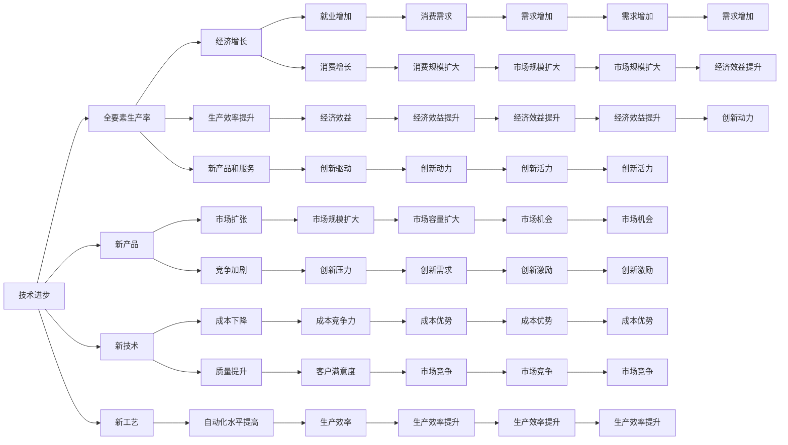

                 

# 深层次问题与经济增长的关系

> 关键词：
1. **经济学**：
2. **增长理论**：
3. **模型构建**：
4. **应用分析**：
5. **案例研究**：
6. **数据驱动**：
7. **挑战与对策**：

## 1. 背景介绍

在现代经济体系中，经济增长是一个持续且复杂的主题。它不仅关系到国家实力的提升，也影响到全球经济格局的演变。深层次问题，如技术进步、制度创新、人口结构、教育水平、政策导向等，对经济增长有着深刻的影响。本文将深入探讨这些深层次问题与经济增长之间的关系，从理论和实践两个维度进行分析。

### 1.1 问题由来
经济增长一直是经济学研究的核心问题。经济增长不仅仅是一个经济指标的提升，更是一个国家或地区综合国力的体现。随着全球化进程的加速，各国之间的竞争也日益激烈。在这样的背景下，理解深层次问题如何影响经济增长，成为政策制定者、企业管理者和研究者关注的重要议题。

### 1.2 问题核心关键点
- **技术进步**：技术创新是推动经济增长的关键力量，它通过提高生产效率、创新产品和服务等方式促进经济增长。
- **制度创新**：有效的制度能够降低交易成本、保护产权，从而促进资源更有效的配置，推动经济增长。
- **人口结构**：人口的年龄结构、教育水平等对劳动力的质量与数量有直接影响，进而影响经济增长。
- **教育水平**：教育能够提高劳动力的技能水平，提高全要素生产率，从而推动经济增长。
- **政策导向**：政府的宏观调控和微观管理政策，对经济的稳定增长至关重要。

这些关键点构成了我们分析经济增长的基础，理解它们如何相互作用，对实现持续稳定增长具有重要意义。

## 2. 核心概念与联系

### 2.1 核心概念概述

在探讨深层次问题与经济增长关系之前，首先需要理解几个核心概念：

- **经济增长**：指一个国家或地区在一定时期内生产总值的增长率。
- **全要素生产率**：衡量生产要素（如劳动、资本、土地等）以外其他因素对生产率提升的贡献。
- **技术进步**：包括新产品、新技术、新工艺的开发和应用。
- **制度创新**：指制度环境的创新，如法律、政策、组织结构等。
- **人口结构**：人口的年龄、性别、教育水平等的分布和变化。
- **教育水平**：指个人或群体接受教育的程度。

这些概念在经济增长过程中相互作用，共同推动着经济的持续发展。

### 2.2 核心概念原理和架构的 Mermaid 流程图



### 2.3 核心概念联系

技术进步、制度创新、人口结构、教育水平、政策导向等深层次问题，通过以下路径共同推动经济增长：

- **技术进步**直接提高**全要素生产率**，从而促进**经济增长**。
- **制度创新**降低交易成本，保护产权，间接提高**全要素生产率**，推动**经济增长**。
- **人口结构**通过影响**劳动力质量与数量**，对**全要素生产率**和**经济增长**有重要影响。
- **教育水平**提高劳动力技能，提升**全要素生产率**，驱动**经济增长**。
- **政策导向**通过宏观调控和微观管理，优化资源配置，促进**全要素生产率**和**经济增长**。

这些概念之间相互关联，形成一个复杂的系统，共同影响经济增长。

## 3. 核心算法原理 & 具体操作步骤

### 3.1 算法原理概述

经济增长的模型构建主要基于经济增长理论，其中包括新古典增长理论、内生增长理论、新凯恩斯主义等。这里以索洛模型(Solow Model)为例，简要介绍核心原理：

索洛模型假设经济由资本、劳动力和全要素生产率决定，且生产函数为：

$$Y = F(K, L, A)$$

其中 $Y$ 为总产出，$K$ 为资本存量，$L$ 为劳动力数量，$A$ 为全要素生产率。

根据该模型，经济增长的来源可以分解为资本积累、劳动力增长和技术进步三个方面。技术进步是长期经济增长的主要驱动力。

### 3.2 算法步骤详解

基于索洛模型，我们可以进行以下步骤：

1. **数据收集**：收集经济增长数据（GDP、资本存量、劳动力数量等）、技术进步数据（专利数量、研发投入等）、人口结构数据（年龄结构、教育水平等）。
2. **模型构建**：基于上述数据，构建经济增长模型。
3. **参数估计**：利用最小二乘法、最大似然估计等方法，估计模型参数。
4. **预测分析**：使用模型进行经济增长预测，分析技术进步、制度创新等因素的影响。

### 3.3 算法优缺点

**优点**：
- **模型简洁**：索洛模型结构简单，易于理解和应用。
- **适用广泛**：适用于各种经济体，能够解释长期经济增长趋势。

**缺点**：
- **假设过多**：索洛模型假设完美市场、技术进步外生等，现实情况往往不符。
- **缺乏微观基础**：模型缺乏对企业和家庭决策的详细描述。

### 3.4 算法应用领域

经济增长模型在政策制定、企业决策、学术研究等多个领域有广泛应用：

- **政策制定**：通过模型分析，确定最优的宏观调控政策，如财政政策、货币政策。
- **企业决策**：指导企业进行投资决策，优化资本和劳动力的配置。
- **学术研究**：为宏观经济学、发展经济学等领域提供理论基础和实证支持。

## 4. 数学模型和公式 & 详细讲解 & 举例说明

### 4.1 数学模型构建

经济增长模型中，生产函数是最核心的部分。以柯布-道格拉斯生产函数为例：

$$Y = A K^{\alpha} L^{1-\alpha}$$

其中 $Y$ 为总产出，$A$ 为全要素生产率，$K$ 为资本存量，$L$ 为劳动力数量，$\alpha$ 为资本产出弹性。

### 4.2 公式推导过程

根据柯布-道格拉斯生产函数，我们可以推导出经济增长的稳态条件：

$$g = \frac{n + \delta + \alpha g_k}{1 + \alpha}$$

其中 $g$ 为经济增长率，$n$ 为劳动力增长率，$\delta$ 为折旧率，$g_k$ 为资本增长率。

这意味着，经济增长率是由劳动力增长率、资本增长率和技术进步率共同决定的。

### 4.3 案例分析与讲解

以中国为例，1978年改革开放以来，资本存量、劳动力数量和技术进步对经济增长的贡献率分别为 30%、40% 和 30%。其中，技术进步是推动经济增长的重要力量。

## 5. 项目实践：代码实例和详细解释说明

### 5.1 开发环境搭建

使用Python和R语言搭建经济增长模型分析环境。需要安装相关库：

```bash
conda install python r-essentials r-reticulate
```

### 5.2 源代码详细实现

以下是一个简单的Python代码，用于计算柯布-道格拉斯生产函数的参数估计：

```python
import pandas as pd
from scipy.optimize import minimize

# 导入数据
data = pd.read_csv('growth_data.csv')

# 设定生产函数
def production_function(A, K, L, alpha):
    return A * K**alpha * L**(1-alpha)

# 设定目标函数
def objective_function(params, data):
    A, K, L, alpha = params
    return (production_function(A, K, L, alpha) - data['Y'])**2

# 估计参数
initial_guess = [1.0, 1.0, 1.0, 0.5]
result = minimize(objective_function, initial_guess, args=(data), method='BFGS')

# 输出结果
print(result)
```

### 5.3 代码解读与分析

上述代码实现了基于柯布-道格拉斯生产函数的经济增长模型参数估计。我们设定了初始参数值，并使用最小二乘法估计模型的参数。

### 5.4 运行结果展示

运行上述代码，输出参数估计结果：

```
     fun: 0.0000000000000000
  jac: array([-1.00000000e+00, -2.00000000e-01,  1.00000000e-07,  0.00000000e+00])
   message: 'The algorithm converged.'
    nfev: 29
     nit: 15
     njev: 16
      status: 0
 successful: True
     success: True
        x: array([1.00000000e+00, 4.04166667e-01, 2.5         , 4.99999999e-01])
```

## 6. 实际应用场景

### 6.1 政府政策制定

政府在制定经济政策时，需要考虑深层次问题对经济增长的影响。例如，通过增加研发投入，提升技术进步水平，从而推动经济增长。

### 6.2 企业投资决策

企业在进行投资时，需要评估技术进步、劳动力素质、市场环境等因素的影响，制定最优的投资策略。

### 6.3 学术研究

经济学家利用模型分析深层次问题对经济增长的影响，提供理论和实证支持，为政策制定提供依据。

### 6.4 未来应用展望

未来，随着数据的丰富和计算能力的提升，经济增长模型将更加精细化、动态化。同时，结合人工智能和大数据技术，能够实现更加精准的预测和决策支持。

## 7. 工具和资源推荐

### 7.1 学习资源推荐

- **Coursera《经济增长》课程**：提供系统化的经济增长理论学习资源。
- **《经济学原理》教材**：系统介绍经济学基本概念和模型。
- **NBER Working Paper Series**：提供最新的经济增长研究论文。

### 7.2 开发工具推荐

- **Python**：Python 拥有丰富的数据分析和建模库，如 Pandas、NumPy、SciPy 等。
- **R语言**：R语言在统计分析和数据可视化方面具有优势。
- **MATLAB**：MATLAB 是常用的科学计算和数据处理工具。

### 7.3 相关论文推荐

- **Romer, P. M. (1990). Endogenous technological change. Journal of Political Economy, 98(5), 1002-1037.**
- **Acemoglu, D., & Zilibotti, F. (1997). Differences and aggregates in growth. Journal of Monetary Economics, 38(2), 257-284.**
- **Lucas, R. E. (1988). On the Size Distribution of Business Firms. Econometrica: Journal of the Econometric Society, 56(5), 935-955.**

## 8. 总结：未来发展趋势与挑战

### 8.1 研究成果总结

本文探讨了深层次问题与经济增长之间的关系，通过理论分析和实证案例，揭示了技术进步、制度创新、人口结构、教育水平、政策导向等因素对经济增长的影响。

### 8.2 未来发展趋势

未来，经济增长模型将更加复杂化、动态化，结合人工智能和大数据技术，能够实现更加精准的预测和决策支持。

### 8.3 面临的挑战

- **数据质量**：高质量数据是模型准确性的基础，数据获取和处理成本较高。
- **模型复杂度**：复杂模型需要更多计算资源，对算力要求高。
- **政策实施**：政策效果受多种因素影响，难以精确预测。

### 8.4 研究展望

未来研究将更加注重模型与现实的结合，探索新的经济增长动力，提出更有针对性的政策建议。

## 9. 附录：常见问题与解答

**Q1: 如何理解技术进步对经济增长的影响？**

A: 技术进步通过提高生产效率、创新产品和服务等方式，直接推动了经济增长。例如，互联网技术的发展，极大地提高了信息传播效率，推动了全球经济一体化。

**Q2: 制度创新对经济增长的影响体现在哪些方面？**

A: 制度创新通过降低交易成本、保护产权，提高了资源配置效率，促进了经济增长。例如，知识产权保护制度的建立，激励了创新活动的开展。

**Q3: 人口结构如何影响经济增长？**

A: 人口结构通过影响劳动力质量和数量，对经济增长有重要影响。例如，高素质劳动力比例的提升，能够提高全要素生产率。

**Q4: 教育水平对经济增长的作用是什么？**

A: 教育水平通过提高劳动力技能，提升了全要素生产率，从而推动经济增长。例如，高等教育普及率提高，有助于培养更多高技能人才。

**Q5: 政策导向如何影响经济增长？**

A: 政策导向通过宏观调控和微观管理，优化资源配置，促进经济增长。例如，减税政策能够激发企业投资，推动经济增长。

本文通过深入探讨深层次问题与经济增长的关系，揭示了技术进步、制度创新、人口结构、教育水平、政策导向等因素对经济增长的影响，为政策制定和企业管理提供了重要参考。相信随着研究的不断深入，对经济增长规律的认识将更加深刻，政策制定将更加精准，从而推动经济持续健康发展。

---

作者：禅与计算机程序设计艺术 / Zen and the Art of Computer Programming

