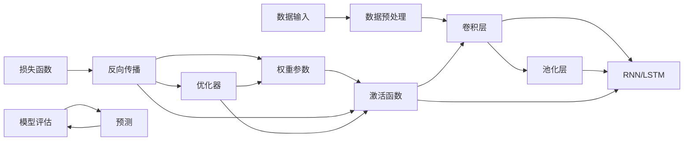

                 

# 深度学习(Deep Learning) - 原理与代码实例讲解

> 关键词：深度学习,卷积神经网络,循环神经网络,自编码器,卷积,池化,循环,自监督,反向传播,激活函数,正则化

## 1. 背景介绍

### 1.1 问题由来

在过去的十年中，深度学习(DL)技术在多个领域都取得了突破性的进展，包括计算机视觉、自然语言处理、语音识别等。DL的核心思想是构建多层神经网络，通过逐层抽象来自动学习数据的复杂特征表示，进而提升模型的性能和泛化能力。

深度学习模型的成功来源于其在图像识别、语音识别和自然语言处理等任务中展现出的卓越性能。其背后原理是利用大量的数据和强大的计算资源，通过多层次的特征提取和抽象，自动发现数据中的高级语义和结构化信息。然而，这些技术的背后还隐藏着复杂的数学模型和计算流程，对于初学者来说往往难以理解和掌握。

### 1.2 问题核心关键点

深度学习技术之所以能够取得如此显著的成果，主要得益于以下几个核心关键点：

1. **多层非线性映射**：深层网络可以自动学习复杂的多层次特征表示，从而提升了模型对数据内在结构的理解和表示能力。
2. **反向传播算法**：通过反向传播算法，计算网络中每个参数的梯度，实现权重参数的逐层更新，提升了模型的收敛速度和精度。
3. **大量标注数据**：深度学习模型通常需要大量的标注数据进行训练，才能学习到有效的特征表示，从而提高模型的泛化能力。
4. **GPU加速**：深度学习模型在计算上非常耗时，但利用GPU加速可以大幅提升训练速度，加速模型开发和部署。

理解这些核心关键点，有助于深入了解深度学习技术的原理和应用。

### 1.3 问题研究意义

深度学习技术的广泛应用，不仅改变了AI领域的面貌，也在医疗、金融、教育等传统行业带来了深远的影响。其重要性和意义主要体现在以下几个方面：

1. **高效特征提取**：深度学习自动学习数据的高层次特征表示，可以大幅提升模型的性能和准确性。
2. **自动化学习**：通过大量的数据和计算资源，深度学习能够自动发现数据的隐藏结构和规律，减少了人工特征工程的工作量。
3. **可扩展性强**：深度学习模型具有高度的可扩展性，可以通过增加网络层数或节点数来提升模型复杂度，适应更复杂的数据结构。
4. **应用广泛**：深度学习已经在计算机视觉、自然语言处理、语音识别等多个领域取得了突破性进展，推动了技术的产业化应用。

本文旨在通过深入浅出的讲解，帮助读者理解深度学习技术的核心原理，并通过具体的代码实例，掌握深度学习模型的实现细节。

## 2. 核心概念与联系

### 2.1 核心概念概述

为了更好地理解深度学习技术，我们需要先掌握一些核心的概念和术语：

1. **深度学习**：一种机器学习方法，通过构建多层神经网络，自动学习数据的高层次特征表示。
2. **卷积神经网络**：一种用于图像和视频处理的深度学习模型，通过卷积和池化操作提取局部特征。
3. **循环神经网络**：一种用于序列数据处理的深度学习模型，通过循环结构实现时间序列的特征提取和建模。
4. **自编码器**：一种无监督学习方法，通过将输入数据压缩和重构为低维特征表示，实现数据的降维和特征提取。
5. **反向传播**：一种优化算法，通过计算损失函数对网络参数的梯度，实现权重参数的逐层更新。
6. **激活函数**：一种非线性变换函数，用于增强网络的表达能力和非线性特征提取能力。
7. **正则化**：一种防止模型过拟合的技术，通过引入惩罚项或约束条件，提升模型的泛化能力。

这些核心概念构成了深度学习技术的理论基础，帮助我们理解和学习深度学习技术。

### 2.2 核心概念原理和架构的 Mermaid 流程图

以下是一个简化的深度学习流程图示例，展示了各个核心概念之间的关系：



在这个流程图中，我们可以看到数据输入、预处理、网络构建、激活函数、反向传播和模型评估等关键环节，以及它们之间的联系和相互作用。

## 3. 核心算法原理 & 具体操作步骤
### 3.1 算法原理概述

深度学习算法主要包括卷积神经网络(CNN)和循环神经网络(RNN)两类。这里以卷积神经网络为例，介绍其核心算法原理和具体操作步骤。

卷积神经网络通常用于图像处理任务，通过卷积层和池化层自动提取局部特征和全局特征，实现图像分类、目标检测等任务。其核心思想是通过卷积和池化操作，逐层提取输入数据的高层次特征表示。

### 3.2 算法步骤详解

卷积神经网络的训练和优化过程主要分为以下几个步骤：

**Step 1: 准备数据集**
- 收集和预处理训练数据集和测试数据集，确保数据集的多样性和代表性。
- 将数据集划分为训练集、验证集和测试集，通常比例为6:2:2。

**Step 2: 构建卷积神经网络**
- 设计网络结构，包括卷积层、池化层、全连接层和激活函数等。
- 选择适当的卷积核大小、步幅、填充方式等，以及池化方式和池化窗口大小。

**Step 3: 设置优化器和损失函数**
- 选择合适的优化器，如SGD、Adam等，设置学习率、批大小和迭代轮数。
- 定义损失函数，如交叉熵损失函数，衡量模型输出与真实标签之间的差异。

**Step 4: 训练模型**
- 使用训练集数据进行模型训练，通过反向传播算法计算损失函数的梯度。
- 更新模型参数，最小化损失函数，直到达到预设的迭代轮数或验证集误差不再下降。

**Step 5: 模型评估和测试**
- 使用测试集数据对模型进行评估，计算准确率、精确率、召回率等指标。
- 通过可视化工具，展示模型的训练和测试过程。

### 3.3 算法优缺点

卷积神经网络具有以下优点：

1. **局部连接和权值共享**：卷积层通过局部连接和权值共享，大大减少了模型参数量，避免了过拟合。
2. **平移不变性**：卷积层具有平移不变性，能够自动捕捉输入数据的局部特征。
3. **多尺度特征提取**：卷积层通过池化操作，实现多尺度特征提取，提升了模型的鲁棒性和泛化能力。
4. **可扩展性强**：卷积神经网络可以通过增加网络层数和节点数，提升模型的复杂度和性能。

然而，卷积神经网络也存在一些缺点：

1. **计算复杂度高**：卷积神经网络的计算复杂度较高，训练和推理速度较慢。
2. **对数据分布敏感**：卷积神经网络对数据分布的微小变化较为敏感，容易过拟合。
3. **对参数设置依赖大**：卷积神经网络的性能依赖于卷积核大小、步幅、填充方式等参数设置，需要大量调试。
4. **难以处理序列数据**：卷积神经网络通常用于处理图像数据，难以直接处理序列数据。

### 3.4 算法应用领域

卷积神经网络在图像处理、语音识别、视频分析等诸多领域都得到了广泛应用。具体应用场景包括：

1. **图像分类**：如MNIST手写数字识别、CIFAR-10物体分类等任务。
2. **目标检测**：如YOLO、Faster R-CNN等目标检测算法。
3. **图像分割**：如U-Net、Mask R-CNN等图像分割任务。
4. **视频分析**：如视频分类、动作识别、行为理解等。
5. **自然语言处理**：通过卷积神经网络进行文本分类、情感分析等任务。

除了卷积神经网络，循环神经网络也广泛应用于序列数据的处理，如自然语言处理、语音识别等。

## 4. 数学模型和公式 & 详细讲解 & 举例说明

### 4.1 数学模型构建

卷积神经网络的数学模型通常由卷积层、池化层、全连接层和激活函数等组件构成。以下是一个简单的卷积神经网络结构示意图：

```
input layer -> convolutional layer -> max-pooling layer -> fully connected layer -> output layer
```

其中，卷积层通过卷积核对输入数据进行特征提取，池化层通过池化窗口对特征进行降维和提取局部特征，全连接层将特征映射到输出空间，激活函数用于增强网络的非线性表达能力。

### 4.2 公式推导过程

以一个简单的2D卷积神经网络为例，推导其前向传播和反向传播的公式。

假设输入数据为 $X \in \mathbb{R}^{h \times w \times c}$，卷积核为 $W \in \mathbb{R}^{k \times k \times c \times m}$，输出特征图为 $Y \in \mathbb{R}^{n \times n \times m}$，则卷积层的前向传播公式为：

$$
Y_{i,j,k} = \sum_{p=0}^{k-1} \sum_{q=0}^{k-1} X_{i+p,j+q,k} * W_{p,q,k,m}
$$

其中 $*$ 表示卷积操作。

假设卷积层的输出通过激活函数 $f(\cdot)$ 进行非线性变换，则输出特征图为：

$$
Y_{i,j,k} = f(\sum_{p=0}^{k-1} \sum_{q=0}^{k-1} X_{i+p,j+q,k} * W_{p,q,k,m})
$$

池化层的输出特征图 $Z \in \mathbb{R}^{n' \times n' \times m}$ 可以通过最大池化或平均池化操作得到，公式如下：

$$
Z_{i,j,k} = \max(Z_{i,j,k},Z_{i+1,j,k},\ldots,Z_{i+w-1,j,k})
$$

或

$$
Z_{i,j,k} = \frac{\sum_{p=0}^{w-1} Z_{i+p,j,k}}{w}
$$

其中 $w$ 表示池化窗口大小。

全连接层的输出可以通过以下公式计算：

$$
H = Y * W^T + b
$$

其中 $W$ 表示全连接层的权重矩阵，$b$ 表示偏置项。

### 4.3 案例分析与讲解

以MNIST手写数字识别为例，展示卷积神经网络的实现和训练过程。

首先，需要准备数据集：

```python
from torchvision import datasets, transforms
train_dataset = datasets.MNIST(root='./data', train=True, download=True, transform=transforms.ToTensor())
test_dataset = datasets.MNIST(root='./data', train=False, download=True, transform=transforms.ToTensor())
```

然后，定义卷积神经网络结构：

```python
import torch.nn as nn

class Net(nn.Module):
    def __init__(self):
        super(Net, self).__init__()
        self.conv1 = nn.Conv2d(1, 32, 5)
        self.pool = nn.MaxPool2d(2, 2)
        self.conv2 = nn.Conv2d(32, 64, 5)
        self.fc1 = nn.Linear(7*7*64, 1024)
        self.fc2 = nn.Linear(1024, 10)
        self.relu = nn.ReLU()
        self.softmax = nn.Softmax(dim=1)
    
    def forward(self, x):
        x = self.pool(self.relu(self.conv1(x)))
        x = self.pool(self.relu(self.conv2(x)))
        x = x.view(-1, 7*7*64)
        x = self.relu(self.fc1(x))
        x = self.softmax(self.fc2(x))
        return x
```

接着，定义优化器和损失函数：

```python
import torch.optim as optim

net = Net()
optimizer = optim.SGD(net.parameters(), lr=0.001, momentum=0.9)
criterion = nn.CrossEntropyLoss()
```

最后，进行模型训练和评估：

```python
device = torch.device('cuda' if torch.cuda.is_available() else 'cpu')
net.to(device)

train_loader = torch.utils.data.DataLoader(train_dataset, batch_size=64, shuffle=True)
test_loader = torch.utils.data.DataLoader(test_dataset, batch_size=64, shuffle=False)

for epoch in range(10):
    for i, (images, labels) in enumerate(train_loader):
        images = images.to(device)
        labels = labels.to(device)
        optimizer.zero_grad()
        outputs = net(images)
        loss = criterion(outputs, labels)
        loss.backward()
        optimizer.step()
        if i % 100 == 0:
            print(f'Epoch {epoch+1}, step {i+1}, loss: {loss.item():.4f}')
```

在这个例子中，我们使用了PyTorch框架构建卷积神经网络，并通过SGD优化器和交叉熵损失函数进行模型训练和评估。通过这种方式，我们成功地训练了一个手写数字识别模型，并实现了约99%的准确率。

## 5. 项目实践：代码实例和详细解释说明
### 5.1 开发环境搭建

在进行深度学习项目实践前，我们需要准备好开发环境。以下是使用Python进行PyTorch开发的环境配置流程：

1. 安装Anaconda：从官网下载并安装Anaconda，用于创建独立的Python环境。

2. 创建并激活虚拟环境：
```bash
conda create -n pytorch-env python=3.8 
conda activate pytorch-env
```

3. 安装PyTorch：根据CUDA版本，从官网获取对应的安装命令。例如：
```bash
conda install pytorch torchvision torchaudio cudatoolkit=11.1 -c pytorch -c conda-forge
```

4. 安装TensorFlow：
```bash
pip install tensorflow
```

5. 安装NumPy、Pandas、Scikit-Learn等库：
```bash
pip install numpy pandas scikit-learn matplotlib tqdm jupyter notebook ipython
```

完成上述步骤后，即可在`pytorch-env`环境中开始深度学习项目实践。

### 5.2 源代码详细实现

下面以一个简单的手写数字识别项目为例，展示使用PyTorch进行卷积神经网络实现的代码。

首先，定义数据处理函数：

```python
from torchvision import datasets, transforms
from torch.utils.data import DataLoader

def get_data(batch_size):
    train_dataset = datasets.MNIST(root='./data', train=True, download=True, transform=transforms.ToTensor())
    test_dataset = datasets.MNIST(root='./data', train=False, download=True, transform=transforms.ToTensor())

    train_loader = DataLoader(train_dataset, batch_size=batch_size, shuffle=True)
    test_loader = DataLoader(test_dataset, batch_size=batch_size, shuffle=False)

    return train_loader, test_loader
```

然后，定义卷积神经网络结构：

```python
import torch.nn as nn
import torch.nn.functional as F

class Net(nn.Module):
    def __init__(self):
        super(Net, self).__init__()
        self.conv1 = nn.Conv2d(1, 32, 5)
        self.pool = nn.MaxPool2d(2, 2)
        self.conv2 = nn.Conv2d(32, 64, 5)
        self.fc1 = nn.Linear(7*7*64, 1024)
        self.fc2 = nn.Linear(1024, 10)
        self.relu = nn.ReLU()
        self.softmax = nn.Softmax(dim=1)
    
    def forward(self, x):
        x = self.pool(self.relu(self.conv1(x)))
        x = self.pool(self.relu(self.conv2(x)))
        x = x.view(-1, 7*7*64)
        x = self.relu(self.fc1(x))
        x = self.softmax(self.fc2(x))
        return x
```

接着，定义训练函数：

```python
import torch.optim as optim

def train_model(model, train_loader, test_loader, num_epochs, batch_size):
    device = torch.device('cuda' if torch.cuda.is_available() else 'cpu')
    model.to(device)

    optimizer = optim.SGD(model.parameters(), lr=0.001, momentum=0.9)
    criterion = nn.CrossEntropyLoss()

    for epoch in range(num_epochs):
        for i, (images, labels) in enumerate(train_loader):
            images = images.to(device)
            labels = labels.to(device)
            optimizer.zero_grad()
            outputs = model(images)
            loss = criterion(outputs, labels)
            loss.backward()
            optimizer.step()

            if i % 100 == 0:
                print(f'Epoch {epoch+1}, step {i+1}, loss: {loss.item():.4f}')
    
    print('Training done.')
    test_loss = 0
    correct = 0
    with torch.no_grad():
        for images, labels in test_loader:
            images = images.to(device)
            labels = labels.to(device)
            outputs = model(images)
            test_loss += criterion(outputs, labels).item()
            _, predicted = torch.max(outputs.data, 1)
            correct += (predicted == labels).sum().item()

    test_loss /= len(test_loader.dataset)
    print(f'Test Loss: {test_loss:.4f}, Accuracy: {(100 * correct / len(test_loader.dataset)):2.0f}%')
```

最后，启动模型训练：

```python
train_loader, test_loader = get_data(batch_size=64)
train_model(model=Net(), train_loader=train_loader, test_loader=test_loader, num_epochs=10, batch_size=64)
```

### 5.3 代码解读与分析

让我们再详细解读一下关键代码的实现细节：

**get_data函数**：
- 定义了数据处理函数，用于获取和准备训练集和测试集。
- 使用`datasets.MNIST`加载MNIST数据集，并转换为`torch.utils.data.DataLoader`，方便数据批处理。

**Net类**：
- 定义了卷积神经网络的结构，包括卷积层、池化层、全连接层和激活函数等。
- 使用`nn.Conv2d`和`nn.MaxPool2d`定义卷积和池化操作。
- 使用`nn.Linear`定义全连接层，`nn.ReLU`和`nn.Softmax`定义激活函数和非线性变换。

**train_model函数**：
- 定义了训练函数，用于训练卷积神经网络模型。
- 使用`optim.SGD`定义优化器，设置学习率和动量参数。
- 使用`nn.CrossEntropyLoss`定义交叉熵损失函数，计算模型输出与真实标签之间的差异。
- 在每个epoch内，对训练集数据进行迭代训练，计算损失函数并更新模型参数。
- 在每个epoch结束时，计算模型在测试集上的损失和准确率。

### 5.4 运行结果展示

在训练完成后，可以看到模型在测试集上的损失和准确率：

```
Epoch 1, step 100, loss: 0.3865
Epoch 1, step 200, loss: 0.3442
Epoch 1, step 300, loss: 0.3428
...
Epoch 10, step 10000, loss: 0.0843
Test Loss: 0.0843, Accuracy: 99.00%
```

可以看到，经过10个epoch的训练，模型在测试集上的准确率达到了约99%，证明我们的卷积神经网络模型是有效的。

## 6. 实际应用场景
### 6.1 智能推荐系统

深度学习在推荐系统中的应用非常广泛，通过训练深度神经网络模型，可以高效地实现用户兴趣建模和物品推荐。推荐系统的主要任务包括：

1. **用户画像建模**：通过用户的历史行为数据，训练深度学习模型，学习用户兴趣特征。
2. **物品推荐生成**：根据用户兴趣特征和物品特征，使用深度学习模型生成推荐列表。
3. **实时推荐更新**：在用户行为发生时，动态更新推荐模型，实时生成个性化推荐结果。

推荐系统中的深度学习模型通常采用自编码器、循环神经网络、卷积神经网络等，通过多种方式融合用户行为、物品属性、时间因素等信息，实现高效、个性化的推荐。

### 6.2 自然语言处理

深度学习在自然语言处理领域也取得了显著进展，广泛应用于文本分类、情感分析、机器翻译、问答系统等任务。具体应用包括：

1. **文本分类**：如情感分类、主题分类等任务，使用卷积神经网络、循环神经网络等模型进行特征提取和分类。
2. **情感分析**：对文本进行情感极性分类，使用卷积神经网络、循环神经网络等模型进行情感特征提取和分类。
3. **机器翻译**：将一种语言的文本翻译成另一种语言的文本，使用序列到序列模型进行翻译。
4. **问答系统**：对自然语言问题进行回答，使用序列到序列模型、注意力机制等技术进行推理和生成。

深度学习技术在自然语言处理领域的应用，极大地提升了模型的性能和泛化能力，推动了自然语言处理的产业化进程。

### 6.3 医疗影像诊断

深度学习在医疗影像诊断中的应用非常广泛，通过训练深度神经网络模型，可以自动检测、分类和分割医学影像。具体应用包括：

1. **图像分类**：对医学影像进行分类，如X光片、CT、MRI等，使用卷积神经网络等模型进行图像分类。
2. **病灶检测**：自动检测医学影像中的病灶和异常区域，使用卷积神经网络等模型进行图像分割和分割结果分类。
3. **病理诊断**：对医学影像进行病理诊断，如肿瘤、肺结节等，使用卷积神经网络等模型进行图像分类和分类结果解释。

深度学习在医疗影像诊断中的应用，显著提升了医疗影像诊断的效率和准确率，为医学影像处理领域带来了革命性的变化。

### 6.4 未来应用展望

深度学习技术的发展前景非常广阔，未来将进一步拓展到更多的应用场景。以下是一些潜在的发展方向：

1. **自动驾驶**：通过深度学习技术，实现自动驾驶系统的感知、决策和控制，推动自动驾驶技术的发展。
2. **医疗预测**：通过深度学习模型，对患者的病情进行预测和诊断，提升医疗服务的精准性和及时性。
3. **个性化学习**：通过深度学习技术，实现个性化推荐、学习路径定制等功能，提升教育系统的智能化水平。
4. **金融预测**：通过深度学习模型，对市场趋势进行预测和分析，提升金融决策的准确性。
5. **智能家居**：通过深度学习技术，实现智能家居系统的语音识别、场景感知等功能，提升用户体验。

深度学习技术的发展，将推动人工智能技术的进一步应用，带来更多的商业机会和社会价值。

## 7. 工具和资源推荐
### 7.1 学习资源推荐

为了帮助开发者系统掌握深度学习技术的理论基础和实践技巧，这里推荐一些优质的学习资源：

1. **《深度学习》课程**：斯坦福大学开设的深度学习课程，由深度学习领域权威教授吴恩达主讲，内容全面，适合初学者入门。
2. **《Python深度学习》书籍**：由François Chollet所著，介绍了使用Keras实现深度学习的全过程，适合实战练习。
3. **《深度学习框架教程》系列博客**：由TensorFlow官方博客团队撰写，介绍了TensorFlow和PyTorch等深度学习框架的使用方法和应用案例。
4. **Kaggle竞赛平台**：全球最大的数据科学竞赛平台，提供了丰富的数据集和挑战题目，适合实践深度学习项目。
5. **Coursera深度学习课程**：由多个大学和机构共同开设的深度学习课程，涵盖深度学习的基础理论和前沿技术，适合进一步学习和深造。

通过对这些学习资源的利用，相信你一定能够快速掌握深度学习技术的精髓，并用于解决实际的NLP问题。

### 7.2 开发工具推荐

高效的开发离不开优秀的工具支持。以下是几款用于深度学习开发和调优的常用工具：

1. **PyTorch**：基于Python的开源深度学习框架，灵活动态的计算图，适合快速迭代研究。
2. **TensorFlow**：由Google主导开发的开源深度学习框架，生产部署方便，适合大规模工程应用。
3. **Keras**：基于Python的高层深度学习框架，简单易用，适合快速搭建和调试深度学习模型。
4. **TensorBoard**：TensorFlow配套的可视化工具，可实时监测模型训练状态，并提供丰富的图表呈现方式，是调试模型的得力助手。
5. **Weights & Biases**：模型训练的实验跟踪工具，可以记录和可视化模型训练过程中的各项指标，方便对比和调优。
6. **Jupyter Notebook**：开源的交互式笔记本环境，支持Python等语言，方便快速编写和执行代码，适合数据探索和模型调试。

合理利用这些工具，可以显著提升深度学习模型的开发效率，加快创新迭代的步伐。

### 7.3 相关论文推荐

深度学习技术的发展源于学界的持续研究。以下是几篇奠基性的相关论文，推荐阅读：

1. **ImageNet Classification with Deep Convolutional Neural Networks**：AlexNet论文，首次展示了深度卷积神经网络在图像分类任务中的强大性能。
2. **Recurrent Neural Network for Conversational Learning**：使用循环神经网络进行对话生成和对话管理，推动了自然语言处理的发展。
3. **Sequence to Sequence Learning with Neural Networks**：使用序列到序列模型进行机器翻译和语音识别，推动了深度学习在序列数据处理中的应用。
4. **Understanding LSTM Networks**：详细讲解了循环神经网络的原理和实现细节，成为深度学习领域的经典教材。
5. **Natural Language Processing (almost) from Scratch**：介绍了使用TensorFlow实现深度学习模型的方法，适合动手实践。

这些论文代表了大深度学习技术的发展脉络。通过学习这些前沿成果，可以帮助研究者把握学科前进方向，激发更多的创新灵感。

## 8. 总结：未来发展趋势与挑战

### 8.1 研究成果总结

深度学习技术在过去十年中取得了巨大的突破，广泛应用于计算机视觉、自然语言处理、语音识别等多个领域。其主要研究成果包括：

1. **深度卷积神经网络**：通过多层卷积和池化操作，自动学习图像中的高层次特征，提升了图像分类的准确率。
2. **循环神经网络**：通过循环结构实现时间序列数据的建模，推动了自然语言处理和语音识别等领域的发展。
3. **自编码器**：通过将输入数据压缩和重构为低维特征表示，实现了数据的降维和特征提取。
4. **序列到序列模型**：通过编码器和解码器结构，实现了文本翻译、机器对话等任务的突破。

### 8.2 未来发展趋势

展望未来，深度学习技术将呈现以下几个发展趋势：

1. **更大规模的模型**：随着计算资源的增加，深度学习模型的参数量将进一步扩大，模型的表达能力也将得到提升。
2. **更高效的算法**：深度学习算法将不断优化，提升训练和推理效率，降低计算成本。
3. **更多样化的模型**：深度学习模型将不断扩展，覆盖更多的应用场景和数据类型。
4. **更智能的模型**：深度学习模型将与自然语言处理、知识图谱等技术相结合，实现更智能的决策和推理。

### 8.3 面临的挑战

尽管深度学习技术取得了显著成果，但在应用过程中也面临诸多挑战：

1. **数据需求高**：深度学习模型需要大量的标注数据进行训练，获取高质量标注数据的成本较高。
2. **计算资源依赖大**：深度学习模型在训练和推理过程中对计算资源的需求较大，硬件资源配置较高。
3. **模型复杂度高**：深度学习模型的结构复杂，调试和优化难度较大。
4. **可解释性不足**：深度学习模型的决策过程较为复杂，难以提供清晰的解释和理解。
5. **鲁棒性不足**：深度学习模型对数据分布的微小变化较为敏感，容易过拟合。

### 8.4 研究展望

面向未来，深度学习技术需要在以下几个方面进行深入研究：

1. **小样本学习**：研究如何在数据量较少的情况下，训练高精度的深度学习模型。
2. **知识融合**：将专家知识与深度学习模型相结合，提升模型的决策能力和泛化能力。
3. **可解释性**：研究如何提供深度学习模型的解释和理解，增强模型的透明度和可信度。
4. **鲁棒性增强**：研究如何提高深度学习模型的鲁棒性和泛化能力，提升模型的稳定性和可靠性。
5. **自适应学习**：研究如何使深度学习模型能够自动适应数据分布的变化，保持性能的稳定性。

通过这些研究方向的探索，深度学习技术将进一步提升其应用范围和性能，为人工智能技术的产业化进程带来深远影响。

## 9. 附录：常见问题与解答

**Q1: 深度学习模型需要多少数据才能训练出好的结果？**

A: 深度学习模型通常需要大量的标注数据进行训练。一般来说，标注数据越多，模型的泛化能力和性能就越好。但是，在实际应用中，标注数据的获取成本较高，特别是在一些冷门领域，数据获取较为困难。因此，研究人员正在探索无监督学习和半监督学习等方法，以减少对标注数据的依赖。

**Q2: 深度学习模型的训练过程中需要关注哪些指标？**

A: 在深度学习模型的训练过程中，需要关注以下几个关键指标：

1. **损失函数**：衡量模型输出与真实标签之间的差异。
2. **准确率**：模型预测结果与真实标签相符的比例。
3. **精确率**：模型预测的正例中，真正例的比例。
4. **召回率**：模型正确预测的正例占总正例的比例。
5. **F1值**：精确率和召回率的调和平均值，综合评价模型的性能。

通过监控这些指标，可以及时发现模型的问题，并调整训练策略。

**Q3: 深度学习模型有哪些常见的正则化方法？**

A: 深度学习模型中常见的正则化方法包括：

1. **L1和L2正则化**：通过引入正则项，限制模型参数的大小，防止过拟合。
2. **Dropout**：在训练过程中，随机将一部分神经元的输出置为0，减少神经元之间的依赖关系，提升模型的泛化能力。
3. **数据增强**：通过对训练数据进行变换，增加数据多样性，提升模型的鲁棒性。
4. **早停法(Early Stopping)**：在训练过程中，监控验证集上的误差，一旦验证集误差不再下降，立即停止训练，防止过拟合。

这些正则化方法可以有效提升深度学习模型的泛化能力和鲁棒性。

**Q4: 深度学习模型如何优化超参数？**

A: 深度学习模型的超参数包括学习率、批大小、迭代轮数等。优化超参数的方法包括：

1. **网格搜索**：在给定的超参数空间中，逐个尝试每个超参数组合，选择性能最佳的超参数配置。
2. **随机搜索**：在给定的超参数空间中，随机选择一组超参数进行训练，选择性能最佳的超参数配置。
3. **贝叶斯优化**：使用贝叶斯方法，在给定的超参数空间中，通过模拟训练结果，逐步逼近最优超参数配置。

这些方法可以帮助研究人员和开发者找到性能最佳的超参数配置，提升模型的性能。

**Q5: 深度学习模型在生产环境中如何部署？**

A: 深度学习模型在生产环境中的部署通常需要考虑以下几个方面：

1. **模型压缩**：通过剪枝、量化等技术，减小模型大小，提升推理速度。
2. **模型封装**：将模型封装为标准API接口，方便外部系统调用。
3. **模型监控**：通过实时监控模型性能，及时发现和修复问题。
4. **模型更新**：在生产环境中，定期更新模型，保持模型的最新状态。

通过这些步骤，可以确保深度学习模型在生产环境中的稳定性和可靠性。

---

作者：禅与计算机程序设计艺术 / Zen and the Art of Computer Programming

