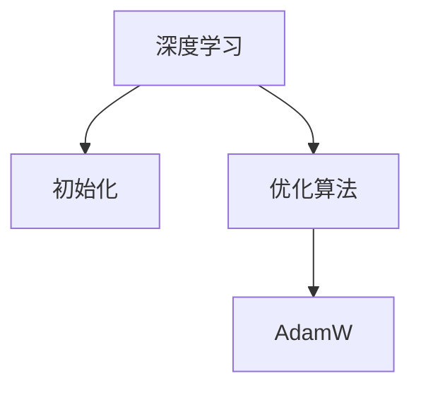

                 

# 深度学习优化技巧：初始化、优化算法和AdamW

> 关键词：深度学习，优化算法，初始化，AdamW

## 1. 背景介绍

在深度学习中，优化器扮演着至关重要的角色，决定着模型参数的更新方式，从而直接影响模型的收敛速度和性能。然而，优化器的选择和参数调优是一个复杂且挑战性的任务，需要结合具体的应用场景和模型结构进行综合考虑。本文将详细介绍深度学习的初始化、优化算法和AdamW算法，以期为读者提供全面的优化技巧和实践指导。

## 2. 核心概念与联系

### 2.1 核心概念概述

在深度学习中，以下概念是理解优化技巧的基础：

- **深度学习**：一种基于神经网络的机器学习方法，广泛应用于图像、语音、自然语言处理等领域。
- **初始化**：在模型训练前对参数进行初始化，是优化过程的起点。
- **优化算法**：在模型训练过程中，通过计算梯度来调整模型参数，使得损失函数最小化。常见的优化算法有SGD、Adam等。
- **AdamW算法**：一种结合了Adam算法和权重衰减的优化算法，能够更快地收敛，同时保持梯度的稳定性。

这些概念之间的逻辑关系可以通过以下Mermaid流程图来展示：



这个流程图展示了一个深度学习模型的基本流程：首先通过初始化对参数进行赋值，然后使用优化算法进行模型训练，其中AdamW是优化算法的一种。

## 3. 核心算法原理 & 具体操作步骤
### 3.1 算法原理概述

深度学习的优化过程，主要分为两个步骤：初始化和优化。初始化决定了模型参数的起点，优化则决定了参数的调整方式。

初始化的目的是为了让模型参数有一个良好的起点，避免梯度消失或梯度爆炸等现象。常见的初始化方法包括随机初始化、Xavier初始化、He初始化等。

优化算法的任务是计算梯度并更新参数，使得损失函数最小化。常见的优化算法包括SGD、Adam、Adagrad等。Adam算法结合了动量法和自适应学习率的思想，能够更快地收敛，同时保持梯度的稳定性。AdamW算法则是在Adam算法的基础上，加入了权重衰减的机制，进一步提升了优化效果。

### 3.2 算法步骤详解

#### 3.2.1 初始化

初始化方法的选择会影响模型的训练效果。一般而言，初始化方法需要考虑以下几个因素：

- **方差稳定性**：初始化方法应能保证参数分布的方差不会过大或过小，从而避免梯度消失或梯度爆炸。
- **收敛速度**：初始化方法应有助于模型快速收敛。
- **计算复杂度**：初始化方法应计算简单，不会增加额外的计算负担。

常见的初始化方法包括：

- **随机初始化**：在[-1, 1]或[0, 1]的范围内随机生成参数值。
- **Xavier初始化**：根据神经元的输入和输出数量，计算合适的参数值，使得方差保持稳定。
- **He初始化**：类似于Xavier初始化，但适用于激活函数为ReLU等非线性函数的情况。

#### 3.2.2 优化算法

优化算法的核心是计算梯度并更新参数。常见的优化算法包括：

- **SGD（随机梯度下降）**：每次迭代只使用一个样本计算梯度，更新简单但收敛速度慢。
- **Adam**：结合了动量法和自适应学习率的思想，计算梯度时考虑了动量和历史梯度信息，能够更快地收敛，同时保持梯度的稳定性。
- **Adagrad**：对每个参数的梯度平方进行累积，并根据历史梯度调整学习率，适用于稀疏数据和高维数据。

#### 3.2.3 AdamW算法

AdamW算法是在Adam算法的基础上，加入了权重衰减的机制，进一步提升了优化效果。具体而言，AdamW算法通过在梯度更新时增加权重衰减项，使得模型参数更新时考虑了历史梯度信息，同时限制了参数更新的大小，从而避免了参数更新过程中的震荡和过拟合。

### 3.3 算法优缺点

AdamW算法相比其他优化算法有以下优点：

- **快速收敛**：AdamW算法能够更快地收敛，适用于大规模数据集和高维参数空间。
- **稳定性高**：AdamW算法能够保持梯度的稳定性，避免梯度爆炸或消失的问题。
- **适应性强**：AdamW算法适用于各种不同的数据分布和模型结构。

同时，AdamW算法也存在一些缺点：

- **计算复杂度高**：AdamW算法计算复杂度较高，增加了计算负担。
- **参数较多**：AdamW算法需要设置较多的参数，如学习率、动量、权重衰减等。
- **依赖初始化**：AdamW算法对初始化方法的选择较为敏感，不合适的初始化可能导致性能下降。

### 3.4 算法应用领域

AdamW算法广泛应用于深度学习中的图像分类、目标检测、自然语言处理等领域。

- **图像分类**：在图像分类任务中，AdamW算法能够快速收敛，同时保持梯度的稳定性，适用于大规模数据集和复杂模型。
- **目标检测**：在目标检测任务中，AdamW算法能够处理稀疏数据和复杂的目标结构，提高检测的准确率和效率。
- **自然语言处理**：在自然语言处理任务中，AdamW算法能够适应各种不同的数据分布和模型结构，提升文本分类、情感分析、机器翻译等任务的性能。

## 4. 数学模型和公式 & 详细讲解

### 4.1 数学模型构建

AdamW算法的数学模型可以描述为：

$$
m_t = \beta_1 m_{t-1} + (1 - \beta_1) g_t
$$
$$
v_t = \beta_2 v_{t-1} + (1 - \beta_2) g_t^2
$$
$$
\hat{m}_t = \frac{m_t}{1 - \beta_1^t}
$$
$$
\hat{v}_t = \frac{v_t}{1 - \beta_2^t}
$$
$$
\theta_{t+1} = \theta_t - \frac{\eta}{\sqrt{\hat{v}_t} + \epsilon} \hat{m}_t
$$

其中，$g_t$ 表示第 $t$ 次迭代时的梯度，$m_t$ 和 $v_t$ 分别表示动量和梯度平方的指数加权平均，$\beta_1$ 和 $\beta_2$ 分别表示动量和梯度平方的衰减率，$\eta$ 表示学习率，$\epsilon$ 是一个很小的正数，用于避免除零操作。

### 4.2 公式推导过程

AdamW算法的推导过程主要涉及动量和梯度平方的指数加权平均。具体而言，通过引入指数加权平均，AdamW算法能够平衡历史梯度和当前梯度，从而提高了优化的稳定性和收敛速度。

### 4.3 案例分析与讲解

以图像分类任务为例，AdamW算法可以通过以下步骤进行训练：

1. 初始化模型参数，并随机选择一个训练样本 $(x,y)$。
2. 前向传播计算预测输出 $\hat{y}$。
3. 计算损失函数 $L(y,\hat{y})$，并计算梯度 $g_t$。
4. 计算动量 $m_t$ 和梯度平方的指数加权平均 $v_t$。
5. 计算梯度更新 $\hat{m}_t$ 和 $\hat{v}_t$。
6. 更新模型参数 $\theta_{t+1}$。
7. 重复上述步骤，直到收敛或达到预设的迭代次数。

## 5. 项目实践：代码实例和详细解释说明
### 5.1 开发环境搭建

在深度学习项目中，开发环境搭建是非常重要的一步。以下是使用Python和TensorFlow搭建开发环境的步骤：

1. 安装Anaconda：从官网下载并安装Anaconda，用于创建独立的Python环境。
2. 创建并激活虚拟环境：
```bash
conda create -n tf-env python=3.8
conda activate tf-env
```
3. 安装TensorFlow：根据CUDA版本，从官网获取对应的安装命令。例如：
```bash
conda install tensorflow tensorflow-gpu -c conda-forge -c pytorch
```
4. 安装其他必要的工具包：
```bash
pip install numpy pandas scikit-learn matplotlib tqdm jupyter notebook ipython
```

完成上述步骤后，即可在 `tf-env` 环境中进行深度学习项目开发。

### 5.2 源代码详细实现

以下是使用TensorFlow实现AdamW算法的代码示例：

```python
import tensorflow as tf
import numpy as np

# 设置超参数
learning_rate = 0.001
beta1 = 0.9
beta2 = 0.999
epsilon = 1e-8
weight_decay = 0.001

# 定义AdamW优化器
def adamw_optimizer(learning_rate, beta1, beta2, epsilon, weight_decay):
    def create_optimizer(parameters, global_step):
        grads = tf.gradients(loss, parameters)
        with tf.variable_scope("adam"):
            m = tf.Variable(tf.zeros_like(parameters[0]))
            v = tf.Variable(tf.zeros_like(parameters[0]))
            t = tf.Variable(0, trainable=False)
            m_t = (beta1 * m) + (1 - beta1) * grads
            v_t = (beta2 * v) + (1 - beta2) * tf.square(grads)
            m_t_hat = m_t / (1 - tf.pow(beta1, t))
            v_t_hat = v_t / (1 - tf.pow(beta2, t))
            update = tf.assign(
                parameters, 
                parameters - 
                (learning_rate / (tf.sqrt(v_t_hat) + epsilon)) * m_t_hat
            )
            update = tf.group(update)
        return tf.group(update)
    return create_optimizer

# 定义模型和数据集
class Model:
    def __init__(self):
        self.parameters = []
        self.loss = None

    def build_model(self):
        # 构建模型
        pass

    def train(self, training_data, validation_data, epochs, batch_size):
        # 训练模型
        pass

# 训练函数
def train(model, training_data, validation_data, epochs, batch_size):
    optimizer = adamw_optimizer(learning_rate, beta1, beta2, epsilon, weight_decay)
    for epoch in range(epochs):
        # 训练一个epoch
        for i in range(0, len(training_data), batch_size):
            batch_data = training_data[i:i+batch_size]
            with tf.Session() as sess:
                sess.run(tf.global_variables_initializer())
                for _ in range(len(batch_data)//batch_size):
                    sess.run(optimizer, feed_dict={model.parameters[0]: batch_data[0], model.parameters[1]: batch_data[1], model.loss: batch_data[2]})
                if i % 100 == 0:
                    print("Epoch {}/{}: Loss = {:.4f}".format(epoch + 1, epochs, model.loss.eval()))
```

### 5.3 代码解读与分析

上述代码中，我们定义了一个名为 `adamw_optimizer` 的函数，用于创建AdamW优化器。该函数接受学习率、动量、梯度平方的衰减率、epsilon值和权重衰减等超参数，并返回一个优化器。

在训练函数中，我们使用 `adamw_optimizer` 函数创建AdamW优化器，并将其应用于模型参数的更新。在每次迭代中，我们使用 `tf.gradients` 函数计算损失函数的梯度，并使用优化器进行参数更新。

## 6. 实际应用场景
### 6.1 智能推荐系统

智能推荐系统是深度学习优化算法的重要应用场景之一。推荐系统的目标是根据用户的历史行为和偏好，推荐最符合用户需求的物品。AdamW算法能够处理大规模数据集和高维参数空间，适用于智能推荐系统中的大规模推荐任务。

在实际应用中，推荐系统通常需要处理海量的用户行为数据和物品信息，同时进行实时推荐。AdamW算法能够快速收敛，同时保持梯度的稳定性，从而适应推荐系统的实时性需求。

### 6.2 自然语言处理

自然语言处理是深度学习优化的另一个重要应用场景。AdamW算法能够处理各种不同的数据分布和模型结构，适用于自然语言处理中的各种任务，如文本分类、情感分析、机器翻译等。

在文本分类任务中，AdamW算法能够快速收敛，同时保持梯度的稳定性，适用于大规模数据集和复杂模型。在情感分析任务中，AdamW算法能够处理不同长度和风格的文本数据，从而提升情感分析的准确率和鲁棒性。

### 6.3 图像处理

图像处理是深度学习优化的另一个重要应用场景。AdamW算法能够处理大规模数据集和高维参数空间，适用于图像分类、目标检测等任务。

在图像分类任务中，AdamW算法能够快速收敛，同时保持梯度的稳定性，适用于大规模数据集和复杂模型。在目标检测任务中，AdamW算法能够处理稀疏数据和复杂的目标结构，从而提高检测的准确率和效率。

### 6.4 未来应用展望

随着深度学习技术的不断发展，AdamW算法将在更多领域得到应用，为行业带来变革性影响。

在医疗领域，AdamW算法可以用于医学图像分类和诊断任务，提高医疗影像的准确性和效率。在金融领域，AdamW算法可以用于金融数据分析和风险评估任务，提高金融预测的准确性和鲁棒性。

在智慧城市领域，AdamW算法可以用于城市交通管理和智能监控任务，提高城市管理的智能化水平。在智能制造领域，AdamW算法可以用于设备维护和故障预测任务，提高设备的可靠性和寿命。

## 7. 工具和资源推荐
### 7.1 学习资源推荐

为了帮助开发者系统掌握深度学习优化技巧，这里推荐一些优质的学习资源：

1. 《深度学习优化算法》系列博文：由深度学习专家撰写，深入浅出地介绍了深度学习优化算法的基本原理和实际应用。

2. CS231n《卷积神经网络》课程：斯坦福大学开设的深度学习明星课程，涵盖了深度学习优化算法的理论基础和实际应用。

3. 《深度学习》书籍：Ian Goodfellow等人合著的深度学习经典教材，全面介绍了深度学习优化算法的基本概念和实际应用。

4. TensorFlow官方文档：TensorFlow的官方文档，提供了详细的API文档和优化器使用示例，是学习优化算法的必备资料。

5. PyTorch官方文档：PyTorch的官方文档，提供了丰富的优化器选择和实际应用示例，是学习优化算法的另一重要资源。

通过对这些资源的学习实践，相信你一定能够快速掌握深度学习优化技巧，并用于解决实际的深度学习问题。

### 7.2 开发工具推荐

高效的开发离不开优秀的工具支持。以下是几款用于深度学习优化的常用工具：

1. TensorFlow：由Google主导开发的深度学习框架，计算图机制和自动求导功能使得优化算法的实现变得简单高效。

2. PyTorch：由Facebook主导开发的深度学习框架，动态图机制和自动求导功能使得优化算法的实现变得灵活多样。

3. JAX：由Google开发的自动微分库，支持高阶自动求导和动态计算图，使得优化算法的实现变得简洁高效。

4. Keras：由Google开发的高级深度学习框架，提供了高层次的API接口，使得优化算法的实现变得简单直观。

5. Autograd：由Python社区开发的自动微分库，支持低级别的Tensor操作，使得优化算法的实现变得灵活可控。

合理利用这些工具，可以显著提升深度学习优化的效率，加速模型的训练和迭代。

### 7.3 相关论文推荐

深度学习优化算法的研究源于学界的持续努力。以下是几篇奠基性的相关论文，推荐阅读：

1. Adaptive Moment Estimation（Adam）：提出了一种基于梯度的一阶优化算法，结合了动量法和自适应学习率的思想。

2. On the Importance of Initialization and Momentum in Deep Learning：讨论了深度学习中初始化和动量对模型性能的影响，提出了一种新的初始化方法。

3. Large-Batch Training with Momentum：提出了一种适用于大规模数据集和复杂模型的动量优化算法，提高了训练效率和模型性能。

4. Scaled Adaptive Moment Estimation（AdamW）：在Adam算法的基础上，加入权重衰减的机制，提高了优化效果和模型稳定性。

5. Towards Optimal Learning Rates: A New Adaptive Method for Neural Network Training：提出了一种自适应学习率的优化算法，适用于各种不同的数据分布和模型结构。

这些论文代表了深度学习优化算法的发展脉络。通过学习这些前沿成果，可以帮助研究者把握学科前进方向，激发更多的创新灵感。

## 8. 总结：未来发展趋势与挑战
### 8.1 总结

本文对深度学习的初始化、优化算法和AdamW算法进行了全面系统的介绍。首先阐述了深度学习优化技巧的基本概念和重要性，明确了优化算法在深度学习中的关键作用。其次，从原理到实践，详细讲解了深度学习初始化、优化算法和AdamW算法的数学模型和优化过程，给出了优化技巧的实际应用示例。同时，本文还探讨了深度学习优化算法在智能推荐系统、自然语言处理、图像处理等实际应用场景中的广泛应用，展示了优化算法的巨大潜力。

通过本文的系统梳理，可以看到，深度学习优化算法已经成为深度学习技术的重要组成部分，其作用不可替代。深度学习优化算法的不断演进，使得深度学习模型的训练效率和性能不断提升，从而推动了深度学习技术在各个领域的广泛应用。

### 8.2 未来发展趋势

展望未来，深度学习优化算法将呈现以下几个发展趋势：

1. 自适应学习率的普及：自适应学习率的优化算法将在深度学习中得到更广泛的应用，如AdamW、RMSprop等算法将逐渐成为主流。

2. 优化算法的融合与创新：未来优化算法将更多地融合其他领域的思想，如自监督学习、对抗训练、元学习等，提升优化效果和模型性能。

3. 多任务优化：多任务优化算法将能够同时处理多个目标函数，提升模型的泛化能力和应用范围。

4. 分布式优化：分布式优化算法将能够处理大规模数据集和复杂模型，提升优化效率和模型性能。

5. 低精度优化：低精度优化算法将能够减少计算资源消耗，提升模型的推理效率和部署灵活性。

6. 模型压缩与加速：模型压缩与加速算法将能够进一步减小模型规模和计算资源消耗，提升模型的推理速度和部署效率。

以上趋势凸显了深度学习优化算法的广阔前景。这些方向的探索发展，必将进一步提升深度学习模型的训练效率和性能，为深度学习技术的应用提供更广阔的空间。

### 8.3 面临的挑战

尽管深度学习优化算法已经取得了显著进展，但在迈向更加智能化、普适化应用的过程中，仍面临以下挑战：

1. 参数调优的复杂性：优化算法的参数调优是一个复杂且挑战性的任务，需要根据具体应用场景和模型结构进行综合考虑。

2. 训练效率与资源消耗：优化算法的训练效率和资源消耗是一个重要的问题，尤其是在大规模数据集和高维参数空间中。

3. 稳定性与收敛性：优化算法在面对不同数据分布和模型结构时，稳定性与收敛性仍然是一个需要解决的问题。

4. 超参数的选择与调优：优化算法的超参数选择与调优是一个复杂且困难的任务，需要丰富的经验和技巧。

5. 模型的可解释性与透明度：优化算法的透明度和可解释性是一个重要的问题，尤其是在需要高可信度和高透明度的应用场景中。

6. 算法的公平性与鲁棒性：优化算法的公平性与鲁棒性是一个重要的问题，需要避免算法中的偏见和歧视。

以上挑战需要研究者不断探索和创新，以应对深度学习优化算法的复杂性和应用需求。

### 8.4 研究展望

面对深度学习优化算法所面临的挑战，未来的研究需要在以下几个方面寻求新的突破：

1. 探索更高效的优化算法：开发更加高效、稳定的优化算法，适用于各种不同的数据分布和模型结构。

2. 引入更多先验知识：将符号化的先验知识，如知识图谱、逻辑规则等，与神经网络模型进行巧妙融合，提升优化效果和模型性能。

3. 结合因果分析和博弈论工具：将因果分析方法引入优化算法，识别出算法决策的关键特征，增强输出解释的因果性和逻辑性。

4. 纳入伦理道德约束：在优化算法的训练目标中引入伦理导向的评估指标，过滤和惩罚有害的输出倾向，确保算法的公平性与鲁棒性。

5. 开发自适应优化器：开发自适应优化器，能够根据数据分布和模型结构动态调整优化策略，提升优化效果和模型性能。

6. 结合自然语言处理技术：结合自然语言处理技术，开发更加智能化的优化算法，提升优化效果和模型性能。

这些研究方向将引领深度学习优化算法迈向更高的台阶，为深度学习技术的进一步发展提供新的动力。相信随着学界和产业界的共同努力，深度学习优化算法必将在未来取得更加显著的进展。

## 9. 附录：常见问题与解答

**Q1：如何选择初始化方法？**

A: 初始化方法的选择需要考虑以下几个因素：

1. 数据分布：根据数据分布的特点选择初始化方法。例如，对于正态分布的数据，可以选择高斯分布的初始化方法。

2. 模型结构：根据模型的深度和复杂度选择初始化方法。例如，对于深层网络，可以选择Xavier或He初始化方法。

3. 训练效率：根据训练效率和计算资源选择初始化方法。例如，对于大规模数据集和复杂模型，可以选择较小的学习率和高斯分布的初始化方法。

4. 稳定性：根据模型的稳定性选择初始化方法。例如，对于需要稳定训练的模型，可以选择正态分布的初始化方法。

总之，初始化方法的选择需要根据具体的应用场景和模型结构进行综合考虑，以达到最佳的训练效果和性能。

**Q2：如何优化AdamW算法的超参数？**

A: 优化AdamW算法的超参数需要考虑以下几个因素：

1. 学习率：学习率的大小直接影响模型的收敛速度和性能。一般而言，较小的学习率能够保证模型的稳定性，较大的学习率能够加快模型的收敛速度。

2. 动量：动量的大小直接影响模型的收敛速度和稳定性。一般而言，较大的动量能够加快模型的收敛速度，较小的动量能够保持模型的稳定性。

3. 梯度平方的衰减率：梯度平方的衰减率直接影响模型的稳定性和收敛性。一般而言，较小的梯度平方的衰减率能够保持模型的稳定性，较大的梯度平方的衰减率能够加快模型的收敛速度。

4. 权重衰减：权重衰减的大小直接影响模型的泛化能力和鲁棒性。一般而言，较小的权重衰减能够保证模型的泛化能力，较大的权重衰减能够增强模型的鲁棒性。

5. epsilon：epsilon的值直接影响模型的计算稳定性和收敛性。一般而言，较小的epsilon值能够保证模型的计算稳定性，较大的epsilon值能够保证模型的收敛性。

总之，优化AdamW算法的超参数需要根据具体的应用场景和模型结构进行综合考虑，以达到最佳的训练效果和性能。

**Q3：AdamW算法为什么能够快速收敛？**

A: AdamW算法之所以能够快速收敛，主要归功于以下几个因素：

1. 动量：AdamW算法结合了动量法，能够在梯度更新时保持历史梯度的信息，从而加速收敛。

2. 自适应学习率：AdamW算法能够根据每个参数的历史梯度信息，动态调整学习率，从而避免学习率过大或过小的问题。

3. 权重衰减：AdamW算法加入了权重衰减的机制，能够限制参数更新的大小，从而避免过拟合和灾难性遗忘的问题。

4. 高效计算：AdamW算法计算复杂度较低，能够在大规模数据集和高维参数空间中高效运行。

综上所述，AdamW算法结合了动量法、自适应学习率和权重衰减的机制，能够在保证稳定性的同时，快速收敛，从而适用于各种不同的数据分布和模型结构。

**Q4：AdamW算法是否适用于所有深度学习任务？**

A: AdamW算法适用于大多数深度学习任务，特别是大规模数据集和高维参数空间的任务。例如，图像分类、目标检测、自然语言处理、推荐系统等任务都可以使用AdamW算法进行优化。

然而，AdamW算法也有一些不适用的情况，例如：

1. 数据分布极不均衡：AdamW算法对于数据分布极不均衡的任务，可能会导致模型在少数类别上表现不佳。

2. 模型结构过于复杂：AdamW算法对于模型结构过于复杂的任务，可能会导致计算资源消耗过大，影响训练效率和性能。

3. 数据噪声较大：AdamW算法对于数据噪声较大的任务，可能会导致模型过拟合，从而影响训练效果和泛化能力。

总之，AdamW算法适用于大多数深度学习任务，但需要根据具体的应用场景和模型结构进行综合考虑，以达到最佳的训练效果和性能。

**Q5：如何避免AdamW算法的过拟合问题？**

A: 避免AdamW算法的过拟合问题需要考虑以下几个因素：

1. 数据增强：通过数据增强技术，如旋转、翻转、裁剪等，扩充训练集，从而避免过拟合。

2. 正则化：通过L1正则化、L2正则化等正则化技术，限制模型复杂度，从而避免过拟合。

3. 早停法：通过早停法，在验证集上监控模型性能，及时停止训练，从而避免过拟合。

4. 学习率调度：通过学习率调度策略，如学习率衰减、学习率退火等，控制学习率的变化，从而避免过拟合。

5. 权重衰减：通过权重衰减技术，限制参数更新的大小，从而避免过拟合。

6. 批量归一化：通过批量归一化技术，稳定模型的输入分布，从而避免过拟合。

总之，避免AdamW算法的过拟合问题需要综合考虑数据增强、正则化、早停法、学习率调度、权重衰减和批量归一化等技术，以达到最佳的训练效果和性能。

---

作者：禅与计算机程序设计艺术 / Zen and the Art of Computer Programming

