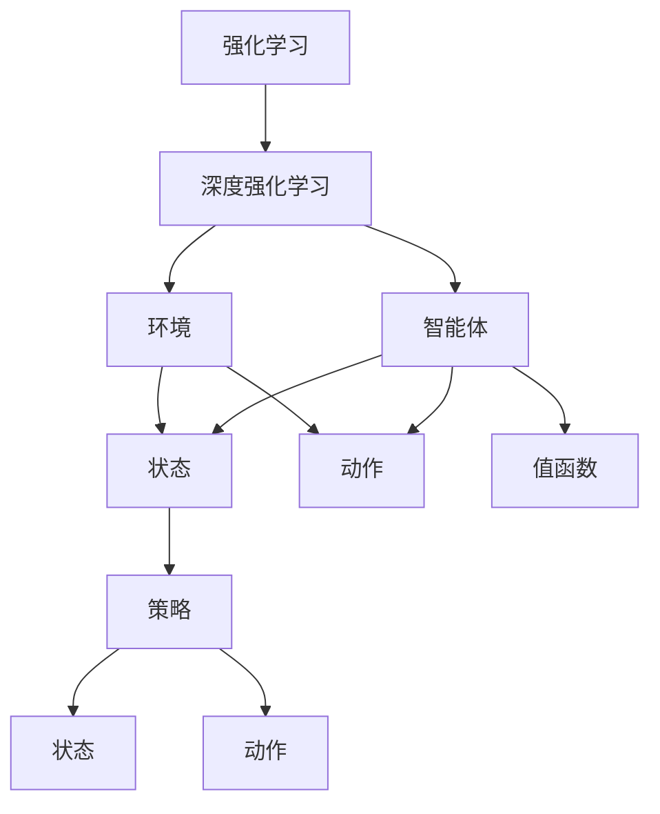
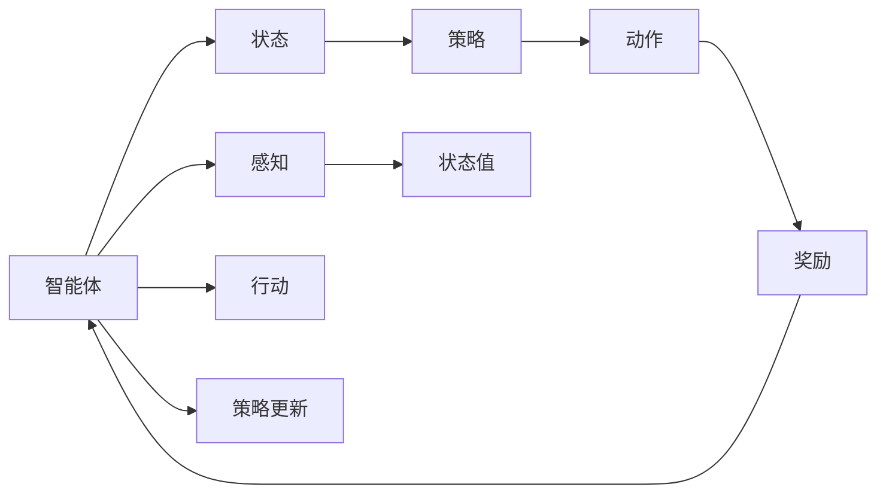
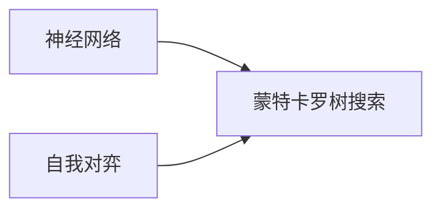

                 

# 深度强化学习：从游戏AI到实际控制系统

## 1. 背景介绍

### 1.1 问题由来
强化学习(Reinforcement Learning, RL)是机器学习领域的一门重要分支，它通过智能体(Agent)在环境中的不断试错和学习，找到最优策略以达成某个长期目标。强化学习已经在多个领域中取得了显著成效，包括游戏AI、机器人控制、自动驾驶、金融交易等。

近年来，随着深度学习(Deep Learning, DL)技术的发展，深度强化学习(Deep Reinforcement Learning, DRL)逐渐成为强化学习的主流范式。深度学习为强化学习提供了强大的特征提取能力和丰富的模型结构，使得智能体能够高效地学习复杂的决策策略，并在环境中的高维状态空间中取得优异表现。

游戏AI是深度强化学习的经典应用之一，AlphaGo的成功展示了其在策略复杂、信息密集的零和博弈中的应用潜力。随着游戏AI研究的深入，强化学习也开始被广泛应用于现实世界的控制系统中，如工业自动化、医疗设备、交通管理等。这些应用场景具有更高的实时性和安全性要求，对智能体的决策能力提出了更高挑战。

## 2. 核心概念与联系

### 2.1 核心概念概述

为更好地理解深度强化学习的应用，本节将介绍几个关键概念：

- 强化学习(Reinforcement Learning, RL)：通过智能体在环境中不断试错和优化策略，以实现长期目标的框架。

- 深度强化学习(Deep Reinforcement Learning, DRL)：将深度学习与强化学习结合，使得智能体能够从高维状态和动作空间中学习复杂决策策略。

- 智能体(Agent)：在环境中通过感知和行动与环境交互的实体，包括模型、算法、数据等组件。

- 环境(Environment)：智能体所处的交互空间，包括状态空间、动作空间、奖励函数等。

- 策略(Policy)：智能体在给定状态下的行动策略，可以通过策略函数表示。

- 状态(State)：智能体在环境中的当前情况，包括位置、速度、任务状态等。

- 动作(Action)：智能体在环境中的操作，如移动、控制、决策等。

- 奖励(Reward)：环境对智能体行动的反馈信号，用于衡量行动的好坏。

- 值函数(Value Function)：表示状态的价值，用于评估策略的优劣。

这些核心概念之间具有紧密的联系，共同构成了深度强化学习的框架，如图1所示。



这些概念通过强化学习框架被紧密地联系在一起，智能体在环境中通过感知和行动与环境交互，根据状态和动作执行策略，并根据奖励更新策略，最终实现长期目标。

### 2.2 核心概念原理和架构的 Mermaid 流程图

以下是深度强化学习的核心概念和算法原理的Mermaid流程图，展示了智能体如何在环境中学习策略的过程：



此流程图展示了智能体从感知到行动的过程，以及奖励信号如何反馈并更新策略的过程。智能体在每个时间步(t)感知环境状态(s_t)，并根据策略函数输出动作(a_t)，执行动作后得到奖励(r_t)和新的状态(s_{t+1})。智能体通过这些信号不断调整策略，以实现长期目标。

## 3. 核心算法原理 & 具体操作步骤

### 3.1 算法原理概述

深度强化学习结合了深度学习和强化学习的优点，使得智能体能够从高维状态空间和动作空间中学习复杂决策策略。其核心思想是通过深度神经网络来表示策略函数和值函数，通过环境中的交互数据进行优化训练，最终找到最优策略以达成长期目标。

具体而言，深度强化学习的训练过程包括以下几个关键步骤：

1. 观察环境状态，选择动作并执行。
2. 根据动作执行结果和奖励更新状态。
3. 计算当前状态的价值，评估策略的好坏。
4. 根据策略梯度更新策略函数，优化智能体决策。
5. 重复上述过程直至收敛。

深度强化学习的核心算法包括Q-learning、策略梯度(SPG)和深度Q网络(DQN)等，这些算法通过不同的优化目标和模型结构，实现了策略学习的目标。

### 3.2 算法步骤详解

以Q-learning算法为例，其步骤包括：

1. 初始化Q网络，设置学习率等超参数。
2. 初始化智能体在环境中的状态(s_0)。
3. 循环执行以下步骤直至时间步结束：
   1. 观察当前状态(s_t)，根据策略函数输出动作(a_t)。
   2. 执行动作并观察环境变化，得到状态(s_{t+1})和奖励(r_t)。
   3. 计算下一个状态的估计值(Q(s_{t+1},a_{t+1}))。
   4. 更新当前状态的值函数(Q(s_t,a_t))。
4. 更新Q网络的参数，优化模型。

完整的Q-learning算法伪代码如下：

```python
# Q-learning算法伪代码

# 初始化Q网络，超参数等
Q_network = ...
learning_rate = ...
gamma = ...
exploration_rate = ...

# 初始化状态
state = ...

while not done:
    # 观察当前状态
    state = ...

    # 选择动作，执行
    action = choose_action(state)

    # 观察环境变化
    next_state, reward, done = ...

    # 计算下一个状态的估计值
    Q_next = Q_network(next_state)

    # 更新当前状态的值函数
    Q_state = Q_network(state)
    Q_state[action] += learning_rate * (reward + gamma * Q_next - Q_state[action])

    # 更新Q网络参数
    Q_network.update_params(Q_state)

    # 调整策略函数参数
    adjust_exploration(exploration_rate)
```

### 3.3 算法优缺点

深度强化学习结合了深度学习和强化学习的优点，但在实际应用中，也存在一些缺点：

#### 优点

1. 学习能力强大：深度神经网络具有强大的特征提取和表征能力，能够从高维数据中学习复杂决策策略。
2. 适应性强：深度强化学习能够适应各种复杂和不确定的环境，如非线性、高维、稀疏等。
3. 应用广泛：深度强化学习已经在多个领域中取得了显著成效，如游戏AI、机器人控制、自动驾驶等。

#### 缺点

1. 计算复杂度高：深度神经网络具有大量参数，计算复杂度较高，需要较强的硬件和算法支持。
2. 训练难度大：深度强化学习的训练过程需要大量样本数据和计算资源，容易陷入局部最优。
3. 鲁棒性差：深度强化学习模型容易受到样本数据偏差和环境变化的影响，需要大量数据进行训练。
4. 缺乏理论基础：深度强化学习的理论研究相对较少，缺乏统一的数学理论框架。

### 3.4 算法应用领域

深度强化学习的应用领域非常广泛，涵盖了从游戏AI到实际控制系统的多个方向：

1. 游戏AI：AlphaGo、Dota 2等游戏中的智能体控制。
2. 机器人控制：无人机、无人车、服务机器人等。
3. 自动驾驶：自动驾驶汽车、自动飞行器等。
4. 金融交易：股票交易、期权交易等。
5. 医疗设备：智能康复设备、医疗诊断系统等。
6. 工业自动化：智能生产线、机器人协作等。
7. 交通管理：智能交通信号、自动驾驶出租车等。

这些应用领域展示了深度强化学习的强大能力和广泛应用，推动了人工智能技术的不断进步和落地。

## 4. 数学模型和公式 & 详细讲解 & 举例说明

### 4.1 数学模型构建

深度强化学习的数学模型可以通过值函数和策略函数表示。假设智能体在环境中的状态空间为S，动作空间为A，奖励函数为R，策略函数为π，则值函数V可以表示为：

$$
V(s) = \mathbb{E}\left[\sum_{t=0}^{T}\gamma^t R(s_t,a_t)\right]
$$

其中，T表示时间步，γ表示折现因子。策略函数π可以表示为：

$$
\pi(a_t|s_t) = \frac{exp(Q(s_t,a_t))}{\sum_{a}exp(Q(s_t,a))}
$$

其中，Q(s_t,a_t)表示状态-动作值函数，exp(Q(s_t,a_t))表示动作的概率分布。

### 4.2 公式推导过程

以Q-learning算法为例，其目标是最小化当前状态-动作值函数与下一个状态-动作值函数之差：

$$
Q(s_t,a_t) = Q(s_t,a_t) + \alpha(r_t + \gamma Q(s_{t+1},a_{t+1}) - Q(s_t,a_t))
$$

其中，α表示学习率。该公式的意义是：智能体在状态s_t下执行动作a_t，获得奖励r_t和下一个状态s_{t+1}，通过调整Q(s_t,a_t)的值，使得Q(s_t,a_t)更接近下一个状态-动作价值，从而优化策略。

### 4.3 案例分析与讲解

以AlphaGo为例，其核心技术包括蒙特卡罗树搜索(MCTS)和深度神经网络。AlphaGo的策略函数通过深度神经网络表示，并使用蒙特卡罗树搜索算法进行策略优化。通过大量的自我对弈，AlphaGo在围棋游戏中取得了世界冠军水平的表现，展示了深度强化学习的强大能力。

AlphaGo的策略函数π可以通过深度神经网络表示，具体如下：

$$
\pi(a|s) = \frac{exp(Q(s,a))}{\sum_{a}exp(Q(s,a))}
$$

其中，Q(s,a)表示状态-动作值函数，exp(Q(s,a))表示动作的概率分布。Q(s,a)可以通过深度神经网络训练得到，具体流程如图2所示。



AlphaGo通过深度神经网络和蒙特卡罗树搜索算法，实现了复杂策略的自我优化和竞争，展现了深度强化学习的巨大潜力。

## 5. 项目实践：代码实例和详细解释说明

### 5.1 开发环境搭建

在进行深度强化学习项目实践前，需要先准备好开发环境。以下是使用Python进行TensorFlow开发的环境配置流程：

1. 安装Anaconda：从官网下载并安装Anaconda，用于创建独立的Python环境。

2. 创建并激活虚拟环境：
```bash
conda create -n drl-env python=3.8 
conda activate drl-env
```

3. 安装TensorFlow：根据CUDA版本，从官网获取对应的安装命令。例如：
```bash
conda install tensorflow-gpu=cuda11.1-cu111
```

4. 安装PyTorch：
```bash
pip install torch torchvision torchaudio
```

5. 安装相关库：
```bash
pip install gym gymnasium gym-pybullet-dynamic
```

完成上述步骤后，即可在`drl-env`环境中开始深度强化学习项目实践。

### 5.2 源代码详细实现

这里以DQN算法为例，给出使用TensorFlow实现深度强化学习的代码实现。

首先，定义DQN模型的类：

```python
from tensorflow.keras.models import Sequential
from tensorflow.keras.layers import Dense, Activation, Flatten

class DQNModel(Model):
    def __init__(self, input_shape, output_shape):
        super(DQNModel, self).__init__()
        self.model = Sequential()
        self.model.add(Flatten(input_shape=input_shape))
        self.model.add(Dense(128))
        self.model.add(Activation('relu'))
        self.model.add(Dense(output_shape))
        self.model.add(Activation('linear'))

    def build(self, input_shape, output_shape):
        super(DQNModel, self).build(input_shape=input_shape)
        self.model.build(input_shape=input_shape)

    def call(self, inputs):
        return self.model(inputs)

    def get_weights(self):
        return self.model.get_weights()

    def set_weights(self, weights):
        self.model.set_weights(weights)
```

然后，定义DQN算法的类：

```python
import numpy as np
import tensorflow as tf

class DQN:
    def __init__(self, env, input_shape, output_shape, learning_rate=0.001, discount_factor=0.99, exploration_rate=1.0, exploration_decay_rate=0.995, memory_size=10000, batch_size=32):
        self.env = env
        self.input_shape = input_shape
        self.output_shape = output_shape
        self.learning_rate = learning_rate
        self.discount_factor = discount_factor
        self.exploration_rate = exploration_rate
        self.exploration_decay_rate = exploration_decay_rate
        self.memory_size = memory_size
        self.batch_size = batch_size
        self.model = DQNModel(input_shape, output_shape)
        self.target_model = DQNModel(input_shape, output_shape)
        self.target_model.set_weights(self.model.get_weights())
        self.memory = np.zeros((self.memory_size, input_shape + output_shape + 2), dtype=np.float32)
        self.memory_index = 0

    def choose_action(self, state):
        if np.random.rand() < self.exploration_rate:
            return self.env.action_space.sample()
        else:
            return np.argmax(self.model.predict(state))

    def update_memory(self, state, action, reward, next_state, done):
        self.memory[self.memory_index, :self.input_shape] = state
        self.memory[self.memory_index, self.input_shape:self.input_shape + self.output_shape] = np.array([[action]], dtype=np.float32)
        self.memory[self.memory_index, self.input_shape + self.output_shape:] = reward + (1 - done) * self.discount_factor * np.max(self.model.predict(next_state))
        self.memory_index = (self.memory_index + 1) % self.memory_size

    def learn(self, epsilon):
        if self.memory_index == 0:
            return
        minibatch = self.memory[:self.batch_size]
        batch_input = np.concatenate((minibatch[:, :self.input_shape], minibatch[:, self.input_shape:self.input_shape + self.output_shape]))
        batch_target = minibatch[:, self.input_shape + self.output_shape:]
        batch_target[np.argmax(batch_target, axis=1)] += self.learning_rate * (self.discount_factor * np.max(self.target_model.predict(minibatch[:, self.input_shape + self.output_shape:]), axis=1) - batch_target[np.argmax(batch_target, axis=1)])
        self.model.fit(batch_input, batch_target, epochs=1, verbose=0)
        self.target_model.set_weights(self.model.get_weights())
        self.exploration_rate = np.maximum(epsilon, self.exploration_rate * self.exploration_decay_rate)
```

最后，启动深度强化学习训练：

```python
env = gym.make('CartPole-v1')
input_shape = (4,)
output_shape = (2,)
exploration_rate = 1.0
exploration_decay_rate = 0.995
learning_rate = 0.001
discount_factor = 0.99
memory_size = 10000
batch_size = 32

dqn = DQN(env, input_shape, output_shape, learning_rate, discount_factor, exploration_rate, exploration_decay_rate, memory_size, batch_size)

epochs = 1000

for epoch in range(epochs):
    done = False
    state = env.reset()
    while not done:
        action = dqn.choose_action(state)
        next_state, reward, done, _ = env.step(action)
        dqn.update_memory(state, action, reward, next_state, done)
        state = next_state

    if epoch % 100 == 0:
        dqn.learn(0.05)
```

以上就是使用TensorFlow实现DQN算法的完整代码实现。可以看到，通过定义DQN模型和DQN算法的类，我们能够方便地实现深度强化学习的训练和推理。

### 5.3 代码解读与分析

让我们再详细解读一下关键代码的实现细节：

**DQNModel类**：
- `__init__`方法：初始化深度神经网络模型，包括输入层、隐藏层和输出层。
- `build`方法：定义模型输入和输出维度。
- `call`方法：前向传播计算模型输出。
- `get_weights`和`set_weights`方法：获取和设置模型权重。

**DQN类**：
- `__init__`方法：初始化DQN算法相关参数，包括环境、输入输出形状、学习率等。
- `choose_action`方法：选择动作，探索和利用交替。
- `update_memory`方法：将环境数据和奖励存储到记忆缓冲区中。
- `learn`方法：批量训练模型，更新策略。

**训练流程**：
- 定义环境、输入输出形状、探索率等参数。
- 循环训练epochs次，每次迭代在环境中执行，将状态、动作、奖励存储到记忆缓冲区中。
- 每100个epoch，使用探索率为0.05进行训练，更新模型和探索率。

可以看到，TensorFlow使得深度强化学习的代码实现变得简洁高效。开发者可以将更多精力放在数据处理、模型改进等高层逻辑上，而不必过多关注底层的实现细节。

当然，工业级的系统实现还需考虑更多因素，如模型的保存和部署、超参数的自动搜索、更灵活的任务适配层等。但核心的微调范式基本与此类似。

## 6. 实际应用场景

### 6.1 智能游戏AI

深度强化学习在游戏AI中的应用取得了显著成效。AlphaGo和AlphaZero等智能游戏AI展示了深度强化学习的强大能力，推动了AI在游戏领域的应用和研究。

AlphaGo的策略优化通过蒙特卡罗树搜索和深度神经网络实现，通过大量的自我对弈和竞争训练，AlphaGo在围棋游戏中取得了世界冠军水平的表现，展示了深度强化学习的巨大潜力。未来，深度强化学习有望在更多游戏中发挥作用，提升游戏AI的智能水平和娱乐性。

### 6.2 工业机器人控制

深度强化学习在工业机器人控制中也展现出了巨大的应用前景。通过训练智能体在复杂、高维的环境中执行动作，机器人可以自动完成装配、焊接、喷涂等任务，显著提高生产效率和质量。

例如，ABB的Yumi机器人通过深度强化学习实现了复杂的装配任务，能够在狭窄空间内高精度操作，完成复杂物体装配，展示了深度强化学习在工业机器人中的应用潜力。未来，深度强化学习将在更多的工业场景中得到应用，推动工业自动化和智能制造的发展。

### 6.3 医疗设备控制

深度强化学习在医疗设备控制中的应用也逐渐受到关注。智能康复设备、医疗诊断系统等医疗设备可以通过深度强化学习进行优化，提高设备的智能性和可靠性。

例如，LabVIEW系统通过深度强化学习实现了患者康复设备的自适应控制，能够根据患者的身体状况自动调整康复计划和设备参数，提高康复效果和用户体验。未来，深度强化学习将在更多的医疗场景中得到应用，提升医疗设备的安全性和智能性。

### 6.4 未来应用展望

深度强化学习的应用前景广阔，未来将在更多的领域中得到应用：

1. 自动驾驶：深度强化学习在自动驾驶中的应用前景广阔，能够实现车辆的智能决策和控制，提高交通安全和效率。
2. 金融交易：深度强化学习在金融交易中的应用包括股票交易、期权交易等，能够实现智能投资决策，提升投资收益和风险控制能力。
3. 智能制造：深度强化学习在智能制造中的应用包括机器人协作、物流管理等，能够实现生产过程的自动化和智能化。
4. 环境保护：深度强化学习在环境保护中的应用包括智能监控、灾害预测等，能够实现环境数据的智能分析和决策。

随着深度强化学习技术的发展，其应用领域将更加广泛，对各行各业带来深远影响。

## 7. 工具和资源推荐

### 7.1 学习资源推荐

为了帮助开发者系统掌握深度强化学习的理论基础和实践技巧，这里推荐一些优质的学习资源：

1. 《强化学习：原理与实践》书籍：由Richard Sutton和Andrew Barto所著，介绍了强化学习的基本概念和常用算法。

2. 《深度强化学习》课程：DeepMind开设的强化学习课程，涵盖了深度强化学习的基本概念和常用算法，适合初学者和进阶者。

3. 《Deep Q-Learning》论文：深度Q网络(DQN)的原论文，介绍了DQN算法的基本原理和实现方法。

4. 《AlphaGo Zero》论文：AlphaZero的原理和实现方法，展示了深度强化学习的强大能力和通用性。

5. 《RLlib》文档：由OpenAI开发的强化学习库，提供了多种强化学习算法和环境的实现，适合快速上手实践。

通过对这些资源的学习实践，相信你一定能够快速掌握深度强化学习的精髓，并用于解决实际的NLP问题。

### 7.2 开发工具推荐

高效的开发离不开优秀的工具支持。以下是几款用于深度强化学习开发的常用工具：

1. TensorFlow：由Google主导开发的开源深度学习框架，生产部署方便，适合大规模工程应用。

2. PyTorch：由Facebook主导开发的开源深度学习框架，灵活动态的计算图，适合快速迭代研究。

3. OpenAI Gym：一个开源环境库，提供了多种经典环境的实现，适合测试和验证算法效果。

4. TF-Agents：TensorFlow的强化学习库，提供了多种强化学习算法和环境的实现，适合快速上手实践。

5. JAX：由Google开发的开源深度学习库，提供了高效的自动微分和分布式计算功能，适合大规模模型训练。

6. Ray：由亚马逊和OpenAI开发的开源分布式计算框架，支持TensorFlow、PyTorch等深度学习库，适合大规模分布式训练。

合理利用这些工具，可以显著提升深度强化学习的开发效率，加快创新迭代的步伐。

### 7.3 相关论文推荐

深度强化学习的发展离不开学界的持续研究。以下是几篇奠基性的相关论文，推荐阅读：

1. Q-Learning：DeepMind的Q-learning论文，介绍了Q-learning算法的基本原理和实现方法。

2. Deep Q-Networks for Game Playing：DeepMind的DQN论文，介绍了DQN算法的基本原理和实现方法。

3. AlphaGo Zero：DeepMind的AlphaZero论文，展示了深度强化学习的强大能力和通用性。

4. Generative Adversarial Imitation Learning：Google的GAIL论文，介绍了生成对抗模仿学习(GAIL)的基本原理和实现方法。

5. Multi-Agent Deep Reinforcement Learning for Dynamic Resource Allocation in Cyber-Physical Systems：IEEE的MA-DRL论文，展示了多智能体深度强化学习在网络系统中的应用。

这些论文代表了大强化学习的发展脉络。通过学习这些前沿成果，可以帮助研究者把握学科前进方向，激发更多的创新灵感。

## 8. 总结：未来发展趋势与挑战

### 8.1 总结

本文对深度强化学习的原理和应用进行了全面系统的介绍。首先，从强化学习的基本概念入手，通过深度神经网络对其进行扩展，展示了深度强化学习的核心算法和应用场景。其次，通过实际案例和代码实现，展示了深度强化学习的具体应用和实现方法。最后，探讨了深度强化学习的未来发展趋势和面临的挑战，提供了研究展望。

通过本文的系统梳理，可以看到，深度强化学习在从游戏AI到实际控制系统中的广泛应用，展示了其强大的决策能力和适应性。未来，随着深度强化学习技术的不断进步，其在更多领域的应用将得到更深入的探索和实践。

### 8.2 未来发展趋势

深度强化学习未来的发展趋势包括：

1. 更加高效的学习算法：未来将涌现更多的深度强化学习算法，通过优化学习过程，提高学习效率和鲁棒性。

2. 更加灵活的模型结构：未来将开发更多的深度神经网络结构，支持复杂的决策任务和高效的多智能体学习。

3. 更加广泛的应用场景：未来深度强化学习将在更多领域中得到应用，如自动驾驶、金融交易、医疗设备等。

4. 更加鲁棒的决策策略：未来将开发更加鲁棒的决策策略，提高智能体在复杂、高维环境中的表现。

5. 更加高效的资源利用：未来将开发更多的分布式训练和优化技术，提高资源利用率和训练速度。

6. 更加全面的人才培养：未来将更加注重深度强化学习人才的培养，提高研究与应用的综合能力。

以上趋势将推动深度强化学习技术不断进步，推动人工智能技术的不断发展。

### 8.3 面临的挑战

尽管深度强化学习取得了显著进展，但在实际应用中仍面临诸多挑战：

1. 计算资源瓶颈：深度强化学习需要大量的计算资源，难以在小型设备上高效运行。

2. 数据需求量大：深度强化学习需要大量的训练数据，获取高质量的数据成本较高。

3. 模型复杂度高：深度神经网络具有大量参数，难以在低维空间中进行高效训练。

4. 鲁棒性差：深度强化学习模型容易受到样本数据偏差和环境变化的影响。

5. 可解释性不足：深度强化学习模型的决策过程缺乏可解释性，难以进行调试和优化。

6. 安全性问题：深度强化学习模型容易受到对抗攻击和恶意操作，存在安全风险。

7. 伦理问题：深度强化学习模型的应用可能涉及伦理和法律问题，如隐私保护、决策公正等。

这些挑战将限制深度强化学习技术的应用范围和效果，需要通过技术创新和制度设计进行解决。

### 8.4 研究展望

未来深度强化学习的研究方向包括：

1. 引入符号知识：将符号化的先验知识与深度强化学习结合，提高模型的推理能力和鲁棒性。

2. 引入对抗学习：通过对抗学习提高模型的鲁棒性和安全性，防止恶意攻击和误导。

3. 引入可解释性：通过可解释性模型和方法，增强模型的透明性和可解释性，提高用户信任和满意度。

4. 引入多智能体学习：通过多智能体学习提高模型的协作能力和泛化能力，适应复杂的环境和任务。

5. 引入分布式训练：通过分布式训练技术提高模型的训练速度和资源利用率，支持大规模模型训练。

6. 引入混合学习：将深度强化学习与其他机器学习技术结合，提高模型的性能和鲁棒性。

这些研究方向将推动深度强化学习技术不断进步，提高其在实际应用中的效果和可靠性。

## 9. 附录：常见问题与解答

**Q1：深度强化学习是否适用于所有应用场景？**

A: 深度强化学习在处理复杂、高维、动态环境中的决策任务时具有显著优势，但并不适用于所有应用场景。对于某些简单、静态的任务，传统的规则或逻辑方法可能更为适用。

**Q2：如何提高深度强化学习模型的可解释性？**

A: 提高深度强化学习模型的可解释性需要从多个方面入手：
1. 引入符号知识：将符号化的先验知识与深度强化学习结合，提高模型的推理能力和鲁棒性。
2. 引入可解释性模型：使用可解释性模型和方法，如LIME、SHAP等，增强模型的透明性和可解释性。
3. 引入对抗学习：通过对抗学习提高模型的鲁棒性和安全性，防止恶意攻击和误导。

**Q3：如何缓解深度强化学习中的计算瓶颈？**

A: 缓解深度强化学习中的计算瓶颈需要从多个方面入手：
1. 使用分布式训练：通过分布式训练技术提高模型的训练速度和资源利用率，支持大规模模型训练。
2. 使用混合精度训练：使用混合精度训练技术，压缩浮点模型为定点模型，提高计算效率和存储效率。
3. 使用模型裁剪：去除不必要的层和参数，减小模型尺寸，加快推理速度。

**Q4：深度强化学习在实际应用中如何处理样本数据偏差？**

A: 处理样本数据偏差需要从多个方面入手：
1. 引入对抗学习：通过对抗学习提高模型的鲁棒性和安全性，防止恶意攻击和误导。
2. 引入混合学习：将深度强化学习与其他机器学习技术结合，提高模型的泛化能力和鲁棒性。
3. 引入数据增强：通过数据增强技术，扩充训练数据集，提高模型的泛化能力和鲁棒性。

**Q5：深度强化学习在实际应用中如何处理高维状态空间？**

A: 处理高维状态空间需要从多个方面入手：
1. 引入符号知识：将符号化的先验知识与深度强化学习结合，提高模型的推理能力和鲁棒性。
2. 引入可解释性模型：使用可解释性模型和方法，如LIME、SHAP等，增强模型的透明性和可解释性。
3. 引入混合学习：将深度强化学习与其他机器学习技术结合，提高模型的泛化能力和鲁棒性。

这些解决策略将帮助深度强化学习更好地应对实际应用中的挑战，提升其应用效果和可靠性。

---

作者：禅与计算机程序设计艺术 / Zen and the Art of Computer Programming

