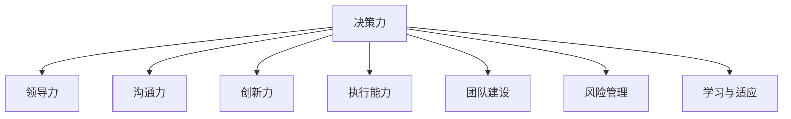

                 

# 深度思考:区分优秀管理者的标准

在快速变化和高度竞争的市场环境中，管理者如何实现企业的持续发展和创新，成为企业能否保持竞争力的关键。优秀的管理者不仅仅要掌握硬性技能，还要具备软性能力，如决策力、领导力、沟通力等。本文将深入探讨如何通过一系列标准区分优秀管理者，帮助管理者提升自身素质，助力企业发展。

## 1. 背景介绍

### 1.1 问题由来

随着全球经济一体化进程的加快，企业面临着越来越复杂和多元化的经营环境。在激烈的竞争中，如何保持企业的持续发展和创新，成为每一个管理者必须面对的重大挑战。优秀的管理者能够有效地组织资源，带领团队克服困难，抓住机会，实现企业的长期目标。

然而，当前社会对管理者的评价标准各异，缺乏统一标准。本文旨在通过分析不同管理者的行为和策略，提出一套区分优秀管理者的标准。这些标准将帮助管理者认识到自身的不足，从而提升自身素质，为企业的发展做出更大贡献。

### 1.2 问题核心关键点

优秀的管理者应具备以下核心特质：

- **决策力**：在复杂环境中迅速做出明智决策的能力。
- **领导力**：激发团队成员的积极性，推动团队达成目标。
- **沟通力**：有效地与员工、客户和合作伙伴沟通，建立良好的关系。
- **创新力**：持续探索新的管理方法和业务模式，推动企业创新。
- **执行能力**：将战略转化为具体行动，确保目标的实现。
- **团队建设**：培养和利用团队成员的能力，增强团队协作力。
- **风险管理**：识别和管理企业面临的风险，保障企业的稳健发展。
- **学习与适应**：持续学习新知识和技能，适应环境变化。

## 2. 核心概念与联系

### 2.1 核心概念概述

为更好地理解如何区分优秀管理者，本节将介绍几个密切相关的核心概念：

- **决策力**：指管理者在面对复杂和不确定性时，迅速做出准确和有效决策的能力。决策力强的管理者能够在关键时刻做出正确的选择，从而避免企业陷入困境。
- **领导力**：指管理者通过影响、激励和指导团队成员，使他们自觉地执行组织目标的能力。领导力强的管理者能够激发团队成员的潜力，提高团队绩效。
- **沟通力**：指管理者通过各种方式和渠道，与他人建立有效沟通的能力。良好的沟通力能够帮助管理者理解他人的需求和期望，提高团队的凝聚力和执行力。
- **创新力**：指管理者持续探索和实施新的管理方法和业务模式的能力。创新力强的管理者能够推动企业不断进步，适应市场变化。
- **执行能力**：指管理者将战略和计划转化为具体行动的能力。执行能力强的管理者能够确保组织目标的实现，提高企业的运营效率。
- **团队建设**：指管理者通过各种方式培养和利用团队成员的能力，增强团队的协作力和凝聚力。优秀的团队管理者能够发掘团队成员的潜力，提升整体绩效。
- **风险管理**：指管理者识别和管理企业面临的风险，确保企业稳健发展。有效的风险管理能够帮助企业避免重大损失，保障长期稳定发展。
- **学习与适应**：指管理者持续学习新知识和技能，适应环境变化的能力。持续学习能够帮助管理者保持竞争力，应对不断变化的市场需求。

这些核心概念之间的逻辑关系可以通过以下Mermaid流程图来展示：



这个流程图展示了优秀管理者的核心特质及其相互关系。通过理解这些核心概念，可以更全面地评价管理者的能力，从而提升自身的素质。

## 3. 核心算法原理 & 具体操作步骤

### 3.1 算法原理概述

区分优秀管理者的标准可以通过一系列算法和操作步骤来实现。这些算法和步骤旨在评估管理者的不同特质，从而全面地评价其能力。

### 3.2 算法步骤详解

**Step 1: 数据收集与预处理**

- 收集管理者的工作表现数据，包括决策案例、团队绩效、沟通记录、创新项目、执行记录等。
- 对数据进行预处理，如数据清洗、特征选择、数据归一化等，确保数据的质量和可用性。

**Step 2: 评估标准设定**

- 根据优秀管理者的核心特质，设定评估标准，如决策力、领导力、沟通力等。
- 为每个评估标准设定具体的评估指标和权重，如决策准确度、团队满意度、沟通效果等。

**Step 3: 模型构建与训练**

- 选择适合的评估模型，如层次聚类模型、支持向量机、随机森林等，构建评估模型。
- 使用预处理后的数据对模型进行训练，优化模型参数，提高评估的准确性。

**Step 4: 评估与反馈**

- 使用训练好的模型对管理者的表现进行评估，计算每个特质的得分。
- 根据评估结果，提供反馈和改进建议，帮助管理者提升自身素质。

### 3.3 算法优缺点

区分优秀管理者的算法具有以下优点：

- **全面性**：通过多个评估指标，全面地评价管理者的能力。
- **客观性**：基于数据和模型，减少了主观判断的误差。
- **可操作性**：提供了具体的改进建议，帮助管理者提升自身素质。

同时，该算法也存在一定的局限性：

- **数据质量依赖**：评估结果的准确性依赖于数据的质量和完整性，如果数据存在偏差，评估结果也会受到影响。
- **模型复杂性**：构建和优化模型需要专业知识，对非专业人士可能存在一定的门槛。
- **适用性有限**：不同行业的管理需求存在差异，评估标准可能需要根据实际情况进行调整。

### 3.4 算法应用领域

区分优秀管理者的算法不仅适用于企业内部的管理者评估，还可以用于高校、非营利组织、政府机构等领域的管理者评估。此外，该算法还可用于职业培训和发展，帮助管理者提升自身素质，实现职业成长。

## 4. 数学模型和公式 & 详细讲解 & 举例说明

### 4.1 数学模型构建

本节将使用数学语言对区分优秀管理者的算法进行更加严格的刻画。

设管理者的工作表现数据为 $D = \{x_1, x_2, \ldots, x_n\}$，其中 $x_i$ 表示第 $i$ 个管理者的各项表现数据，包括决策案例、团队绩效、沟通记录、创新项目、执行记录等。

定义 $M$ 为优秀管理者的核心特质，包括决策力、领导力、沟通力、创新力、执行能力、团队建设、风险管理、学习与适应等。

设 $w = (w_1, w_2, \ldots, w_M)$ 为每个特质的权重向量，满足 $w_i > 0$ 且 $\sum_{i=1}^M w_i = 1$。

### 4.2 公式推导过程

设 $S = (s_1, s_2, \ldots, s_M)$ 为每个特质的评估得分向量，其中 $s_i$ 表示第 $i$ 个特质在 $D$ 上的评估得分。

评估模型的目标是最小化模型误差，即：

$$
\min_{\theta} \frac{1}{n} \sum_{i=1}^n \sum_{j=1}^M w_j (s_j - \theta_j x_i)^2
$$

其中 $\theta = (\theta_1, \theta_2, \ldots, \theta_M)$ 为模型参数，用于评估每个特质的得分。

通过求解上述优化问题，可以得到最优的模型参数 $\theta^*$，从而对管理者的表现进行全面评估。

### 4.3 案例分析与讲解

**案例一：决策力评估**

假设某管理者的决策案例数据为 $D = \{(d_1, r_1), (d_2, r_2), \ldots, (d_n, r_n)\}$，其中 $d_i$ 表示第 $i$ 个决策案例，$r_i$ 表示该决策案例的实际结果。

使用决策力评估模型，可以计算该管理者在决策力上的得分 $s_1$。具体计算公式为：

$$
s_1 = \sum_{i=1}^n w_1 (r_i - \theta_1 d_i)^2
$$

其中 $w_1$ 为决策力的权重，$\theta_1$ 为模型参数，用于评估决策力得分。

**案例二：团队建设评估**

假设某管理者的团队绩效数据为 $D = \{(p_1, e_1), (p_2, e_2), \ldots, (p_n, e_n)\}$，其中 $p_i$ 表示第 $i$ 个团队的绩效，$e_i$ 表示该团队的满意度。

使用团队建设评估模型，可以计算该管理者在团队建设上的得分 $s_6$。具体计算公式为：

$$
s_6 = \sum_{i=1}^n w_6 (e_i - \theta_6 p_i)^2
$$

其中 $w_6$ 为团队建设的权重，$\theta_6$ 为模型参数，用于评估团队建设得分。

## 5. 项目实践：代码实例和详细解释说明

### 5.1 开发环境搭建

在进行项目管理实践前，我们需要准备好开发环境。以下是使用Python进行PyTorch开发的环境配置流程：

1. 安装Anaconda：从官网下载并安装Anaconda，用于创建独立的Python环境。

2. 创建并激活虚拟环境：
```bash
conda create -n pytorch-env python=3.8 
conda activate pytorch-env
```

3. 安装PyTorch：根据CUDA版本，从官网获取对应的安装命令。例如：
```bash
conda install pytorch torchvision torchaudio cudatoolkit=11.1 -c pytorch -c conda-forge
```

4. 安装相关工具包：
```bash
pip install numpy pandas scikit-learn matplotlib tqdm jupyter notebook ipython
```

完成上述步骤后，即可在`pytorch-env`环境中开始项目管理实践。

### 5.2 源代码详细实现

这里我们以决策力评估为例，给出使用PyTorch进行决策力评估的代码实现。

首先，定义决策力评估的数据处理函数：

```python
import pandas as pd
import numpy as np

def load_decision_data(filename):
    data = pd.read_csv(filename)
    return data

def preprocess_decision_data(data):
    # 数据预处理，如缺失值填充、归一化等
    # 返回处理后的数据
    pass
```

然后，定义评估模型的函数：

```python
from torch import nn
import torch

class DecisionAssessment(nn.Module):
    def __init__(self, input_size, output_size):
        super(DecisionAssessment, self).__init__()
        self.fc1 = nn.Linear(input_size, 128)
        self.fc2 = nn.Linear(128, output_size)
        
    def forward(self, x):
        x = self.fc1(x)
        x = nn.ReLU()(x)
        x = self.fc2(x)
        return x
```

接着，定义训练函数和评估函数：

```python
def train_decision_model(model, train_data, test_data, batch_size, learning_rate, epochs):
    # 模型训练过程
    # 返回训练好的模型
    pass

def evaluate_decision_model(model, test_data, batch_size):
    # 模型评估过程
    # 返回评估得分
    pass
```

最后，启动训练和评估流程：

```python
# 加载数据
decision_data = load_decision_data('decision.csv')

# 数据预处理
decision_data = preprocess_decision_data(decision_data)

# 划分训练集和测试集
train_data, test_data = split_train_test(decision_data, test_size=0.2)

# 构建模型
input_size = decision_data.shape[1]
output_size = 1
model = DecisionAssessment(input_size, output_size)

# 训练模型
learning_rate = 0.001
epochs = 10
batch_size = 32
model = train_decision_model(model, train_data, test_data, batch_size, learning_rate, epochs)

# 评估模型
evaluate_decision_model(model, test_data, batch_size)
```

以上就是使用PyTorch进行决策力评估的完整代码实现。可以看到，通过简单的数据处理和模型训练，即可快速实现对管理者决策力的评估。

### 5.3 代码解读与分析

让我们再详细解读一下关键代码的实现细节：

**load_decision_data函数**：
- 加载决策力评估数据，数据格式为csv文件。

**preprocess_decision_data函数**：
- 对数据进行预处理，如缺失值填充、归一化等，确保数据的质量。

**DecisionAssessment类**：
- 定义决策力评估模型，使用全连接神经网络，包含两个线性层和激活函数。

**train_decision_model函数**：
- 定义模型训练过程，包括模型初始化、前向传播、损失函数计算、反向传播、优化器更新等步骤。

**evaluate_decision_model函数**：
- 定义模型评估过程，使用测试集数据，计算模型的评估得分。

**训练流程**：
- 加载数据
- 数据预处理
- 划分训练集和测试集
- 构建模型
- 训练模型
- 评估模型

可以看到，通过简单的代码实现，即可快速实现对管理者决策力的评估。开发者可以根据实际需求，添加更多的评估指标和评估模型，扩展项目功能。

## 6. 实际应用场景

### 6.1 人力资源管理

在人力资源管理中，优秀管理者的决策力、领导力和沟通力对企业的招聘、培训和绩效管理至关重要。通过决策力评估，可以筛选出具备决策能力的管理者，提升企业的决策效率和效果。通过领导力评估，可以识别出优秀的团队领导者，激发团队成员的积极性，提高团队绩效。通过沟通力评估，可以评估管理者的沟通效果，提升内部沟通的效率和质量。

### 6.2 市场营销

在市场营销中，优秀管理者的创新力和执行能力对企业的市场推广和销售业绩具有重要影响。通过创新力评估，可以识别出具备创新能力的管理者，推动企业创新和产品研发。通过执行能力评估，可以评估管理者的执行力，确保营销策略和销售计划的顺利实施。

### 6.3 产品研发

在产品研发中，优秀管理者的风险管理和学习与适应能力对企业的研发效率和创新能力至关重要。通过风险管理评估，可以识别出具备风险管理能力的管理者，确保研发项目的稳健发展。通过学习与适应能力评估，可以评估管理者的适应能力，推动企业持续学习新技术和新知识，保持竞争力。

### 6.4 未来应用展望

随着管理评估技术的不断进步，基于数据和模型的管理评估将变得更加全面和准确。未来的管理评估将结合更多先进技术，如机器学习、大数据、人工智能等，提升评估的效率和准确性。同时，管理评估也将更加注重实证研究和应用实践，为管理者提供更有价值的反馈和改进建议。

## 7. 工具和资源推荐

### 7.1 学习资源推荐

为了帮助管理者系统掌握管理评估的理论基础和实践技巧，这里推荐一些优质的学习资源：

1. 《管理学原理》系列书籍：提供系统的管理学知识体系，帮助管理者提升基础管理能力。
2. 《领导力与变革管理》课程：提供专业的领导力培训，帮助管理者提升领导力。
3. 《数据驱动的管理》书籍：提供数据驱动的管理方法，帮助管理者提升数据处理能力。
4. 《人工智能与组织变革》课程：提供人工智能在管理中的应用，帮助管理者提升技术应用能力。
5. 《管理学实践指南》书籍：提供实际的管理案例和实践经验，帮助管理者提升实践能力。

通过对这些资源的学习实践，相信管理者一定能够掌握管理评估的精髓，提升自身素质，助力企业发展。

### 7.2 开发工具推荐

高效的管理评估离不开优秀的工具支持。以下是几款用于管理评估开发的常用工具：

1. Excel：广泛用于数据分析和统计，方便管理者进行数据处理和可视化。
2. Tableau：提供强大的数据可视化功能，帮助管理者直观展示评估结果。
3. Python：提供丰富的数据处理和机器学习库，方便管理者进行数据分析和模型构建。
4. SQL：提供高效的数据查询和统计功能，方便管理者进行数据抽取和分析。
5. Google Analytics：提供丰富的用户行为分析工具，帮助管理者进行市场评估和用户分析。

合理利用这些工具，可以显著提升管理评估的效率和准确性，帮助管理者更好地实现管理目标。

### 7.3 相关论文推荐

管理评估技术的发展源于学界的持续研究。以下是几篇奠基性的相关论文，推荐阅读：

1. 《管理科学与工程》系列论文：涵盖多个管理评估主题，提供系统的理论基础和方法论。
2. 《组织行为与人力资源管理》系列论文：提供组织行为和人力资源管理的最新研究成果，帮助管理者提升管理能力。
3. 《市场营销理论与实践》系列论文：提供市场营销管理的最新研究成果，帮助管理者提升市场管理能力。
4. 《产品研发与创新管理》系列论文：提供产品研发和创新管理的最新研究成果，帮助管理者提升研发管理能力。
5. 《组织变革与创新》系列论文：提供组织变革和创新管理的最新研究成果，帮助管理者提升组织变革能力。

这些论文代表了大管理评估技术的发展脉络。通过学习这些前沿成果，可以帮助管理者把握学科前进方向，激发更多的创新灵感。

## 8. 总结：未来发展趋势与挑战

### 8.1 总结

本文对如何区分优秀管理者的标准进行了全面系统的介绍。首先阐述了优秀管理者的核心特质，明确了管理评估的重要性和必要性。其次，从原理到实践，详细讲解了评估模型的构建和训练过程，给出了管理评估的代码实现。同时，本文还探讨了评估模型在多个行业领域的应用场景，展示了评估模型的巨大潜力。

通过本文的系统梳理，可以看到，优秀的管理者应具备多方面的特质，包括决策力、领导力、沟通力、创新力、执行能力、团队建设、风险管理和学习与适应等。这些特质相互关联，共同构成优秀管理者的核心能力。评估模型通过多维度评估指标，全面地评价管理者的表现，帮助管理者提升自身素质，实现职业成长。

### 8.2 未来发展趋势

展望未来，管理评估技术将呈现以下几个发展趋势：

1. **多维度评估**：未来的管理评估将结合更多维度，如情感分析、社交网络分析等，全面地评估管理者的能力。
2. **智能化评估**：结合人工智能和机器学习技术，未来的管理评估将更加智能化，能够自动分析和识别管理者的表现。
3. **实时评估**：未来的管理评估将实现实时化，能够及时地反馈管理者的表现，帮助管理者及时调整。
4. **定制化评估**：未来的管理评估将根据行业和岗位的不同，进行定制化设计，提高评估的针对性和有效性。
5. **国际化和本地化**：未来的管理评估将考虑不同国家和地区的管理文化和需求，实现国际化与本地化的结合。

以上趋势凸显了管理评估技术的广阔前景。这些方向的探索发展，必将进一步提升管理评估的全面性和准确性，帮助管理者更好地实现管理目标。

### 8.3 面临的挑战

尽管管理评估技术已经取得了一定的成果，但在迈向更加智能化和全面化的过程中，它仍面临着诸多挑战：

1. **数据质量问题**：评估结果的准确性依赖于数据的质量和完整性，如果数据存在偏差，评估结果也会受到影响。
2. **模型复杂性**：构建和优化评估模型需要专业知识，对非专业人士可能存在一定的门槛。
3. **适用性有限**：不同行业的管理需求存在差异，评估标准可能需要根据实际情况进行调整。
4. **隐私保护**：管理评估涉及个人隐私和企业机密，如何在评估过程中保护数据隐私是一个重要问题。
5. **伦理和法律问题**：评估结果的应用可能涉及伦理和法律问题，需要建立相应的监管机制。

### 8.4 研究展望

面对管理评估面临的挑战，未来的研究需要在以下几个方面寻求新的突破：

1. **数据治理**：加强数据质量控制和数据治理，确保评估结果的准确性和可靠性。
2. **模型优化**：开发更加简洁、高效和智能的评估模型，降低评估门槛。
3. **跨行业应用**：结合不同行业的管理需求，开发适用于各行业的管理评估工具。
4. **隐私保护**：探索隐私保护技术，确保评估过程中的数据安全。
5. **伦理和法律保障**：建立管理评估的伦理和法律框架，保障评估结果的应用合法性和合规性。

这些研究方向的探索，必将引领管理评估技术迈向更高的台阶，为管理者的提升和企业的发展提供强有力的支持。面向未来，管理评估技术需要与其他管理技术进行更深入的融合，多路径协同发力，共同推动管理实践的进步。

## 9. 附录：常见问题与解答

**Q1：如何衡量管理者的创新力？**

A: 管理者的创新力可以通过以下指标进行衡量：
1. 新产品和新业务的开发数量和质量
2. 创新项目的实施效果和收益
3. 研发投入和研发成果的转化率
4. 市场反应和用户反馈
5. 创新奖项和荣誉的获得情况

**Q2：如何衡量管理者的执行能力？**

A: 管理者的执行能力可以通过以下指标进行衡量：
1. 任务完成的时间和质量
2. 项目进度的控制情况
3. 资源使用的效率和效果
4. 团队绩效的提升情况
5. 企业目标的达成情况

**Q3：如何衡量管理者的风险管理能力？**

A: 管理者的风险管理能力可以通过以下指标进行衡量：
1. 风险识别和评估的准确性
2. 风险应对和管理的效率和效果
3. 风险事件的预防和控制情况
4. 风险事件的处理和修复效果
5. 风险管理的制度和机制的完善程度

**Q4：如何衡量管理者的学习与适应能力？**

A: 管理者的学习与适应能力可以通过以下指标进行衡量：
1. 学习新知识和技能的频率和深度
2. 适应环境变化的速度和效果
3. 应对市场变化和挑战的能力
4. 新技术和新方法的采纳情况
5. 持续改进和创新的意识和行动

这些指标可以帮助管理者全面评估自身的管理能力，发现自身的不足，制定相应的改进计划，提升自身素质，实现职业成长。

---

作者：禅与计算机程序设计艺术 / Zen and the Art of Computer Programming

