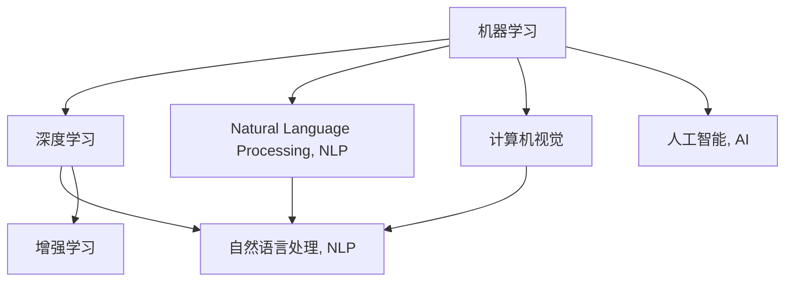

                 

# 清华大学的人工智能研究历程

清华大学的人工智能研究历程，可谓是波澜壮阔、跌宕起伏，从无到有、从弱到强。自1980年代开始，清华大学在计算机科学领域的探索与积累，到1990年代逐步形成一定规模的人工智能研究力量，再到2000年代以后，逐步成为国内外知名的人工智能研究重镇。本文将系统梳理清华大学的AI研究历程，分析其发展的关键节点和驱动力，展望未来可能的发展方向。

## 1. 背景介绍

### 1.1 历史回顾
清华大学的计算机科学与技术系成立于1952年，是中国最早成立的计算机系之一。随着信息时代的到来，计算机科学与技术的重要性日益凸显，清华计算机系于1980年代开始涉足人工智能领域的研究。

1990年代初期，清华计算机系组建了计算机视觉实验室，开展图像识别、模式识别等基础研究，取得了一定的成绩。

进入21世纪，在国家层面“973”计划、“863”计划等科研项目资助下，清华计算机系开始重视人工智能方向的研究，逐步建立起较为完整的研究队伍。

### 1.2 研究环境和条件
清华大学作为中国顶尖的高等学府，不仅在学科建设、师资力量等方面具有优势，还拥有国际先进的计算资源，为人工智能研究提供了坚实的硬件基础。

- 人才团队：清华大学计算机系汇聚了众多在国际上具有影响力的AI学者，涵盖机器学习、计算机视觉、自然语言处理等多个方向。
- 计算资源：清华大学有强大的高性能计算中心，为大数据、深度学习等人工智能研究提供了充足的计算支持。
- 跨学科优势：清华大学作为综合性大学，能够整合计算机、自动化、电子等多个学科的研究力量，促进跨学科合作。

## 2. 核心概念与联系

### 2.1 核心概念概述

人工智能作为当前最前沿的技术领域之一，其核心概念包括：

- 机器学习（Machine Learning）：使计算机从数据中学习，进行预测和决策。
- 深度学习（Deep Learning）：基于神经网络结构，构建多层神经网络进行学习。
- 自然语言处理（Natural Language Processing, NLP）：使计算机理解和处理人类语言。
- 计算机视觉（Computer Vision）：使计算机能够识别和理解图像和视频。
- 增强学习（Reinforcement Learning）：通过与环境的交互，使智能体学习最优策略。

这些核心概念之间有着紧密的联系：

- **深度学习与机器学习**：深度学习是机器学习的一种高级形式，通过多层神经网络来提取和学习复杂特征。
- **自然语言处理与机器学习**：NLP主要依赖于机器学习算法，如分类、序列标注、语言模型等。
- **计算机视觉与深度学习**：计算机视觉通常采用深度学习方法，如卷积神经网络（CNN）来处理图像和视频数据。
- **增强学习与机器学习**：增强学习也是机器学习的一种形式，特别强调智能体与环境之间的交互学习。

### 2.2 核心概念原理和架构的 Mermaid 流程图



## 3. 核心算法原理 & 具体操作步骤

### 3.1 算法原理概述

人工智能研究的核心算法包括：

- **深度学习算法**：如卷积神经网络（CNN）、循环神经网络（RNN）、长短时记忆网络（LSTM）、变换器（Transformer）等。
- **自然语言处理算法**：如词嵌入、序列标注、语言模型等。
- **计算机视觉算法**：如特征提取、图像分类、目标检测、语义分割等。
- **增强学习算法**：如Q-learning、策略梯度、Deep Q-learning等。

### 3.2 算法步骤详解

以深度学习在计算机视觉中的应用为例，其核心步骤包括：

1. **数据准备**：收集和标注大量的图像数据。
2. **模型设计**：设计合适的神经网络架构，如卷积神经网络（CNN）。
3. **模型训练**：使用标注数据对模型进行训练，优化参数。
4. **模型评估**：使用测试数据集评估模型性能，调整参数。
5. **模型应用**：将训练好的模型应用于实际场景，进行图像分类、目标检测等任务。

### 3.3 算法优缺点

深度学习算法具有以下优点：

- **自动特征学习**：通过多层神经网络自动学习特征，减少了手动特征工程的复杂性。
- **高精度**：在许多任务中，深度学习模型能取得比传统算法更高的精度。
- **可扩展性**：深度学习模型可以很容易地进行扩展和改进。

但深度学习算法也存在以下缺点：

- **数据需求大**：需要大量的标注数据才能有效训练模型。
- **计算资源要求高**：训练深度模型需要强大的计算资源。
- **黑盒问题**：深度模型通常被认为是黑盒模型，缺乏可解释性。

### 3.4 算法应用领域

深度学习算法在多个领域都有广泛应用：

- **计算机视觉**：如图像分类、目标检测、图像分割、人脸识别等。
- **自然语言处理**：如文本分类、命名实体识别、机器翻译、情感分析等。
- **语音识别**：如语音合成、自动语音识别等。
- **推荐系统**：如协同过滤、深度学习推荐等。

## 4. 数学模型和公式 & 详细讲解 & 举例说明

### 4.1 数学模型构建

以卷积神经网络（CNN）为例，其核心数学模型包括：

- **卷积层（Convolutional Layer）**：通过对输入数据进行卷积操作，提取局部特征。
- **池化层（Pooling Layer）**：通过降采样操作，减小特征图尺寸，减少计算量。
- **全连接层（Fully Connected Layer）**：将池化后的特征映射到类别空间，进行分类。

### 4.2 公式推导过程

以CNN的卷积操作为例，其数学公式如下：

$$
f(x)=\sum_{i=1}^{n} \sum_{j=1}^{n} W_{i,j}x_{i,j}+b
$$

其中 $W$ 为卷积核，$x$ 为输入数据，$b$ 为偏置项。

### 4.3 案例分析与讲解

以图像分类为例，CNN的训练过程如下：

1. **数据预处理**：将图像归一化、标准化，生成训练数据集。
2. **模型设计**：设计卷积层、池化层、全连接层等结构，初始化参数。
3. **前向传播**：将训练数据输入模型，计算输出结果。
4. **损失函数计算**：计算模型输出与真实标签之间的差异，如交叉熵损失。
5. **反向传播**：根据损失函数计算梯度，更新模型参数。
6. **模型评估**：在测试集上评估模型性能，调整参数。

## 5. 项目实践：代码实例和详细解释说明

### 5.1 开发环境搭建

清华大学的人工智能研究开发环境主要包括以下几个部分：

1. **Python环境**：安装Python及其相关的科学计算库，如NumPy、SciPy等。
2. **深度学习框架**：安装TensorFlow、PyTorch等深度学习框架。
3. **高性能计算资源**：使用清华大学计算中心的高性能计算资源，如GPU、TPU等。

### 5.2 源代码详细实现

以下是一个简单的图像分类CNN模型实现示例：

```python
import torch
import torch.nn as nn
import torch.optim as optim
import torchvision.transforms as transforms
from torchvision.datasets import CIFAR10

# 定义卷积神经网络模型
class CNN(nn.Module):
    def __init__(self):
        super(CNN, self).__init__()
        self.conv1 = nn.Conv2d(3, 32, 3, 1)
        self.pool = nn.MaxPool2d(2, 2)
        self.conv2 = nn.Conv2d(32, 64, 3, 1)
        self.fc1 = nn.Linear(64 * 8 * 8, 128)
        self.fc2 = nn.Linear(128, 10)

    def forward(self, x):
        x = self.pool(F.relu(self.conv1(x)))
        x = self.pool(F.relu(self.conv2(x)))
        x = x.view(-1, 64 * 8 * 8)
        x = F.relu(self.fc1(x))
        x = self.fc2(x)
        return x

# 定义训练函数
def train(model, train_loader, criterion, optimizer, epochs):
    for epoch in range(epochs):
        running_loss = 0.0
        for i, data in enumerate(train_loader, 0):
            inputs, labels = data
            optimizer.zero_grad()
            outputs = model(inputs)
            loss = criterion(outputs, labels)
            loss.backward()
            optimizer.step()
            running_loss += loss.item()
            if i % 100 == 99:
                print(f"Epoch {epoch+1}, loss: {running_loss/100:.3f}")
                running_loss = 0.0
```

### 5.3 代码解读与分析

上述代码实现了CNN模型的基本结构，包括卷积层、池化层和全连接层。在训练函数中，使用CIFAR-10数据集进行训练，并使用交叉熵损失函数和Adam优化器进行参数优化。

## 6. 实际应用场景

清华大学的人工智能研究已经广泛应用于多个实际场景：

### 6.1 智能医疗

清华大学的计算机系与医学系合作，开展了基于深度学习的医学影像分析项目。利用卷积神经网络对X光片、CT片进行自动分析，辅助医生诊断疾病。

### 6.2 智能交通

通过计算机视觉技术，清华大学开展了智能交通监控项目。利用深度学习算法对交通视频进行分析，实时监测交通情况，优化交通流量。

### 6.3 智能制造

在工业自动化领域，清华大学开展了基于深度学习的机器人视觉感知项目。利用深度学习算法对机器人视觉数据进行分析，实现工业场景下的精准定位和抓取。

### 6.4 未来应用展望

未来，清华大学的人工智能研究将继续在以下几个方面发展：

1. **多模态学习**：探索语音、图像、文本等多模态数据的融合，提升智能系统的感知能力。
2. **知识图谱**：构建知识图谱，辅助深度学习模型进行知识推理。
3. **自监督学习**：利用自监督学习方法，解决数据标注成本高的问题。
4. **联邦学习**：探索在分布式环境下的智能系统协同学习。
5. **鲁棒性提升**：提高深度学习模型的鲁棒性，增强其面对异常数据和干扰的适应能力。

## 7. 工具和资源推荐

### 7.1 学习资源推荐

- **机器学习**：《机器学习》by Tom Mitchell
- **深度学习**：《深度学习》by Ian Goodfellow
- **自然语言处理**：《自然语言处理综论》by Daniel Jurafsky 和 James H. Martin
- **计算机视觉**：《计算机视觉：算法与应用》by Richard Szeliski

### 7.2 开发工具推荐

- **Python**：Python是目前最流行的编程语言之一，拥有丰富的科学计算库。
- **TensorFlow**：由Google开发的深度学习框架，功能强大、易于使用。
- **PyTorch**：由Facebook开发的深度学习框架，易于调试和优化。

### 7.3 相关论文推荐

- **AlexNet**：ImageNet Large Scale Visual Recognition Challenge（ILSVRC）2012年冠军模型。
- **VGG**：Very Deep Convolutional Networks for Large-Scale Image Recognition，提出19层卷积神经网络。
- **ResNet**：Deep Residual Learning for Image Recognition，提出残差网络，解决了深层网络训练中的梯度消失问题。
- **Transformer**：Attention Is All You Need，提出Transformer结构，改变了深度学习模型的计算方式。

## 8. 总结：未来发展趋势与挑战

### 8.1 研究成果总结

清华大学的人工智能研究已经取得了显著成果，特别是在深度学习、计算机视觉、自然语言处理等领域。研究成果不仅提升了科研水平，还推动了相关技术的产业化应用。

### 8.2 未来发展趋势

1. **智能化升级**：未来的人工智能研究将更加注重智能化升级，即在现有技术基础上，进一步提升系统的感知能力、推理能力和自主决策能力。
2. **跨学科融合**：人工智能研究将与其他学科，如医学、交通、制造等进行更深层次的融合，推动跨学科创新。
3. **人机协作**：未来的人工智能系统将更加注重人机协作，通过智能机器辅助人类完成复杂的任务。

### 8.3 面临的挑战

1. **数据隐私和安全**：随着人工智能技术的广泛应用，数据隐私和安全问题变得尤为重要。
2. **伦理和法律**：人工智能技术的发展需要相应的伦理和法律框架，保障其健康有序发展。
3. **可解释性**：深度学习模型通常被认为是黑盒模型，缺乏可解释性，需要进一步研究其内部机制。

### 8.4 研究展望

1. **多模态学习**：探索多模态数据的融合，提升系统的感知能力和泛化能力。
2. **自监督学习**：利用自监督学习方法，解决数据标注成本高的问题。
3. **鲁棒性提升**：提高深度学习模型的鲁棒性，增强其面对异常数据和干扰的适应能力。
4. **人机协作**：探索人机协作的新机制，提升系统的交互性和用户体验。

## 9. 附录：常见问题与解答

**Q1：清华大学的人工智能研究与其他大学相比有何优势？**

A: 清华大学的优势主要体现在以下几个方面：

1. **师资力量**：清华汇集了众多在国际上具有影响力的AI学者，涵盖多个研究方向。
2. **计算资源**：清华有强大的高性能计算中心，为AI研究提供了充足的计算支持。
3. **跨学科合作**：清华作为综合性大学，能够整合计算机、自动化、电子等多个学科的研究力量，促进跨学科合作。

**Q2：清华大学的人工智能研究有哪些成功的应用案例？**

A: 清华的人工智能研究已经应用于多个实际场景，包括：

1. **智能医疗**：利用深度学习技术对医学影像进行分析，辅助医生诊断疾病。
2. **智能交通**：利用计算机视觉技术对交通视频进行分析，实时监测交通情况。
3. **智能制造**：利用深度学习技术实现机器人视觉感知和精准定位。

**Q3：未来清华大学的人工智能研究可能有哪些突破？**

A: 未来清华的人工智能研究可能有几个重要的突破：

1. **多模态学习**：探索语音、图像、文本等多模态数据的融合，提升智能系统的感知能力。
2. **知识图谱**：构建知识图谱，辅助深度学习模型进行知识推理。
3. **自监督学习**：利用自监督学习方法，解决数据标注成本高的问题。
4. **联邦学习**：探索在分布式环境下的智能系统协同学习。

**Q4：清华大学的人工智能研究面临哪些挑战？**

A: 清华的人工智能研究面临以下几个挑战：

1. **数据隐私和安全**：人工智能技术的广泛应用需要相应的数据隐私和安全保障措施。
2. **伦理和法律**：人工智能技术的发展需要相应的伦理和法律框架，保障其健康有序发展。
3. **可解释性**：深度学习模型通常被认为是黑盒模型，缺乏可解释性，需要进一步研究其内部机制。

**Q5：清华大学的人工智能研究有哪些合作机构？**

A: 清华的人工智能研究已经与国内外众多机构展开合作，包括：

1. **国内**：与华为、百度、小米等企业合作，推动AI技术在工业界的产业化应用。
2. **国际**：与斯坦福大学、麻省理工学院等国际知名学府进行合作，共同开展前沿AI研究。

作者：禅与计算机程序设计艺术 / Zen and the Art of Computer Programming

