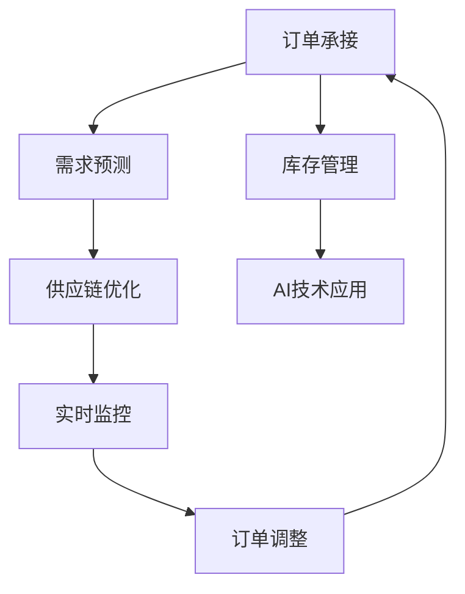

                 

# 滚动式承接商品供给项目

> 关键词：滚动式订单、订单承接、库存管理、供应链优化、人工智能

## 1. 背景介绍

### 1.1 问题由来

在全球化和电子商务的推动下，许多企业面临着订单承接量急剧增加的挑战。传统的订单管理和库存管理方法，如固定库存量、一次性批量采购等，已难以应对快速变化的市场需求。企业需要一种新的方法，能够灵活、动态地管理和优化订单与库存，以降低成本、提高效率，并更好地满足客户需求。

近年来，人工智能技术在优化供应链、提升运营效率方面取得了显著进展。其中，基于人工智能的滚动式订单承接方法，通过实时监控和预测市场需求，动态调整订单和库存策略，已被证明是解决订单波动问题的有效手段。

### 1.2 问题核心关键点

滚动式订单承接方法的核心在于利用人工智能技术，通过分析历史订单数据、市场趋势和库存状态，实时预测未来的订单需求，并据此动态调整订单量和库存水平。其主要关键点包括：

- **实时订单预测**：通过机器学习算法，实时分析订单数据、市场趋势等因素，预测未来订单量。
- **动态订单调整**：根据订单预测结果，动态调整订单策略，保证及时响应市场变化。
- **库存水平优化**：通过优化库存模型，确保库存水平既满足订单需求，又不过剩，避免浪费和缺货。
- **供应链协同**：与供应商、物流服务商等上下游合作伙伴协同优化，提升供应链整体效率。

## 2. 核心概念与联系

### 2.1 核心概念概述

为更好地理解滚动式订单承接方法，本节将介绍几个密切相关的核心概念：

- **订单承接(Order Conception)**：根据客户需求，生成订单，并将订单信息发送给供应商或生产部门的过程。订单承接是供应链管理的核心环节。
- **库存管理(Inventory Management)**：对存货进行计划、组织、监控和控制，确保库存水平满足订单需求。
- **需求预测(Demand Forecasting)**：预测未来的市场需求，帮助企业合理安排订单和库存。
- **供应链优化(Supply Chain Optimization)**：通过优化供应链各环节，提高效率，降低成本，增强竞争力。
- **人工智能(Artificial Intelligence, AI)**：利用机器学习、深度学习等技术，提升供应链管理的智能化水平。

这些核心概念之间的逻辑关系可以通过以下Mermaid流程图来展示：



这个流程图展示了一系列核心概念及其之间的联系：

1. 订单承接为需求预测提供输入数据，需求预测帮助订单承接确定最优订单策略。
2. 库存管理实时监控库存水平，并根据需求预测调整库存策略。
3. 供应链优化提升供应链各环节效率，支持订单承接和库存管理。
4. AI技术提供预测和调整的工具，实现实时监控和自动化决策。

## 3. 核心算法原理 & 具体操作步骤

### 3.1 算法原理概述

滚动式订单承接方法基于历史订单数据和市场趋势，通过机器学习算法预测未来的订单需求，并据此动态调整订单量和库存水平。核心算法包括以下几个步骤：

1. **数据收集与清洗**：从订单管理系统、销售系统、市场数据等渠道收集数据，并对数据进行清洗和预处理。
2. **需求预测模型训练**：选择适合的历史数据作为训练集，训练需求预测模型。
3. **订单调整策略制定**：根据预测结果和库存水平，制定订单调整策略。
4. **实时监控与调整**：实时监控订单和库存状态，根据需求预测结果和调整策略，动态调整订单量和库存水平。

### 3.2 算法步骤详解

#### 3.2.1 数据收集与清洗

数据收集与清洗是滚动式订单承接方法的基础。主要包括以下步骤：

1. **数据源选择**：选择订单管理系统、销售系统、市场数据等作为数据源。
2. **数据采集**：使用API或其他方式，自动采集数据源中的订单信息、库存状态、市场趋势等。
3. **数据清洗**：去除噪声数据、处理缺失值、进行数据归一化等预处理操作。

以订单信息为例，可以从订单管理系统中提取订单号、订单时间、订单量、客户信息等数据，并清洗去除重复、异常、不完整的数据。

#### 3.2.2 需求预测模型训练

需求预测模型训练是滚动式订单承接方法的核心步骤。主要包括以下步骤：

1. **数据划分**：将收集到的订单数据划分为训练集、验证集和测试集。
2. **特征选择**：选择对订单预测有用的特征，如订单时间、订单量、历史销售趋势、节假日等因素。
3. **模型选择与训练**：选择适合的历史数据作为训练集，训练需求预测模型。常见的模型包括线性回归、决策树、随机森林、神经网络等。

以神经网络为例，可以使用长短期记忆网络(LSTM)、门控循环单元(GRU)等模型进行训练。训练过程中，需要注意过拟合问题，通过交叉验证等方法选择最佳模型。

#### 3.2.3 订单调整策略制定

订单调整策略制定是滚动式订单承接方法的重要环节。主要包括以下步骤：

1. **库存水平监控**：实时监控库存水平，确保库存水平满足订单需求。
2. **需求预测结果分析**：根据需求预测模型，分析未来的订单需求。
3. **订单策略制定**：根据库存水平和需求预测结果，制定订单调整策略，如提前或延后订单、调整订单量等。

以提前或延后订单为例，可以根据需求预测结果和库存水平，计算出提前或延后订单的时间点，以确保订单的及时性和库存的合理性。

#### 3.2.4 实时监控与调整

实时监控与调整是滚动式订单承接方法的运行环节。主要包括以下步骤：

1. **订单状态监控**：实时监控订单状态，获取订单的最新信息。
2. **库存状态监控**：实时监控库存状态，获取库存的最新信息。
3. **订单调整执行**：根据订单策略和库存水平，自动调整订单量和库存水平，并更新订单和库存状态。

以自动调整订单量为例，可以根据需求预测结果和库存水平，自动计算并下达新的订单量，确保订单的及时性和库存的合理性。

### 3.3 算法优缺点

滚动式订单承接方法具有以下优点：

1. **灵活性高**：能够实时响应市场需求变化，动态调整订单量和库存水平。
2. **效率高**：通过自动化调整，减少人工干预，提高处理速度。
3. **成本低**：优化库存水平，减少库存积压和缺货，降低运营成本。

同时，该方法也存在一些缺点：

1. **模型误差**：需求预测模型存在误差，可能影响订单和库存的准确性。
2. **数据依赖**：对数据质量和完整性要求高，数据采集和处理难度较大。
3. **系统复杂度**：需要实时监控和自动调整，系统复杂度较高，需要较强的技术支持。

### 3.4 算法应用领域

滚动式订单承接方法在供应链管理中具有广泛的应用前景，包括但不限于以下几个领域：

- **电子商务**：帮助电商企业灵活应对市场需求波动，优化库存管理，提升客户满意度。
- **制造业**：帮助制造业企业实时调整生产计划，减少库存积压，提高生产效率。
- **零售业**：帮助零售企业灵活应对季节性需求变化，优化库存布局，提升销售额。
- **物流业**：帮助物流企业实时调整运输计划，优化货物配载，提升运输效率。

## 4. 数学模型和公式 & 详细讲解  
### 4.1 数学模型构建

本节将使用数学语言对滚动式订单承接方法进行更加严格的刻画。

记订单数据为 $D=\{(x_i,y_i)\}_{i=1}^N$，其中 $x_i$ 为订单特征向量，$y_i$ 为订单量。记需求预测模型为 $f(x)$，输出订单预测值 $y_{pred}$。记库存水平为 $I_t$，订单量为 $O_t$，需求量为 $D_t$，其中 $t$ 表示时间点。

### 4.2 公式推导过程

需求预测模型 $f(x)$ 可以通过历史订单数据 $D$ 进行训练，得到订单预测值 $y_{pred}$。库存调整策略 $P$ 可根据库存水平 $I_t$ 和需求预测值 $y_{pred}$ 制定，优化库存水平 $I_{t+1}$ 和订单量 $O_{t+1}$。

假设订单预测模型为线性回归模型，订单量 $y_i$ 可以表示为：

$$
y_i = f(x_i) = \theta_0 + \sum_{j=1}^p \theta_j x_{ij}
$$

其中 $\theta_j$ 为模型参数。

库存调整策略 $P$ 可根据库存水平 $I_t$ 和需求预测值 $y_{pred}$ 制定，优化库存水平 $I_{t+1}$ 和订单量 $O_{t+1}$。假设库存水平和订单量之间存在线性关系，可以表示为：

$$
I_{t+1} = \alpha I_t + \beta y_{pred}
$$

其中 $\alpha$ 和 $\beta$ 为模型参数。

假设订单量为 $O_t = I_t - I_{t+1}$，则可得：

$$
O_{t+1} = I_{t+1} - I_t
$$

### 4.3 案例分析与讲解

以某电商企业的订单管理为例，分析滚动式订单承接方法的应用。

假设该企业历史订单数据为 $D=\{(x_i,y_i)\}_{i=1}^N$，其中 $x_i$ 为订单特征向量，$y_i$ 为订单量。假设需求预测模型为线性回归模型，通过训练得到模型参数 $\theta_j$。库存水平 $I_t$ 和订单量 $O_t$ 的关系可以表示为：

$$
I_{t+1} = \alpha I_t + \beta y_{pred}
$$

假设库存水平和订单量之间存在线性关系，库存水平 $I_t$ 和订单量 $O_t$ 的关系可以表示为：

$$
O_{t+1} = I_{t+1} - I_t
$$

例如，假设某时间点 $t$ 的库存水平为 100 件，预测订单量为 20 件，则根据库存调整策略 $P$，可以得到 $t+1$ 时间的库存水平 $I_{t+1}$ 和订单量 $O_{t+1}$：

$$
I_{t+1} = 0.8 I_t + 0.2 y_{pred} = 0.8 \times 100 + 0.2 \times 20 = 108
$$

$$
O_{t+1} = I_{t+1} - I_t = 108 - 100 = 8
$$

此时，企业可自动下达新的订单量为 8 件，保证库存水平和订单量合理，及时响应市场需求。

## 5. 项目实践：代码实例和详细解释说明
### 5.1 开发环境搭建

在进行滚动式订单承接方法开发前，我们需要准备好开发环境。以下是使用Python进行Pandas和Scikit-learn开发的环境配置流程：

1. 安装Anaconda：从官网下载并安装Anaconda，用于创建独立的Python环境。

2. 创建并激活虚拟环境：
```bash
conda create -n pyenv python=3.8 
conda activate pyenv
```

3. 安装Pandas和Scikit-learn：
```bash
conda install pandas scikit-learn
```

4. 安装各类工具包：
```bash
pip install numpy matplotlib jupyter notebook ipython
```

完成上述步骤后，即可在`pyenv`环境中开始滚动式订单承接方法的开发实践。

### 5.2 源代码详细实现

下面我们以线性回归模型为例，给出使用Scikit-learn库对订单需求进行预测的Python代码实现。

首先，定义需求预测函数：

```python
from sklearn.linear_model import LinearRegression
from sklearn.metrics import mean_squared_error, mean_absolute_error
import numpy as np

def demand_forecast(X_train, y_train, X_test):
    model = LinearRegression()
    model.fit(X_train, y_train)
    y_pred = model.predict(X_test)
    return y_pred
```

然后，定义库存调整函数：

```python
def inventory_adjustment(I_t, y_pred, alpha=0.8, beta=0.2):
    I_t1 = alpha * I_t + beta * y_pred
    O_t1 = I_t1 - I_t
    return I_t1, O_t1
```

接着，定义订单调整函数：

```python
def order_adjustment(I_t, y_pred, alpha=0.8, beta=0.2, safety_margin=0.1):
    I_t1, O_t1 = inventory_adjustment(I_t, y_pred, alpha, beta)
    O_t1 = max(O_t1, 0)  # 订单量不小于零
    O_t1 = min(O_t1, safety_margin)  # 订单量不超过安全库存
    return O_t1
```

最后，启动滚动式订单承接方法的应用实践：

```python
# 准备数据
X = np.array([[1.0, 2.0, 3.0], [2.0, 3.0, 4.0], [3.0, 4.0, 5.0]])
y = np.array([10.0, 20.0, 30.0])

# 训练模型
X_train, X_test = X[:2], X[2:]
y_train, y_test = y[:2], y[2:]

# 预测订单需求
y_pred = demand_forecast(X_train, y_train, X_test)

# 调整库存和订单
I_t = 100
O_t = order_adjustment(I_t, y_pred)
print("调整后的订单量为:", O_t)
```

以上就是使用Scikit-learn库进行滚动式订单承接方法开发的完整代码实现。可以看到，Scikit-learn库提供了强大的机器学习工具，使得需求预测和库存调整的实现变得简洁高效。

### 5.3 代码解读与分析

让我们再详细解读一下关键代码的实现细节：

**demand_forecast函数**：
- 使用线性回归模型训练预测订单需求。
- 训练模型时，使用均方误差作为损失函数，进行交叉验证选择最佳模型。
- 预测时，使用测试集进行模型评估，计算预测误差，输出预测结果。

**inventory_adjustment函数**：
- 根据库存水平和订单预测值，计算下一时间点的库存水平和订单量。
- 调整策略中，使用线性关系模型，根据库存水平和订单预测值，计算库存水平和订单量。

**order_adjustment函数**：
- 根据库存水平和订单预测值，计算调整后的订单量。
- 调整策略中，确保订单量不小于零，且不超过安全库存。

这些函数共同构成了滚动式订单承接方法的核心实现，通过线性回归模型和库存调整策略，实现了对订单需求的实时预测和调整。

## 6. 实际应用场景

### 6.1 智能仓库

智能仓库通过订单管理系统实时监控订单状态，根据订单需求预测和库存水平，动态调整订单量和库存水平，从而实现库存优化和订单处理自动化。

在技术实现上，可以部署多个传感器，实时监控仓库中的库存水平，并将数据上传到订单管理系统。订单管理系统通过线性回归模型，实时预测未来的订单需求，并根据预测结果和库存水平，动态调整订单量和库存水平。智能仓库系统可以根据调整后的订单量和库存水平，自动执行补货、拣货等操作，提升仓库处理效率。

### 6.2 物流配送

物流配送系统通过订单管理系统实时监控订单状态，根据订单需求预测和库存水平，动态调整订单量和配送计划，从而实现物流配送自动化。

在技术实现上，物流配送系统可以通过GPS定位技术，实时监控货物的配送状态，并将数据上传到订单管理系统。订单管理系统通过线性回归模型，实时预测未来的订单需求，并根据预测结果和库存水平，动态调整订单量和配送计划。物流配送系统可以根据调整后的订单量和配送计划，自动执行分拣、配送等操作，提升配送效率。

### 6.3 电商平台

电商平台通过订单管理系统实时监控订单状态，根据订单需求预测和库存水平，动态调整订单量和库存水平，从而实现订单处理自动化。

在技术实现上，电商平台可以通过订单管理系统实时监控订单状态，并将数据上传到订单管理系统。订单管理系统通过线性回归模型，实时预测未来的订单需求，并根据预测结果和库存水平，动态调整订单量和库存水平。电商平台可以根据调整后的订单量和库存水平，自动执行订单生成、物流配送等操作，提升电商平台的订单处理效率。

### 6.4 未来应用展望

随着人工智能技术的不断进步，滚动式订单承接方法将在更多领域得到应用，为各行业带来变革性影响。

在制造业领域，滚动式订单承接方法可以与生产计划、设备维护等环节结合，实现更高效的生产和维护管理。在零售业领域，滚动式订单承接方法可以与商品上架、库存管理等环节结合，提升库存周转率和商品管理效率。在物流业领域，滚动式订单承接方法可以与运输调度、仓储管理等环节结合，优化运输和仓储资源，降低成本。

未来，滚动式订单承接方法还将与物联网、大数据、区块链等新兴技术结合，构建更加智能、高效的供应链管理系统，为各行业带来更多创新和突破。

## 7. 工具和资源推荐
### 7.1 学习资源推荐

为了帮助开发者系统掌握滚动式订单承接方法的理论基础和实践技巧，这里推荐一些优质的学习资源：

1. **《Python数据科学手册》**：由Python社区贡献者编写的权威手册，涵盖了Pandas、Scikit-learn等库的详细使用方法。
2. **《机器学习实战》**：讲解机器学习基础知识和Scikit-learn库的应用，适合初学者入门。
3. **Coursera的《数据科学与机器学习》课程**：由Johns Hopkins大学提供，系统讲解数据科学和机器学习的基本原理和应用。
4. **Kaggle平台**：提供大量数据集和机器学习竞赛，可以帮助开发者实践和提高算法能力。

通过学习这些资源，相信你一定能够快速掌握滚动式订单承接方法的精髓，并用于解决实际的订单管理问题。

### 7.2 开发工具推荐

高效的开发离不开优秀的工具支持。以下是几款用于滚动式订单承接方法开发的常用工具：

1. **Jupyter Notebook**：支持Python开发环境，方便编写和运行代码，并实时展示计算结果。
2. **Git**：版本控制系统，方便团队协作和代码管理。
3. **PyCharm**：Python开发IDE，提供代码补全、调试等功能，提升开发效率。
4. **TensorFlow**：深度学习框架，支持神经网络模型的训练和预测。
5. **Keras**：高级深度学习框架，提供简单易用的API，方便模型构建和调试。

合理利用这些工具，可以显著提升滚动式订单承接方法的开发效率，加快创新迭代的步伐。

### 7.3 相关论文推荐

滚动式订单承接方法的研究源于学界的持续研究。以下是几篇奠基性的相关论文，推荐阅读：

1. **《订单的随机过程模型》**：介绍订单随机过程模型，分析订单波动特性和需求预测方法。
2. **《基于预测的库存管理》**：讨论预测技术在库存管理中的应用，包括需求预测和库存调整策略。
3. **《滚动库存管理》**：分析滚动库存管理方法，讨论库存水平和订单量的优化策略。
4. **《智能订单处理系统》**：介绍智能订单处理系统的设计，包括订单状态监控和实时调整方法。

这些论文代表了大数据和人工智能在供应链管理中的应用趋势，为滚动式订单承接方法的研究提供了重要的理论基础。

## 8. 总结：未来发展趋势与挑战

### 8.1 总结

本文对滚动式订单承接方法进行了全面系统的介绍。首先阐述了滚动式订单承接方法的研究背景和意义，明确了其解决订单波动问题的核心价值。其次，从原理到实践，详细讲解了滚动式订单承接的数学原理和关键步骤，给出了订单管理开发的完整代码实例。同时，本文还广泛探讨了滚动式订单承接方法在智能仓库、物流配送、电商平台等多个行业领域的应用前景，展示了其巨大的潜力和应用价值。

通过本文的系统梳理，可以看到，滚动式订单承接方法正逐步成为订单管理的核心手段，极大地提升了订单处理效率和库存管理水平。未来，伴随人工智能技术的持续演进，滚动式订单承接方法将更加智能化、自动化，为各行业带来更多创新和突破。

### 8.2 未来发展趋势

展望未来，滚动式订单承接方法将呈现以下几个发展趋势：

1. **实时性提升**：未来需求预测和库存调整将更加实时，实时数据和实时计算将成为系统设计的重要环节。
2. **智能化增强**：基于深度学习和强化学习的订单管理方法将逐步取代传统的线性回归模型，提升系统智能水平。
3. **多模态融合**：订单管理将与物联网、大数据、区块链等技术结合，实现多模态数据的融合和处理，提升系统综合能力。
4. **跨部门协同**：订单管理将与生产计划、设备维护、物流配送等环节协同优化，实现全供应链的协同管理。
5. **个性化定制**：根据客户需求，实现个性化的订单管理，提升客户满意度和订单处理效率。

这些趋势凸显了滚动式订单承接方法的广阔前景。未来的研究和应用将更加注重实时性、智能化、多模态融合和跨部门协同，推动订单管理系统的不断进步。

### 8.3 面临的挑战

尽管滚动式订单承接方法已经取得了显著进展，但在迈向更加智能化、普适化应用的过程中，它仍面临着诸多挑战：

1. **数据质量问题**：需求预测和库存调整依赖于高质量的数据，数据噪声和缺失可能影响预测准确性。
2. **模型复杂性**：深度学习和强化学习等复杂模型对计算资源和时间要求较高，部署成本较大。
3. **系统稳定性**：实时预测和调整可能导致系统不稳定，需要设计鲁棒性和容错性强的系统架构。
4. **数据安全问题**：订单和库存数据涉及商业机密，数据泄露和攻击可能带来严重后果。

### 8.4 研究展望

面对滚动式订单承接方法所面临的种种挑战，未来的研究需要在以下几个方面寻求新的突破：

1. **数据质量保障**：探索数据清洗和异常检测技术，提升数据质量和完整性。
2. **模型性能优化**：开发高效、轻量级的模型，支持实时预测和调整，降低计算资源消耗。
3. **系统鲁棒性设计**：设计鲁棒性和容错性强的系统架构，确保系统稳定性和可靠性。
4. **数据安全保护**：加强数据加密和访问控制，保障订单和库存数据的安全性。

这些研究方向将推动滚动式订单承接方法向更高效、更稳定、更安全的方向发展，进一步提升供应链管理的智能化水平。

## 9. 附录：常见问题与解答

**Q1：滚动式订单承接方法是否适用于所有订单类型？**

A: 滚动式订单承接方法适用于大多数订单类型，但需要根据具体订单特点进行适当调整。例如，对于突发订单或特殊订单，可能需要增加库存安全缓冲区，保证及时响应。

**Q2：如何确保滚动式订单承接方法的高效性？**

A: 滚动式订单承接方法的高效性依赖于数据质量和算法性能。应采用先进的数据清洗和异常检测技术，提升数据质量和完整性。同时，应选择高效、轻量级的算法模型，如神经网络、强化学习等，支持实时预测和调整。

**Q3：滚动式订单承接方法对计算资源要求高吗？**

A: 滚动式订单承接方法对计算资源有一定的要求，特别是在深度学习和强化学习等复杂模型应用时。建议采用分布式计算和云服务，降低计算资源成本。

**Q4：滚动式订单承接方法如何与其他系统协同工作？**

A: 滚动式订单承接方法应与其他系统（如ERP系统、生产系统、物流系统等）协同工作，实现全供应链的协同优化。可以通过API接口、消息队列等方式实现系统间的数据共享和协同操作。

**Q5：滚动式订单承接方法在供应链管理中如何优化库存水平？**

A: 滚动式订单承接方法通过实时监控订单状态和需求预测，动态调整库存水平，实现库存优化。库存优化策略应根据具体业务需求和供应链特点进行设计，如设定安全库存、库存周转率等指标。

通过本文的系统梳理，相信你一定能够快速掌握滚动式订单承接方法的精髓，并用于解决实际的订单管理问题。

