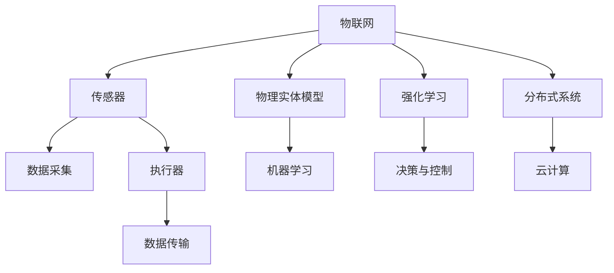

                 

# 物理实体自动化的技术发展

## 1. 背景介绍

### 1.1 问题由来
随着物联网(IoT)和智能制造的迅速发展，越来越多的物理实体被连接到互联网中，使得物理世界与数字世界之间的交互日益频繁。这些物理实体，如传感器、执行器、机器人、智能家居设备等，通过网络传递着大量实时数据。如何高效、自动地处理这些数据，实现物理实体的自动化和智能化，已成为业界关注的焦点。

### 1.2 问题核心关键点
物理实体的自动化和智能化是一个复杂的问题，涉及多方面的技术挑战：
- **数据采集与处理**：需要实时、可靠地采集物理实体的数据，并进行预处理和清洗。
- **模型建立与训练**：建立合适的物理实体模型，并使用机器学习算法进行训练。
- **决策与控制**：在模型预测的基础上，实现对物理实体的决策和控制。
- **系统集成与优化**：将不同物理实体与智能系统集成，实现整个系统的优化和协同工作。

## 2. 核心概念与联系

### 2.1 核心概念概述

为更好地理解物理实体自动化的技术发展，本节将介绍几个密切相关的核心概念：

- **物联网(IoT)**：通过信息感知技术与互联网技术将物理实体连接到网络中，实现设备的互联互通。
- **传感器与执行器**：传感器用于采集物理环境的数据，执行器用于执行特定的控制命令。
- **物理实体模型**：利用机器学习等技术，建立描述物理实体行为和关系的模型。
- **强化学习(RL)**：通过智能体与环境的交互，优化决策和控制策略。
- **分布式系统与云计算**：通过分布式系统和云计算平台，实现大规模物理实体的协同与优化。

这些核心概念之间的逻辑关系可以通过以下Mermaid流程图来展示：



这个流程图展示了几类核心概念之间的联系：

1. 物联网将物理实体连接到网络中，使其具备数据传输和通信能力。
2. 传感器和执行器是物理实体的关键组件，负责数据采集和命令执行。
3. 物理实体模型利用机器学习算法，建立物理实体行为和关系的描述。
4. 强化学习通过与环境交互，优化决策和控制策略。
5. 分布式系统和云计算平台，实现大规模物理实体的协同工作。

## 3. 核心算法原理 & 具体操作步骤
### 3.1 算法原理概述

物理实体自动化的核心算法包括机器学习、强化学习、分布式系统设计和云计算等技术。这些技术共同构成了一个自动化系统的基础架构。

**机器学习**：用于建立物理实体模型，通过历史数据预测物理实体的行为和关系。

**强化学习**：用于优化决策和控制策略，通过与环境的交互不断调整控制策略以获得最佳效果。

**分布式系统设计**：用于实现物理实体的协同工作，通过分布式算法和通信协议实现系统优化。

**云计算**：用于处理大规模数据和计算，提供高效的存储和计算资源。

### 3.2 算法步骤详解

物理实体自动化的主要步骤包括：

**Step 1: 数据采集与预处理**

1. 选择合适的传感器和执行器，连接物理实体到物联网。
2. 设计传感器和执行器之间的通信协议，确保数据的可靠传输。
3. 对采集的数据进行预处理和清洗，去除噪声和异常值。

**Step 2: 物理实体模型的建立**

1. 收集物理实体的历史数据，并标注相应的标签。
2. 使用机器学习算法，建立描述物理实体行为和关系的模型。
3. 对模型进行训练和验证，确保模型的准确性和泛化能力。

**Step 3: 决策与控制策略的优化**

1. 根据物理实体模型，设计决策和控制策略。
2. 使用强化学习算法，对决策和控制策略进行优化。
3. 在实际环境中进行测试，评估策略的效果。

**Step 4: 分布式系统设计与优化**

1. 设计分布式算法，实现物理实体之间的协同工作。
2. 优化通信协议，确保数据传输的效率和可靠性。
3. 利用云计算平台，提供高效的数据存储和计算资源。

**Step 5: 系统集成与优化**

1. 将不同物理实体和系统集成到一个统一的框架中。
2. 实现系统自动化运行，包括监控、告警、调度等。
3. 对系统进行优化，提高性能和稳定性。

### 3.3 算法优缺点

物理实体自动化的主要优点包括：

1. **数据驱动**：通过机器学习和强化学习算法，可以自动分析物理实体的行为和关系，提高系统的自动化程度。
2. **协同优化**：通过分布式系统和云计算平台，可以实现大规模物理实体的协同工作，提高整体效率。
3. **实时响应**：基于传感器和执行器的实时数据，可以实现快速响应和决策。
4. **灵活扩展**：系统可以根据需要灵活扩展，添加新的物理实体和功能。

主要缺点包括：

1. **数据质量依赖**：数据采集和处理的准确性直接影响系统的性能。
2. **模型复杂度**：建立和优化物理实体模型需要大量的计算资源和专业知识。
3. **安全性和隐私保护**：物理实体自动化涉及大量敏感数据，需要考虑数据安全和隐私保护问题。
4. **实时性要求高**：实时数据处理和决策对系统的实时性要求较高，需要高效的计算和通信技术。

### 3.4 算法应用领域

物理实体自动化技术在多个领域中得到了广泛应用，例如：

- **智能制造**：通过物联网技术，实现生产设备、供应链、仓储等的智能化管理。
- **智能家居**：利用传感器和执行器，实现家庭设备的自动化控制和智能化交互。
- **智慧城市**：通过传感器和智能设备，实现城市交通、环境监测、公共安全等的智能化管理。
- **工业互联网**：利用物理实体自动化技术，实现工业生产的数字化和智能化。

## 4. 数学模型和公式 & 详细讲解 & 举例说明

### 4.1 数学模型构建

物理实体自动化的数学模型通常包括以下几个组成部分：

1. **数据采集模型**：用于描述传感器和执行器之间的通信和数据采集过程。
2. **物理实体模型**：用于描述物理实体行为和关系，通常使用机器学习模型。
3. **决策与控制模型**：用于优化决策和控制策略，通常使用强化学习模型。
4. **分布式系统模型**：用于描述物理实体之间的协同工作，通常使用分布式算法模型。

### 4.2 公式推导过程

以下以简单的机器学习模型和强化学习模型为例，展示数学模型的构建和推导过程。

**机器学习模型**：

假设物理实体模型为 $M(x, \theta)$，其中 $x$ 为输入特征，$\theta$ 为模型参数。给定训练集 $D=\{(x_i, y_i)\}_{i=1}^N$，最小化经验风险，即：

$$
\min_{\theta} \frac{1}{N}\sum_{i=1}^N L(M(x_i, \theta), y_i)
$$

其中 $L$ 为损失函数，常用的有均方误差、交叉熵等。

**强化学习模型**：

假设智能体与环境之间的交互可以表示为状态-动作-奖励（State-Action-Reward, SAR）模式。设状态空间为 $S$，动作空间为 $A$，奖励函数为 $R(s, a)$。智能体 $Q$ 的决策策略为 $\pi(a|s)$，其目标是最小化长期平均奖励：

$$
\min_{\pi} \mathbb{E}_{(s, a) \sim \pi}[G_t] = \min_{\pi} \mathbb{E}_{(s, a) \sim \pi}[R_t + \gamma \mathbb{E}_{s' \sim P}[V_{t+1}]]

其中 $G_t$ 为期望的长期平均奖励，$P$ 为状态转移概率，$\gamma$ 为折扣因子。

### 4.3 案例分析与讲解

**案例1：智能制造中的预测与控制**

在智能制造中，传感器用于监测生产设备的状态，执行器用于调整生产参数。通过机器学习算法，建立设备状态的预测模型，然后利用强化学习算法，优化生产参数的控制策略。

**案例2：智能家居中的环境监测与调节**

在智能家居中，传感器用于监测环境参数（如温度、湿度、光照等），执行器用于调节家电设备。通过机器学习算法，建立环境参数的预测模型，然后利用强化学习算法，优化家电设备的控制策略。

## 5. 项目实践：代码实例和详细解释说明

### 5.1 开发环境搭建

在进行物理实体自动化的开发实践前，我们需要准备好开发环境。以下是使用Python进行PyTorch开发的环境配置流程：

1. 安装Anaconda：从官网下载并安装Anaconda，用于创建独立的Python环境。

2. 创建并激活虚拟环境：
```bash
conda create -n pytorch-env python=3.8 
conda activate pytorch-env
```

3. 安装PyTorch：根据CUDA版本，从官网获取对应的安装命令。例如：
```bash
conda install pytorch torchvision torchaudio cudatoolkit=11.1 -c pytorch -c conda-forge
```

4. 安装TensorFlow：
```bash
conda install tensorflow
```

5. 安装Keras：
```bash
conda install keras
```

6. 安装Flask：
```bash
conda install flask
```

完成上述步骤后，即可在`pytorch-env`环境中开始实践。

### 5.2 源代码详细实现

这里我们以智能家居环境监测与调节为例，给出使用TensorFlow进行机器学习和强化学习的PyTorch代码实现。

首先，定义环境监测的数据处理函数：

```python
import numpy as np
import tensorflow as tf
from tensorflow.keras.models import Sequential
from tensorflow.keras.layers import Dense, LSTM
from tensorflow.keras.optimizers import Adam

def load_data(file_path):
    data = np.loadtxt(file_path, delimiter=',', usecols=(1, 2, 3), dtype=float)
    return data[:, 0], data[:, 1], data[:, 2]

def preprocess_data(x, y, z):
    x = (x - np.mean(x)) / np.std(x)
    y = (y - np.mean(y)) / np.std(y)
    z = (z - np.mean(z)) / np.std(z)
    return x, y, z

def build_model(input_size, hidden_size, output_size):
    model = Sequential()
    model.add(LSTM(hidden_size, return_sequences=True, input_shape=(input_size, 1)))
    model.add(LSTM(hidden_size, return_sequences=True))
    model.add(Dense(hidden_size))
    model.add(Dense(output_size))
    return model

def train_model(model, x_train, y_train, z_train, x_test, y_test, z_test):
    optimizer = Adam(lr=0.001)
    model.compile(loss='mse', optimizer=optimizer)
    model.fit(x_train, y_train, epochs=100, batch_size=32)
    model.evaluate(x_test, y_test, batch_size=32)
```

然后，定义强化学习模型的训练和评估函数：

```python
import numpy as np
import tensorflow as tf

class ReinforcementLearning:
    def __init__(self, env, model, reward_fn):
        self.env = env
        self.model = model
        self.reward_fn = reward_fn
        self.epsilon = 0.1

    def act(self, state):
        if np.random.rand() < self.epsilon:
            return self.env.action_space.sample()
        else:
            return np.argmax(self.model.predict(state))

    def train(self, episodes=100, max_steps=100):
        for episode in range(episodes):
            state = self.env.reset()
            done = False
            total_reward = 0
            for step in range(max_steps):
                action = self.act(state)
                next_state, reward, done, _ = self.env.step(action)
                self.model.fit(state.reshape(1, -1), reward.reshape(1, 1), epochs=1, verbose=0)
                state = next_state
                total_reward += reward
                if done:
                    break
            print(f"Episode {episode+1}, total reward: {total_reward}")
```

最后，启动训练流程并在测试集上评估：

```python
import numpy as np
import tensorflow as tf

# 定义数据集
x_train, y_train, z_train = load_data('train_data.csv')
x_test, y_test, z_test = load_data('test_data.csv')

# 数据预处理
x_train, y_train, z_train = preprocess_data(x_train, y_train, z_train)
x_test, y_test, z_test = preprocess_data(x_test, y_test, z_test)

# 定义模型
input_size = x_train.shape[1]
hidden_size = 64
output_size = 1
model = build_model(input_size, hidden_size, output_size)

# 训练模型
train_model(model, x_train, y_train, z_train, x_test, y_test, z_test)

# 实例化强化学习模型
env = YourEnvironment()
reward_fn = YourRewardFunction()
rl = ReinforcementLearning(env, model, reward_fn)

# 训练强化学习模型
rl.train()
```

以上就是使用TensorFlow对机器学习和强化学习进行实践的完整代码实现。可以看到，通过TensorFlow和Keras，可以方便地搭建和训练机器学习模型，进行数据预处理和模型评估。而强化学习则通过ReinforcementLearning类实现了基本的训练流程。

### 5.3 代码解读与分析

让我们再详细解读一下关键代码的实现细节：

**load_data函数**：
- 从文件中加载数据，返回训练集和测试集。
- 预处理数据，对数据进行归一化处理。

**build_model函数**：
- 定义机器学习模型，使用LSTM层和全连接层。
- 训练模型，使用均方误差损失函数和Adam优化器。
- 评估模型，在测试集上计算均方误差。

**ReinforcementLearning类**：
- 初始化强化学习模型，设置探索率 $\epsilon$。
- 定义行动函数，根据状态选择行动。
- 定义训练函数，在每次迭代中执行行动，更新模型参数。
- 输出每次迭代的奖励，记录总奖励。

这些代码实现了物理实体自动化中的数据采集、模型训练和强化学习训练的基本功能。开发者可以根据具体需求进行扩展和优化。

## 6. 实际应用场景

### 6.1 智能制造

在智能制造中，物理实体自动化主要应用于设备状态监测和生产参数控制。通过传感器采集设备状态数据，机器学习模型预测设备状态，强化学习模型优化生产参数。

**案例1：生产设备状态监测**

通过传感器监测生产设备的状态（如温度、压力、振动等），机器学习模型建立设备状态预测模型。当设备状态异常时，及时发出警报，并进行维护。

**案例2：生产参数控制**

通过传感器监测生产环境参数（如温度、湿度、压力等），机器学习模型建立环境参数预测模型。通过强化学习模型，优化生产设备的参数设置，以实现最优的生产效率和质量。

### 6.2 智能家居

在智能家居中，物理实体自动化主要应用于环境监测和家电控制。通过传感器采集环境参数，机器学习模型建立环境参数预测模型，强化学习模型优化家电设备的控制策略。

**案例1：环境监测**

通过传感器监测室内环境参数（如温度、湿度、光照等），机器学习模型建立环境参数预测模型。当环境参数异常时，及时进行调节。

**案例2：家电控制**

通过传感器监测家电设备的状态（如空调、灯光、窗帘等），机器学习模型建立设备状态预测模型。通过强化学习模型，优化家电设备的控制策略，以实现更舒适、节能的家居环境。

### 6.3 智慧城市

在智慧城市中，物理实体自动化主要应用于城市交通管理和环境监测。通过传感器采集交通数据和环境数据，机器学习模型建立交通和环境参数预测模型，强化学习模型优化交通控制策略。

**案例1：交通管理**

通过传感器监测交通流量和路况，机器学习模型建立交通流量预测模型。通过强化学习模型，优化交通信号灯的切换策略，实现交通流量的最大化。

**案例2：环境监测**

通过传感器监测空气质量、水质、噪音等环境参数，机器学习模型建立环境参数预测模型。通过强化学习模型，优化城市绿化和污染治理策略，提升城市环境质量。

## 7. 工具和资源推荐

### 7.1 学习资源推荐

为了帮助开发者系统掌握物理实体自动化的技术基础和实践技巧，这里推荐一些优质的学习资源：

1. **《Python机器学习》（Python Machine Learning）**：
   - 由Sebastian Raschka和Vahid Mirjalili共同编写，全面介绍了机器学习在Python中的实现，包括数据处理、模型建立、评估等。

2. **《深度学习》（Deep Learning）**：
   - 由Ian Goodfellow、Yoshua Bengio和Aaron Courville合著，全面介绍了深度学习的基本概念和前沿技术，是深度学习领域的经典教材。

3. **TensorFlow官方文档**：
   - TensorFlow的官方文档，提供了丰富的API参考、代码示例和教程，是TensorFlow学习的权威资料。

4. **PyTorch官方文档**：
   - PyTorch的官方文档，提供了详细的API说明和示例代码，适合快速上手PyTorch。

5. **Keras官方文档**：
   - Keras的官方文档，提供了丰富的模型库和代码示例，适合快速搭建和训练机器学习模型。

通过对这些资源的学习实践，相信你一定能够快速掌握物理实体自动化的核心技术，并用于解决实际的自动化问题。

### 7.2 开发工具推荐

高效的开发离不开优秀的工具支持。以下是几款用于物理实体自动化开发的常用工具：

1. **PyTorch**：
   - 基于Python的开源深度学习框架，灵活的计算图，适合快速迭代研究。支持CPU、GPU等多种平台，广泛应用于物理实体自动化领域。

2. **TensorFlow**：
   - 由Google主导开发的开源深度学习框架，生产部署方便，适合大规模工程应用。支持CPU、GPU、TPU等多种平台，广泛应用于物理实体自动化领域。

3. **Keras**：
   - 高层次的神经网络API，可以在TensorFlow和Theano等后端上运行，适合快速搭建和训练机器学习模型。

4. **Flask**：
   - Python的Web应用框架，适合快速搭建Web服务，支持API接口开发。

5. **Docker**：
   - 容器化技术，支持跨平台部署，便于物理实体自动化的分布式部署和管理。

6. **Kubernetes**：
   - 容器编排工具，支持大规模分布式系统的管理，方便物理实体自动化的部署和扩展。

合理利用这些工具，可以显著提升物理实体自动化的开发效率，加快创新迭代的步伐。

### 7.3 相关论文推荐

物理实体自动化技术的发展源于学界的持续研究。以下是几篇奠基性的相关论文，推荐阅读：

1. **Deep Reinforcement Learning for Wind Farm Power Control**：
   - 通过深度强化学习，优化风电场的功率控制策略，提高风电场效率和稳定性。

2. **Convolutional LSTM for Energy Consumption Prediction in Smart Homes**：
   - 使用卷积LSTM模型，预测智能家居中的能源消耗，优化家电设备的控制策略。

3. **Coupled LSTM based Adaptive Voltage Control in Smart Grid**：
   - 使用LSTM模型，实现智能电网中的电压控制，提高电网稳定性。

4. **IoT-Enabled Energy Consumption Monitoring and Control**：
   - 通过物联网技术，实现能源消耗的实时监测和控制，提升能源利用效率。

5. **Reinforcement Learning for Smart Home Automation**：
   - 使用强化学习，优化智能家居中的自动化控制策略，提升用户体验。

这些论文代表了大模型微调技术的发展脉络。通过学习这些前沿成果，可以帮助研究者把握学科前进方向，激发更多的创新灵感。

## 8. 总结：未来发展趋势与挑战

### 8.1 总结

本文对物理实体自动化的技术发展进行了全面系统的介绍。首先阐述了物理实体自动化的研究背景和意义，明确了技术在物联网、智能制造、智能家居等领域的广泛应用。其次，从原理到实践，详细讲解了物理实体自动化的数学模型、算法步骤和关键技术，给出了具体的代码实现。同时，本文还广泛探讨了物理实体自动化技术在实际应用中的多个场景，展示了技术的巨大潜力。最后，本文精选了技术学习的各类资源，力求为读者提供全方位的技术指引。

通过本文的系统梳理，可以看到，物理实体自动化技术正在成为物联网和智能制造领域的重要范式，极大地拓展了物理实体的应用边界，催生了更多的落地场景。受益于大规模数据和算力的支持，物理实体自动化技术正不断突破传统的自动化模式，为智能化时代的到来提供新的动力。

### 8.2 未来发展趋势

展望未来，物理实体自动化的技术发展将呈现以下几个趋势：

1. **智能化程度提升**：随着机器学习和强化学习算法的发展，物理实体自动化将变得更加智能和自适应。

2. **协同优化加强**：分布式系统和云计算平台的应用，将实现物理实体之间的协同工作，提高整体效率。

3. **实时性要求提高**：物理实体自动化的实时性要求将不断提高，需要更高效的计算和通信技术支持。

4. **数据驱动深入**：物理实体自动化的核心在于数据驱动，数据采集和处理技术将不断进步，提供更准确和全面的决策支持。

5. **跨领域应用拓展**：物理实体自动化技术将向更多领域拓展，如医疗、农业、航空等，实现跨领域的智能化应用。

### 8.3 面临的挑战

尽管物理实体自动化技术已经取得了显著成就，但在迈向更加智能化、普适化应用的过程中，它仍面临着诸多挑战：

1. **数据质量和多样性**：数据采集和处理的准确性和多样性直接影响系统的性能。

2. **模型复杂性和训练难度**：物理实体模型的建立和优化需要大量的计算资源和专业知识。

3. **安全性和隐私保护**：物理实体自动化涉及大量敏感数据，需要考虑数据安全和隐私保护问题。

4. **实时性和资源消耗**：物理实体自动化的实时性要求高，对计算资源和通信带宽的需求大。

### 8.4 研究展望

面对物理实体自动化技术面临的挑战，未来的研究需要在以下几个方面寻求新的突破：

1. **高效数据处理技术**：研究高效的数据采集和处理技术，提高数据的准确性和多样性。

2. **智能模型设计**：开发更加智能和自适应的物理实体模型，增强系统的预测和控制能力。

3. **跨领域应用研究**：探索物理实体自动化技术在更多领域的应用，推动跨领域的智能化发展。

4. **安全性和隐私保护**：研究数据安全和隐私保护技术，确保物理实体自动化系统的安全可靠。

5. **实时性和资源优化**：研究高效的计算和通信技术，提升物理实体自动化的实时性和资源利用效率。

这些研究方向的探索，必将引领物理实体自动化技术迈向更高的台阶，为构建更加智能和普适的物理实体自动化系统铺平道路。面向未来，物理实体自动化技术还需要与其他人工智能技术进行更深入的融合，如知识表示、因果推理、强化学习等，多路径协同发力，共同推动物理实体自动化技术的进步。只有勇于创新、敢于突破，才能不断拓展物理实体自动化的边界，让智能技术更好地造福人类社会。

## 9. 附录：常见问题与解答

**Q1: 物理实体自动化技术的主要应用场景有哪些？**

A: 物理实体自动化技术主要应用于以下几个领域：

1. **智能制造**：通过物联网技术，实现生产设备、供应链、仓储等的智能化管理。

2. **智能家居**：利用传感器和执行器，实现家庭设备的自动化控制和智能化交互。

3. **智慧城市**：通过传感器和智能设备，实现城市交通、环境监测、公共安全等的智能化管理。

4. **工业互联网**：利用物理实体自动化技术，实现工业生产的数字化和智能化。

5. **智慧农业**：通过传感器和智能设备，实现农业生产的智能化管理和优化。

6. **航空航天**：通过传感器和智能设备，实现飞行器的智能化监控和管理。

**Q2: 物理实体自动化技术的主要优势和挑战是什么？**

A: 物理实体自动化技术的主要优势包括：

1. **数据驱动**：通过机器学习和强化学习算法，可以自动分析物理实体的行为和关系，提高系统的自动化程度。

2. **协同优化**：通过分布式系统和云计算平台，可以实现物理实体之间的协同工作，提高整体效率。

3. **实时响应**：基于传感器和执行器的实时数据，可以实现快速响应和决策。

4. **灵活扩展**：系统可以根据需要灵活扩展，添加新的物理实体和功能。

主要挑战包括：

1. **数据质量和多样性**：数据采集和处理的准确性和多样性直接影响系统的性能。

2. **模型复杂性和训练难度**：物理实体模型的建立和优化需要大量的计算资源和专业知识。

3. **安全性和隐私保护**：物理实体自动化涉及大量敏感数据，需要考虑数据安全和隐私保护问题。

4. **实时性和资源消耗**：物理实体自动化的实时性要求高，对计算资源和通信带宽的需求大。

**Q3: 物理实体自动化技术的未来发展方向是什么？**

A: 物理实体自动化技术的未来发展方向包括：

1. **智能化程度提升**：随着机器学习和强化学习算法的发展，物理实体自动化将变得更加智能和自适应。

2. **协同优化加强**：分布式系统和云计算平台的应用，将实现物理实体之间的协同工作，提高整体效率。

3. **实时性要求提高**：物理实体自动化的实时性要求将不断提高，需要更高效的计算和通信技术支持。

4. **数据驱动深入**：物理实体自动化的核心在于数据驱动，数据采集和处理技术将不断进步，提供更准确和全面的决策支持。

5. **跨领域应用拓展**：物理实体自动化技术将向更多领域拓展，如医疗、农业、航空等，实现跨领域的智能化应用。

6. **安全性和隐私保护**：研究数据安全和隐私保护技术，确保物理实体自动化系统的安全可靠。

这些发展方向将推动物理实体自动化技术不断突破传统的自动化模式，为智能化时代的到来提供新的动力。

---

作者：禅与计算机程序设计艺术 / Zen and the Art of Computer Programming

