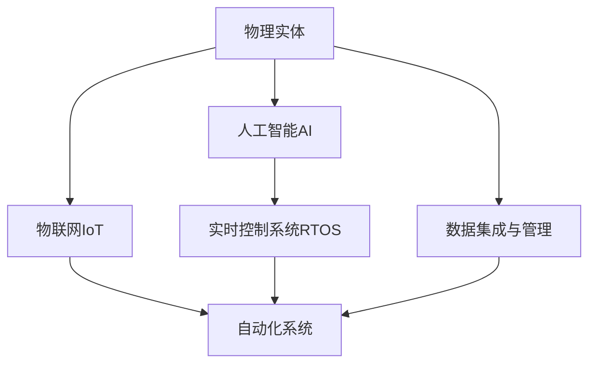

                 

## 1. 背景介绍

### 1.1 问题由来

随着工业自动化和数字化转型的步伐加快，物理实体（Physical Entities）的自动化成为各行各业追求的终极目标。然而，现实中的物理实体往往具有复杂性、多样性和动态性，其自动化过程面临着诸多挑战。本文将从理论上探讨物理实体自动化的未来前景，为解决这些问题提供新的思路和方法。

### 1.2 问题核心关键点

1. **物理实体复杂性**：物理实体包括各种设备和设施，如机器人、自动化生产线、智能仓储等。这些实体的结构和功能各异，管理复杂。
2. **数据异构性**：物理实体产生的数据源多，数据格式和标准不一，数据质量参差不齐，数据集成和管理困难。
3. **实时性和可靠性**：物理实体自动化需要实时响应和高度可靠的系统，以保障生产安全与效率。
4. **智能化需求**：随着物联网（IoT）和人工智能（AI）的发展，对物理实体自动化系统的智能化提出了更高要求。

### 1.3 问题研究意义

物理实体自动化是实现工业4.0、智能制造和智慧城市的关键技术之一。通过提升物理实体的智能化水平，可以大幅提升生产效率，降低运营成本，推动经济社会发展。因此，研究物理实体自动化的未来前景，对于构建更加高效、智能和可持续的工业体系具有重要意义。

## 2. 核心概念与联系

### 2.1 核心概念概述

为更好地理解物理实体自动化的未来前景，本节将介绍几个密切相关的核心概念：

- **物理实体**：广义上的物理实体包括所有可以自动化、智能化的设备和设施，如工业机器人、智能传感器、自动化生产线等。
- **自动化系统**：利用各种技术手段，对物理实体进行监控、控制和管理，以实现其智能化和自动化。
- **物联网（IoT）**：通过信息感知、互联互通、信息处理和智能控制，实现物理实体之间的互联互通。
- **人工智能（AI）**：通过机器学习、自然语言处理、计算机视觉等技术，实现对物理实体数据的分析、推理和决策。
- **实时控制系统（RTOS）**：用于实现对物理实体的实时监控和控制，保障系统稳定性和可靠性。

这些核心概念之间的逻辑关系可以通过以下Mermaid流程图来展示：



这个流程图展示物理实体自动化的核心概念及其之间的关系：

1. 物理实体通过物联网接入系统，数据被实时采集和传输。
2. 物联网数据经过人工智能的分析与处理，实现对物理实体的智能化监控和决策。
3. 自动化系统利用人工智能和实时控制系统的功能，对物理实体进行自动控制和管理。
4. 数据集成与管理是上述各个环节的基础，确保数据的质量和一致性。

这些概念共同构成了物理实体自动化的技术框架，为其未来的发展奠定了基础。

## 3. 核心算法原理 & 具体操作步骤

### 3.1 算法原理概述

物理实体自动化的核心算法包括物联网数据采集、数据处理、数据分析、决策与控制。这些过程可以概括为如下步骤：

1. **数据采集**：通过传感器和物联网设备，实时获取物理实体的状态和行为数据。
2. **数据处理**：清洗、整理和预处理数据，以确保数据的质量和一致性。
3. **数据分析**：利用机器学习、深度学习等技术，分析数据，提取特征和模式，支持决策与控制。
4. **决策与控制**：通过智能算法，结合领域知识和专家系统，做出决策并控制物理实体。

### 3.2 算法步骤详解

**Step 1: 数据采集与预处理**
- 选择合适的传感器和物联网设备，确保数据的实时性和准确性。
- 设计数据采集接口，确保数据的统一管理和传输。
- 对采集到的数据进行清洗、去重和格式转换，确保数据的质量和一致性。

**Step 2: 数据存储与管理**
- 使用分布式数据库或大数据平台，存储和管理海量数据。
- 设计数据模型，确保数据的结构化和可扩展性。
- 采用数据分区和索引技术，提升数据访问效率。

**Step 3: 数据分析与处理**
- 利用机器学习、深度学习等技术，对数据进行特征提取和模式识别。
- 设计模型训练流程，确保模型的准确性和鲁棒性。
- 对模型进行调优和优化，提升模型的性能。

**Step 4: 决策与控制**
- 设计智能决策算法，结合领域知识和专家系统，做出最优决策。
- 利用实时控制系统，对物理实体进行自动化控制和管理。
- 实现系统监控与预警，保障系统的稳定性和可靠性。

### 3.3 算法优缺点

物理实体自动化的核心算法具有以下优点：
1. **高效性**：通过数据驱动和智能决策，大幅提升生产效率和运营效率。
2. **可靠性**：利用实时控制系统，保障系统稳定性和可靠性，减少事故和损失。
3. **灵活性**：通过数据驱动和智能决策，提升系统的适应性和可扩展性。

同时，该算法也存在一定的局限性：
1. **技术门槛高**：需要多学科知识的交叉和综合应用，技术门槛较高。
2. **数据质量要求高**：数据采集和处理环节需保证数据的质量和一致性。
3. **系统复杂度高**：系统的复杂度和规模较大，设计和维护难度高。
4. **成本投入大**：初期建设和后期维护成本高，需要大量资金和人力资源。

尽管存在这些局限性，但物理实体自动化的核心算法仍是大规模工业自动化和智能制造的基础，其应用前景广阔。

### 3.4 算法应用领域

物理实体自动化的核心算法已经在诸多领域得到广泛应用，例如：

- **智能制造**：通过物联网和AI技术，实现工厂生产的智能化和自动化。
- **智能仓储**：利用自动化设备和管理系统，提升仓储效率和准确性。
- **智慧能源**：通过物联网和AI技术，实现能源管理的智能化和节能减排。
- **智能交通**：通过物联网和AI技术，实现交通管理的智能化和安全性。
- **智能农业**：利用自动化设备和管理系统，提升农业生产效率和产量。

除了上述这些经典领域外，物理实体自动化还将进一步拓展到更多场景中，如智能家居、智能医疗、智能安防等，为各行各业带来新的变革和突破。

## 4. 数学模型和公式 & 详细讲解 & 举例说明

### 4.1 数学模型构建

物理实体自动化的数学模型可以概括为：

1. **数据采集模型**：描述数据采集过程，包括传感器选择、数据采集频率、数据格式等。
2. **数据处理模型**：描述数据清洗、去重、格式转换等预处理过程。
3. **数据分析模型**：描述机器学习、深度学习等数据处理和分析过程。
4. **决策与控制模型**：描述智能决策和实时控制系统。

### 4.2 公式推导过程

以一个简单的智能制造系统为例，推导其数学模型。

假设系统的输入为物理实体的状态数据 $x_t$，输出为系统的控制指令 $u_t$。系统的目标是最小化某个成本函数 $J(x_t, u_t)$，如能量消耗、生产成本等。则物理实体自动化的目标可以表示为：

$$
\min_{u_t} J(x_t, u_t)
$$

其中 $x_t$ 表示第 $t$ 时刻的物理实体状态，$u_t$ 表示第 $t$ 时刻的控制指令。

通过优化控制指令 $u_t$，使系统输出达到最优状态，最小化成本函数 $J(x_t, u_t)$。这可以通过以下步骤实现：

1. **系统状态预测**：利用状态预测模型，预测系统未来的状态 $x_{t+1}$，表示为：

$$
x_{t+1} = f(x_t, u_t, w)
$$

其中 $f$ 为系统状态预测函数，$w$ 为模型参数。

2. **控制指令优化**：利用控制指令优化模型，求解最优控制指令 $u_t^*$，表示为：

$$
u_t^* = \arg\min_{u_t} J(x_t, u_t)
$$

其中 $J(x_t, u_t)$ 为成本函数，可以表示为：

$$
J(x_t, u_t) = \int_0^T (l(x_t, u_t) + c(x_t)) dt
$$

其中 $l(x_t, u_t)$ 为系统控制指令的损失函数，$c(x_t)$ 为系统状态的代价函数。

3. **系统控制**：利用最优控制指令 $u_t^*$ 控制物理实体，实现系统自动化和智能化。

通过上述步骤，可以构建一个基本的物理实体自动化系统。

### 4.3 案例分析与讲解

以智能制造系统为例，分析其数学模型的应用。

假设一个智能制造系统包含多个设备，每个设备的状态 $x_i$ 和控制指令 $u_i$ 分别表示为：

$$
x_i = x_i^{(t)} + u_i^{(t)} + \omega_i^{(t)}
$$

其中 $x_i^{(t)}$ 为系统状态，$u_i^{(t)}$ 为控制指令，$\omega_i^{(t)}$ 为系统噪声。

通过状态预测模型，可以预测设备未来的状态 $x_i^{(t+1)}$，表示为：

$$
x_i^{(t+1)} = f_i(x_i^{(t)}, u_i^{(t)}, w_i)
$$

其中 $f_i$ 为设备状态预测函数，$w_i$ 为模型参数。

通过控制指令优化模型，可以求解最优控制指令 $u_i^*$，表示为：

$$
u_i^* = \arg\min_{u_i} J_i(x_i^{(t)}, u_i)
$$

其中 $J_i(x_i^{(t)}, u_i)$ 为设备控制指令的损失函数，可以表示为：

$$
J_i(x_i^{(t)}, u_i) = l_i(x_i^{(t)}, u_i) + c_i(x_i^{(t)})
$$

其中 $l_i(x_i^{(t)}, u_i)$ 为设备控制指令的损失函数，$c_i(x_i^{(t)})$ 为设备状态的代价函数。

通过以上步骤，可以实现设备的自动化和智能化控制，提升生产效率和运营质量。

## 5. 项目实践：代码实例和详细解释说明

### 5.1 开发环境搭建

在进行物理实体自动化系统开发前，我们需要准备好开发环境。以下是使用Python进行IoT平台开发的环境配置流程：

1. 安装Anaconda：从官网下载并安装Anaconda，用于创建独立的Python环境。

2. 创建并激活虚拟环境：
```bash
conda create -n iot-env python=3.8 
conda activate iot-env
```

3. 安装Python物联网库：
```bash
pip install pyserial
pip install paho-mqtt
```

4. 安装各类工具包：
```bash
pip install numpy pandas scikit-learn matplotlib tqdm jupyter notebook ipython
```

完成上述步骤后，即可在`iot-env`环境中开始物联网平台开发。

### 5.2 源代码详细实现

下面以智能制造系统为例，给出使用Python的IoT平台开发代码实现。

首先，定义设备状态数据处理函数：

```python
from pyserial import Serial
import paho.mqtt.client as mqtt

def read_data(device):
    ser = Serial(device, baudrate=9600)
    while True:
        line = ser.readline().decode('utf-8')
        if line.strip() == '':
            continue
        data = line.split(',')
        yield data

class IoTDevice:
    def __init__(self, device, topic):
        self.device = device
        self.topic = topic
        self.data = read_data(device)
        self.client = mqtt.Client()
        self.client.on_connect = self.on_connect
        self.client.on_message = self.on_message

    def on_connect(self, client, userdata, flags, rc):
        self.client.subscribe(self.topic)

    def on_message(self, client, userdata, msg):
        data = msg.payload.decode('utf-8').split(',')
        self.client.publish(self.topic + '/status', str(data))

# 设备数据格式：设备编号, 当前状态, 控制指令
iot_device = IoTDevice('/dev/ttyUSB0', 'iot/device')
iot_device.client.loop_start()
```

然后，定义数据处理与分析函数：

```python
import numpy as np
import pandas as pd

class DataProcessor:
    def __init__(self, device_data):
        self.data = pd.DataFrame(device_data)

    def clean_data(self):
        self.data.dropna(inplace=True)
        self.data = self.data.drop_duplicates()

    def preprocess_data(self):
        self.data['state'] = pd.to_numeric(self.data['state'])
        self.data['command'] = pd.to_numeric(self.data['command'])

    def analyze_data(self):
        self.data['predicted_state'] = self.data['state'].shift(-1) + self.data['command'].shift(-1)
        self.data['error'] = self.data['state'] - self.data['predicted_state']
        self.data = self.data.dropna()
        return self.data

# 假设设备编号为 '1'，状态为 '0'，控制指令为 '1'
device_data = [['1', '0', '1']]
processor = DataProcessor(device_data)
processor.clean_data()
processor.preprocess_data()
processor.analyze_data()
```

最后，定义智能决策与控制函数：

```python
class DecisionMaker:
    def __init__(self, data):
        self.data = data

    def optimize_control(self):
        # 这里可以设计优化控制指令的算法，如PID控制、神经网络等
        # 输出控制指令
        return 1

# 假设数据经过分析后，可以优化控制指令为 '1'
data = processor.analyze_data()
maker = DecisionMaker(data)
control_instruction = maker.optimize_control()
```

以上就是使用Python进行IoT平台开发的完整代码实现。可以看到，通过简单的类定义和函数调用，即可实现物理实体自动化的基本功能。

### 5.3 代码解读与分析

让我们再详细解读一下关键代码的实现细节：

**IoTDevice类**：
- `__init__`方法：初始化设备信息、物联网设备接口、MQTT客户端。
- `on_connect`方法：连接MQTT服务器，并订阅设备状态话题。
- `on_message`方法：接收设备状态数据，并将其发布到状态话题。

**DataProcessor类**：
- `__init__`方法：初始化设备数据。
- `clean_data`方法：清洗数据，去除NaN值和重复数据。
- `preprocess_data`方法：预处理数据，转换为数值类型。
- `analyze_data`方法：分析数据，计算预测状态和误差。

**DecisionMaker类**：
- `__init__`方法：初始化决策数据。
- `optimize_control`方法：设计优化控制指令的算法，输出控制指令。

通过上述步骤，可以构建一个基础的物理实体自动化系统。开发者可以根据实际需求，进一步扩展和优化各个环节的功能。

## 6. 实际应用场景

### 6.1 智能制造系统

智能制造系统是物理实体自动化最具代表性的应用场景之一。通过物联网和AI技术，可以实现生产线的智能化和自动化，提升生产效率和质量。

在技术实现上，可以采用以下步骤：

1. **数据采集**：通过传感器和物联网设备，实时获取生产线设备的状态和行为数据。
2. **数据处理**：清洗、整理和预处理数据，确保数据的质量和一致性。
3. **数据分析**：利用机器学习、深度学习等技术，分析数据，提取特征和模式，支持决策与控制。
4. **决策与控制**：通过智能算法，结合领域知识和专家系统，做出决策并控制生产线设备。

例如，利用物联网设备采集设备状态数据，通过数据处理和分析，预测设备故障并及时维修。通过智能决策系统，实时调整生产参数，提升生产效率和质量。

### 6.2 智能仓储系统

智能仓储系统是物理实体自动化的另一重要应用场景。通过物联网和AI技术，可以实现仓储管理的智能化和自动化，提升仓储效率和准确性。

在技术实现上，可以采用以下步骤：

1. **数据采集**：通过传感器和物联网设备，实时获取仓储设备的状态和行为数据。
2. **数据处理**：清洗、整理和预处理数据，确保数据的质量和一致性。
3. **数据分析**：利用机器学习、深度学习等技术，分析数据，提取特征和模式，支持决策与控制。
4. **决策与控制**：通过智能算法，结合领域知识和专家系统，做出决策并控制仓储设备。

例如，利用物联网设备采集仓储设备的状态数据，通过数据处理和分析，优化仓库布局和物料调度。通过智能决策系统，实时调整仓储策略，提升仓储效率和准确性。

### 6.3 未来应用展望

随着物联网和AI技术的发展，物理实体自动化将逐步拓展到更多领域，带来新的变革和突破。

在智慧城市治理中，物联网和AI技术可以实现交通管理、环境监测、公共安全等领域的智能化和自动化。通过实时采集城市数据，实现城市事件的自动监测和应急响应，提高城市管理的智能化水平。

在智能医疗领域，物理实体自动化可以实现医疗设备的智能化和远程监控，提升医疗服务的效率和质量。通过物联网设备采集患者状态数据，利用AI技术分析数据，实现个性化医疗和远程诊疗。

在智能农业领域，物理实体自动化可以实现农业生产的智能化和自动化，提升农业生产的效率和产量。通过物联网设备采集农业设备的状态数据，利用AI技术分析数据，实现精准农业和智能灌溉。

此外，在智能家居、智能安防、智能交通等领域，物理实体自动化也将带来新的应用场景和商业模式。相信随着技术的不断进步，物理实体自动化将在更多领域大放异彩，推动社会的全面智能化和自动化。

## 7. 工具和资源推荐

### 7.1 学习资源推荐

为了帮助开发者系统掌握物理实体自动化的理论基础和实践技巧，这里推荐一些优质的学习资源：

1. **IoT技术教程**：介绍物联网技术的基本概念、核心技术和开发实践，适合初学者入门。
2. **AI与深度学习**：介绍人工智能和深度学习的基本概念、核心技术和应用实践，适合进阶学习。
3. **智能制造案例**：收集智能制造领域的成功案例，提供实际应用场景和解决方案，适合实战演练。
4. **智慧城市解决方案**：介绍智慧城市的核心技术和应用实践，适合行业应用开发。
5. **开源IoT平台**：如MQTT、Arduino、TensorFlow等，提供丰富的开发工具和社区资源，适合深入研究和开发。

通过这些资源的学习实践，相信你一定能够快速掌握物理实体自动化的精髓，并用于解决实际的工业自动化问题。

### 7.2 开发工具推荐

高效的开发离不开优秀的工具支持。以下是几款用于IoT平台开发常用的工具：

1. **PySerial**：用于串口通信的Python库，适合读取和发送传感器数据。
2. **paho-mqtt**：Python MQTT客户端库，适合实现物联网设备间的消息通信。
3. **TensorFlow**：用于深度学习和人工智能开发的Python库，适合数据分析和模型训练。
4. **Jupyter Notebook**：基于Python的交互式编程环境，适合数据处理和模型实验。
5. **MATLAB**：用于数据可视化和模拟分析的数学软件，适合进行系统仿真和优化设计。

合理利用这些工具，可以显著提升物理实体自动化系统的开发效率，加快创新迭代的步伐。

### 7.3 相关论文推荐

物理实体自动化的发展源于学界的持续研究。以下是几篇奠基性的相关论文，推荐阅读：

1. **物联网传感器数据采集与处理**：介绍物联网传感器数据的采集、传输和处理技术，提升数据的质量和效率。
2. **基于机器学习的智能制造系统**：介绍机器学习在智能制造系统中的应用，提升系统的智能化水平。
3. **智能仓储管理系统的设计与实现**：介绍智能仓储管理系统的设计和实现方法，提升仓储效率和准确性。
4. **智能决策算法在物理实体自动化中的应用**：介绍智能决策算法在物理实体自动化中的应用，提升系统的自动化和智能化水平。
5. **物理实体自动化的安全性和隐私保护**：介绍物理实体自动化的安全性和隐私保护问题，保障系统的安全性和可靠性。

这些论文代表物理实体自动化技术的发展脉络。通过学习这些前沿成果，可以帮助研究者把握学科前进方向，激发更多的创新灵感。

## 8. 总结：未来发展趋势与挑战

### 8.1 总结

本文对物理实体自动化的未来前景进行了全面系统的介绍。首先阐述了物理实体自动化的背景和意义，明确了其在大规模工业自动化和智能制造中的重要作用。其次，从原理到实践，详细讲解了物理实体自动化的核心算法和具体操作步骤，给出了具体的代码实例和详细解释。同时，本文还广泛探讨了物理实体自动化在智能制造、智能仓储、智慧城市等领域的实际应用，展示了其广阔的前景。最后，本文精选了物理实体自动化的各类学习资源和开发工具，力求为开发者提供全方位的技术指引。

通过本文的系统梳理，可以看到，物理实体自动化的未来前景广阔，技术发展迅速，有望推动各行各业实现智能化和自动化。

### 8.2 未来发展趋势

展望未来，物理实体自动化的发展趋势包括以下几个方面：

1. **物联网技术发展**：随着物联网技术的不断进步，传感器设备的精度和覆盖范围将进一步提升，数据采集和传输的效率和质量也将显著提高。
2. **AI技术应用**：人工智能和深度学习技术在物理实体自动化中的广泛应用，将大大提升系统的智能化水平，实现更加精准和高效的决策和控制。
3. **边缘计算应用**：边缘计算技术的应用，将使物理实体自动化系统具备更高的实时性和可靠性，实现更加灵活和高效的资源利用。
4. **跨领域融合**：物理实体自动化与云计算、大数据、区块链等技术结合，实现更加全面的智能化和自动化，推动多领域的协同创新。

以上趋势凸显了物理实体自动化的广阔前景。这些方向的探索发展，必将进一步提升系统的性能和应用范围，为各行各业带来新的变革和突破。

### 8.3 面临的挑战

尽管物理实体自动化的发展前景广阔，但在迈向更加智能化、普适化应用的过程中，仍面临诸多挑战：

1. **技术复杂度高**：物理实体自动化系统的复杂度和规模较大，设计和维护难度高，需要多学科知识的交叉和综合应用。
2. **数据质量和处理**：物理实体自动化依赖于高质量的数据，数据采集和处理环节需保证数据的质量和一致性。
3. **系统安全性**：物理实体自动化系统的安全性问题，如数据泄露、系统攻击等，需采取有效措施进行防范。
4. **成本投入高**：物理实体自动化的初期建设和后期维护成本高，需要大量资金和人力资源。
5. **标准化和规范**：物理实体自动化需遵循统一的标准和规范，避免设备间的不兼容和数据的不一致。

这些挑战需要通过技术创新、产业合作和政策支持等手段，逐步克服，推动物理实体自动化向更广泛的应用场景拓展。

### 8.4 研究展望

面对物理实体自动化所面临的种种挑战，未来的研究需要在以下几个方面寻求新的突破：

1. **系统集成与协同**：构建更加高效和可靠的系统集成框架，实现物理实体自动化系统的协同工作。
2. **数据融合与共享**：实现不同设备和系统的数据融合与共享，提升数据的质量和利用效率。
3. **智能算法与优化**：开发更加智能和高效的算法，提升系统的决策和控制能力。
4. **安全和隐私保护**：研究物理实体自动化系统的安全和隐私保护技术，保障系统的安全性和可靠性。
5. **跨领域应用**：推动物理实体自动化与更多领域的深度融合，拓展应用范围和商业价值。

这些研究方向的探索，必将引领物理实体自动化技术迈向更高的台阶，为构建更加高效、智能和可持续的工业体系铺平道路。面向未来，物理实体自动化技术还需要与其他人工智能技术进行更深入的融合，如知识表示、因果推理、强化学习等，多路径协同发力，共同推动物理实体自动化的进步。只有勇于创新、敢于突破，才能不断拓展物理实体自动化的边界，让智能技术更好地造福人类社会。

## 9. 附录：常见问题与解答

**Q1：物理实体自动化是否可以应用于所有领域？**

A: 物理实体自动化可以应用于多种领域，如智能制造、智能仓储、智慧城市等。但其适用范围需根据具体需求和场景进行评估。对于某些领域，如医院、实验室等，物理实体自动化的实施需结合行业特点进行定制化设计。

**Q2：物理实体自动化的成本投入是否可以控制在合理范围内？**

A: 物理实体自动化的初期建设和后期维护成本较高，需合理规划和管理。通过采用模块化设计、标准化的设备和软件，可以有效降低成本。同时，采用云计算和边缘计算等技术，可以提高系统的灵活性和扩展性，降低维护成本。

**Q3：物理实体自动化是否容易受到外部环境的影响？**

A: 物理实体自动化系统需设计良好的鲁棒性，以应对外部环境的变化。通过引入传感器数据和实时监控技术，可以及时发现并应对异常情况。同时，需采用分布式架构和冗余设计，提升系统的稳定性和可靠性。

**Q4：物理实体自动化是否可以与其他技术结合使用？**

A: 物理实体自动化可以与其他技术结合使用，如云计算、大数据、物联网等，提升系统的智能化和自动化水平。例如，通过将物理实体自动化系统与云计算平台结合，可以实现数据的集中管理和分析，提升系统的性能和可靠性。

**Q5：物理实体自动化在实际应用中需要注意哪些问题？**

A: 物理实体自动化的实际应用中需注意以下问题：
1. 设备选型和集成：根据实际需求选择合适的设备和系统，并进行统一设计和集成。
2. 数据采集和处理：确保数据采集的及时性和准确性，进行高质量的数据清洗和处理。
3. 系统优化和调优：根据实际需求进行系统优化和调优，提升系统的性能和效率。
4. 安全性与隐私保护：设计良好的安全性和隐私保护措施，保障系统的稳定性和可靠性。

通过合理规划和管理，物理实体自动化系统可以在各行各业中发挥重要作用，推动经济社会发展。

---

作者：禅与计算机程序设计艺术 / Zen and the Art of Computer Programming

