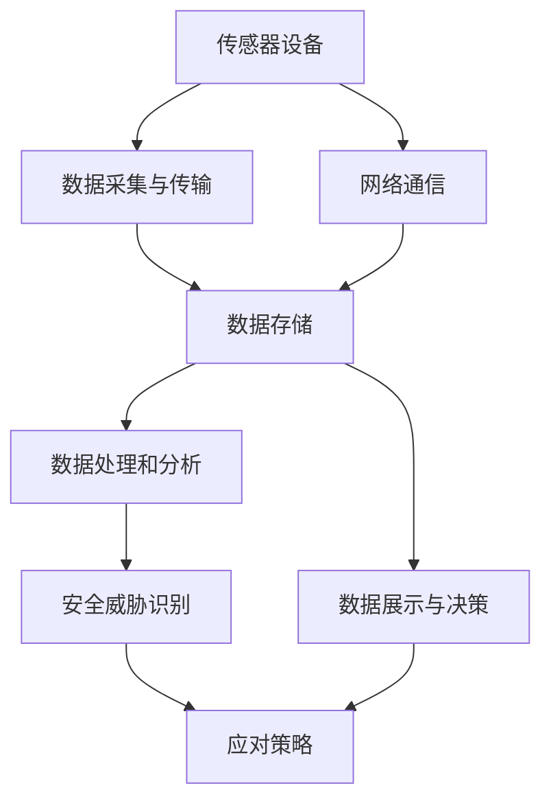

                 

# 物联网(IoT)技术和各种传感器设备的集成：物联网在安全监控中的作用

## 1. 背景介绍

### 1.1 问题由来

随着科技的不断进步，物联网（IoT）技术在各个领域的应用越来越广泛，尤其在安全监控领域，物联网技术已经成为了不可或缺的重要组成部分。物联网技术通过传感器、通信技术和人工智能等多种技术手段，实现了对物理世界的实时监控和智能化管理。然而，物联网技术在安全监控中的作用不仅仅局限于设备部署和数据采集，更重要的是如何整合这些设备生成的海量数据，通过数据分析和人工智能技术，实现对潜在安全威胁的识别和应对。

### 1.2 问题核心关键点

本文将围绕物联网技术和传感器设备的集成，探讨其在安全监控中的应用。重点关注以下几个核心问题：

- 传感器设备的类型和部署方式
- 数据采集与传输技术
- 数据处理和分析方法
- 安全威胁识别和应对策略
- 物联网安全监控系统架构

## 2. 核心概念与联系

### 2.1 核心概念概述

1. **物联网（IoT）**：指通过各种传感器设备将物理世界的数据转化为数字信息，并通过互联网进行传输和处理的技术体系。

2. **传感器设备**：包括摄像头、传感器、温度计、湿度计、气体传感器等多种设备，用于实时监测环境状态和用户行为。

3. **数据采集与传输技术**：指通过传感器设备采集数据，并将其传输到云端或本地服务器的过程。

4. **数据处理和分析方法**：包括数据清洗、数据融合、机器学习等技术，用于从传感器设备生成的原始数据中提取有价值的信息。

5. **安全威胁识别和应对策略**：指通过数据分析技术识别潜在安全威胁，并采取相应的应对措施。

6. **物联网安全监控系统架构**：指实现物联网安全监控功能所需的技术架构，包括传感器网络、数据传输、数据存储、数据处理和应用层等部分。

### 2.2 核心概念原理和架构的 Mermaid 流程图



这个流程图展示了物联网安全监控系统的主要组成部分和数据流向。传感器设备采集的数据经过传输和存储，然后进行数据处理和分析，最终识别安全威胁并采取应对措施。同时，网络通信确保了数据的可靠传输。

## 3. 核心算法原理 & 具体操作步骤

### 3.1 算法原理概述

物联网安全监控系统的主要算法原理包括：

- **数据采集和传输算法**：通过传感器设备实时采集环境数据，并通过网络技术进行可靠传输。
- **数据处理和分析算法**：利用机器学习和数据分析技术，从传感器数据中提取有价值的信息。
- **安全威胁识别算法**：通过模式识别和异常检测技术，识别潜在的安全威胁。
- **应对策略算法**：根据安全威胁的严重程度，采取相应的应对措施，如警报、隔离、修复等。

### 3.2 算法步骤详解

#### 3.2.1 数据采集与传输

1. **传感器设备部署**：根据监控需求选择合适的传感器设备，并合理部署在目标区域。例如，视频监控摄像头可以用于实时监控重要区域，而温度和湿度传感器可以监测环境状态。

2. **数据采集**：传感器设备实时采集环境数据，如温度、湿度、烟雾、气体等。

3. **数据传输**：采集到的数据通过无线网络或有线网络传输到云端或本地服务器。数据传输过程中应考虑网络带宽、延迟和可靠性等因素。

#### 3.2.2 数据处理和分析

1. **数据清洗**：对采集到的数据进行去噪、校正和归一化处理，以提高数据质量。

2. **数据融合**：将不同传感器设备采集的数据进行融合，形成更全面、准确的环境状态描述。

3. **数据分析**：利用机器学习算法（如时间序列分析、异常检测等）对数据进行分析，提取环境状态和用户行为的模式。

#### 3.2.3 安全威胁识别

1. **异常检测**：通过统计学方法或机器学习算法，检测环境数据中的异常情况。例如，温度突变可能表示火灾，烟雾增加可能表示烟雾泄漏。

2. **模式识别**：利用机器学习算法识别出长期稳定的行为模式，如异常人员、设备等。

3. **威胁级别判定**：根据异常检测和模式识别结果，综合评估安全威胁的严重程度，决定是否需要采取应对措施。

#### 3.2.4 应对策略

1. **警报**：对于低级威胁，通过短信、邮件等方式通知相关人员。

2. **隔离**：对于中级威胁，隔离受威胁的设备或区域，防止威胁扩散。

3. **修复**：对于高级威胁，立即进行现场修复或更换设备，确保系统安全。

### 3.3 算法优缺点

#### 3.3.1 优点

1. **实时性**：物联网技术实现了对物理世界的实时监控，能够快速响应潜在的安全威胁。

2. **数据全面性**：通过多种传感器设备采集数据，提供了全面的环境状态和用户行为信息。

3. **自动应对**：通过智能算法和决策系统，自动识别和应对安全威胁，提高了应对效率。

#### 3.3.2 缺点

1. **数据量巨大**：传感器设备生成的数据量巨大，需要高效的数据处理和存储技术。

2. **设备部署复杂**：传感器设备的部署和维护需要专业知识，增加了系统建设的难度。

3. **网络依赖**：数据传输依赖网络通信，网络故障可能导致数据丢失或延迟。

4. **安全风险**：物联网系统的复杂性增加了系统被攻击的风险，需要额外的安全措施。

### 3.4 算法应用领域

物联网安全监控技术可以应用于以下多个领域：

1. **智能家居安全监控**：通过传感器设备实时监控家庭环境，及时发现潜在的安全威胁。

2. **公共场所安全监控**：在公共场所部署传感器设备，实时监测人群活动和环境状态，防止意外事件的发生。

3. **工业园区安全监控**：在工业园区部署传感器设备，实时监控设备和环境状态，预防事故和火灾等安全事件。

4. **医疗安全监控**：在医疗环境中部署传感器设备，实时监测患者状态和环境条件，提高医疗安全和效率。

5. **交通监控**：在交通系统中部署传感器设备，实时监测交通流量和道路状态，预防交通事故。

## 4. 数学模型和公式 & 详细讲解 & 举例说明

### 4.1 数学模型构建

物联网安全监控系统的数学模型主要包括以下几个部分：

1. **数据采集模型**：描述传感器设备采集数据的数学模型。例如，温度传感器采集的实时温度数据可以表示为 $T(t)$，其中 $t$ 为时间。

2. **数据传输模型**：描述数据在网络中传输的数学模型。例如，数据传输延迟可以用 $D(t)$ 表示，其中 $t$ 为时间。

3. **数据处理和分析模型**：描述数据处理和分析过程的数学模型。例如，时间序列分析模型可以表示为 $X(t)=\sum_{i=1}^{n} \alpha_i X(t-i)$，其中 $X(t)$ 为当前时间点的数据，$\alpha_i$ 为权重。

4. **安全威胁识别模型**：描述安全威胁识别的数学模型。例如，异常检测模型可以表示为 $S(t)=\sum_{i=1}^{n} \beta_i (T(t)-T(t-i))$，其中 $S(t)$ 为异常得分，$T(t)$ 为当前时间点的温度数据，$\beta_i$ 为权重。

### 4.2 公式推导过程

以异常检测模型为例，推导其公式如下：

1. **数据标准化**：
   $$
   Z(t) = \frac{T(t) - \mu}{\sigma}
   $$
   其中 $Z(t)$ 为标准化后的温度数据，$\mu$ 为均值，$\sigma$ 为标准差。

2. **异常得分计算**：
   $$
   S(t) = \sum_{i=1}^{n} \beta_i Z(t-i)
   $$
   其中 $\beta_i$ 为权重系数，通常 $|\beta_i| < 1$，$S(t)$ 表示当前时间点的异常得分。

3. **阈值判定**：
   $$
   if\ S(t) > \theta \ then\ raise\ alarm
   $$
   其中 $\theta$ 为设定的异常阈值，当 $S(t)$ 超过阈值时，触发警报。

### 4.3 案例分析与讲解

#### 4.3.1 智能家居安全监控案例

某智能家居系统中，通过部署多个温度传感器和烟雾传感器，实时监控房间环境状态。当传感器检测到温度突变或烟雾增加时，触发警报并通知住户。

1. **数据采集**：温度传感器和烟雾传感器采集室内温度和烟雾浓度数据。

2. **数据传输**：采集到的数据通过Wi-Fi网络传输到本地服务器。

3. **数据处理和分析**：服务器对采集到的数据进行清洗和融合，计算温度和烟雾的异常得分。

4. **安全威胁识别**：根据异常得分判断是否触发警报。

5. **应对策略**：当异常得分超过设定的阈值时，系统自动发送警报通知住户。

## 5. 项目实践：代码实例和详细解释说明

### 5.1 开发环境搭建

1. **操作系统**：建议选择Ubuntu Linux系统，支持Python和TensorFlow等常用框架。

2. **开发工具**：
   - Python：作为主要编程语言，Python生态丰富，适用于数据处理和机器学习开发。
   - TensorFlow：支持深度学习和数据分析，提供丰富的算法库和工具。
   - PyTorch：另一个常用的深度学习框架，灵活性高，支持动态图和静态图。

3. **开发环境安装**：
   - 安装Python 3.x，建议使用Anaconda环境管理工具。
   - 安装TensorFlow和PyTorch，建议使用pip工具安装。
   - 安装必要的数据库和网络库，如MySQL、PostgreSQL、scikit-learn、numpy等。

### 5.2 源代码详细实现

以下是一个简单的Python代码示例，演示了如何使用TensorFlow进行数据采集和异常检测：

```python
import tensorflow as tf
import numpy as np

# 定义数据采集模型
class SensorData:
    def __init__(self, temperature_data, smoke_data):
        self.temperature_data = temperature_data
        self.smoke_data = smoke_data
    
    def get_temperature(self, t):
        return self.temperature_data[t]

    def get_smoke(self, t):
        return self.smoke_data[t]

# 定义数据传输模型
class DataTransmission:
    def __init__(self, temperature_data, smoke_data):
        self.temperature_data = temperature_data
        self.smoke_data = smoke_data

    def transmit_temperature(self, t):
        return self.temperature_data[t]

    def transmit_smoke(self, t):
        return self.smoke_data[t]

# 定义数据处理和分析模型
class DataProcessing:
    def __init__(self, temperature_data, smoke_data):
        self.temperature_data = temperature_data
        self.smoke_data = smoke_data

    def clean_data(self, data):
        return data  # 简单清洗，实际应用中需要根据数据情况进行清洗

    def fuse_data(self, temperature_data, smoke_data):
        return np.concatenate((temperature_data, smoke_data))  # 数据融合

    def analyze_data(self, data):
        # 使用时间序列分析算法分析数据，实际应用中需要根据具体问题选择算法
        return np.mean(data)

# 定义安全威胁识别模型
class SecurityDetection:
    def __init__(self, temperature_data, smoke_data):
        self.temperature_data = temperature_data
        self.smoke_data = smoke_data

    def calculate_anomaly_score(self, temperature_data, smoke_data):
        # 计算异常得分，实际应用中需要根据具体问题选择算法
        return np.mean(temperature_data) + np.mean(smoke_data)

    def detect_threat(self, anomaly_score):
        if anomaly_score > 0.5:
            return "raise alarm"
        else:
            return "no threat"

# 主程序
if __name__ == "__main__":
    # 模拟传感器数据
    temperature_data = np.random.rand(100)
    smoke_data = np.random.rand(100)

    # 数据采集
    sensor_data = SensorData(temperature_data, smoke_data)
    transmission_data = DataTransmission(sensor_data.get_temperature(0), sensor_data.get_smoke(0))

    # 数据处理和分析
    processing_data = DataProcessing(sensor_data.get_temperature(0), sensor_data.get_smoke(0))
    cleaned_data = processing_data.clean_data(transmission_data.get_temperature(0))
    fused_data = processing_data.fuse_data(cleaned_data, cleaned_data)
    analyzed_data = processing_data.analyze_data(fused_data)

    # 安全威胁识别
    detection_data = SecurityDetection(sensor_data.get_temperature(0), sensor_data.get_smoke(0))
    anomaly_score = detection_data.calculate_anomaly_score(sensor_data.get_temperature(0), sensor_data.get_smoke(0))
    threat_result = detection_data.detect_threat(anomaly_score)

    # 输出结果
    print("Anomaly Score:", anomaly_score)
    print("Threat Result:", threat_result)
```

### 5.3 代码解读与分析

1. **数据采集模型**：定义了一个 `SensorData` 类，模拟了传感器设备的数据采集过程。

2. **数据传输模型**：定义了一个 `DataTransmission` 类，模拟了数据通过网络传输的过程。

3. **数据处理和分析模型**：定义了一个 `DataProcessing` 类，模拟了数据清洗、融合和分析的过程。

4. **安全威胁识别模型**：定义了一个 `SecurityDetection` 类，模拟了异常检测和安全威胁识别的过程。

5. **主程序**：模拟了数据采集、传输、处理、分析和威胁识别的全过程，最后输出异常得分和威胁结果。

## 6. 实际应用场景

### 6.1 智能家居安全监控

智能家居安全监控系统通过部署多个传感器设备，实时监测家庭环境状态。系统根据传感器数据，自动判断是否存在安全威胁，并及时通知住户。例如，当烟雾传感器检测到烟雾浓度异常增加时，系统立即通知住户并开启门窗通风，避免火灾发生。

### 6.2 公共场所安全监控

在公共场所如商场、机场、体育场馆等，部署传感器设备，实时监测人群活动和环境状态。系统根据传感器数据，自动判断是否存在异常行为，并及时通知安保人员。例如，当视频监控摄像头检测到异常人员时，系统立即通知安保人员进行检查。

### 6.3 工业园区安全监控

在工业园区部署传感器设备，实时监测设备状态和环境条件。系统根据传感器数据，自动判断是否存在安全隐患，并及时采取应对措施。例如，当传感器检测到设备温度异常时，系统立即通知维护人员进行检查和修复，避免事故发生。

### 6.4 未来应用展望

随着物联网技术的发展，未来物联网安全监控系统将具备更高的智能化和自动化水平。例如：

1. **智能报警系统**：结合自然语言处理技术和语音识别技术，通过语音命令进行报警。

2. **异常行为分析**：利用深度学习和计算机视觉技术，自动识别和分析异常行为，提供更精确的报警信息。

3. **多模态监控**：结合视频、温度、气体等多种传感器数据，提供更全面的环境状态监控。

4. **实时数据分析**：利用大数据和云计算技术，对大量传感器数据进行实时分析，提供更精准的报警和预警。

5. **自主学习系统**：利用机器学习算法，自动优化报警策略和阈值设定，提高系统的自适应能力和智能化水平。

## 7. 工具和资源推荐

### 7.1 学习资源推荐

1. **《物联网技术基础》**：详细介绍了物联网的基本概念、技术架构和应用场景。

2. **《Python深度学习实战》**：介绍了使用Python进行深度学习和数据分析的实战技巧。

3. **《TensorFlow深度学习》**：介绍了TensorFlow的使用方法，涵盖深度学习的基本原理和实践技巧。

4. **《传感器与数据融合》**：介绍了传感器数据融合的基本原理和常用算法。

5. **《智能家居安全监控》**：介绍了智能家居安全监控系统的构建方法和实现技术。

### 7.2 开发工具推荐

1. **Ubuntu Linux**：支持Python、TensorFlow等常用框架，适合开发和测试物联网安全监控系统。

2. **Jupyter Notebook**：支持Python代码编写和实时显示结果，方便调试和演示。

3. **TensorFlow**：支持深度学习和数据分析，提供丰富的算法库和工具。

4. **PyTorch**：另一个常用的深度学习框架，灵活性高，支持动态图和静态图。

5. **MySQL**：支持数据存储和查询，适合存储传感器数据。

### 7.3 相关论文推荐

1. **《物联网安全监控系统设计》**：介绍了一种基于物联网的安全监控系统设计方法。

2. **《传感器数据融合技术》**：介绍了传感器数据融合的基本原理和常用算法。

3. **《智能家居安全监控技术》**：介绍了一种基于物联网的智能家居安全监控技术。

4. **《深度学习在异常检测中的应用》**：介绍了深度学习算法在异常检测中的应用方法。

## 8. 总结：未来发展趋势与挑战

### 8.1 研究成果总结

物联网安全监控技术在多个领域取得了显著的应用成果，但同时也面临着数据处理和分析、系统部署和维护等挑战。未来需要在以下方面进行进一步研究：

1. **数据处理和分析**：开发更高效的数据处理和分析算法，提高系统性能和可靠性。

2. **系统部署和维护**：简化传感器设备的部署和维护，降低系统建设成本和难度。

3. **安全性保障**：加强物联网系统的安全性设计，防止数据泄露和系统攻击。

4. **用户体验提升**：提高系统的智能化和自动化水平，提升用户体验。

### 8.2 未来发展趋势

1. **数据驱动的智能化**：未来物联网系统将更加依赖数据驱动的智能化，通过大数据和人工智能技术，实现更精准的监控和预警。

2. **多模态融合**：结合视频、温度、气体等多种传感器数据，提供更全面的环境状态监控。

3. **实时数据分析**：利用大数据和云计算技术，对大量传感器数据进行实时分析，提供更精准的报警和预警。

4. **自主学习系统**：利用机器学习算法，自动优化报警策略和阈值设定，提高系统的自适应能力和智能化水平。

### 8.3 面临的挑战

1. **数据处理和分析**：传感器数据量巨大，需要高效的数据处理和存储技术。

2. **系统部署和维护**：传感器设备的部署和维护需要专业知识，增加了系统建设的难度。

3. **安全性保障**：物联网系统的复杂性增加了系统被攻击的风险，需要额外的安全措施。

4. **用户体验提升**：系统的智能化和自动化水平需要进一步提升，以提高用户体验。

### 8.4 研究展望

未来物联网安全监控技术需要在数据处理、系统部署、安全性保障和用户体验提升等方面进行全面优化和提升，才能更好地服务于现实应用。以下是一些可能的研究方向：

1. **高效数据处理算法**：开发更高效的数据清洗、融合和分析算法，提高系统的性能和可靠性。

2. **智能报警系统**：结合自然语言处理技术和语音识别技术，通过语音命令进行报警。

3. **多模态监控**：结合视频、温度、气体等多种传感器数据，提供更全面的环境状态监控。

4. **实时数据分析**：利用大数据和云计算技术，对大量传感器数据进行实时分析，提供更精准的报警和预警。

5. **自主学习系统**：利用机器学习算法，自动优化报警策略和阈值设定，提高系统的自适应能力和智能化水平。

总之，物联网安全监控技术有着广阔的应用前景和研究价值，需要各界共同努力，推动其进一步发展。

## 9. 附录：常见问题与解答

**Q1：如何选择合适的传感器设备？**

A: 选择合适的传感器设备需要考虑以下因素：
1. **监控需求**：根据监控需求选择合适的传感器类型，如温度传感器、烟雾传感器、摄像头等。
2. **部署位置**：根据部署位置选择合适的传感器类型和安装方式，确保传感器能够准确采集环境数据。
3. **数据精度**：选择精度较高的传感器设备，确保采集数据的准确性和可靠性。

**Q2：数据传输过程中如何保证数据可靠性？**

A: 保证数据可靠性需要采取以下措施：
1. **网络带宽**：选择带宽足够的传输网络，避免网络拥堵导致数据丢失或延迟。
2. **冗余传输**：采用冗余传输技术，通过多路径传输数据，提高数据传输的可靠性。
3. **数据压缩**：采用数据压缩技术，减少数据传输的带宽占用，提高数据传输的效率。

**Q3：如何提高数据处理和分析的效率？**

A: 提高数据处理和分析效率需要采取以下措施：
1. **并行处理**：利用多核处理器和分布式计算技术，实现数据处理的并行化。
2. **优化算法**：选择高效的算法和数据结构，减少数据处理的时间复杂度。
3. **缓存机制**：采用数据缓存机制，减少数据读写和传输的开销，提高处理效率。

**Q4：如何提高系统的安全性？**

A: 提高系统的安全性需要采取以下措施：
1. **数据加密**：采用数据加密技术，保护数据传输和存储的安全性。
2. **访问控制**：采用访问控制技术，限制对系统的非法访问和操作。
3. **异常检测**：采用异常检测技术，及时发现和应对系统异常和攻击。

**Q5：如何提高用户体验？**

A: 提高用户体验需要采取以下措施：
1. **智能报警**：结合自然语言处理技术和语音识别技术，通过语音命令进行报警。
2. **多模态监控**：结合视频、温度、气体等多种传感器数据，提供更全面的环境状态监控。
3. **实时数据分析**：利用大数据和云计算技术，对大量传感器数据进行实时分析，提供更精准的报警和预警。

总之，物联网安全监控技术具有广泛的应用前景，但需要综合考虑数据处理、系统部署、安全性保障和用户体验等多个因素，才能实现高效、可靠和智能的监控系统。

