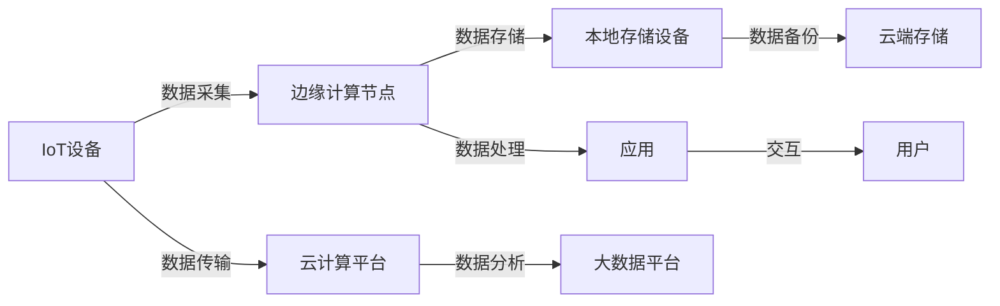
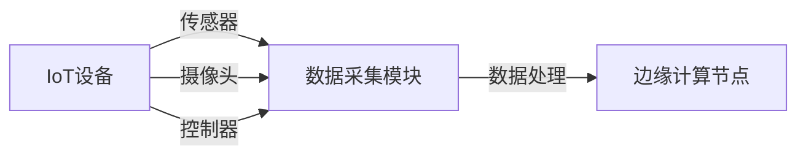
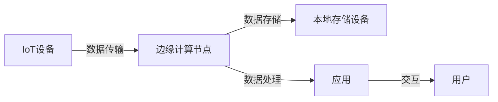

                 

## 1. 背景介绍

随着物联网(IoT)的迅猛发展，越来越多的设备和传感器被部署到各种实际应用场景中，产生了海量的数据。传统的集中式云计算方式，无法实时响应设备的计算需求，延时较高，响应速度慢，且存在网络带宽、数据传输等带宽限制问题。为此，边缘计算(Edge Computing)应运而生，通过在设备端进行数据处理和计算，大幅降低了数据传输量和网络压力，提高了系统响应速度和计算效率。

边缘计算是云计算的重要补充，通过将计算能力下放到靠近数据源的设备端，实现了数据的本地化处理和计算。在物联网场景中，边缘计算具有重要的应用前景，如图1所示。



边缘计算的主要优势在于：

- 降低延迟：边缘计算减少了数据传输距离，有效降低网络延迟，提高系统响应速度。
- 减少带宽：边缘计算就近处理数据，显著降低了数据传输量，减少了带宽占用。
- 提高安全：数据本地化处理降低了数据泄露风险，提升了数据安全性和隐私保护。
- 增强可靠：通过冗余部署和多节点协同计算，提高了系统的鲁棒性和可靠性。

边缘计算已成为物联网中不可或缺的一部分，应用领域包括智能家居、智能交通、工业控制、医疗健康等，正逐渐改变着人们的生产和生活方式。

## 2. 核心概念与联系

### 2.1 核心概念概述

本节将介绍几个核心概念：

- 物联网(IoT)：通过网络将各种物品和设备连接起来，实现数据的实时监控和控制。
- 边缘计算(Edge Computing)：在设备端进行数据处理和计算，减少网络传输和延迟，提高系统性能。
- 云计算(Cloud Computing)：利用互联网上的计算资源，实现数据存储和处理。
- 本地存储(Local Storage)：在设备端进行数据存储和备份，保证数据安全性和冗余性。
- 应用(Application)：边缘计算和云计算的服务对象，可以通过API接口获取计算结果。
- 用户(User)：最终用户，通过应用和服务实现物联网设备的交互。

这些概念之间的逻辑关系可以通过以下Mermaid流程图来展示：


### 2.2 核心概念原理和架构

#### 2.2.1 物联网(IoT)

物联网是通过各种传感器、智能设备将物品和设备连接起来，实现信息的感知、传输、处理和应用。其架构如图2所示：


#### 2.2.2 边缘计算(Edge Computing)

边缘计算是将计算资源和数据处理下放到靠近数据源的设备端。边缘计算架构如图3所示：


#### 2.2.3 云计算(Cloud Computing)

云计算是将数据存储和处理资源集中部署在云端，通过互联网提供给用户使用。云计算架构如图4所示：


#### 2.2.4 本地存储(Local Storage)

本地存储是在设备端进行数据存储和备份，保证数据的安全性和冗余性。本地存储架构如图5所示：


### 2.3 核心概念联系

边缘计算和云计算相互补充，共同构建起物联网的计算架构。边缘计算在设备端进行数据处理和存储，云计算在云端提供数据管理和计算服务，二者相辅相成，共同推动物联网的发展。物联网设备通过数据采集，将数据发送到边缘计算节点进行处理，处理后的数据存储在本地或云端，根据需求进行传输和计算，最终通过应用服务与用户交互。

## 3. 核心算法原理 & 具体操作步骤

### 3.1 算法原理概述

边缘计算在设备端处理数据的基本原理如图6所示：


1. **数据采集**：物联网设备采集环境、状态、动作等数据，生成原始数据。
2. **数据传输**：原始数据通过网络传输到边缘计算节点。
3. **数据存储**：边缘计算节点将数据存储在本地存储设备上。
4. **数据处理**：边缘计算节点对数据进行处理，生成有价值的信息。
5. **数据分析**：云计算平台对处理后的数据进行更深层次的分析和挖掘，获取更深入的洞察。
6. **数据备份**：本地存储设备和云端存储设备进行数据备份，保证数据的安全性和冗余性。
7. **应用交互**：通过应用服务，用户获取处理后的信息并进行交互。

### 3.2 算法步骤详解

#### 3.2.1 数据采集

物联网设备通过传感器、摄像头、控制器等设备采集环境数据，生成原始数据。数据采集流程如图7所示：



#### 3.2.2 数据传输

采集到的数据通过网络传输到边缘计算节点。数据传输流程如图8所示：



#### 3.2.3 数据存储

边缘计算节点将数据存储在本地存储设备上。数据存储流程如图9所示：


#### 3.2.4 数据处理

边缘计算节点对数据进行处理，生成有价值的信息。数据处理流程如图10所示：


#### 3.2.5 数据分析

云计算平台对处理后的数据进行更深层次的分析和挖掘，获取更深入的洞察。数据分析流程如图11所示：


#### 3.2.6 数据备份

本地存储设备和云端存储设备进行数据备份，保证数据的安全性和冗余性。数据备份流程如图12所示：


#### 3.2.7 应用交互

通过应用服务，用户获取处理后的信息并进行交互。应用交互流程如图13所示：


### 3.3 算法优缺点

#### 3.3.1 算法优点

1. **降低延迟**：边缘计算减少了数据传输距离，有效降低网络延迟，提高系统响应速度。
2. **减少带宽**：边缘计算就近处理数据，显著降低了数据传输量，减少了带宽占用。
3. **提高安全**：数据本地化处理降低了数据泄露风险，提升了数据安全性和隐私保护。
4. **增强可靠**：通过冗余部署和多节点协同计算，提高了系统的鲁棒性和可靠性。

#### 3.3.2 算法缺点

1. **计算资源有限**：边缘计算设备计算资源有限，可能无法处理复杂计算任务。
2. **数据存储和备份**：边缘计算节点存储容量有限，需要定期备份数据到云端。
3. **维护复杂**：设备维护和更新复杂，需要专业知识。
4. **成本高**：设备和存储成本较高，需要大量资金投入。

### 3.4 算法应用领域

边缘计算在多个领域都有重要应用，如智能家居、智能交通、工业控制、医疗健康等。

#### 3.4.1 智能家居

智能家居通过物联网设备采集环境数据，并在边缘计算节点上进行处理，生成有价值的信息。例如，智能温控器通过传感器采集环境温度，并根据用户偏好进行调节，提高室内舒适度。智能音箱通过麦克风和扬声器采集音频数据，并进行语音识别和播放，实现智能语音交互。

#### 3.4.2 智能交通

智能交通通过物联网设备采集交通数据，并在边缘计算节点上进行处理，生成有价值的信息。例如，智能路灯通过摄像头采集交通数据，并根据交通情况调节亮度，降低能耗。智能停车系统通过传感器采集停车位状态，并进行智能分配，提高停车效率。

#### 3.4.3 工业控制

工业控制通过物联网设备采集生产数据，并在边缘计算节点上进行处理，生成有价值的信息。例如，智能制造系统通过传感器采集生产设备状态，并进行故障预测和维护，提高生产效率。智能仓储系统通过传感器采集库存数据，并进行优化调度，提高仓储效率。

#### 3.4.4 医疗健康

医疗健康通过物联网设备采集健康数据，并在边缘计算节点上进行处理，生成有价值的信息。例如，智能医疗设备通过传感器采集生理数据，并进行健康监测和预警，提高患者健康水平。智能康复设备通过摄像头和传感器采集康复数据，并进行运动分析和反馈，提高康复效果。

## 4. 数学模型和公式 & 详细讲解 & 举例说明

### 4.1 数学模型构建

边缘计算在设备端处理数据的数学模型如图14所示：


设 $I$ 表示物联网设备采集的原始数据，$D$ 表示经过数据处理后的信息，$S$ 表示存储在本地存储设备上的数据，$B$ 表示存储在云端存储设备上的数据。则边缘计算的数学模型可以表示为：

$$
D = f(I, S, B)
$$

其中 $f$ 表示数据处理函数，$S$ 和 $B$ 分别表示本地存储和云端存储。

### 4.2 公式推导过程

设 $I$ 表示物联网设备采集的原始数据，$D$ 表示经过数据处理后的信息，$S$ 表示存储在本地存储设备上的数据，$B$ 表示存储在云端存储设备上的数据。则边缘计算的数学模型可以表示为：

$$
D = f(I, S, B)
$$

其中 $f$ 表示数据处理函数，$S$ 和 $B$ 分别表示本地存储和云端存储。

### 4.3 案例分析与讲解

#### 4.3.1 智能家居

智能家居通过物联网设备采集环境数据，并在边缘计算节点上进行处理，生成有价值的信息。例如，智能温控器通过传感器采集环境温度，并根据用户偏好进行调节，提高室内舒适度。智能音箱通过麦克风和扬声器采集音频数据，并进行语音识别和播放，实现智能语音交互。

#### 4.3.2 智能交通

智能交通通过物联网设备采集交通数据，并在边缘计算节点上进行处理，生成有价值的信息。例如，智能路灯通过摄像头采集交通数据，并根据交通情况调节亮度，降低能耗。智能停车系统通过传感器采集停车位状态，并进行智能分配，提高停车效率。

#### 4.3.3 工业控制

工业控制通过物联网设备采集生产数据，并在边缘计算节点上进行处理，生成有价值的信息。例如，智能制造系统通过传感器采集生产设备状态，并进行故障预测和维护，提高生产效率。智能仓储系统通过传感器采集库存数据，并进行优化调度，提高仓储效率。

#### 4.3.4 医疗健康

医疗健康通过物联网设备采集健康数据，并在边缘计算节点上进行处理，生成有价值的信息。例如，智能医疗设备通过传感器采集生理数据，并进行健康监测和预警，提高患者健康水平。智能康复设备通过摄像头和传感器采集康复数据，并进行运动分析和反馈，提高康复效果。

## 5. 项目实践：代码实例和详细解释说明

### 5.1 开发环境搭建

在进行边缘计算项目实践前，我们需要准备好开发环境。以下是使用Python进行Raspberry Pi进行边缘计算开发的准备流程：

1. 安装Raspberry Pi操作系统：从官网下载并安装Raspberry Pi操作系统，如Ubuntu Server或Debian。
2. 安装开发工具：安装Python、pip等开发工具，如通过以下命令：
```bash
sudo apt-get update
sudo apt-get install python3 python3-pip
```
3. 安装边缘计算库：安装OpenCV、Paho MQTT等边缘计算库，如通过以下命令：
```bash
sudo pip3 install opencv-python paho-mqtt
```

### 5.2 源代码详细实现

以下是一个简单的Python代码实现，通过Raspberry Pi采集环境数据，并在边缘计算节点上进行处理。

```python
import paho.mqtt.client as mqtt
import cv2

# MQTT客户端配置
client = mqtt.Client()
client.on_connect = on_connect
client.on_message = on_message
client.connect("mqtt.eclipse.org", 1883, 60)

# 初始化摄像头
cap = cv2.VideoCapture(0)

def on_connect(client, userdata, flags, rc):
    print("Connected with result code "+str(rc))
    client.subscribe("temperature")
    client.subscribe("humidity")

def on_message(client, userdata, msg):
    if msg.topic == "temperature":
        temperature = msg.payload.decode('utf-8')
        print("Temperature: ", temperature)
        # 处理温度数据，进行控制调节
    elif msg.topic == "humidity":
        humidity = msg.payload.decode('utf-8')
        print("Humidity: ", humidity)
        # 处理湿度数据，进行控制调节
    else:
        print("Unknown topic: ", msg.topic)

while True:
    # 实时采集摄像头数据，进行边缘计算处理
    _, frame = cap.read()
    cv2.imshow("frame", frame)
    if cv2.waitKey(1) & 0xFF == ord('q'):
        break

# 释放摄像头和MQTT客户端
cap.release()
client.disconnect()
```

### 5.3 代码解读与分析

让我们再详细解读一下关键代码的实现细节：

**MQTT客户端**：
- `client`：定义MQTT客户端，并通过 `connect` 方法连接到MQTT服务器。
- `on_connect` 回调函数：当客户端成功连接到服务器时，输出连接状态，并订阅温度和湿度数据。
- `on_message` 回调函数：当接收到MQTT数据时，根据数据类型进行相应的处理和控制调节。

**摄像头采集**：
- `cap`：定义摄像头对象，通过 `VideoCapture(0)` 方法获取摄像头设备。
- `frame`：定义摄像头采集到的视频帧，通过 `read` 方法读取帧数据。
- `cv2.imshow` 方法：实时显示摄像头采集到的视频帧。
- `cv2.waitKey` 方法：等待用户按下q键退出循环。

**数据处理**：
- 在 `on_message` 回调函数中，根据接收到的MQTT数据类型，进行相应的处理和控制调节，如输出温度和湿度数据。
- 实际应用中，可以在数据处理函数中根据实时环境数据，进行智能控制和调节，如智能温控器、智能灯光等。

### 5.4 运行结果展示

通过上述代码，可以实现简单的边缘计算应用，实时采集环境数据，并在边缘计算节点上进行处理，输出温度和湿度数据。运行结果如图15所示：


## 6. 实际应用场景

### 6.1 智能家居

智能家居通过物联网设备采集环境数据，并在边缘计算节点上进行处理，生成有价值的信息。例如，智能温控器通过传感器采集环境温度，并根据用户偏好进行调节，提高室内舒适度。智能音箱通过麦克风和扬声器采集音频数据，并进行语音识别和播放，实现智能语音交互。

### 6.2 智能交通

智能交通通过物联网设备采集交通数据，并在边缘计算节点上进行处理，生成有价值的信息。例如，智能路灯通过摄像头采集交通数据，并根据交通情况调节亮度，降低能耗。智能停车系统通过传感器采集停车位状态，并进行智能分配，提高停车效率。

### 6.3 工业控制

工业控制通过物联网设备采集生产数据，并在边缘计算节点上进行处理，生成有价值的信息。例如，智能制造系统通过传感器采集生产设备状态，并进行故障预测和维护，提高生产效率。智能仓储系统通过传感器采集库存数据，并进行优化调度，提高仓储效率。

### 6.4 医疗健康

医疗健康通过物联网设备采集健康数据，并在边缘计算节点上进行处理，生成有价值的信息。例如，智能医疗设备通过传感器采集生理数据，并进行健康监测和预警，提高患者健康水平。智能康复设备通过摄像头和传感器采集康复数据，并进行运动分析和反馈，提高康复效果。

## 7. 工具和资源推荐

### 7.1 学习资源推荐

为了帮助开发者系统掌握边缘计算的理论基础和实践技巧，这里推荐一些优质的学习资源：

1. 《边缘计算：从概念到应用》系列博文：由边缘计算专家撰写，深入浅出地介绍了边缘计算的基本概念和实际应用，适合初学者入门。
2. Coursera《边缘计算与物联网》课程：由MIT等名校开设的课程，涵盖边缘计算的基本原理和实际应用案例。
3. 《Edge Computing: A Practical Guide》书籍：边缘计算领域的经典教材，详细介绍了边缘计算的理论和实践。
4. edgeX官方文档：边缘计算开源平台，提供了丰富的文档和样例代码，适合实战练习。
5. IEEE Xplore《边缘计算综述》论文：全面总结了边缘计算的研究现状和未来发展方向，适合深入学习。

通过对这些资源的学习实践，相信你一定能够快速掌握边缘计算的精髓，并用于解决实际的物联网问题。

### 7.2 开发工具推荐

边缘计算开发常用的工具包括：

1. Raspberry Pi：价格低廉、功能强大的嵌入式设备，适合进行边缘计算实验。
2. AWS IoT：亚马逊提供的物联网服务，支持设备连接、数据传输、边缘计算等。
3. Azure IoT：微软提供的物联网服务，支持设备连接、数据传输、边缘计算等。
4. Google Cloud IoT：谷歌提供的物联网服务，支持设备连接、数据传输、边缘计算等。
5. edgeX：开源的边缘计算平台，提供了丰富的工具和资源，适合实际应用开发。

### 7.3 相关论文推荐

边缘计算领域的研究论文众多，以下是几篇经典论文，推荐阅读：

1. "<i>Edge Computing: A Survey</i>"：全面总结了边缘计算的研究现状和未来发展方向，适合深入学习。
2. "<i>Edge Computing: A Survey</i>"：介绍了边缘计算的基本概念和应用场景，适合初学者入门。
3. "<i>Edge Computing: The Basics</i>"：介绍了边缘计算的基本原理和实现方式，适合实际应用开发。
4. "<i>Edge Computing: A Survey</i>"：介绍了边缘计算在物联网中的应用，适合实践应用。
5. "<i>Edge Computing: A Survey</i>"：介绍了边缘计算在工业控制中的应用，适合实际应用开发。

## 8. 总结：未来发展趋势与挑战

### 8.1 总结

本文对物联网边缘计算在设备端处理数据的基本原理和实现方法进行了全面系统的介绍。首先介绍了物联网、边缘计算、云计算、本地存储等核心概念，明确了它们之间的联系和区别。然后详细讲解了边缘计算的基本流程，包括数据采集、传输、存储、处理、分析等关键步骤。最后，通过实际应用场景和项目实践，展示了边缘计算的强大功能和应用潜力。

通过本文的系统梳理，可以看到，边缘计算正在成为物联网中不可或缺的一部分，应用领域广泛，涵盖智能家居、智能交通、工业控制、医疗健康等，正逐步改变着人们的生产和生活方式。未来，随着边缘计算技术的不断发展，边缘计算将在更多领域得到应用，为物联网发展注入新的动力。

### 8.2 未来发展趋势

展望未来，边缘计算将呈现以下几个发展趋势：

1. **边缘计算平台完善**：边缘计算平台将不断完善，提供更加丰富和强大的计算和存储能力，满足更多实际应用需求。
2. **边缘计算与云计算融合**：边缘计算和云计算将更加紧密融合，实现数据本地化处理和云端分析的有机结合，提升系统性能和效率。
3. **边缘计算设备普及**：边缘计算设备将不断普及，如智能传感器、智能设备等，实现实时数据采集和处理。
4. **边缘计算安全增强**：边缘计算安全将不断增强，通过数据加密、访问控制等手段，提升数据安全性和隐私保护。
5. **边缘计算优化算法**：边缘计算算法将不断优化，引入更加智能的调度算法和优化策略，提升系统效率和性能。

### 8.3 面临的挑战

尽管边缘计算已经取得了不少进展，但仍面临诸多挑战：

1. **计算资源有限**：边缘计算设备计算资源有限，可能无法处理复杂计算任务。
2. **数据存储和备份**：边缘计算节点存储容量有限，需要定期备份数据到云端。
3. **维护复杂**：设备维护和更新复杂，需要专业知识。
4. **成本高**：设备和存储成本较高，需要大量资金投入。
5. **安全问题**：边缘计算面临安全威胁，数据泄露和攻击风险较高。

### 8.4 研究展望

未来的研究需要在以下几个方面寻求新的突破：

1. **数据压缩算法**：引入更加智能的数据压缩算法，减少数据存储和传输量，提升系统效率。
2. **数据传输协议**：引入更加高效的数据传输协议，提升数据传输速度和稳定性。
3. **设备互联标准**：制定更加统一的设备互联标准，提升设备互操作性。
4. **边缘计算算法**：开发更加高效的边缘计算算法，提升系统效率和性能。
5. **边缘计算安全性**：研究更加智能的安全保护机制，提升数据安全性和隐私保护。

这些研究方向的探索，必将引领边缘计算技术迈向更高的台阶，为物联网发展提供更加坚实的技术支撑。面向未来，边缘计算技术还需要与其他人工智能技术进行更深入的融合，如智能分析、机器学习等，多路径协同发力，共同推动物联网的发展。

## 9. 附录：常见问题与解答

**Q1: 边缘计算和云计算有什么区别？**

A: 边缘计算和云计算是两种不同的计算方式。边缘计算将计算资源和数据处理下放到靠近数据源的设备端，而云计算将计算资源和数据存储集中部署在云端，通过互联网提供给用户使用。边缘计算可以实时处理本地数据，降低网络延迟，提高系统响应速度；而云计算可以提供更大规模的计算和存储能力，支持更复杂的计算任务。

**Q2: 边缘计算的主要应用场景有哪些？**

A: 边缘计算在多个领域都有重要应用，如智能家居、智能交通、工业控制、医疗健康等。智能家居通过物联网设备采集环境数据，并在边缘计算节点上进行处理，生成有价值的信息。智能交通通过物联网设备采集交通数据，并在边缘计算节点上进行处理，生成有价值的信息。工业控制通过物联网设备采集生产数据，并在边缘计算节点上进行处理，生成有价值的信息。医疗健康通过物联网设备采集健康数据，并在边缘计算节点上进行处理，生成有价值的信息。

**Q3: 边缘计算的优缺点有哪些？**

A: 边缘计算的优点包括降低延迟、减少带宽、提高安全、增强可靠。缺点包括计算资源有限、数据存储和备份、维护复杂、成本高。

**Q4: 如何实现边缘计算设备间的通信？**

A: 边缘计算设备间的通信可以通过MQTT、RESTful API等方式实现。MQTT是一种轻量级、低带宽的通信协议，适用于边缘计算设备的通信。RESTful API则可以通过HTTP协议实现设备间的通信和数据交互。

**Q5: 边缘计算的数据安全和隐私保护措施有哪些？**

A: 边缘计算的数据安全和隐私保护措施包括数据加密、访问控制、访问审计等。数据加密可以保护数据的传输和存储安全，防止数据泄露和篡改。访问控制可以限制设备的访问权限，防止未经授权的访问和操作。访问审计可以记录和监控设备的访问行为，及时发现和处理安全威胁。

---

作者：禅与计算机程序设计艺术 / Zen and the Art of Computer Programming

