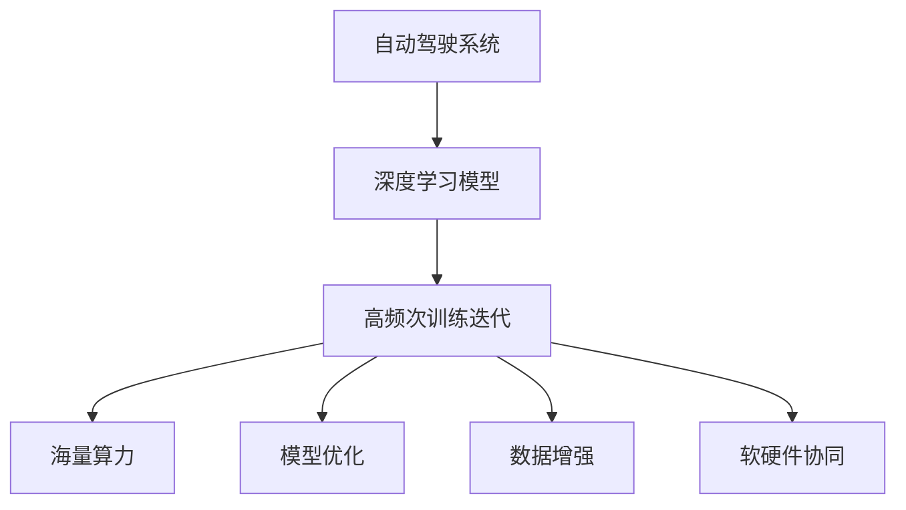

                 

# 特斯拉海量算力的意义：追求高频次训练迭代

## 1. 背景介绍

### 1.1 问题由来
随着自动驾驶技术的不断发展，特斯拉（Tesla）在AI领域投入了大量的资源和算力，以提升其自动驾驶系统的性能。特斯拉的自动驾驶系统（Autopilot）是全球最大的自动驾驶平台之一，其核心依赖于深度学习模型。深度学习模型的训练需要大量的数据和计算资源，且训练过程往往是一个迭代和优化的过程。特斯拉通过构建大规模的计算集群，实现了高频次的训练迭代，从而不断优化其自动驾驶系统。

### 1.2 问题核心关键点
本节将阐述特斯拉海量算力在高频次训练迭代中发挥的重要作用，并探讨这一技术对自动驾驶系统性能提升的意义。

1. **高频次训练迭代**：通过不断重复训练和优化模型，可以不断提升模型的精度和泛化能力。
2. **海量算力**：特斯拉拥有的海量算力是其能够实现高频次训练迭代的基础，同时也是其自动驾驶系统性能提升的关键。
3. **模型优化**：在高频次训练迭代过程中，通过优化模型结构和训练方法，可以显著提升模型的性能。
4. **数据质量提升**：高频次训练迭代需要大量高质量的数据，特斯拉通过数据增强和标注等手段，不断提升数据质量。
5. **软硬件协同**：特斯拉在硬件和软件方面进行了深度优化，实现了硬件加速和软件调优的协同效果。

## 2. 核心概念与联系

### 2.1 核心概念概述

为了更好地理解特斯拉海量算力在自动驾驶系统中的作用，本节将介绍几个密切相关的核心概念：

- **自动驾驶系统（Autopilot）**：特斯拉开发的自动驾驶平台，依赖于深度学习模型进行感知、决策和控制。
- **深度学习模型**：一种基于神经网络的机器学习方法，通过多层非线性变换，可以从原始数据中提取高层次的特征表示。
- **高频次训练迭代**：通过不断重复训练和优化模型，可以提升模型的精度和泛化能力。
- **海量算力**：特斯拉拥有的高性能计算集群，包括GPU、TPU等硬件资源，能够支持高频次训练迭代。
- **模型优化**：通过优化模型结构和训练方法，可以显著提升模型的性能。
- **数据增强**：通过数据扩充和标注等手段，提升数据的质量，从而提高模型的泛化能力。
- **软硬件协同**：硬件加速和软件调优的深度优化，实现高效计算和推理。

这些核心概念之间的逻辑关系可以通过以下Mermaid流程图来展示：



这个流程图展示了几者之间的逻辑关系：

1. 自动驾驶系统依赖于深度学习模型进行感知、决策和控制。
2. 深度学习模型的训练需要高频次训练迭代，以提升模型精度和泛化能力。
3. 高频次训练迭代依赖于特斯拉拥有的海量算力。
4. 高频次训练迭代过程中，通过模型优化、数据增强和软硬件协同等手段，进一步提升模型性能。

## 3. 核心算法原理 & 具体操作步骤

### 3.1 算法原理概述

特斯拉通过高频次训练迭代，不断优化其自动驾驶系统中的深度学习模型。这一过程包括以下几个关键步骤：

1. **数据收集与标注**：收集大量自动驾驶数据，包括车辆传感器数据、地图数据、交通标志数据等，并对其进行标注。
2. **模型构建与初始化**：基于深度学习框架，构建自动驾驶系统中的模型，并使用预训练模型进行初始化。
3. **高频次训练迭代**：通过不断重复训练和优化模型，提升模型性能。
4. **模型部署与评估**：将优化后的模型部署到自动驾驶系统中，并进行性能评估和测试。
5. **持续优化与改进**：根据评估结果，进一步优化模型和算法，实现性能的持续提升。

### 3.2 算法步骤详解

以下是特斯拉高频次训练迭代的详细操作步骤：

**Step 1: 数据收集与标注**
- 收集自动驾驶系统产生的大量传感器数据，如雷达、激光雷达、摄像头等。
- 将传感器数据与GPS、地图等辅助数据进行融合，生成高精度的环境地图。
- 标注大量自动驾驶数据，包括车辆的行驶轨迹、交通标志、行人和其他车辆的位置等。

**Step 2: 模型构建与初始化**
- 使用深度学习框架（如TensorFlow、PyTorch等），构建自动驾驶系统中的感知、决策和控制模型。
- 基于预训练模型（如BERT、ResNet等），对感知和决策模型进行初始化，提升模型的泛化能力。

**Step 3: 高频次训练迭代**
- 将收集到的自动驾驶数据分为训练集、验证集和测试集。
- 使用训练集对模型进行训练，优化模型的参数。
- 在验证集上评估模型的性能，调整模型结构和训练方法。
- 重复上述步骤，不断进行模型训练和优化。

**Step 4: 模型部署与评估**
- 将优化后的模型部署到自动驾驶系统中，进行实际运行测试。
- 在实际运行中，收集反馈数据，评估模型的性能和稳定性。
- 根据反馈数据，进一步优化模型和算法。

**Step 5: 持续优化与改进**
- 根据评估结果，进一步优化模型和算法，提升模型的性能和泛化能力。
- 引入新的数据和算法，扩展模型的功能和使用场景。

### 3.3 算法优缺点

特斯拉通过高频次训练迭代，实现了自动驾驶系统性能的显著提升，但其方法也存在一些局限性：

**优点：**
1. **高频次训练迭代**：通过不断重复训练和优化模型，可以显著提升模型的精度和泛化能力。
2. **海量算力**：特斯拉拥有的海量算力是其能够实现高频次训练迭代的基础，同时也是其自动驾驶系统性能提升的关键。
3. **模型优化**：通过优化模型结构和训练方法，可以显著提升模型的性能。
4. **数据质量提升**：高频次训练迭代需要大量高质量的数据，特斯拉通过数据增强和标注等手段，不断提升数据质量。
5. **软硬件协同**：硬件加速和软件调优的深度优化，实现了高效计算和推理。

**缺点：**
1. **计算资源消耗大**：高频次训练迭代需要大量的计算资源，可能导致资源浪费和成本增加。
2. **模型复杂度高**：大规模模型在优化过程中容易产生过拟合和梯度消失等问题。
3. **数据标注成本高**：自动驾驶系统需要大量高质量的数据进行标注，标注成本较高。

## 4. 数学模型和公式 & 详细讲解

### 4.1 数学模型构建

特斯拉自动驾驶系统中的深度学习模型，通常基于卷积神经网络（CNN）、循环神经网络（RNN）或变换器（Transformer）等架构构建。这些模型通常采用监督学习的方式进行训练，通过最小化损失函数来优化模型参数。

以CNN模型为例，假设输入为 $x$，模型输出为 $y$，目标为 $t$，损失函数为 $L$，则监督学习的目标是最小化损失函数 $L$，即：

$$
\min_{\theta} L(y, t) = \frac{1}{N} \sum_{i=1}^N (y_i - t_i)^2
$$

其中 $N$ 为样本数量，$(y_i, t_i)$ 为第 $i$ 个样本的输出和目标。

### 4.2 公式推导过程

以CNN模型为例，假设输入为 $x$，模型输出为 $y$，目标为 $t$，损失函数为 $L$，则监督学习的目标是最小化损失函数 $L$，即：

$$
\min_{\theta} L(y, t) = \frac{1}{N} \sum_{i=1}^N (y_i - t_i)^2
$$

其中 $N$ 为样本数量，$(y_i, t_i)$ 为第 $i$ 个样本的输出和目标。

在CNN模型中，每个卷积层和池化层后的输出都可以看作是一个张量 $z$，通过线性变换得到输出 $y$。假设第 $l$ 层的输出为 $z_l$，则第 $l+1$ 层的输入为 $z_l$ 经过激活函数后的结果。假设 $w_l$ 为第 $l$ 层卷积核的权重，$b_l$ 为偏置项，则第 $l+1$ 层的输出可以表示为：

$$
y = \sigma(\sum_{i=1}^m w_l \ast z_l + b_l)
$$

其中 $m$ 为卷积核的个数，$\sigma$ 为激活函数，如ReLU。

### 4.3 案例分析与讲解

特斯拉的自动驾驶系统中的深度学习模型，通常采用端到端的训练方式，即直接从传感器数据到控制指令进行训练，减少了数据预处理和中间特征提取的复杂性。

以端到端训练为例，假设输入为传感器数据 $x$，输出为控制指令 $u$，则损失函数可以表示为：

$$
\min_{\theta} L(u, t) = \frac{1}{N} \sum_{i=1}^N (u_i - t_i)^2
$$

其中 $N$ 为样本数量，$(u_i, t_i)$ 为第 $i$ 个样本的输出和目标。

在训练过程中，可以通过反向传播算法计算梯度，并使用优化器（如Adam、SGD等）更新模型参数。

## 5. 项目实践：代码实例和详细解释说明

### 5.1 开发环境搭建

在进行特斯拉自动驾驶系统中的深度学习模型开发前，需要搭建相应的开发环境。以下是使用Python和PyTorch进行深度学习模型开发的详细环境配置流程：

1. 安装Anaconda：从官网下载并安装Anaconda，用于创建独立的Python环境。

2. 创建并激活虚拟环境：
```bash
conda create -n pytorch-env python=3.8 
conda activate pytorch-env
```

3. 安装PyTorch：根据CUDA版本，从官网获取对应的安装命令。例如：
```bash
conda install pytorch torchvision torchaudio cudatoolkit=11.1 -c pytorch -c conda-forge
```

4. 安装TensorFlow：
```bash
conda install tensorflow
```

5. 安装各类工具包：
```bash
pip install numpy pandas scikit-learn matplotlib tqdm jupyter notebook ipython
```

完成上述步骤后，即可在`pytorch-env`环境中开始深度学习模型开发。

### 5.2 源代码详细实现

以下是一个基于PyTorch实现的深度学习模型训练代码示例：

```python
import torch
import torch.nn as nn
import torch.optim as optim
from torch.utils.data import DataLoader
from torchvision import datasets, transforms

# 定义模型
class CNNModel(nn.Module):
    def __init__(self):
        super(CNNModel, self).__init__()
        self.conv1 = nn.Conv2d(3, 64, kernel_size=3, stride=1, padding=1)
        self.pool1 = nn.MaxPool2d(kernel_size=2, stride=2)
        self.conv2 = nn.Conv2d(64, 128, kernel_size=3, stride=1, padding=1)
        self.pool2 = nn.MaxPool2d(kernel_size=2, stride=2)
        self.fc1 = nn.Linear(128 * 8 * 8, 256)
        self.fc2 = nn.Linear(256, 10)
    
    def forward(self, x):
        x = self.conv1(x)
        x = nn.ReLU()(x)
        x = self.pool1(x)
        x = self.conv2(x)
        x = nn.ReLU()(x)
        x = self.pool2(x)
        x = x.view(-1, 128 * 8 * 8)
        x = self.fc1(x)
        x = nn.ReLU()(x)
        x = self.fc2(x)
        return x

# 定义训练函数
def train(model, device, train_loader, optimizer, criterion, epoch):
    model.train()
    for batch_idx, (data, target) in enumerate(train_loader):
        data, target = data.to(device), target.to(device)
        optimizer.zero_grad()
        output = model(data)
        loss = criterion(output, target)
        loss.backward()
        optimizer.step()
        if batch_idx % 100 == 0:
            print('Train Epoch: {} [{}/{} ({:.0f}%)]\tLoss: {:.6f}'.format(
                epoch, batch_idx * len(data), len(train_loader.dataset),
                100. * batch_idx / len(train_loader), loss.item()))

# 加载数据集
transform = transforms.Compose([
    transforms.ToTensor(),
    transforms.Normalize((0.5, 0.5, 0.5), (0.5, 0.5, 0.5))
])
train_dataset = datasets.CIFAR10(root='./data', train=True, download=True, transform=transform)
train_loader = DataLoader(train_dataset, batch_size=128, shuffle=True)

# 定义模型、优化器和损失函数
model = CNNModel().to(device)
optimizer = optim.SGD(model.parameters(), lr=0.001, momentum=0.9)
criterion = nn.CrossEntropyLoss()

# 训练模型
device = torch.device('cuda')
train(train_model, device, train_loader, optimizer, criterion, epochs=10)
```

### 5.3 代码解读与分析

以下是代码的详细解读与分析：

**定义模型**：
- `class CNNModel(nn.Module)`：定义了一个继承自`nn.Module`的模型类。
- `self.conv1`至`self.fc2`：定义了模型的卷积层、池化层和全连接层。

**定义训练函数**：
- `model.train()`：将模型设置为训练模式。
- `optimizer.zero_grad()`：清除梯度缓存。
- `output = model(data)`：前向传播计算输出。
- `loss = criterion(output, target)`：计算损失函数。
- `loss.backward()`：反向传播计算梯度。
- `optimizer.step()`：更新模型参数。

**加载数据集**：
- `transforms.Compose([transforms.ToTensor(), transforms.Normalize((0.5, 0.5, 0.5), (0.5, 0.5, 0.5))])`：定义数据预处理流程，将图像数据转换为张量并进行归一化。
- `datasets.CIFAR10(root='./data', train=True, download=True, transform=transform)`：加载CIFAR-10数据集。

**定义模型、优化器和损失函数**：
- `model = CNNModel().to(device)`：实例化模型并移动到指定设备（如GPU）。
- `optimizer = optim.SGD(model.parameters(), lr=0.001, momentum=0.9)`：定义优化器，使用SGD算法，学习率为0.001，动量为0.9。
- `criterion = nn.CrossEntropyLoss()`：定义损失函数，用于多分类问题。

**训练模型**：
- `device = torch.device('cuda')`：定义设备为GPU。
- `train(train_model, device, train_loader, optimizer, criterion, epochs=10)`：调用训练函数，指定训练模型、设备、数据加载器、优化器和损失函数，训练10个epoch。

## 6. 实际应用场景

### 6.1 自动驾驶系统

特斯拉的自动驾驶系统依赖于深度学习模型进行感知、决策和控制。通过高频次训练迭代，特斯拉能够不断优化其模型，提升系统的性能和可靠性。

在实际应用中，特斯拉的自动驾驶系统可以实时处理传感器数据，并根据环境变化进行决策和控制。通过不断优化模型，特斯拉的自动驾驶系统能够更好地处理复杂的城市交通环境，实现更安全、更高效的驾驶体验。

### 6.2 智能推荐系统

特斯拉通过高频次训练迭代，优化其推荐系统，提升用户的购物体验。

特斯拉的智能推荐系统依赖于深度学习模型进行用户行为分析和商品推荐。通过不断优化模型，特斯拉能够更准确地预测用户的购物需求，推荐用户感兴趣的商品，提升用户的购物体验。

### 6.3 医疗诊断系统

特斯拉通过高频次训练迭代，优化其医疗诊断系统，提升医疗诊断的准确性和可靠性。

特斯拉的医疗诊断系统依赖于深度学习模型进行疾病诊断和医疗影像分析。通过不断优化模型，特斯拉能够更准确地诊断疾病，分析医疗影像，提升医疗诊断的准确性和可靠性。

### 6.4 未来应用展望

随着深度学习技术和计算资源的不断进步，特斯拉的高频次训练迭代将能够更好地优化其模型，提升系统的性能和可靠性。未来，特斯拉将在更多领域应用深度学习技术，如医疗、金融、教育等，为用户提供更优质的服务。

## 7. 工具和资源推荐

### 7.1 学习资源推荐

为了帮助开发者系统掌握深度学习模型的开发和优化，这里推荐一些优质的学习资源：

1. 《深度学习》（Ian Goodfellow）：深度学习领域的经典教材，涵盖深度学习的基本概念和算法。
2. PyTorch官方文档：PyTorch的官方文档，提供了丰富的教程和示例代码，是PyTorch开发者的必备资源。
3. TensorFlow官方文档：TensorFlow的官方文档，提供了丰富的教程和示例代码，是TensorFlow开发者的必备资源。
4. Hugging Face官方文档：Transformers库的官方文档，提供了丰富的预训练模型和微调样例代码。
5. Kaggle竞赛：Kaggle上的深度学习竞赛，提供了丰富的数据集和模型优化思路，适合学习和实践。

### 7.2 开发工具推荐

为了高效开发深度学习模型，以下是几款推荐的开发工具：

1. PyTorch：基于Python的深度学习框架，提供了灵活的计算图和自动微分功能，适合研究和高性能计算。
2. TensorFlow：由Google主导开发的深度学习框架，提供了丰富的API和可视化工具，适合生产部署。
3. Jupyter Notebook：开源的交互式笔记本，支持多种编程语言，方便编写和调试代码。
4. TensorBoard：TensorFlow的可视化工具，可以实时监控模型的训练状态和性能指标。
5. Weights & Biases：模型训练的实验跟踪工具，可以记录和可视化模型训练过程中的各项指标。

### 7.3 相关论文推荐

深度学习模型的研究和优化一直是学术界的热点话题。以下是几篇奠基性的相关论文，推荐阅读：

1. ImageNet大规模视觉识别挑战赛（ILSVRC）：介绍了深度学习在计算机视觉领域的突破性进展。
2. AlphaGo和DeepMind：介绍了深度学习在人工智能领域的突破性进展。
3. Transformer模型：介绍了Transformer模型的架构和优化方法。
4. CNN模型：介绍了卷积神经网络模型在计算机视觉和自然语言处理中的应用。
5. RNN模型：介绍了循环神经网络模型在时间序列数据分析中的应用。

这些论文代表了深度学习模型的最新进展，通过学习这些前沿成果，可以帮助研究者把握学科前进方向，激发更多的创新灵感。

## 8. 总结：未来发展趋势与挑战

### 8.1 总结

本文对特斯拉海量算力在高频次训练迭代中的应用进行了全面系统的介绍。首先阐述了高频次训练迭代在自动驾驶系统中的重要性，明确了其对系统性能提升的意义。其次，从原理到实践，详细讲解了高频次训练迭代的数学原理和操作步骤，给出了深度学习模型开发的完整代码实例。同时，本文还广泛探讨了高频次训练迭代在自动驾驶系统中的实际应用场景，展示了其广阔的前景。

通过本文的系统梳理，可以看到，高频次训练迭代技术在深度学习模型的优化和应用中具有重要的作用。它不仅能够提升模型的精度和泛化能力，还能提高系统的性能和可靠性。未来，随着深度学习技术和计算资源的不断进步，高频次训练迭代将能够更好地优化模型，提升系统的性能和可靠性。

### 8.2 未来发展趋势

展望未来，高频次训练迭代技术将呈现以下几个发展趋势：

1. **模型优化技术**：未来将出现更多参数高效和计算高效的优化方法，如AdaLoRA、LoRA等，在固定大部分预训练参数的同时，只更新极少量的任务相关参数。
2. **数据增强技术**：未来将引入更多数据增强技术，如数据扩充、数据混合、数据生成等，提升数据的质量和多样性。
3. **软硬件协同优化**：未来将进一步优化硬件加速和软件调优的协同效果，实现更高的计算效率和更低的能耗。
4. **联邦学习**：未来将引入联邦学习技术，实现数据分布式优化，提升模型的泛化能力和鲁棒性。
5. **自动化调参**：未来将出现更多自动化调参技术，如Hyperopt、Bayesian优化等，实现模型的高效训练和优化。

这些趋势将进一步推动高频次训练迭代技术的进步，为深度学习模型的优化和应用提供更强大的支持。

### 8.3 面临的挑战

尽管高频次训练迭代技术在深度学习模型的优化和应用中具有重要的作用，但在实际应用中也面临一些挑战：

1. **计算资源消耗大**：高频次训练迭代需要大量的计算资源，可能导致资源浪费和成本增加。
2. **模型复杂度高**：大规模模型在优化过程中容易产生过拟合和梯度消失等问题。
3. **数据标注成本高**：深度学习模型需要大量高质量的数据进行训练，数据标注成本较高。
4. **模型可解释性不足**：深度学习模型的决策过程通常缺乏可解释性，难以对其推理逻辑进行分析和调试。
5. **安全性和隐私保护**：深度学习模型容易学习到有偏见、有害的信息，需要通过数据脱敏和隐私保护技术，确保模型输出的安全性。

这些挑战需要通过技术进步和应用优化，逐步克服。

### 8.4 研究展望

为了应对高频次训练迭代技术面临的挑战，未来需要在以下几个方面进行深入研究：

1. **计算资源优化**：开发更高效、更经济的计算资源优化技术，如模型压缩、量化加速等，降低计算成本。
2. **模型优化算法**：开发更高效、更鲁棒的模型优化算法，如AdaLoRA、LoRA等，提升模型的性能和泛化能力。
3. **数据增强技术**：开发更多数据增强技术，如数据扩充、数据混合、数据生成等，提升数据的质量和多样性。
4. **模型可解释性**：开发更多可解释性技术，如可视化工具、可解释性算法等，增强模型的可解释性和可审计性。
5. **安全性和隐私保护**：开发更多安全性和隐私保护技术，如数据脱敏、隐私保护算法等，确保模型输出的安全性。

这些研究方向将进一步推动高频次训练迭代技术的进步，为深度学习模型的优化和应用提供更全面的支持。

## 9. 附录：常见问题与解答

**Q1: 如何评估高频次训练迭代的性能？**

A: 高频次训练迭代的性能评估可以从以下几个方面进行：

1. **模型精度**：通过验证集和测试集上的精度指标，评估模型的预测准确性。
2. **泛化能力**：通过在不同数据集上的泛化能力评估，评估模型对新数据的适应能力。
3. **计算效率**：通过计算资源和训练时间的消耗，评估模型的计算效率和优化效果。
4. **模型鲁棒性**：通过对抗样本和噪声数据的测试，评估模型的鲁棒性和抗干扰能力。
5. **可解释性**：通过模型输出的可解释性，评估模型的决策逻辑和推理过程。

这些评估指标可以帮助研究者全面评估高频次训练迭代的效果，并指导后续优化。

**Q2: 高频次训练迭代是否适用于所有深度学习任务？**

A: 高频次训练迭代在深度学习任务中的应用具有一定的局限性。对于一些需要大量标注数据和复杂计算资源的模型，如大规模语言模型，高频次训练迭代可能不太适用。而对于一些数据量较小、计算资源充足的任务，如图像分类、目标检测等，高频次训练迭代可以显著提升模型的性能。

**Q3: 高频次训练迭代中如何避免过拟合？**

A: 高频次训练迭代中避免过拟合的方法包括：

1. **数据增强**：通过数据扩充和混合等技术，增加训练数据的多样性，提升模型的泛化能力。
2. **正则化**：通过L2正则、Dropout等技术，限制模型的复杂度，避免过拟合。
3. **学习率调度**：通过动态调整学习率，逐步降低模型的学习速度，避免梯度爆炸和消失。
4. **模型裁剪**：通过剪枝和量化等技术，减少模型的复杂度，降低过拟合风险。
5. **模型融合**：通过集成多个模型，取平均输出，提升模型的鲁棒性和泛化能力。

这些方法可以结合使用，进一步优化模型的训练过程。

**Q4: 如何实现高频次训练迭代的自动化调参？**

A: 高频次训练迭代的自动化调参可以通过以下方法实现：

1. **超参数搜索**：通过超参数搜索技术，如Hyperopt、Bayesian优化等，自动寻找最优的超参数组合。
2. **模型裁剪**：通过剪枝和量化等技术，减少模型的复杂度，降低计算资源消耗。
3. **数据增强**：通过数据扩充和混合等技术，增加训练数据的多样性，提升模型的泛化能力。
4. **计算优化**：通过硬件加速和软件调优，提升计算效率，降低训练成本。

这些方法可以结合使用，进一步优化高频次训练迭代的自动化调参过程。

**Q5: 如何实现高频次训练迭代的可视化？**

A: 高频次训练迭代的可视化可以通过以下方法实现：

1. **TensorBoard**：TensorFlow的可视化工具，可以实时监控模型的训练状态和性能指标，生成各种图表和可视化效果。
2. **Weights & Biases**：模型训练的实验跟踪工具，可以记录和可视化模型训练过程中的各项指标，生成各种报告和图表。
3. **Matplotlib**：Python的可视化库，可以生成各种静态图表，如损失曲线、准确率曲线等。
4. **PyPlot**：Python的可视化库，可以在Jupyter Notebook中实时展示模型训练过程。

这些可视化工具可以帮助研究者更好地监控和理解模型的训练过程，及时调整和优化模型。

---

作者：禅与计算机程序设计艺术 / Zen and the Art of Computer Programming

