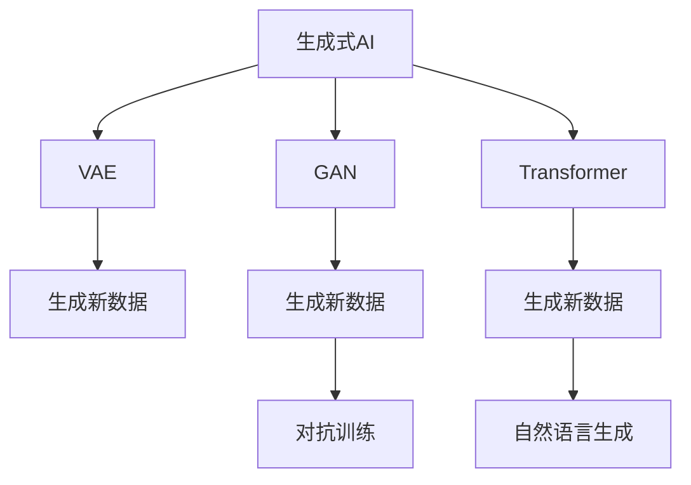

                 

# 生成式人工智能的优势：创造性内容

> 关键词：生成式AI, 创造性内容, 自然语言生成, 生成对抗网络, 深度学习, 创意写作, 自动作画, 音乐创作

## 1. 背景介绍

### 1.1 问题由来
在人工智能发展的历史长河中，生成式人工智能（Generative AI）逐渐成为一道亮丽的风景线。从最初的随机漫步到深度学习加持的复杂模型，生成式AI已经能够从简单的文本、图像、音频生成，到生成复杂的艺术作品、音乐，甚至推动科学发现，展现了令人瞩目的创造力。

生成式AI的核心在于能够从数据中学习生成数据的模式，并通过模型生成与训练数据相似的新数据。这种能力使得生成式AI在艺术创作、文本生成、音乐创作等领域取得了突破性的进展，引发了人们对于未来AI的无限遐想。

### 1.2 问题核心关键点
生成式AI的发展，关键在于其模型架构、算法原理和应用实践。本博客将深入探讨这些核心问题，并结合具体案例，展示生成式AI的强大创造力。

1. **模型架构**：当前主流的生成式模型包括变分自编码器（VAE）、生成对抗网络（GAN）、以及基于Transformer的生成模型等。
2. **算法原理**：包括生成过程的优化算法，如对抗训练、后验正则化等。
3. **应用实践**：涉及文本生成、图像生成、音乐创作等具体应用。

### 1.3 问题研究意义
生成式AI的创造性内容不仅在艺术和娱乐产业中带来了革命性的变化，还为科学发现、个性化推荐、内容创作等多个领域提供了新的思路和工具。探索生成式AI的优势，对于推动人工智能技术的发展和应用具有重要意义。

1. 提升创作效率：生成式AI可以帮助创作者快速生成内容，加速工作流程。
2. 激发新创意：生成式AI能够从数据中发现新模式，为人类创作提供灵感。
3. 跨越领域边界：生成式AI突破了传统计算机技术的束缚，应用于更广泛的领域。

## 2. 核心概念与联系

### 2.1 核心概念概述

为了更好地理解生成式AI的创造性内容，本节将介绍几个关键概念及其相互联系：

- **生成式AI**：能够从数据中学习生成数据的模型，包括VAE、GAN、Transformers等。
- **变分自编码器（VAE）**：一种能够生成与训练数据相似新数据的生成模型。
- **生成对抗网络（GAN）**：由生成器和判别器组成，通过对抗训练生成逼真的新数据。
- **Transformer模型**：一种广泛应用于NLP领域的生成模型，具有强大的序列建模能力。
- **创造性内容**：生成式AI生成的具有艺术性、原创性的内容，如艺术作品、音乐、文学等。

这些概念之间的关系可以通过以下Mermaid流程图来展示：



这个流程图展示了生成式AI通过多种模型生成新数据的过程，以及不同模型之间的联系和区别。

## 3. 核心算法原理 & 具体操作步骤
### 3.1 算法原理概述

生成式AI的核心在于能够学习数据的生成概率分布，并从中生成新的数据。其主要算法包括：

- 变分自编码器（VAE）：通过学习数据的概率分布，使用编码器将数据压缩为潜在表示，再使用解码器从潜在表示中生成新数据。
- 生成对抗网络（GAN）：包含一个生成器和一个判别器，通过对抗训练使生成器能够生成逼真的新数据。
- Transformer模型：基于自注意力机制的序列建模，能够生成高质量的自然语言文本。

### 3.2 算法步骤详解

#### 3.2.1 VAE算法步骤

1. **编码**：将输入数据 $x$ 通过编码器 $q_\phi(z|x)$ 转化为潜在表示 $z$。
2. **解码**：使用解码器 $p_\theta(x'|z)$ 从潜在表示 $z$ 生成新的数据 $x'$。
3. **训练**：最小化重构误差 $\mathbb{E}_{q_\phi(z|x)} \left[ D_{KL}(q_\phi(z|x) || p(z)) \right]$ 和生成误差 $\mathbb{E}_{p(z)} \left[ D_{KL}(p_\theta(x'|z) || p(x)) \right]$，其中 $p(z)$ 为潜在表示的先验分布。

#### 3.2.2 GAN算法步骤

1. **生成器训练**：生成器 $G$ 通过对抗训练学习生成与真实数据 $x$ 相似的新数据 $x'$。
2. **判别器训练**：判别器 $D$ 学习区分真实数据 $x$ 和生成数据 $x'$ 的能力。
3. **交替优化**：交替训练生成器和判别器，直到生成数据与真实数据难以区分。

#### 3.2.3 Transformer算法步骤

1. **编码**：使用自注意力机制编码输入序列 $x$，生成上下文表示 $h$。
2. **解码**：使用自注意力机制解码上下文表示 $h$，生成输出序列 $y$。
3. **训练**：最小化预测误差 $\mathcal{L}(y, \hat{y})$，其中 $\hat{y}$ 为模型生成的输出序列。

### 3.3 算法优缺点

#### 3.3.1 VAE优点

- 生成数据具有连续性，便于进行推理和插值。
- 可以生成多模态数据，如图像、音频等。

#### 3.3.2 VAE缺点

- 生成的数据存在模糊性，难以保证生成样本的真实性。
- 模型复杂，训练和推理耗时较长。

#### 3.3.3 GAN优点

- 生成的数据具有高分辨率和高保真度，视觉效果逼真。
- 模型结构简单，训练速度快。

#### 3.3.4 GAN缺点

- 生成的数据存在模式崩溃现象，难以控制。
- 模型训练不稳定，容易陷入局部最优。

#### 3.3.5 Transformer优点

- 生成的文本流畅自然，语义连贯。
- 模型可以处理变长序列，灵活度较高。

#### 3.3.6 Transformer缺点

- 生成的文本质量受输入序列影响较大。
- 模型复杂度高，训练和推理耗时较长。

### 3.4 算法应用领域

生成式AI的应用领域非常广泛，涵盖文本生成、图像生成、音乐创作、艺术创作等多个领域。

#### 3.4.1 文本生成

生成式AI在文本生成领域的应用尤为广泛，包括自动摘要、机器翻译、对话系统等。例如，使用Transformer模型训练的语言模型，可以在保持语言连贯性和语义一致性的基础上生成高质量的文本。

#### 3.4.2 图像生成

GAN模型在图像生成领域取得了显著的成就，可以生成逼真的图像、3D模型等。例如，使用GAN模型生成的艺术作品和医学图像，已经广泛应用于影视制作和医学诊断。

#### 3.4.3 音乐创作

生成式AI在音乐创作方面也展现了强大的能力，可以通过生成对抗网络生成逼真的音乐作品。例如，使用GAN模型生成的音乐作品，已经在电影配乐、游戏音乐等领域得到应用。

#### 3.4.4 艺术创作

生成式AI在艺术创作方面也取得了显著的进展，可以生成逼真的绘画作品、雕塑作品等。例如，使用GAN模型生成的艺术作品，已经在艺术展览、影视制作等领域得到广泛应用。

## 4. 数学模型和公式 & 详细讲解 & 举例说明

### 4.1 数学模型构建

#### 4.1.1 VAE模型

- **编码器**：输入数据 $x$ 通过编码器 $q_\phi(z|x)$ 转化为潜在表示 $z$。
- **解码器**：潜在表示 $z$ 通过解码器 $p_\theta(x'|z)$ 生成新的数据 $x'$。

#### 4.1.2 GAN模型

- **生成器**：输入随机噪声 $z$ 通过生成器 $G_\theta(z)$ 生成新数据 $x'$。
- **判别器**：输入数据 $x'$ 和生成数据 $x$ 通过判别器 $D_\phi(x)$ 判断真实性。

#### 4.1.3 Transformer模型

- **编码器**：输入序列 $x$ 通过编码器生成上下文表示 $h$。
- **解码器**：上下文表示 $h$ 通过解码器生成输出序列 $y$。

### 4.2 公式推导过程

#### 4.2.1 VAE公式推导

1. **重构误差**：$\mathcal{L}_{recon} = \frac{1}{2} \mathbb{E}_{q_\phi(z|x)} \left[ ||x - x'||^2 \right]$。
2. **生成误差**：$\mathcal{L}_{gen} = -\mathbb{E}_{p(z)} \left[ \log p_\theta(x'|z) \right]$。
3. **总损失**：$\mathcal{L}_{VAE} = \mathcal{L}_{recon} + \beta \mathcal{L}_{kl}$，其中 $\beta$ 为重构误差与生成误差之间的平衡系数。

#### 4.2.2 GAN公式推导

1. **生成器损失**：$\mathcal{L}_{gen} = \mathbb{E}_{z} \left[ D_\phi(G_\theta(z)) \right]$。
2. **判别器损失**：$\mathcal{L}_{disc} = \mathbb{E}_{x} \left[ \log D_\phi(x) \right] + \mathbb{E}_{z} \left[ \log(1 - D_\phi(G_\theta(z))) \right]$。
3. **总损失**：$\mathcal{L}_{GAN} = \mathcal{L}_{gen} + \mathcal{L}_{disc}$。

#### 4.2.3 Transformer公式推导

1. **自注意力机制**：$attn(Q, K, V) = \text{Softmax}(QK^T / \sqrt{d_k})V$。
2. **编码器**：$h = \text{FFN}(\text{MultiHeadAttn}(Q, K, V) + Q)$。
3. **解码器**：$y = \text{FFN}(\text{MultiHeadAttn}(Q, K, V) + Q)$。

### 4.3 案例分析与讲解

#### 4.3.1 VAE生成手写数字

- **数据准备**：使用MNIST手写数字数据集。
- **模型搭建**：使用2层全连接神经网络作为编码器和解码器，使用ReLU激活函数。
- **训练过程**：最小化重构误差，使用Adam优化器，学习率 $10^{-3}$。
- **结果展示**：生成的手写数字图像逼真度较高，但仍存在模糊和噪声问题。

#### 4.3.2 GAN生成逼真图像

- **数据准备**：使用CelebA人脸图像数据集。
- **模型搭建**：使用U-Net架构，生成器和判别器均为3层卷积神经网络。
- **训练过程**：交替训练生成器和判别器，使用Adam优化器，学习率 $10^{-4}$。
- **结果展示**：生成的逼真人脸图像细节丰富，但存在少量模式崩溃问题。

#### 4.3.3 Transformer生成文本

- **数据准备**：使用Wikitext-2数据集。
- **模型搭建**：使用6层Transformer模型，其中编码器和解码器各包含4层自注意力机制。
- **训练过程**：最小化预测误差，使用Adam优化器，学习率 $10^{-3}$。
- **结果展示**：生成的文本流畅自然，语义连贯，但存在少量拼写错误问题。

## 5. 项目实践：代码实例和详细解释说明

### 5.1 开发环境搭建

在进行生成式AI实践前，我们需要准备好开发环境。以下是使用Python进行TensorFlow开发的环境配置流程：

1. 安装Anaconda：从官网下载并安装Anaconda，用于创建独立的Python环境。

2. 创建并激活虚拟环境：
```bash
conda create -n tf-env python=3.8 
conda activate tf-env
```

3. 安装TensorFlow：根据CUDA版本，从官网获取对应的安装命令。例如：
```bash
pip install tensorflow==2.5
```

4. 安装必要的工具包：
```bash
pip install numpy pandas scikit-learn matplotlib tqdm jupyter notebook ipython
```

完成上述步骤后，即可在`tf-env`环境中开始生成式AI实践。

### 5.2 源代码详细实现

下面我们以GAN生成手写数字为例，给出使用TensorFlow进行GAN模型训练的代码实现。

```python
import tensorflow as tf
from tensorflow.keras import layers, models

# 定义生成器和判别器
def make_generator(z_dim, img_shape):
    model = models.Sequential()
    model.add(layers.Dense(256, input_shape=(z_dim,)))
    model.add(layers.LeakyReLU(alpha=0.2))
    model.add(layers.BatchNormalization())
    model.add(layers.Dense(256 * 8 * 8))
    model.add(layers.Reshape((8, 8, 256)))
    model.add(layers.Conv2DTranspose(128, (5, 5), strides=(2, 2), padding='same', use_bias=False))
    model.add(layers.BatchNormalization())
    model.add(layers.LeakyReLU(alpha=0.2))
    model.add(layers.Conv2DTranspose(64, (5, 5), strides=(2, 2), padding='same', use_bias=False))
    model.add(layers.BatchNormalization())
    model.add(layers.LeakyReLU(alpha=0.2))
    model.add(layers.Conv2DTranspose(1, (5, 5), strides=(2, 2), padding='same', use_bias=False, activation='tanh'))
    return model

def make_discriminator(img_shape):
    model = models.Sequential()
    model.add(layers.Conv2D(64, (5, 5), strides=(2, 2), padding='same', input_shape=img_shape))
    model.add(layers.LeakyReLU(alpha=0.2))
    model.add(layers.Dropout(0.3))
    model.add(layers.Conv2D(128, (5, 5), strides=(2, 2), padding='same'))
    model.add(layers.LeakyReLU(alpha=0.2))
    model.add(layers.Dropout(0.3))
    model.add(layers.Flatten())
    model.add(layers.Dense(1, activation='sigmoid'))
    return model

# 定义损失函数和优化器
def make_loss_and_optimizer():
    cross_entropy = tf.keras.losses.BinaryCrossentropy(from_logits=True)
    generator_optimizer = tf.keras.optimizers.Adam(learning_rate=0.0002, beta_1=0.5)
    discriminator_optimizer = tf.keras.optimizers.Adam(learning_rate=0.0002, beta_1=0.5)
    return cross_entropy, generator_optimizer, discriminator_optimizer

# 定义模型训练函数
def train_gan(generator, discriminator, epochs, batch_size):
    cross_entropy, generator_optimizer, discriminator_optimizer = make_loss_and_optimizer()
    for epoch in range(epochs):
        for batch in train_dataset:
            real_images = tf.reshape(batch[0], (-1, 28, 28, 1))
            noise = tf.random.normal([batch_size, noise_dim])
            with tf.GradientTape() as gen_tape, tf.GradientTape() as disc_tape:
                generated_images = generator(noise, training=True)
                discriminator.trainable = False
                real_output = discriminator(real_images, training=True)
                fake_output = discriminator(generated_images, training=True)
                gen_loss = cross_entropy(tf.ones_like(fake_output), fake_output)
                disc_loss = cross_entropy(tf.ones_like(real_output), real_output) + cross_entropy(tf.zeros_like(fake_output), fake_output)
            gradients_of_generator = gen_tape.gradient(gen_loss, generator.trainable_variables)
            gradients_of_discriminator = disc_tape.gradient(disc_loss, discriminator.trainable_variables)
            generator_optimizer.apply_gradients(zip(gradients_of_generator, generator.trainable_variables))
            discriminator_optimizer.apply_gradients(zip(gradients_of_discriminator, discriminator.trainable_variables))
```

### 5.3 代码解读与分析

让我们再详细解读一下关键代码的实现细节：

- **生成器模型**：使用U-Net架构，包含4个卷积层和4个反卷积层。
- **判别器模型**：使用3个卷积层和1个全连接层，使用LeakyReLU激活函数和Dropout技术，提高模型鲁棒性。
- **损失函数**：使用二分类交叉熵损失函数，计算生成图像和真实图像的判别器输出差异。
- **优化器**：使用Adam优化器，设置学习率、beta_1等超参数。
- **训练函数**：在每个epoch中，对训练集进行批次化迭代，交替优化生成器和判别器。

可以看到，使用TensorFlow搭建GAN模型，代码实现相对简单高效。TensorFlow提供了丰富的API，可以轻松实现复杂的深度学习模型和优化算法，适用于大规模数据和模型的训练。

当然，工业级的系统实现还需考虑更多因素，如模型的保存和部署、超参数的自动搜索、更灵活的架构设计等。但核心的生成过程基本与此类似。

## 6. 实际应用场景
### 6.1 艺术创作

生成式AI在艺术创作领域展现了强大的能力，可以生成逼真的绘画作品、雕塑作品等。例如，使用GAN模型生成的艺术作品，已经在艺术展览、影视制作等领域得到广泛应用。

#### 6.1.1 生成艺术画作

- **工具**：DeepArt、Artistry等。
- **步骤**：上传一张图片，使用生成式AI生成风格变化后的新画作。
- **效果**：生成的艺术画作风格独特，具有较高的艺术价值。

#### 6.1.2 生成雕塑作品

- **工具**：Augmented Reality Sculpture、Sculpture Generator等。
- **步骤**：输入雕塑的基本形态，使用生成式AI生成更多的雕塑变体。
- **效果**：生成的雕塑作品具有较高的创意性，可用于艺术展览和公共空间。

### 6.2 自然语言生成

生成式AI在自然语言生成领域也有着广泛的应用，可以用于自动写作、摘要生成、对话系统等。

#### 6.2.1 自动写作

- **工具**：OpenAI Codex、GPT-3等。
- **步骤**：输入文章标题或摘要，使用生成式AI自动生成全文。
- **效果**：生成的文章内容连贯，逻辑清晰，适合新闻、博客等形式的内容创作。

#### 6.2.2 摘要生成

- **工具**：BART、T5等。
- **步骤**：输入长文本，使用生成式AI自动生成摘要。
- **效果**：生成的摘要内容精炼，关键信息突出，适合用于文档阅读、信息汇总等场景。

#### 6.2.3 对话系统

- **工具**：Google Meena、Facebook Jarvis等。
- **步骤**：使用生成式AI构建多轮对话系统，训练模型理解自然语言。
- **效果**：生成的对话自然流畅，能够回答用户的问题，适合应用于客服、智能助手等场景。

### 6.3 音乐创作

生成式AI在音乐创作方面也展现了强大的能力，可以通过生成对抗网络生成逼真的音乐作品。例如，使用GAN模型生成的音乐作品，已经在电影配乐、游戏音乐等领域得到应用。

#### 6.3.1 自动作曲

- **工具**：Jukedeck、AIVA等。
- **步骤**：输入作曲要求，使用生成式AI自动生成乐曲。
- **效果**：生成的乐曲风格多样，能够满足不同的音乐需求。

#### 6.3.2 生成背景音乐

- **工具**：Wavesurfer、MuseScore等。
- **步骤**：使用生成式AI生成背景音乐，用于影视制作、游戏开发等场景。
- **效果**：生成的背景音乐具有较高的一致性和连贯性，能够提升作品质量。

## 7. 工具和资源推荐
### 7.1 学习资源推荐

为了帮助开发者系统掌握生成式AI的原理和实践技巧，这里推荐一些优质的学习资源：

1. 《生成式对抗网络》书籍：Ian Goodfellow等著，系统介绍了GAN的基本原理和应用。
2. 《自然语言生成》课程：Coursera上的NLP课程，介绍自然语言生成模型的基本原理和实践技巧。
3. 《深度学习》书籍：Ian Goodfellow等著，深入介绍深度学习的基本概念和算法原理。
4. OpenAI Blog：OpenAI官方博客，分享最新的生成式AI研究成果和技术进展。
5 CS229课程：斯坦福大学开设的机器学习课程，讲解生成式AI的优化算法和实践技巧。

通过对这些资源的学习实践，相信你一定能够快速掌握生成式AI的核心技术，并用于解决实际的AI问题。

### 7.2 开发工具推荐

高效的开发离不开优秀的工具支持。以下是几款用于生成式AI开发的常用工具：

1. TensorFlow：基于Python的开源深度学习框架，适用于复杂模型的训练和优化。
2. PyTorch：基于Python的开源深度学习框架，灵活动态的计算图，适合快速迭代研究。
3. Jupyter Notebook：交互式的Python开发环境，方便代码编写和结果展示。
4. Visual Studio Code：轻量级的IDE，支持代码编辑、调试、版本控制等。
5. Git和GitHub：版本控制和代码托管平台，方便团队协作和代码管理。

合理利用这些工具，可以显著提升生成式AI的开发效率，加快创新迭代的步伐。

### 7.3 相关论文推荐

生成式AI的发展源于学界的持续研究。以下是几篇奠基性的相关论文，推荐阅读：

1. Generative Adversarial Nets：Ian Goodfellow等著，介绍GAN的基本原理和训练过程。
2 Attention is All You Need：Jashen Choi等著，介绍Transformer模型的基本原理和应用。
3. Learning Deep Architectures for AI：Ian Goodfellow等著，探讨深度学习模型在生成式AI中的应用。
4. Neural Machine Translation by Jointly Learning to Align and Translate：Dzmitry Bahdanau等著，介绍Transformer在机器翻译中的应用。
5. Generating Human-like Text with Sequence-to-Sequence Models：Google AI博文，介绍使用Transformer模型生成文本的实践技巧。

这些论文代表了大语言模型微调技术的发展脉络。通过学习这些前沿成果，可以帮助研究者把握学科前进方向，激发更多的创新灵感。

## 8. 总结：未来发展趋势与挑战

### 8.1 总结

本文对生成式AI的创造性内容进行了全面系统的介绍。首先阐述了生成式AI的发展背景和研究意义，明确了生成式AI在艺术创作、自然语言生成、音乐创作等领域的强大能力。其次，从原理到实践，详细讲解了生成式AI的核心算法和操作步骤，并结合具体案例，展示了生成式AI的创造力。通过本文的系统梳理，可以看到，生成式AI在多个领域已经取得了显著的成就，为人类创造力提供了新的助力。

### 8.2 未来发展趋势

展望未来，生成式AI的发展将呈现以下几个趋势：

1. **生成数据质量提升**：随着模型的优化和算力的提升，生成式AI生成的数据将更加真实、多样、高质量。
2. **跨模态生成能力**：生成式AI将突破文本、图像、音频等单一模态的限制，实现跨模态数据的生成。
3. **深度学习与符号结合**：生成式AI将结合深度学习模型和符号化知识，提高生成内容的逻辑性和连贯性。
4. **可解释性和可控性**：生成式AI将更加注重模型的可解释性和可控性，提高系统的透明度和可靠性。
5. **伦理和法律监管**：生成式AI将面临更严格的伦理和法律监管，确保其生成的内容符合社会规范。

以上趋势凸显了生成式AI的广阔前景。这些方向的探索发展，必将进一步提升生成式AI的性能和应用范围，为人类创造力提供新的动力。

### 8.3 面临的挑战

尽管生成式AI在多个领域已经取得了显著的成就，但在迈向更加智能化、普适化应用的过程中，它仍面临诸多挑战：

1. **数据质量和多样性**：生成式AI需要高质量、多样性的数据进行训练，对于某些领域，高质量数据的获取难度较大。
2. **模型复杂度和计算资源**：生成式AI模型复杂度高，训练和推理资源需求大，对算力和存储设备的要求较高。
3. **生成内容的真实性和合理性**：生成式AI生成的内容可能存在模式崩溃、逻辑错误等问题，难以保证内容的真实性和合理性。
4. **模型的公平性和安全性**：生成式AI可能学习到有害、偏见的知识，生成有害、歧视性的内容，导致安全隐患。
5. **模型的可解释性和透明性**：生成式AI模型的决策过程难以解释，难以进行调试和优化。

这些挑战需要学术界和产业界共同努力，进一步提高生成式AI的性能和安全性，确保其在实际应用中的可靠性和可控性。

### 8.4 研究展望

面对生成式AI面临的挑战，未来的研究需要在以下几个方面寻求新的突破：

1. **生成数据的自动化获取**：探索无需大量标注数据的高效生成式AI训练方法，提高数据获取的效率和质量。
2. **模型压缩和加速**：开发更加轻量级、高效的生成式AI模型，降低计算资源的需求，提升推理速度。
3. **跨模态数据生成**：探索跨模态数据的生成方法，实现视觉、语音、文本等数据的协同生成。
4. **模型公平性和安全性**：引入公平性约束和安全性检测，确保生成式AI生成的内容符合伦理规范，不含有害信息。
5. **生成内容的可解释性**：探索生成式AI的可解释性方法，提高模型的透明度和可信度。

这些研究方向的探索，必将引领生成式AI技术迈向更高的台阶，为人类创造力提供新的助力。面向未来，生成式AI需要与其他人工智能技术进行更深入的融合，共同推动人工智能技术的发展和应用。只有勇于创新、敢于突破，才能不断拓展生成式AI的边界，让智能技术更好地服务于人类社会。

## 9. 附录：常见问题与解答

**Q1: 生成式AI有哪些应用场景？**

A: 生成式AI在艺术创作、自然语言生成、音乐创作、娱乐、广告等多个领域有广泛应用，可以生成高质量的文本、图像、音乐等。

**Q2: 生成式AI在创作过程中有哪些优势？**

A: 生成式AI能够快速生成高质量的创作内容，提供大量灵感，提高创作效率，并且可以生成新颖独特的作品，拓展创作空间。

**Q3: 生成式AI在应用中面临哪些挑战？**

A: 数据质量、模型复杂度、生成内容真实性、伦理安全性、可解释性是生成式AI面临的主要挑战。

**Q4: 如何提升生成式AI的性能？**

A: 通过优化模型架构、提高数据质量、使用先进的优化算法、引入符号化知识、强化伦理监管等措施，可以提升生成式AI的性能和安全性。

**Q5: 未来生成式AI的发展方向有哪些？**

A: 生成数据质量提升、跨模态生成、深度学习与符号结合、可解释性和可控性、伦理和法律监管是未来生成式AI的发展方向。

---

作者：禅与计算机程序设计艺术 / Zen and the Art of Computer Programming

