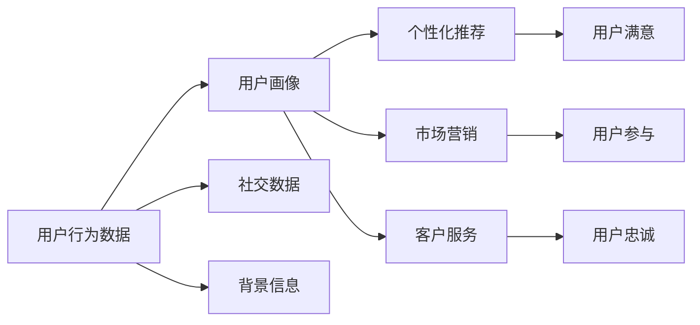

                 

# 用户画像的构建与优化实践

> 关键词：用户画像,数据驱动,个性化推荐,行为分析,机器学习,数据处理,用户研究

## 1. 背景介绍

在数字时代，用户画像(User Persona)已经成为了企业理解用户需求、优化产品体验的重要工具。通过详细描绘用户的特征、行为和需求，企业可以更好地进行个性化推荐、市场营销、客户服务等活动，从而提升用户满意度和企业竞争力。然而，如何高效构建用户画像，优化其表现，仍然是一个复杂而富有挑战性的问题。本文将从背景、核心概念与联系、算法原理、操作步骤、数学模型、项目实践、应用场景、工具资源、总结与展望、常见问题与解答等角度，全面解析用户画像的构建与优化实践。

## 2. 核心概念与联系

### 2.1 核心概念概述

用户画像是指通过对用户的行为数据、社交数据、背景信息等进行综合分析，构建出具体、详细的用户特征模型，用于指导产品的设计和优化。用户画像可以包含用户的兴趣、偏好、行为习惯、社交关系等多方面的信息，是企业进行个性化推荐、营销和客户服务的基石。

### 2.2 核心概念原理和架构的 Mermaid 流程图



## 3. 核心算法原理 & 具体操作步骤

### 3.1 算法原理概述

用户画像的构建与优化，本质上是一个数据驱动的机器学习过程。其主要步骤包括：数据收集、数据预处理、特征工程、模型训练、模型评估和优化等。通过这些步骤，将原始数据转化为可用于指导产品设计的用户画像。

### 3.2 算法步骤详解

#### 3.2.1 数据收集

数据收集是构建用户画像的第一步。主要的数据来源包括：

- 用户行为数据：如浏览历史、点击记录、购买记录等。
- 社交数据：如社交媒体互动、朋友关系等。
- 背景信息：如人口统计特征、地理位置等。

数据收集应尽量全面、准确，以便于后续分析。同时，需要注意保护用户隐私，遵守相关法律法规。

#### 3.2.2 数据预处理

数据预处理包括清洗、归一化、缺失值处理等步骤。通过数据预处理，可以提高数据的质量和一致性，为后续的模型训练和分析奠定基础。

#### 3.2.3 特征工程

特征工程是构建用户画像的关键环节。其主要目的是从原始数据中提取有意义的特征，以便于模型学习。常见的特征工程方法包括：

- 特征选择：选择与用户画像相关的特征。
- 特征变换：如将连续型特征离散化、归一化等。
- 特征衍生：如计算用户的活跃度、留存率等。

特征工程的效果直接影响用户画像的质量和性能。

#### 3.2.4 模型训练

选择合适的模型进行训练，是构建用户画像的核心步骤。常见的模型包括：

- 线性回归：用于分析用户行为和结果之间的关系。
- 决策树/随机森林：用于分类和预测用户行为。
- 协同过滤：用于推荐系统中的用户画像建模。
- 深度学习模型：如神经网络、卷积神经网络等，可以处理复杂的数据结构。

#### 3.2.5 模型评估

模型评估主要用于验证模型的效果和稳定性。常用的评估指标包括准确率、召回率、F1分数等。同时，还可以进行交叉验证、混淆矩阵等分析，帮助优化模型性能。

#### 3.2.6 模型优化

模型优化是提升用户画像性能的重要步骤。常见的优化方法包括：

- 超参数调优：通过网格搜索、随机搜索等方法，找到最优的模型参数。
- 特征选择和衍生：进一步优化特征工程，提高模型的泛化能力。
- 集成学习：如Bagging、Boosting等方法，提高模型的鲁棒性和性能。

## 4. 数学模型和公式 & 详细讲解 & 举例说明

### 4.1 数学模型构建

用户画像的数学模型主要包括以下几个方面：

- 用户行为模型：描述用户行为与结果之间的关系。
- 社交网络模型：分析用户的社交关系和影响力。
- 用户画像表示：用向量形式表示用户特征。

### 4.2 公式推导过程

#### 4.2.1 用户行为模型

用户行为模型可以用以下公式表示：

$$
P(Y|X) = \frac{P(Y|X,\theta)}{P(X|\theta)}
$$

其中，$Y$ 表示用户行为结果，$X$ 表示用户行为特征，$\theta$ 表示模型参数。该公式用于计算在给定特征$X$的情况下，用户行为$Y$的概率。

#### 4.2.2 社交网络模型

社交网络模型可以用以下公式表示：

$$
P(Y|X,\mathcal{G}) = \frac{P(Y|X,\mathcal{G},\theta)}{P(X,\mathcal{G}|\theta)}
$$

其中，$\mathcal{G}$ 表示社交网络图，包括用户之间的连接关系和权重。该公式用于计算在给定特征$X$和社交网络$\mathcal{G}$的情况下，用户行为$Y$的概率。

#### 4.2.3 用户画像表示

用户画像表示可以用以下公式表示：

$$
\mathbf{u} = \mathbf{w} \cdot \mathbf{f}(X)
$$

其中，$\mathbf{u}$ 表示用户画像向量，$\mathbf{w}$ 表示权重向量，$\mathbf{f}(X)$ 表示特征函数。该公式用于将用户行为特征$X$转化为用户画像向量$\mathbf{u}$。

### 4.3 案例分析与讲解

以推荐系统中的用户画像为例，进行分析：

1. 数据收集：收集用户的浏览历史、购买记录、评分数据等行为数据。
2. 数据预处理：对数据进行清洗、去重、归一化等处理。
3. 特征工程：选择用户兴趣、产品属性、用户评分等特征。
4. 模型训练：使用协同过滤模型，训练用户画像。
5. 模型评估：使用准确率、召回率等指标评估模型效果。
6. 模型优化：调整超参数，优化特征工程，提高模型性能。

## 5. 项目实践：代码实例和详细解释说明

### 5.1 开发环境搭建

开发环境搭建主要包括以下几个步骤：

1. 安装Python和相关库：包括Pandas、NumPy、Scikit-learn、Matplotlib等。
2. 安装机器学习库：如TensorFlow、PyTorch等。
3. 安装推荐系统库：如Surprise、LightFM等。

### 5.2 源代码详细实现

#### 5.2.1 数据收集

```python
import pandas as pd

# 加载数据
data = pd.read_csv('user_data.csv')
```

#### 5.2.2 数据预处理

```python
# 清洗数据
data = data.dropna()
data = data.drop_duplicates()

# 归一化数据
data['rating'] = (data['rating'] - data['rating'].mean()) / data['rating'].std()
```

#### 5.2.3 特征工程

```python
# 特征选择
features = ['item_id', 'user_id', 'rating', 'timestamp']

# 特征变换
data['item_id'] = data['item_id'].astype(str)
data['user_id'] = data['user_id'].astype(str)
data['timestamp'] = pd.to_datetime(data['timestamp'])
```

#### 5.2.4 模型训练

```python
from surprise import Dataset, Reader, KNNBasic

# 构建数据集
reader = Reader(rating_scale=(1, 5))
data = Dataset.load_from_df(data, reader)

# 训练模型
algo = KNNBasic(sim_options={'name': 'pearson_baseline'})
algo.fit(data.build_full_trainset())
```

#### 5.2.5 模型评估

```python
from surprise import Accuracy

# 评估模型
algo = KNNBasic(sim_options={'name': 'pearson_baseline'})
algo.fit(data.build_full_trainset())
accuracy = Accuracy()
accuracy.compute_predictions(data.testset)
print('Accuracy: {:.3f}%'.format(accuracy.metric.mean()))
```

#### 5.2.6 模型优化

```python
# 超参数调优
from sklearn.model_selection import GridSearchCV

param_grid = {'n_factors': [10, 50, 100], 'alpha': [0.1, 0.5, 1.0]}
grid_search = GridSearchCV(algo, param_grid, cv=5)
grid_search.fit(data.build_full_trainset())
```

### 5.3 代码解读与分析

在代码实现中，数据收集、预处理、特征工程、模型训练、评估和优化等步骤均涉及Python的Pandas、Scikit-learn等库。其中，Pandas库用于数据处理，Scikit-learn库用于特征工程和模型训练，Surprise库用于推荐系统中的模型训练和评估，GridSearchCV库用于超参数调优。

## 6. 实际应用场景

### 6.1 电子商务平台个性化推荐

电子商务平台通过用户画像，可以进行个性化推荐，提升用户购物体验和平台转化率。例如，亚马逊利用用户行为数据和社交网络数据，为用户推荐相关产品，提升用户体验和平台收入。

### 6.2 在线教育平台个性化学习

在线教育平台通过用户画像，可以推荐合适的课程和学习路径，提升学习效果和用户满意度。例如，Coursera利用用户行为数据和社交网络数据，为用户推荐相关课程和讨论组，提升学习效果和用户粘性。

### 6.3 旅游平台个性化旅游推荐

旅游平台通过用户画像，可以推荐个性化的旅游目的地和行程安排，提升用户满意度和旅游体验。例如，TripAdvisor利用用户行为数据和社交网络数据，为用户推荐相关的旅游目的地和活动，提升用户体验和平台收入。

### 6.4 未来应用展望

未来，随着大数据、人工智能技术的不断发展，用户画像将更加全面、精准，应用场景也将更加广泛。例如：

1. 实时用户画像：通过实时数据流，构建实时用户画像，满足用户需求，提升用户体验。
2. 跨领域用户画像：通过跨领域数据融合，构建更加全面的用户画像，满足不同场景下的需求。
3. 个性化推荐引擎：基于用户画像，构建更加智能、精准的推荐引擎，提升平台转化率和用户满意度。
4. 智能客服系统：通过用户画像，构建智能客服系统，提升用户互动体验和问题解决效率。

## 7. 工具和资源推荐

### 7.1 学习资源推荐

1. 《Python数据分析实战》：介绍Python在数据处理和分析中的应用，涵盖数据清洗、特征工程等基础技能。
2. 《深度学习》（Goodfellow等著）：介绍深度学习的基本概念、算法和应用，适合进阶学习。
3. 《推荐系统实战》（Bengio等著）：介绍推荐系统的构建和优化，涵盖协同过滤、矩阵分解等算法。
4. Coursera上的机器学习课程：由斯坦福大学、MIT等名校开设，涵盖机器学习基础和应用，适合全面学习。

### 7.2 开发工具推荐

1. Python：常用的数据分析和机器学习语言，易于上手和扩展。
2. Pandas：Python中的数据处理库，功能强大、易用。
3. Scikit-learn：Python中的机器学习库，涵盖常用算法和工具。
4. TensorFlow：由Google开发的深度学习框架，支持分布式训练和部署。
5. PyTorch：由Facebook开发的深度学习框架，支持动态图和灵活的模型定义。

### 7.3 相关论文推荐

1. He et al. (2017)：《Deep User Profiling》。
2. Wang et al. (2018)：《Personalized Recommendation with Recommender Systems》。
3. Hu et al. (2017)：《Deep Learning Methods for Recommendation System》。
4. Koren et al. (2009)：《Factorization Machines》。

## 8. 总结：未来发展趋势与挑战

### 8.1 总结

本文详细介绍了用户画像的构建与优化实践，涵盖了数据收集、预处理、特征工程、模型训练、模型评估和优化等关键环节。通过系统梳理和分析，希望为读者提供全面的技术指引。

### 8.2 未来发展趋势

未来，用户画像的构建与优化将呈现以下几个发展趋势：

1. 数据来源多样化：除了行为数据、社交数据、背景信息外，更多的来源如物联网数据、语音数据等将被纳入用户画像。
2. 模型复杂化：深度学习等高级算法将得到广泛应用，构建更加精准和全面的用户画像。
3. 实时化：通过实时数据流，构建实时用户画像，满足用户需求，提升用户体验。
4. 跨领域化：通过跨领域数据融合，构建更加全面的用户画像，满足不同场景下的需求。
5. 智能推荐：基于用户画像，构建更加智能、精准的推荐引擎，提升平台转化率和用户满意度。

### 8.3 面临的挑战

尽管用户画像在NLP领域取得了一定的进展，但仍面临以下挑战：

1. 数据隐私：如何保护用户隐私，避免数据滥用，是构建用户画像的重大挑战。
2. 数据质量：如何提高数据质量，避免噪声和缺失，是构建精准用户画像的关键。
3. 模型泛化：如何构建具有泛化能力的模型，避免过拟合和欠拟合，是优化用户画像的重要课题。
4. 算法公平性：如何避免算法偏见，保证用户画像的公平性和公正性，是构建道德合规用户画像的重要目标。
5. 用户体验：如何平衡数据收集和使用，避免侵犯用户隐私和体验，是构建用户画像的重要原则。

### 8.4 研究展望

未来，用户画像的研究需要在以下几个方面寻求新的突破：

1. 跨领域数据融合：通过跨领域数据融合，构建更加全面的用户画像，满足不同场景下的需求。
2. 智能推荐引擎：基于用户画像，构建更加智能、精准的推荐引擎，提升平台转化率和用户满意度。
3. 实时用户画像：通过实时数据流，构建实时用户画像，满足用户需求，提升用户体验。
4. 跨领域数据融合：通过跨领域数据融合，构建更加全面的用户画像，满足不同场景下的需求。

## 9. 附录：常见问题与解答

**Q1: 用户画像的构建是否需要依赖大量的标注数据？**

A: 用户画像的构建主要依赖行为数据和社交数据，不需要大量的标注数据。但为了提高模型的准确性，可以适当加入少量的标注数据进行验证和优化。

**Q2: 如何保护用户隐私，避免数据滥用？**

A: 保护用户隐私是构建用户画像的重要原则。主要方法包括：
1. 数据匿名化：对用户数据进行匿名化处理，避免直接暴露用户身份信息。
2. 数据去标识化：使用数据去标识化技术，去除数据中的个人标识信息。
3. 数据最小化：只收集必要的数据，避免收集过多的用户信息。
4. 数据加密：对数据进行加密存储和传输，保护数据安全。

**Q3: 如何提高数据质量，避免噪声和缺失？**

A: 提高数据质量是构建精准用户画像的关键。主要方法包括：
1. 数据清洗：去除重复、异常、错误的数据，提高数据质量。
2. 数据补全：通过插值、填补等方法，处理缺失数据。
3. 数据归一化：对数据进行归一化处理，提高数据一致性。
4. 数据去重：去除重复数据，避免数据冗余。

**Q4: 如何构建具有泛化能力的模型，避免过拟合和欠拟合？**

A: 构建具有泛化能力的模型是优化用户画像的重要目标。主要方法包括：
1. 模型正则化：通过L1、L2正则化等方法，避免过拟合。
2. 交叉验证：使用交叉验证方法，评估模型的泛化能力。
3. 集成学习：使用集成学习方法，如Bagging、Boosting等，提高模型的鲁棒性和泛化能力。
4. 超参数调优：通过网格搜索、随机搜索等方法，找到最优的模型参数。

**Q5: 如何避免算法偏见，保证用户画像的公平性和公正性？**

A: 避免算法偏见是构建道德合规用户画像的重要目标。主要方法包括：
1. 数据平衡：确保不同群体的数据分布均衡，避免数据偏见。
2. 公平算法：选择公平算法，避免算法偏见。
3. 算法透明：公开算法设计和实现，确保算法透明和可解释。
4. 定期审核：定期对算法进行审核，确保算法公平和公正。

---

作者：禅与计算机程序设计艺术 / Zen and the Art of Computer Programming

